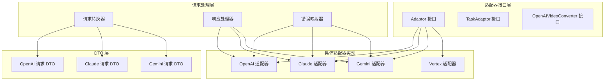
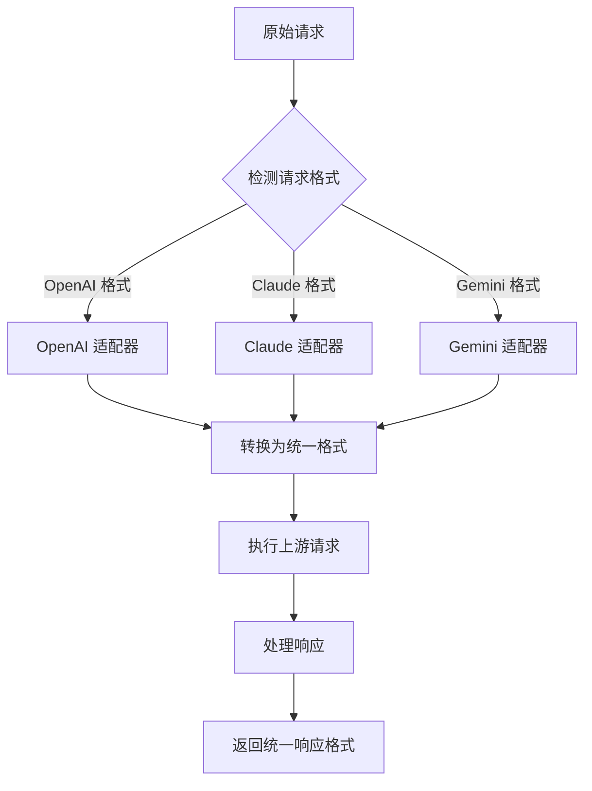
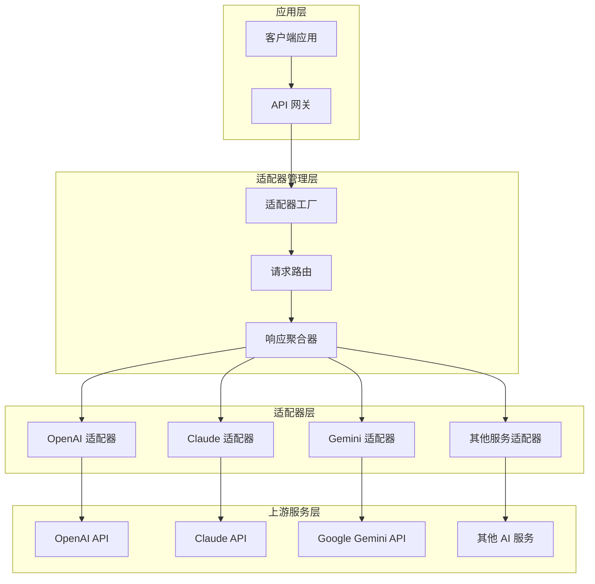
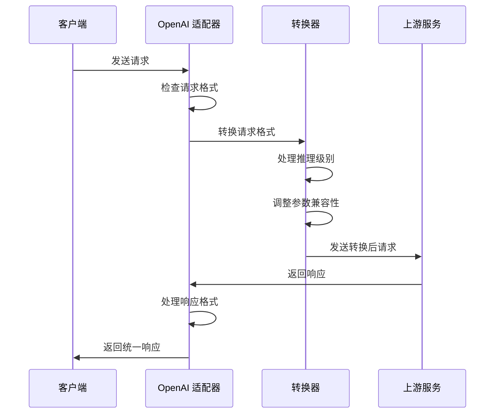
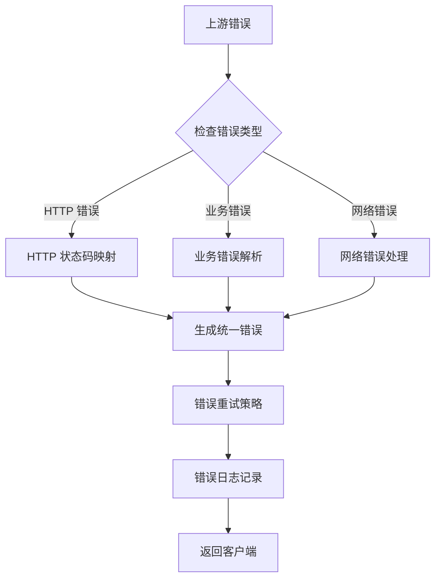
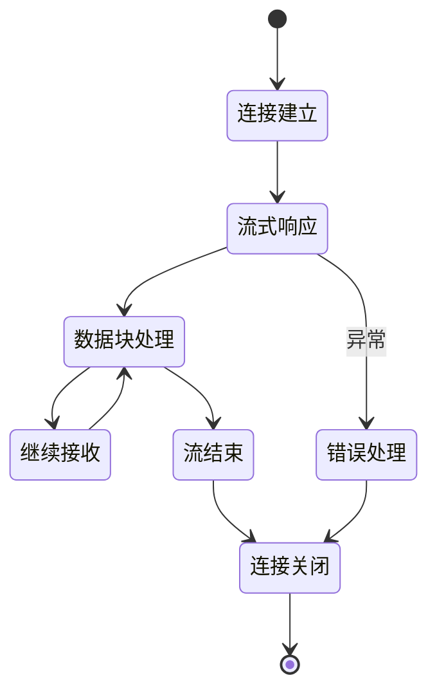
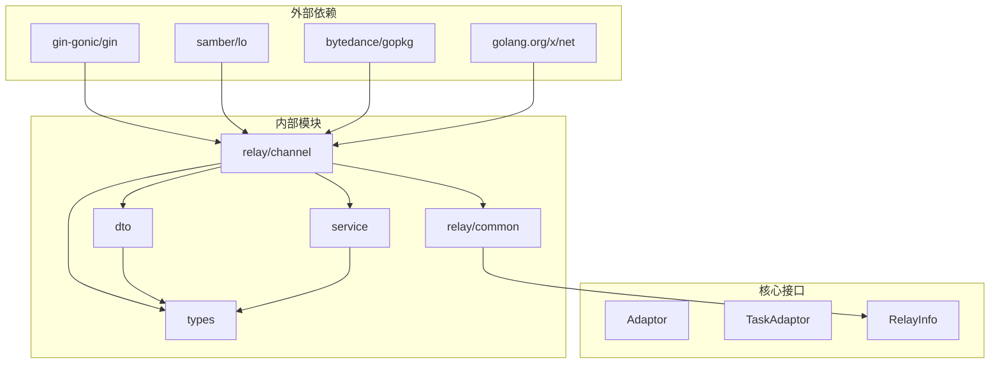
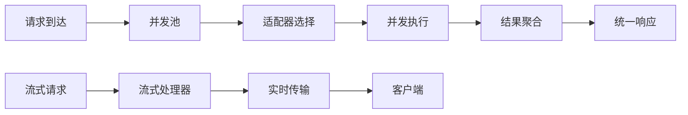
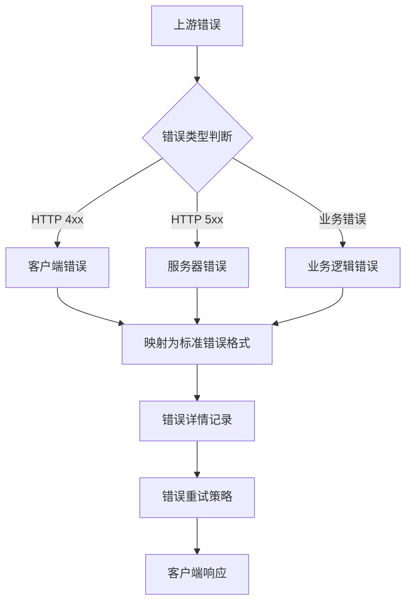

# AI 适配器系统

<cite>
**本文档引用的文件**
- [adapter.go](file://relay/channel/adapter.go)
- [api_request.go](file://relay/channel/api_request.go)
- [openai/adaptor.go](file://relay/channel/openai/adaptor.go)
- [claude/adaptor.go](file://relay/channel/claude/adaptor.go)
- [gemini/adaptor.go](file://relay/channel/gemini/adaptor.go)
- [relay_adaptor.go](file://relay/relay_adaptor.go)
- [claude_handler.go](file://relay/claude_handler.go)
- [gemini_handler.go](file://relay/gemini_handler.go)
- [request_conversion.go](file://relay/common/request_conversion.go)
- [openai_request.go](file://dto/openai_request.go)
- [claude.go](file://dto/claude.go)
- [gemini.go](file://dto/gemini.go)
- [stream_status.go](file://relay/common/stream_status.go)
- [error.go](file://types/error.go)
- [adaptor.go](file://relay/channel/vertex/adaptor.go)
</cite>

## 目录
1. [简介](#简介)
2. [项目结构](#项目结构)
3. [核心组件](#核心组件)
4. [架构概览](#架构概览)
5. [详细组件分析](#详细组件分析)
6. [依赖关系分析](#依赖关系分析)
7. [性能考虑](#性能考虑)
8. [故障排除指南](#故障排除指南)
9. [结论](#结论)

## 简介

New API 的 AI 适配器系统是一个基于适配器模式设计的统一接口层，用于屏蔽不同 AI 服务提供商之间的差异，为上层应用提供一致的调用体验。该系统支持 OpenAI、Claude、Gemini 等主流 AI 服务，通过标准化的请求格式转换、响应处理和错误映射机制，实现了对多种 AI 服务的无缝集成。

系统的核心设计理念是通过适配器模式将不同的 AI 服务接口抽象为统一的接口，使得新增支持新的 AI 服务提供商变得简单而标准化。每个适配器负责处理特定服务的请求格式转换、响应解析和错误处理，同时保持与统一接口的兼容性。

## 项目结构

AI 适配器系统采用模块化设计，主要包含以下核心模块：

**图表来源**
- [adapter.go:15-32](file://relay/channel/adapter.go#L15-L32)
- [openai/adaptor.go:37-40](file://relay/channel/openai/adaptor.go#L37-L40)
- [claude/adaptor.go:19-20](file://relay/channel/claude/adaptor.go#L19-L20)
- [gemini/adaptor.go:23-24](file://relay/channel/gemini/adaptor.go#L23-L24)

**章节来源**
- [adapter.go:1-84](file://relay/channel/adapter.go#L1-L84)
- [relay_adaptor.go:53-125](file://relay/relay_adaptor.go#L53-L125)

## 核心组件

### 适配器接口体系

系统定义了三个核心接口来支持不同类型的 AI 服务适配：

#### Adaptor 接口
这是最基础的适配器接口，定义了所有 AI 适配器必须实现的标准方法：

- `Init`: 初始化适配器配置
- `GetRequestURL`: 生成上游服务的完整请求 URL
- `SetupRequestHeader`: 设置 HTTP 请求头
- `ConvertOpenAIRequest`: 转换 OpenAI 格式的请求
- `ConvertClaudeRequest`: 转换 Claude 格式的请求
- `ConvertGeminiRequest`: 转换 Gemini 格式的请求
- `DoRequest`: 执行实际的 HTTP 请求
- `DoResponse`: 处理上游服务的响应
- `GetModelList`: 获取支持的模型列表
- `GetChannelName`: 获取通道名称

#### TaskAdaptor 接口
专门用于处理异步任务的适配器接口：

- `ValidateRequestAndSetAction`: 验证请求并设置操作类型
- `EstimateBilling`: 预估计费参数
- `AdjustBillingOnSubmit`: 提交后的计费调整
- `AdjustBillingOnComplete`: 完成后的最终计费
- `BuildRequestURL`: 构建任务请求 URL
- `BuildRequestHeader`: 构建任务请求头
- `BuildRequestBody`: 构建任务请求体
- `FetchTask`: 获取任务状态
- `ParseTaskResult`: 解析任务结果

#### OpenAIVideoConverter 接口
专门处理视频相关功能的转换器接口。

**章节来源**
- [adapter.go:15-79](file://relay/channel/adapter.go#L15-L79)

### 请求转换机制

系统提供了强大的请求转换能力，支持不同格式之间的自动转换：

**图表来源**
- [request_conversion.go:8-29](file://relay/common/request_conversion.go#L8-L29)
- [openai/adaptor.go:243-364](file://relay/channel/openai/adaptor.go#L243-L364)

**章节来源**
- [request_conversion.go:1-41](file://relay/common/request_conversion.go#L1-L41)
- [openai/adaptor.go:243-364](file://relay/channel/openai/adaptor.go#L243-L364)

## 架构概览

AI 适配器系统的整体架构采用了分层设计，确保了良好的可扩展性和维护性：

**图表来源**
- [relay_adaptor.go:53-125](file://relay/relay_adaptor.go#L53-L125)
- [api_request.go:290-319](file://relay/channel/api_request.go#L290-L319)

**章节来源**
- [relay_adaptor.go:1-166](file://relay/relay_adaptor.go#L1-L166)
- [api_request.go:28-530](file://relay/channel/api_request.go#L28-L530)

## 详细组件分析

### OpenAI 适配器

OpenAI 适配器是最复杂的适配器之一，支持多种特殊功能：

#### 核心特性
- **多格式支持**: 支持直接转发和格式转换两种模式
- **推理能力适配**: 自动处理推理级别的转换
- **Azure 集成**: 完整支持 Azure OpenAI 服务
- **实时语音**: 支持 WebSocket 实时语音传输

#### 请求转换流程

**图表来源**
- [openai/adaptor.go:243-364](file://relay/channel/openai/adaptor.go#L243-L364)
- [openai/adaptor.go:607-649](file://relay/channel/openai/adaptor.go#L607-L649)

**章节来源**
- [openai/adaptor.go:1-684](file://relay/channel/openai/adaptor.go#L1-L684)

### Claude 适配器

Claude 适配器专注于 Anthropic Claude 系列服务：

#### 关键功能
- **思维模式适配**: 支持 Extended Thinking 功能
- **推理级别**: 自动处理推理级别的转换
- **系统提示**: 支持系统提示的合并和覆盖
- **工具调用**: 完整支持 Claude 工具调用功能

#### 错误处理机制

**图表来源**
- [claude_handler.go:177-183](file://relay/claude_handler.go#L177-L183)
- [error.go:13-25](file://types/error.go#L13-L25)

**章节来源**
- [claude/adaptor.go:1-135](file://relay/channel/claude/adaptor.go#L1-L135)
- [claude_handler.go:1-196](file://relay/claude_handler.go#L1-L196)

### Gemini 适配器

Gemini 适配器提供 Google AI 服务的完整支持：

#### 支持的功能
- **多模态输入**: 支持文本、图像、音频等多种输入格式
- **思维配置**: 支持思考模式的灵活配置
- **批量嵌入**: 支持批量向量嵌入计算
- **图像生成**: 完整支持 Imagen 图像生成

#### 流式响应处理

**图表来源**
- [gemini_handler.go:171-195](file://relay/gemini_handler.go#L171-L195)
- [stream_status.go:31-43](file://relay/common/stream_status.go#L31-L43)

**章节来源**
- [gemini/adaptor.go:1-288](file://relay/channel/gemini/adaptor.go#L1-L288)
- [gemini_handler.go:1-294](file://relay/gemini_handler.go#L1-L294)

### Vertex 适配器

Vertex 适配器提供 Google Cloud Vertex AI 的统一访问：

#### 特殊功能
- **多服务模式**: 支持 Claude、Gemini、OpenSource 三种请求模式
- **智能路由**: 根据请求内容自动选择合适的处理方式
- **混合适配**: 统一处理多种上游服务的差异

**章节来源**
- [adaptor.go:23-422](file://relay/channel/vertex/adaptor.go#L23-L422)

## 依赖关系分析

系统采用松耦合的设计，通过接口隔离具体实现：

**图表来源**
- [adapter.go:3-13](file://relay/channel/adapter.go#L3-L13)
- [api_request.go:3-26](file://relay/channel/api_request.go#L3-L26)

**章节来源**
- [adapter.go:1-84](file://relay/channel/adapter.go#L1-L84)
- [api_request.go:1-555](file://relay/channel/api_request.go#L1-L555)

## 性能考虑

### 流式响应优化

系统实现了高效的流式响应处理机制：

- **Ping 保活**: 自动维持长连接的活跃状态
- **错误恢复**: 断开重连和错误恢复机制
- **内存管理**: 流式数据的高效内存使用

### 并发处理

**图表来源**
- [api_request.go:384-450](file://relay/channel/api_request.go#L384-L450)
- [api_request.go:483-530](file://relay/channel/api_request.go#L483-L530)

### 缓存策略

系统支持多层次的缓存机制：

- **请求缓存**: 避免重复的上游请求
- **响应缓存**: 缓存常用的响应结果
- **模型列表缓存**: 减少模型查询的开销

## 故障排除指南

### 常见错误类型

系统定义了完整的错误处理机制：

#### 错误分类
- **请求错误**: 请求格式或参数问题
- **通道错误**: 通道配置或连接问题  
- **上游错误**: 第三方服务错误
- **系统错误**: 内部系统异常

#### 错误映射规则

**图表来源**
- [error.go:13-25](file://types/error.go#L13-L25)
- [error.go:38-88](file://types/error.go#L38-L88)

**章节来源**
- [error.go:1-418](file://types/error.go#L1-L418)
- [claude_handler.go:177-183](file://relay/claude_handler.go#L177-L183)

### 调试技巧

1. **启用调试模式**: 通过环境变量启用详细的日志输出
2. **请求追踪**: 使用唯一请求 ID 追踪请求处理流程
3. **响应验证**: 检查上游服务的响应格式和状态码
4. **错误分析**: 分析错误日志和堆栈信息

## 结论

New API 的 AI 适配器系统通过精心设计的适配器模式，成功地将多个不同格式的 AI 服务统一到一个标准接口下。系统具有以下优势：

1. **高度可扩展**: 新增 AI 服务提供商只需实现标准接口
2. **强兼容性**: 支持多种请求格式和响应格式的自动转换
3. **健壮性**: 完善的错误处理和重试机制
4. **性能优化**: 流式处理和并发优化确保高吞吐量
5. **易于维护**: 模块化设计便于功能扩展和bug修复

该系统为构建企业级 AI 应用提供了坚实的基础，开发者可以基于此框架快速集成新的 AI 服务提供商，同时享受统一的开发体验和完善的运维保障。