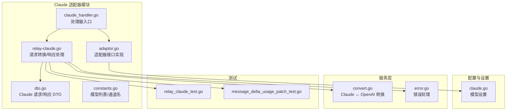
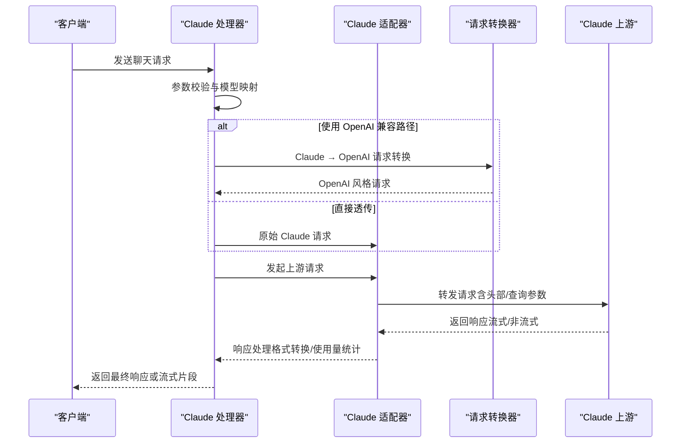
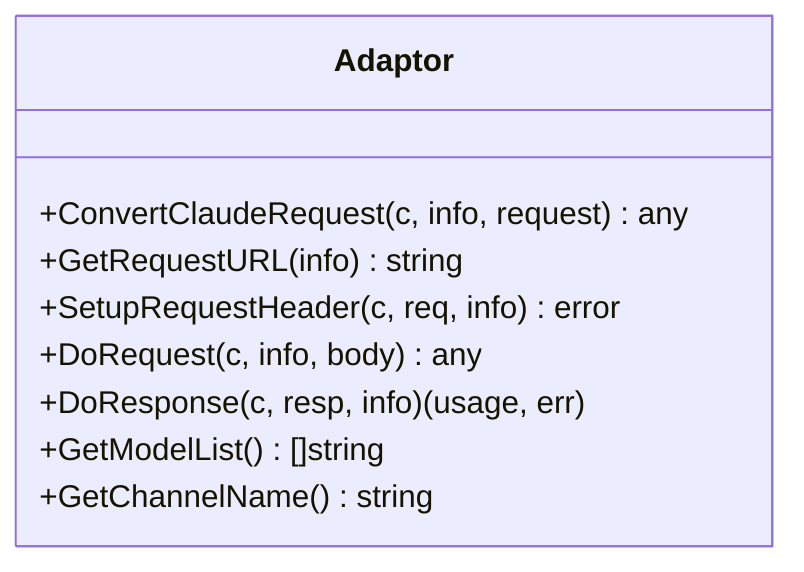
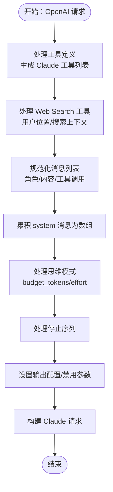
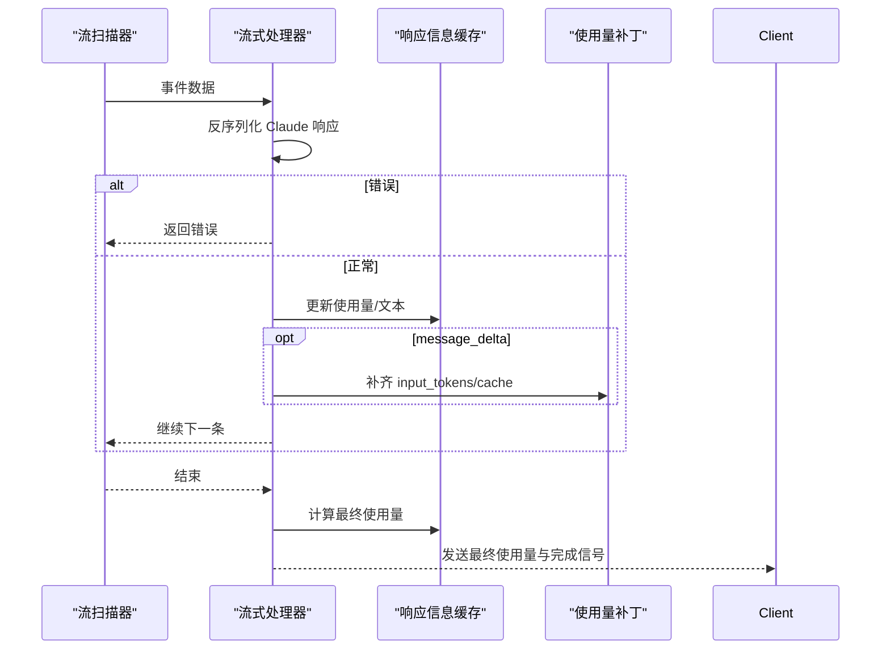
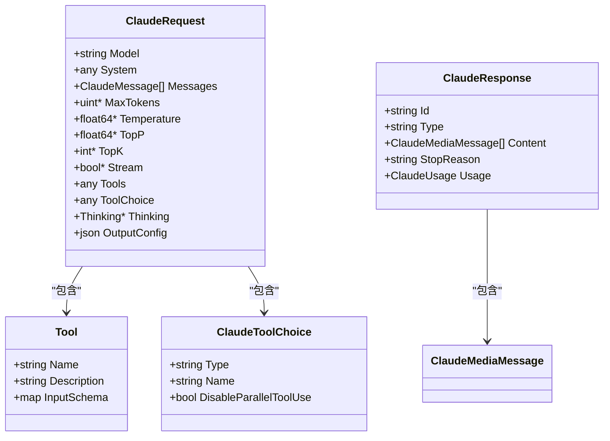
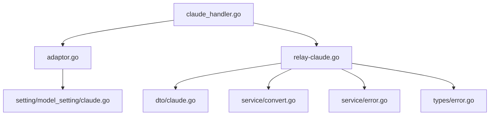

# Claude 适配器

<cite>
**本文档引用的文件**
- [adaptor.go](file://relay/channel/claude/adaptor.go)
- [relay-claude.go](file://relay/channel/claude/relay-claude.go)
- [dto.go](file://relay/channel/claude/dto.go)
- [constants.go](file://relay/channel/claude/constants.go)
- [claude_handler.go](file://relay/claude_handler.go)
- [claude.go](file://dto/claude.go)
- [claude.go](file://setting/model_setting/claude.go)
- [relay_claude_test.go](file://relay/channel/claude/relay_claude_test.go)
- [message_delta_usage_patch_test.go](file://relay/channel/claude/message_delta_usage_patch_test.go)
- [convert.go](file://service/convert.go)
- [error.go](file://service/error.go)
- [error.go](file://types/error.go)
</cite>

## 目录
1. [简介](#简介)
2. [项目结构](#项目结构)
3. [核心组件](#核心组件)
4. [架构概览](#架构概览)
5. [详细组件分析](#详细组件分析)
6. [依赖关系分析](#依赖关系分析)
7. [性能考量](#性能考量)
8. [故障排除指南](#故障排除指南)
9. [结论](#结论)
10. [附录](#附录)

## 简介
本文件为 Claude 适配器的详细技术文档，聚焦于 Anthropic Claude API 的适配实现。内容涵盖：
- 消息 API 请求格式转换与响应处理机制
- Claude 特有参数映射（系统提示词、温度控制、最大输出长度、思维模式、工具调用等）
- 流式响应处理（增量更新与完成信号）
- 与 OpenAI 兼容性差异及适配策略
- 错误处理机制、性能优化建议与常见问题解决方案

## 项目结构
Claude 适配器位于 relay/channel/claude 目录下，核心文件包括适配器实现、请求/响应转换逻辑、DTO 定义以及处理器入口。

**图表来源**
- [adaptor.go:1-135](file://relay/channel/claude/adaptor.go#L1-L135)
- [relay-claude.go:1-991](file://relay/channel/claude/relay-claude.go#L1-L991)
- [dto.go:1-96](file://relay/channel/claude/dto.go#L1-L96)
- [constants.go:1-32](file://relay/channel/claude/constants.go#L1-L32)
- [claude_handler.go:1-196](file://relay/claude_handler.go#L1-L196)
- [claude.go:1-596](file://dto/claude.go#L1-L596)
- [claude.go:1-90](file://setting/model_setting/claude.go#L1-L90)
- [convert.go:1-35](file://service/convert.go#L1-L35)
- [error.go:61-100](file://service/error.go#L61-L100)
- [relay_claude_test.go:1-383](file://relay/channel/claude/relay_claude_test.go#L1-L383)
- [message_delta_usage_patch_test.go:1-130](file://relay/channel/claude/message_delta_usage_patch_test.go#L1-L130)

**章节来源**
- [adaptor.go:1-135](file://relay/channel/claude/adaptor.go#L1-L135)
- [relay-claude.go:1-991](file://relay/channel/claude/relay-claude.go#L1-L991)
- [claude_handler.go:1-196](file://relay/claude_handler.go#L1-L196)

## 核心组件
- 适配器（Adaptor）：负责请求 URL 构造、请求头设置、请求/响应转换与转发。
- 请求转换器：将 OpenAI 风格请求转换为 Claude 请求，处理系统提示、工具、思维模式、停止序列等。
- 响应处理器：处理流式与非流式响应，进行格式转换、使用量统计与错误处理。
- DTO 层：定义 Claude 请求/响应数据结构与工具类型。
- 处理器入口：统一调度适配器与转换逻辑，处理参数覆盖、透传与计费。

**章节来源**
- [adaptor.go:19-135](file://relay/channel/claude/adaptor.go#L19-L135)
- [relay-claude.go:47-416](file://relay/channel/claude/relay-claude.go#L47-L416)
- [claude.go:14-596](file://dto/claude.go#L14-L596)
- [claude_handler.go:24-196](file://relay/claude_handler.go#L24-L196)

## 架构概览
Claude 适配器采用“适配器 + 转换器 + 处理器”的分层设计：
- 适配器层：封装上游 API 细节（URL、头部、请求/响应处理）。
- 转换层：在 OpenAI 与 Claude 之间进行参数与格式映射。
- 处理层：统一入口，负责参数覆盖、透传、错误映射与计费。

**图表来源**
- [claude_handler.go:24-196](file://relay/claude_handler.go#L24-L196)
- [adaptor.go:44-126](file://relay/channel/claude/adaptor.go#L44-L126)
- [relay-claude.go:850-939](file://relay/channel/claude/relay-claude.go#L850-L939)
- [convert.go:17-35](file://service/convert.go#L17-L35)

## 详细组件分析

### 适配器（Adaptor）
- 请求 URL 构造：默认使用 `/v1/messages`，根据配置决定是否附加 beta 查询参数。
- 请求头设置：固定 x-api-key，anthropic-version 默认 2023-06-01；支持 anthropic-beta 透传与模型级自定义头部。
- 请求/响应处理：根据是否流式选择不同的处理函数；非流式直接解析响应并转换；流式通过扫描器逐条处理。

**图表来源**
- [adaptor.go:19-135](file://relay/channel/claude/adaptor.go#L19-L135)

**章节来源**
- [adaptor.go:44-92](file://relay/channel/claude/adaptor.go#L44-L92)
- [adaptor.go:115-126](file://relay/channel/claude/adaptor.go#L115-L126)

### 请求转换（OpenAI → Claude）
- 系统提示词：支持字符串与复合内容（文本/媒体），多条 system 消息会被累积为数组形式。
- 消息格式：自动规范化角色与内容，合并连续相同角色的消息；空内容替换为占位符。
- 工具与工具调用：将 OpenAI 工具定义转换为 Claude 工具；支持 web_search 工具与用户位置信息；工具调用以 tool_use 形式注入。
- 思维模式（Think Mode）：基于模型后缀或 reasoning 参数启用 extended thinking 或 adaptive thinking；自动设置预算令牌与温度约束。
- 停止序列：支持字符串或数组，统一转换为 Claude 的 stop_sequences。
- 输出配置：根据 effort 级别设置 output_config；对特定模型自动移除 top_p 与温度影响。

**图表来源**
- [relay-claude.go:47-416](file://relay/channel/claude/relay-claude.go#L47-L416)

**章节来源**
- [relay-claude.go:47-236](file://relay/channel/claude/relay-claude.go#L47-L236)
- [relay-claude.go:156-222](file://relay/channel/claude/relay-claude.go#L156-L222)

### 响应处理（流式与非流式）
- 流式处理：逐条解析 SSE 数据，识别 message_start/content_block_delta/message_delta 等类型；累计文本与使用量；在 message_delta 时补齐缺失的 input_tokens/cache 字段。
- 非流式处理：解析完整响应，提取内容、停止原因与使用量；按需转换为 OpenAI 风格响应。
- 使用量统计：支持 Claude 原生使用量字段与缓存相关字段的聚合与回退计算。
- 错误处理：捕获上游错误并映射为标准错误结构；标记拒绝原因（refusal）。

**图表来源**
- [relay-claude.go:850-871](file://relay/channel/claude/relay-claude.go#L850-L871)
- [relay-claude.go:765-848](file://relay/channel/claude/relay-claude.go#L765-L848)
- [relay-claude.go:606-691](file://relay/channel/claude/relay-claude.go#L606-L691)

**章节来源**
- [relay-claude.go:850-939](file://relay/channel/claude/relay-claude.go#L850-L939)
- [relay-claude.go:606-763](file://relay/channel/claude/relay-claude.go#L606-L763)

### DTO 定义与兼容性
- Claude 请求/响应结构：支持 content/text/tool_use/document/image 等多种媒体类型；支持 thinking/delta/signature 等扩展字段。
- 工具类型：Tool/ClaudeWebSearchTool/ClaudeToolChoice；支持输入模式与并行工具调用控制。
- OpenAI 风格转换：将 Claude 响应转换为 OpenAI 风格的 choices、tool_calls、reasoning 内容与 finish_reason。

**图表来源**
- [claude.go:206-237](file://dto/claude.go#L206-L237)
- [claude.go:487-501](file://dto/claude.go#L487-L501)
- [claude.go:173-183](file://dto/claude.go#L173-L183)
- [claude.go:200-204](file://dto/claude.go#L200-L204)

**章节来源**
- [claude.go:14-596](file://dto/claude.go#L14-L596)

### 处理器入口（ClaudeHelper）
- 参数校验与模型映射：确保请求类型正确并执行模型映射。
- 思维模式适配：根据模型后缀或配置启用 thinking；设置预算令牌与温度约束。
- OpenAI 兼容路径：当满足条件时将 Claude 请求转换为 OpenAI 风格并通过 responses 路径处理。
- 透传与参数覆盖：支持全局透传与通道级透传；应用参数覆盖规则。
- 错误映射与状态码重写：将上游错误映射为标准错误并可按配置重写状态码。

**章节来源**
- [claude_handler.go:24-196](file://relay/claude_handler.go#L24-L196)

## 依赖关系分析
- 适配器依赖设置模块（模型默认最大令牌、思维适配开关与百分比）。
- 请求转换依赖通用工具（文件转 base64、JSON 操作）、服务层（文件处理、使用量估算）与推理设置（effort 后缀处理）。
- 响应处理依赖流扫描器、使用量构建器与错误包装器。
- 处理器入口依赖适配器、转换器与错误处理服务。

**图表来源**
- [claude_handler.go:1-196](file://relay/claude_handler.go#L1-L196)
- [adaptor.go:1-135](file://relay/channel/claude/adaptor.go#L1-L135)
- [relay-claude.go:1-991](file://relay/channel/claude/relay-claude.go#L1-L991)
- [claude.go:1-596](file://dto/claude.go#L1-L596)
- [claude.go:1-90](file://setting/model_setting/claude.go#L1-L90)
- [convert.go:1-35](file://service/convert.go#L1-L35)
- [error.go:61-100](file://service/error.go#L61-L100)
- [error.go:213-264](file://types/error.go#L213-L264)

**章节来源**
- [claude_handler.go:1-196](file://relay/claude_handler.go#L1-L196)
- [adaptor.go:1-135](file://relay/channel/claude/adaptor.go#L1-L135)
- [relay-claude.go:1-991](file://relay/channel/claude/relay-claude.go#L1-L991)

## 性能考量
- 流式处理：优先使用流式响应以降低延迟与内存占用；仅在必要时进行全文拼接。
- 使用量统计：在 message_delta 时进行增量使用量补丁，避免等待完整响应；对缺失字段进行回退计算。
- 文件处理：在 OpenAI → Claude 转换中对 PDF 等文档类型进行特殊处理，减少不必要的传输与解析成本。
- 参数覆盖：通过参数覆盖减少无效字段传输，提升上游命中率与稳定性。

[本节为通用指导，无需具体文件引用]

## 故障排除指南
- 常见错误类型与映射：
  - 上游错误：捕获并转换为标准错误结构，必要时隐藏敏感信息。
  - 状态码重写：根据配置将上游状态码映射为下游期望值。
- 思维模式相关问题：
  - budget_tokens 过小：确保 max_tokens ≥ 1280；否则自动调整。
  - effort 级别：特定模型前缀支持 adaptive thinking；注意 temperature 与 top_p 的限制。
- 流式响应异常：
  - 使用量字段缺失：在 message_delta 时进行补丁；若仍不完整则进行回退估算。
  - 完成信号丢失：检查 done 标志与最终使用量计算。
- 工具调用问题：
  - 工具定义不匹配：确认工具名称与参数 schema；web_search 工具需正确设置用户位置与搜索上下文。
  - 并行工具调用：根据 tool_choice.type 控制是否允许并行使用。

**章节来源**
- [error.go:61-100](file://service/error.go#L61-L100)
- [error.go:213-264](file://types/error.go#L213-L264)
- [relay-claude.go:168-184](file://relay/channel/claude/relay-claude.go#L168-L184)
- [relay-claude.go:606-691](file://relay/channel/claude/relay-claude.go#L606-L691)
- [relay-claude.go:941-990](file://relay/channel/claude/relay-claude.go#L941-L990)

## 结论
Claude 适配器通过清晰的分层设计实现了与 Anthropic API 的深度集成，同时提供了与 OpenAI 兼容的转换能力。其特性包括：
- 完整的消息与工具转换链路
- 精细的思维模式适配与预算令牌控制
- 强健的流式响应处理与使用量统计
- 可配置的头部与参数覆盖策略
- 全面的错误处理与状态码映射

该实现为上层应用提供了稳定、可扩展且高性能的 Claude 集成方案。

[本节为总结，无需具体文件引用]

## 附录

### Claude 特有参数映射要点
- 系统提示词：支持字符串与复合内容；多条 system 消息累积为数组。
- 温度控制：在思维模式下自动调整温度与 top_p。
- 最大输出长度：未指定时使用模型默认值；思维模式下强制最小值。
- 停止序列：支持字符串或数组，统一转换为 stop_sequences。
- 工具与工具调用：工具定义转换、web_search 工具、用户位置与搜索上下文。
- 输出配置：根据 effort 级别设置 output_config；特定模型移除 top_p 与温度影响。

**章节来源**
- [relay-claude.go:47-236](file://relay/channel/claude/relay-claude.go#L47-L236)
- [relay-claude.go:156-222](file://relay/channel/claude/relay-claude.go#L156-L222)

### 流式响应处理细节
- 事件类型识别：message_start/content_block_start/content_block_delta/message_delta/message_stop。
- 增量更新：累计文本与使用量；在 message_delta 时补齐 input_tokens/cache 字段。
- 完成信号：done 标志与最终使用量计算；必要时进行回退估算。

**章节来源**
- [relay-claude.go:765-848](file://relay/channel/claude/relay-claude.go#L765-L848)
- [relay-claude.go:606-763](file://relay/channel/claude/relay-claude.go#L606-L763)

### 与 OpenAI 兼容性差异与适配策略
- 请求差异：Claude 使用 system/messages；OpenAI 使用 messages；转换时累积 system 并规范化消息。
- 响应差异：Claude 使用 content_blocks；OpenAI 使用 choices/tool_calls；转换时映射内容与工具调用。
- 参数差异：temperature/top_p/top_k/stream 等参数在转换时进行映射与裁剪。
- 适配策略：通过 Claude → OpenAI 转换器与 responses 路径实现兼容；支持透传与参数覆盖。

**章节来源**
- [convert.go:17-35](file://service/convert.go#L17-L35)
- [relay-claude.go:418-500](file://relay/channel/claude/relay-claude.go#L418-L500)
- [claude_handler.go:112-127](file://relay/claude_handler.go#L112-L127)