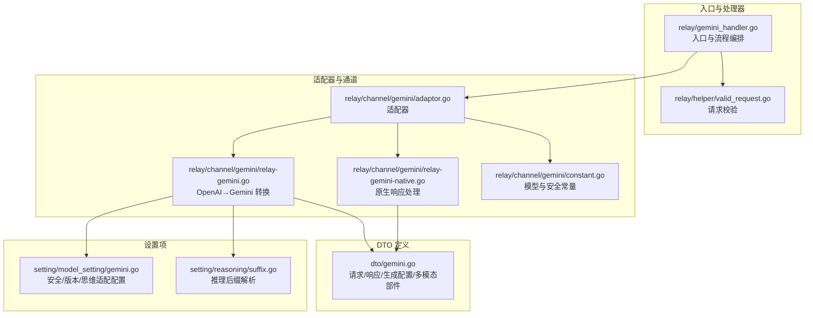
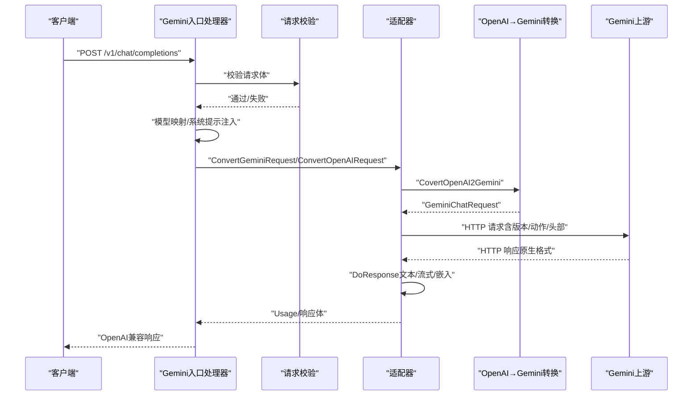
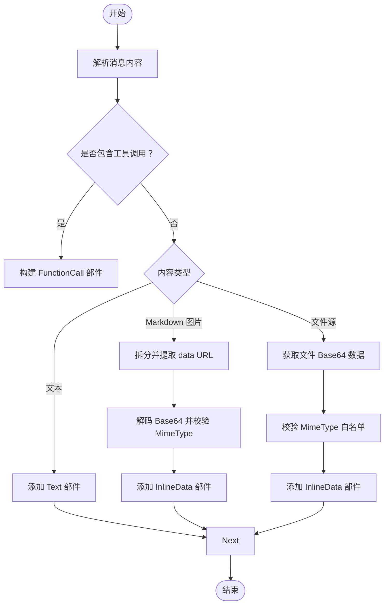
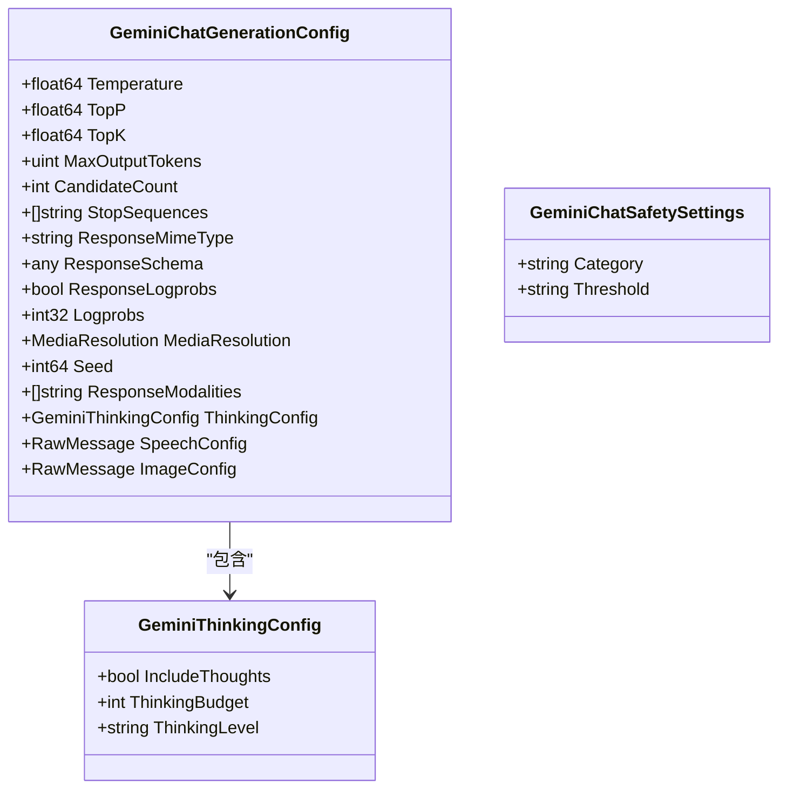
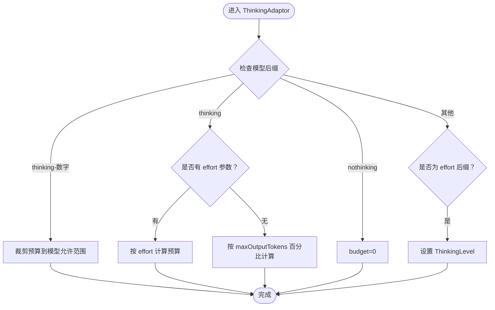
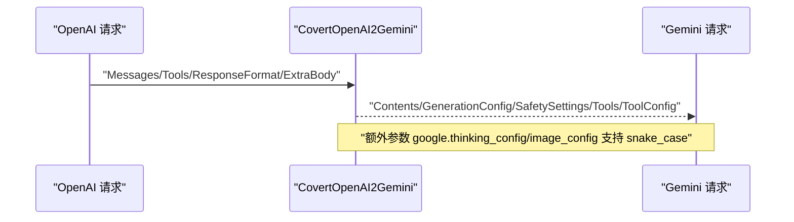
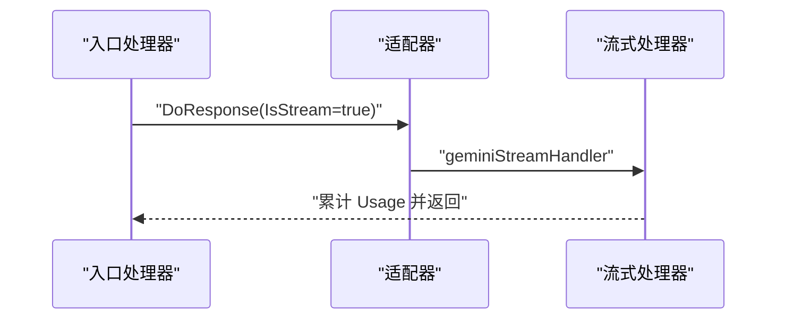
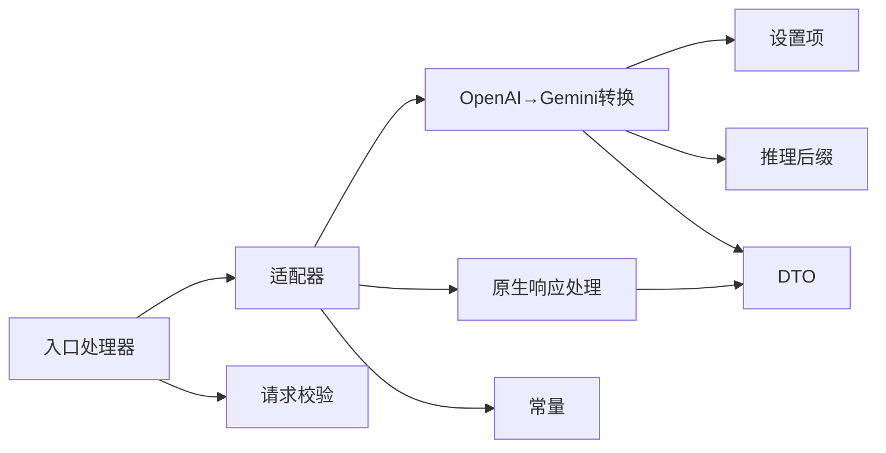

# Gemini 适配器

<cite>
**本文引用的文件**
- [dto/gemini.go](file://dto/gemini.go)
- [relay/channel/gemini/adaptor.go](file://relay/channel/gemini/adaptor.go)
- [relay/channel/gemini/relay-gemini.go](file://relay/channel/gemini/relay-gemini.go)
- [relay/channel/gemini/relay-gemini-native.go](file://relay/channel/gemini/relay-gemini-native.go)
- [relay/channel/gemini/constant.go](file://relay/channel/gemini/constant.go)
- [relay/gemini_handler.go](file://relay/gemini_handler.go)
- [setting/model_setting/gemini.go](file://setting/model_setting/gemini.go)
- [relay/helper/valid_request.go](file://relay/helper/valid_request.go)
- [setting/reasoning/suffix.go](file://setting/reasoning/suffix.go)
- [relay/channel/gemini/relay_gemini_usage_test.go](file://relay/channel/gemini/relay_gemini_usage_test.go)
- [dto/gemini_generation_config_test.go](file://dto/gemini_generation_config_test.go)
- [dto/gemini_isstream_test.go](file://dto/gemini_isstream_test.go)
</cite>

## 目录
1. [简介](#简介)
2. [项目结构](#项目结构)
3. [核心组件](#核心组件)
4. [架构总览](#架构总览)
5. [详细组件分析](#详细组件分析)
6. [依赖关系分析](#依赖关系分析)
7. [性能考量](#性能考量)
8. [故障排查指南](#故障排查指南)
9. [结论](#结论)
10. [附录](#附录)

## 简介
本文件面向 Gemini 适配器的技术文档，系统阐述 Google Gemini API 的适配实现，覆盖对话模式、多模态输入与输出、生成配置映射、安全与内容限制、思维模式（Reasoning）支持、与 OpenAI 兼容性策略、流式响应处理、错误处理与性能优化等关键主题。读者可据此理解从上游 OpenAI 请求到下游 Gemini 原生请求的转换流程、参数映射规则、以及响应格式转换与计费统计。

## 项目结构
围绕 Gemini 的适配主要分布在以下模块：
- DTO 定义：统一承载 Gemini 请求/响应结构、多模态部件、生成配置、思维配置等
- 适配器与通道：负责请求转换、URL 构建、头部设置、请求/响应处理
- 处理器：入口层，负责参数校验、模型映射、请求体转换、调用上游并回传结果
- 设置项：安全阈值、版本选择、思维适配开关、函数调用签名等
- 辅助工具：请求体校验、推理后缀解析、流式处理等

**图表来源**
- [relay/gemini_handler.go:55-199](file://relay/gemini_handler.go#L55-L199)
- [relay/helper/valid_request.go:20-55](file://relay/helper/valid_request.go#L20-L55)
- [relay/channel/gemini/adaptor.go:26-288](file://relay/channel/gemini/adaptor.go#L26-L288)
- [relay/channel/gemini/relay-gemini.go:200-645](file://relay/channel/gemini/relay-gemini.go#L200-L645)
- [relay/channel/gemini/relay-gemini-native.go:20-98](file://relay/channel/gemini/relay-gemini-native.go#L20-L98)
- [dto/gemini.go:14-581](file://dto/gemini.go#L14-L581)
- [setting/model_setting/gemini.go:7-77](file://setting/model_setting/gemini.go#L7-L77)
- [setting/reasoning/suffix.go:9-21](file://setting/reasoning/suffix.go#L9-L21)

**章节来源**
- [relay/gemini_handler.go:55-199](file://relay/gemini_handler.go#L55-L199)
- [relay/channel/gemini/adaptor.go:26-288](file://relay/channel/gemini/adaptor.go#L26-L288)
- [dto/gemini.go:14-581](file://dto/gemini.go#L14-L581)

## 核心组件
- DTO 层：定义 GeminiChatRequest/GeminiChatResponse、Contents/Prompts/Parts、GenerationConfig、SafetySettings、ThinkingConfig、InlineData、FunctionCall/Response 等结构，并提供 IsStream、GetTokenCountMeta 等辅助方法
- 适配器层：负责将 OpenAI 风格请求转换为 Gemini 原生请求；构建请求 URL（含版本与动作）、设置请求头（含 API Key）、处理响应（文本/流式/嵌入）
- 处理器层：统一入口，执行模型映射、系统提示注入、请求体转换、调用上游、错误处理与用量统计
- 设置层：安全阈值、版本选择、思维适配开关、函数调用签名与 ID 移除策略等

**章节来源**
- [dto/gemini.go:14-581](file://dto/gemini.go#L14-L581)
- [relay/channel/gemini/adaptor.go:26-288](file://relay/channel/gemini/adaptor.go#L26-L288)
- [relay/gemini_handler.go:55-199](file://relay/gemini_handler.go#L55-L199)
- [setting/model_setting/gemini.go:7-77](file://setting/model_setting/gemini.go#L7-L77)

## 架构总览
下图展示了从客户端请求到上游 Gemini 的完整链路，包括 OpenAI→Gemini 参数映射、思维模式适配、多模态处理与响应转换。

**图表来源**
- [relay/gemini_handler.go:55-199](file://relay/gemini_handler.go#L55-L199)
- [relay/channel/gemini/adaptor.go:179-279](file://relay/channel/gemini/adaptor.go#L179-L279)
- [relay/channel/gemini/relay-gemini.go:200-645](file://relay/channel/gemini/relay-gemini.go#L200-L645)

## 详细组件分析

### 对话模式与多模态输入
- 角色映射：assistant 映射为 model，user 保持不变；system/developer 合并为 systemInstruction
- 内容部件 Parts 支持文本、内联数据（inlineData）、函数调用/响应、文件数据（fileData）、可执行代码与执行结果等
- 多模态输入校验：对 MimeType 进行白名单校验，不支持的类型直接报错
- Markdown 图片：自动识别并转为 inlineData，同时保留 ThoughtSignature 签名（按配置）

**图表来源**
- [relay/channel/gemini/relay-gemini.go:446-632](file://relay/channel/gemini/relay-gemini.go#L446-L632)
- [dto/gemini.go:268-308](file://dto/gemini.go#L268-L308)

**章节来源**
- [relay/channel/gemini/relay-gemini.go:446-632](file://relay/channel/gemini/relay-gemini.go#L446-L632)
- [dto/gemini.go:268-308](file://dto/gemini.go#L268-L308)

### 生成配置与安全设置映射
- 温度/采样参数：Temperature、TopP、TopK、MaxOutputTokens、CandidateCount、Seed 等直接映射
- 停止序列：最多 5 个，超出截断
- 安全设置：默认关闭（OFF），按类别批量生成
- JSON Schema 输出：当 response_format 为 json_schema/json_object 时，设置 responseMimeType 为 application/json，并清洗参数 Schema
- 工具与函数调用：将 OpenAI 的 Tools/ToolChoice 映射为 Gemini 的 Tools/ToolConfig（functionCallingConfig）

**图表来源**
- [dto/gemini.go:328-349](file://dto/gemini.go#L328-L349)
- [dto/gemini.go:161-166](file://dto/gemini.go#L161-L166)
- [dto/gemini.go:315-318](file://dto/gemini.go#L315-L318)

**章节来源**
- [relay/channel/gemini/relay-gemini.go:200-445](file://relay/channel/gemini/relay-gemini.go#L200-L445)
- [dto/gemini.go:328-349](file://dto/gemini.go#L328-L349)

### 思维模式（Reasoning）支持
- 思维预算与级别：支持 -thinking-<budget>、-thinking、-nothinking 后缀，以及 effort 级别后缀（-max/-high/-medium/-low/-minimal）
- 预算裁剪：按模型类型（如 gemini-2.5-flash-lite、gemini-2.5-pro）裁剪到允许范围
- 自动适配：未显式配置时，根据 maxOutputTokens 百分比或 effort 级别自动计算预算
- 禁用思维：nothinking 模型强制 budget=0

**图表来源**
- [relay/channel/gemini/relay-gemini.go:134-198](file://relay/channel/gemini/relay-gemini.go#L134-L198)
- [setting/reasoning/suffix.go:11-21](file://setting/reasoning/suffix.go#L11-L21)
- [setting/model_setting/gemini.go:12-14](file://setting/model_setting/gemini.go#L12-L14)

**章节来源**
- [relay/channel/gemini/relay-gemini.go:134-198](file://relay/channel/gemini/relay-gemini.go#L134-L198)
- [setting/reasoning/suffix.go:11-21](file://setting/reasoning/suffix.go#L11-L21)
- [setting/model_setting/gemini.go:12-14](file://setting/model_setting/gemini.go#L12-L14)

### 与 OpenAI 兼容性策略
- 请求转换：ConvertOpenAIRequest → CovertOpenAI2Gemini，将 OpenAI Messages/Tools/ResponseFormat 等映射为 Gemini 结构
- 响应转换：DoResponse 根据是否流式、是否嵌入、是否原生路径，分别调用对应处理器
- 参数覆盖：支持 PassThroughRequest 与 ParamOverride，允许透传原始请求体或参数覆盖
- 系统提示：支持覆盖或追加系统提示，确保上下文一致性

**图表来源**
- [relay/channel/gemini/adaptor.go:179-190](file://relay/channel/gemini/adaptor.go#L179-L190)
- [relay/channel/gemini/relay-gemini.go:200-445](file://relay/channel/gemini/relay-gemini.go#L200-L445)

**章节来源**
- [relay/channel/gemini/adaptor.go:179-190](file://relay/channel/gemini/adaptor.go#L179-L190)
- [relay/channel/gemini/relay-gemini.go:200-445](file://relay/channel/gemini/relay-gemini.go#L200-L445)

### 流式响应处理
- URL 动作：当 IsStream 为真时，使用 :streamGenerateContent?alt=sse
- 处理器：GeminiTextGenerationStreamHandler → geminiStreamHandler，逐块写入 SSE 数据
- 计费统计：按 UsageMetadata 计算 Prompt/Completion/Total Tokens，其中 Completion 不包含 tool_use_prompt_tokens

**图表来源**
- [relay/channel/gemini/adaptor.go:249-279](file://relay/channel/gemini/adaptor.go#L249-L279)
- [relay/channel/gemini/relay-gemini-native.go:85-98](file://relay/channel/gemini/relay-gemini-native.go#L85-L98)
- [relay/channel/gemini/relay_gemini_usage_test.go:69-125](file://relay/channel/gemini/relay_gemini_usage_test.go#L69-L125)

**章节来源**
- [relay/channel/gemini/relay-gemini-native.go:85-98](file://relay/channel/gemini/relay-gemini-native.go#L85-L98)
- [relay/channel/gemini/relay_gemini_usage_test.go:69-125](file://relay/channel/gemini/relay_gemini_usage_test.go#L69-L125)

### 错误处理与状态码映射
- 入口层：DoRequest 失败返回 OpenAI 风格错误；上游非 200 由 RelayErrorHandler 处理并可重写状态码
- 原生阻断：若返回 BlockReason，写入上下文键以便上层识别
- 参数校验：GetAndValidateGeminiRequest/Embedding/BatchEmbedding 校验必填字段

**章节来源**
- [relay/gemini_handler.go:171-198](file://relay/gemini_handler.go#L171-L198)
- [relay/channel/gemini/relay-gemini-native.go:40-43](file://relay/channel/gemini/relay-gemini-native.go#L40-L43)
- [relay/helper/valid_request.go:308-341](file://relay/helper/valid_request.go#L308-L341)

### 用量统计与计费
- 文本/流式/原生文本：均从 UsageMetadata 中提取 Prompt/Candidates/Total/Reasoning Tokens
- 嵌入：按文本估算用量，支持批量嵌入
- 测试覆盖：包含缺失 PromptToken 时使用估计值、排除 tool_use_prompt_tokens 的 Completion Token 计算

**章节来源**
- [relay/channel/gemini/relay-gemini-native.go:20-98](file://relay/channel/gemini/relay-gemini-native.go#L20-L98)
- [relay/channel/gemini/relay_gemini_usage_test.go:19-175](file://relay/channel/gemini/relay_gemini_usage_test.go#L19-L175)

## 依赖关系分析
- 适配器依赖设置项（安全阈值、版本、思维适配开关）、推理后缀解析、常量（模型列表、安全类别）
- 转换器依赖服务层（文件解码、Base64 获取）、辅助工具（参数清理、Schema 清洗）
- 处理器依赖适配器与通道设置，负责整体流程编排

**图表来源**
- [relay/channel/gemini/adaptor.go:26-288](file://relay/channel/gemini/adaptor.go#L26-L288)
- [relay/channel/gemini/relay-gemini.go:200-645](file://relay/channel/gemini/relay-gemini.go#L200-L645)
- [setting/model_setting/gemini.go:7-77](file://setting/model_setting/gemini.go#L7-L77)
- [setting/reasoning/suffix.go:9-21](file://setting/reasoning/suffix.go#L9-L21)
- [dto/gemini.go:14-581](file://dto/gemini.go#L14-L581)

**章节来源**
- [relay/channel/gemini/adaptor.go:26-288](file://relay/channel/gemini/adaptor.go#L26-L288)
- [relay/channel/gemini/relay-gemini.go:200-645](file://relay/channel/gemini/relay-gemini.go#L200-L645)

## 性能考量
- 多模态输入：对 Markdown 图片进行拆分与 Base64 解码，注意大文本性能，必要时限制输入长度
- MimeType 校验：白名单校验避免无效类型导致的上游拒绝
- 流式传输：SSE 分块写入，注意网络抖动与超时控制
- 参数清理：函数参数 Schema 递归清理，避免深层结构带来的处理开销
- 预估用量：缺失 UsageMetadata 时使用估计 Prompt Tokens，减少上游查询成本

[本节为通用指导，无需特定文件引用]

## 故障排查指南
- 请求体解析失败：检查请求格式与 RelayFormat，确认是否命中 Gemini Embedding/BatchEmbedding 路径
- 多模态类型不支持：查看 MimeType 白名单，修正上传类型
- 思维预算异常：确认模型后缀与 effort 级别，检查预算裁剪范围
- 响应阻断：关注 BlockReason 上下文键，定位安全策略触发原因
- 流式中断：检查 Content-Type 与 SSE 格式，确认禁用 Ping 与超时设置

**章节来源**
- [relay/helper/valid_request.go:20-55](file://relay/helper/valid_request.go#L20-L55)
- [relay/channel/gemini/relay-gemini.go:598-601](file://relay/channel/gemini/relay-gemini.go#L598-L601)
- [relay/channel/gemini/relay-gemini-native.go:40-43](file://relay/channel/gemini/relay-gemini-native.go#L40-L43)
- [relay/channel/gemini/adaptor.go:164-170](file://relay/channel/gemini/adaptor.go#L164-L170)

## 结论
该适配器完整实现了从 OpenAI 风格请求到 Gemini 原生请求的转换，覆盖对话、多模态、生成配置、安全与内容限制、思维模式、流式与嵌入等多种场景。通过参数映射、Schema 清洗、思维预算裁剪与流式 SSE 处理，既保证了与上游 API 的兼容性，也满足了下游计费与可观测性需求。建议在生产环境中结合设置项与测试用例持续验证参数边界与性能表现。

## 附录

### 关键参数映射与行为要点
- 生成配置零值保留：camelCase/snake_case 的 topP/topK/maxOutputTokens/candidateCount/seed/responseLogprobs 等显式 0 值会被保留
- 流式判断：URL 包含 streamGenerateContent 或 alt=sse 即为流式
- 嵌入：embedContent/batchEmbedContents 路径区分单条与批量
- 推理后缀：支持 effort 级别后缀与 -thinking/-nothinking 后缀组合

**章节来源**
- [dto/gemini_generation_config_test.go:11-89](file://dto/gemini_generation_config_test.go#L11-L89)
- [dto/gemini_isstream_test.go:12-73](file://dto/gemini_isstream_test.go#L12-L73)
- [relay/channel/gemini/constant.go:3-44](file://relay/channel/gemini/constant.go#L3-L44)