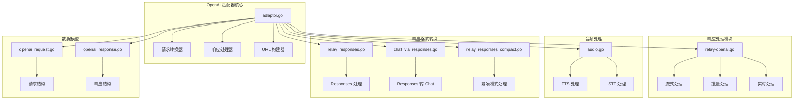
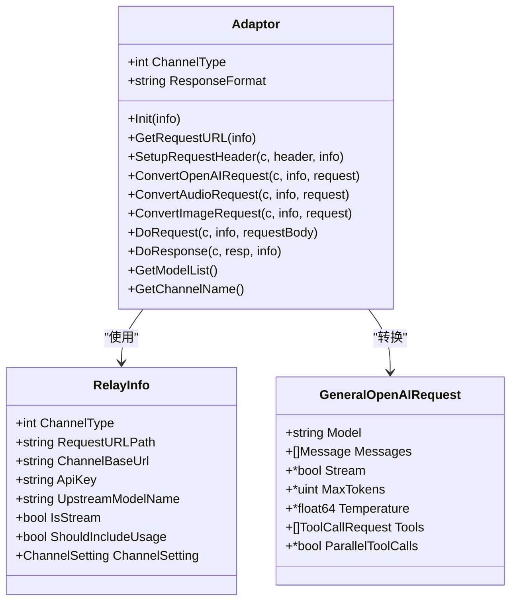
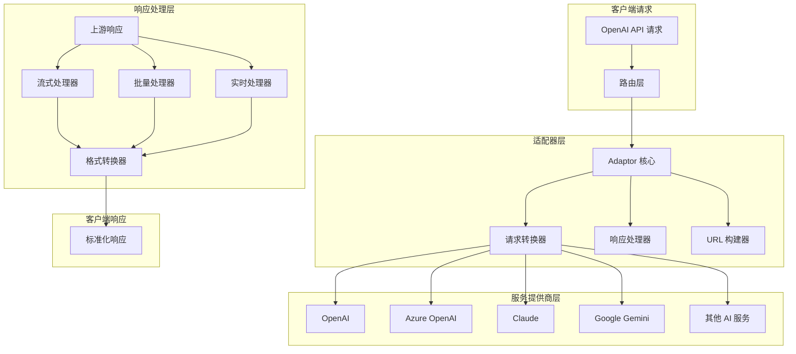
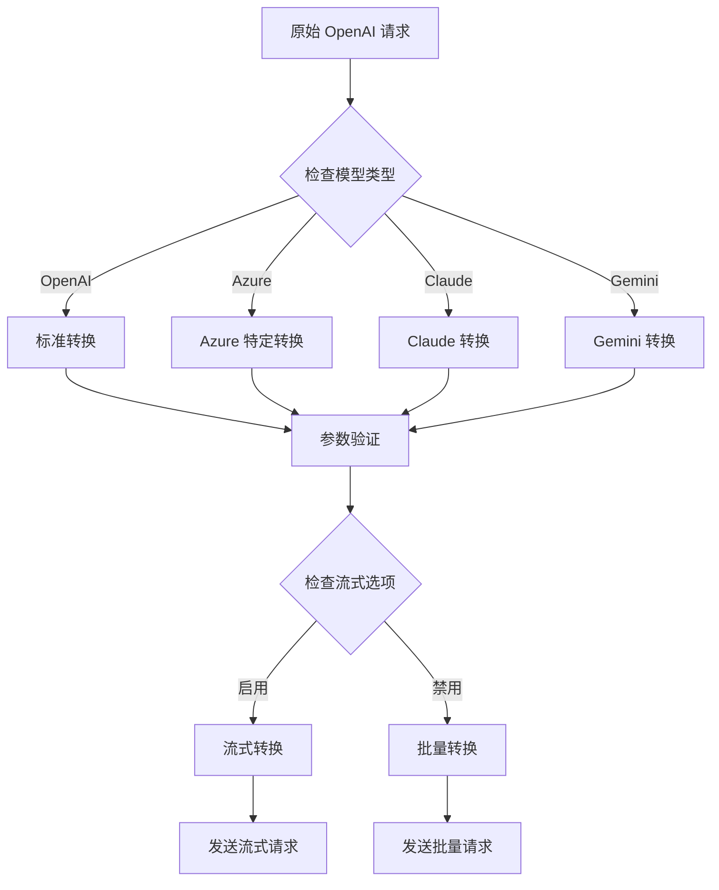
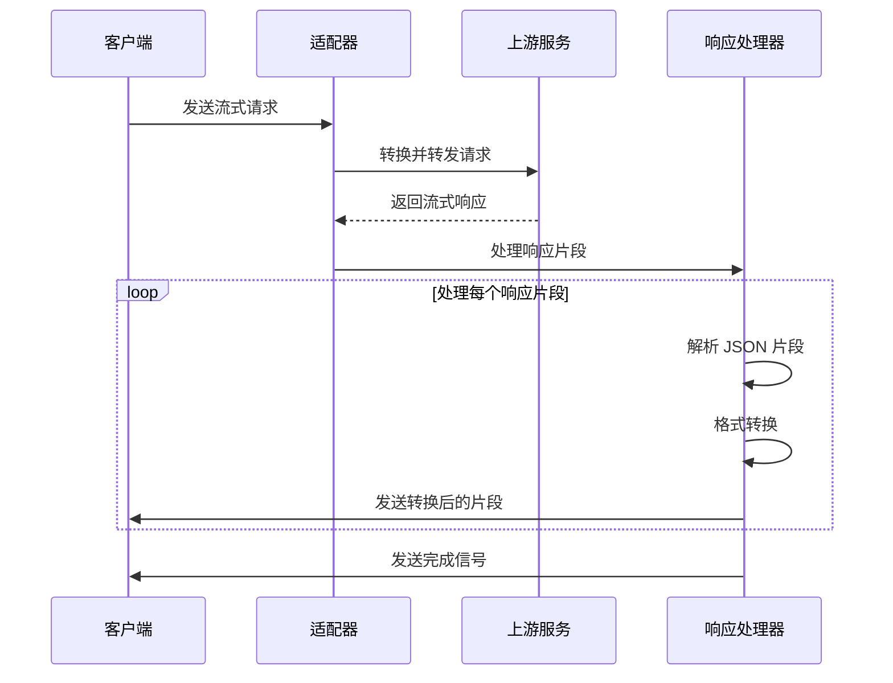
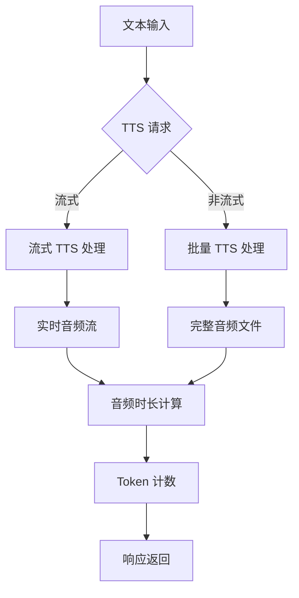
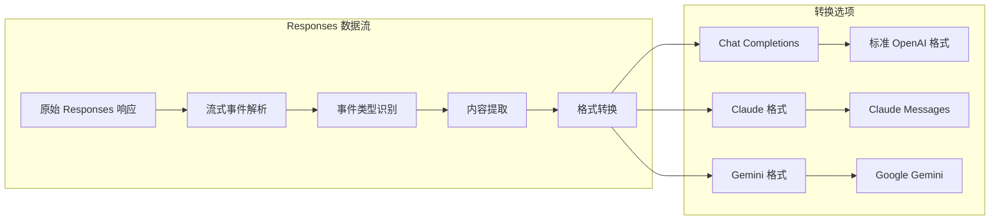
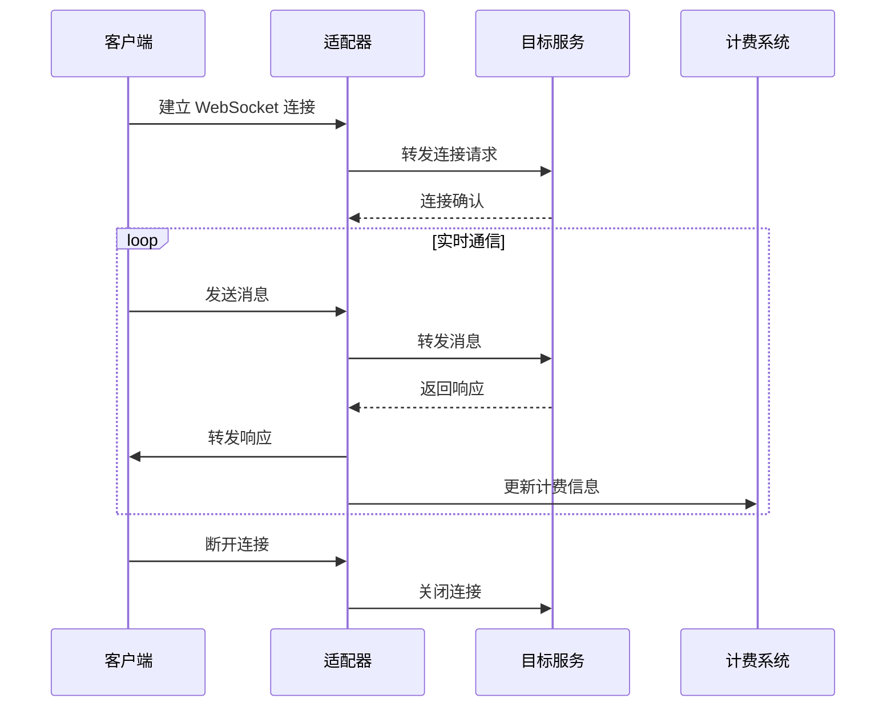
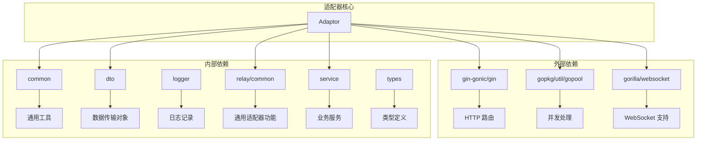

# OpenAI 适配器

<cite>
**本文档引用的文件**
- [adaptor.go](file://relay/channel/openai/adaptor.go)
- [relay-openai.go](file://relay/channel/openai/relay-openai.go)
- [openai_request.go](file://dto/openai_request.go)
- [openai_response.go](file://dto/openai_response.go)
- [audio.go](file://relay/channel/openai/audio.go)
- [constant.go](file://relay/channel/openai/constant.go)
- [helper.go](file://relay/channel/openai/helper.go)
- [relay_responses.go](file://relay/channel/openai/relay_responses.go)
- [relay_responses_compact.go](file://relay/channel/openai/relay_responses_compact.go)
- [chat_via_responses.go](file://relay/channel/openai/chat_via_responses.go)
</cite>

## 目录
1. [简介](#简介)
2. [项目结构](#项目结构)
3. [核心组件](#核心组件)
4. [架构概览](#架构概览)
5. [详细组件分析](#详细组件分析)
6. [依赖关系分析](#依赖关系分析)
7. [性能考虑](#性能考虑)
8. [故障排除指南](#故障排除指南)
9. [结论](#结论)

## 简介

OpenAI 适配器是 NewAPI 项目中的核心模块，负责将标准 OpenAI API 请求转换为各种下游 AI 服务提供商的兼容格式。该适配器支持多种 AI 模型服务，包括 OpenAI、Azure OpenAI、Claude、Google Gemini 等，并提供了完整的请求格式转换、响应处理和兼容性支持。

该适配器的主要功能包括：
- OpenAI API 格式转换
- 多种 AI 服务提供商的兼容支持
- 流式响应处理
- 音频处理（TTS/STT）
- 图像生成和编辑
- OpenAI Responses API 支持
- 实时对话功能

## 项目结构

OpenAI 适配器位于 `relay/channel/openai/` 目录下，采用模块化设计，每个功能模块都有独立的文件：

**图表来源**
- [adaptor.go:1-684](file://relay/channel/openai/adaptor.go#L1-L684)
- [relay-openai.go:1-719](file://relay/channel/openai/relay-openai.go#L1-L719)

**章节来源**
- [adaptor.go:1-684](file://relay/channel/openai/adaptor.go#L1-L684)
- [constant.go:1-77](file://relay/channel/openai/constant.go#L1-L77)

## 核心组件

### Adaptor 结构体

Adaptor 是 OpenAI 适配器的核心结构体，负责协调整个适配过程：

**图表来源**
- [adaptor.go:37-40](file://relay/channel/openai/adaptor.go#L37-L40)
- [openai_request.go:29-109](file://dto/openai_request.go#L29-L109)

### 请求转换机制

OpenAI 适配器实现了多层次的请求转换机制：

1. **基础请求转换**：将标准 OpenAI 请求转换为目标服务格式
2. **模型特定转换**：针对不同模型进行参数调整
3. **格式兼容转换**：支持 OpenAI、Claude、Gemini 等格式互转

**章节来源**
- [adaptor.go:243-364](file://relay/channel/openai/adaptor.go#L243-L364)
- [openai_request.go:29-109](file://dto/openai_request.go#L29-L109)

## 架构概览

OpenAI 适配器采用分层架构设计，确保了良好的可扩展性和维护性：

**图表来源**
- [adaptor.go:111-187](file://relay/channel/openai/adaptor.go#L111-L187)
- [relay-openai.go:106-193](file://relay/channel/openai/relay-openai.go#L106-L193)

## 详细组件分析

### 请求格式转换

#### OpenAI 请求转换

OpenAI 适配器支持多种请求格式转换：

**图表来源**
- [adaptor.go:243-364](file://relay/channel/openai/adaptor.go#L243-L364)
- [helper.go:21-34](file://relay/channel/openai/helper.go#L21-L34)

#### 模型特定参数处理

针对不同模型的特殊参数处理：

| 模型系列 | 特殊处理 | 参数调整 |
|---------|---------|---------|
| OpenAI o 系列 | reasoning_effort 支持 | 自动解析推理级别后缀 |
| GPT-5 系列 | 参数归零 | 温度、TopP、LogProbs 设置为 nil |
| Claude 思考模型 | THINKING 参数 | 转换为 Claude 标准格式 |
| OpenRouter | thinking 后缀 | 自动适配推理模式 |

**章节来源**
- [adaptor.go:327-361](file://relay/channel/openai/adaptor.go#L327-L361)

### 响应处理流程

#### 流式响应处理

OpenAI 适配器提供了强大的流式响应处理能力：

**图表来源**
- [relay-openai.go:106-193](file://relay/channel/openai/relay-openai.go#L106-L193)
- [helper.go:21-34](file://relay/channel/openai/helper.go#L21-L34)

#### 批量响应处理

对于非流式的批量响应，适配器提供了完整的处理流程：

**章节来源**
- [relay-openai.go:195-300](file://relay/channel/openai/relay-openai.go#L195-L300)

### 音频处理功能

#### 文本转语音 (TTS)

OpenAI 适配器支持多种音频格式的文本转语音处理：

**图表来源**
- [audio.go:21-112](file://relay/channel/openai/audio.go#L21-L112)

#### 语音转文本 (STT)

语音转文本功能支持多种音频格式：

**章节来源**
- [audio.go:114-146](file://relay/channel/openai/audio.go#L114-L146)

### OpenAI Responses API 支持

#### Responses 格式处理

OpenAI Responses API 提供了更灵活的响应格式：

**图表来源**
- [chat_via_responses.go:93-551](file://relay/channel/openai/chat_via_responses.go#L93-L551)

**章节来源**
- [relay_responses.go:20-151](file://relay/channel/openai/relay_responses.go#L20-L151)
- [relay_responses_compact.go:15-45](file://relay/channel/openai/relay_responses_compact.go#L15-L45)

### 实时对话功能

#### WebSocket 实时连接

OpenAI 适配器支持实时对话功能，通过 WebSocket 实现：

**图表来源**
- [relay-openai.go:335-540](file://relay/channel/openai/relay-openai.go#L335-L540)

**章节来源**
- [relay-openai.go:335-540](file://relay/channel/openai/relay-openai.go#L335-L540)

## 依赖关系分析

OpenAI 适配器的依赖关系相对清晰，主要依赖于以下核心模块：

**图表来源**
- [adaptor.go:3-35](file://relay/channel/openai/adaptor.go#L3-L35)
- [relay-openai.go:3-23](file://relay/channel/openai/relay-openai.go#L3-L23)

**章节来源**
- [adaptor.go:3-35](file://relay/channel/openai/adaptor.go#L3-L35)

## 性能考虑

### 流式处理优化

OpenAI 适配器在流式处理方面采用了多项优化措施：

1. **内存管理**：使用流式扫描器避免大响应体占用过多内存
2. **并发处理**：利用 goroutine 实现异步处理
3. **缓存策略**：合理使用缓存减少重复计算

### 计费准确性

适配器提供了多种计费策略以确保准确性：

- **流式计费**：实时跟踪使用情况
- **文本计费**：基于文本内容的 token 计算
- **音频计费**：基于音频时长的 token 估算

### 错误处理策略

适配器实现了完善的错误处理机制：

- **优雅降级**：在网络异常时提供合理的回退方案
- **重试机制**：对可恢复的错误进行自动重试
- **超时控制**：防止长时间阻塞影响系统稳定性

## 故障排除指南

### 常见问题诊断

#### 请求转换失败

当遇到请求转换失败时，可以按照以下步骤排查：

1. **检查模型名称**：确保模型名称在支持列表中
2. **验证参数格式**：确认请求参数符合 OpenAI 规范
3. **检查认证信息**：验证 API Key 和组织信息

#### 响应处理异常

响应处理异常通常表现为：

- **流式响应中断**：检查上游服务的连接状态
- **格式转换错误**：验证响应数据的完整性
- **计费不准确**：检查 token 计算逻辑

#### 音频处理问题

音频处理相关的常见问题：

- **TTS 时长计算错误**：检查音频格式和编码
- **STT 识别质量差**：验证音频质量和采样率
- **WebSocket 连接失败**：检查网络环境和防火墙设置

**章节来源**
- [audio.go:21-146](file://relay/channel/openai/audio.go#L21-L146)

### 调试技巧

1. **启用调试模式**：通过日志查看详细的请求和响应信息
2. **使用测试工具**：利用 curl 或 Postman 验证接口功能
3. **监控性能指标**：关注响应时间、吞吐量和错误率

## 结论

OpenAI 适配器是一个功能完整、架构清晰的 AI 服务适配解决方案。它成功地解决了多服务提供商之间的格式兼容性问题，提供了丰富的功能特性，包括：

- **全面的格式支持**：支持 OpenAI、Azure、Claude、Gemini 等多种格式
- **灵活的请求转换**：能够处理复杂的参数映射和格式转换
- **强大的响应处理**：支持流式、批量、实时等多种响应模式
- **完善的音频处理**：提供 TTS 和 STT 功能
- **高效的性能表现**：通过多项优化确保系统的高性能运行

该适配器的设计充分考虑了可扩展性和维护性，为后续的功能扩展和技术升级奠定了良好的基础。通过合理的架构设计和完善的错误处理机制，它能够稳定地服务于各种 AI 应用场景。