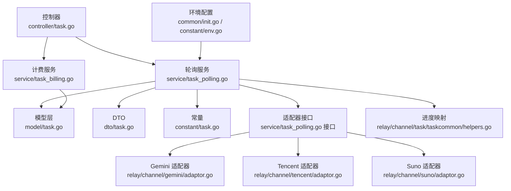
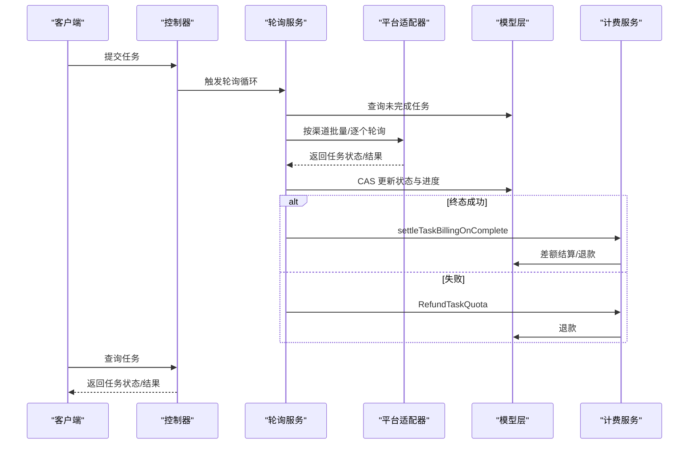
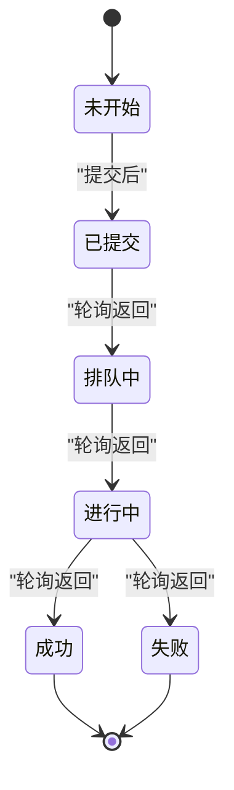
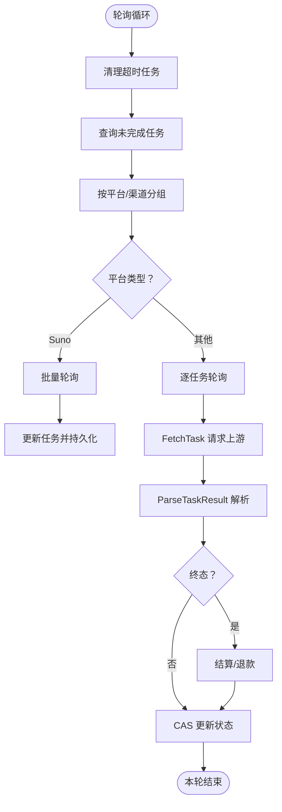
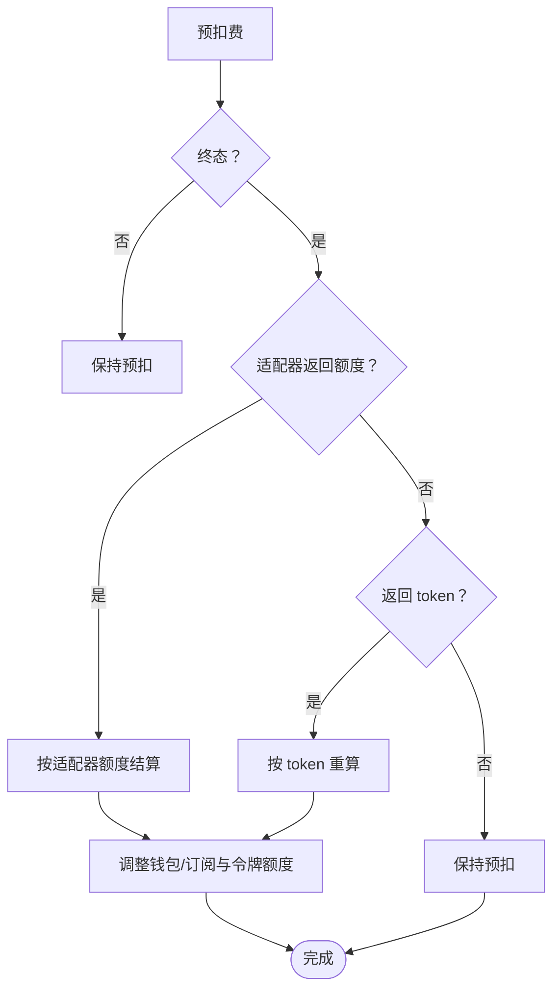
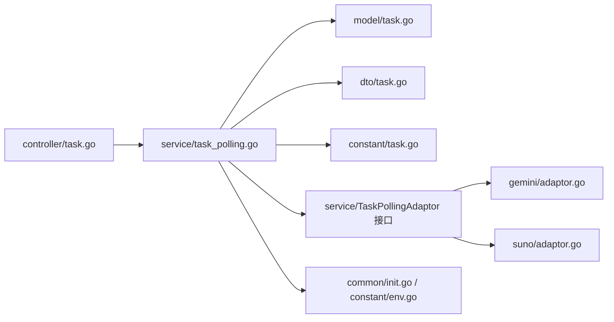
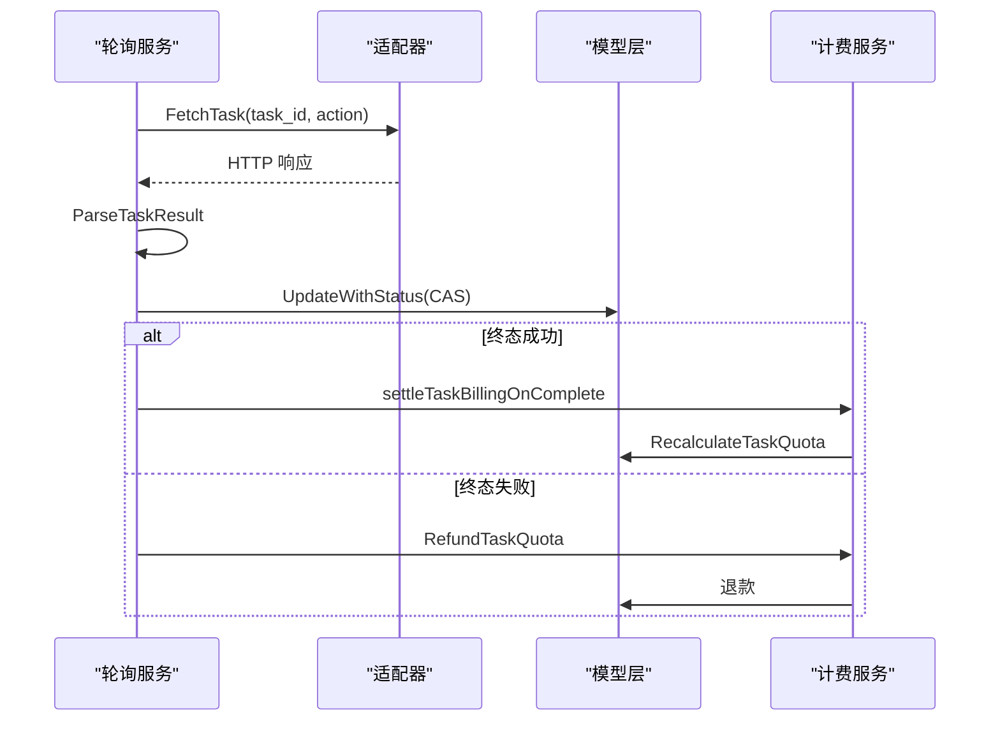

# 任务管理核心机制

<cite>
**本文引用的文件**
- [controller/task.go](file://controller/task.go)
- [service/task_polling.go](file://service/task_polling.go)
- [service/task_billing.go](file://service/task_billing.go)
- [model/task.go](file://model/task.go)
- [dto/task.go](file://dto/task.go)
- [constant/task.go](file://constant/task.go)
- [relay/channel/task/taskcommon/helpers.go](file://relay/channel/task/taskcommon/helpers.go)
- [relay/channel/tencent/adaptor.go](file://relay/channel/tencent/adaptor.go)
- [relay/channel/gemini/adaptor.go](file://relay/channel/gemini/adaptor.go)
- [relay/channel/suno/adaptor.go](file://relay/channel/suno/adaptor.go)
- [common/init.go](file://common/init.go)
- [constant/env.go](file://constant/env.go)
- [service/task_billing_test.go](file://service/task_billing_test.go)
- [model/task_cas_test.go](file://model/task_cas_test.go)
</cite>

## 目录
1. [简介](#简介)
2. [项目结构](#项目结构)
3. [核心组件](#核心组件)
4. [架构总览](#架构总览)
5. [详细组件分析](#详细组件分析)
6. [依赖分析](#依赖分析)
7. [性能考量](#性能考量)
8. [故障排查指南](#故障排查指南)
9. [结论](#结论)
10. [附录](#附录)

## 简介
本文件面向任务管理核心机制，系统性阐述异步任务处理的完整生命周期：从任务提交、状态轮询、结果获取到计费管理。重点包括：
- 任务状态机设计与转换逻辑
- 轮询机制的实现（轮询间隔、并发限制、资源管理）
- 计费与配额扣减、差额结算与退款
- 适配器模式在不同平台的协作方式
- 超时控制、重试与错误恢复策略
- 扩展指南与性能优化建议

## 项目结构
围绕任务管理的关键模块分布如下：
- 控制层：薄入口，调度轮询循环
- 服务层：轮询调度、状态更新、计费结算
- 模型层：任务实体、状态定义、CAS 更新
- DTO 层：任务响应结构
- 常量层：平台与动作枚举
- 适配器层：各平台任务轮询与结果解析
- 通用工具：轮询进度映射、环境配置

**图表来源**
- [controller/task.go:17-20](file://controller/task.go#L17-L20)
- [service/task_polling.go:24-36](file://service/task_polling.go#L24-L36)
- [service/task_billing.go:17-65](file://service/task_billing.go#L17-L65)
- [model/task.go:15-66](file://model/task.go#L15-L66)
- [dto/task.go:22-53](file://dto/task.go#L22-L53)
- [constant/task.go:5-24](file://constant/task.go#L5-L24)
- [relay/channel/gemini/adaptor.go:182-244](file://relay/channel/gemini/adaptor.go#L182-L244)
- [relay/channel/tencent/adaptor.go](file://relay/channel/tencent/adaptor.go)
- [relay/channel/suno/adaptor.go:131-149](file://relay/channel/suno/adaptor.go#L131-L149)
- [relay/channel/task/taskcommon/helpers.go:63-75](file://relay/channel/task/taskcommon/helpers.go#L63-L75)
- [common/init.go:147-180](file://common/init.go#L147-L180)
- [constant/env.go:18-19](file://constant/env.go#L18-L19)

**章节来源**
- [controller/task.go:17-20](file://controller/task.go#L17-L20)
- [service/task_polling.go:90-138](file://service/task_polling.go#L90-L138)
- [service/task_billing.go:17-65](file://service/task_billing.go#L17-L65)
- [model/task.go:15-66](file://model/task.go#L15-L66)
- [dto/task.go:22-53](file://dto/task.go#L22-L53)
- [constant/task.go:5-24](file://constant/task.go#L5-L24)
- [relay/channel/task/taskcommon/helpers.go:63-75](file://relay/channel/task/taskcommon/helpers.go#L63-L75)
- [common/init.go:147-180](file://common/init.go#L147-L180)
- [constant/env.go:18-19](file://constant/env.go#L18-L19)

## 核心组件
- 任务状态机：定义了“未开始、已提交、排队中、进行中、成功、失败、未知”等状态及转换规则
- 轮询适配器接口：抽象出 FetchTask 与 ParseTaskResult，屏蔽平台差异
- 计费结算：支持预扣费、差额结算、按次计费、订阅与钱包双重来源
- CAS 更新：保证并发场景下的状态一致性与计费正确性
- 进度映射：将上游状态映射为统一的进度百分比

**章节来源**
- [model/task.go:15-42](file://model/task.go#L15-L42)
- [service/task_polling.go:24-32](file://service/task_polling.go#L24-L32)
- [service/task_billing.go:184-301](file://service/task_billing.go#L184-L301)
- [model/task.go:404-431](file://model/task.go#L404-L431)
- [relay/channel/task/taskcommon/helpers.go:69-75](file://relay/channel/task/taskcommon/helpers.go#L69-L75)

## 架构总览
整体流程分为“提交—轮询—结算/退款—结果获取”四个阶段，控制器薄入口触发轮询循环，服务层按平台调度适配器，模型层负责持久化与并发安全，计费层负责额度调整与日志记录。

**图表来源**
- [controller/task.go:17-20](file://controller/task.go#L17-L20)
- [service/task_polling.go:90-138](file://service/task_polling.go#L90-L138)
- [service/task_polling.go:290-342](file://service/task_polling.go#L290-L342)
- [service/task_polling.go:344-502](file://service/task_polling.go#L344-L502)
- [service/task_polling.go:538-561](file://service/task_polling.go#L538-L561)
- [service/task_billing.go:150-182](file://service/task_billing.go#L150-L182)
- [service/task_billing.go:184-245](file://service/task_billing.go#L184-L245)

## 详细组件分析

### 任务状态机与转换逻辑
- 状态定义：未开始、已提交、排队中、进行中、成功、失败、未知
- 转换规则：
  - 已提交→排队中→进行中→成功/失败
  - 失败时进度置为100%，并触发退款
  - 成功时进度置为100%，并触发结算
  - 进行中首次出现时填充开始时间，完成时填充结束时间
- 进度映射：通过统一常量将上游状态映射为“10%、20%、30%、100%”

**图表来源**
- [model/task.go:15-42](file://model/task.go#L15-L42)
- [relay/channel/task/taskcommon/helpers.go:69-75](file://relay/channel/task/taskcommon/helpers.go#L69-L75)

**章节来源**
- [model/task.go:15-42](file://model/task.go#L15-L42)
- [service/task_polling.go:426-471](file://service/task_polling.go#L426-L471)
- [relay/channel/task/taskcommon/helpers.go:69-75](file://relay/channel/task/taskcommon/helpers.go#L69-L75)

### 轮询机制与适配器协作
- 轮询入口：每15秒执行一次，先清理超时任务，再按平台与渠道聚合任务
- 平台分发：默认走视频任务轮询，特殊平台（如 Suno）走专用批量轮询
- 逐任务轮询：构造请求、调用适配器 FetchTask、解析 ParseTaskResult
- 并发与限速：同一渠道逐任务间隔1秒，避免上游限流
- 结果处理：根据状态更新进度、时间戳、失败原因、结果URL；终态触发结算或退款

**图表来源**
- [service/task_polling.go:90-138](file://service/task_polling.go#L90-L138)
- [service/task_polling.go:140-152](file://service/task_polling.go#L140-L152)
- [service/task_polling.go:290-342](file://service/task_polling.go#L290-L342)
- [service/task_polling.go:344-502](file://service/task_polling.go#L344-L502)

**章节来源**
- [service/task_polling.go:90-138](file://service/task_polling.go#L90-L138)
- [service/task_polling.go:140-152](file://service/task_polling.go#L140-L152)
- [service/task_polling.go:290-342](file://service/task_polling.go#L290-L342)
- [service/task_polling.go:344-502](file://service/task_polling.go#L344-L502)

### 计费管理与配额扣减
- 预扣费：提交阶段根据模型倍率、分组倍率与附加系数计算预扣额度
- 差额结算：终态时优先以适配器返回的实际额度为准，其次以 token 数重算
- 按次计费：部分模型可直接按次计费，不参与轮询阶段的差额结算
- 资金来源：支持钱包与订阅两种来源，失败时统一退款
- 日志与统计：记录消费日志、用户与渠道用量统计

**图表来源**
- [service/task_polling.go:538-561](file://service/task_polling.go#L538-L561)
- [service/task_billing.go:184-301](file://service/task_billing.go#L184-L301)
- [service/task_billing.go:17-65](file://service/task_billing.go#L17-L65)

**章节来源**
- [service/task_polling.go:538-561](file://service/task_polling.go#L538-L561)
- [service/task_billing.go:17-65](file://service/task_billing.go#L17-L65)
- [service/task_billing.go:184-301](file://service/task_billing.go#L184-L301)

### 超时控制、重试与错误恢复
- 超时清理：每次轮询前扫描超时未完成任务，使用 CAS 将其标记为失败并退款
- 429 限流：上游返回 429 时不视为任务失败，维持原状态等待后续轮询
- 未知错误：无法识别的错误格式记录原始响应，标记失败并退款
- 渠道异常：获取渠道信息失败时批量标记失败并写入失败原因

**章节来源**
- [service/task_polling.go:38-88](file://service/task_polling.go#L38-L88)
- [service/task_polling.go:407-420](file://service/task_polling.go#L407-L420)
- [service/task_polling.go:305-323](file://service/task_polling.go#L305-L323)

### 结果获取与代理
- 成功结果 URL：若上游返回 data: URI，则写入代理 URL；否则写入直连 URL 或构造代理 URL
- 数据脱敏：轮询响应中的敏感字段在持久化前进行脱敏处理

**章节来源**
- [service/task_polling.go:442-451](file://service/task_polling.go#L442-L451)
- [service/task_polling.go:504-528](file://service/task_polling.go#L504-L528)

### 平台适配器实现要点
- Gemini 适配器：基于操作名（operation）轮询，解析 Done 与 Error 字段，支持分辨率与时长比率估算
- Suno 适配器：不使用逐任务轮询，采用批量轮询路径，适配器提供 FetchTask 与 DoResponse
- Tencent 适配器：作为通用适配器示例，遵循 TaskAdaptor 接口契约

**章节来源**
- [relay/channel/gemini/adaptor.go:182-244](file://relay/channel/gemini/adaptor.go#L182-L244)
- [relay/channel/suno/adaptor.go:131-149](file://relay/channel/suno/adaptor.go#L131-L149)
- [relay/channel/tencent/adaptor.go](file://relay/channel/tencent/adaptor.go)

## 依赖分析
- 控制器依赖服务层的轮询入口
- 服务层依赖模型层的查询与 CAS 更新、DTO 的任务响应结构、常量层的平台枚举
- 服务层通过适配器接口解耦具体平台实现
- 环境配置影响轮询频率、超时阈值与任务计费补丁

**图表来源**
- [controller/task.go:17-20](file://controller/task.go#L17-L20)
- [service/task_polling.go:24-36](file://service/task_polling.go#L24-L36)
- [model/task.go:15-66](file://model/task.go#L15-L66)
- [dto/task.go:22-53](file://dto/task.go#L22-L53)
- [constant/task.go:5-24](file://constant/task.go#L5-L24)
- [relay/channel/gemini/adaptor.go:182-244](file://relay/channel/gemini/adaptor.go#L182-L244)
- [relay/channel/suno/adaptor.go:131-149](file://relay/channel/suno/adaptor.go#L131-L149)
- [common/init.go:147-180](file://common/init.go#L147-L180)
- [constant/env.go:18-19](file://constant/env.go#L18-L19)

**章节来源**
- [controller/task.go:17-20](file://controller/task.go#L17-L20)
- [service/task_polling.go:24-36](file://service/task_polling.go#L24-L36)
- [model/task.go:15-66](file://model/task.go#L15-L66)
- [dto/task.go:22-53](file://dto/task.go#L22-L53)
- [constant/task.go:5-24](file://constant/task.go#L5-L24)
- [relay/channel/gemini/adaptor.go:182-244](file://relay/channel/gemini/adaptor.go#L182-L244)
- [relay/channel/suno/adaptor.go:131-149](file://relay/channel/suno/adaptor.go#L131-L149)
- [common/init.go:147-180](file://common/init.go#L147-L180)
- [constant/env.go:18-19](file://constant/env.go#L18-L19)

## 性能考量
- 轮询频率：固定每15秒一次，可根据业务压力调整
- 并发与限速：逐任务间隔1秒，避免上游限流
- 查询上限：通过环境变量限制单次查询任务数量
- 超时清理：独立清理超时任务，减少无效轮询
- 日志与监控：关键路径记录系统日志，便于定位性能瓶颈

**章节来源**
- [service/task_polling.go:90-138](file://service/task_polling.go#L90-L138)
- [service/task_polling.go:338-340](file://service/task_polling.go#L338-L340)
- [common/init.go:147-180](file://common/init.go#L147-L180)
- [constant/env.go:18-19](file://constant/env.go#L18-L19)

## 故障排查指南
- 任务长时间未完成
  - 检查超时配置与轮询频率
  - 查看是否因上游 429 导致状态停滞
- 任务失败但未退款
  - 确认任务是否具备预扣额度
  - 检查退款流程日志与资金来源
- 计费不一致
  - 对比适配器返回的实际额度与 token 重算结果
  - 核对订阅与钱包来源的差额结算日志
- 并发竞态导致状态异常
  - 关注 CAS 更新测试用例，确保状态转换只由一个进程生效

**章节来源**
- [service/task_polling.go:38-88](file://service/task_polling.go#L38-L88)
- [service/task_polling.go:407-420](file://service/task_polling.go#L407-L420)
- [service/task_billing.go:150-182](file://service/task_billing.go#L150-L182)
- [service/task_billing.go:184-245](file://service/task_billing.go#L184-L245)
- [model/task_cas_test.go:129-217](file://model/task_cas_test.go#L129-L217)

## 结论
该任务管理系统通过清晰的状态机、稳定的轮询机制与严谨的计费结算，实现了跨平台异步任务的可靠管理。CAS 保障了并发安全性，适配器模式提升了扩展性，环境配置提供了灵活的运行参数。建议在生产环境中结合监控与压测持续优化轮询频率与限速策略，并完善平台适配器的错误处理与可观测性。

## 附录

### 任务状态与进度映射对照
- 已提交 → 10%
- 排队中 → 20%
- 进行中 → 30%
- 成功/失败 → 100%

**章节来源**
- [relay/channel/task/taskcommon/helpers.go:69-75](file://relay/channel/task/taskcommon/helpers.go#L69-L75)

### 关键流程图（代码级）

**图表来源**
- [service/task_polling.go:344-502](file://service/task_polling.go#L344-L502)
- [service/task_polling.go:538-561](file://service/task_polling.go#L538-L561)
- [service/task_billing.go:150-182](file://service/task_billing.go#L150-L182)
- [service/task_billing.go:184-245](file://service/task_billing.go#L184-L245)