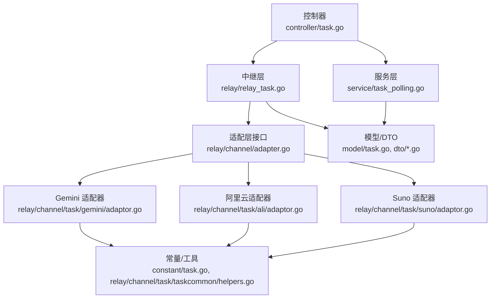
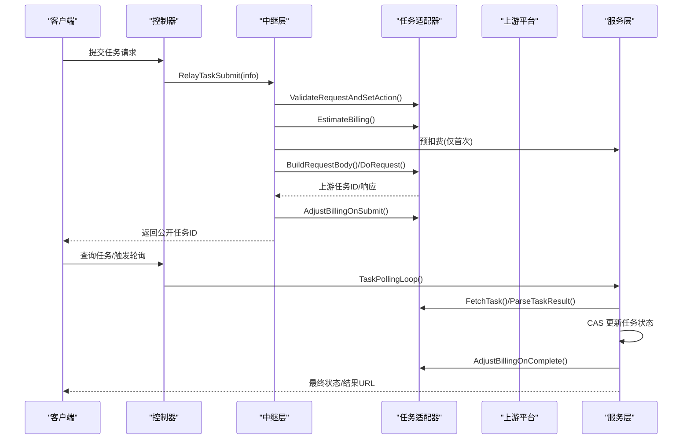
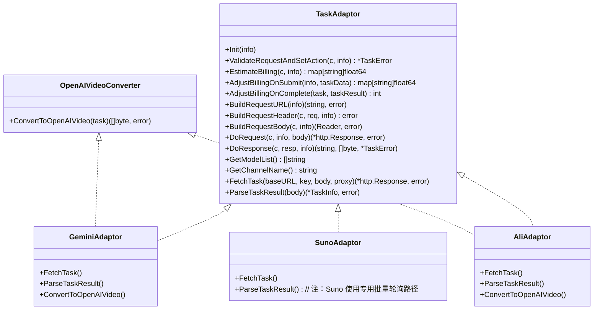
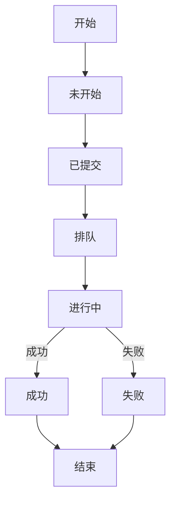
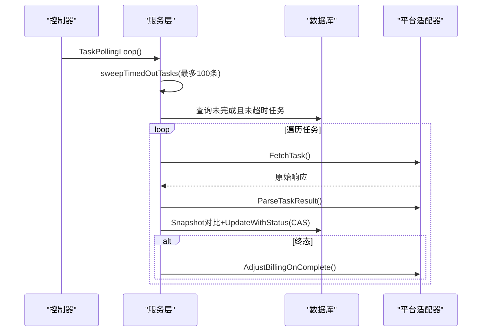
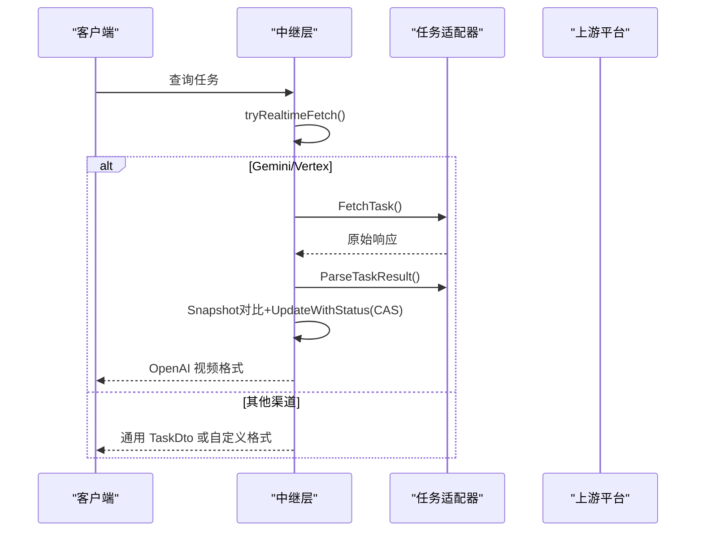
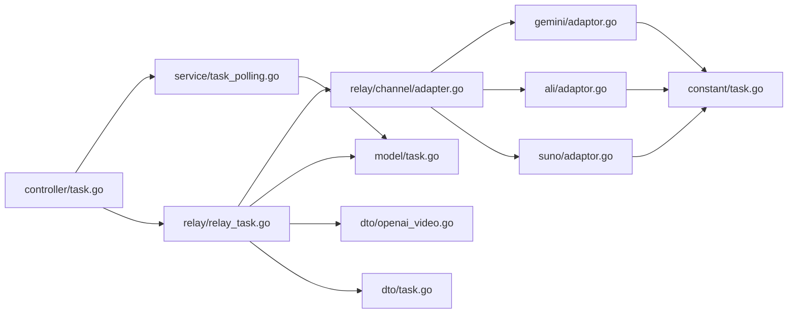

# 任务适配器

<cite>
**本文引用的文件列表**
- [task.go](file://controller/task.go)
- [task.go](file://service/task_polling.go)
- [task.go](file://service/task.go)
- [task.go](file://relay/relay_task.go)
- [adapter.go](file://relay/channel/adapter.go)
- [helpers.go](file://relay/channel/task/taskcommon/helpers.go)
- [adaptor.go](file://relay/channel/task/gemini/adaptor.go)
- [adaptor.go](file://relay/channel/task/ali/adaptor.go)
- [adaptor.go](file://relay/channel/task/suno/adaptor.go)
- [task.go](file://model/task.go)
- [task.go](file://dto/task.go)
- [task.go](file://dto/openai_video.go)
- [task.go](file://dto/suno.go)
- [task.go](file://constant/task.go)
- [error.go](file://service/error.go)
</cite>

## 目录
1. [简介](#简介)
2. [项目结构](#项目结构)
3. [核心组件](#核心组件)
4. [架构总览](#架构总览)
5. [详细组件分析](#详细组件分析)
6. [依赖关系分析](#依赖关系分析)
7. [性能考量](#性能考量)
8. [故障排查指南](#故障排查指南)
9. [结论](#结论)
10. [附录](#附录)

## 简介
本技术文档聚焦“任务适配器系统”，系统性阐述异步任务处理的适配实现，覆盖图像生成、视频创作与音频合成等任务类型。重点对比任务适配器与普通适配器的差异，详解任务状态管理与轮询机制，给出长耗时任务的请求提交、状态查询与结果获取的实践路径，并总结各任务平台（如 Suno 音乐生成、Gemini 图像/视频生成、阿里云视频任务等）的特点与差异。同时提供超时处理、重试机制与错误恢复策略，以及扩展指南与最佳实践。

## 项目结构
围绕任务适配器的关键模块分布如下：
- 控制层：任务查询与批量轮询入口
- 服务层：轮询调度、超时清理、计费结算
- 中继层：统一任务提交与查询流程、实时上游拉取
- 适配层：按平台拆分的 TaskAdaptor 实现（Gemini、阿里云、Suno 等）
- 数据模型与 DTO：任务状态、计费上下文、OpenAI 视频格式等
- 常量与工具：任务平台枚举、进度映射、编码解码等

图表来源
- [task.go:17-20](file://controller/task.go#L17-L20)
- [task.go:24-32](file://service/task_polling.go#L24-L32)
- [task.go:139-258](file://relay/relay_task.go#L139-L258)
- [adapter.go:34-79](file://relay/channel/adapter.go#L34-L79)
- [adaptor.go:29-40](file://relay/channel/task/gemini/adaptor.go#L29-L40)
- [adaptor.go:111-122](file://relay/channel/task/ali/adaptor.go#L111-L122)
- [adaptor.go:21-36](file://relay/channel/task/suno/adaptor.go#L21-L36)
- [task.go:44-66](file://model/task.go#L44-L66)
- [task.go:16-31](file://dto/openai_video.go#L16-L31)
- [task.go:3-24](file://constant/task.go#L3-L24)
- [helpers.go:48-67](file://relay/channel/task/taskcommon/helpers.go#L48-L67)

章节来源
- [task.go:17-20](file://controller/task.go#L17-L20)
- [task.go:24-32](file://service/task_polling.go#L24-L32)
- [task.go:139-258](file://relay/relay_task.go#L139-L258)
- [adapter.go:34-79](file://relay/channel/adapter.go#L34-L79)

## 核心组件
- 任务适配器接口（TaskAdaptor）：定义请求构建、请求发送、响应解析、计费估算/调整、轮询抓取与结果解析等能力，支持 OpenAI 视频格式转换。
- 通用适配器接口（Adaptor）：面向同步任务与流式任务，不涉及轮询与计费结算。
- 任务状态与进度：统一的状态枚举与进度映射，支持从内部状态映射到 OpenAI 视频状态。
- 计费上下文：记录提交时的模型价格、分组倍率、模型倍率、其他比率（时长、分辨率等）与是否按次计费，用于轮询阶段差额结算。
- 轮询与超时：独立的超时清理与批量轮询，支持 CAS 更新防止并发覆盖，支持按平台定制 FetchTask/Parsing。
- 实时查询：针对 Gemini/Vertex 渠道，允许用户在查询时直接从上游拉取最新状态。

章节来源
- [adapter.go:34-79](file://relay/channel/adapter.go#L34-L79)
- [task.go:15-42](file://model/task.go#L15-L42)
- [task.go:110-118](file://model/task.go#L110-L118)
- [task.go:8-14](file://dto/openai_video.go#L8-L14)
- [task.go:418-500](file://relay/relay_task.go#L418-L500)

## 架构总览
任务适配器系统采用“控制器-服务-中继-适配器-平台”的分层设计，关键流程如下：
- 提交阶段：控制器选择平台与适配器，校验请求，估算计费，预扣费，构建并发送上游请求，解析响应，必要时二次计费调整。
- 查询阶段：用户可直接查询任务，或通过控制器触发批量轮询；对于 Gemini/Vertex，支持实时从上游拉取最新状态。
- 结算阶段：轮询到达终态时，依据计费上下文与适配器返回的最终配额进行差额结算，支持按次计费跳过结算。

图表来源
- [task.go:139-258](file://relay/relay_task.go#L139-L258)
- [adapter.go:34-79](file://relay/channel/adapter.go#L34-L79)
- [task.go:24-32](file://service/task_polling.go#L24-L32)
- [task.go:418-500](file://relay/relay_task.go#L418-L500)

## 详细组件分析

### 任务适配器接口与职责
- 请求生命周期：Init → ValidateRequestAndSetAction → EstimateBilling → 预扣费 → BuildRequestBody → DoRequest → DoResponse → AdjustBillingOnSubmit。
- 轮询生命周期：FetchTask → ParseTaskResult → CAS 更新 → AdjustBillingOnComplete。
- OpenAI 视频格式：部分适配器实现 OpenAIVideoConverter，将内部任务转换为 OpenAI 视频响应格式。

图表来源
- [adapter.go:34-79](file://relay/channel/adapter.go#L34-L79)
- [adaptor.go:29-40](file://relay/channel/task/gemini/adaptor.go#L29-L40)
- [adaptor.go:111-122](file://relay/channel/task/ali/adaptor.go#L111-L122)
- [adaptor.go:21-36](file://relay/channel/task/suno/adaptor.go#L21-L36)

章节来源
- [adapter.go:34-79](file://relay/channel/adapter.go#L34-L79)

### 任务状态管理与进度映射
- 内部状态：未开始、已提交、排队、进行中、成功、失败、未知。
- 进度映射：不同阶段对应固定百分比，便于前端展示。
- OpenAI 视频状态映射：内部状态映射为 queued/in_progress/completed/failed。

图表来源
- [task.go:15-42](file://model/task.go#L15-L42)
- [task.go:17-32](file://model/task.go#L17-L32)

章节来源
- [task.go:15-42](file://model/task.go#L15-L42)
- [task.go:17-32](file://model/task.go#L17-L32)

### 轮询机制与超时处理
- 轮询入口：控制器触发服务层 TaskPollingLoop，服务层先清理超时任务，再批量轮询。
- 超时清理：基于 SubmitTime 截止时间，最多每批处理 100 条，使用 CAS 防止覆盖已推进的任务。
- 轮询更新：FetchTask/Parsing 后，SnapShot 对比决定是否更新；仅终态触发计费结算。
- 适配器注入：通过 GetTaskAdaptorFunc 注入平台适配器，打破循环依赖。

图表来源
- [task.go:24-32](file://service/task_polling.go#L24-L32)
- [task.go:38-88](file://service/task_polling.go#L38-L88)
- [task.go:418-500](file://relay/relay_task.go#L418-L500)

章节来源
- [task.go:24-32](file://service/task_polling.go#L24-L32)
- [task.go:38-88](file://service/task_polling.go#L38-L88)
- [task.go:418-500](file://relay/relay_task.go#L418-L500)

### 实时查询与 OpenAI 视频格式
- 实时查询：针对 Gemini/Vertex 渠道，用户查询时可直接从上游拉取最新状态，避免本地状态滞后。
- OpenAI 视频格式：适配器将内部任务转换为 OpenAIVideo，包含状态、进度、创建/完成时间、元数据（如 URL）等。

图表来源
- [task.go:418-500](file://relay/relay_task.go#L418-L500)
- [task.go:16-31](file://dto/openai_video.go#L16-L31)

章节来源
- [task.go:418-500](file://relay/relay_task.go#L418-L500)
- [task.go:16-31](file://dto/openai_video.go#L16-L31)

### 平台适配器实现要点

#### Gemini（视频生成）
- 请求构建：将任务请求转换为 Veo predictLongRunning 格式，支持文本/图像输入与参数（时长、分辨率、宽高比）。
- 轮询：通过 operations 接口 GET 获取状态，解析错误、进行中与完成状态，完成后提取视频 URL。
- OpenAI 视频转换：根据上游操作名提取模型名，构造 OpenAIVideo 响应。

章节来源
- [adaptor.go:47-58](file://relay/channel/task/gemini/adaptor.go#L47-L58)
- [adaptor.go:68-115](file://relay/channel/task/gemini/adaptor.go#L68-L115)
- [adaptor.go:181-209](file://relay/channel/task/gemini/adaptor.go#L181-L209)
- [adaptor.go:211-244](file://relay/channel/task/gemini/adaptor.go#L211-L244)
- [adaptor.go:246-270](file://relay/channel/task/gemini/adaptor.go#L246-L270)

#### 阿里云（通义万相视频生成）
- 请求构建：将任务请求转换为阿里视频生成请求，支持文生视频、图生视频、首尾帧生视频等模式，自动映射分辨率与时长。
- 轮询：通过 /api/v1/tasks/{task_id} 查询任务状态，解析成功/失败原因，成功时直接返回视频 URL。
- OpenAI 视频转换：将阿里响应映射为 OpenAIVideo，设置 URL 元数据。

章节来源
- [adaptor.go:29-86](file://relay/channel/task/ali/adaptor.go#L29-L86)
- [adaptor.go:255-344](file://relay/channel/task/ali/adaptor.go#L255-L344)
- [adaptor.go:421-442](file://relay/channel/task/ali/adaptor.go#L421-L442)
- [adaptor.go:452-487](file://relay/channel/task/ali/adaptor.go#L452-L487)
- [adaptor.go:489-520](file://relay/channel/task/ali/adaptor.go#L489-L520)

#### Suno（音乐/歌词生成）
- 请求构建：根据 action（MUSIC/LYRICS）校验参数，构建提交请求。
- 轮询：Suno 使用专用批量轮询路径（UpdateSunoTasks），不使用 ParseTaskResult；适配器的 FetchTask 用于外部集成场景。
- 行为差异：Suno 的单任务轮询与批量轮询路径不同，需注意调用方式。

章节来源
- [adaptor.go:38-64](file://relay/channel/task/suno/adaptor.go#L38-L64)
- [adaptor.go:131-150](file://relay/channel/task/suno/adaptor.go#L131-L150)
- [adaptor.go:26-32](file://relay/channel/task/suno/adaptor.go#L26-L32)

### 计费与结算
- 计费上下文：记录模型单价、分组倍率、模型倍率、其他比率（时长、分辨率）、是否按次计费。
- 预扣费：首次提交时按估算额度预扣，后续通过 AdjustBillingOnSubmit 与 AdjustBillingOnComplete 进行差额结算。
- CAS 保护：仅终态变更才触发结算，非终态仅更新进度，避免重复计费。
- 按次计费：若 PerCallBilling=true，则跳过差额结算。

章节来源
- [task.go:110-118](file://model/task.go#L110-L118)
- [task.go:187-257](file://relay/relay_task.go#L187-L257)
- [task.go:24-32](file://service/task_polling.go#L24-L32)

## 依赖关系分析
- 控制器依赖服务层执行轮询；服务层依赖适配器接口与模型/DTO；中继层封装统一提交与查询流程；适配器实现平台差异。
- 适配器之间无直接耦合，通过接口与注入函数解耦。
- 任务状态与计费上下文贯穿提交、轮询与结算全过程。

图表来源
- [task.go:17-20](file://controller/task.go#L17-L20)
- [task.go:24-32](file://service/task_polling.go#L24-L32)
- [task.go:139-258](file://relay/relay_task.go#L139-L258)
- [adapter.go:34-79](file://relay/channel/adapter.go#L34-L79)
- [adaptor.go:29-40](file://relay/channel/task/gemini/adaptor.go#L29-L40)
- [adaptor.go:111-122](file://relay/channel/task/ali/adaptor.go#L111-L122)
- [adaptor.go:21-36](file://relay/channel/task/suno/adaptor.go#L21-L36)
- [task.go:44-66](file://model/task.go#L44-L66)
- [task.go:16-31](file://dto/openai_video.go#L16-L31)
- [task.go:32-53](file://dto/task.go#L32-L53)
- [task.go:3-24](file://constant/task.go#L3-L24)

章节来源
- [task.go:17-20](file://controller/task.go#L17-L20)
- [task.go:24-32](file://service/task_polling.go#L24-L32)
- [task.go:139-258](file://relay/relay_task.go#L139-L258)
- [adapter.go:34-79](file://relay/channel/adapter.go#L34-L79)

## 性能考量
- 批量轮询：服务层限制每批最多处理 100 条超时任务，避免一次性压力过大。
- CAS 更新：使用 UpdateWithStatus 防止并发覆盖，减少无效写入。
- 进度映射：固定进度值降低前端轮询频率与渲染开销。
- 实时查询：对 Gemini/Vertex 支持实时上游拉取，减少本地状态陈旧带来的无效轮询。

## 故障排查指南
- 提交失败：检查 ValidateRequestAndSetAction、BuildRequestBody、DoRequest 的错误包装与返回码；关注 TaskErrorWrapper 的错误屏蔽与敏感信息脱敏。
- 轮询异常：确认 FetchTask/Parsing 是否正确，上游响应格式是否符合预期；查看 CAS 更新日志与失败原因。
- 结算异常：核对计费上下文与 AdjustBillingOnComplete 返回值；确认 PerCallBilling 标记是否导致跳过结算。
- 超时任务：检查 sweepTimedOutTasks 的 CAS 失败日志，确认是否被其他进程抢先推进。

章节来源
- [error.go:191-221](file://service/error.go#L191-L221)
- [task.go:38-88](file://service/task_polling.go#L38-L88)

## 结论
任务适配器系统通过清晰的接口与分层设计，实现了对多平台异步任务的统一接入与治理。借助进度映射、CAS 更新与计费上下文，系统在保证一致性的同时兼顾性能与可观测性。针对不同平台的差异（如 Suno 的批量轮询、Gemini 的实时查询、阿里云的参数映射），适配器提供了可插拔的扩展点。建议在新增平台时遵循现有接口规范，充分利用 BaseBilling 与 OpenAIVideoConverter，确保计费准确与用户体验一致。

## 附录

### 任务平台特点速览
- Suno：音乐/歌词生成，支持批量轮询路径，单任务轮询通过 FetchTask 实现。
- Gemini：视频生成，支持实时查询，状态来自 operations 接口，支持 OpenAI 视频格式转换。
- 阿里云：通义万相视频生成，参数丰富（分辨率、时长、模板等），直接返回视频 URL。

章节来源
- [adaptor.go:26-32](file://relay/channel/task/suno/adaptor.go#L26-L32)
- [adaptor.go:181-244](file://relay/channel/task/gemini/adaptor.go#L181-L244)
- [adaptor.go:421-487](file://relay/channel/task/ali/adaptor.go#L421-L487)

### 代码示例路径（提交/查询/结果获取）
- 提交任务（含预扣费与计费调整）
  - [RelayTaskSubmit 流程:139-258](file://relay/relay_task.go#L139-L258)
- 批量轮询与超时清理
  - [TaskPollingLoop 与 sweepTimedOutTasks:24-88](file://service/task_polling.go#L24-L88)
- 实时查询（Gemini/Vertex）
  - [tryRealtimeFetch:418-500](file://relay/relay_task.go#L418-L500)
- OpenAI 视频格式转换
  - [ConvertToOpenAIVideo（Gemini）:246-270](file://relay/channel/task/gemini/adaptor.go#L246-L270)
  - [ConvertToOpenAIVideo（阿里云）:489-520](file://relay/channel/task/ali/adaptor.go#L489-L520)
- 任务状态与进度映射
  - [TaskStatus 与 ToVideoStatus:15-32](file://model/task.go#L15-L32)
  - [进度映射常量:69-75](file://relay/channel/task/taskcommon/helpers.go#L69-L75)