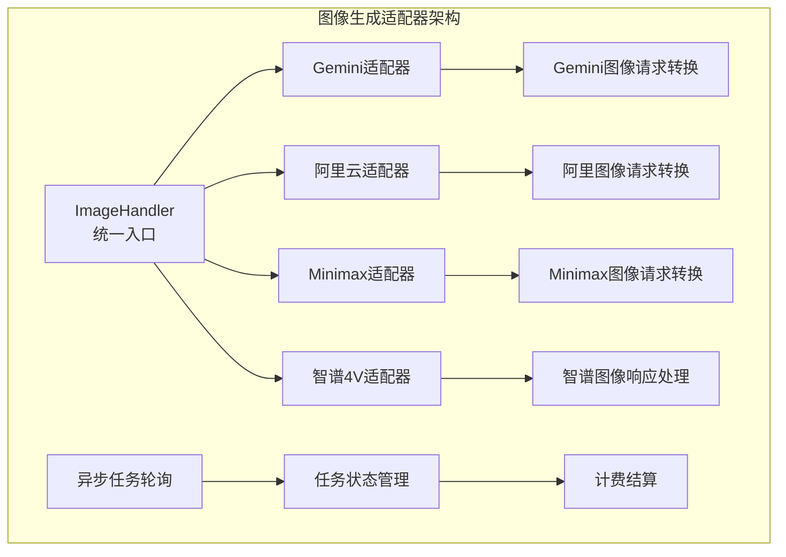
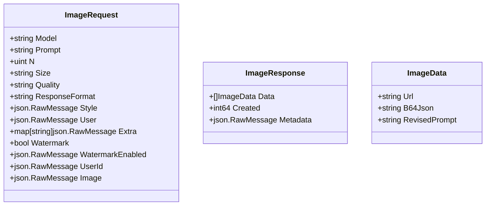
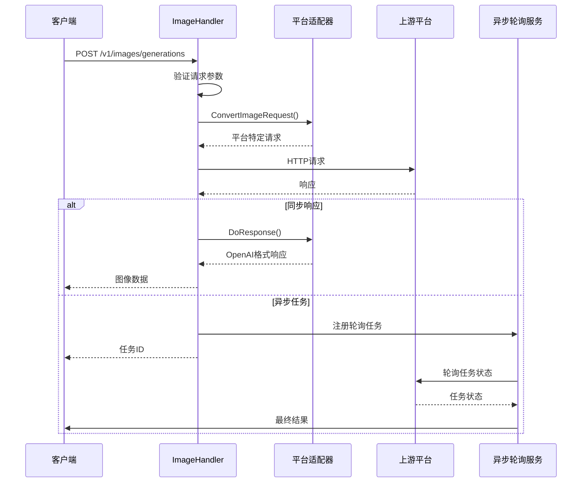
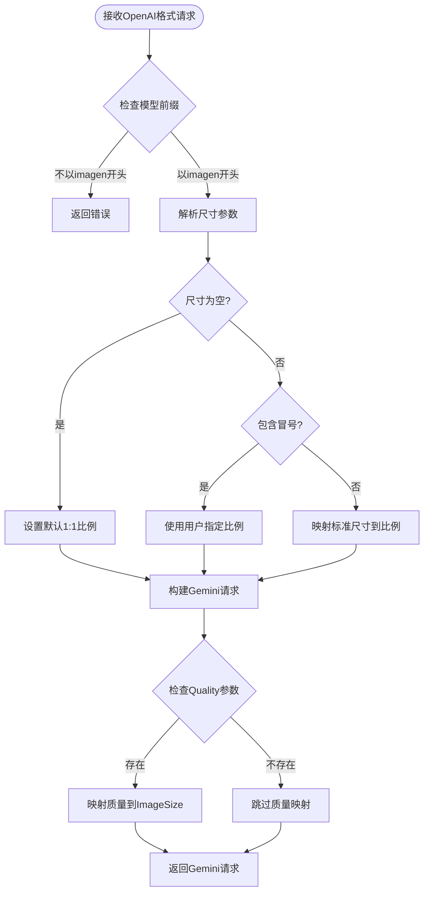
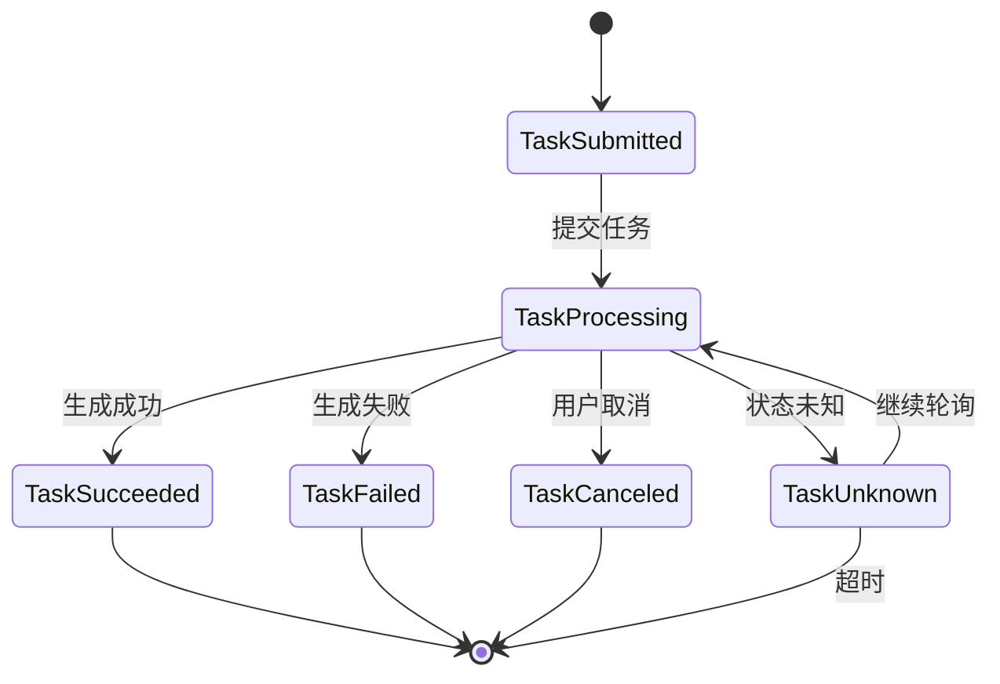
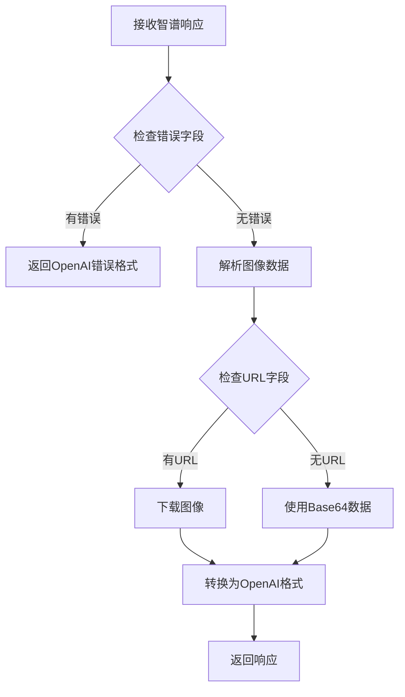
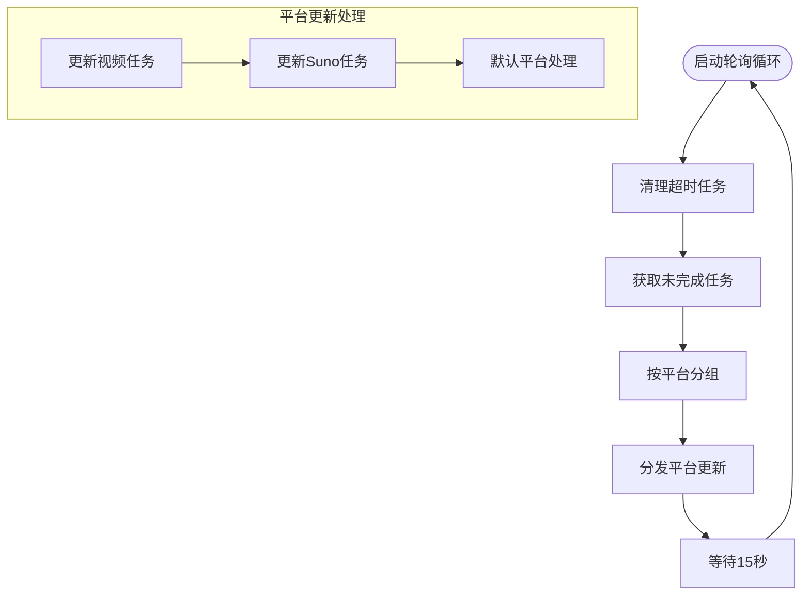
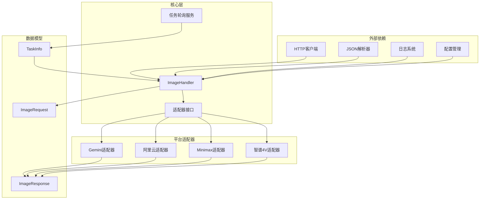

# 图像生成适配器

<cite>
**本文档引用的文件**
- [image_handler.go](file://relay/image_handler.go)
- [openai_image.go](file://dto/openai_image.go)
- [adaptor.go](file://relay/channel/gemini/adaptor.go)
- [image.go](file://relay/channel/ali/image.go)
- [image.go](file://relay/channel/minimax/image.go)
- [image.go](file://relay/channel/zhipu_4v/image.go)
- [image.go](file://relay/channel/task/gemini/image.go)
- [task_polling.go](file://service/task_polling.go)
- [relay_info.go](file://relay/common/relay_info.go)
- [constants.go](file://relay/channel/ali/constants.go)
- [constants.go](file://relay/channel/minimax/constants.go)
</cite>

## 目录
1. [简介](#简介)
2. [项目结构](#项目结构)
3. [核心组件](#核心组件)
4. [架构概览](#架构概览)
5. [详细组件分析](#详细组件分析)
6. [依赖关系分析](#依赖关系分析)
7. [性能考虑](#性能考虑)
8. [故障排除指南](#故障排除指南)
9. [结论](#结论)

## 简介

本文件为图像生成适配器的技术文档，深入解释了多种图像生成平台的适配实现，包括Gemini、阿里云、Minimax、智谱清言等平台的图像生成能力。文档详细分析了图像生成任务的请求格式转换、参数映射和响应处理机制，并提供了具体的代码示例路径，展示如何处理图像生成的异步任务流程，包括任务提交、状态轮询和结果获取。

## 项目结构

图像生成适配器位于relay子系统中，采用按平台分层的组织方式：



**图表来源**
- [image_handler.go:23-155](file://relay/image_handler.go#L23-L155)
- [adaptor.go:60-124](file://relay/channel/gemini/adaptor.go#L60-L124)

**章节来源**
- [image_handler.go:1-156](file://relay/image_handler.go#L1-L156)
- [openai_image.go:14-37](file://dto/openai_image.go#L14-L37)

## 核心组件

### 统一图像处理入口

ImageHelper函数作为所有图像生成请求的统一入口，负责：

1. **请求初始化与验证**
   - 初始化通道元数据
   - 验证请求类型为ImageRequest
   - 处理模型映射

2. **适配器选择与初始化**
   - 根据API类型获取对应适配器
   - 初始化适配器配置

3. **请求转换与发送**
   - 将OpenAI格式请求转换为平台特定格式
   - 处理透传请求模式
   - 发送HTTP请求

4. **响应处理与计费**
   - 处理平台特定响应格式
   - 计算使用量和费用
   - 记录日志信息

**章节来源**
- [image_handler.go:23-155](file://relay/image_handler.go#L23-L155)

### 请求数据模型

ImageRequest结构体支持OpenAI兼容的图像生成参数：



**图表来源**
- [openai_image.go:14-37](file://dto/openai_image.go#L14-L37)
- [openai_image.go:172-182](file://dto/openai_image.go#L172-L182)

**章节来源**
- [openai_image.go:14-182](file://dto/openai_image.go#L14-L182)

## 架构概览

图像生成适配器采用插件化架构，支持多平台统一接入：



**图表来源**
- [image_handler.go:47-114](file://relay/image_handler.go#L47-L114)
- [task_polling.go:91-138](file://service/task_polling.go#L91-L138)

## 详细组件分析

### Gemini图像生成适配器

Gemini适配器专注于Google的Imagen系列图像生成模型：

#### 请求转换机制



**图表来源**
- [adaptor.go:60-124](file://relay/channel/gemini/adaptor.go#L60-L124)

#### 关键特性

1. **尺寸到比例映射**
   - 支持标准OpenAI尺寸格式到Gemini纵横比的转换
   - 自动识别用户自定义纵横比
   - 默认1:1纵横比

2. **质量参数处理**
   - 将OpenAI的quality参数映射到Gemini的imageSize
   - 支持hd/standard等质量级别
   - 默认1K分辨率

3. **模型支持范围**
   - 仅支持以"imagen"开头的模型
   - 自动处理thinking模式的特殊后缀

**章节来源**
- [adaptor.go:60-124](file://relay/channel/gemini/adaptor.go#L60-L124)

### 阿里云图像生成适配器

阿里云适配器支持多种图像生成模型，包括同步和异步两种模式：

#### 异步任务处理流程



**图表来源**
- [image.go:189-263](file://relay/channel/ali/image.go#L189-L263)

#### 核心功能

1. **同步与异步模式支持**
   - 同步模型直接返回结果
   - 异步模型通过任务ID轮询状态
   - 自动检测模型类型

2. **任务轮询机制**
   - 初始延迟5秒，随后每次等待10秒
   - 最大轮询20次
   - 支持多种任务状态处理

3. **响应格式转换**
   - 将阿里云格式转换为OpenAI兼容格式
   - 支持URL和Base64两种响应格式
   - 自动处理水印参数

**章节来源**
- [image.go:189-343](file://relay/channel/ali/image.go#L189-L343)

### Minimax图像生成适配器

Minimax适配器提供简洁的图像生成服务：

#### 参数映射表

| OpenAI参数 | Minimax字段 | 映射规则 |
|------------|-------------|----------|
| prompt | prompt | 直接映射 |
| n | n | 数量参数 |
| response_format | response_format | url/base64 |
| watermark | aigc_watermark | 水印开关 |
| size | aspect_ratio | 尺寸到比例映射 |

**章节来源**
- [image.go:42-69](file://relay/channel/minimax/image.go#L42-L69)

### 智谱清言4V图像适配器

智谱4V适配器专门处理智谱AI的图像生成功能：

#### 响应处理流程



**图表来源**
- [image.go:57-127](file://relay/channel/zhipu_4v/image.go#L57-L127)

**章节来源**
- [image.go:57-127](file://relay/channel/zhipu_4v/image.go#L57-L127)

### 任务轮询服务

异步任务轮询服务提供统一的任务状态管理：

#### 轮询调度机制



**图表来源**
- [task_polling.go:90-152](file://service/task_polling.go#L90-L152)

**章节来源**
- [task_polling.go:90-561](file://service/task_polling.go#L90-L561)

## 依赖关系分析

图像生成适配器的依赖关系呈现清晰的层次结构：



**图表来源**
- [image_handler.go:1-156](file://relay/image_handler.go#L1-L156)
- [task_polling.go:24-36](file://service/task_polling.go#L24-L36)

**章节来源**
- [image_handler.go:1-156](file://relay/image_handler.go#L1-L156)
- [task_polling.go:1-561](file://service/task_polling.go#L1-L561)

## 性能考虑

### 请求转换优化

1. **内存使用优化**
   - 使用流式处理避免大对象复制
   - 智能缓存常用映射规则
   - 及时释放临时缓冲区

2. **网络传输优化**
   - 批量处理减少连接开销
   - 智能重试机制避免重复请求
   - 连接池复用提高吞吐量

### 异步任务处理

1. **轮询策略优化**
   - 动态调整轮询间隔
   - 并行处理多个任务
   - 智能超时控制

2. **资源管理**
   - 任务状态缓存
   - 自动清理僵尸任务
   - 内存使用监控

## 故障排除指南

### 常见问题诊断

1. **请求转换错误**
   ```bash
   # 检查模型支持情况
   curl -X GET "http://localhost:3000/v1/channels/ali/models"
   
   # 验证请求格式
   curl -X POST "http://localhost:3000/v1/images/generations" \
     -H "Content-Type: application/json" \
     -d '{"model":"imagen","prompt":"test","n":1}'
   ```

2. **异步任务超时**
   - 检查上游平台状态
   - 验证API密钥有效性
   - 查看轮询日志

3. **响应格式问题**
   - 确认响应格式转换
   - 检查Base64编码
   - 验证URL可访问性

### 错误处理策略

1. **参数验证**
   - 必填字段检查
   - 格式合法性验证
   - 范围约束检查

2. **异常恢复**
   - 自动重试机制
   - 降级处理策略
   - 完整的错误回滚

**章节来源**
- [image_handler.go:23-155](file://relay/image_handler.go#L23-L155)
- [task_polling.go:344-502](file://service/task_polling.go#L344-L502)

## 结论

图像生成适配器通过模块化设计实现了对多个平台的统一支持。其核心优势包括：

1. **统一接口设计**：所有平台都遵循相同的请求/响应格式
2. **灵活的适配器模式**：易于添加新的图像生成平台
3. **完善的异步处理**：支持同步和异步两种工作模式
4. **强大的错误处理**：提供完整的错误诊断和恢复机制

该适配器为构建高性能、可扩展的图像生成服务提供了坚实的基础，能够满足不同业务场景的需求。