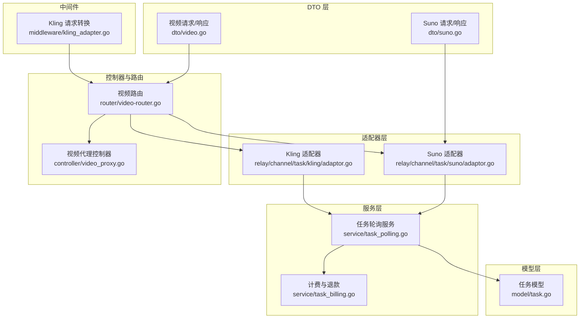
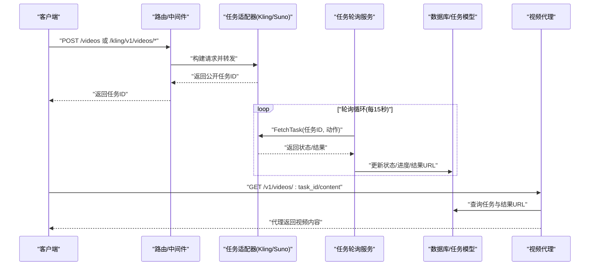
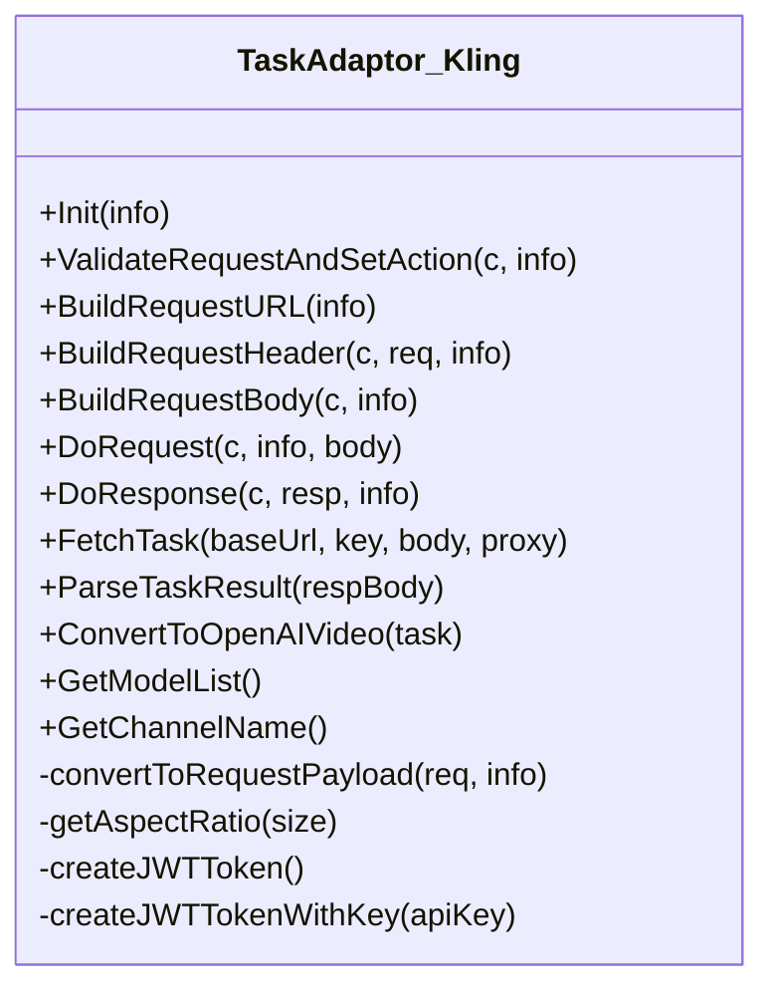
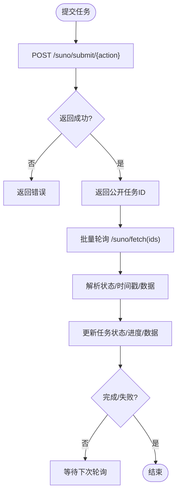
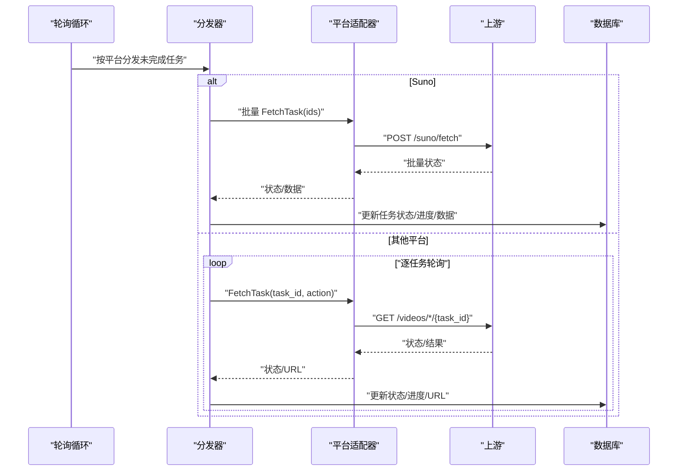
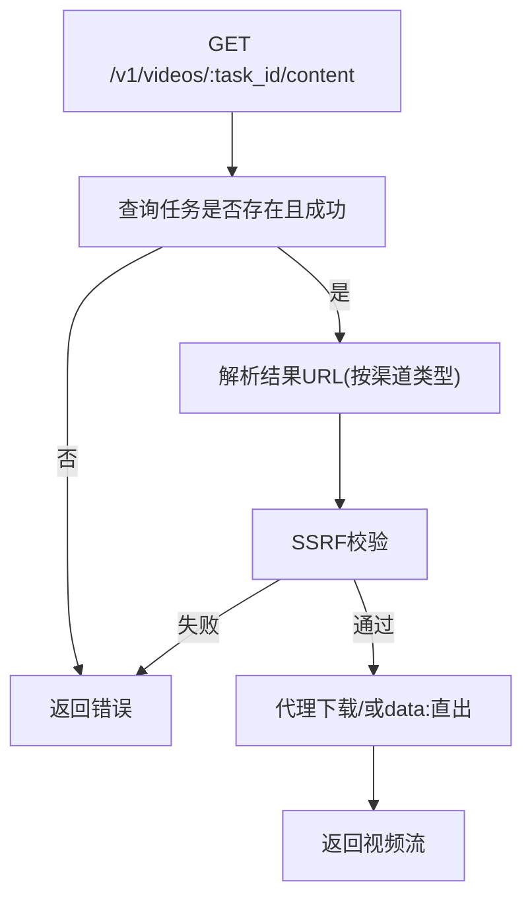
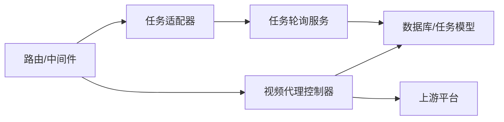

# 视频创作适配器

<cite>
**本文档引用的文件**
- [adaptor.go](file://relay/channel/task/kling/adaptor.go)
- [adaptor.go](file://relay/channel/task/suno/adaptor.go)
- [helpers.go](file://relay/channel/task/taskcommon/helpers.go)
- [task_polling.go](file://service/task_polling.go)
- [suno.go](file://dto/suno.go)
- [video.go](file://dto/video.go)
- [video-router.go](file://router/video-router.go)
- [video_proxy.go](file://controller/video_proxy.go)
- [task.go](file://model/task.go)
- [kling_adapter.go](file://middleware/kling_adapter.go)
- [task.go](file://constant/task.go)
- [task_billing.go](file://service/task_billing.go)
</cite>

## 目录
1. [简介](#简介)
2. [项目结构](#项目结构)
3. [核心组件](#核心组件)
4. [架构总览](#架构总览)
5. [详细组件分析](#详细组件分析)
6. [依赖分析](#依赖分析)
7. [性能考虑](#性能考虑)
8. [故障排查指南](#故障排查指南)
9. [结论](#结论)
10. [附录](#附录)

## 简介
本文件面向视频创作任务适配器，聚焦于音乐生成（Suno）与视频创作（Kling）两大平台的适配实现。文档深入解析视频创作任务的特殊处理逻辑，包括长耗时任务的状态管理、进度跟踪、结果下载与代理访问、以及超时处理、失败重试与资源清理策略。同时提供从任务提交到结果获取的完整异步流程图解，并给出扩展指南与最佳实践。

## 项目结构
围绕视频创作与音乐生成的关键目录与文件如下：
- 适配器层：Kling 与 Suno 的任务适配器实现
- 服务层：统一的任务轮询、状态更新、计费结算与退款
- DTO 层：请求与响应的数据结构定义
- 控制器与路由：视频内容代理与任务查询接口
- 中间件：请求转换与鉴权
- 模型层：任务状态与计费上下文

**图表来源**
- [adaptor.go:1-417](file://relay/channel/task/kling/adaptor.go#L1-L417)
- [adaptor.go:1-168](file://relay/channel/task/suno/adaptor.go#L1-L168)
- [task_polling.go:1-561](file://service/task_polling.go#L1-L561)
- [video.go:1-48](file://dto/video.go#L1-L48)
- [suno.go:1-98](file://dto/suno.go#L1-L98)
- [video-router.go:1-53](file://router/video-router.go#L1-L53)
- [video_proxy.go:1-206](file://controller/video_proxy.go#L1-L206)
- [kling_adapter.go:1-53](file://middleware/kling_adapter.go#L1-L53)
- [task.go:1-200](file://model/task.go#L1-L200)

**章节来源**
- [video-router.go:10-53](file://router/video-router.go#L10-L53)
- [video_proxy.go:33-172](file://controller/video_proxy.go#L33-L172)
- [adaptor.go:114-260](file://relay/channel/task/kling/adaptor.go#L114-L260)
- [adaptor.go:21-77](file://relay/channel/task/suno/adaptor.go#L21-L77)

## 核心组件
- 任务适配器（TaskAdaptor）
  - 负责请求构建、头部设置、请求体转换、上游请求与响应处理、任务状态解析与 OpenAI 视频格式转换。
  - 提供平台特定的模型列表与通道名。
- 任务轮询服务（TaskPolling）
  - 统一调度各平台任务轮询，按渠道聚合批量更新，处理超时清理、状态映射、进度更新、计费结算与退款。
- 视频代理控制器（VideoProxy）
  - 将最终结果 URL 代理回客户端，支持多种上游平台的视频地址解析与 data URL 直接输出。
- DTO 数据结构
  - 定义视频生成请求/响应、Suno 提交/查询数据结构，确保跨平台一致性。
- 中间件与路由
  - 提供 OpenAI 兼容路由、Kling 专属路由与请求转换中间件。

**章节来源**
- [adaptor.go:114-260](file://relay/channel/task/kling/adaptor.go#L114-L260)
- [adaptor.go:21-77](file://relay/channel/task/suno/adaptor.go#L21-L77)
- [task_polling.go:90-152](file://service/task_polling.go#L90-L152)
- [video_proxy.go:33-172](file://controller/video_proxy.go#L33-L172)
- [video.go:3-48](file://dto/video.go#L3-L48)
- [suno.go:7-98](file://dto/suno.go#L7-L98)

## 架构总览
视频创作适配器采用“适配器 + 服务轮询 + 代理下载”的三层架构：
- 适配器层：对接不同平台（Kling/Suno），负责请求与响应的适配。
- 服务层：定时轮询任务状态，根据状态更新进度与结果，执行计费与退款。
- 控制器层：提供 OpenAI 兼容接口与平台专属接口，代理最终视频内容。

**图表来源**
- [video-router.go:19-42](file://router/video-router.go#L19-L42)
- [adaptor.go:183-252](file://relay/channel/task/kling/adaptor.go#L183-L252)
- [adaptor.go:91-150](file://relay/channel/task/suno/adaptor.go#L91-L150)
- [task_polling.go:90-152](file://service/task_polling.go#L90-L152)
- [video_proxy.go:33-172](file://controller/video_proxy.go#L33-L172)

## 详细组件分析

### Kling 视频创作适配器
- 请求与响应
  - 请求体转换：将通用请求映射为平台特定 payload，支持文本/图像驱动模式，自动推断动作（文本/图像）。
  - 响应处理：解析任务状态、结果视频 URL、水印信息与扣费信息，构造 OpenAI 兼容视频对象。
- 认证与路径
  - 支持新旧两种 API 模式：旧版使用 accessKey|secretKey 生成 JWT，新版可直接透传 sk- 开头的密钥。
  - 自动拼接路径，区分 text2video 与 image2video。
- 状态解析与进度
  - 状态映射：submitted/processing/succeed/failed 对应本地状态，成功后提取首个视频 URL。
  - 进度与计费：根据平台返回的 token 数量进行向上取整并计入总用量。
- OpenAI 兼容转换
  - 将平台响应转换为 OpenAIVideo，填充状态、进度、创建/完成时间与结果元数据。

**图表来源**
- [adaptor.go:114-260](file://relay/channel/task/kling/adaptor.go#L114-L260)
- [adaptor.go:266-303](file://relay/channel/task/kling/adaptor.go#L266-L303)
- [adaptor.go:309-335](file://relay/channel/task/kling/adaptor.go#L309-L335)
- [adaptor.go:337-373](file://relay/channel/task/kling/adaptor.go#L337-L373)
- [adaptor.go:379-416](file://relay/channel/task/kling/adaptor.go#L379-L416)

**章节来源**
- [adaptor.go:114-260](file://relay/channel/task/kling/adaptor.go#L114-L260)
- [adaptor.go:266-303](file://relay/channel/task/kling/adaptor.go#L266-L303)
- [adaptor.go:309-335](file://relay/channel/task/kling/adaptor.go#L309-L335)
- [adaptor.go:337-373](file://relay/channel/task/kling/adaptor.go#L337-L373)
- [adaptor.go:379-416](file://relay/channel/task/kling/adaptor.go#L379-L416)

### Suno 音乐生成适配器
- 特殊处理
  - 不使用单任务轮询：通过专用批处理轮询路径（UpdateSunoTasks）批量获取任务状态。
  - 请求动作校验：支持 MUSIC 与 LYRICS 两类动作，自动设置默认模型。
- 请求与响应
  - 提交请求：直接透传 SunoSubmitReq 到上游提交端点。
  - 响应处理：返回公开任务ID给客户端，后续通过批处理轮询获取详细状态与结果。
- 批处理轮询
  - 以渠道维度聚合任务ID，一次性向上游批量查询，减少请求次数。
  - 解析返回的 SunoDataResponse，更新任务状态、时间戳、失败原因与数据内容。

**图表来源**
- [adaptor.go:66-150](file://relay/channel/task/suno/adaptor.go#L66-L150)
- [task_polling.go:154-250](file://service/task_polling.go#L154-L250)
- [suno.go:19-28](file://dto/suno.go#L19-L28)

**章节来源**
- [adaptor.go:26-32](file://relay/channel/task/suno/adaptor.go#L26-L32)
- [adaptor.go:38-64](file://relay/channel/task/suno/adaptor.go#L38-L64)
- [adaptor.go:66-77](file://relay/channel/task/suno/adaptor.go#L66-L77)
- [adaptor.go:95-121](file://relay/channel/task/suno/adaptor.go#L95-L121)
- [adaptor.go:131-150](file://relay/channel/task/suno/adaptor.go#L131-L150)
- [task_polling.go:154-250](file://service/task_polling.go#L154-L250)
- [suno.go:7-17](file://dto/suno.go#L7-L17)

### 通用任务轮询与状态管理
- 轮询调度
  - 每 15 秒扫描未完成任务，按平台分发更新；Suno 使用专用批处理路径，其他平台走通用轮询。
- 状态映射与进度
  - 通用状态：SUBMITTED/QUEUED/IN_PROGRESS/SUCCESS/FAILURE 映射为统一进度字符串。
  - 成功后根据结果 URL 类型选择直链或代理 URL；data: URI 存入私有数据并通过代理访问。
- 超时清理
  - 独立清理超时任务，CAS 更新防止并发覆盖；对非遗留任务进行配额退款。
- 计费与退款
  - 任务完成后优先调用适配器的 AdjustBillingOnComplete；若无则按 token 重算；按次计费任务跳过差额结算。
  - 失败任务按预扣额度进行退款，支持钱包与订阅两种资金来源。

**图表来源**
- [task_polling.go:90-152](file://service/task_polling.go#L90-L152)
- [task_polling.go:154-250](file://service/task_polling.go#L154-L250)
- [task_polling.go:290-342](file://service/task_polling.go#L290-L342)
- [task_polling.go:344-502](file://service/task_polling.go#L344-L502)

**章节来源**
- [task_polling.go:90-152](file://service/task_polling.go#L90-L152)
- [task_polling.go:154-250](file://service/task_polling.go#L154-L250)
- [task_polling.go:290-342](file://service/task_polling.go#L290-L342)
- [task_polling.go:344-502](file://service/task_polling.go#L344-L502)
- [task_billing.go:150-182](file://service/task_billing.go#L150-L182)

### 视频代理与结果下载
- 代理流程
  - 仅在任务成功后允许下载；根据渠道类型解析最终视频 URL（部分平台需携带 API Key）。
  - 支持 data: URI 直接输出与外部 URL 代理下载；内置 SSRF 保护与超时控制。
- URL 解析与安全
  - Gemini/Vertex 需要额外解析；OpenAI/Sora 直接使用平台标准内容端点。
  - 严格校验域名/IP/端口白名单，拒绝私网地址（可配置）。

**图表来源**
- [video_proxy.go:33-172](file://controller/video_proxy.go#L33-L172)

**章节来源**
- [video_proxy.go:33-172](file://controller/video_proxy.go#L33-L172)

### 请求转换与路由
- OpenAI 兼容路由
  - /v1/videos 与 /v1/video/generations 提供统一的视频生成接口。
- Kling 专属路由
  - /kling/v1/videos/text2video 与 /kling/v1/videos/image2video，配合中间件将请求转换为统一格式。
- 请求转换中间件
  - 将 model_name 与 model 字段合并为统一 model 字段，metadata 透传平台自定义参数；根据是否存在 image 推断动作。

**章节来源**
- [video-router.go:19-42](file://router/video-router.go#L19-L42)
- [kling_adapter.go:14-52](file://middleware/kling_adapter.go#L14-L52)

## 依赖分析
- 组件耦合
  - 适配器通过接口与服务层解耦，避免循环依赖；服务层通过函数注入获取适配器实例。
  - DTO 层为跨平台契约，保证请求/响应结构一致。
- 关键依赖关系
  - 路由与中间件 → 适配器 → 服务轮询 → 数据库
  - 代理控制器 → 数据库 → 上游平台

**图表来源**
- [video-router.go:19-42](file://router/video-router.go#L19-L42)
- [kling_adapter.go:14-52](file://middleware/kling_adapter.go#L14-L52)
- [adaptor.go:114-260](file://relay/channel/task/kling/adaptor.go#L114-L260)
- [task_polling.go:90-152](file://service/task_polling.go#L90-L152)
- [video_proxy.go:33-172](file://controller/video_proxy.go#L33-L172)

**章节来源**
- [video-router.go:19-42](file://router/video-router.go#L19-L42)
- [kling_adapter.go:14-52](file://middleware/kling_adapter.go#L14-L52)
- [adaptor.go:114-260](file://relay/channel/task/kling/adaptor.go#L114-L260)
- [task_polling.go:90-152](file://service/task_polling.go#L90-L152)
- [video_proxy.go:33-172](file://controller/video_proxy.go#L33-L172)

## 性能考虑
- 轮询频率与节流
  - 默认每 15 秒轮询一次；通用平台在逐任务轮询时增加 1 秒间隔，避免上游限流。
- 批处理优化
  - Suno 使用批量查询接口，显著降低请求次数与延迟。
- 代理下载
  - 代理层设置 60 秒超时，避免长时间占用连接；对 data: URI 直接解码输出，减少网络往返。
- 日志与可观测性
  - 轮询过程中记录调试日志与错误堆栈，便于定位问题。

**章节来源**
- [task_polling.go:90-152](file://service/task_polling.go#L90-L152)
- [task_polling.go:338-340](file://service/task_polling.go#L338-L340)
- [task_polling.go:504-536](file://service/task_polling.go#L504-L536)
- [video_proxy.go:78-80](file://controller/video_proxy.go#L78-L80)

## 故障排查指南
- 任务状态为空或未知
  - 服务层会尝试解析上游错误为 OpenAI 格式；429 速率限制不视为失败，保持原状态等待重试。
- 超时任务
  - 独立清理流程会将超时任务标记为失败并退款（非遗留任务）。
- 代理下载失败
  - 检查任务状态是否成功、结果 URL 是否为空、是否命中 SSRF 白名单。
- 计费异常
  - 若适配器未实现差额结算，将回退到按 token 重算；按次计费任务不参与差额结算。

**章节来源**
- [task_polling.go:39-88](file://service/task_polling.go#L39-L88)
- [task_polling.go:402-420](file://service/task_polling.go#L402-L420)
- [task_polling.go:538-561](file://service/task_polling.go#L538-L561)
- [video_proxy.go:133-137](file://controller/video_proxy.go#L133-L137)

## 结论
视频创作适配器通过标准化的适配器接口与统一的轮询服务，实现了对多平台（Kling/Suno）的高效集成。Suno 的批处理轮询与通用平台的逐任务轮询相结合，兼顾了性能与稳定性；代理下载与严格的 SSRF 保护确保了安全性与可用性。完善的超时清理、失败重试与计费退款机制，保障了长耗时任务的可靠性。

## 附录

### 平台技术特点与参数说明
- Suno（音乐生成）
  - 支持动作：MUSIC（伴奏）、LYRICS（歌词）；默认模型自动设置。
  - 批处理轮询：通过 /suno/fetch 批量获取任务状态与结果。
- Kling（视频生成）
  - 支持模式：文本驱动（text2video）与图像驱动（image2video）。
  - 认证：支持旧版 JWT 与新版 sk- 密钥直通。
  - 参数：模型名、提示词、尺寸、时长、CFG 系数、动态/静态遮罩、相机控制、回调地址等。

**章节来源**
- [task.go:10-24](file://constant/task.go#L10-L24)
- [adaptor.go:152-167](file://relay/channel/task/suno/adaptor.go#L152-L167)
- [adaptor.go:266-290](file://relay/channel/task/kling/adaptor.go#L266-L290)
- [adaptor.go:313-335](file://relay/channel/task/kling/adaptor.go#L313-L335)

### 异步流程示例（代码路径）
- 提交任务
  - 路由：/v1/videos 或 /kling/v1/videos/*
  - 适配器：BuildRequestURL/BuildRequestBody/DoRequest/DoResponse
  - 参考路径：[video-router.go:19-42](file://router/video-router.go#L19-L42)，[adaptor.go:136-188](file://relay/channel/task/kling/adaptor.go#L136-L188)
- 轮询与状态更新
  - 服务：TaskPollingLoop/DispatchPlatformUpdate/UpdateVideoTasks/UpdateSunoTasks
  - 参考路径：[task_polling.go:90-152](file://service/task_polling.go#L90-L152)，[task_polling.go:154-250](file://service/task_polling.go#L154-L250)
- 结果下载
  - 控制器：VideoProxy
  - 参考路径：[video_proxy.go:33-172](file://controller/video_proxy.go#L33-L172)

**章节来源**
- [video-router.go:19-42](file://router/video-router.go#L19-L42)
- [adaptor.go:136-188](file://relay/channel/task/kling/adaptor.go#L136-L188)
- [task_polling.go:90-152](file://service/task_polling.go#L90-L152)
- [task_polling.go:154-250](file://service/task_polling.go#L154-L250)
- [video_proxy.go:33-172](file://controller/video_proxy.go#L33-L172)

### 扩展指南与最佳实践
- 新增平台适配器
  - 实现 TaskPollingAdaptor 接口方法：Init/FetchTask/ParsingResult/AdjustBillingOnComplete。
  - 在服务层注册适配器工厂函数，使轮询分发器可通过平台标识获取适配器。
- 超时与重试
  - 合理设置 TaskTimeoutMinutes；对 429 等临时错误保持等待，避免误判失败。
- 计费策略
  - 优先在适配器中实现 AdjustBillingOnComplete；若无法获取精确用量，回退到按 token 重算。
- 安全与合规
  - 代理下载启用 SSRF 校验；对 data: URI 输出限制大小，避免泄露敏感数据。
- 监控与日志
  - 在关键路径记录调试日志，便于定位上游错误与状态异常。

**章节来源**
- [task_polling.go:24-36](file://service/task_polling.go#L24-L36)
- [task_polling.go:538-561](file://service/task_polling.go#L538-L561)
- [video_proxy.go:133-137](file://controller/video_proxy.go#L133-L137)