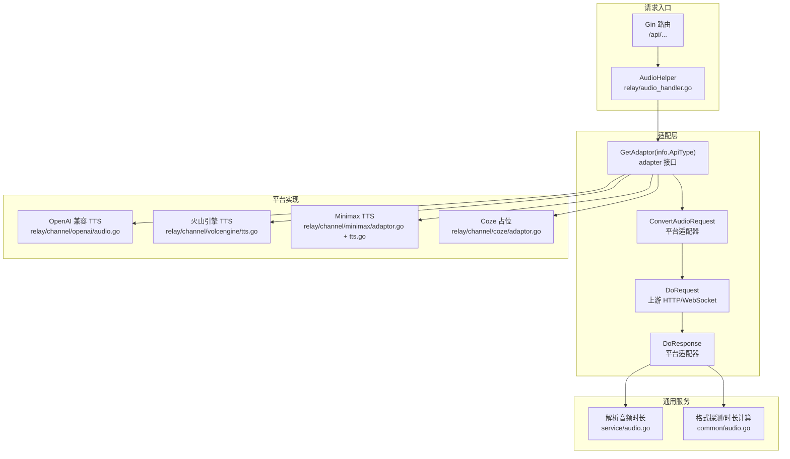
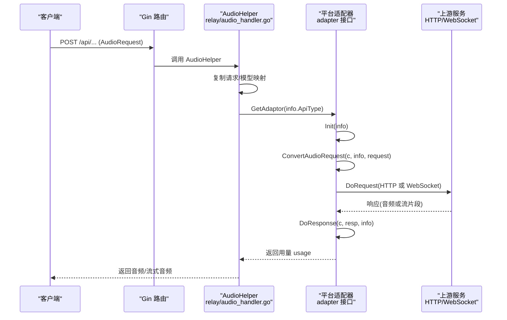
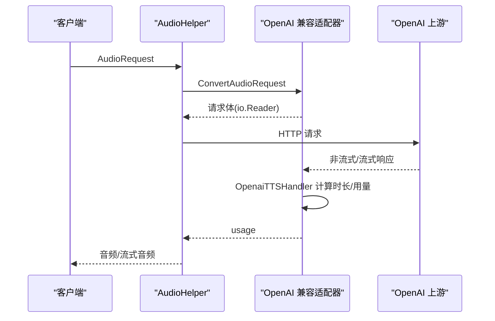
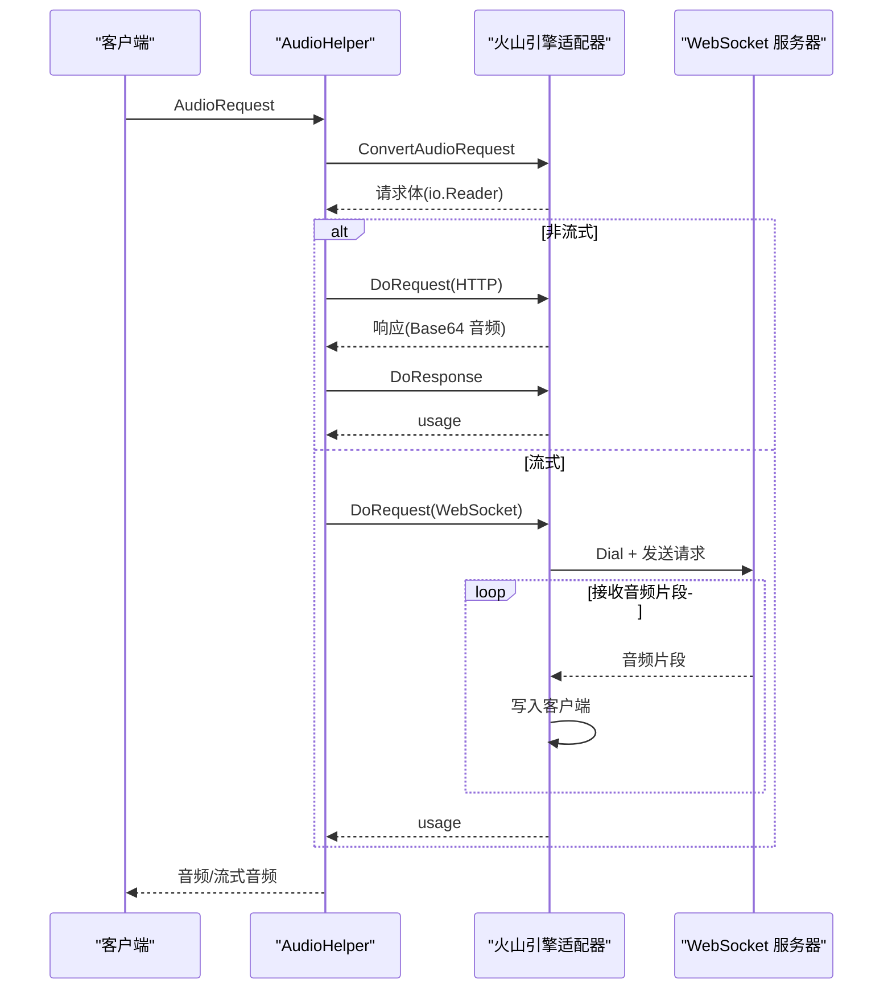
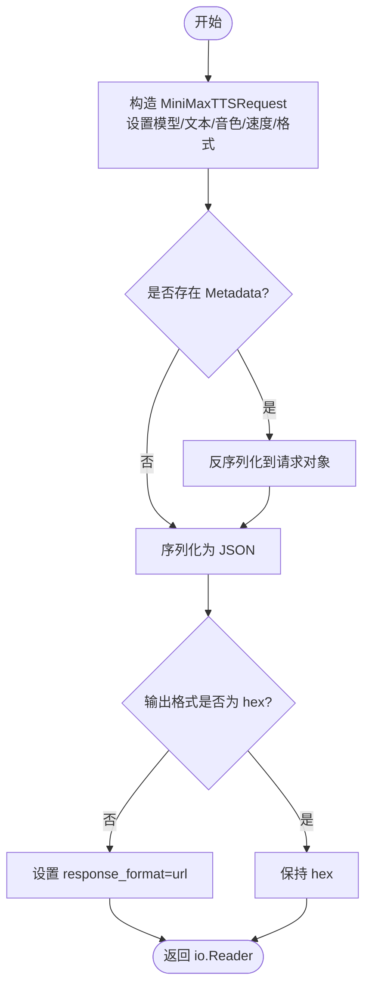
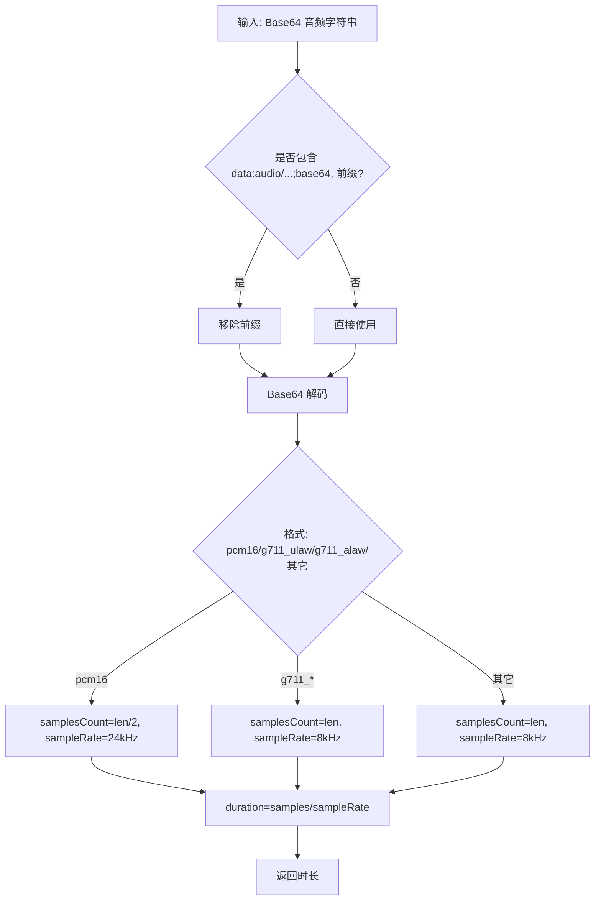
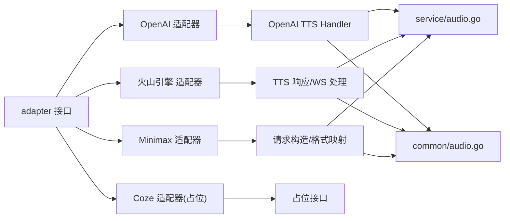

# 音频生成适配器

<cite>
**本文引用的文件**
- [dto/audio.go](file://dto/audio.go)
- [relay/audio_handler.go](file://relay/audio_handler.go)
- [relay/channel/adapter.go](file://relay/channel/adapter.go)
- [relay/channel/openai/audio.go](file://relay/channel/openai/audio.go)
- [relay/channel/volcengine/tts.go](file://relay/channel/volcengine/tts.go)
- [relay/channel/minimax/adaptor.go](file://relay/channel/minimax/adaptor.go)
- [relay/channel/minimax/tts.go](file://relay/channel/minimax/tts.go)
- [relay/channel/coze/adaptor.go](file://relay/channel/coze/adaptor.go)
- [service/audio.go](file://service/audio.go)
- [common/audio.go](file://common/audio.go)
</cite>

## 目录
1. [简介](#简介)
2. [项目结构](#项目结构)
3. [核心组件](#核心组件)
4. [架构总览](#架构总览)
5. [详细组件分析](#详细组件分析)
6. [依赖分析](#依赖分析)
7. [性能考虑](#性能考虑)
8. [故障排查指南](#故障排查指南)
9. [结论](#结论)
10. [附录](#附录)

## 简介
本文件面向“音频生成适配器”的技术文档，聚焦于语音合成（TTS）与音频生成任务的统一适配层设计与实现。文档覆盖以下平台与能力：
- Google Cloud Text-to-Speech（通过 OpenAI 兼容接口适配）
- 火山引擎语音合成（TTS）
- Coze 平台（当前未实现音频生成，保留接口占位）

重点内容包括：
- 文本转语音、音频格式转换与质量控制
- 异步任务处理链路（从文本输入到音频输出）
- 各平台特性：音色选择、语速控制、情感表达、音频格式支持
- 音频质量优化、格式转换与存储管理策略
- 适配器扩展指南与性能调优建议

## 项目结构
音频生成相关代码主要分布在以下模块：
- DTO 定义：统一音频请求/响应结构
- 适配器接口：定义 Convert/DoRequest/DoResponse 等标准流程
- 平台适配器：OpenAI、火山引擎、Minimax、Coze 等
- 通用服务：音频时长解析、Base64 解码等
- 通用工具：音频格式探测与时长计算

图示来源
- [relay/audio_handler.go:18-77](file://relay/audio_handler.go#L18-L77)
- [relay/channel/adapter.go:15-32](file://relay/channel/adapter.go#L15-L32)
- [relay/channel/openai/audio.go:21-112](file://relay/channel/openai/audio.go#L21-L112)
- [relay/channel/volcengine/tts.go:145-193](file://relay/channel/volcengine/tts.go#L145-L193)
- [relay/channel/minimax/adaptor.go:40-78](file://relay/channel/minimax/adaptor.go#L40-L78)
- [relay/channel/coze/adaptor.go:28-30](file://relay/channel/coze/adaptor.go#L28-L30)
- [service/audio.go:9-32](file://service/audio.go#L9-L32)
- [common/audio.go](file://common/audio.go)

章节来源
- [dto/audio.go:12-56](file://dto/audio.go#L12-L56)
- [relay/audio_handler.go:18-77](file://relay/audio_handler.go#L18-L77)
- [relay/channel/adapter.go:15-32](file://relay/channel/adapter.go#L15-L32)

## 核心组件
- 音频请求 DTO：统一承载模型名、输入文本、音色、语速、响应格式、流式参数与扩展元数据
- 适配器接口：定义 ConvertAudioRequest、DoRequest、DoResponse 等关键方法，确保不同平台的一致性
- 平台适配器：
  - OpenAI 兼容 TTS：支持流式与非流式，自动推断音频时长并统计用量
  - 火山引擎 TTS：支持 HTTP 与 WebSocket，映射音色与编码，按编码设置 Content-Type
  - Minimax TTS：支持多种音频参数与输出格式，兼容 hex/url 输出
  - Coze：当前未实现 ConvertAudioRequest，保留接口以供后续扩展
- 通用服务与工具：Base64 音频解码、音频时长解析、格式探测与时长计算

章节来源
- [dto/audio.go:12-56](file://dto/audio.go#L12-L56)
- [relay/channel/adapter.go:15-32](file://relay/channel/adapter.go#L15-L32)
- [relay/channel/openai/audio.go:21-112](file://relay/channel/openai/audio.go#L21-L112)
- [relay/channel/volcengine/tts.go:145-193](file://relay/channel/volcengine/tts.go#L145-L193)
- [relay/channel/minimax/adaptor.go:40-78](file://relay/channel/minimax/adaptor.go#L40-L78)
- [relay/channel/coze/adaptor.go:28-30](file://relay/channel/coze/adaptor.go#L28-L30)
- [service/audio.go:9-32](file://service/audio.go#L9-L32)
- [common/audio.go](file://common/audio.go)

## 架构总览
音频生成的统一处理流程如下：

图示来源
- [relay/audio_handler.go:18-77](file://relay/audio_handler.go#L18-L77)
- [relay/channel/adapter.go:15-32](file://relay/channel/adapter.go#L15-L32)

## 详细组件分析

### 组件一：OpenAI 兼容 TTS 适配器
- 功能要点
  - 支持流式与非流式响应
  - 非流式：读取响应体，根据格式推断时长并更新用量
  - 流式：扫描 usage 字段，动态更新用量
  - 将上游响应头透传给客户端
- 关键实现位置
  - OpenaiTTSHandler：处理 OpenAI 兼容 TTS 响应，计算时长与用量
  - AudioHelper：统一调度 ConvertAudioRequest/DoRequest/DoResponse

图示来源
- [relay/channel/openai/audio.go:21-112](file://relay/channel/openai/audio.go#L21-L112)
- [relay/audio_handler.go:18-77](file://relay/audio_handler.go#L18-L77)

章节来源
- [relay/channel/openai/audio.go:21-112](file://relay/channel/openai/audio.go#L21-L112)
- [relay/audio_handler.go:18-77](file://relay/audio_handler.go#L18-L77)

### 组件二：火山引擎 TTS 适配器
- 功能要点
  - 将 OpenAI 音色映射到火山引擎音色
  - 将响应格式映射为编码（encoding），并设置 Content-Type
  - 支持 HTTP 响应与 WebSocket 流式输出
  - WebSocket 模式下，按音频片段写入客户端并统计用量
- 关键实现位置
  - ConvertAudioRequest：构建火山引擎请求，设置 IsStream
  - DoResponse：根据响应类型选择 handleTTSResponse 或 handleTTSWebSocketResponse
  - handleTTSResponse：解码 Base64 音频并写入
  - handleTTSWebSocketResponse：建立 WebSocket 连接，接收音频片段并写入

图示来源
- [relay/channel/volcengine/tts.go:49-106](file://relay/channel/volcengine/tts.go#L49-L106)
- [relay/channel/volcengine/tts.go:145-193](file://relay/channel/volcengine/tts.go#L145-L193)
- [relay/channel/volcengine/tts.go:199-305](file://relay/channel/volcengine/tts.go#L199-L305)

章节来源
- [relay/channel/volcengine/tts.go:49-106](file://relay/channel/volcengine/tts.go#L49-L106)
- [relay/channel/volcengine/tts.go:145-193](file://relay/channel/volcengine/tts.go#L145-L193)
- [relay/channel/volcengine/tts.go:199-305](file://relay/channel/volcengine/tts.go#L199-L305)

### 组件三：Minimax TTS 适配器
- 功能要点
  - 支持多种音频参数（采样率、比特率、声道、CBR 等）
  - 支持输出格式（hex/url），默认非 hex 映射为 url
  - 支持 Metadata 扩展字段透传
- 关键实现位置
  - ConvertAudioRequest：构造 MiniMaxTTSRequest，设置 response_format
  - 请求体 JSON 序列化后返回

图示来源
- [relay/channel/minimax/adaptor.go:40-78](file://relay/channel/minimax/adaptor.go#L40-L78)
- [relay/channel/minimax/tts.go:18-82](file://relay/channel/minimax/tts.go#L18-L82)

章节来源
- [relay/channel/minimax/adaptor.go:40-78](file://relay/channel/minimax/adaptor.go#L40-L78)
- [relay/channel/minimax/tts.go:18-82](file://relay/channel/minimax/tts.go#L18-L82)

### 组件四：Coze 平台适配器（占位）
- 当前状态：ConvertAudioRequest 返回“未实现”，保留接口以便后续扩展
- 建议：参考其他平台的 ConvertAudioRequest/DoRequest/DoResponse 实现进行对接

章节来源
- [relay/channel/coze/adaptor.go:28-30](file://relay/channel/coze/adaptor.go#L28-L30)

### 组件五：通用音频服务与工具
- Base64 音频解码与去除 data URI 前缀
- 音频时长解析：PCM 与常见封装格式的时长计算
- 格式探测与时长计算：基于文件扩展名与第三方库

图示来源
- [service/audio.go:9-32](file://service/audio.go#L9-L32)
- [common/audio.go](file://common/audio.go)

章节来源
- [service/audio.go:9-32](file://service/audio.go#L9-L32)
- [common/audio.go](file://common/audio.go)

## 依赖分析
- 适配器接口耦合度低：所有平台仅依赖 adapter 接口，便于扩展新平台
- 平台实现内聚：OpenAI、火山引擎、Minimax 各自维护请求/响应转换逻辑
- 通用服务解耦：音频时长与格式处理独立于平台适配器

图示来源
- [relay/channel/adapter.go:15-32](file://relay/channel/adapter.go#L15-L32)
- [relay/channel/openai/audio.go:21-112](file://relay/channel/openai/audio.go#L21-L112)
- [relay/channel/volcengine/tts.go:145-193](file://relay/channel/volcengine/tts.go#L145-L193)
- [relay/channel/minimax/adaptor.go:40-78](file://relay/channel/minimax/adaptor.go#L40-L78)
- [relay/channel/coze/adaptor.go:28-30](file://relay/channel/coze/adaptor.go#L28-L30)
- [service/audio.go:9-32](file://service/audio.go#L9-L32)
- [common/audio.go](file://common/audio.go)

章节来源
- [relay/channel/adapter.go:15-32](file://relay/channel/adapter.go#L15-L32)

## 性能考虑
- 流式传输优先：WebSocket/HTTP Streaming 可降低首包延迟，提升用户体验
- 编码与格式：优先选择压缩率高且浏览器/播放器支持良好的格式（如 mp3/opus）
- 时长估算：在无法解析封装头时，按字节数估算时长，避免阻塞
- 缓存与复用：对相同文本/参数的请求可做缓存（需结合业务场景与合规要求）
- 资源释放：及时关闭响应体、WebSocket 连接，避免内存泄漏

## 故障排查指南
- 常见错误类型
  - 请求体转换失败：检查 ConvertAudioRequest 是否正确构造
  - 响应体解析失败：检查 DoResponse 中的 JSON 解析与 Base64 解码
  - WebSocket 连接失败：核对鉴权头与请求 URL
  - 音频时长计算异常：确认格式与采样率参数
- 排查步骤
  - 打印上游原始响应与状态码
  - 校验鉴权信息与请求参数映射
  - 使用最小复现请求验证平台可用性
  - 对比 OpenAI/火山引擎/Minimax 的差异点定位问题

章节来源
- [relay/channel/volcengine/tts.go:145-193](file://relay/channel/volcengine/tts.go#L145-L193)
- [relay/channel/volcengine/tts.go:199-305](file://relay/channel/volcengine/tts.go#L199-L305)
- [relay/channel/openai/audio.go:21-112](file://relay/channel/openai/audio.go#L21-L112)

## 结论
该音频生成适配器通过统一的 adapter 接口与平台特定实现，实现了多平台 TTS 的一致性接入。OpenAI 兼容与火山引擎 TTS 已具备完善的请求转换、响应处理与流式支持；Minimax 提供丰富的音频参数配置；Coze 当前保留接口以备扩展。配合通用的音频时长与格式处理能力，整体方案具备良好的扩展性与可维护性。

## 附录

### 平台特性对比（摘要）
- OpenAI 兼容
  - 音色/语速：遵循 OpenAI 规范
  - 格式：mp3/wav/flac/aac 等
  - 流式：支持 SSE
- 火山引擎
  - 音色映射：OpenAI 音色到火山引擎音色
  - 编码映射：mp3/opus/wav/pcm
  - 流式：WebSocket
- Minimax
  - 参数丰富：采样率、比特率、声道、CBR 等
  - 输出格式：hex/url
- Coze
  - 当前未实现音频生成，保留接口

章节来源
- [relay/channel/volcengine/tts.go:92-130](file://relay/channel/volcengine/tts.go#L92-L130)
- [relay/channel/minimax/adaptor.go:40-78](file://relay/channel/minimax/adaptor.go#L40-L78)
- [relay/channel/coze/adaptor.go:28-30](file://relay/channel/coze/adaptor.go#L28-L30)

### 扩展指南
- 新增平台步骤
  - 实现 adapter 接口：ConvertAudioRequest/DoRequest/DoResponse
  - 在 ConvertAudioRequest 中完成参数映射与请求体构造
  - 在 DoResponse 中处理响应（含流式）并计算用量
  - 注册适配器并在路由层启用
- 性能优化建议
  - 优先采用流式传输
  - 合理选择音频编码与采样率
  - 对高频请求做缓存与去重
  - 监控上游错误率与延迟，设置合理的超时与重试