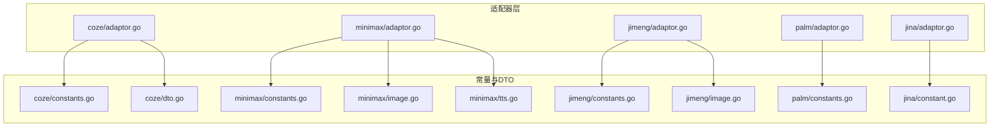
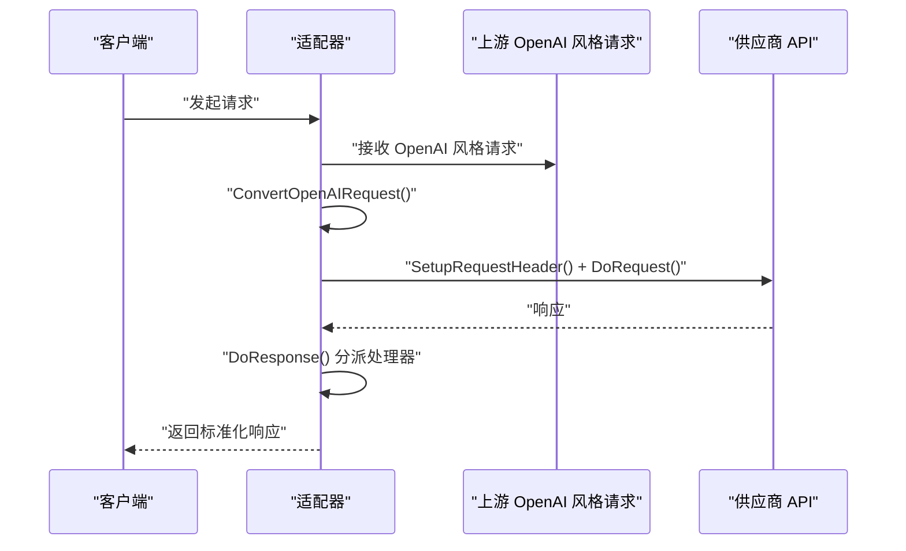
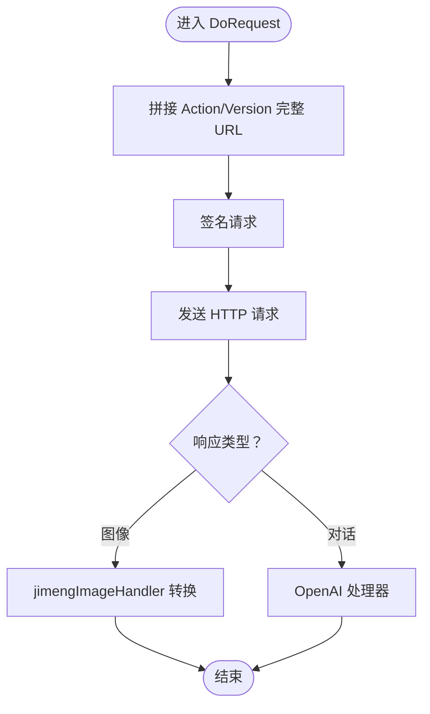
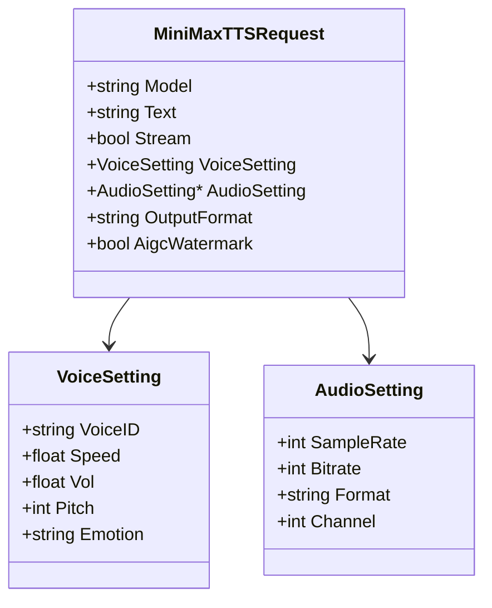
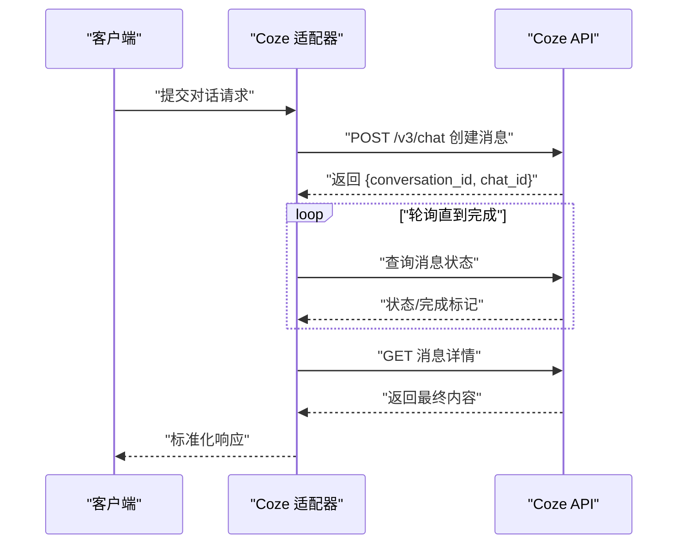
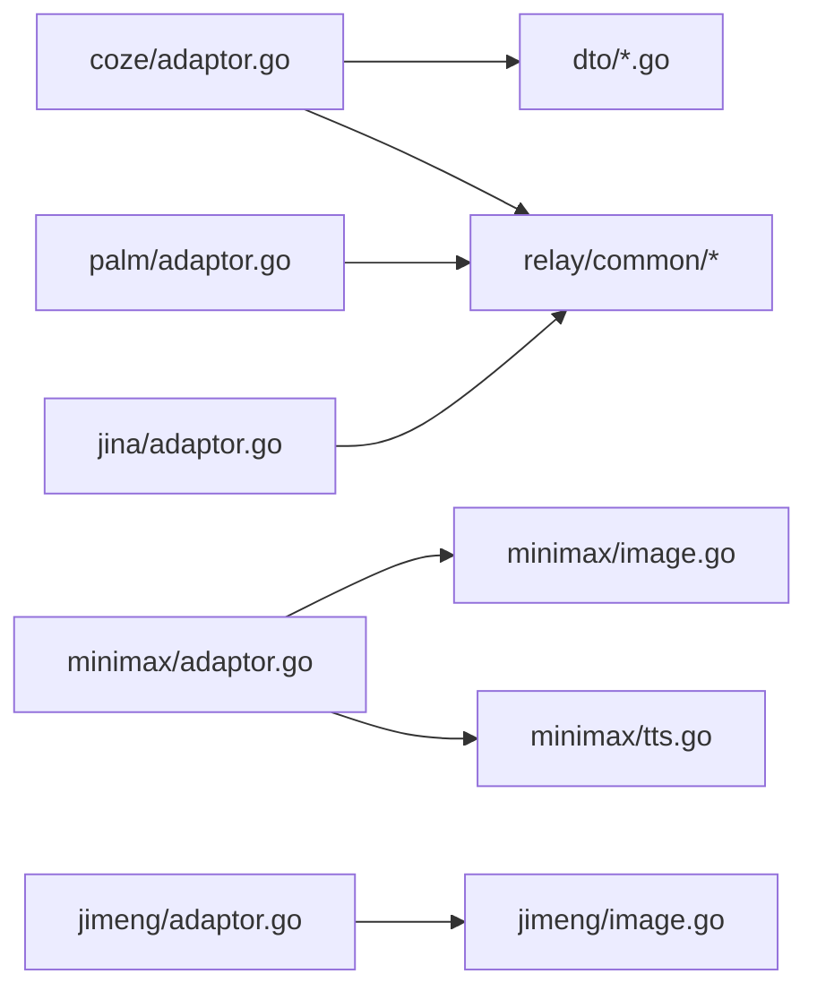

# 其他服务提供商

<cite>
**本文引用的文件**
- [relay/channel/coze/adaptor.go](file://relay/channel/coze/adaptor.go)
- [relay/channel/coze/constants.go](file://relay/channel/coze/constants.go)
- [relay/channel/coze/dto.go](file://relay/channel/coze/dto.go)
- [relay/channel/minimax/adaptor.go](file://relay/channel/minimax/adaptor.go)
- [relay/channel/minimax/constants.go](file://relay/channel/minimax/constants.go)
- [relay/channel/minimax/image.go](file://relay/channel/minimax/image.go)
- [relay/channel/minimax/tts.go](file://relay/channel/minimax/tts.go)
- [relay/channel/jimeng/adaptor.go](file://relay/channel/jimeng/adaptor.go)
- [relay/channel/jimeng/constants.go](file://relay/channel/jimeng/constants.go)
- [relay/channel/jimeng/image.go](file://relay/channel/jimeng/image.go)
- [relay/channel/palm/adaptor.go](file://relay/channel/palm/adaptor.go)
- [relay/channel/palm/constants.go](file://relay/channel/palm/constants.go)
- [relay/channel/jina/adaptor.go](file://relay/channel/jina/adaptor.go)
- [relay/channel/jina/constant.go](file://relay/channel/jina/constant.go)
</cite>

## 目录
1. [简介](#简介)
2. [项目结构](#项目结构)
3. [核心组件](#核心组件)
4. [架构总览](#架构总览)
5. [详细组件分析](#详细组件分析)
6. [依赖分析](#依赖分析)
7. [性能考虑](#性能考虑)
8. [故障排查指南](#故障排查指南)
9. [结论](#结论)
10. [附录：适配器扩展指南](#附录适配器扩展指南)

## 简介
本文件面向国内多家 AI 服务提供商（即梦、MiniMax、Coze、PaLM、Jina）的适配器，系统性梳理其适配实现、API 特点与适配难点，给出参数映射策略、功能支持与使用场景，并提供可复用的扩展指南，帮助开发者快速为新的国内 AI 服务提供商实现适配器。

## 项目结构
各适配器位于 relay/channel 下，按供应商分目录组织，统一实现 channel.Adaptor 接口的关键方法，负责请求转换、头部设置、请求转发、响应处理与用量统计等。

图表来源
- [relay/channel/coze/adaptor.go:1-140](file://relay/channel/coze/adaptor.go#L1-L140)
- [relay/channel/coze/constants.go:1-31](file://relay/channel/coze/constants.go#L1-L31)
- [relay/channel/coze/dto.go:1-79](file://relay/channel/coze/dto.go#L1-L79)
- [relay/channel/minimax/adaptor.go:1-148](file://relay/channel/minimax/adaptor.go#L1-L148)
- [relay/channel/minimax/constants.go:1-29](file://relay/channel/minimax/constants.go#L1-L29)
- [relay/channel/minimax/image.go:1-214](file://relay/channel/minimax/image.go#L1-L214)
- [relay/channel/minimax/tts.go:1-195](file://relay/channel/minimax/tts.go#L1-L195)
- [relay/channel/jimeng/adaptor.go:1-144](file://relay/channel/jimeng/adaptor.go#L1-L144)
- [relay/channel/jimeng/constants.go:1-10](file://relay/channel/jimeng/constants.go#L1-L10)
- [relay/channel/jimeng/image.go:1-91](file://relay/channel/jimeng/image.go#L1-L91)
- [relay/channel/palm/adaptor.go:1-98](file://relay/channel/palm/adaptor.go#L1-L98)
- [relay/channel/palm/constants.go:1-8](file://relay/channel/palm/constants.go#L1-L8)
- [relay/channel/jina/adaptor.go:1-100](file://relay/channel/jina/adaptor.go#L1-L100)
- [relay/channel/jina/constant.go:1-10](file://relay/channel/jina/constant.go#L1-L10)

章节来源
- [relay/channel/coze/adaptor.go:1-140](file://relay/channel/coze/adaptor.go#L1-L140)
- [relay/channel/minimax/adaptor.go:1-148](file://relay/channel/minimax/adaptor.go#L1-L148)
- [relay/channel/jimeng/adaptor.go:1-144](file://relay/channel/jimeng/adaptor.go#L1-L144)
- [relay/channel/palm/adaptor.go:1-98](file://relay/channel/palm/adaptor.go#L1-L98)
- [relay/channel/jina/adaptor.go:1-100](file://relay/channel/jina/adaptor.go#L1-L100)

## 核心组件
- 统一接口：所有适配器实现 channel.Adaptor 接口，关键方法包括：
  - ConvertOpenAIRequest / ConvertOpenAIResponsesRequest：将上游 OpenAI 风格请求转换为目标供应商格式
  - DoRequest / DoResponse：执行请求并处理响应，必要时进行轮询或二次请求
  - SetupRequestHeader：设置鉴权与通用头部
  - GetRequestURL / GetModelList / GetChannelName：返回请求地址、模型列表与通道名称
  - ConvertEmbeddingRequest / ConvertImageRequest / ConvertAudioRequest / ConvertClaudeRequest / ConvertGeminiRequest / ConvertRerankRequest：按需实现多模态与多任务转换
- 响应处理：多数适配器在 DoResponse 中根据 RelayMode 或 IsStream 分派到具体处理器（如 OpenAI 流式处理器、图片/音频专用处理器）
- 用量统计：DoResponse 返回 dto.Usage，用于计费与配额统计

章节来源
- [relay/channel/coze/adaptor.go:47-140](file://relay/channel/coze/adaptor.go#L47-L140)
- [relay/channel/minimax/adaptor.go:100-148](file://relay/channel/minimax/adaptor.go#L100-L148)
- [relay/channel/jimeng/adaptor.go:106-144](file://relay/channel/jimeng/adaptor.go#L106-L144)
- [relay/channel/palm/adaptor.go:76-98](file://relay/channel/palm/adaptor.go#L76-L98)
- [relay/channel/jina/adaptor.go:75-100](file://relay/channel/jina/adaptor.go#L75-L100)

## 架构总览
下图展示了适配器与上游请求、下游供应商 API 的交互关系，以及关键处理节点（请求转换、头部设置、请求执行、响应处理、用量统计）。

图表来源
- [relay/channel/coze/adaptor.go:65-112](file://relay/channel/coze/adaptor.go#L65-L112)
- [relay/channel/minimax/adaptor.go:119-139](file://relay/channel/minimax/adaptor.go#L119-L139)
- [relay/channel/jimeng/adaptor.go:106-135](file://relay/channel/jimeng/adaptor.go#L106-L135)
- [relay/channel/palm/adaptor.go:76-89](file://relay/channel/palm/adaptor.go#L76-L89)
- [relay/channel/jina/adaptor.go:71-91](file://relay/channel/jina/adaptor.go#L71-L91)

## 详细组件分析

### 即梦（Jimeng）适配器
- 适用场景
  - 图像生成：支持 URL 与 Base64 返回，支持水印、超分、预 LLM 扩展等扩展字段
  - 流式/非流式对话：默认走 OpenAI 处理器；图像模式走专用处理器
- 请求转换
  - ConvertOpenAIRequest：透传 OpenAI 风格请求
  - ConvertImageRequest：将 OpenAI 图像请求映射为即梦请求载荷，支持从 ExtraFields 注入厂商参数
- 请求执行
  - DoRequest：构造完整 URL（含 Action/Version），签名后调用
- 响应处理
  - 图像：jimengImageHandler 将即梦响应转为 OpenAI 图像响应格式
  - 对话：OpenAI 流式或非流式处理器
- 配置要点
  - ChannelName：jimeng
  - 模型列表：单模型示例
  - 鉴权：通过签名函数注入签名头
- 使用建议
  - 图像生成优先使用 URL 返回以降低带宽与内存开销
  - 如需水印、超分等功能，通过 ExtraFields 注入

图表来源
- [relay/channel/jimeng/adaptor.go:106-124](file://relay/channel/jimeng/adaptor.go#L106-L124)
- [relay/channel/jimeng/image.go:51-91](file://relay/channel/jimeng/image.go#L51-L91)

章节来源
- [relay/channel/jimeng/adaptor.go:1-144](file://relay/channel/jimeng/adaptor.go#L1-L144)
- [relay/channel/jimeng/constants.go:1-10](file://relay/channel/jimeng/constants.go#L1-L10)
- [relay/channel/jimeng/image.go:1-91](file://relay/channel/jimeng/image.go#L1-L91)

### MiniMax 适配器
- 适用场景
  - 文本对话：直接透传 OpenAI 风格请求
  - 图像生成：将 OpenAI 图像请求映射为 MiniMax 图像请求，支持纵横比、水印、提示词优化等
  - 语音合成（TTS）：支持多种音频格式与流式选项，自动处理 URL 与 HEX 数据
- 请求转换
  - ConvertOpenAIRequest：透传
  - ConvertImageRequest：oaiImage2MiniMaxImageRequest 映射尺寸、纵横比、格式、水印等
  - ConvertAudioRequest：构建 MiniMaxTTSRequest，支持速度、音色、采样率、位深、声道、输出格式等
- 请求执行
  - DoRequest：统一转发
- 响应处理
  - 图像：miniMaxImageHandler 将 MiniMax 响应转为 OpenAI 图像响应
  - TTS：handleTTSResponse 支持重定向 URL 与解码 HEX 音频数据
  - 对话：根据 RelayFormat 选择 Claude 或 OpenAI 处理器
- 配置要点
  - ChannelName：minimax
  - 模型列表：覆盖对话、TTS、图像等多类模型
  - 鉴权：Bearer 方式
- 使用建议
  - 图像生成建议显式指定纵横比或尺寸，避免默认比例不匹配
  - TTS 输出格式与采样率需与前端播放器兼容

图表来源
- [relay/channel/minimax/tts.go:18-71](file://relay/channel/minimax/tts.go#L18-L71)

章节来源
- [relay/channel/minimax/adaptor.go:1-148](file://relay/channel/minimax/adaptor.go#L1-L148)
- [relay/channel/minimax/constants.go:1-29](file://relay/channel/minimax/constants.go#L1-L29)
- [relay/channel/minimax/image.go:1-214](file://relay/channel/minimax/image.go#L1-L214)
- [relay/channel/minimax/tts.go:1-195](file://relay/channel/minimax/tts.go#L1-L195)

### Coze 适配器
- 适用场景
  - 对话：支持流式与非流式；非流式采用“创建消息 -> 轮询 -> 获取详情”的两段式流程
  - 工作流集成：通过额外参数与元数据传递工作流变量与上下文
- 请求转换
  - ConvertOpenAIRequest：转换为 CozeChatRequest
- 请求执行
  - DoRequest：先创建消息，解析响应中的会话与消息 ID；循环轮询直到完成；最后获取消息详情
- 响应处理
  - 流式：cozeChatStreamHandler
  - 非流式：cozeChatHandler
- 配置要点
  - ChannelName：coze
  - 模型列表：覆盖多款大模型与 Doubao 系列视觉/推理模型
- 使用建议
  - 非流式场景注意轮询间隔与失败重试
  - 利用 ConversationId 与 ChatId 进行会话追踪与审计

图表来源
- [relay/channel/coze/adaptor.go:65-102](file://relay/channel/coze/adaptor.go#L65-L102)
- [relay/channel/coze/dto.go:31-74](file://relay/channel/coze/dto.go#L31-L74)

章节来源
- [relay/channel/coze/adaptor.go:1-140](file://relay/channel/coze/adaptor.go#L1-L140)
- [relay/channel/coze/constants.go:1-31](file://relay/channel/coze/constants.go#L1-L31)
- [relay/channel/coze/dto.go:1-79](file://relay/channel/coze/dto.go#L1-L79)

### PaLM 适配器
- 适用场景
  - 文本对话：基于 Google PaLM 的消息接口
- 请求转换
  - ConvertOpenAIRequest：透传
- 请求执行
  - DoRequest：统一转发
- 响应处理
  - 流式：palmStreamHandler
  - 非流式：palmHandler
- 配置要点
  - ChannelName：google palm
  - 模型列表：PaLM-2
  - 鉴权：x-goog-api-key
- 使用建议
  - 注意流式与非流式的用量统计差异（流式由文本长度估算）

章节来源
- [relay/channel/palm/adaptor.go:1-98](file://relay/channel/palm/adaptor.go#L1-L98)
- [relay/channel/palm/constants.go:1-8](file://relay/channel/palm/constants.go#L1-L8)

### Jina 适配器
- 适用场景
  - 重排（rerank）：映射到 /v1/rerank
  - 嵌入（embeddings）：映射到 /v1/embeddings
- 请求转换
  - ConvertOpenAIRequest：透传
  - ConvertRerankRequest / ConvertEmbeddingRequest：分别透传为 rerank/embedding 请求
- 请求执行
  - DoRequest：统一转发
- 响应处理
  - 重排：common_handler.RerankHandler
  - 嵌入：OpenAI 处理器
- 配置要点
  - ChannelName：jina
  - 模型列表：clip、reranker 等
  - 鉴权：Bearer
- 使用建议
  - 嵌入场景注意 EncodingFormat 的兼容性处理

章节来源
- [relay/channel/jina/adaptor.go:1-100](file://relay/channel/jina/adaptor.go#L1-L100)
- [relay/channel/jina/constant.go:1-10](file://relay/channel/jina/constant.go#L1-L10)

## 依赖分析
- 适配器间耦合度低，均独立实现 channel.Adaptor 接口
- 多数适配器依赖通用工具：
  - relay/common：请求信息、头部设置
  - relay/constant：RelayMode 常量
  - service：文本到用量估算
  - types：错误封装与状态码
- MiniMax 适配器对 Claude/OpenAI 处理器存在条件分发，体现“组合优于继承”的设计

图表来源
- [relay/channel/coze/adaptor.go:1-140](file://relay/channel/coze/adaptor.go#L1-L140)
- [relay/channel/minimax/adaptor.go:1-148](file://relay/channel/minimax/adaptor.go#L1-L148)
- [relay/channel/jimeng/adaptor.go:1-144](file://relay/channel/jimeng/adaptor.go#L1-L144)
- [relay/channel/palm/adaptor.go:1-98](file://relay/channel/palm/adaptor.go#L1-L98)
- [relay/channel/jina/adaptor.go:1-100](file://relay/channel/jina/adaptor.go#L1-L100)

## 性能考虑
- 即梦图像：优先返回 URL，减少 Base64 字符串传输与解码成本
- MiniMax TTS：支持重定向 URL，避免本地解码与二次传输
- Coze 非流式：轮询间隔与最大等待时间需平衡延迟与成功率
- 用量统计：尽量使用上游返回的精确用量，若不可得则按估算规则计算

## 故障排查指南
- 即梦图像
  - 错误码非成功：检查返回的 code/message 并映射为标准错误
  - 响应体解析失败：确认 Content-Type 与响应体结构
- MiniMax 图像/TTS
  - base_resp.status_code 非 0：按状态码与消息返回错误
  - TTS 音频数据为空或无法解码：核对输出格式与编码
- Coze 对话
  - 创建消息失败：检查 bot_id、user_id、additional_messages 等参数
  - 轮询无进展：确认会话状态与网络连通性
- PaLM/Jina
  - 鉴权失败：确认 API Key 与请求头设置
  - 模型不支持：核对模型列表与请求模型名

章节来源
- [relay/channel/jimeng/image.go:51-91](file://relay/channel/jimeng/image.go#L51-L91)
- [relay/channel/minimax/tts.go:107-172](file://relay/channel/minimax/tts.go#L107-L172)
- [relay/channel/minimax/image.go:178-214](file://relay/channel/minimax/image.go#L178-L214)
- [relay/channel/coze/adaptor.go:65-102](file://relay/channel/coze/adaptor.go#L65-L102)
- [relay/channel/palm/adaptor.go:76-89](file://relay/channel/palm/adaptor.go#L76-L89)
- [relay/channel/jina/adaptor.go:71-91](file://relay/channel/jina/adaptor.go#L71-L91)

## 结论
上述适配器遵循统一接口规范，针对不同供应商的 API 特性实现了差异化转换与处理逻辑。即梦侧重图像生成与签名认证；MiniMax 提供多模态（对话、图像、TTS）与丰富的参数映射；Coze 实现了两阶段非流式对话；PaLM 与 Jina 则分别覆盖文本对话与重排/嵌入能力。整体架构清晰、扩展性强，便于新增供应商适配。

## 附录：适配器扩展指南
- 新建目录与文件
  - 在 relay/channel 下新建供应商目录，包含：
    - adaptor.go：实现 channel.Adaptor 接口
    - constants.go：定义 ChannelName 与模型列表
    - 可选：dto.go（供应商特有请求/响应结构）、relay-*.go（路由/测试）
- 接口实现要点
  - ConvertOpenAIRequest：将上游 OpenAI 风格请求映射到供应商请求
  - SetupRequestHeader：设置鉴权与通用头部
  - GetRequestURL：拼装供应商 API 地址
  - DoRequest/DoResponse：转发请求与处理响应，必要时二次请求或轮询
  - GetModelList/GetChannelName：返回模型列表与通道名称
- 多模态支持
  - 图像：实现 ConvertImageRequest 与相应处理器
  - 语音：实现 ConvertAudioRequest 与 TTS 处理器
  - 嵌入/重排：实现 ConvertEmbeddingRequest/ConvertRerankRequest
- 参数映射策略
  - 一一对应：优先直接映射
  - 默认值：对未提供的字段设置合理默认
  - 扩展字段：通过 Extra/ExtraFields 注入供应商自定义参数
- 错误处理与用量统计
  - 统一使用 types.NewAPIError 与 types.WithOpenAIError
  - 优先使用上游返回的用量，否则按估算规则计算
- 测试与验证
  - 编写最小可用示例，覆盖流式/非流式、图像、TTS、嵌入/重排等场景
  - 校验错误码与错误消息的正确映射

章节来源
- [relay/channel/coze/adaptor.go:47-140](file://relay/channel/coze/adaptor.go#L47-L140)
- [relay/channel/minimax/adaptor.go:100-148](file://relay/channel/minimax/adaptor.go#L100-L148)
- [relay/channel/jimeng/adaptor.go:106-144](file://relay/channel/jimeng/adaptor.go#L106-L144)
- [relay/channel/palm/adaptor.go:76-98](file://relay/channel/palm/adaptor.go#L76-L98)
- [relay/channel/jina/adaptor.go:71-100](file://relay/channel/jina/adaptor.go#L71-L100)