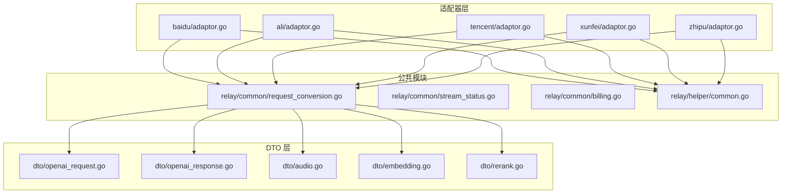
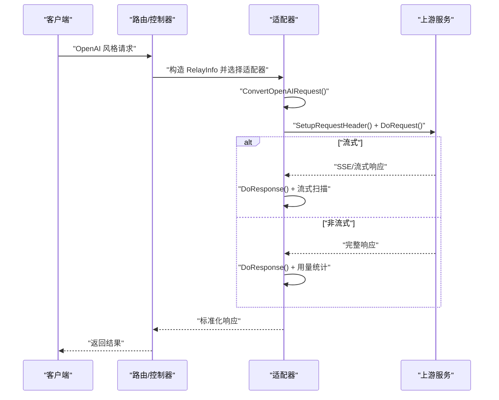
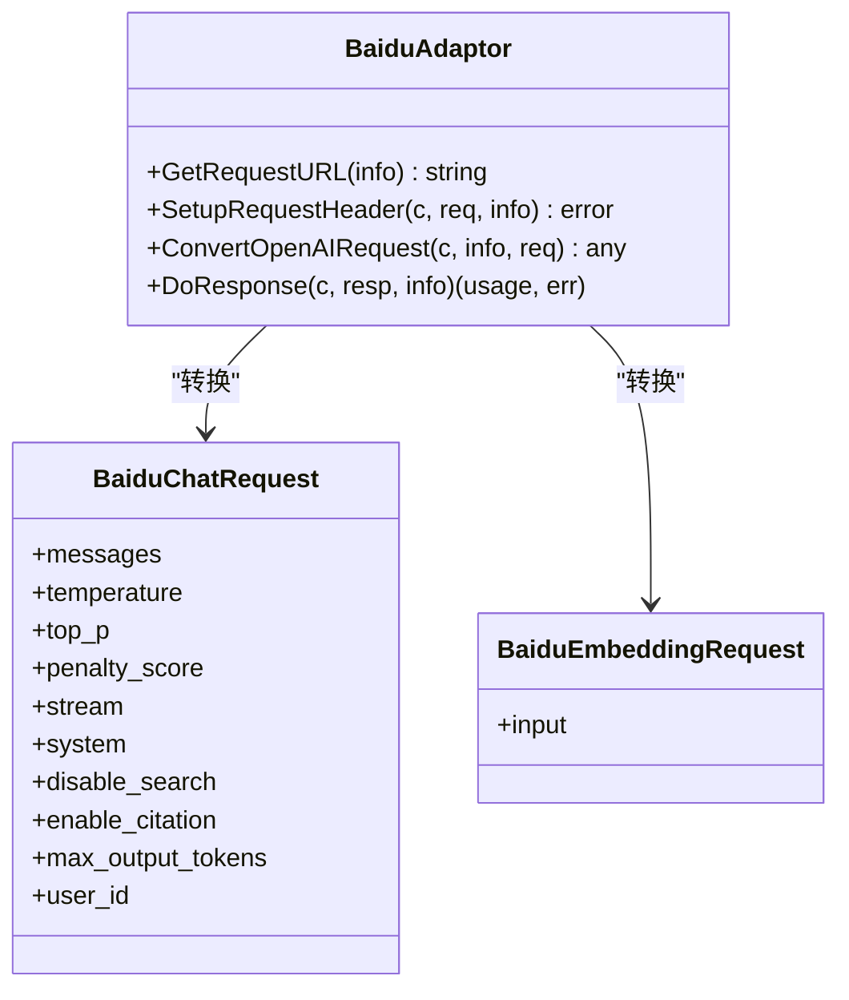
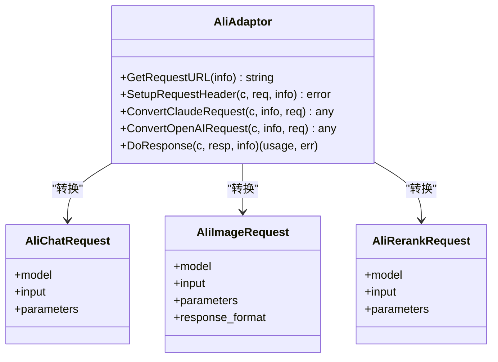
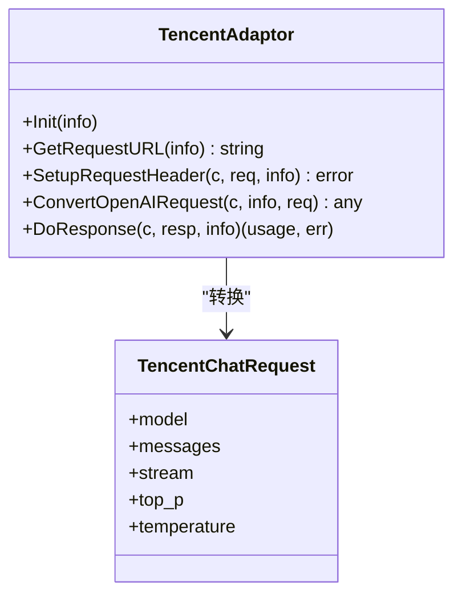
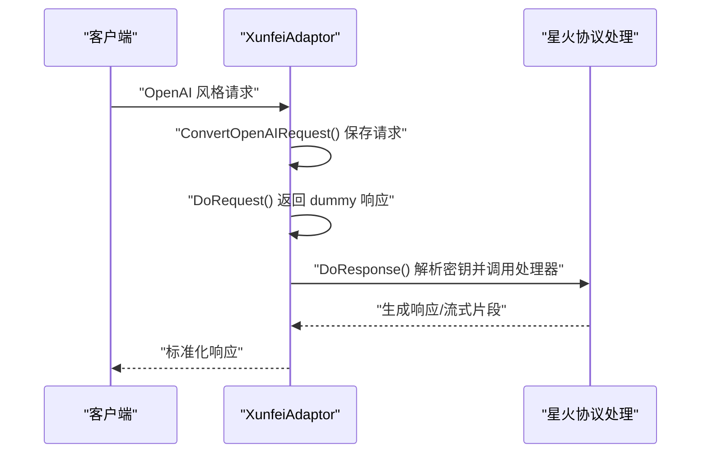
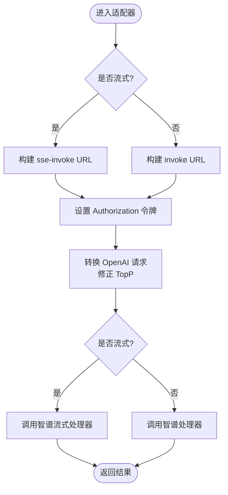
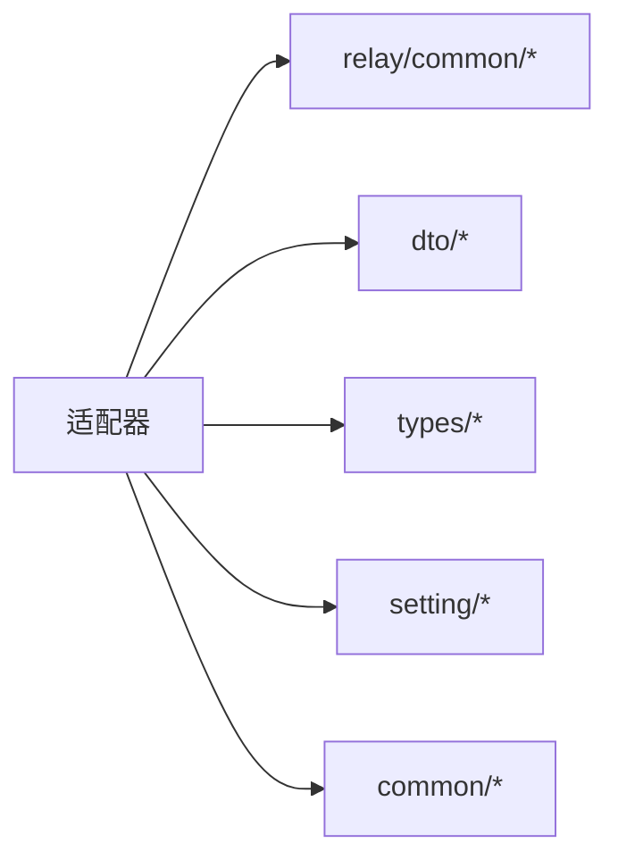

# 其他适配器

<cite>
**本文引用的文件**
- [relay/channel/baidu/adaptor.go](file://relay/channel/baidu/adaptor.go)
- [relay/channel/baidu/constants.go](file://relay/channel/baidu/constants.go)
- [relay/channel/baidu/dto.go](file://relay/channel/baidu/dto.go)
- [relay/channel/ali/adaptor.go](file://relay/channel/ali/adaptor.go)
- [relay/channel/ali/constants.go](file://relay/channel/ali/constants.go)
- [relay/channel/ali/dto.go](file://relay/channel/ali/dto.go)
- [relay/channel/tencent/adaptor.go](file://relay/channel/tencent/adaptor.go)
- [relay/channel/tencent/constants.go](file://relay/channel/tencent/constants.go)
- [relay/channel/tencent/dto.go](file://relay/channel/tencent/dto.go)
- [relay/channel/xunfei/adaptor.go](file://relay/channel/xunfei/adaptor.go)
- [relay/channel/xunfei/constants.go](file://relay/channel/xunfei/constants.go)
- [relay/channel/xunfei/dto.go](file://relay/channel/xunfei/dto.go)
- [relay/channel/zhipu/adaptor.go](file://relay/channel/zhipu/adaptor.go)
- [relay/channel/zhipu/constants.go](file://relay/channel/zhipu/constants.go)
- [relay/channel/zhipu/dto.go](file://relay/channel/zhipu/dto.go)
- [relay/channel/adapter.go](file://relay/channel/adapter.go)
- [relay/common/relay_info.go](file://relay/common/relay_info.go)
- [relay/common/request_conversion.go](file://relay/common/request_conversion.go)
- [relay/common/stream_status.go](file://relay/common/stream_status.go)
- [relay/common/billing.go](file://relay/common/billing.go)
- [relay/helper/common.go](file://relay/helper/common.go)
- [relay/helper/valid_request.go](file://relay/helper/valid_request.go)
- [relay/helper/stream_scanner.go](file://relay/helper/stream_scanner.go)
- [relay/helper/price.go](file://relay/helper/price.go)
- [dto/openai_request.go](file://dto/openai_request.go)
- [dto/openai_response.go](file://dto/openai_response.go)
- [dto/audio.go](file://dto/audio.go)
- [dto/embedding.go](file://dto/embedding.go)
- [dto/rerank.go](file://dto/rerank.go)
- [dto/realtime.go](file://dto/realtime.go)
- [types/error.go](file://types/error.go)
- [types/relay_format.go](file://types/relay_format.go)
- [types/request_meta.go](file://types/request_meta.go)
- [types/price_data.go](file://types/price_data.go)
- [common/constants.go](file://common/constants.go)
- [common/env.go](file://common/env.go)
- [common/url_validator.go](file://common/url_validator.go)
- [common/ssrf_protection.go](file://common/ssrf_protection.go)
- [service/openaicompat/chat_to_responses.go](file://service/openaicompat/chat_to_responses.go)
- [service/openaicompat/responses_to_chat.go](file://service/openaicompat/responses_to_chat.go)
- [setting/model_setting/global.go](file://setting/model_setting/global.go)
- [setting/ratio_setting/model_ratio.go](file://setting/ratio_setting/model_ratio.go)
- [setting/ratio_setting/expose_ratio.go](file://setting/ratio_setting/expose_ratio.go)
- [setting/system_setting/fetch_setting.go](file://setting/system_setting/fetch_setting.go)
- [controller/channel.go](file://controller/channel.go)
- [controller/relay.go](file://controller/relay.go)
- [router/api-router.go](file://router/api-router.go)
- [router/relay-router.go](file://router/relay-router.go)
- [web/src/pages/Channel/index.jsx](file://web/src/pages/Channel/index.jsx)
- [web/src/pages/Playground/index.jsx](file://web/src/pages/Playground/index.jsx)
- [web/src/components/settings/OtherSetting.jsx](file://web/src/components/settings/OtherSetting.jsx)
- [docs/channel/other_setting.md](file://docs/channel/other_setting.md)
</cite>

## 目录
1. [简介](#简介)
2. [项目结构](#项目结构)
3. [核心组件](#核心组件)
4. [架构总览](#架构总览)
5. [详细组件分析](#详细组件分析)
6. [依赖分析](#依赖分析)
7. [性能考虑](#性能考虑)
8. [故障排查指南](#故障排查指南)
9. [结论](#结论)
10. [附录](#附录)

## 简介
本文件面向其他 AI 服务提供商适配器的技术文档，系统性梳理并对比百度文心、阿里通义、腾讯混元、讯飞星火、智谱清言等国内主流 AI 服务的适配实现。重点解释各服务提供商 API 的特点与适配难点，包括请求格式差异、参数映射策略、响应处理机制，并给出适配器扩展指南，帮助开发者快速为新的 AI 服务提供商实现适配器。

## 项目结构
适配器遵循统一的适配器接口规范，位于 relay/channel 下的子目录中，每个子目录包含适配器实现、常量定义、DTO 数据结构以及对应的处理器函数。通用的请求转换、流式处理、计费统计等功能由公共模块提供。

图表来源
- [relay/channel/baidu/adaptor.go:1-171](file://relay/channel/baidu/adaptor.go#L1-L171)
- [relay/channel/ali/adaptor.go:1-255](file://relay/channel/ali/adaptor.go#L1-L255)
- [relay/channel/tencent/adaptor.go:1-120](file://relay/channel/tencent/adaptor.go#L1-L120)
- [relay/channel/xunfei/adaptor.go:1-106](file://relay/channel/xunfei/adaptor.go#L1-L106)
- [relay/channel/zhipu/adaptor.go:1-104](file://relay/channel/zhipu/adaptor.go#L1-L104)
- [relay/common/request_conversion.go](file://relay/common/request_conversion.go)
- [relay/common/stream_status.go](file://relay/common/stream_status.go)
- [relay/common/billing.go](file://relay/common/billing.go)
- [dto/openai_request.go](file://dto/openai_request.go)
- [dto/openai_response.go](file://dto/openai_response.go)

章节来源
- [relay/channel/baidu/adaptor.go:1-171](file://relay/channel/baidu/adaptor.go#L1-L171)
- [relay/channel/ali/adaptor.go:1-255](file://relay/channel/ali/adaptor.go#L1-L255)
- [relay/channel/tencent/adaptor.go:1-120](file://relay/channel/tencent/adaptor.go#L1-L120)
- [relay/channel/xunfei/adaptor.go:1-106](file://relay/channel/xunfei/adaptor.go#L1-L106)
- [relay/channel/zhipu/adaptor.go:1-104](file://relay/channel/zhipu/adaptor.go#L1-L104)

## 核心组件
- 适配器接口与职责
  - 统一的适配器接口负责：请求 URL 构造、请求头设置、OpenAI 请求转换、特定模型请求转换、响应处理与用量统计。
  - 适配器通过 relay/common/relay_info.go 获取上游模型名、通道基础地址、是否流式等上下文信息。
- 请求转换
  - 通用 OpenAI 请求转换逻辑集中在 relay/common/request_conversion.go，适配器在此基础上进行差异化映射。
- 流式处理
  - 流式响应由 relay/common/stream_status.go 管理状态，relay/helper/stream_scanner.go 提供扫描器能力。
- 计费与价格
  - 用量统计与计费由 relay/common/billing.go 完成；价格映射由 setting/ratio_setting 下的模块提供。

章节来源
- [relay/common/relay_info.go](file://relay/common/relay_info.go)
- [relay/common/request_conversion.go](file://relay/common/request_conversion.go)
- [relay/common/stream_status.go](file://relay/common/stream_status.go)
- [relay/common/billing.go](file://relay/common/billing.go)
- [relay/helper/stream_scanner.go](file://relay/helper/stream_scanner.go)
- [setting/ratio_setting/model_ratio.go](file://setting/ratio_setting/model_ratio.go)

## 架构总览
下图展示了从客户端请求到上游服务的适配流程，以及各适配器的关键处理点。

图表来源
- [relay/channel/baidu/adaptor.go:121-162](file://relay/channel/baidu/adaptor.go#L121-L162)
- [relay/channel/ali/adaptor.go:138-246](file://relay/channel/ali/adaptor.go#L138-L246)
- [relay/channel/tencent/adaptor.go:69-111](file://relay/channel/tencent/adaptor.go#L69-L111)
- [relay/channel/xunfei/adaptor.go:54-97](file://relay/channel/xunfei/adaptor.go#L54-L97)
- [relay/channel/zhipu/adaptor.go:60-95](file://relay/channel/zhipu/adaptor.go#L60-L95)

## 详细组件分析

### 百度文心适配器
- 特点与难点
  - 支持多种模型变体与嵌入模型，请求路径与模型名映射复杂。
  - 需要动态拼接 access_token 参数，且不同模型对应不同 RPC 接口后缀。
  - 嵌入与聊天两类请求的处理逻辑分离。
- 关键实现要点
  - GetRequestURL：根据上游模型名映射到具体 RPC 接口后缀，并拼接 access_token。
  - ConvertOpenAIRequest：将通用 OpenAI 请求转换为百度请求结构。
  - DoResponse：区分流式与非流式，分别调用百度专用处理器。
- 数据模型与参数映射
  - 请求消息结构、温度、top_p、惩罚系数、最大输出 token 等参数映射至百度请求字段。
  - 响应结构包含结果文本、截断标记、历史清理提示与用量统计。
- 使用场景
  - 适合需要多模型变体与嵌入能力的场景；注意模型名大小写与前缀匹配。

图表来源
- [relay/channel/baidu/adaptor.go:47-162](file://relay/channel/baidu/adaptor.go#L47-L162)
- [relay/channel/baidu/dto.go:15-67](file://relay/channel/baidu/dto.go#L15-L67)

章节来源
- [relay/channel/baidu/adaptor.go:47-162](file://relay/channel/baidu/adaptor.go#L47-L162)
- [relay/channel/baidu/constants.go:1-23](file://relay/channel/baidu/constants.go#L1-L23)
- [relay/channel/baidu/dto.go:10-81](file://relay/channel/baidu/dto.go#L10-L81)

### 阿里通义适配器
- 特点与难点
  - 支持 Claude 兼容接口与通义兼容模式，需根据模型名判断是否直接透传。
  - 图像生成功能区分同步与异步，头部设置包含 DashScope 特有参数。
  - 兼容模式下支持 rerank 与 embeddings。
- 关键实现要点
  - GetRequestURL：根据 RelayFormat 与 RelayMode 动态选择不同接口路径。
  - SetupRequestHeader：设置 Authorization、SSE、Plugin、Async 等头部。
  - ConvertClaudeRequest：对支持的模型直接透传，否则转换为 OpenAI 请求。
  - DoResponse：根据格式与模式选择 OpenAI 或通义图像处理器。
- 数据模型与参数映射
  - 通义消息结构、输入与参数结构、图像输入与参数结构、rerank 输入与参数结构。
  - 输出结构包含 choices、任务状态、完成原因、用量统计与错误信息。
- 使用场景
  - 适合需要同时对接 Claude 与通义生态的场景；注意图像生成的同步/异步差异。

图表来源
- [relay/channel/ali/adaptor.go:72-246](file://relay/channel/ali/adaptor.go#L72-L246)
- [relay/channel/ali/dto.go:36-236](file://relay/channel/ali/dto.go#L36-L236)

章节来源
- [relay/channel/ali/adaptor.go:72-246](file://relay/channel/ali/adaptor.go#L72-L246)
- [relay/channel/ali/constants.go:1-15](file://relay/channel/ali/constants.go#L1-L15)
- [relay/channel/ali/dto.go:12-237](file://relay/channel/ali/dto.go#L12-L237)

### 腾讯混元适配器
- 特点与难点
  - 使用签名机制，请求头包含 Action、Version、Timestamp、Authorization 等。
  - 支持流式与非流式两种响应模式。
- 关键实现要点
  - Init：初始化 Action、Version、Timestamp。
  - SetupRequestHeader：计算并设置签名 Authorization。
  - ConvertOpenAIRequest：将 OpenAI 请求转换为腾讯混元请求结构。
  - DoResponse：根据是否流式选择不同处理器。
- 数据模型与参数映射
  - 请求消息结构、模型名、流式开关、采样参数等。
  - 响应结构包含 choices、usage、错误信息与请求 ID。
- 使用场景
  - 适合需要严格签名认证与流式低延迟场景。

图表来源
- [relay/channel/tencent/adaptor.go:50-111](file://relay/channel/tencent/adaptor.go#L50-L111)
- [relay/channel/tencent/dto.go:8-71](file://relay/channel/tencent/dto.go#L8-L71)

章节来源
- [relay/channel/tencent/adaptor.go:50-111](file://relay/channel/tencent/adaptor.go#L50-L111)
- [relay/channel/tencent/constants.go:1-11](file://relay/channel/tencent/constants.go#L1-L11)
- [relay/channel/tencent/dto.go:3-76](file://relay/channel/tencent/dto.go#L3-L76)

### 讯飞星火适配器
- 特点与难点
  - 星火的请求不是标准 HTTP，适配器在 DoRequest 阶段返回虚拟响应，实际处理在 DoResponse 中完成。
  - 需要从密钥中拆分 AppId、SecretId、SecretKey 三段信息。
- 关键实现要点
  - ConvertOpenAIRequest：保存请求对象以便后续处理。
  - DoRequest：返回 dummy 响应，避免真实 HTTP 发送。
  - DoResponse：根据是否流式调用不同处理器，并进行参数校验。
- 数据模型与参数映射
  - 请求结构包含 header、parameter、payload，参数域包含 domain、temperature、top_k、max_tokens 等。
  - 响应结构包含 header、payload.choices、payload.usage 等。
- 使用场景
  - 适合需要兼容非 HTTP 星火协议的场景；注意密钥格式与流式处理差异。

图表来源
- [relay/channel/xunfei/adaptor.go:54-97](file://relay/channel/xunfei/adaptor.go#L54-L97)
- [relay/channel/xunfei/dto.go:10-59](file://relay/channel/xunfei/dto.go#L10-L59)

章节来源
- [relay/channel/xunfei/adaptor.go:54-97](file://relay/channel/xunfei/adaptor.go#L54-L97)
- [relay/channel/xunfei/constants.go:1-13](file://relay/channel/xunfei/constants.go#L1-L13)
- [relay/channel/xunfei/dto.go:5-59](file://relay/channel/xunfei/dto.go#L5-L59)

### 智谱清言适配器
- 特点与难点
  - 根据是否流式选择不同的 API 方法（invoke/sse-invoke）。
  - 对 TopP 进行边界修正，确保符合服务端要求。
- 关键实现要点
  - GetRequestURL：根据是否流式拼接方法名。
  - SetupRequestHeader：生成并设置令牌 Authorization。
  - ConvertOpenAIRequest：将 OpenAI 请求转换为智谱请求，并修正 TopP。
  - DoResponse：根据是否流式选择处理器。
- 数据模型与参数映射
  - 请求结构包含 prompt、temperature、top_p、request_id、incremental 等。
  - 响应结构包含 code、msg、success、data.choices、data.usage 等。
- 使用场景
  - 适合需要高精度参数控制与流式交互的场景。

图表来源
- [relay/channel/zhipu/adaptor.go:45-95](file://relay/channel/zhipu/adaptor.go#L45-L95)
- [relay/channel/zhipu/dto.go:14-42](file://relay/channel/zhipu/dto.go#L14-L42)

章节来源
- [relay/channel/zhipu/adaptor.go:45-95](file://relay/channel/zhipu/adaptor.go#L45-L95)
- [relay/channel/zhipu/constants.go:1-8](file://relay/channel/zhipu/constants.go#L1-L8)
- [relay/channel/zhipu/dto.go:9-48](file://relay/channel/zhipu/dto.go#L9-L48)

## 依赖分析
- 适配器与公共模块
  - 所有适配器均依赖 relay/common/* 提供的请求转换、流式状态管理与计费能力。
  - 适配器通过 relay/channel/adapter.go 中的统一入口被路由选择。
- DTO 与类型
  - 适配器依赖 dto/* 与 types/* 提供的通用数据结构与错误类型。
- 配置与设置
  - 适配器读取 setting/* 与 common/* 提供的模型列表、比率与环境变量等配置。

图表来源
- [relay/channel/baidu/adaptor.go:1-171](file://relay/channel/baidu/adaptor.go#L1-L171)
- [relay/channel/ali/adaptor.go:1-255](file://relay/channel/ali/adaptor.go#L1-L255)
- [relay/channel/tencent/adaptor.go:1-120](file://relay/channel/tencent/adaptor.go#L1-L120)
- [relay/channel/xunfei/adaptor.go:1-106](file://relay/channel/xunfei/adaptor.go#L1-L106)
- [relay/channel/zhipu/adaptor.go:1-104](file://relay/channel/zhipu/adaptor.go#L1-L104)

章节来源
- [relay/channel/adapter.go](file://relay/channel/adapter.go)
- [dto/openai_request.go](file://dto/openai_request.go)
- [dto/openai_response.go](file://dto/openai_response.go)
- [types/error.go](file://types/error.go)
- [setting/model_setting/global.go](file://setting/model_setting/global.go)
- [common/env.go](file://common/env.go)

## 性能考虑
- 流式传输
  - 优先使用流式接口降低首字节延迟，结合 relay/common/stream_status.go 与 relay/helper/stream_scanner.go 实现高效扫描与拼接。
- 头部优化
  - 通义适配器在图像生成场景设置异步头部，减少等待时间；混元适配器启用 SSE 头部提升流式体验。
- 用量统计
  - 通过 relay/common/billing.go 在 DoResponse 阶段统一统计用量，避免重复计算。
- 模型与比率
  - 使用 setting/ratio_setting 下的模块进行价格映射与暴露，确保计费准确与透明。

章节来源
- [relay/common/stream_status.go](file://relay/common/stream_status.go)
- [relay/helper/stream_scanner.go](file://relay/helper/stream_scanner.go)
- [relay/common/billing.go](file://relay/common/billing.go)
- [setting/ratio_setting/expose_ratio.go](file://setting/ratio_setting/expose_ratio.go)

## 故障排查指南
- 常见错误类型
  - 无效密钥：适配器在解析密钥失败或请求为空时返回相应错误码。
  - 请求参数错误：检查 ConvertOpenAIRequest 映射是否正确，尤其是特殊参数（如智谱 TopP）。
  - 流式处理异常：确认是否正确设置流式头部与扫描器。
- 定位步骤
  - 查看适配器的 DoResponse 返回的错误类型与信息。
  - 检查 relay/common/request_conversion.go 的转换逻辑与 relay/common/stream_status.go 的状态机。
  - 核对 setting/* 与 common/* 的配置项是否正确。
- 建议
  - 在本地 Playground 页面调试请求与响应，观察流式片段与最终结果。
  - 使用 Web 控制台查看通道配置与日志。

章节来源
- [types/error.go](file://types/error.go)
- [relay/channel/xunfei/adaptor.go:84-97](file://relay/channel/xunfei/adaptor.go#L84-L97)
- [relay/channel/zhipu/adaptor.go:64-67](file://relay/channel/zhipu/adaptor.go#L64-L67)
- [relay/helper/valid_request.go](file://relay/helper/valid_request.go)
- [web/src/pages/Playground/index.jsx](file://web/src/pages/Playground/index.jsx)

## 结论
本文档系统梳理了百度文心、阿里通义、腾讯混元、讯飞星火、智谱清言等适配器的实现模式与最佳实践。通过统一的适配器接口与公共模块，开发者可以快速扩展新的 AI 服务提供商适配器。建议在实现过程中重点关注请求格式差异、参数映射策略与响应处理机制，并充分利用流式传输与用量统计能力提升性能与可观测性。

## 附录

### 配置参数与使用场景
- 百度文心
  - 模型列表：ERNIE 系列、Embedding-V1、bge 系列、tao-8k。
  - 场景：多模型变体与嵌入需求。
- 阿里通义
  - 模型列表：qwen 系列、qwq、text-embedding-v1、gte-rerank-v2。
  - 场景：Claude 兼容与通义生态融合。
- 腾讯混元
  - 模型列表：hunyuan-lite/pro/standard/standard-256K。
  - 场景：严格签名认证与低延迟流式交互。
- 讯飞星火
  - 模型列表：SparkDesk 系列。
  - 场景：非 HTTP 协议兼容与多版本模型支持。
- 智谱清言
  - 模型列表：chatglm_turbo/pro/std/lite。
  - 场景：高精度参数控制与流式交互。

章节来源
- [relay/channel/baidu/constants.go:3-22](file://relay/channel/baidu/constants.go#L3-L22)
- [relay/channel/ali/constants.go:3-12](file://relay/channel/ali/constants.go#L3-L12)
- [relay/channel/tencent/constants.go:3-8](file://relay/channel/tencent/constants.go#L3-L8)
- [relay/channel/xunfei/constants.go:3-10](file://relay/channel/xunfei/constants.go#L3-L10)
- [relay/channel/zhipu/constants.go:3-5](file://relay/channel/zhipu/constants.go#L3-L5)

### 适配器扩展指南
- 步骤
  - 新建目录 relay/channel/<provider>/，实现适配器接口方法。
  - 定义模型列表与通道名称常量。
  - 编写 DTO 结构与请求/响应转换函数。
  - 在路由层注册适配器并配置默认参数。
- 最佳实践
  - 明确区分流式与非流式处理路径。
  - 统一设置请求头与鉴权信息。
  - 在 DoResponse 中统一处理用量统计与错误映射。
  - 提供完善的单元测试覆盖关键分支。

章节来源
- [relay/channel/baidu/adaptor.go:47-162](file://relay/channel/baidu/adaptor.go#L47-L162)
- [relay/channel/ali/adaptor.go:72-246](file://relay/channel/ali/adaptor.go#L72-L246)
- [relay/channel/tencent/adaptor.go:50-111](file://relay/channel/tencent/adaptor.go#L50-L111)
- [relay/channel/xunfei/adaptor.go:54-97](file://relay/channel/xunfei/adaptor.go#L54-L97)
- [relay/channel/zhipu/adaptor.go:45-95](file://relay/channel/zhipu/adaptor.go#L45-L95)