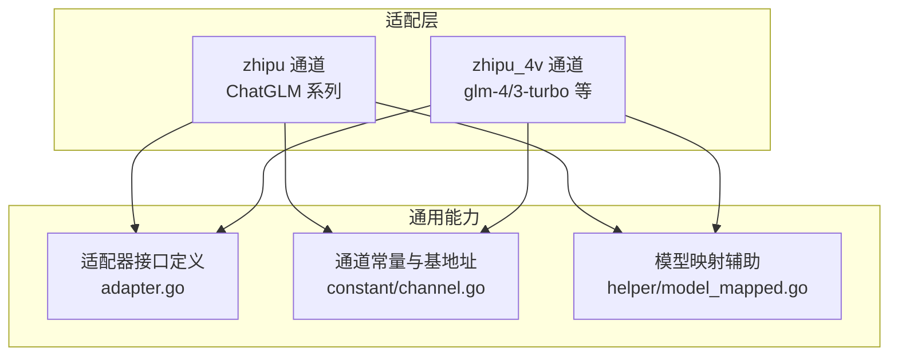
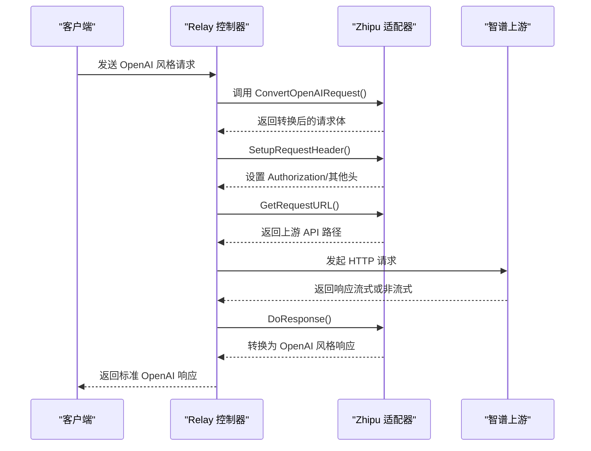
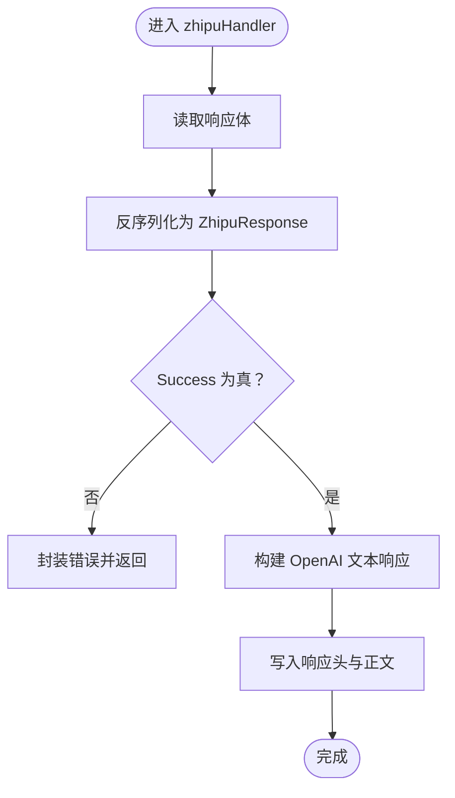
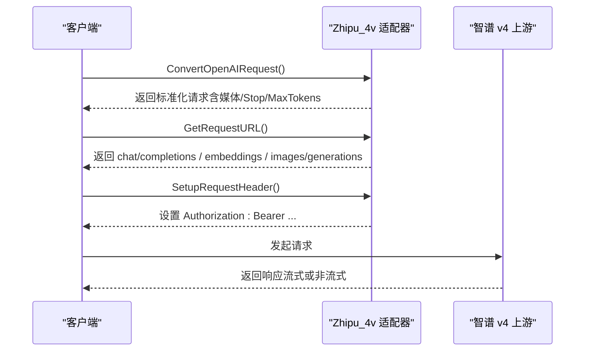
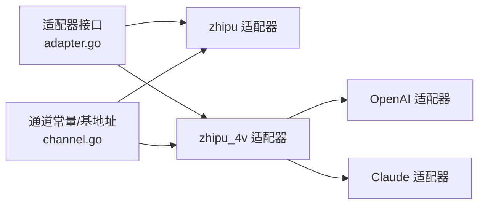

# 智谱清言适配器

<cite>
**本文引用的文件**
- [relay/channel/zhipu/adaptor.go](file://relay/channel/zhipu/adaptor.go)
- [relay/channel/zhipu/constants.go](file://relay/channel/zhipu/constants.go)
- [relay/channel/zhipu/dto.go](file://relay/channel/zhipu/dto.go)
- [relay/channel/zhipu/relay-zhipu.go](file://relay/channel/zhipu/relay-zhipu.go)
- [relay/channel/zhipu_4v/adaptor.go](file://relay/channel/zhipu_4v/adaptor.go)
- [relay/channel/zhipu_4v/constants.go](file://relay/channel/zhipu_4v/constants.go)
- [relay/channel/zhipu_4v/dto.go](file://relay/channel/zhipu_4v/dto.go)
- [relay/channel/zhipu_4v/relay-zhipu_v4.go](file://relay/channel/zhipu_4v/relay-zhipu_v4.go)
- [relay/channel/adapter.go](file://relay/channel/adapter.go)
- [constant/channel.go](file://constant/channel.go)
- [relay/helper/model_mapped.go](file://relay/helper/model_mapped.go)
- [dto/embedding.go](file://dto/embedding.go)
</cite>

## 目录
1. [简介](#简介)
2. [项目结构](#项目结构)
3. [核心组件](#核心组件)
4. [架构总览](#架构总览)
5. [组件详解](#组件详解)
6. [依赖关系分析](#依赖关系分析)
7. [性能与实现特性](#性能与实现特性)
8. [故障排查指南](#故障排查指南)
9. [结论](#结论)
10. [附录：请求格式映射与参数对照](#附录请求格式映射与参数对照)

## 简介
本文件面向“智谱清言适配器”的技术实现，系统性阐述对 ChatGLM、glm-4、glm-3-turbo 等模型的适配策略，覆盖请求格式转换、认证机制、流式与非流式响应处理、嵌入向量支持现状与限制、以及中文理解与生成的优势背景。文档同时给出关键流程图与时序图，帮助开发者快速定位实现细节并进行二次开发。

## 项目结构
智谱适配器分为两套通道：
- zhipu：对应旧版 ChatGLM 系列（如 chatglm_turbo 等），采用自签 JWT 认证与 SSE 流式返回。
- zhipu_4v：对应新版 glm-4、glm-4v、glm-3-turbo 等多模态/多形态模型，支持 OpenAI 风格接口、Claude/OpenAI 风格切换、图片生成等。

图表来源
- [relay/channel/zhipu/adaptor.go:1-104](file://relay/channel/zhipu/adaptor.go#L1-L104)
- [relay/channel/zhipu_4v/adaptor.go:1-134](file://relay/channel/zhipu_4v/adaptor.go#L1-L134)
- [relay/channel/adapter.go:15-32](file://relay/channel/adapter.go#L15-L32)
- [constant/channel.go:62-121](file://constant/channel.go#L62-L121)
- [relay/helper/model_mapped.go:16-81](file://relay/helper/model_mapped.go#L16-L81)

章节来源
- [relay/channel/zhipu/adaptor.go:1-104](file://relay/channel/zhipu/adaptor.go#L1-L104)
- [relay/channel/zhipu_4v/adaptor.go:1-134](file://relay/channel/zhipu_4v/adaptor.go#L1-L134)
- [relay/channel/adapter.go:15-32](file://relay/channel/adapter.go#L15-L32)
- [constant/channel.go:62-121](file://constant/channel.go#L62-L121)
- [relay/helper/model_mapped.go:16-81](file://relay/helper/model_mapped.go#L16-L81)

## 核心组件
- 适配器接口：统一定义请求/响应转换、头部设置、URL 构造、模型列表与通道名等能力。
- zhipu 适配器：负责 ChatGLM 系列模型的请求转换、自签 JWT 认证、SSE 流式解析与非流式解析。
- zhipu_4v 适配器：负责 glm-4/3-turbo 等新模型的请求转换、OpenAI/Claude 风格路由、图片生成与嵌入接口透传。
- 常量与基地址：定义通道类型、默认基地址、特殊域名计划（如 Coding Plan）。
- 模型映射：支持将上游模型名映射到实际调用模型，便于灰度与兼容。

章节来源
- [relay/channel/adapter.go:15-32](file://relay/channel/adapter.go#L15-L32)
- [relay/channel/zhipu/adaptor.go:18-103](file://relay/channel/zhipu/adaptor.go#L18-L103)
- [relay/channel/zhipu_4v/adaptor.go:22-133](file://relay/channel/zhipu_4v/adaptor.go#L22-L133)
- [constant/channel.go:187-209](file://constant/channel.go#L187-L209)
- [relay/helper/model_mapped.go:16-81](file://relay/helper/model_mapped.go#L16-L81)

## 架构总览
下图展示从客户端到智谱上游的关键交互路径，包括认证、URL 路由、请求转换与响应转换。

图表来源
- [relay/channel/zhipu/adaptor.go:45-95](file://relay/channel/zhipu/adaptor.go#L45-L95)
- [relay/channel/zhipu/relay-zhipu.go:158-248](file://relay/channel/zhipu/relay-zhipu.go#L158-L248)
- [relay/channel/zhipu_4v/adaptor.go:46-77](file://relay/channel/zhipu_4v/adaptor.go#L46-L77)
- [relay/channel/zhipu_4v/adaptor.go:113-125](file://relay/channel/zhipu_4v/adaptor.go#L113-L125)

## 组件详解

### zhipu 通道（ChatGLM 系列）
- 认证机制
  - 使用自签 JWT，头部包含签名算法与签名类型，密钥来源于 API Key 的两段拆分。
  - 内部维护令牌缓存与过期时间，避免重复签发。
- 请求转换
  - 将 OpenAI 的消息结构转换为智谱的 Prompt 结构；系统消息会拆分为 system+user 的两条消息以满足平台要求。
  - 对 TopP 进行边界修正，确保不等于 1。
- 响应处理
  - 非流式：解析 JSON 响应，校验成功状态后转为 OpenAI 文本响应。
  - 流式：按行扫描 SSE 数据，区分 data/meta，分别转为 chunk 与结束元数据，最后发送 [DONE]。
- URL 构造
  - invoke 用于非流式，sse-invoke 用于流式；模型名作为路径段拼接。

图表来源
- [relay/channel/zhipu/relay-zhipu.go:222-248](file://relay/channel/zhipu/relay-zhipu.go#L222-L248)

章节来源
- [relay/channel/zhipu/adaptor.go:45-95](file://relay/channel/zhipu/adaptor.go#L45-L95)
- [relay/channel/zhipu/relay-zhipu.go:33-78](file://relay/channel/zhipu/relay-zhipu.go#L33-L78)
- [relay/channel/zhipu/relay-zhipu.go:80-105](file://relay/channel/zhipu/relay-zhipu.go#L80-L105)
- [relay/channel/zhipu/relay-zhipu.go:158-248](file://relay/channel/zhipu/relay-zhipu.go#L158-L248)
- [relay/channel/zhipu/constants.go:3-7](file://relay/channel/zhipu/constants.go#L3-L7)

### zhipu_4v 通道（glm-4/3-turbo 等）
- 认证机制
  - 使用标准 Bearer Token，直接将 ApiKey 作为 token。
- 请求转换
  - 处理多模态消息（图片 URL/Base64），标准化为智谱可识别的媒体结构。
  - 将 Stop 字段统一为字符串切片，适配上游接口。
  - 最大 token 参数根据 MaxTokens/MaxCompletionTokens 计算并传递。
- 响应处理
  - 根据 RelayFormat 选择 Claude 或 OpenAI 适配器处理；图片生成模式走专用处理器。
- URL 构造
  - 支持多种模式：聊天、嵌入、图片生成；支持特殊域名计划（如 Coding Plan）下的 Claude/OpenAI 兼容端点。

图表来源
- [relay/channel/zhipu_4v/adaptor.go:46-77](file://relay/channel/zhipu_4v/adaptor.go#L46-L77)
- [relay/channel/zhipu_4v/adaptor.go:80-84](file://relay/channel/zhipu_4v/adaptor.go#L80-L84)
- [relay/channel/zhipu_4v/adaptor.go:113-125](file://relay/channel/zhipu_4v/adaptor.go#L113-L125)
- [relay/channel/zhipu_4v/relay-zhipu_v4.go:9-60](file://relay/channel/zhipu_4v/relay-zhipu_v4.go#L9-L60)

章节来源
- [relay/channel/zhipu_4v/adaptor.go:46-84](file://relay/channel/zhipu_4v/adaptor.go#L46-L84)
- [relay/channel/zhipu_4v/adaptor.go:113-125](file://relay/channel/zhipu_4v/adaptor.go#L113-L125)
- [relay/channel/zhipu_4v/relay-zhipu_v4.go:9-60](file://relay/channel/zhipu_4v/relay-zhipu_v4.go#L9-L60)
- [relay/channel/zhipu_4v/constants.go:3-7](file://relay/channel/zhipu_4v/constants.go#L3-L7)

### 请求格式转换机制（OpenAI → 智谱）
- ChatGLM（zhipu）
  - 将 OpenAI Messages 转为 Zhipu Prompt；系统消息拆分为 system+user。
  - 保留温度、TopP、增量输出标记等字段。
- glm-4/3-turbo（zhipu_4v）
  - 多模态消息解析与标准化；Stop 统一为数组；最大 token 依据可用字段计算。

章节来源
- [relay/channel/zhipu/relay-zhipu.go:80-105](file://relay/channel/zhipu/relay-zhipu.go#L80-L105)
- [relay/channel/zhipu_4v/relay-zhipu_v4.go:9-60](file://relay/channel/zhipu_4v/relay-zhipu_v4.go#L9-L60)

### 流式响应处理
- zhipu（SSE）
  - 分割行缓冲，识别 data/meta 前缀，分别转为 chunk 与结束元数据；最后发送 [DONE]。
- zhipu_4v（OpenAI 风格）
  - 通过上游 OpenAI 兼容端点返回流式数据，交由 OpenAI 适配器处理。

章节来源
- [relay/channel/zhipu/relay-zhipu.go:158-220](file://relay/channel/zhipu/relay-zhipu.go#L158-L220)
- [relay/channel/zhipu_4v/adaptor.go:113-125](file://relay/channel/zhipu_4v/adaptor.go#L113-L125)

### 非流式响应处理
- zhipu：解析 JSON，校验成功标志，构造 OpenAI 文本响应。
- zhipu_4v：根据 RelayMode 选择 OpenAI/Claude 适配器或图片生成处理器。

章节来源
- [relay/channel/zhipu/relay-zhipu.go:222-248](file://relay/channel/zhipu/relay-zhipu.go#L222-L248)
- [relay/channel/zhipu_4v/adaptor.go:113-125](file://relay/channel/zhipu_4v/adaptor.go#L113-L125)

### 嵌入向量生成支持
- 当前 zhipu 通道未实现嵌入请求转换与响应处理。
- zhipu_4v 通道允许透传嵌入请求，但需确认上游是否支持相应模型与端点。

章节来源
- [relay/channel/zhipu/adaptor.go:74-77](file://relay/channel/zhipu/adaptor.go#L74-L77)
- [relay/channel/zhipu_4v/adaptor.go:100-102](file://relay/channel/zhipu_4v/adaptor.go#L100-L102)
- [dto/embedding.go:43-88](file://dto/embedding.go#L43-L88)

### 特殊配置与使用限制
- 通道基地址与类型
  - 默认基地址为智谱开放平台域名；支持特殊域名计划（如 Coding Plan）下的 Claude/OpenAI 兼容端点。
- 模型映射
  - 支持将上游模型名映射到实际调用模型，避免硬编码与提升灵活性。
- 认证差异
  - zhipu 使用自签 JWT；zhipu_4v 使用 Bearer Token。
- 流式与非流式
  - zhipu 使用 SSE；zhipu_4v 可走 OpenAI/Claude 兼容端点。

章节来源
- [constant/channel.go:62-121](file://constant/channel.go#L62-L121)
- [constant/channel.go:187-209](file://constant/channel.go#L187-L209)
- [relay/helper/model_mapped.go:16-81](file://relay/helper/model_mapped.go#L16-L81)
- [relay/channel/zhipu/adaptor.go:53-58](file://relay/channel/zhipu/adaptor.go#L53-L58)
- [relay/channel/zhipu_4v/adaptor.go:80-84](file://relay/channel/zhipu_4v/adaptor.go#L80-L84)

## 依赖关系分析
- 接口耦合
  - 所有适配器实现统一接口，便于替换与扩展。
- 通道间协作
  - zhipu_4v 在特定模式下委托 Claude/OpenAI 适配器处理响应，形成组合式适配。
- 常量与配置
  - 通道类型、基地址、特殊域名计划集中管理，降低分散配置风险。

图表来源
- [relay/channel/adapter.go:15-32](file://relay/channel/adapter.go#L15-L32)
- [relay/channel/zhipu_4v/adaptor.go:113-125](file://relay/channel/zhipu_4v/adaptor.go#L113-L125)
- [constant/channel.go:62-121](file://constant/channel.go#L62-L121)

章节来源
- [relay/channel/adapter.go:15-32](file://relay/channel/adapter.go#L15-L32)
- [relay/channel/zhipu_4v/adaptor.go:113-125](file://relay/channel/zhipu_4v/adaptor.go#L113-L125)
- [constant/channel.go:62-121](file://constant/channel.go#L62-L121)

## 性能与实现特性
- 流式处理
  - zhipu 采用行扫描与通道并发读取，减少内存占用，提升实时性。
- 缓存与复用
  - zhipu 通道对 JWT 进行短期缓存，降低重复签发开销。
- 参数边界控制
  - 对 TopP 进行边界修正，避免上游异常行为。
- 模型映射
  - 通过模型映射减少上游变更带来的影响，提高稳定性。

章节来源
- [relay/channel/zhipu/relay-zhipu.go:30-31](file://relay/channel/zhipu/relay-zhipu.go#L30-L31)
- [relay/channel/zhipu/relay-zhipu.go:67-77](file://relay/channel/zhipu/relay-zhipu.go#L67-L77)
- [relay/channel/zhipu/adaptor.go:64-66](file://relay/channel/zhipu/adaptor.go#L64-L66)
- [relay/helper/model_mapped.go:16-81](file://relay/helper/model_mapped.go#L16-L81)

## 故障排查指南
- 认证失败
  - zhipu：检查 ApiKey 是否为两段式（id.secret），确认签名算法与签名类型是否正确。
  - zhipu_4v：确认 Authorization 头是否为 Bearer Token。
- 流式中断
  - 检查上游是否返回正确的 SSE 前缀（data:/meta:），确认 [DONE] 是否送达。
- 响应格式异常
  - 非流式场景确认 Success 字段与错误码；流式场景确认 meta 中的用量信息是否正确。
- 嵌入向量未实现
  - zhipu 通道当前不支持嵌入；zhipu_4v 通道需验证上游是否支持相应端点。

章节来源
- [relay/channel/zhipu/relay-zhipu.go:233-238](file://relay/channel/zhipu/relay-zhipu.go#L233-L238)
- [relay/channel/zhipu/relay-zhipu.go:158-220](file://relay/channel/zhipu/relay-zhipu.go#L158-L220)
- [relay/channel/zhipu/adaptor.go:74-77](file://relay/channel/zhipu/adaptor.go#L74-L77)
- [relay/channel/zhipu_4v/adaptor.go:100-102](file://relay/channel/zhipu_4v/adaptor.go#L100-L102)

## 结论
本适配器在保持 OpenAI 风格接口一致性的同时，针对智谱平台的认证与协议差异提供了完善的转换与处理逻辑。zhipu 通道聚焦 ChatGLM 系列的稳定对接，zhipu_4v 通道则面向 glm-4/3-turbo 等新模型提供更广泛的兼容能力。建议在生产环境中结合模型映射与基地址配置，确保跨版本与多区域的平滑演进。

## 附录：请求格式映射与参数对照
- ChatGLM（zhipu）
  - 输入：OpenAI Messages → 输出：Zhipu Prompt（系统消息拆分为 system+user）
  - 关键参数：Temperature、TopP、Incremental
- glm-4/3-turbo（zhipu_4v）
  - 输入：OpenAI Messages（含多模态）、Stop（字符串或数组）、MaxTokens/MaxCompletionTokens
  - 输出：标准化后的通用 OpenAI 请求对象
- 嵌入向量
  - zhipu：未实现
  - zhipu_4v：透传嵌入请求，需验证上游支持

章节来源
- [relay/channel/zhipu/relay-zhipu.go:80-105](file://relay/channel/zhipu/relay-zhipu.go#L80-L105)
- [relay/channel/zhipu_4v/relay-zhipu_v4.go:9-60](file://relay/channel/zhipu_4v/relay-zhipu_v4.go#L9-L60)
- [relay/channel/zhipu/adaptor.go:74-77](file://relay/channel/zhipu/adaptor.go#L74-L77)
- [relay/channel/zhipu_4v/adaptor.go:100-102](file://relay/channel/zhipu_4v/adaptor.go#L100-L102)