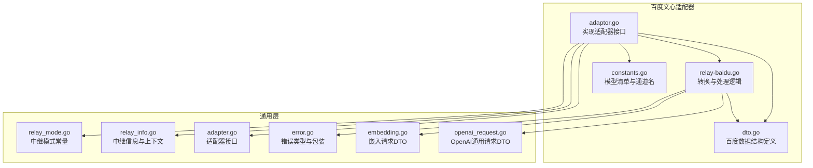
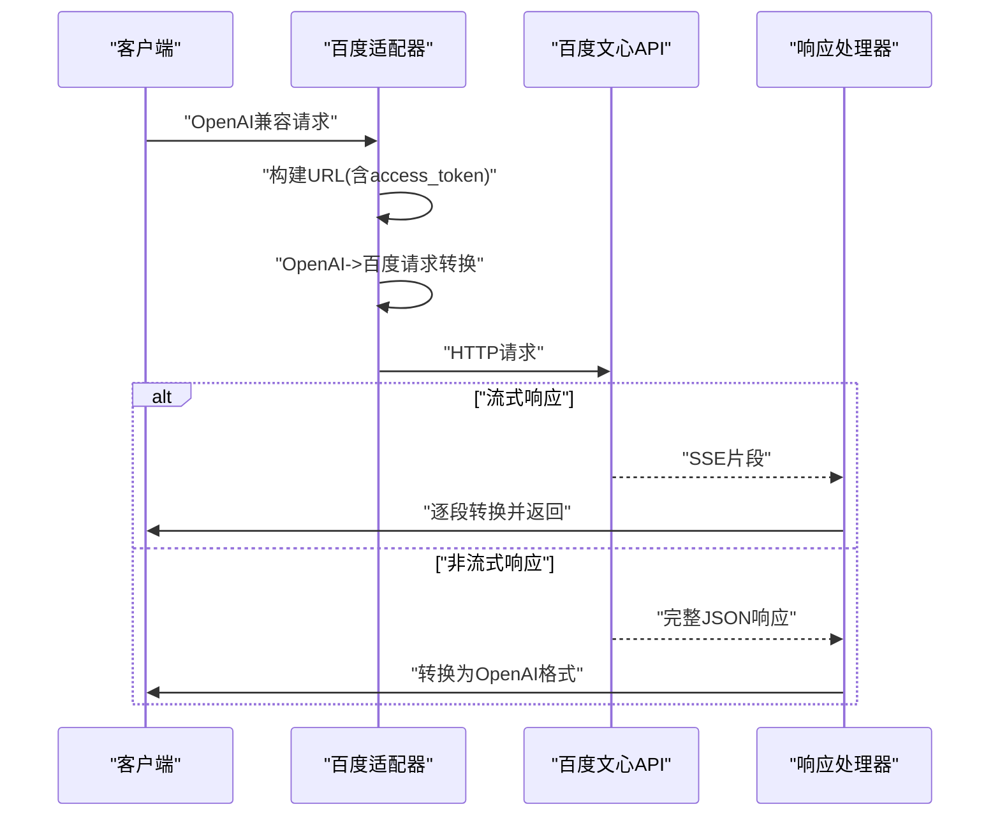
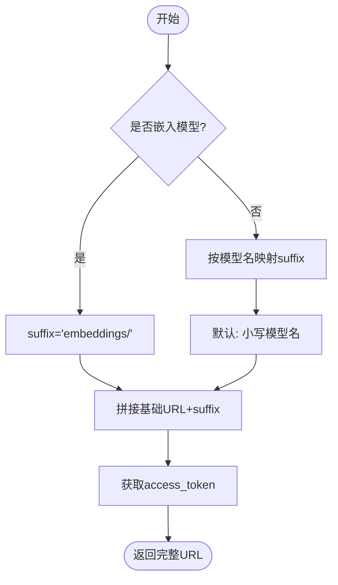
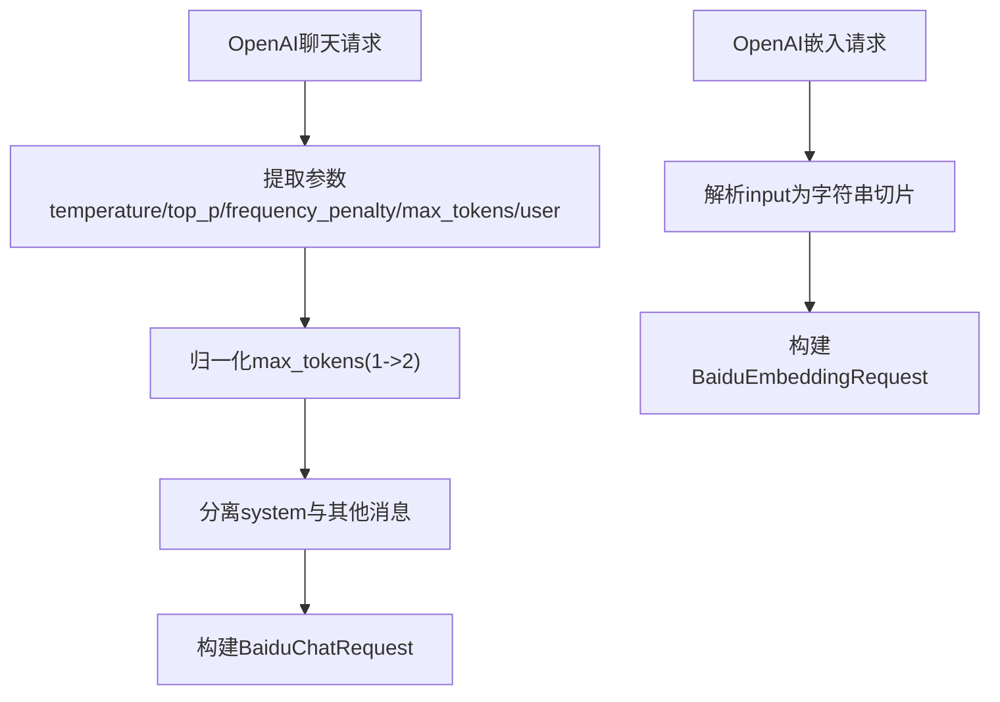
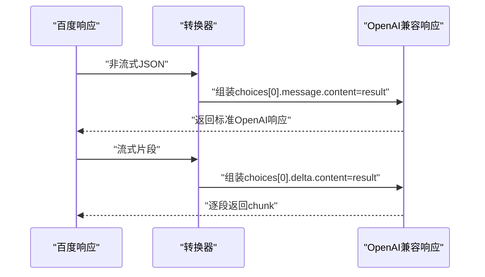
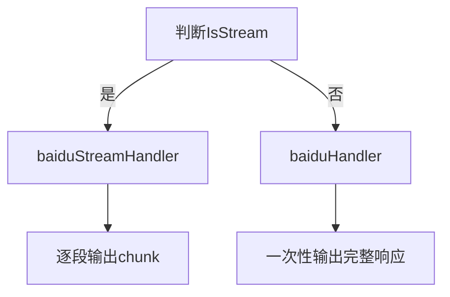
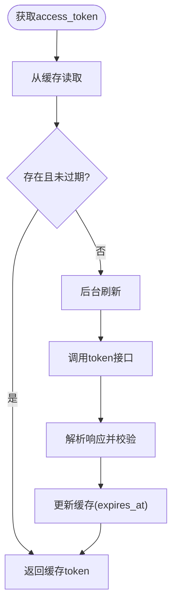
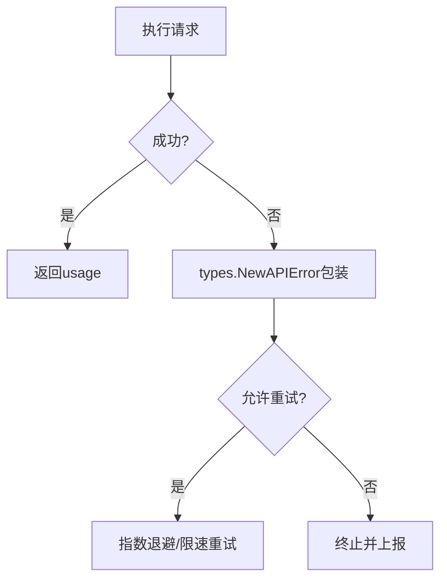
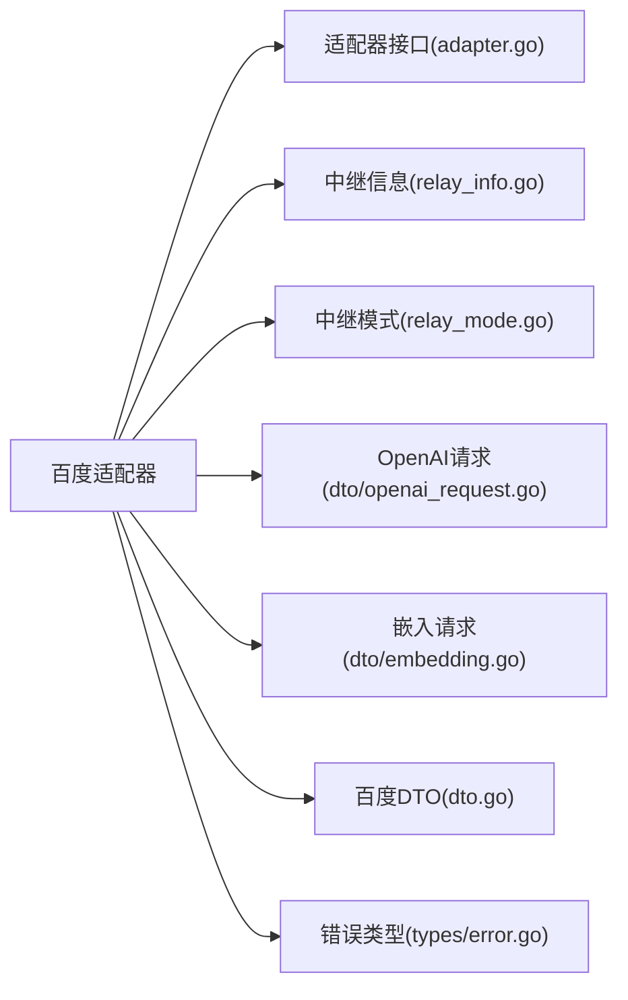

# 百度文心适配器

<cite>
**本文档引用的文件**
- [adaptor.go](file://relay/channel/baidu/adaptor.go)
- [constants.go](file://relay/channel/baidu/constants.go)
- [dto.go](file://relay/channel/baidu/dto.go)
- [relay-baidu.go](file://relay/channel/baidu/relay-baidu.go)
- [adapter.go](file://relay/channel/adapter.go)
- [openai_request.go](file://dto/openai_request.go)
- [embedding.go](file://dto/embedding.go)
- [relay_info.go](file://relay/common/relay_info.go)
- [relay_mode.go](file://relay/constant/relay_mode.go)
- [error.go](file://types/error.go)
</cite>

## 目录
1. [简介](#简介)
2. [项目结构](#项目结构)
3. [核心组件](#核心组件)
4. [架构总览](#架构总览)
5. [详细组件分析](#详细组件分析)
6. [依赖分析](#依赖分析)
7. [性能考虑](#性能考虑)
8. [故障排查指南](#故障排查指南)
9. [结论](#结论)
10. [附录](#附录)

## 简介
本文件面向“百度文心适配器”的技术实现，系统性阐述其对百度文心一言 API 的适配方式，覆盖以下关键主题：
- 不同模型版本的请求 URL 构建策略（ERNIE-4.0、ERNIE-Bot、ERNIE-Speed 等）
- 请求格式转换机制：从 OpenAI 格式到百度格式的映射规则
- 流式与非流式响应的处理差异：baiduStreamHandler 与 baiduHandler 的实现要点
- 百度 Access Token 的获取与缓存管理
- 错误处理与重试策略
- 嵌入向量与图像生成功能支持现状

该适配器遵循统一的适配器接口，通过“请求转换 + 上游调用 + 响应转换”的流水线完成 OpenAI 兼容请求到百度文心 API 的桥接。

## 项目结构
百度文心适配器位于 relay/channel/baidu 目录下，核心文件包括：
- adaptor.go：实现适配器接口，负责 URL 构建、请求头设置、OpenAI 到百度的请求转换、响应处理、模型列表与通道名
- dto.go：定义百度侧消息体、聊天与嵌入请求/响应结构、错误结构及 Access Token 结构
- relay-baidu.go：实现请求转换函数、响应转换函数、流式与非流式处理逻辑、Access Token 获取与缓存
- constants.go：声明可用模型清单与通道名
- 依赖于通用 DTO（openai_request.go、embedding.go）、通用适配器接口（adapter.go）、通用中继信息（relay_info.go）、中继模式常量（relay_mode.go）、错误类型（error.go）

**图表来源**
- [adaptor.go:1-171](file://relay/channel/baidu/adaptor.go#L1-L171)
- [dto.go:1-81](file://relay/channel/baidu/dto.go#L1-L81)
- [relay-baidu.go:1-247](file://relay/channel/baidu/relay-baidu.go#L1-L247)
- [constants.go:1-23](file://relay/channel/baidu/constants.go#L1-L23)
- [adapter.go:1-84](file://relay/channel/adapter.go#L1-L84)
- [openai_request.go:1-1050](file://dto/openai_request.go#L1-L1050)
- [embedding.go:1-89](file://dto/embedding.go#L1-L89)
- [relay_info.go:1-891](file://relay/common/relay_info.go#L1-L891)
- [relay_mode.go:1-151](file://relay/constant/relay_mode.go#L1-L151)
- [error.go:1-418](file://types/error.go#L1-L418)

**章节来源**
- [adaptor.go:1-171](file://relay/channel/baidu/adaptor.go#L1-L171)
- [constants.go:1-23](file://relay/channel/baidu/constants.go#L1-L23)

## 核心组件
- 适配器接口（Adaptor）：定义初始化、URL 构建、请求头设置、请求转换、响应处理、模型列表与通道名等方法
- 百度适配器（Adaptor 实现）：具体实现上述方法，负责将 OpenAI 请求映射到百度文心 API，并处理流式与非流式响应
- 数据传输对象（DTO）：定义百度侧的消息体、聊天与嵌入请求/响应结构、错误结构、Access Token 结构
- 转换与处理逻辑：OpenAI 到百度的请求转换、响应转换、流式扫描器、Access Token 获取与缓存

**章节来源**
- [adapter.go:15-32](file://relay/channel/adapter.go#L15-L32)
- [adaptor.go:19-171](file://relay/channel/baidu/adaptor.go#L19-L171)
- [dto.go:10-81](file://relay/channel/baidu/dto.go#L10-L81)
- [relay-baidu.go:29-246](file://relay/channel/baidu/relay-baidu.go#L29-L246)

## 架构总览
整体流程如下：
- 客户端发起 OpenAI 兼容请求
- 适配器根据路径与模型名确定中继模式与是否流式
- 适配器构建百度文心 API 的完整 URL（含 access_token）
- 适配器将 OpenAI 请求转换为百度请求体
- 发起上游请求并接收响应
- 根据是否流式选择对应的处理器进行响应转换
- 返回标准化的 OpenAI 兼容响应

**图表来源**
- [adaptor.go:47-113](file://relay/channel/baidu/adaptor.go#L47-L113)
- [adaptor.go:146-162](file://relay/channel/baidu/adaptor.go#L146-L162)
- [relay-baidu.go:117-189](file://relay/channel/baidu/relay-baidu.go#L117-L189)
- [relay_info.go:436-441](file://relay/common/relay_info.go#L436-L441)

## 详细组件分析

### URL 构建策略（不同模型版本）
- 基础 URL：以“/rpc/2.0/ai_custom/v1/wenxinworkshop/{suffix}”拼接
- suffix 规则：
  - 对于嵌入类模型（如 Embedding-V1、bge-large-zh、bge-large-en、tao-8k），使用“embeddings/”
  - 对于聊天类模型，依据具体模型名映射到对应子路径（如 completions_pro、eb-instant、ernie_speed、ernie-bot-8k 等）
  - 默认情况下，将上游模型名转小写作为 suffix
- access_token：通过 getBaiduAccessToken 获取并附加到查询参数

**图表来源**
- [adaptor.go:47-113](file://relay/channel/baidu/adaptor.go#L47-L113)

**章节来源**
- [adaptor.go:47-113](file://relay/channel/baidu/adaptor.go#L47-L113)

### 请求格式转换（OpenAI → 百度）
- 聊天请求转换：
  - temperature、top_p、frequency_penalty 映射为 temperature、top_p、penalty_score
  - max_tokens 映射为 max_output_tokens（特殊处理：当 max_tokens 为 1 时强制设为 2）
  - messages 中 role=system 提升为 system 字段，其余合并为 messages 数组
  - user 字段直接透传为 user_id
  - stream、disable_search、enable_citation 等字段按需设置
- 嵌入请求转换：
  - 将 OpenAI 的 input 解析为字符串切片，填充到百度的 input 字段

**图表来源**
- [relay-baidu.go:29-57](file://relay/channel/baidu/relay-baidu.go#L29-L57)
- [relay-baidu.go:94-98](file://relay/channel/baidu/relay-baidu.go#L94-L98)

**章节来源**
- [relay-baidu.go:29-57](file://relay/channel/baidu/relay-baidu.go#L29-L57)
- [openai_request.go:27-109](file://dto/openai_request.go#L27-L109)
- [embedding.go:22-33](file://dto/embedding.go#L22-L33)

### 响应格式转换（百度 → OpenAI）
- 非流式聊天响应：
  - 将百度响应中的 result 作为 OpenAI 的 message.content
  - 设置 finish_reason 为 stop
  - 复制 usage 信息
- 流式聊天响应：
  - 逐条读取 SSE 片段，解析为百度流式响应
  - 将 result 作为 delta.content，末条标记 finish_reason
  - 合并 usage（若存在）
- 嵌入响应：
  - 将百度响应中的 embedding 列表转换为 OpenAI 的 embedding 列表
  - 复制 usage

**图表来源**
- [relay-baidu.go:59-92](file://relay/channel/baidu/relay-baidu.go#L59-L92)
- [relay-baidu.go:117-139](file://relay/channel/baidu/relay-baidu.go#L117-L139)
- [relay-baidu.go:141-164](file://relay/channel/baidu/relay-baidu.go#L141-L164)
- [relay-baidu.go:166-189](file://relay/channel/baidu/relay-baidu.go#L166-L189)

**章节来源**
- [relay-baidu.go:59-92](file://relay/channel/baidu/relay-baidu.go#L59-L92)
- [relay-baidu.go:117-189](file://relay/channel/baidu/relay-baidu.go#L117-L189)

### 流式与非流式处理逻辑
- 适配器根据 RelayInfo.IsStream 决定调用 baiduStreamHandler 或 baiduHandler
- 非流式：读取完整响应体，解析百度响应，转换为 OpenAI 格式并返回
- 流式：使用 StreamScannerHandler 逐段解析，实时转换并输出

**图表来源**
- [adaptor.go:150-162](file://relay/channel/baidu/adaptor.go#L150-L162)
- [relay-baidu.go:117-164](file://relay/channel/baidu/relay-baidu.go#L117-L164)

**章节来源**
- [adaptor.go:150-162](file://relay/channel/baidu/adaptor.go#L150-L162)
- [relay_info.go:436-441](file://relay/common/relay_info.go#L436-L441)

### 百度 Access Token 的获取与管理
- 获取流程：
  - 从内存缓存（sync.Map）中查找 apiKey 对应的 AccessToken
  - 若即将过期（当前时间加 1 小时晚于 expires_at），触发后台刷新
  - 若缓存不存在或已过期，则调用 getBaiduAccessTokenHelper
- 刷新逻辑：
  - 从 apiKey 中解析 client_id 与 client_secret（以“|”分隔）
  - 调用 https://aip.baidubce.com/oauth/2.0/token 获取新的 access_token
  - 解析响应，校验 error 字段，计算 expires_at 并写入缓存
- 使用方式：
  - 在构建 URL 时将 access_token 追加到查询参数

**图表来源**
- [relay-baidu.go:191-246](file://relay/channel/baidu/relay-baidu.go#L191-L246)
- [adaptor.go:106-112](file://relay/channel/baidu/adaptor.go#L106-L112)

**章节来源**
- [relay-baidu.go:191-246](file://relay/channel/baidu/relay-baidu.go#L191-L246)
- [adaptor.go:106-112](file://relay/channel/baidu/adaptor.go#L106-L112)

### 错误处理与重试策略
- 错误类型与包装：
  - 使用 types.NewAPIError 包装底层错误，区分错误类型与错误码
  - 对于响应体解析失败、状态码异常等情况，返回标准化错误
- 重试控制：
  - 可通过 NewAPIError 的选项控制是否跳过重试（skipRetry）
  - 适配器在 DoResponse 中返回错误与用量，上层可根据错误类型决定是否重试

**图表来源**
- [relay-baidu.go:141-164](file://relay/channel/baidu/relay-baidu.go#L141-L164)
- [error.go:244-397](file://types/error.go#L244-L397)

**章节来源**
- [error.go:244-397](file://types/error.go#L244-L397)
- [relay-baidu.go:141-164](file://relay/channel/baidu/relay-baidu.go#L141-L164)

### 嵌入向量与图像生成功能支持
- 嵌入向量：
  - 支持：适配器提供 ConvertEmbeddingRequest 与 baiduEmbeddingHandler
  - 模型清单包含 Embedding-V1、bge-large-zh、bge-large-en、tao-8k
- 图像生成：
  - 适配器未实现 ConvertImageRequest 与相应响应处理，当前不支持图像生成

**章节来源**
- [constants.go:3-20](file://relay/channel/baidu/constants.go#L3-L20)
- [adaptor.go:38-41](file://relay/channel/baidu/adaptor.go#L38-L41)
- [adaptor.go:136-139](file://relay/channel/baidu/adaptor.go#L136-L139)
- [relay-baidu.go:166-189](file://relay/channel/baidu/relay-baidu.go#L166-L189)

## 依赖分析
- 适配器依赖关系：
  - 继承通用适配器接口，确保统一的生命周期与职责边界
  - 依赖通用中继信息（RelayInfo）以获取流式标志、中继模式、上游模型名等上下文
  - 依赖通用 DTO（OpenAI 请求/嵌入请求）与百度 DTO（消息体、聊天/嵌入请求/响应、错误、Token）
- 关键耦合点：
  - URL 构建强依赖上游模型名映射
  - 响应处理依赖流式扫描器与通用错误包装

**图表来源**
- [adapter.go:15-32](file://relay/channel/adapter.go#L15-L32)
- [relay_info.go:86-175](file://relay/common/relay_info.go#L86-L175)
- [relay_mode.go:57-95](file://relay/constant/relay_mode.go#L57-L95)
- [openai_request.go:27-109](file://dto/openai_request.go#L27-L109)
- [embedding.go:22-33](file://dto/embedding.go#L22-L33)
- [dto.go:10-81](file://relay/channel/baidu/dto.go#L10-L81)
- [error.go:90-121](file://types/error.go#L90-L121)

**章节来源**
- [adapter.go:15-32](file://relay/channel/adapter.go#L15-L32)
- [relay_info.go:86-175](file://relay/common/relay_info.go#L86-L175)
- [relay_mode.go:57-95](file://relay/constant/relay_mode.go#L57-L95)
- [openai_request.go:27-109](file://dto/openai_request.go#L27-L109)
- [embedding.go:22-33](file://dto/embedding.go#L22-L33)
- [dto.go:10-81](file://relay/channel/baidu/dto.go#L10-L81)
- [error.go:90-121](file://types/error.go#L90-L121)

## 性能考虑
- Token 缓存：
  - 使用 sync.Map 存储 Access Token，并在接近过期时异步刷新，减少重复鉴权开销
- 流式处理：
  - 流式响应采用逐段解析与输出，降低首字节延迟与内存占用
- 参数映射：
  - 将 OpenAI 的 max_tokens 映射为百度的 max_output_tokens，并做边界值处理，避免无效请求

[本节为通用建议，无需特定文件引用]

## 故障排查指南
- 常见问题定位：
  - URL 构建失败：检查上游模型名是否在映射表内，确认 suffix 生成逻辑
  - 鉴权失败：确认 apiKey 格式（client_id|client_secret），检查 token 接口返回的 error 字段
  - 响应体解析失败：检查上游返回的 JSON 结构是否符合预期
- 错误码与类型：
  - 使用 types.NewAPIError 的错误码与类型辅助定位问题来源（如 bad_response_body、channel:invalid_key 等）
- 重试策略：
  - 对于可恢复的网络错误，结合 skipRetry 控制是否重试；对于业务错误（如参数非法），建议快速失败

**章节来源**
- [relay-baidu.go:191-246](file://relay/channel/baidu/relay-baidu.go#L191-L246)
- [relay-baidu.go:141-164](file://relay/channel/baidu/relay-baidu.go#L141-L164)
- [error.go:40-88](file://types/error.go#L40-L88)

## 结论
百度文心适配器通过清晰的适配器接口与统一的数据转换层，实现了对多模型版本的 URL 构建、OpenAI 到百度的请求/响应映射、流式与非流式的差异化处理，以及 Access Token 的高效缓存与刷新。嵌入向量功能已完整支持，图像生成功能尚未实现。整体设计具备良好的扩展性与可维护性，便于后续接入更多百度文心能力。

[本节为总结性内容，无需特定文件引用]

## 附录

### 模型清单与通道名
- 可用模型列表：包含 ERNIE 系列、BLOOMZ、Embedding-V1、bge-large 系列、tao-8k 等
- 通道名：baidu

**章节来源**
- [constants.go:3-22](file://relay/channel/baidu/constants.go#L3-L22)