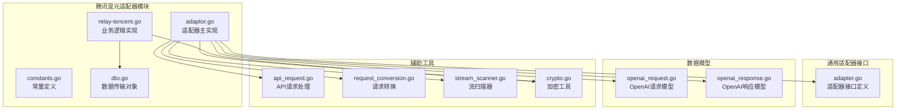
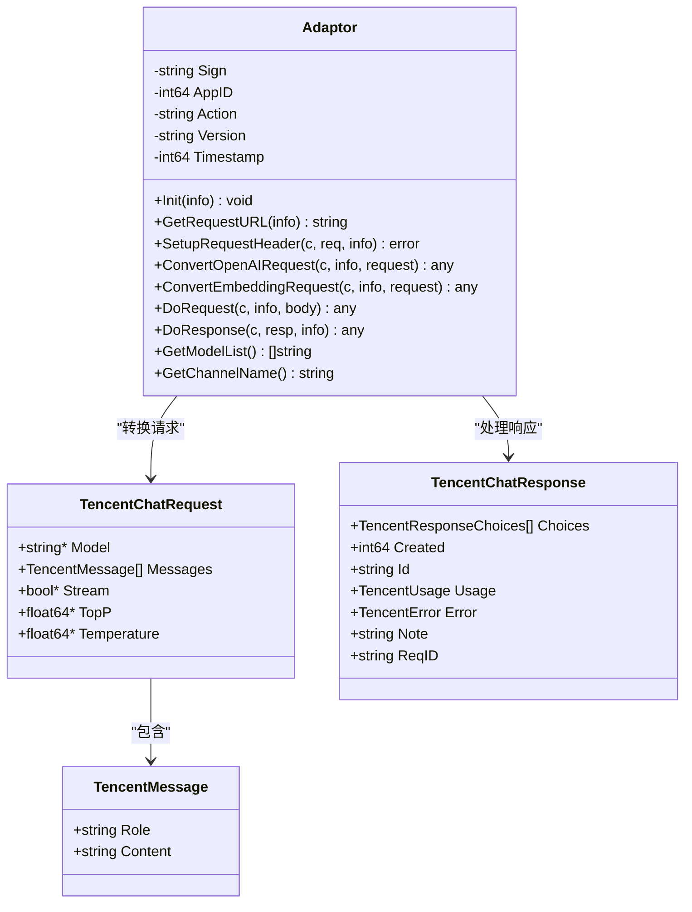
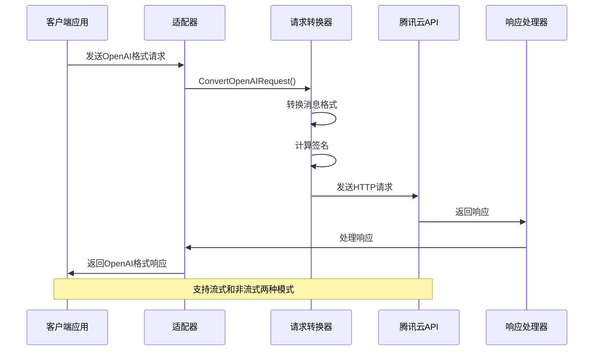
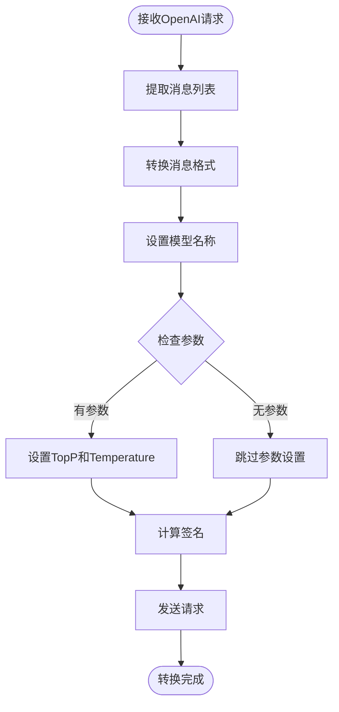
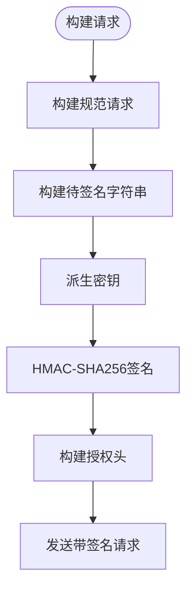
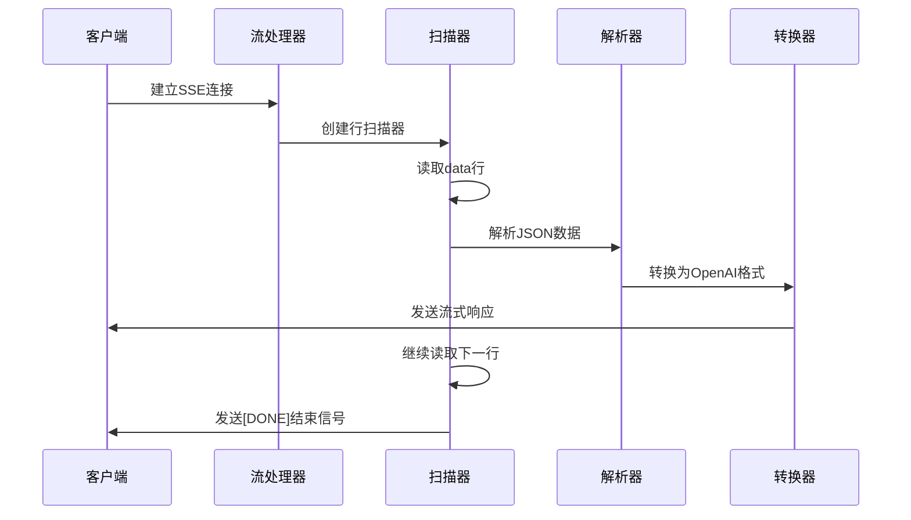
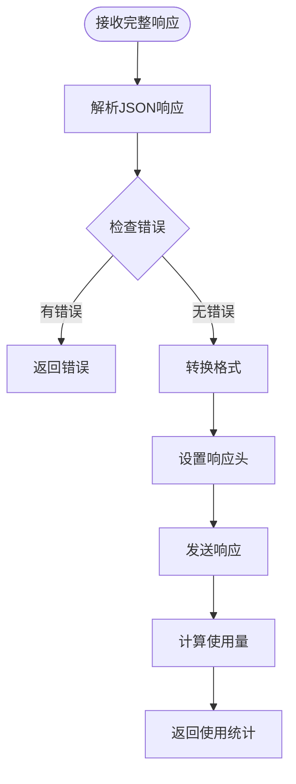
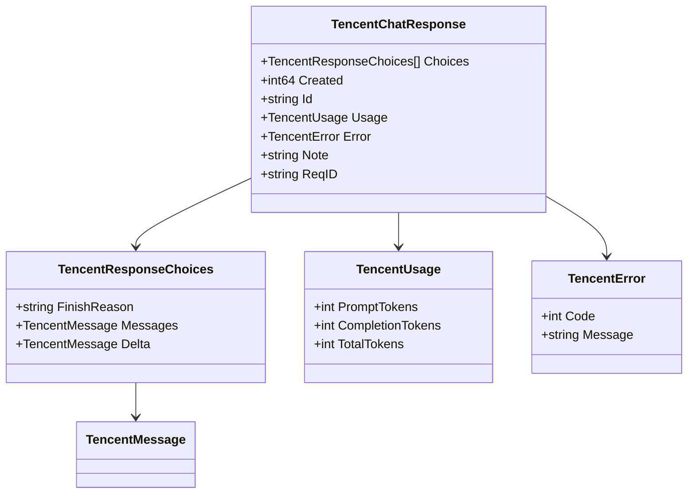
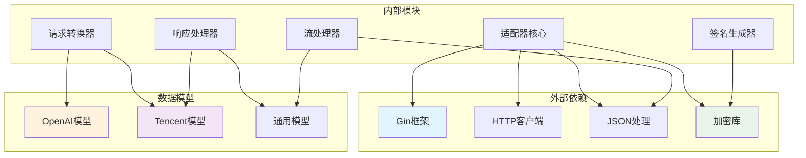

# 腾讯混元适配器

<cite>
**本文档引用的文件**
- [adaptor.go](file://relay/channel/tencent/adaptor.go)
- [constants.go](file://relay/channel/tencent/constants.go)
- [dto.go](file://relay/channel/tencent/dto.go)
- [relay-tencent.go](file://relay/channel/tencent/relay-tencent.go)
- [adapter.go](file://relay/channel/adapter.go)
- [openai_request.go](file://dto/openai_request.go)
- [openai_response.go](file://dto/openai_response.go)
- [api_request.go](file://relay/channel/api_request.go)
- [request_conversion.go](file://relay/common/request_conversion.go)
- [stream_scanner.go](file://relay/helper/stream_scanner.go)
- [crypto.go](file://common/crypto.go)
</cite>

## 目录
1. [简介](#简介)
2. [项目结构](#项目结构)
3. [核心组件](#核心组件)
4. [架构概览](#架构概览)
5. [详细组件分析](#详细组件分析)
6. [依赖关系分析](#依赖关系分析)
7. [性能考虑](#性能考虑)
8. [故障排除指南](#故障排除指南)
9. [结论](#结论)

## 简介

腾讯混元适配器是为新API项目开发的第三方服务适配器，专门用于对接腾讯云混元（HunYuan）大模型服务。该适配器实现了完整的OpenAI兼容接口，支持多种混元模型版本，包括lite、standard、standard-256K和pro版本。

该适配器的核心功能包括：
- OpenAI格式到腾讯格式的请求转换
- 腾讯格式到OpenAI格式的响应转换
- 流式和非流式响应处理
- 腾讯云API签名认证
- 多种混元模型版本支持
- 嵌入向量生成功能支持

## 项目结构

腾讯混元适配器位于`relay/channel/tencent/`目录下，包含以下核心文件：

**图表来源**
- [adaptor.go:1-120](file://relay/channel/tencent/adaptor.go#L1-L120)
- [constants.go:1-11](file://relay/channel/tencent/constants.go#L1-L11)
- [dto.go:1-76](file://relay/channel/tencent/dto.go#L1-L76)
- [relay-tencent.go:1-235](file://relay/channel/tencent/relay-tencent.go#L1-L235)

**章节来源**
- [adaptor.go:1-120](file://relay/channel/tencent/adaptor.go#L1-L120)
- [constants.go:1-11](file://relay/channel/tencent/constants.go#L1-L11)
- [dto.go:1-76](file://relay/channel/tencent/dto.go#L1-L76)
- [relay-tencent.go:1-235](file://relay/channel/tencent/relay-tencent.go#L1-L235)

## 核心组件

### 适配器接口实现

腾讯混元适配器实现了通用适配器接口，提供了完整的第三方服务适配能力：

**图表来源**
- [adaptor.go:21-27](file://relay/channel/tencent/adaptor.go#L21-L27)
- [dto.go:8-44](file://relay/channel/tencent/dto.go#L8-L44)
- [dto.go:3-6](file://relay/channel/tencent/dto.go#L3-L6)
- [dto.go:63-71](file://relay/channel/tencent/dto.go#L63-L71)

### 支持的模型版本

适配器支持以下混元模型版本：
- `hunyuan-lite` - 轻量级模型
- `hunyuan-standard` - 标准模型  
- `hunyuan-standard-256K` - 256K上下文标准模型
- `hunyuan-pro` - 专业版模型

**章节来源**
- [constants.go:3-8](file://relay/channel/tencent/constants.go#L3-L8)

## 架构概览

腾讯混元适配器采用分层架构设计，实现了清晰的职责分离：

**图表来源**
- [adaptor.go:69-84](file://relay/channel/tencent/adaptor.go#L69-L84)
- [relay-tencent.go:30-49](file://relay/channel/tencent/relay-tencent.go#L30-L49)
- [relay-tencent.go:187-234](file://relay/channel/tencent/relay-tencent.go#L187-L234)

## 详细组件分析

### 请求格式转换机制

#### OpenAI到腾讯格式转换

适配器实现了完整的请求格式转换，将OpenAI兼容格式转换为腾讯云API格式：

**图表来源**
- [relay-tencent.go:30-49](file://relay/channel/tencent/relay-tencent.go#L30-L49)
- [adaptor.go:69-84](file://relay/channel/tencent/adaptor.go#L69-L84)

#### 腾讯认证签名机制

适配器实现了TC3-HMAC-SHA256签名算法，确保与腾讯云API的安全通信：

**图表来源**
- [relay-tencent.go:187-234](file://relay/channel/tencent/relay-tencent.go#L187-L234)
- [crypto.go:11-21](file://common/crypto.go#L11-L21)

**章节来源**
- [relay-tencent.go:30-49](file://relay/channel/tencent/relay-tencent.go#L30-L49)
- [relay-tencent.go:164-185](file://relay/channel/tencent/relay-tencent.go#L164-L185)
- [relay-tencent.go:187-234](file://relay/channel/tencent/relay-tencent.go#L187-L234)

### 响应处理机制

#### 流式响应处理

适配器支持SSE（Server-Sent Events）流式响应，实时传输模型输出：

**图表来源**
- [relay-tencent.go:93-134](file://relay/channel/tencent/relay-tencent.go#L93-L134)
- [stream_scanner.go:24-35](file://relay/helper/stream_scanner.go#L24-L35)

#### 非流式响应处理

对于非流式请求，适配器直接处理完整响应：

**图表来源**
- [relay-tencent.go:136-162](file://relay/channel/tencent/relay-tencent.go#L136-L162)

**章节来源**
- [relay-tencent.go:93-162](file://relay/channel/tencent/relay-tencent.go#L93-L162)
- [stream_scanner.go:37-282](file://relay/helper/stream_scanner.go#L37-L282)

### 数据模型定义

#### 请求数据模型

腾讯混元适配器定义了完整的数据传输对象：

| 字段名 | 类型 | 描述 | 必填 |
|--------|------|------|------|
| Model | string* | 模型名称 | 是 |
| Messages | TencentMessage[] | 消息列表 | 是 |
| Stream | bool* | 是否启用流式 | 否 |
| TopP | float64* | 多样性参数 | 否 |
| Temperature | float64* | 温度参数 | 否 |

#### 响应数据模型

**图表来源**
- [dto.go:63-71](file://relay/channel/tencent/dto.go#L63-L71)
- [dto.go:57-61](file://relay/channel/tencent/dto.go#L57-L61)
- [dto.go:51-55](file://relay/channel/tencent/dto.go#L51-L55)
- [dto.go:46-49](file://relay/channel/tencent/dto.go#L46-L49)

**章节来源**
- [dto.go:1-76](file://relay/channel/tencent/dto.go#L1-L76)

## 依赖关系分析

### 组件依赖图

**图表来源**
- [adaptor.go:3-19](file://relay/channel/tencent/adaptor.go#L3-L19)
- [relay-tencent.go:3-26](file://relay/channel/tencent/relay-tencent.go#L3-L26)

### 关键依赖关系

1. **接口依赖**: 适配器实现通用适配器接口，确保统一的扩展点
2. **数据模型依赖**: 依赖OpenAI兼容的数据模型进行格式转换
3. **加密依赖**: 使用标准加密库进行签名生成
4. **HTTP依赖**: 依赖HTTP客户端进行上游请求

**章节来源**
- [adapter.go:15-32](file://relay/channel/adapter.go#L15-L32)
- [request_conversion.go:8-29](file://relay/common/request_conversion.go#L8-L29)

## 性能考虑

### 流式处理优化

适配器采用了多项性能优化措施：

1. **缓冲区管理**: 使用可配置的扫描器缓冲区大小，支持最大64MB缓冲
2. **并发处理**: 使用goroutine池处理流式数据，避免阻塞
3. **内存管理**: 及时释放响应体资源，防止内存泄漏
4. **超时控制**: 实现请求超时和空闲超时双重保护

### 签名计算优化

1. **缓存机制**: 重用计算结果，避免重复签名计算
2. **批量处理**: 支持批量请求的签名优化
3. **资源复用**: 复用加密对象，减少GC压力

### 建议的性能调优

1. **合理配置缓冲区**: 根据实际流量调整扫描器缓冲区大小
2. **监控超时设置**: 根据网络环境调整超时参数
3. **连接池优化**: 配置合适的连接池大小
4. **日志级别**: 在生产环境中使用适当的日志级别

## 故障排除指南

### 常见错误类型

| 错误类型 | 错误码 | 描述 | 解决方案 |
|----------|--------|------|----------|
| 认证失败 | 401 | API密钥无效 | 检查密钥格式和权限 |
| 请求超时 | 408 | 请求超时 | 增加超时时间或优化网络 |
| 签名错误 | 403 | 签名验证失败 | 检查签名算法和时间戳 |
| 参数错误 | 400 | 请求参数无效 | 验证请求格式和参数 |
| 服务器错误 | 500 | 服务器内部错误 | 检查服务状态和日志 |

### 调试技巧

1. **启用调试日志**: 设置调试级别查看详细的请求响应信息
2. **监控指标**: 使用性能监控工具跟踪关键指标
3. **错误追踪**: 实现完善的错误追踪和报告机制
4. **测试覆盖**: 编写全面的单元测试和集成测试

**章节来源**
- [relay-tencent.go:136-162](file://relay/channel/tencent/relay-tencent.go#L136-L162)
- [stream_scanner.go:275-282](file://relay/helper/stream_scanner.go#L275-L282)

## 结论

腾讯混元适配器是一个功能完整、设计良好的第三方服务适配器，具有以下特点：

1. **完整的功能支持**: 实现了OpenAI兼容的所有核心功能
2. **灵活的架构设计**: 采用分层架构，职责清晰，易于维护
3. **高性能实现**: 优化的流式处理和签名计算机制
4. **完善的错误处理**: 全面的错误处理和恢复机制
5. **良好的扩展性**: 基于接口的设计便于功能扩展

该适配器为开发者提供了稳定可靠的腾讯混元API接入方案，支持多种使用场景和性能需求。通过合理的配置和优化，可以满足大多数生产环境的要求。