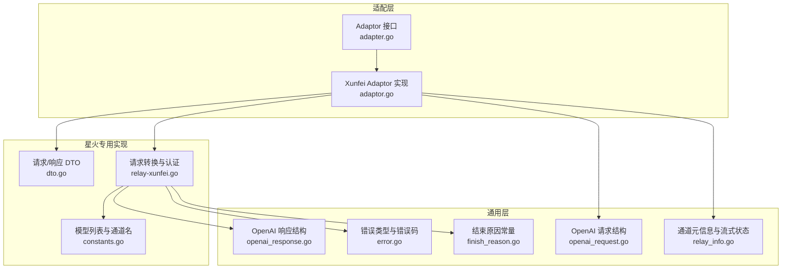
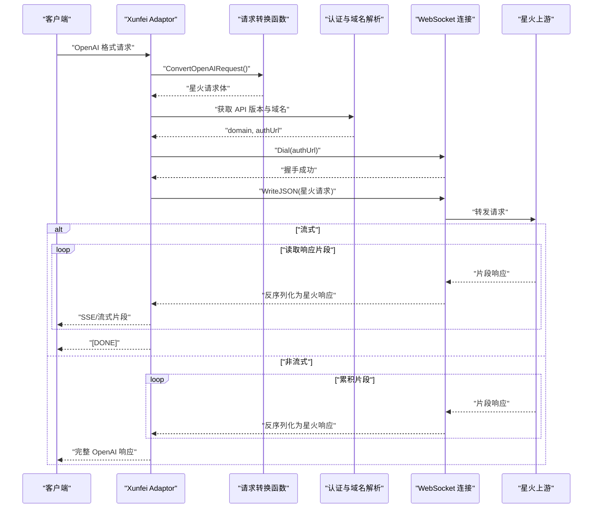
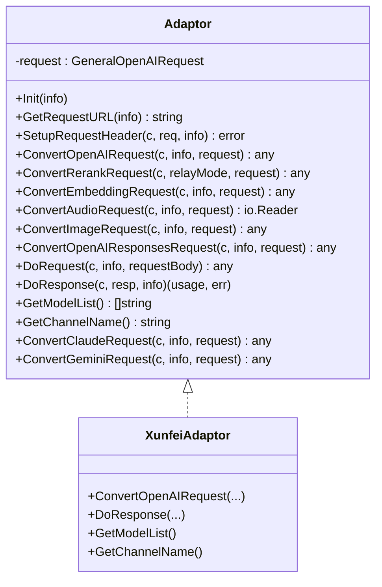
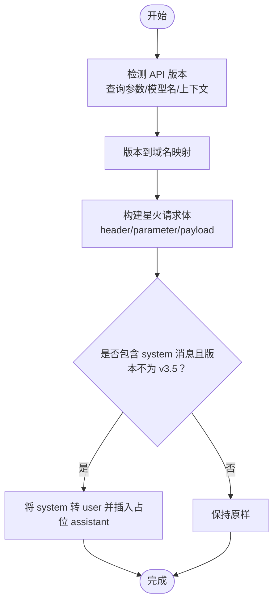
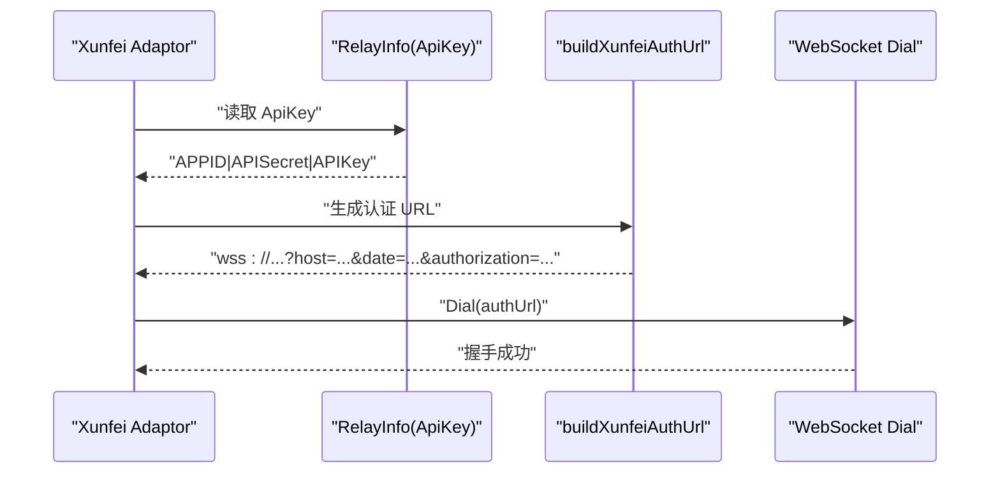
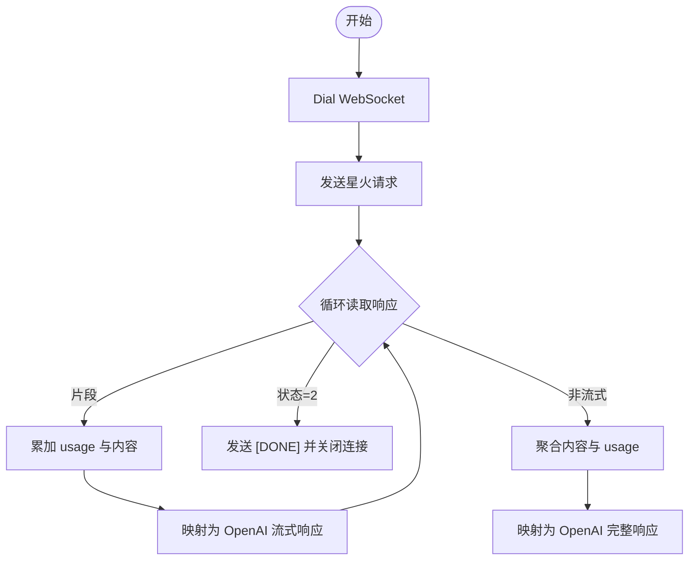

# 讯飞星火适配器

<cite>
**本文档引用的文件**
- [adaptor.go](file://relay/channel/xunfei/adaptor.go)
- [constants.go](file://relay/channel/xunfei/constants.go)
- [dto.go](file://relay/channel/xunfei/dto.go)
- [relay-xunfei.go](file://relay/channel/xunfei/relay-xunfei.go)
- [adapter.go](file://relay/channel/adapter.go)
- [openai_request.go](file://dto/openai_request.go)
- [openai_response.go](file://dto/openai_response.go)
- [relay_info.go](file://relay/common/relay_info.go)
- [error.go](file://types/error.go)
- [finish_reason.go](file://constant/finish_reason.go)
</cite>

## 目录
1. [简介](#简介)
2. [项目结构](#项目结构)
3. [核心组件](#核心组件)
4. [架构总览](#架构总览)
5. [详细组件分析](#详细组件分析)
6. [依赖关系分析](#依赖关系分析)
7. [性能考虑](#性能考虑)
8. [故障排除指南](#故障排除指南)
9. [结论](#结论)
10. [附录](#附录)

## 简介
本文件为“讯飞星火适配器”的综合技术文档，面向需要在系统中集成星火认知大模型的开发者与运维人员。文档覆盖以下关键主题：
- 星火不同版本（Spark Lite、Spark Standard、Spark Pro 等）的 API 差异处理策略
- 请求格式转换机制：从 OpenAI 格式到星火格式的映射与兼容性处理
- 星火特有的认证方式与请求头设置
- 星火流式与非流式响应的处理流程
- 星火特殊参数配置与模型选择机制
- 错误处理、重试策略与性能优化建议
- 星火在不同应用场景下的使用特点与限制

## 项目结构
星火适配器位于 relay/channel/xunfei 目录下，采用“适配器模式”对接统一的通道接口，同时提供针对星火 WebSocket 认证与消息格式的专用实现。



图表来源
- [adaptor.go:1-106](file://relay/channel/xunfei/adaptor.go#L1-L106)
- [constants.go:1-13](file://relay/channel/xunfei/constants.go#L1-L13)
- [dto.go:1-60](file://relay/channel/xunfei/dto.go#L1-L60)
- [relay-xunfei.go:1-293](file://relay/channel/xunfei/relay-xunfei.go#L1-L293)
- [adapter.go:1-84](file://relay/channel/adapter.go#L1-L84)
- [openai_request.go:1-1050](file://dto/openai_request.go#L1-L1050)
- [openai_response.go:1-432](file://dto/openai_response.go#L1-L432)
- [relay_info.go:1-891](file://relay/common/relay_info.go#L1-L891)
- [error.go:1-418](file://types/error.go#L1-L418)
- [finish_reason.go:1-10](file://constant/finish_reason.go#L1-L10)

章节来源
- [adaptor.go:1-106](file://relay/channel/xunfei/adaptor.go#L1-L106)
- [constants.go:1-13](file://relay/channel/xunfei/constants.go#L1-L13)
- [dto.go:1-60](file://relay/channel/xunfei/dto.go#L1-L60)
- [relay-xunfei.go:1-293](file://relay/channel/xunfei/relay-xunfei.go#L1-L293)
- [adapter.go:1-84](file://relay/channel/adapter.go#L1-L84)

## 核心组件
- 适配器接口与实现
  - 适配器接口定义了统一的转换、请求构建、响应处理能力，确保不同上游渠道（含星火）以一致的方式接入。
  - 星火适配器实现了 OpenAI 请求转换、WebSocket 认证、流式与非流式响应处理等核心逻辑。
- 星火数据模型
  - 星火请求体与响应体的数据结构，包括 header、parameter、payload 的组织方式，以及 choices、usage 的字段映射。
- 通用请求/响应模型
  - OpenAI 的通用请求与响应结构，用于与星火适配器进行格式互转。
- 通道元信息与错误处理
  - 通道元信息承载认证密钥、API 版本、上游模型名等关键上下文；错误类型与错误码用于标准化异常处理。

章节来源
- [adapter.go:15-32](file://relay/channel/adapter.go#L15-L32)
- [adaptor.go:17-105](file://relay/channel/xunfei/adaptor.go#L17-L105)
- [dto.go:5-59](file://relay/channel/xunfei/dto.go#L5-L59)
- [openai_request.go:29-109](file://dto/openai_request.go#L29-L109)
- [openai_response.go:39-149](file://dto/openai_response.go#L39-L149)
- [relay_info.go:61-175](file://relay/common/relay_info.go#L61-L175)
- [error.go:38-88](file://types/error.go#L38-L88)

## 架构总览
星火适配器的整体工作流如下：
- 统一入口通过适配器接口接收 OpenAI 格式的请求
- 适配器将请求转换为星火格式，并根据模型版本选择对应的 API 域名
- 通过 HMAC-SHA256 签名生成 WebSocket 认证 URL 并建立连接
- 非流式：聚合所有片段后一次性返回；流式：逐片段推送事件流
- 响应体映射回 OpenAI 格式，统一输出



图表来源
- [adaptor.go:54-97](file://relay/channel/xunfei/adaptor.go#L54-L97)
- [relay-xunfei.go:131-201](file://relay/channel/xunfei/relay-xunfei.go#L131-L201)
- [relay-xunfei.go:203-248](file://relay/channel/xunfei/relay-xunfei.go#L203-L248)
- [relay-xunfei.go:266-292](file://relay/channel/xunfei/relay-xunfei.go#L266-L292)

## 详细组件分析

### 星火适配器类图


图表来源
- [adapter.go:15-32](file://relay/channel/adapter.go#L15-L32)
- [adaptor.go:17-105](file://relay/channel/xunfei/adaptor.go#L17-L105)

章节来源
- [adapter.go:15-32](file://relay/channel/adapter.go#L15-L32)
- [adaptor.go:17-105](file://relay/channel/xunfei/adaptor.go#L17-L105)

### 请求格式转换与模型选择
- OpenAI 到星火的转换
  - 将 OpenAI 的 messages 转换为星火的 header.app_id、parameter.chat.* 与 payload.message.text 结构
  - 对 system 消息在特定版本（不含 v3.5）下进行角色转换与占位处理，以兼容星火的消息语义
- 模型版本到域名映射
  - 通过 api-version 查询参数、模型名后缀或上下文中的 api_version 决定具体版本
  - 不同版本映射到不同的 API 域名（如 lite、generalv2、generalv3、generalv3.5、4.0Ultra 等）



图表来源
- [relay-xunfei.go:28-56](file://relay/channel/xunfei/relay-xunfei.go#L28-L56)
- [relay-xunfei.go:250-264](file://relay/channel/xunfei/relay-xunfei.go#L250-L264)
- [relay-xunfei.go:273-292](file://relay/channel/xunfei/relay-xunfei.go#L273-L292)

章节来源
- [relay-xunfei.go:28-56](file://relay/channel/xunfei/relay-xunfei.go#L28-L56)
- [relay-xunfei.go:250-264](file://relay/channel/xunfei/relay-xunfei.go#L250-L264)
- [relay-xunfei.go:273-292](file://relay/channel/xunfei/relay-xunfei.go#L273-L292)

### 星火认证与请求头设置
- 认证密钥格式
  - 适配器期望的密钥格式为“APPID|APISecret|APIKey”，并在 DoResponse 中进行拆分校验
- WebSocket 认证 URL 生成
  - 使用 HMAC-SHA256 对 HTTP 请求行签名，生成 authorization 字段并编码为查询参数
  - 目标地址为 wss://spark-api.xf-yun.com/{domain}/chat
- 请求头设置
  - 通过 SetupRequestHeader 调用通用通道方法，注入基础请求头



图表来源
- [adaptor.go:83-97](file://relay/channel/xunfei/adaptor.go#L83-L97)
- [relay-xunfei.go:105-129](file://relay/channel/xunfei/relay-xunfei.go#L105-L129)
- [relay-xunfei.go:266-271](file://relay/channel/xunfei/relay-xunfei.go#L266-L271)

章节来源
- [adaptor.go:83-97](file://relay/channel/xunfei/adaptor.go#L83-L97)
- [relay-xunfei.go:105-129](file://relay/channel/xunfei/relay-xunfei.go#L105-L129)
- [relay-xunfei.go:266-271](file://relay/channel/xunfei/relay-xunfei.go#L266-L271)

### 星火流式与非流式响应处理
- 流式处理
  - 建立 WebSocket 连接后，持续读取响应片段，累加 usage 并逐片段映射为 OpenAI 流式响应
  - 当 choices.status==2 时，发送 [DONE] 并关闭连接
- 非流式处理
  - 聚合所有片段内容与 usage，最终一次性返回 OpenAI 格式的完整响应



图表来源
- [relay-xunfei.go:131-159](file://relay/channel/xunfei/relay-xunfei.go#L131-L159)
- [relay-xunfei.go:161-201](file://relay/channel/xunfei/relay-xunfei.go#L161-L201)
- [relay-xunfei.go:203-248](file://relay/channel/xunfei/relay-xunfei.go#L203-L248)

章节来源
- [relay-xunfei.go:131-201](file://relay/channel/xunfei/relay-xunfei.go#L131-L201)
- [relay-xunfei.go:203-248](file://relay/channel/xunfei/relay-xunfei.go#L203-L248)

### 星火数据模型与 OpenAI 映射
- 请求模型
  - header.app_id：来自密钥拆分后的 APPID
  - parameter.chat.domain：基于版本映射得到
  - parameter.chat.temperature/top_k/max_tokens：从 OpenAI 请求映射
  - payload.message.text：消息列表，包含 role 与 content
- 响应模型
  - header.code/message/sid/status：上游返回的状态信息
  - payload.choices.status/seq/text：片段状态与文本
  - payload.usage.text：token 统计
- 映射策略
  - 非流式：将多个片段的 content 合并，usage 累加
  - 流式：逐片段映射 delta.content，状态为 2 时设置结束原因

章节来源
- [dto.go:10-28](file://relay/channel/xunfei/dto.go#L10-L28)
- [dto.go:36-59](file://relay/channel/xunfei/dto.go#L36-L59)
- [relay-xunfei.go:58-81](file://relay/channel/xunfei/relay-xunfei.go#L58-L81)
- [relay-xunfei.go:83-103](file://relay/channel/xunfei/relay-xunfei.go#L83-L103)

### 错误处理与重试策略
- 错误类型与错误码
  - 无效密钥：当 ApiKey 拆分后不满足“APPID|APISecret|APIKey”格式
  - 请求无效：请求体为空
  - 请求失败：WebSocket 握手失败或读写异常
- 重试策略
  - 代码中未显式实现自动重试逻辑，但通过错误类型与错误码可配合上层策略进行重试控制
- 建议
  - 在上层中间件或网关层对特定错误码进行指数退避重试
  - 对握手超时与网络异常进行快速失败与降级

章节来源
- [adaptor.go:83-97](file://relay/channel/xunfei/adaptor.go#L83-L97)
- [relay-xunfei.go:203-210](file://relay/channel/xunfei/relay-xunfei.go#L203-L210)
- [error.go:38-88](file://types/error.go#L38-L88)

## 依赖关系分析
- 组件耦合
  - 星火适配器依赖通用的请求/响应结构与通道元信息，保证与上层解耦
  - 认证与域名解析独立于适配器主体，便于扩展其他版本或渠道
- 外部依赖
  - WebSocket 客户端用于与星火上游通信
  - JSON 序列化/反序列化用于消息编解码
- 可能的循环依赖
  - 适配器与通用层之间为单向依赖，无循环导入迹象

```mermaid
graph LR
OpenAIReq["OpenAI 请求结构<br/>openai_request.go"] --> Adapter["Xunfei Adaptor<br/>adaptor.go"]
OpenAIRes["OpenAI 响应结构<br/>openai_response.go"] <- --> Adapter
RelayInfo["通道元信息<br/>relay_info.go"] --> Adapter
Adapter --> DTO["星火 DTO<br/>dto.go"]
Adapter --> Auth["认证与域名<br/>relay-xunfei.go"]
Auth --> WS["WebSocket 客户端"]
```

图表来源
- [openai_request.go:29-109](file://dto/openai_request.go#L29-L109)
- [openai_response.go:39-149](file://dto/openai_response.go#L39-L149)
- [relay_info.go:61-175](file://relay/common/relay_info.go#L61-L175)
- [adaptor.go:54-97](file://relay/channel/xunfei/adaptor.go#L54-L97)
- [dto.go:5-59](file://relay/channel/xunfei/dto.go#L5-L59)
- [relay-xunfei.go:105-129](file://relay/channel/xunfei/relay-xunfei.go#L105-L129)

章节来源
- [openai_request.go:29-109](file://dto/openai_request.go#L29-L109)
- [openai_response.go:39-149](file://dto/openai_response.go#L39-L149)
- [relay_info.go:61-175](file://relay/common/relay_info.go#L61-L175)
- [adaptor.go:54-97](file://relay/channel/xunfei/adaptor.go#L54-L97)
- [dto.go:5-59](file://relay/channel/xunfei/dto.go#L5-L59)
- [relay-xunfei.go:105-129](file://relay/channel/xunfei/relay-xunfei.go#L105-L129)

## 性能考虑
- 连接管理
  - WebSocket 握手超时时间固定，建议在上层进行连接池与复用策略，减少频繁握手开销
- 流式传输
  - 流式场景下，逐片段映射与事件推送会带来一定 CPU 开销；建议在前端侧进行节流与缓冲
- Token 统计
  - usage 累加在适配器层完成，注意避免重复统计与并发安全问题
- 参数映射
  - temperature/top_k/max_tokens 等参数映射需与星火版本兼容，避免无效参数导致的降级

[本节为通用性能建议，无需特定文件来源]

## 故障排除指南
- 常见错误与定位
  - 无效密钥：检查 ApiKey 是否为“APPID|APISecret|APIKey”格式
  - 握手失败：确认网络可达、域名正确、时间同步与签名生成无误
  - 流式中断：检查 choices.status 是否提前为 2，或上游返回异常
- 日志与诊断
  - 适配器内部记录读写错误与反序列化错误，便于定位上游异常
- 重试与降级
  - 对网络异常与超时进行快速失败，避免阻塞请求队列
  - 对认证失败与参数错误进行快速失败并上报

章节来源
- [adaptor.go:83-97](file://relay/channel/xunfei/adaptor.go#L83-L97)
- [relay-xunfei.go:203-248](file://relay/channel/xunfei/relay-xunfei.go#L203-L248)

## 结论
星火适配器通过统一的适配器接口与专用的请求转换、认证与响应处理逻辑，实现了对 OpenAI 格式请求到星火格式的无缝映射。其特性包括：
- 支持多版本 API 的自动识别与域名映射
- 基于 HMAC-SHA256 的 WebSocket 认证机制
- 完整的流式与非流式响应处理
- 清晰的错误类型与错误码体系，便于上层策略集成

在实际部署中，建议结合业务场景完善重试、限流与监控策略，确保稳定性与性能。

[本节为总结性内容，无需特定文件来源]

## 附录

### 星火模型列表与通道名
- 支持的模型列表：SparkDesk、SparkDesk-v1.1、SparkDesk-v2.1、SparkDesk-v3.1、SparkDesk-v3.5、SparkDesk-v4.0
- 通道名：xunfei

章节来源
- [constants.go:3-12](file://relay/channel/xunfei/constants.go#L3-L12)

### OpenAI 到星火参数映射参考
- temperature -> parameter.chat.temperature
- top_k -> parameter.chat.top_k
- max_tokens -> parameter.chat.max_tokens
- messages -> payload.message.text

章节来源
- [relay-xunfei.go:28-56](file://relay/channel/xunfei/relay-xunfei.go#L28-L56)

### 星火结束原因映射
- choices.status==2 时映射为 OpenAI 的结束原因

章节来源
- [relay-xunfei.go:93-95](file://relay/channel/xunfei/relay-xunfei.go#L93-L95)
- [finish_reason.go:3-9](file://constant/finish_reason.go#L3-L9)