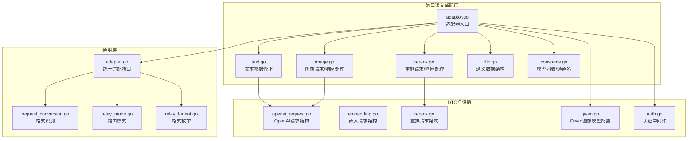
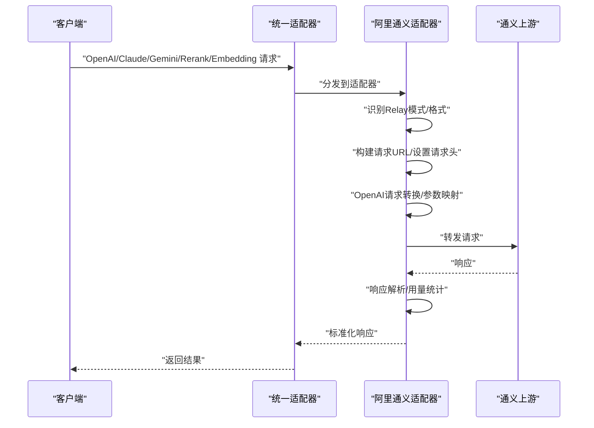
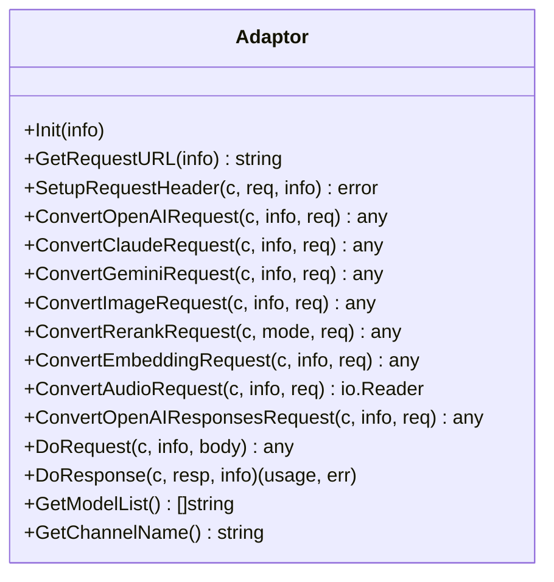
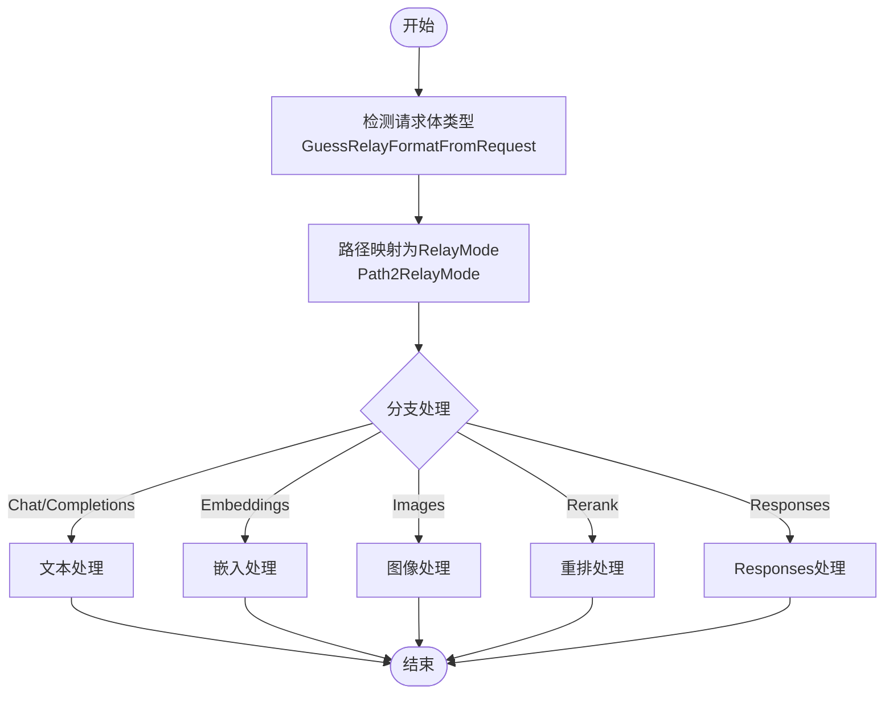
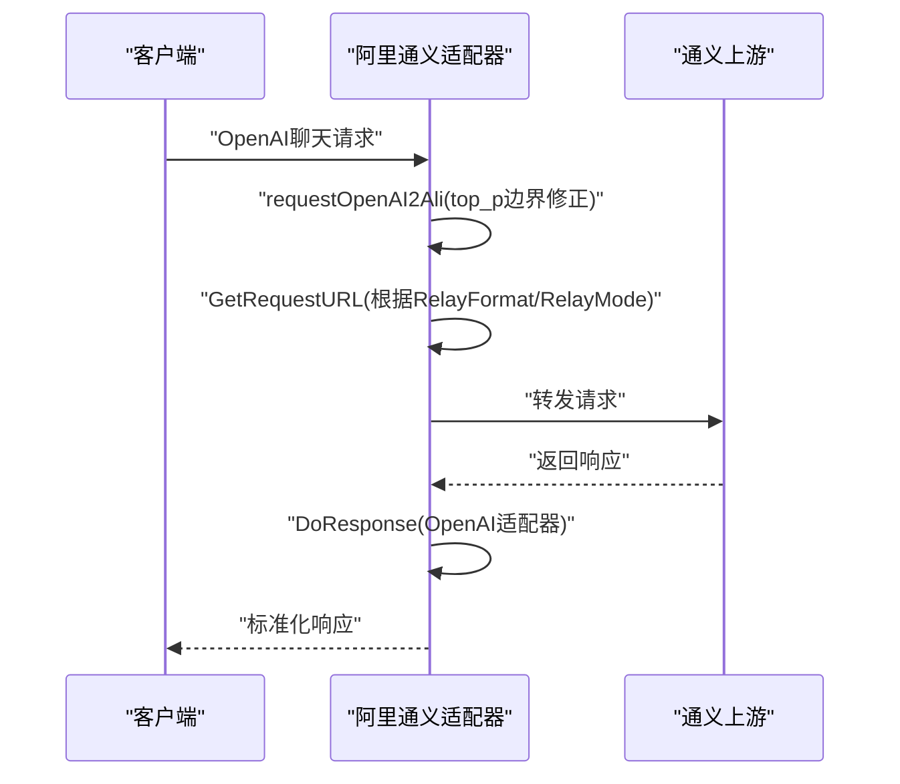
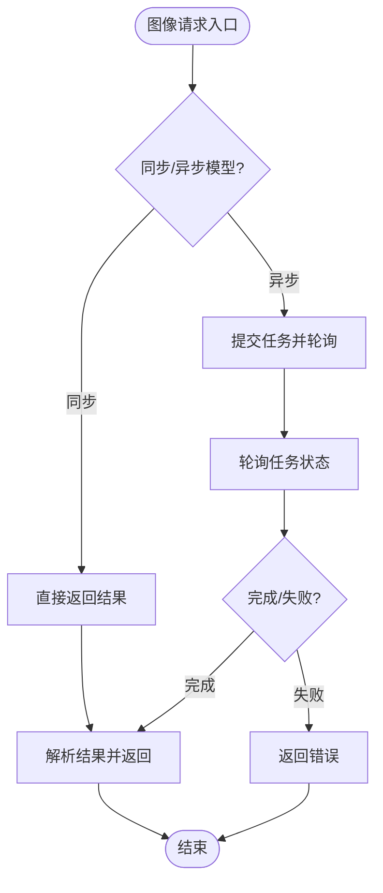
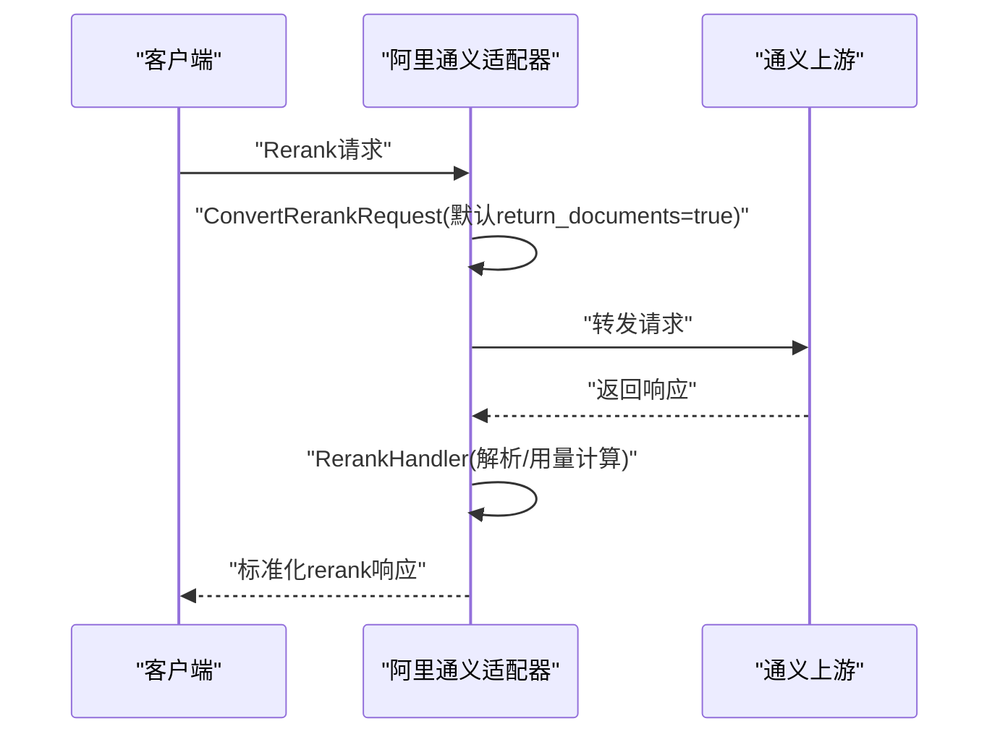
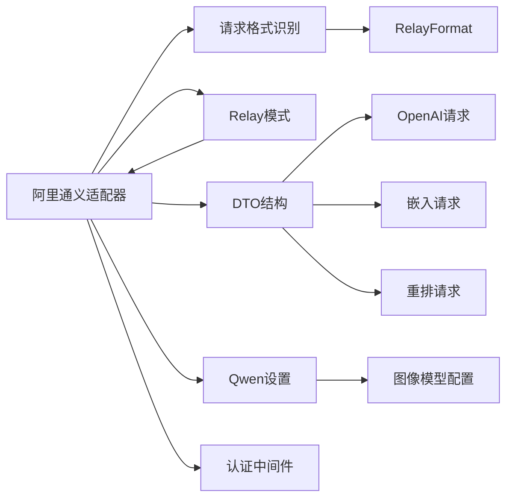

# 阿里通义适配器

<cite>
**本文引用的文件**
- [adaptor.go](file://relay/channel/ali/adaptor.go)
- [constants.go](file://relay/channel/ali/constants.go)
- [dto.go](file://relay/channel/ali/dto.go)
- [text.go](file://relay/channel/ali/text.go)
- [image.go](file://relay/channel/ali/image.go)
- [rerank.go](file://relay/channel/ali/rerank.go)
- [adapter.go](file://relay/channel/adapter.go)
- [request_conversion.go](file://relay/common/request_conversion.go)
- [relay_mode.go](file://relay/constant/relay_mode.go)
- [relay_format.go](file://types/relay_format.go)
- [openai_request.go](file://dto/openai_request.go)
- [embedding.go](file://dto/embedding.go)
- [rerank.go](file://dto/rerank.go)
- [qwen.go](file://setting/model_setting/qwen.go)
- [auth.go](file://middleware/auth.go)
</cite>

## 目录
1. [简介](#简介)
2. [项目结构](#项目结构)
3. [核心组件](#核心组件)
4. [架构总览](#架构总览)
5. [详细组件分析](#详细组件分析)
6. [依赖关系分析](#依赖关系分析)
7. [性能与计费特性](#性能与计费特性)
8. [故障排查指南](#故障排查指南)
9. [结论](#结论)
10. [附录](#附录)

## 简介
本文件面向阿里通义（Qwen）适配器的技术文档，覆盖以下关键目标：
- 解释 Qwen 系列模型（如 qwen-turbo、qwen-plus、qwen-max 等）在本项目中的适配方式与 API 差异处理。
- 说明从 OpenAI 格式到通义格式的请求转换策略与参数映射。
- 详解文本生成与图像生成两大功能模块的实现，包括参数映射、响应解析与错误处理。
- 提供通义 API 的认证机制与请求头设置说明。
- 涵盖流式响应处理、嵌入向量生成与 rerank 功能的支持情况与实现要点。

## 项目结构
阿里通义适配器位于 relay/channel/ali 目录下，围绕统一的适配接口 Adaptor 实现，分别针对文本、图像、rerank、embedding 等能力提供转换与处理逻辑。同时，借助通用的 Relay 模式与格式识别机制，完成对不同上游 API 的兼容。

图表来源
- [adaptor.go:1-255](file://relay/channel/ali/adaptor.go#L1-L255)
- [text.go:1-21](file://relay/channel/ali/text.go#L1-L21)
- [image.go:1-344](file://relay/channel/ali/image.go#L1-L344)
- [rerank.go:1-76](file://relay/channel/ali/rerank.go#L1-L76)
- [dto.go:1-237](file://relay/channel/ali/dto.go#L1-L237)
- [constants.go:1-15](file://relay/channel/ali/constants.go#L1-L15)
- [adapter.go:1-84](file://relay/channel/adapter.go#L1-L84)
- [request_conversion.go:1-41](file://relay/common/request_conversion.go#L1-L41)
- [relay_mode.go:1-151](file://relay/constant/relay_mode.go#L1-L151)
- [relay_format.go:1-20](file://types/relay_format.go#L1-L20)
- [openai_request.go:1-200](file://dto/openai_request.go#L1-L200)
- [embedding.go:1-89](file://dto/embedding.go#L1-L89)
- [rerank.go:1-68](file://dto/rerank.go#L1-L68)
- [qwen.go:1-52](file://setting/model_setting/qwen.go#L1-L52)
- [auth.go:276-309](file://middleware/auth.go#L276-L309)

章节来源
- [adaptor.go:1-255](file://relay/channel/ali/adaptor.go#L1-L255)
- [constants.go:1-15](file://relay/channel/ali/constants.go#L1-L15)
- [adapter.go:1-84](file://relay/channel/adapter.go#L1-L84)
- [request_conversion.go:1-41](file://relay/common/request_conversion.go#L1-L41)
- [relay_mode.go:1-151](file://relay/constant/relay_mode.go#L1-L151)
- [relay_format.go:1-20](file://types/relay_format.go#L1-L20)

## 核心组件
- 适配器 Adaptor：实现统一接口，负责请求 URL 构建、请求头设置、OpenAI 请求转换、图像/重排/嵌入等请求转换、以及响应处理与用量统计。
- 文本参数修正：对 OpenAI 的 top_p 进行边界修正，确保符合通义参数约束。
- 图像处理：支持同步与异步两类图像生成/编辑流程，自动轮询任务状态并解析结果。
- 重排处理：将 rerank 请求转换为通义格式并解析响应。
- 嵌入处理：直接透传嵌入请求。
- 模型与通道：内置 Qwen 模型清单与通道名，结合配置判断同步/异步图像模型。

章节来源
- [adaptor.go:138-246](file://relay/channel/ali/adaptor.go#L138-L246)
- [text.go:12-20](file://relay/channel/ali/text.go#L12-L20)
- [image.go:24-86](file://relay/channel/ali/image.go#L24-L86)
- [rerank.go:16-75](file://relay/channel/ali/rerank.go#L16-L75)
- [constants.go:3-14](file://relay/channel/ali/constants.go#L3-L14)

## 架构总览
通义适配器遵循统一的适配接口，根据请求格式与路由模式选择不同的转换与处理路径。对于 Qwen 系列模型，适配器会根据模型名与配置决定是否走通义原生接口或兼容模式，并在必要时将 Claude/Gemini/OpenAI 请求转换为通义可接受的格式。

图表来源
- [adapter.go:15-32](file://relay/channel/adapter.go#L15-L32)
- [adaptor.go:72-136](file://relay/channel/ali/adaptor.go#L72-L136)
- [request_conversion.go:8-29](file://relay/common/request_conversion.go#L8-L29)
- [relay_mode.go:57-95](file://relay/constant/relay_mode.go#L57-L95)

## 详细组件分析

### 组件一：适配器入口与统一接口
- 负责初始化、请求 URL 选择、请求头设置、OpenAI/Claude/Gemini 请求转换、图像/重排/嵌入转换、响应处理与用量统计。
- 支持多种 Relay 模式（聊天、补全、嵌入、图像生成/编辑、重排、responses 等），并根据模型名与配置切换通义原生接口或兼容模式。

图表来源
- [adapter.go:15-32](file://relay/channel/adapter.go#L15-L32)
- [adaptor.go:23-255](file://relay/channel/ali/adaptor.go#L23-L255)

章节来源
- [adaptor.go:69-136](file://relay/channel/ali/adaptor.go#L69-L136)
- [adapter.go:15-32](file://relay/channel/adapter.go#L15-L32)

### 组件二：请求格式识别与路由模式
- 通过请求体推断 RelayFormat（OpenAI、Claude、Gemini、Embedding、Rerank、OpenAI Image 等）。
- 将路径映射为 RelayMode（聊天、补全、嵌入、图像生成/编辑、重排、responses 等），用于后续适配器分支处理。

图表来源
- [request_conversion.go:8-29](file://relay/common/request_conversion.go#L8-L29)
- [relay_mode.go:57-95](file://relay/constant/relay_mode.go#L57-L95)
- [relay_format.go:5-19](file://types/relay_format.go#L5-L19)

章节来源
- [request_conversion.go:1-41](file://relay/common/request_conversion.go#L1-L41)
- [relay_mode.go:1-151](file://relay/constant/relay_mode.go#L1-L151)
- [relay_format.go:1-20](file://types/relay_format.go#L1-L20)

### 组件三：文本生成与参数映射
- 将 OpenAI 请求转换为通义可用格式，并对 top_p 进行边界修正（避免非法值）。
- 支持通义原生 Claude 兼容消息接口与兼容模式 chat/completions 接口，依据模型名自动选择。

图表来源
- [text.go:12-20](file://relay/channel/ali/text.go#L12-L20)
- [adaptor.go:54-67](file://relay/channel/ali/adaptor.go#L54-L67)
- [adaptor.go:72-111](file://relay/channel/ali/adaptor.go#L72-L111)
- [adaptor.go:241-245](file://relay/channel/ali/adaptor.go#L241-L245)

章节来源
- [text.go:1-21](file://relay/channel/ali/text.go#L1-L21)
- [adaptor.go:138-159](file://relay/channel/ali/adaptor.go#L138-L159)
- [openai_request.go:29-109](file://dto/openai_request.go#L29-L109)

### 组件四：图像生成与图像编辑
- 支持同步与异步两类图像模型：同步模型直接返回结果，异步模型先返回任务 ID，随后轮询任务状态直至完成。
- 对于表单上传的图像编辑请求，解析 multipart 表单并构造通义输入；对于非表单请求，直接转换为通义图像请求结构。
- 自动设置异步标志与响应格式，支持 b64_json 与 url 返回格式。

图表来源
- [image.go:24-86](file://relay/channel/ali/image.go#L24-L86)
- [image.go:155-187](file://relay/channel/ali/image.go#L155-L187)
- [image.go:280-343](file://relay/channel/ali/image.go#L280-L343)

章节来源
- [image.go:1-344](file://relay/channel/ali/image.go#L1-L344)
- [qwen.go:43-51](file://setting/model_setting/qwen.go#L43-L51)

### 组件五：重排（Rerank）
- 将 rerank 请求转换为通义格式，设置默认返回文档开关；解析响应并计算用量，最终输出 OpenAI 兼容的 rerank 结果。

图表来源
- [rerank.go:16-33](file://relay/channel/ali/rerank.go#L16-L33)
- [rerank.go:35-75](file://relay/channel/ali/rerank.go#L35-L75)
- [dto/rerank.go:11-68](file://dto/rerank.go#L11-L68)

章节来源
- [rerank.go:1-76](file://relay/channel/ali/rerank.go#L1-L76)
- [dto/rerank.go:1-68](file://dto/rerank.go#L1-L68)

### 组件六：嵌入向量生成
- 直接透传嵌入请求至通义上游，不做额外转换；返回 OpenAI 兼容的嵌入响应结构。

章节来源
- [adaptor.go:205-207](file://relay/channel/ali/adaptor.go#L205-L207)
- [embedding.go:22-89](file://dto/embedding.go#L22-L89)

### 组件七：认证机制与请求头设置
- 适配器统一设置 Authorization 头为 Bearer 方式；在流式场景设置 X-DashScope-SSE；在异步图像场景设置 X-DashScope-Async；在图像编辑场景设置 Content-Type。
- 认证中间件还支持从 WebSocket 协议头与查询参数中提取密钥并注入 Authorization。

章节来源
- [adaptor.go:113-136](file://relay/channel/ali/adaptor.go#L113-L136)
- [auth.go:276-309](file://middleware/auth.go#L276-L309)

## 依赖关系分析
- 适配器依赖通用的 RelayInfo、RelayMode、RelayFormat 与 DTO 结构，确保跨渠道的一致性。
- 图像处理依赖 Qwen 设置模块以判断同步/异步模型；重排与嵌入处理依赖各自 DTO 结构。
- 请求头设置与 URL 构建由适配器集中管理，保证与通义 API 的对接一致性。

图表来源
- [adaptor.go:1-255](file://relay/channel/ali/adaptor.go#L1-L255)
- [request_conversion.go:1-41](file://relay/common/request_conversion.go#L1-L41)
- [relay_mode.go:1-151](file://relay/constant/relay_mode.go#L1-L151)
- [relay_format.go:1-20](file://types/relay_format.go#L1-L20)
- [openai_request.go:1-200](file://dto/openai_request.go#L1-L200)
- [embedding.go:1-89](file://dto/embedding.go#L1-L89)
- [rerank.go:1-68](file://dto/rerank.go#L1-L68)
- [qwen.go:1-52](file://setting/model_setting/qwen.go#L1-L52)
- [auth.go:276-309](file://middleware/auth.go#L276-L309)

章节来源
- [adaptor.go:1-255](file://relay/channel/ali/adaptor.go#L1-L255)
- [adapter.go:1-84](file://relay/channel/adapter.go#L1-L84)

## 性能与计费特性
- 流式响应：在流式场景设置 X-DashScope-SSE 以启用 SSE；通义原生 Claude 兼容接口也支持增量输出。
- 异步图像：异步模型通过任务 ID 轮询，避免长时间阻塞；适配器内置等待与超时控制。
- 计费比率：图像 n 值与 prompt_extend 等参数会影响计费比率，适配器在请求转换阶段记录附加比率以便后续结算。

章节来源
- [adaptor.go:116-118](file://relay/channel/ali/adaptor.go#L116-L118)
- [image.go:52-59](file://relay/channel/ali/image.go#L52-L59)
- [image.go:221-263](file://relay/channel/ali/image.go#L221-L263)

## 故障排查指南
- 读取/解析响应体失败：检查上游响应是否为通义标准格式，确认 DoResponse 中的解析逻辑是否正确。
- 异步任务超时：检查轮询间隔与最大步数配置，确认任务状态是否最终收敛。
- 错误码与消息：重排与图像处理均会将上游错误映射为 OpenAI 格式的错误对象，便于前端统一处理。
- 认证失败：确认 Authorization 头是否正确设置，WebSocket 场景下检查 Sec-WebSocket-Protocol 与查询参数。

章节来源
- [image.go:280-343](file://relay/channel/ali/image.go#L280-L343)
- [rerank.go:35-75](file://relay/channel/ali/rerank.go#L35-L75)
- [auth.go:276-309](file://middleware/auth.go#L276-L309)

## 结论
阿里通义适配器通过统一的适配接口与清晰的请求/响应转换链路，实现了对 Qwen 系列模型的多模式支持。文本、图像、重排与嵌入等能力在保持 OpenAI 兼容的同时，充分利用通义 API 的特性（如原生 Claude 兼容接口、异步图像任务、SSE 流式输出）。通过配置化的模型清单与计费比率记录，适配器在易用性与可控性之间取得良好平衡。

## 附录
- 模型清单与通道名：见 constants.go。
- Qwen 图像模型配置：见 qwen.go。
- 请求/响应 DTO：见 openai_request.go、embedding.go、rerank.go。

章节来源
- [constants.go:3-14](file://relay/channel/ali/constants.go#L3-L14)
- [qwen.go:15-51](file://setting/model_setting/qwen.go#L15-L51)
- [openai_request.go:29-109](file://dto/openai_request.go#L29-L109)
- [embedding.go:22-89](file://dto/embedding.go#L22-L89)
- [rerank.go:11-68](file://dto/rerank.go#L11-L68)