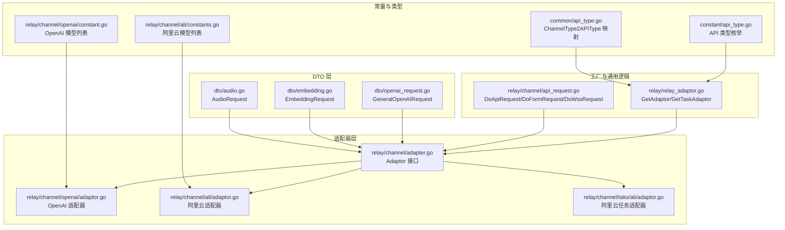
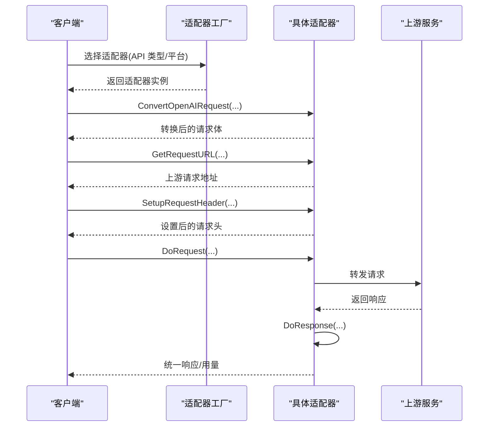
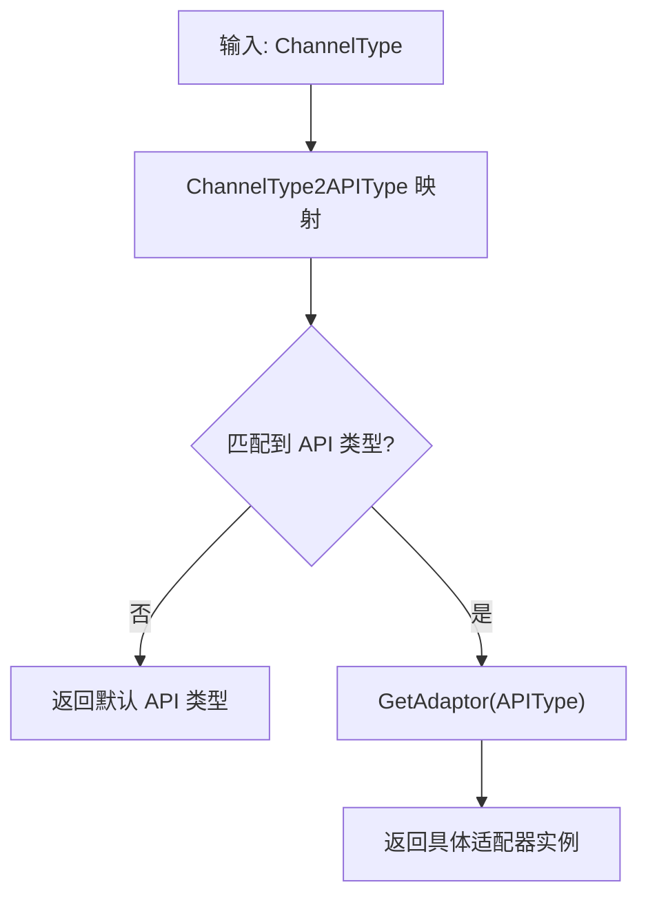
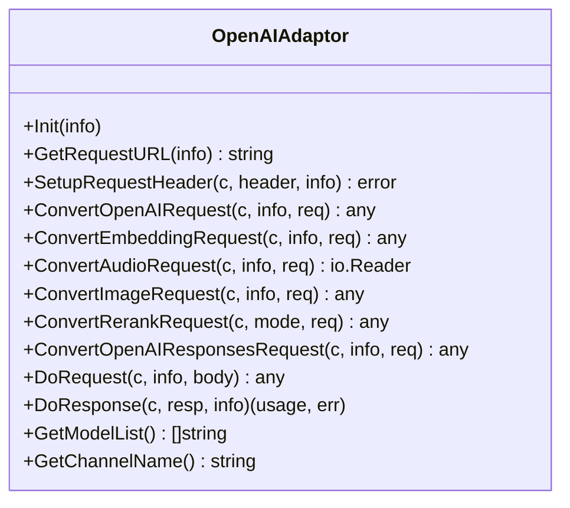
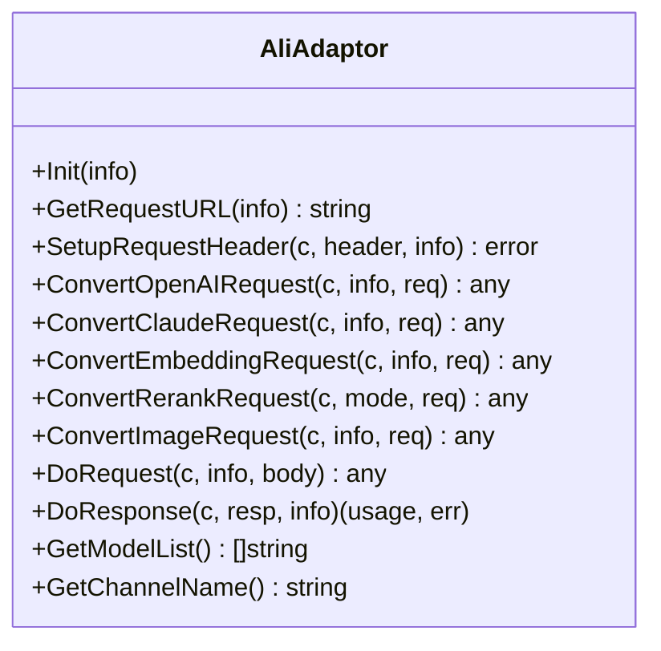
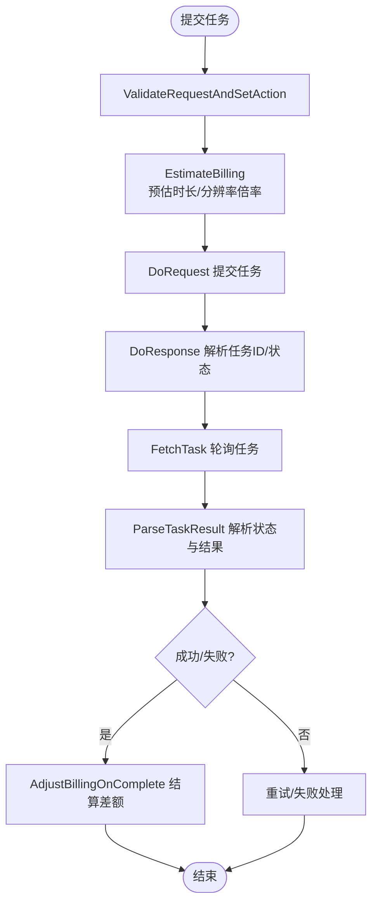
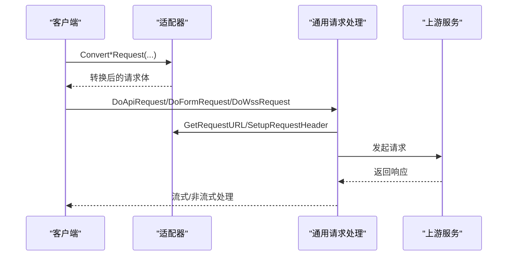
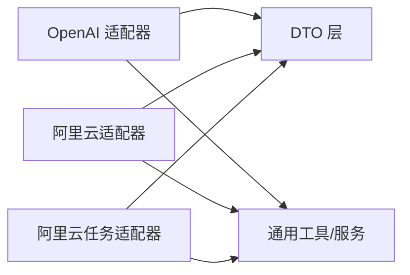

# 自定义适配器开发

<cite>
**本文档引用的文件**
- [adapter.go](file://relay/channel/adapter.go)
- [relay_adaptor.go](file://relay/relay_adaptor.go)
- [api_type.go](file://common/api_type.go)
- [api_type.go](file://constant/api_type.go)
- [adaptor.go](file://relay/channel/openai/adaptor.go)
- [adaptor.go](file://relay/channel/ali/adaptor.go)
- [constants.go](file://relay/channel/ali/constants.go)
- [constant.go](file://relay/channel/openai/constant.go)
- [openai_request.go](file://dto/openai_request.go)
- [embedding.go](file://dto/embedding.go)
- [audio.go](file://dto/audio.go)
- [adaptor.go](file://relay/channel/taks/ali/adaptor.go)
- [api_request.go](file://relay/channel/api_request.go)
- [api_request_test.go](file://relay/channel/api_request_test.go)
</cite>

## 目录
1. [简介](#简介)
2. [项目结构](#项目结构)
3. [核心组件](#核心组件)
4. [架构总览](#架构总览)
5. [详细组件分析](#详细组件分析)
6. [依赖关系分析](#依赖关系分析)
7. [性能考虑](#性能考虑)
8. [故障排查指南](#故障排查指南)
9. [结论](#结论)
10. [附录](#附录)

## 简介
本指南面向需要为新 AI 服务开发自定义适配器的工程师，提供从接口定义、实现到注册与部署的完整开发流程。文档基于现有代码库中的 Adaptor 接口、适配器工厂、DTO 请求模型与任务适配器模式，系统讲解如何快速、安全地扩展新的上游服务通道。

## 项目结构
该项目采用按功能域划分的模块化组织方式：
- relay/channel：适配器层，包含各上游服务的适配器实现与通用请求处理逻辑
- dto：统一的数据传输对象，涵盖聊天、嵌入、音频、图像等请求/响应结构
- relay：适配器工厂与通用转发逻辑
- common/constant：常量与类型定义
- service/controller/middleware：业务与中间件层

**图表来源**
- [adapter.go:15-32](file://relay/channel/adapter.go#L15-L32)
- [adaptor.go:37-40](file://relay/channel/openai/adaptor.go#L37-L40)
- [adaptor.go:23-26](file://relay/channel/ali/adaptor.go#L23-L26)
- [adaptor.go:111-116](file://relay/channel/taks/ali/adaptor.go#L111-L116)
- [relay_adaptor.go:53-125](file://relay/relay_adaptor.go#L53-L125)
- [api_request.go:290-319](file://relay/channel/api_request.go#L290-L319)
- [openai_request.go:29-109](file://dto/openai_request.go#L29-L109)
- [embedding.go:22-33](file://dto/embedding.go#L22-L33)
- [audio.go:12-31](file://dto/audio.go#L12-L31)
- [api_type.go:3-40](file://constant/api_type.go#L3-L40)
- [api_type.go:5-83](file://common/api_type.go#L5-L83)
- [constant.go:3-77](file://relay/channel/openai/constant.go#L3-L77)
- [constants.go:3-14](file://relay/channel/ali/constants.go#L3-L14)

**章节来源**
- [adapter.go:15-32](file://relay/channel/adapter.go#L15-L32)
- [relay_adaptor.go:53-125](file://relay/relay_adaptor.go#L53-L125)

## 核心组件
- Adaptor 接口：定义了适配器的核心能力，包括初始化、请求 URL 构建、请求头设置、各类请求转换、请求发起、响应处理、模型列表与通道名查询等。
- TaskAdaptor 接口：用于异步任务场景（如视频生成），包含请求校验、预估计费、提交后调整、完成时结算、轮询与结果解析等。
- 适配器工厂：根据 API 类型或平台选择具体适配器实例。
- DTO 层：统一的请求/响应结构，便于跨适配器复用与转换。

关键职责与方法清单（来自接口定义）：
- 初始化与元信息：Init、GetModelList、GetChannelName
- 请求转换：ConvertOpenAIRequest、ConvertEmbeddingRequest、ConvertAudioRequest、ConvertImageRequest、ConvertRerankRequest、ConvertOpenAIResponsesRequest、ConvertClaudeRequest、ConvertGeminiRequest
- 请求执行：GetRequestURL、SetupRequestHeader、DoRequest
- 响应处理：DoResponse
- 任务适配器：ValidateRequestAndSetAction、EstimateBilling、AdjustBillingOnSubmit、AdjustBillingOnComplete、BuildRequestURL、BuildRequestHeader、BuildRequestBody、DoRequest、DoResponse、FetchTask、ParseTaskResult

**章节来源**
- [adapter.go:15-32](file://relay/channel/adapter.go#L15-L32)
- [adapter.go:34-79](file://relay/channel/adapter.go#L34-L79)

## 架构总览
适配器架构遵循“接口抽象 + 工厂选择 + 通用转发”的设计模式。客户端请求经由工厂选择对应适配器，适配器负责将请求转换为上游可接受的格式并转发，随后将上游响应转换回统一格式返回给客户端。

**图表来源**
- [relay_adaptor.go:53-125](file://relay/relay_adaptor.go#L53-L125)
- [adaptor.go:243-364](file://relay/channel/openai/adaptor.go#L243-L364)
- [api_request.go:290-319](file://relay/channel/api_request.go#L290-L319)

## 详细组件分析

### Adaptor 接口与实现要求
- 必需方法签名与职责
  - Init：初始化适配器内部状态（如通道类型、特性开关等）
  - GetRequestURL：根据 RelayInfo 计算最终上游请求地址
  - SetupRequestHeader：设置认证与必要请求头，支持 Header Override
  - ConvertOpenAIRequest/ConvertEmbeddingRequest/ConvertAudioRequest/ConvertImageRequest/ConvertRerankRequest/ConvertOpenAIResponsesRequest/ConvertClaudeRequest/ConvertGeminiRequest：将通用 DTO 转换为上游特定格式
  - DoRequest：发起上游请求（支持普通 API、表单、WebSocket）
  - DoResponse：处理上游响应，返回用量与错误包装
  - GetModelList/GetChannelName：提供模型列表与通道名称

- 参数规范
  - RelayInfo：包含上游基础地址、请求路径、模型名、是否流式、通道类型、API Key、组织等上下文信息
  - DTO：统一的请求结构，便于跨适配器转换与兼容

- 实现要点
  - 正确处理流式与非流式差异（SSE、WebSocket、表单上传）
  - 严格区分 Header Override 与默认设置的优先级
  - 对上游特殊参数进行兼容与归一化（如推理强度、思维模式等）

**章节来源**
- [adapter.go:15-32](file://relay/channel/adapter.go#L15-L32)
- [openai_request.go:29-109](file://dto/openai_request.go#L29-L109)
- [embedding.go:22-33](file://dto/embedding.go#L22-L33)
- [audio.go:12-31](file://dto/audio.go#L12-L31)

### 适配器工厂与注册
- 适配器工厂通过 API 类型映射到具体适配器实例
- ChannelType2APIType 提供通道类型到 API 类型的映射，确保新增通道类型能正确进入工厂分支

**图表来源**
- [api_type.go:5-83](file://common/api_type.go#L5-L83)
- [relay_adaptor.go:53-125](file://relay/relay_adaptor.go#L53-L125)

**章节来源**
- [api_type.go:5-83](file://common/api_type.go#L5-L83)
- [relay_adaptor.go:53-125](file://relay/relay_adaptor.go#L53-L125)

### OpenAI 适配器实现示例
- 职责范围：支持聊天、嵌入、音频、图像、响应聚合等多种模式
- 关键实现点：
  - 请求转换：对推理强度、思维模式、模型后缀等进行兼容处理
  - 请求头：根据通道类型设置认证与协议头
  - 请求执行：根据模式选择普通 API、表单或 WebSocket
  - 响应处理：针对不同模式选择对应的处理器

**图表来源**
- [adaptor.go:37-40](file://relay/channel/openai/adaptor.go#L37-L40)
- [adaptor.go:111-187](file://relay/channel/openai/adaptor.go#L111-L187)
- [adaptor.go:189-241](file://relay/channel/openai/adaptor.go#L189-L241)
- [adaptor.go:243-364](file://relay/channel/openai/adaptor.go#L243-L364)
- [adaptor.go:607-617](file://relay/channel/openai/adaptor.go#L607-L617)
- [adaptor.go:619-649](file://relay/channel/openai/adaptor.go#L619-L649)
- [adaptor.go:651-683](file://relay/channel/openai/adaptor.go#L651-L683)

**章节来源**
- [adaptor.go:37-40](file://relay/channel/openai/adaptor.go#L37-L40)
- [adaptor.go:111-187](file://relay/channel/openai/adaptor.go#L111-L187)
- [adaptor.go:189-241](file://relay/channel/openai/adaptor.go#L189-L241)
- [adaptor.go:243-364](file://relay/channel/openai/adaptor.go#L243-L364)
- [adaptor.go:607-617](file://relay/channel/openai/adaptor.go#L607-L617)
- [adaptor.go:619-649](file://relay/channel/openai/adaptor.go#L619-L649)
- [adaptor.go:651-683](file://relay/channel/openai/adaptor.go#L651-L683)

### 阿里云适配器实现示例
- 职责范围：兼容 OpenAI 与 Claude 接口，支持文本、图像、嵌入、重排等模式
- 关键实现点：
  - URL 与头设置：根据模式与通道类型动态拼接
  - 请求转换：将通用请求转换为阿里云特定格式
  - 响应处理：根据模式委托至 OpenAI 或专用处理器

**图表来源**
- [adaptor.go:23-26](file://relay/channel/ali/adaptor.go#L23-L26)
- [adaptor.go:72-111](file://relay/channel/ali/adaptor.go#L72-L111)
- [adaptor.go:113-136](file://relay/channel/ali/adaptor.go#L113-L136)
- [adaptor.go:138-159](file://relay/channel/ali/adaptor.go#L138-L159)
- [adaptor.go:218-220](file://relay/channel/ali/adaptor.go#L218-L220)
- [adaptor.go:222-246](file://relay/channel/ali/adaptor.go#L222-L246)
- [constants.go:3-14](file://relay/channel/ali/constants.go#L3-L14)

**章节来源**
- [adaptor.go:23-26](file://relay/channel/ali/adaptor.go#L23-L26)
- [adaptor.go:72-111](file://relay/channel/ali/adaptor.go#L72-L111)
- [adaptor.go:113-136](file://relay/channel/ali/adaptor.go#L113-L136)
- [adaptor.go:138-159](file://relay/channel/ali/adaptor.go#L138-L159)
- [adaptor.go:218-220](file://relay/channel/ali/adaptor.go#L218-L220)
- [adaptor.go:222-246](file://relay/channel/ali/adaptor.go#L222-L246)
- [constants.go:3-14](file://relay/channel/ali/constants.go#L3-L14)

### 任务适配器与计费
- 任务适配器用于异步任务（如视频生成），包含请求校验、预估计费、提交后调整与完成时结算
- 以阿里云视频生成为例，适配器根据请求参数估算时长与分辨率倍率，提交后解析任务状态并转换为统一视频任务响应

**图表来源**
- [adaptor.go:124-127](file://relay/channel/taks/ali/adaptor.go#L124-L127)
- [adaptor.go:348-370](file://relay/channel/taks/ali/adaptor.go#L348-L370)
- [adaptor.go:377-419](file://relay/channel/taks/ali/adaptor.go#L377-L419)
- [adaptor.go:421-442](file://relay/channel/taks/ali/adaptor.go#L421-L442)
- [adaptor.go:452-487](file://relay/channel/taks/ali/adaptor.go#L452-L487)

**章节来源**
- [adaptor.go:124-127](file://relay/channel/taks/ali/adaptor.go#L124-L127)
- [adaptor.go:348-370](file://relay/channel/taks/ali/adaptor.go#L348-L370)
- [adaptor.go:377-419](file://relay/channel/taks/ali/adaptor.go#L377-L419)
- [adaptor.go:421-442](file://relay/channel/taks/ali/adaptor.go#L421-L442)
- [adaptor.go:452-487](file://relay/channel/taks/ali/adaptor.go#L452-L487)

### 通用请求与响应处理
- 通用请求处理：支持普通 API、表单与 WebSocket，自动注入 Header Override 并处理流式 Ping 保活
- 通用响应处理：根据模式选择对应处理器，统一返回用量与错误包装

**图表来源**
- [api_request.go:290-319](file://relay/channel/api_request.go#L290-L319)
- [api_request.go:321-352](file://relay/channel/api_request.go#L321-L352)
- [api_request.go:354-382](file://relay/channel/api_request.go#L354-L382)
- [api_request.go:486-530](file://relay/channel/api_request.go#L486-L530)

**章节来源**
- [api_request.go:290-319](file://relay/channel/api_request.go#L290-L319)
- [api_request.go:321-352](file://relay/channel/api_request.go#L321-L352)
- [api_request.go:354-382](file://relay/channel/api_request.go#L354-L382)
- [api_request.go:486-530](file://relay/channel/api_request.go#L486-L530)

## 依赖关系分析
- 适配器依赖关系
  - OpenAI 适配器依赖通用 DTO 与服务层工具，支持多模式与多上游格式转换
  - 阿里云适配器同时兼容 OpenAI/Claude 接口，并根据模式选择不同上游端点
  - 任务适配器依赖通用任务请求结构与计费基类，实现异步任务生命周期管理

**图表来源**
- [adaptor.go:15-35](file://relay/channel/openai/adaptor.go#L15-L35)
- [adaptor.go:10-21](file://relay/channel/ali/adaptor.go#L10-L21)
- [adaptor.go:11-23](file://relay/channel/taks/ali/adaptor.go#L11-L23)

**章节来源**
- [adaptor.go:15-35](file://relay/channel/openai/adaptor.go#L15-L35)
- [adaptor.go:10-21](file://relay/channel/ali/adaptor.go#L10-L21)
- [adaptor.go:11-23](file://relay/channel/taks/ali/adaptor.go#L11-L23)

## 性能考虑
- 流式请求保活：启用 Ping 保活机制，避免连接中断导致的超时
- 代理与直连：根据通道设置选择代理或直连，减少网络延迟
- Header Override：仅传递必要头部，避免冗余字段影响性能
- 模型列表与通道名：通过静态列表与名称缓存减少运行时开销

[本节为通用指导，无需列出具体文件来源]

## 故障排查指南
- 常见问题
  - 认证失败：检查 SetupRequestHeader 是否正确设置认证头，确认 Header Override 未覆盖关键字段
  - 请求头缺失：确认 Content-Type/Accept 等头在不同模式下正确设置
  - 流式连接中断：检查 Ping 保活配置与网络代理设置
  - 异步任务状态异常：核对 FetchTask 与 ParseTaskResult 的实现一致性

- 调试技巧
  - 启用调试日志，观察请求 URL、请求头与响应体
  - 使用测试用例验证请求转换与响应处理逻辑
  - 对比已实现适配器（如 OpenAI、阿里云）的实现模式

**章节来源**
- [api_request.go:290-319](file://relay/channel/api_request.go#L290-L319)
- [api_request.go:486-530](file://relay/channel/api_request.go#L486-L530)
- [api_request_test.go](file://relay/channel/api_request_test.go)

## 结论
通过遵循 Adaptor 接口规范与工厂注册流程，结合 DTO 层的统一模型与通用请求处理机制，开发者可以高效、稳定地为新的 AI 服务实现适配器。建议在实现过程中参考现有适配器的最佳实践，完善测试与调试流程，并关注性能与可靠性细节。

[本节为总结性内容，无需列出具体文件来源]

## 附录

### 开发步骤清单
- 新增 API 类型枚举
  - 在常量文件中添加新的 API 类型值
  - 在 ChannelType2APIType 中添加映射
- 创建适配器目录与文件
  - 在 relay/channel 下新建适配器包与适配器实现
  - 实现 Adaptor 接口的所有必需方法
- 注册适配器
  - 在适配器工厂中添加新的 API 类型分支
- 配置模型列表与通道名
  - 在适配器包中提供模型列表与通道名常量
- 编写测试
  - 单元测试：验证请求转换与响应处理
  - 集成测试：验证与上游服务的连通性
  - 端到端测试：模拟真实请求路径与错误场景
- 部署与监控
  - 配置代理与认证
  - 监控请求耗时、错误率与用量统计

**章节来源**
- [api_type.go:3-40](file://constant/api_type.go#L3-L40)
- [api_type.go:5-83](file://common/api_type.go#L5-L83)
- [relay_adaptor.go:53-125](file://relay/relay_adaptor.go#L53-L125)
- [constants.go:3-14](file://relay/channel/ali/constants.go#L3-L14)
- [constant.go:3-77](file://relay/channel/openai/constant.go#L3-L77)