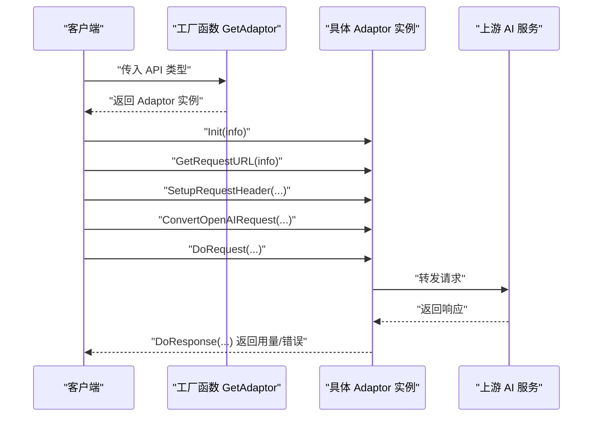
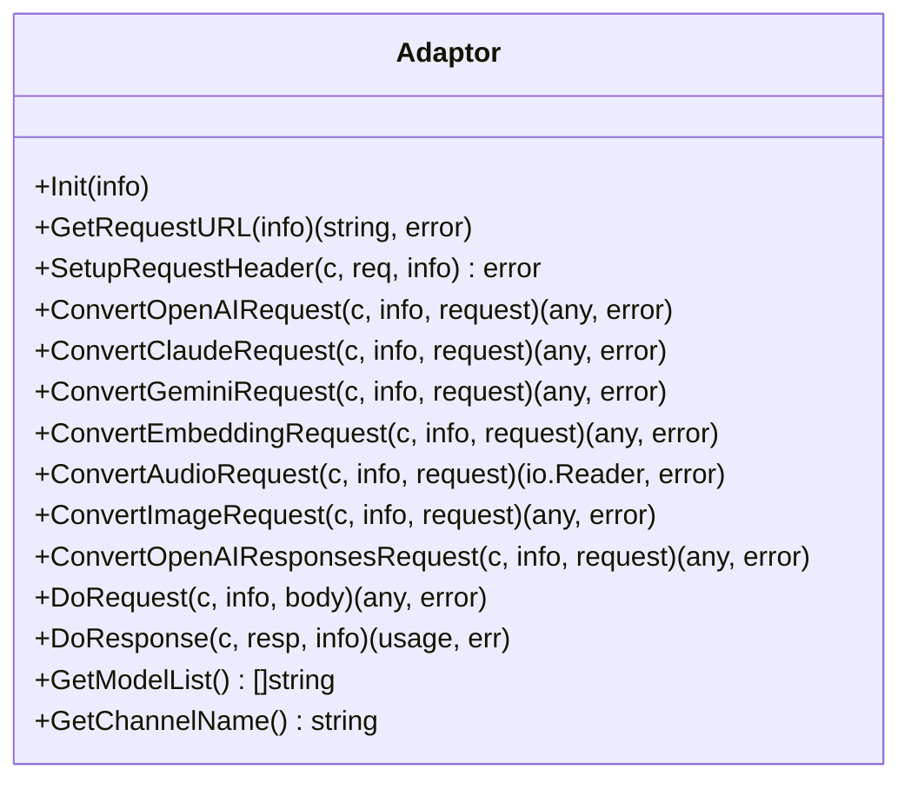
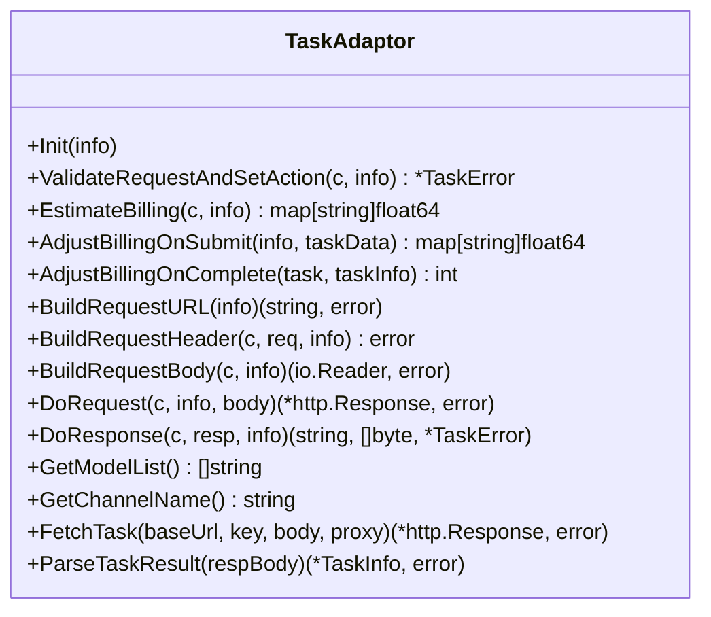
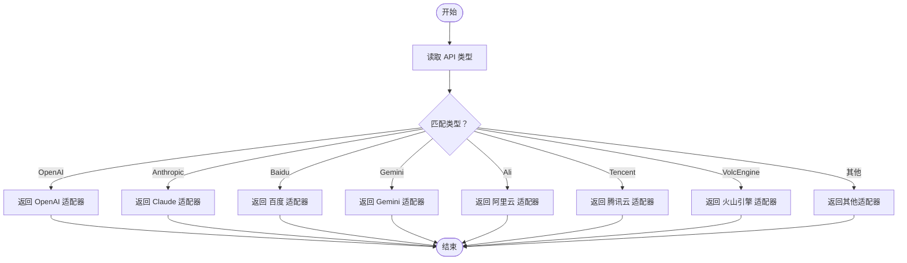
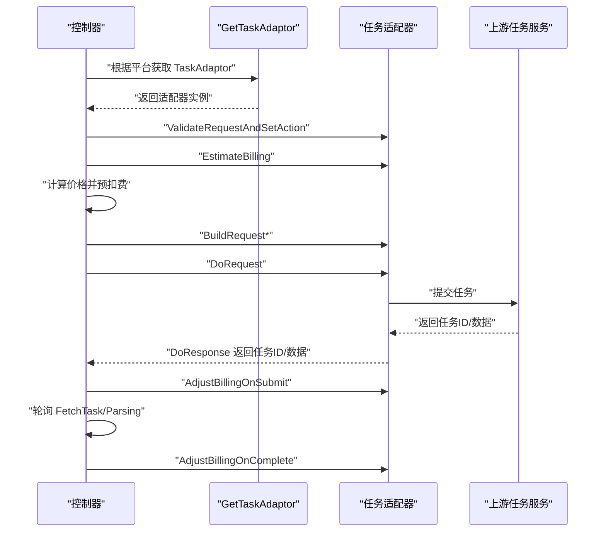
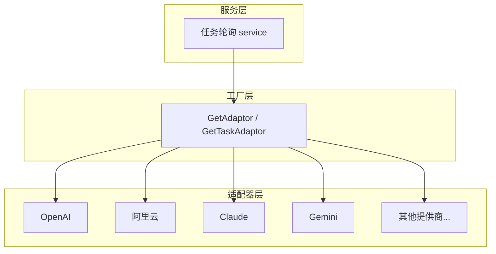

# 适配器架构设计

<cite>
**本文引用的文件**
- [adapter.go](file://relay/channel/adapter.go)
- [relay_adaptor.go](file://relay/relay_adaptor.go)
- [api_type.go](file://constant/api_type.go)
- [adaptor.go](file://relay/channel/openai/adaptor.go)
- [adaptor.go](file://relay/channel/ali/adaptor.go)
- [adaptor.go](file://relay/channel/cloudflare/adaptor.go)
- [adaptor.go](file://relay/channel/perplexity/adaptor.go)
- [adaptor.go](file://relay/channel/xai/adaptor.go)
- [adaptor.go](file://relay/channel/tencent/adaptor.go)
- [adaptor.go](file://relay/channel/vertex/adaptor.go)
- [adaptor.go](file://relay/channel/ollama/adaptor.go)
- [adaptor.go](file://relay/channel/moonshot/adaptor.go)
- [adaptor.go](file://relay/channel/coze/adaptor.go)
- [adaptor.go](file://relay/channel/jimeng/adaptor.go)
- [adaptor.go](file://relay/channel/submodel/adaptor.go)
- [adaptor.go](file://relay/channel/minimax/adaptor.go)
- [adaptor.go](file://relay/channel/replicate/adaptor.go)
- [adaptor.go](file://relay/channel/codex/adaptor.go)
- [adaptor.go](file://relay/channel/baidu_v2/adaptor.go)
- [adaptor.go](file://relay/channel/openrouter/adaptor.go)
- [adaptor.go](file://relay/channel/xunfei/adaptor.go)
- [adaptor.go](file://relay/channel/zhipu_4v/adaptor.go)
- [adaptor.go](file://relay/channel/dify/adaptor.go)
- [adaptor.go](file://relay/channel/jina/adaptor.go)
- [adaptor.go](file://relay/channel/siliconflow/adaptor.go)
- [adaptor.go](file://relay/channel/mokaai/adaptor.go)
- [adaptor.go](file://relay/channel/volcengine/adaptor.go)
- [adaptor.go](file://relay/channel/ai360/constants.go)
- [adaptor.go](file://relay/channel/lingyiwanwu/constrants.go)
- [adaptor.go](file://relay/channel/xinference/constant.go)
- [adaptor.go](file://relay/channel/openrouter/constant.go)
- [adaptor.go](file://relay/channel/vertex/service_account.go)
- [adaptor.go](file://relay/channel/vertex/constants.go)
- [adaptor.go](file://relay/channel/aws/relay-aws.go)
- [adaptor.go](file://relay/channel/aws/constants.go)
- [adaptor.go](file://relay/channel/aws/dto.go)
- [adaptor.go](file://relay/channel/aws/relay-aws.go)
- [adaptor.go](file://relay/channel/baidu/relay-baidu.go)
- [adaptor.go](file://relay/channel/baidu/constants.go)
- [adaptor.go](file://relay/channel/baidu/dto.go)
- [adaptor.go](file://relay/channel/baidu_v2/adaptor.go)
- [adaptor.go](file://relay/channel/claude/relay-claude.go)
- [adaptor.go](file://relay/channel/claude/constants.go)
- [adaptor.go](file://relay/channel/claude/dto.go)
- [adaptor.go](file://relay/channel/claude/message_delta_usage_patch_test.go)
- [adaptor.go](file://relay/channel/claude/relay-claude.go)
- [adaptor.go](file://relay/channel/claude/relay_claude_test.go)
- [adaptor.go](file://relay/channel/cloudflare/relay_cloudflare.go)
- [adaptor.go](file://relay/channel/cloudflare/constant.go)
- [adaptor.go](file://relay/channel/cloudflare/dto.go)
- [adaptor.go](file://relay/channel/codex/adaptor.go)
- [adaptor.go](file://relay/channel/codex/constants.go)
- [adaptor.go](file://relay/channel/codex/oauth_key.go)
- [adaptor.go](file://relay/channel/cohere/relay-cohere.go)
- [adaptor.go](file://relay/channel/cohere/constant.go)
- [adaptor.go](file://relay/channel/cohere/dto.go)
- [adaptor.go](file://relay/channel/coze/relay-coze.go)
- [adaptor.go](file://relay/channel/coze/constants.go)
- [adaptor.go](file://relay/channel/coze/dto.go)
- [adaptor.go](file://relay/channel/deepseek/adaptor.go)
- [adaptor.go](file://relay/channel/deepseek/constants.go)
- [adaptor.go](file://relay/channel/dify/relay-dify.go)
- [adaptor.go](file://relay/channel/dify/constants.go)
- [adaptor.go](file://relay/channel/dify/dto.go)
- [adaptor.go](file://relay/channel/gemini/relay-gemini.go)
- [adaptor.go](file://relay/channel/gemini/relay-gemini-native.go)
- [adaptor.go](file://relay/channel/gemini/constant.go)
- [adaptor.go](file://relay/channel/gemini/relay_gemini_usage_test.go)
- [adaptor.go](file://relay/channel/jimeng/relay-jimeng.go)
- [adaptor.go](file://relay/channel/jimeng/constants.go)
- [adaptor.go](file://relay/channel/jimeng/sign.go)
- [adaptor.go](file://relay/channel/jina/relay-jina.go)
- [adaptor.go](file://relay/channel/jina/constant.go)
- [adaptor.go](file://relay/channel/lingyiwanwu/relay-lingyiwanwu.go)
- [adaptor.go](file://relay/channel/minimax/relay-minimax.go)
- [adaptor.go](file://relay/channel/minimax/constants.go)
- [adaptor.go](file://relay/channel/minimax/image.go)
- [adaptor.go](file://relay/channel/minimax/tts.go)
- [adaptor.go](file://relay/channel/mistral/adaptor.go)
- [adaptor.go](file://relay/channel/mistral/constants.go)
- [adaptor.go](file://relay/channel/mokaai/relay-mokaai.go)
- [adaptor.go](file://relay/channel/mokaai/constants.go)
- [adaptor.go](file://relay/channel/moonshot/constants.go)
- [adaptor.go](file://relay/channel/ollama/relay-ollama.go)
- [adaptor.go](file://relay/channel/ollama/constants.go)
- [adaptor.go](file://relay/channel/ollama/dto.go)
- [adaptor.go](file://relay/channel/ollama/stream.go)
- [adaptor.go](file://relay/channel/openai/relay-openai.go)
- [adaptor.go](file://relay/channel/openai/audio.go)
- [adaptor.go](file://relay/channel/openai/chat_via_responses.go)
- [adaptor.go](file://relay/channel/openai/constant.go)
- [adaptor.go](file://relay/channel/openai/helper.go)
- [adaptor.go](file://relay/channel/openai/relay-openai.go)
- [adaptor.go](file://relay/channel/openai/relay_responses.go)
- [adaptor.go](file://relay/channel/openai/relay_responses_compact.go)
- [adaptor.go](file://relay/channel/openrouter/constant.go)
- [adaptor.go](file://relay/channel/openrouter/dto.go)
- [adaptor.go](file://relay/channel/palm/relay-palm.go)
- [adaptor.go](file://relay/channel/palm/constants.go)
- [adaptor.go](file://relay/channel/palm/dto.go)
- [adaptor.go](file://relay/channel/perplexity/relay-perplexity.go)
- [adaptor.go](file://relay/channel/perplexity/constants.go)
- [adaptor.go](file://relay/channel/replicate/relay-replicate.go)
- [adaptor.go](file://relay/channel/replicate/constants.go)
- [adaptor.go](file://relay/channel/replicate/dto.go)
- [adaptor.go](file://relay/channel/siliconflow/relay-siliconflow.go)
- [adaptor.go](file://relay/channel/siliconflow/constant.go)
- [adaptor.go](file://relay/channel/siliconflow/dto.go)
- [adaptor.go](file://relay/channel/submodel/constants.go)
- [adaptor.go](file://relay/channel/tencent/relay-tencent.go)
- [adaptor.go](file://relay/channel/tencent/constants.go)
- [adaptor.go](file://relay/channel/tencent/dto.go)
- [adaptor.go](file://relay/channel/vertex/relay-vertex.go)
- [adaptor.go](file://relay/channel/vertex/constants.go)
- [adaptor.go](file://relay/channel/vertex/dto.go)
- [adaptor.go](file://relay/channel/volcengine/protocols.go)
- [adaptor.go](file://relay/channel/volcengine/constants.go)
- [adaptor.go](file://relay/channel/volcengine/tts.go)
- [adaptor.go](file://relay/channel/xai/relay-xai.go)
- [adaptor.go](file://relay/channel/xai/constants.go)
- [adaptor.go](file://relay/channel/xai/dto.go)
- [adaptor.go](file://relay/channel/xunfei/relay-xunfei.go)
- [adaptor.go](file://relay/channel/xunfei/constants.go)
- [adaptor.go](file://relay/channel/xunfei/dto.go)
- [adaptor.go](file://relay/channel/zhipu/relay-zhipu.go)
- [adaptor.go](file://relay/channel/zhipu/constants.go)
- [adaptor.go](file://relay/channel/zhipu/dto.go)
- [adaptor.go](file://relay/channel/zhipu_4v/relay-zhipu_v4.go)
- [adaptor.go](file://relay/channel/zhipu_4v/constants.go)
- [adaptor.go](file://relay/channel/zhipu_4v/dto.go)
- [adaptor.go](file://relay/channel/adapter.go)
- [relay_task.go](file://relay/relay_task.go)
- [helpers.go](file://relay/channel/task/taskcommon/helpers.go)
- [task.go](file://model/task.go)
- [task_polling.go](file://service/task_polling.go)
</cite>

## 目录
1. [简介](#简介)
2. [项目结构](#项目结构)
3. [核心组件](#核心组件)
4. [架构总览](#架构总览)
5. [详细组件分析](#详细组件分析)
6. [依赖分析](#依赖分析)
7. [性能考虑](#性能考虑)
8. [故障排查指南](#故障排查指南)
9. [结论](#结论)
10. [附录](#附录)

## 简介
本文件面向 New API 的 AI 适配器架构，系统阐述适配器模式在 New API 中的应用原理与实现细节，重点包括：
- Adaptor 接口设计与职责边界
- API 类型枚举与适配器工厂模式
- GetAdaptor 函数工作机制与扩展路径
- 适配器统一规范：请求转换、响应处理、错误映射
- 任务适配器（TaskAdaptor）与普通适配器的差异与场景
- 适配器扩展指南与最佳实践

## 项目结构
New API 的适配器体系位于 relay/channel 目录下，按“提供商/协议”维度组织，每个适配器实现统一的 Adaptor 或 TaskAdaptor 接口，并通过工厂函数统一调度。

```mermaid
graph TB
subgraph "适配器层"
A["Adaptor 接口<br/>统一请求/响应处理"]
B["TaskAdaptor 接口<br/>任务型适配器"]
C["工厂函数 GetAdaptor<br/>按 API 类型返回适配器实例"]
D["工厂函数 GetTaskAdaptor<br/>按平台返回任务适配器实例"]
end
subgraph "提供商适配器"
OA["OpenAI 适配器"]
AA["阿里云 适配器"]
CA["Claude 适配器"]
GA["Gemini 适配器"]
TA["腾讯云 适配器"]
VA["Vertex 适配器"]
HA["HuggingFace/Ollama 适配器"]
MA["Moonshot 适配器"]
XA["XAI 适配器"]
BA["百度/百度V2 适配器"]
DA["Dify 适配器"]
JA["Jina 适配器"]
SA["SiliconFlow 适配器"]
KA["Kling 适配器"]
EA["Etsy/Replicate 适配器"]
IA["Codex 适配器"]
ZA["智谱/智谱V4 适配器"]
FA["火山引擎 适配器"]
end
subgraph "任务适配器"
TSA["Suno 任务适配器"]
TGA["Gemini 任务适配器"]
TVA["Vertex 任务适配器"]
TKA["Kling 任务适配器"]
TDA["DouBao/Volc 任务适配器"]
TLA["MiniMax/Hailuo 任务适配器"]
end
A --> OA
A --> AA
A --> CA
A --> GA
A --> TA
A --> VA
A --> HA
A --> MA
A --> XA
A --> BA
A --> DA
A --> JA
A --> SA
A --> EA
A --> IA
A --> ZA
A --> FA
B --> TSA
B --> TGA
B --> TVA
B --> TKA
B --> TDA
B --> TLA
C --> A
D --> B
```

图表来源
- [adapter.go:15-32](file://relay/channel/adapter.go#L15-L32)
- [relay_adaptor.go:53-125](file://relay/relay_adaptor.go#L53-L125)
- [adaptor.go:37-40](file://relay/channel/openai/adaptor.go#L37-L40)
- [adaptor.go:23-25](file://relay/channel/ali/adaptor.go#L23-L25)
- [adaptor.go:1-200](file://relay/channel/claude/adaptor.go#L1-L200)
- [adaptor.go:1-200](file://relay/channel/gemini/relay-gemini.go#L1-L200)
- [adaptor.go:1-200](file://relay/channel/tencent/relay-tencent.go#L1-L200)
- [adaptor.go:1-200](file://relay/channel/vertex/relay-vertex.go#L1-L200)
- [adaptor.go:1-200](file://relay/channel/ollama/relay-ollama.go#L1-L200)
- [adaptor.go:1-200](file://relay/channel/moonshot/constants.go#L1-L200)
- [adaptor.go:1-200](file://relay/channel/xai/relay-xai.go#L1-L200)
- [adaptor.go:1-200](file://relay/channel/baidu/relay-baidu.go#L1-L200)
- [adaptor.go:1-200](file://relay/channel/baidu_v2/adaptor.go#L1-L200)
- [adaptor.go:1-200](file://relay/channel/dify/relay-dify.go#L1-L200)
- [adaptor.go:1-200](file://relay/channel/jina/relay-jina.go#L1-L200)
- [adaptor.go:1-200](file://relay/channel/siliconflow/relay-siliconflow.go#L1-L200)
- [adaptor.go:1-200](file://relay/channel/replicate/relay-replicate.go#L1-L200)
- [adaptor.go:1-200](file://relay/channel/codex/adaptor.go#L1-L200)
- [adaptor.go:1-200](file://relay/channel/zhipu/relay-zhipu.go#L1-L200)
- [adaptor.go:1-200](file://relay/channel/zhipu_4v/relay-zhipu_v4.go#L1-L200)
- [adaptor.go:1-200](file://relay/channel/volcengine/protocols.go#L1-L200)
- [adaptor.go:1-200](file://relay/channel/perplexity/relay-perplexity.go#L1-L200)
- [adaptor.go:1-200](file://relay/channel/coze/relay-coze.go#L1-L200)
- [adaptor.go:1-200](file://relay/channel/jimeng/relay-jimeng.go#L1-L200)
- [adaptor.go:1-200](file://relay/channel/minimax/relay-minimax.go#L1-L200)
- [adaptor.go:1-200](file://relay/channel/submodel/constants.go#L1-L200)
- [adaptor.go:1-200](file://relay/channel/openrouter/constant.go#L1-L200)
- [adaptor.go:1-200](file://relay/channel/xunfei/relay-xunfei.go#L1-L200)
- [adaptor.go:1-200](file://relay/channel/ai360/constants.go#L1-L200)
- [adaptor.go:1-200](file://relay/channel/lingyiwanwu/constrants.go#L1-L200)
- [adaptor.go:1-200](file://relay/channel/xinference/constant.go#L1-L200)
- [adaptor.go:1-200](file://relay/channel/vertex/service_account.go#L1-L200)
- [adaptor.go:1-200](file://relay/channel/vertex/constants.go#L1-L200)
- [adaptor.go:1-200](file://relay/channel/aws/relay-aws.go#L1-L200)
- [adaptor.go:1-200](file://relay/channel/aws/constants.go#L1-L200)
- [adaptor.go:1-200](file://relay/channel/aws/dto.go#L1-L200)
- [adaptor.go:1-200](file://relay/channel/baidu/constants.go#L1-L200)
- [adaptor.go:1-200](file://relay/channel/baidu/dto.go#L1-L200)
- [adaptor.go:1-200](file://relay/channel/claude/constants.go#L1-L200)
- [adaptor.go:1-200](file://relay/channel/claude/dto.go#L1-L200)
- [adaptor.go:1-200](file://relay/channel/claude/message_delta_usage_patch_test.go#L1-L200)
- [adaptor.go:1-200](file://relay/channel/cloudflare/relay_cloudflare.go#L1-L200)
- [adaptor.go:1-200](file://relay/channel/cloudflare/constant.go#L1-L200)
- [adaptor.go:1-200](file://relay/channel/cloudflare/dto.go#L1-L200)
- [adaptor.go:1-200](file://relay/channel/codex/constants.go#L1-L200)
- [adaptor.go:1-200](file://relay/channel/codex/oauth_key.go#L1-L200)
- [adaptor.go:1-200](file://relay/channel/cohere/relay-cohere.go#L1-L200)
- [adaptor.go:1-200](file://relay/channel/cohere/constant.go#L1-L200)
- [adaptor.go:1-200](file://relay/channel/cohere/dto.go#L1-L200)
- [adaptor.go:1-200](file://relay/channel/coze/constants.go#L1-L200)
- [adaptor.go:1-200](file://relay/channel/coze/dto.go#L1-L200)
- [adaptor.go:1-200](file://relay/channel/deepseek/adaptor.go#L1-L200)
- [adaptor.go:1-200](file://relay/channel/deepseek/constants.go#L1-L200)
- [adaptor.go:1-200](file://relay/channel/dify/constants.go#L1-L200)
- [adaptor.go:1-200](file://relay/channel/dify/dto.go#L1-L200)
- [adaptor.go:1-200](file://relay/channel/gemini/constant.go#L1-L200)
- [adaptor.go:1-200](file://relay/channel/gemini/relay_gemini_usage_test.go#L1-L200)
- [adaptor.go:1-200](file://relay/channel/jimeng/constants.go#L1-L200)
- [adaptor.go:1-200](file://relay/channel/jimeng/sign.go#L1-L200)
- [adaptor.go:1-200](file://relay/channel/jina/constant.go#L1-L200)
- [adaptor.go:1-200](file://relay/channel/lingyiwanwu/relay-lingyiwanwu.go#L1-L200)
- [adaptor.go:1-200](file://relay/channel/minimax/constants.go#L1-L200)
- [adaptor.go:1-200](file://relay/channel/minimax/image.go#L1-L200)
- [adaptor.go:1-200](file://relay/channel/minimax/tts.go#L1-L200)
- [adaptor.go:1-200](file://relay/channel/mistral/adaptor.go#L1-L200)
- [adaptor.go:1-200](file://relay/channel/mistral/constants.go#L1-L200)
- [adaptor.go:1-200](file://relay/channel/mokaai/relay-mokaai.go#L1-L200)
- [adaptor.go:1-200](file://relay/channel/mokaai/constants.go#L1-L200)
- [adaptor.go:1-200](file://relay/channel/moonshot/constants.go#L1-L200)
- [adaptor.go:1-200](file://relay/channel/ollama/constants.go#L1-L200)
- [adaptor.go:1-200](file://relay/channel/ollama/dto.go#L1-L200)
- [adaptor.go:1-200](file://relay/channel/ollama/stream.go#L1-L200)
- [adaptor.go:1-200](file://relay/channel/openai/relay-openai.go#L1-L200)
- [adaptor.go:1-200](file://relay/channel/openai/audio.go#L1-L200)
- [adaptor.go:1-200](file://relay/channel/openai/chat_via_responses.go#L1-L200)
- [adaptor.go:1-200](file://relay/channel/openai/constant.go#L1-L200)
- [adaptor.go:1-200](file://relay/channel/openai/helper.go#L1-L200)
- [adaptor.go:1-200](file://relay/channel/openai/relay-openai.go#L1-L200)
- [adaptor.go:1-200](file://relay/channel/openai/relay_responses.go#L1-L200)
- [adaptor.go:1-200](file://relay/channel/openai/relay_responses_compact.go#L1-L200)
- [adaptor.go:1-200](file://relay/channel/openrouter/dto.go#L1-L200)
- [adaptor.go:1-200](file://relay/channel/palm/relay-palm.go#L1-L200)
- [adaptor.go:1-200](file://relay/channel/palm/constants.go#L1-L200)
- [adaptor.go:1-200](file://relay/channel/palm/dto.go#L1-L200)
- [adaptor.go:1-200](file://relay/channel/perplexity/relay-perplexity.go#L1-L200)
- [adaptor.go:1-200](file://relay/channel/perplexity/constants.go#L1-L200)
- [adaptor.go:1-200](file://relay/channel/replicate/relay-replicate.go#L1-L200)
- [adaptor.go:1-200](file://relay/channel/replicate/constants.go#L1-L200)
- [adaptor.go:1-200](file://relay/channel/replicate/dto.go#L1-L200)
- [adaptor.go:1-200](file://relay/channel/siliconflow/relay-siliconflow.go#L1-L200)
- [adaptor.go:1-200](file://relay/channel/siliconflow/constant.go#L1-L200)
- [adaptor.go:1-200](file://relay/channel/siliconflow/dto.go#L1-L200)
- [adaptor.go:1-200](file://relay/channel/submodel/constants.go#L1-L200)
- [adaptor.go:1-200](file://relay/channel/tencent/relay-tencent.go#L1-L200)
- [adaptor.go:1-200](file://relay/channel/tencent/constants.go#L1-L200)
- [adaptor.go:1-200](file://relay/channel/tencent/dto.go#L1-L200)
- [adaptor.go:1-200](file://relay/channel/vertex/relay-vertex.go#L1-L200)
- [adaptor.go:1-200](file://relay/channel/vertex/constants.go#L1-L200)
- [adaptor.go:1-200](file://relay/channel/vertex/dto.go#L1-L200)
- [adaptor.go:1-200](file://relay/channel/volcengine/protocols.go#L1-L200)
- [adaptor.go:1-200](file://relay/channel/volcengine/constants.go#L1-L200)
- [adaptor.go:1-200](file://relay/channel/volcengine/tts.go#L1-L200)
- [adaptor.go:1-200](file://relay/channel/xai/relay-xai.go#L1-L200)
- [adaptor.go:1-200](file://relay/channel/xai/constants.go#L1-L200)
- [adaptor.go:1-200](file://relay/channel/xai/dto.go#L1-L200)
- [adaptor.go:1-200](file://relay/channel/xunfei/relay-xunfei.go#L1-L200)
- [adaptor.go:1-200](file://relay/channel/xunfei/constants.go#L1-L200)
- [adaptor.go:1-200](file://relay/channel/xunfei/dto.go#L1-L200)
- [adaptor.go:1-200](file://relay/channel/zhipu/relay-zhipu.go#L1-L200)
- [adaptor.go:1-200](file://relay/channel/zhipu/constants.go#L1-L200)
- [adaptor.go:1-200](file://relay/channel/zhipu/dto.go#L1-L200)
- [adaptor.go:1-200](file://relay/channel/zhipu_4v/relay-zhipu_v4.go#L1-L200)
- [adaptor.go:1-200](file://relay/channel/zhipu_4v/constants.go#L1-L200)
- [adaptor.go:1-200](file://relay/channel/zhipu_4v/dto.go#L1-L200)

章节来源
- [adapter.go:15-32](file://relay/channel/adapter.go#L15-L32)
- [relay_adaptor.go:53-125](file://relay/relay_adaptor.go#L53-L125)

## 核心组件
- Adaptor 接口：定义统一的请求/响应处理能力，涵盖初始化、URL 构造、请求头设置、各类请求转换（OpenAI/Claude/Gemini/Embedding/Audio/Image/OpenAI Responses）、上游请求发起、响应处理、模型列表与通道名查询等。
- TaskAdaptor 接口：专用于任务型适配器，新增任务生命周期相关方法：请求校验与动作设定、计费估算、提交后计费调整、完成时计费调整、请求构建、任务轮询与结果解析等。
- 工厂函数 GetAdaptor：根据 API 类型返回对应 Adaptor 实例；GetTaskAdaptor：根据平台返回 TaskAdaptor 实例。
- API 类型枚举：constant/api_type.go 定义了完整的 API 类型常量集合，用于工厂函数的分支选择。

章节来源
- [adapter.go:15-32](file://relay/channel/adapter.go#L15-L32)
- [adapter.go:34-79](file://relay/channel/adapter.go#L34-L79)
- [relay_adaptor.go:53-125](file://relay/relay_adaptor.go#L53-L125)
- [api_type.go:3-40](file://constant/api_type.go#L3-L40)

## 架构总览
New API 的适配器采用“接口 + 工厂 + 具体适配器”的分层设计，通过统一接口屏蔽不同提供商的差异，通过工厂函数集中管理实例化与路由，通过任务适配器抽象任务型业务的通用流程。

图表来源
- [relay_adaptor.go:53-125](file://relay/relay_adaptor.go#L53-L125)
- [adapter.go:15-32](file://relay/channel/adapter.go#L15-L32)
- [adaptor.go:98-109](file://relay/channel/openai/adaptor.go#L98-L109)
- [adaptor.go:111-187](file://relay/channel/openai/adaptor.go#L111-L187)
- [adaptor.go:189-241](file://relay/channel/openai/adaptor.go#L189-L241)
- [adaptor.go:243-364](file://relay/channel/openai/adaptor.go#L243-L364)
- [adaptor.go:607-617](file://relay/channel/openai/adaptor.go#L607-L617)
- [adaptor.go:619-649](file://relay/channel/openai/adaptor.go#L619-L649)

## 详细组件分析

### Adaptor 接口设计与统一规范
- 初始化与元信息：Init 接收 RelayInfo，用于保存通道类型、推理级别等上下文。
- 请求 URL 与头部：GetRequestURL 构造完整请求地址；SetupRequestHeader 设置鉴权与特殊头。
- 请求转换：ConvertOpenAIRequest、ConvertClaudeRequest、ConvertGeminiRequest、ConvertEmbeddingRequest、ConvertAudioRequest、ConvertImageRequest、ConvertOpenAIResponsesRequest 支持多形态输入转换。
- 上游交互：DoRequest 发起请求；DoResponse 处理响应并返回用量与错误。
- 查询能力：GetModelList 返回模型清单；GetChannelName 返回通道名。

图表来源
- [adapter.go:15-32](file://relay/channel/adapter.go#L15-L32)

章节来源
- [adapter.go:15-32](file://relay/channel/adapter.go#L15-L32)

### TaskAdaptor 接口设计与任务流程
- 生命周期方法：Init、ValidateRequestAndSetAction、EstimateBilling、AdjustBillingOnSubmit、AdjustBillingOnComplete。
- 请求构建：BuildRequestURL、BuildRequestHeader、BuildRequestBody、DoRequest。
- 结果处理：DoResponse 返回任务 ID 与任务数据；FetchTask/Parsing 用于轮询。
- 计费策略：通过 OtherRatios（如秒数、分辨率）进行预估与结算。

图表来源
- [adapter.go:34-79](file://relay/channel/adapter.go#L34-L79)

章节来源
- [adapter.go:34-79](file://relay/channel/adapter.go#L34-L79)

### 工厂模式与 GetAdaptor 机制
- API 类型枚举：constant/api_type.go 定义了所有支持的 API 类型常量。
- 工厂函数：relay/relay_adaptor.go 的 GetAdaptor 根据 API 类型返回对应 Adaptor 实例，覆盖 OpenAI、Anthropic、Baidu、Gemini、阿里云、腾讯云、火山引擎、Perplexity、AWS、Cohere、Dify、Jina、Cloudflare、SiliconFlow、Vertex、Mistral、DeepSeek、MokaAI、Moonshot、Submodel、MiniMax、Replicate、Codex、Xunfei、Zhipu/ZhipuV4 等。
- 适配器实例化：每个适配器文件内部定义 Adaptor 结构体与方法集，工厂函数通过 new/指针方式返回实例。

图表来源
- [relay_adaptor.go:53-125](file://relay/relay_adaptor.go#L53-L125)
- [api_type.go:3-40](file://constant/api_type.go#L3-L40)

章节来源
- [relay_adaptor.go:53-125](file://relay/relay_adaptor.go#L53-L125)
- [api_type.go:3-40](file://constant/api_type.go#L3-L40)

### 适配器实现示例与最佳实践

#### OpenAI 适配器
- 职责：统一 OpenAI 生态请求转换、流式与非流式响应处理、实时语音/图像/重排等模式适配。
- 关键点：根据通道类型（Azure/OpenRouter/Xinference 等）动态拼接 URL；在特定模式下设置 WebSocket 协议头；将 Claude/Gemini 请求转换为 OpenAI 格式。

章节来源
- [adaptor.go:98-109](file://relay/channel/openai/adaptor.go#L98-L109)
- [adaptor.go:111-187](file://relay/channel/openai/adaptor.go#L111-L187)
- [adaptor.go:189-241](file://relay/channel/openai/adaptor.go#L189-L241)
- [adaptor.go:243-364](file://relay/channel/openai/adaptor.go#L243-L364)
- [adaptor.go:607-617](file://relay/channel/openai/adaptor.go#L607-L617)
- [adaptor.go:619-649](file://relay/channel/openai/adaptor.go#L619-L649)

#### 阿里云适配器
- 职责：兼容 Claude 消息接口与 OpenAI 兼容模式；图片生成/编辑的异步/同步模式处理；重排与响应模式适配。
- 关键点：根据模型是否支持 Claude 消息接口决定走原生或兼容模式；图片生成/编辑根据模型特性设置异步标志。

章节来源
- [adaptor.go:69-70](file://relay/channel/ali/adaptor.go#L69-L70)
- [adaptor.go:72-111](file://relay/channel/ali/adaptor.go#L72-L111)
- [adaptor.go:113-136](file://relay/channel/ali/adaptor.go#L113-L136)
- [adaptor.go:138-159](file://relay/channel/ali/adaptor.go#L138-L159)
- [adaptor.go:161-199](file://relay/channel/ali/adaptor.go#L161-L199)
- [adaptor.go:218-220](file://relay/channel/ali/adaptor.go#L218-L220)
- [adaptor.go:222-246](file://relay/channel/ali/adaptor.go#L222-L246)
- [adaptor.go:248-254](file://relay/channel/ali/adaptor.go#L248-L254)

#### Cloudflare 适配器
- 职责：统一处理聊天/嵌入/音频转写/翻译等模式的响应处理。
- 关键点：根据 RelayMode 分派到不同处理器；流式与非流式分别处理。

章节来源
- [adaptor.go:106-128](file://relay/channel/cloudflare/adaptor.go#L106-L128)

#### Perplexity 适配器
- 职责：复用 OpenAI 适配器进行响应处理，自身主要负责请求转发。
- 关键点：DoRequest 直接委托 channel.DoApiRequest；DoResponse 委托 openai.Adaptor。

章节来源
- [adaptor.go:82-90](file://relay/channel/perplexity/adaptor.go#L82-L90)

#### XAI 适配器
- 职责：通用请求 URL 与请求头设置，便于对接 XAI 平台。
- 关键点：设置 Authorization 头并复用通用请求头配置。

章节来源
- [adaptor.go:50-61](file://relay/channel/xai/adaptor.go#L50-L61)

#### 腾讯云/Vertex/Ollama/Moonshot 等
- 职责：各平台特有 URL 构造、鉴权头设置、请求转换与响应处理。
- 关键点：遵循统一接口，确保与上游交互的一致性。

章节来源
- [adaptor.go:1-200](file://relay/channel/tencent/relay-tencent.go#L1-L200)
- [adaptor.go:1-200](file://relay/channel/vertex/relay-vertex.go#L1-L200)
- [adaptor.go:1-200](file://relay/channel/ollama/relay-ollama.go#L1-L200)
- [adaptor.go:1-200](file://relay/channel/moonshot/constants.go#L1-L200)

### 任务适配器（TaskAdaptor）与普通适配器的区别
- 普通适配器（Adaptor）：面向即时请求-响应场景，强调请求转换与响应处理。
- 任务适配器（TaskAdaptor）：面向异步任务场景，强调任务生命周期管理、计费估算与结算、轮询与结果解析。
- 典型差异：
  - 请求阶段：TaskAdaptor 需要 ValidateRequestAndSetAction 与 BuildRequest* 方法。
  - 计费阶段：TaskAdaptor 提供 EstimateBilling、AdjustBillingOnSubmit、AdjustBillingOnComplete。
  - 轮询阶段：TaskAdaptor 提供 FetchTask 与 ParseTaskResult。

章节来源
- [adapter.go:34-79](file://relay/channel/adapter.go#L34-L79)
- [helpers.go:82-98](file://relay/channel/task/taskcommon/helpers.go#L82-L98)

### 任务提交与计费流程
- 流程概览：确定平台 → 创建适配器 → 校验请求 → 估算计费 → 计算价格 → 预扣费 → 构建/发送/解析请求 → 提交后计费调整 → 轮询与最终结算。
- 关键点：通过 OtherRatios 将时长、分辨率等参数纳入计费；提交后根据上游实际返回更新 OtherRatios 并重新计算配额。

图表来源
- [relay_task.go:139-250](file://relay/relay_task.go#L139-L250)
- [adapter.go:34-79](file://relay/channel/adapter.go#L34-L79)
- [helpers.go:82-98](file://relay/channel/task/taskcommon/helpers.go#L82-L98)

章节来源
- [relay_task.go:139-250](file://relay/relay_task.go#L139-L250)
- [adapter.go:34-79](file://relay/channel/adapter.go#L34-L79)
- [helpers.go:82-98](file://relay/channel/task/taskcommon/helpers.go#L82-L98)

## 依赖分析
- 低耦合高内聚：适配器实现各自独立，通过统一接口与工厂函数解耦。
- 循环依赖规避：任务轮询通过 TaskPollingAdaptor 接口与 GetTaskAdaptorFunc 注入打破 relay <-> service 的循环依赖。
- 扩展友好：新增适配器只需实现接口并在工厂函数中注册即可。

图表来源
- [relay_adaptor.go:53-125](file://relay/relay_adaptor.go#L53-L125)
- [task_polling.go:24-32](file://service/task_polling.go#L24-L32)

章节来源
- [relay_adaptor.go:53-125](file://relay/relay_adaptor.go#L53-L125)
- [task_polling.go:24-32](file://service/task_polling.go#L24-L32)

## 性能考虑
- 请求转换与响应处理：尽量在适配器内部完成，减少跨层拷贝与序列化开销。
- 异步任务：合理设置 OtherRatios，避免过度预扣费导致额度浪费；在 AdjustBillingOnSubmit 中及时修正。
- 轮询策略：根据平台能力与任务状态合理控制轮询频率，避免频繁请求上游。
- 头部与 URL 构造：统一在 SetupRequestHeader 与 GetRequestURL 中完成，减少重复计算。

## 故障排查指南
- 常见错误类型：请求参数无效、上游响应异常、计费估算偏差、轮询超时。
- 定位建议：
  - 检查适配器的请求转换是否正确（模型名映射、参数清洗）。
  - 核对请求头与 URL 构造是否符合平台要求。
  - 关注 DoResponse 的错误封装与用量统计，定位上游异常。
  - 对于任务型适配器，检查 ValidateRequestAndSetAction 与 AdjustBillingOnSubmit 的实现。
- 相关实现参考：
  - 任务适配器错误包装与响应头设置：RelayTaskSubmit 中对错误的封装与 OtherRatios 的透传。
  - 任务轮询服务：根据 TaskPollingAdaptor 接口拉取任务状态并更新任务进度与计费。

章节来源
- [relay_task.go:213-250](file://relay/relay_task.go#L213-L250)
- [task_polling.go:24-32](file://service/task_polling.go#L24-L32)

## 结论
New API 的适配器架构通过统一接口与工厂模式，有效屏蔽了多家 AI 服务提供商的差异，实现了高可扩展与低耦合的设计目标。普通适配器聚焦即时请求-响应，任务适配器聚焦异步任务生命周期与计费闭环。借助清晰的扩展指南与最佳实践，开发者可以快速接入新的 AI 服务提供商并保证系统的稳定性与一致性。

## 附录

### 适配器扩展指南（最佳实践）
- 步骤
  - 在 relay/channel 下新建目录与适配器文件，实现 Adaptor/TaskAdaptor 接口。
  - 在 relay/relay_adaptor.go 的工厂函数中注册新适配器。
  - 在 constant/api_type.go 中添加对应的 API 类型常量（若为普通适配器）。
  - 在 relay/relay_task.go 的 GetTaskAdaptor 中注册任务适配器（若为任务适配器）。
  - 编写最小可运行示例，验证请求转换、响应处理与计费流程。
- 最佳实践
  - 明确区分请求转换与响应处理职责，避免在转换中做过多 IO。
  - 使用统一的错误包装与日志记录，便于定位问题。
  - 对于任务型适配器，优先实现 BaseBilling 以减少样板代码。
  - 在 DoRequest/DoResponse 中严格区分流式与非流式处理路径。

章节来源
- [relay_adaptor.go:53-125](file://relay/relay_adaptor.go#L53-L125)
- [api_type.go:3-40](file://constant/api_type.go#L3-L40)
- [helpers.go:82-98](file://relay/channel/task/taskcommon/helpers.go#L82-L98)