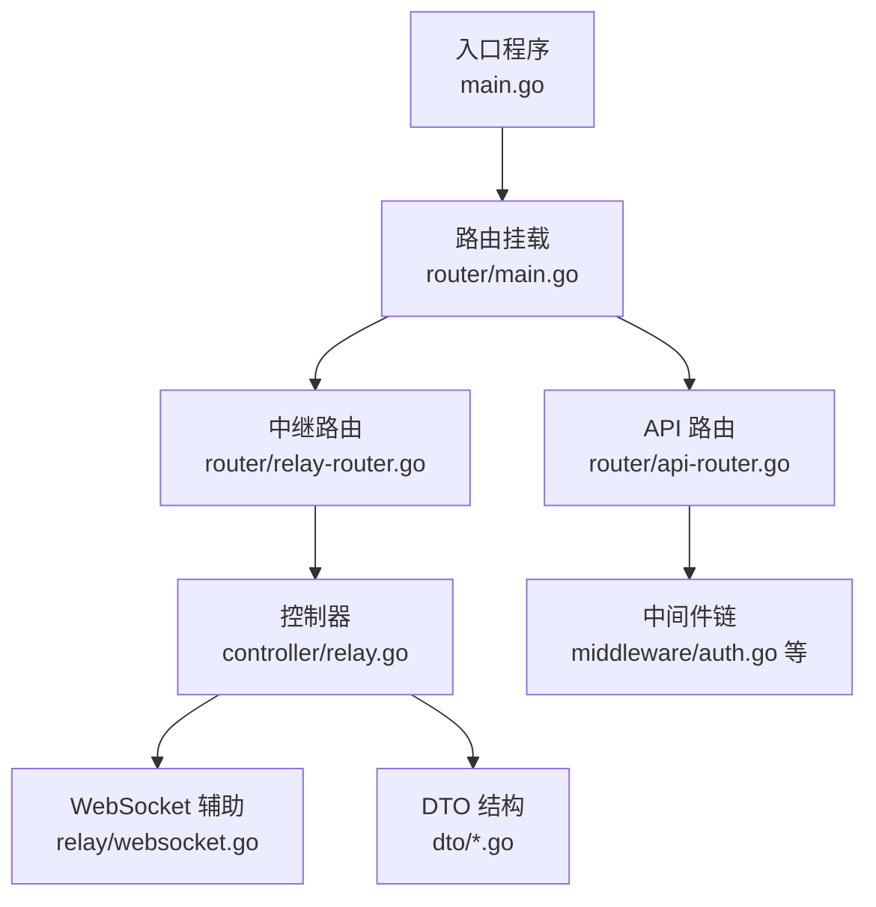
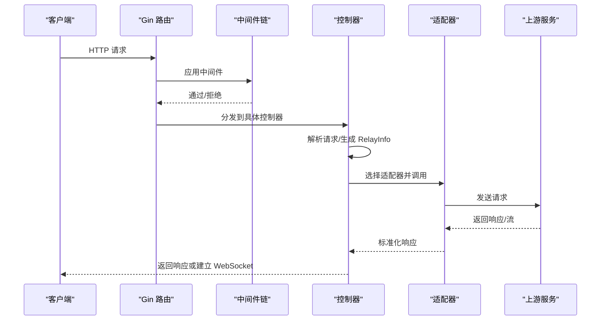
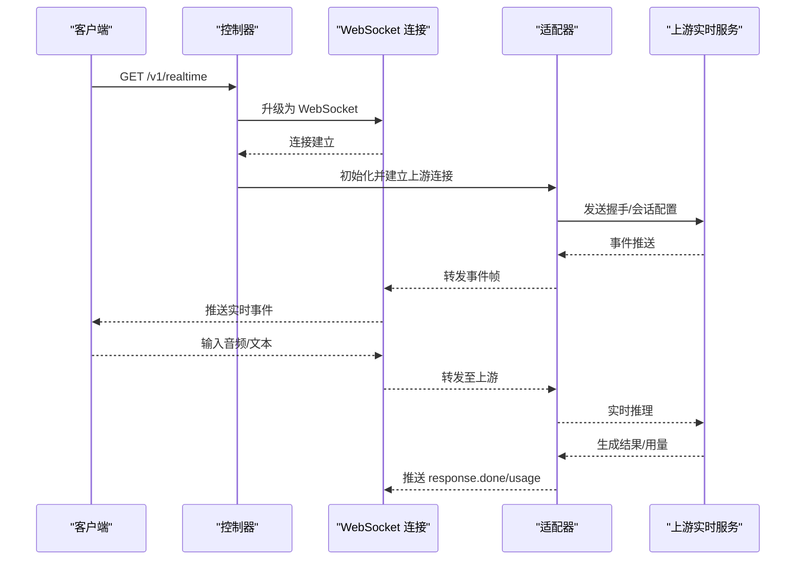
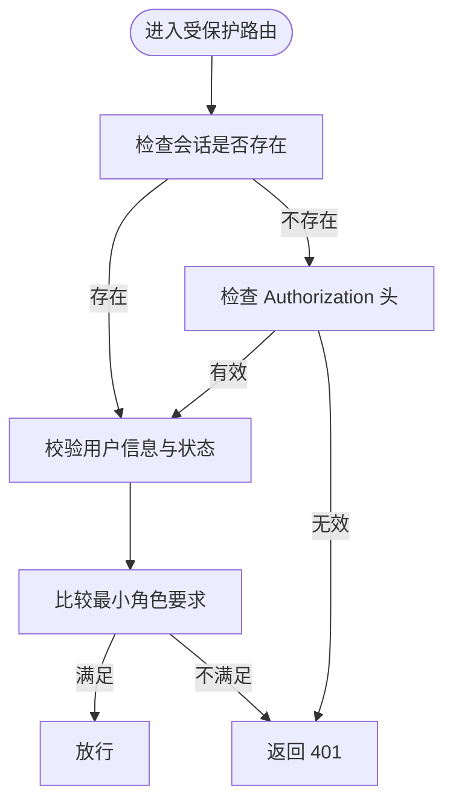
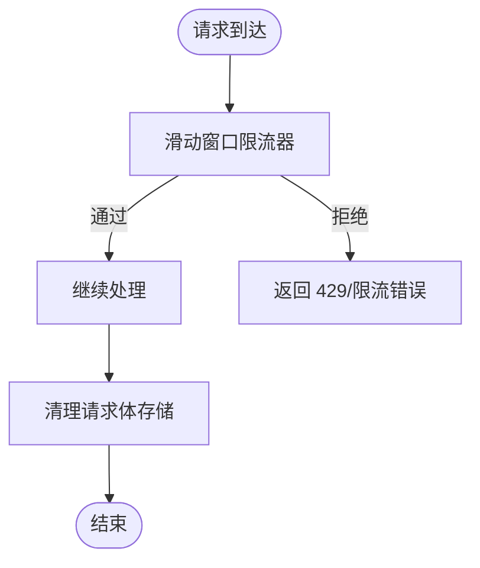
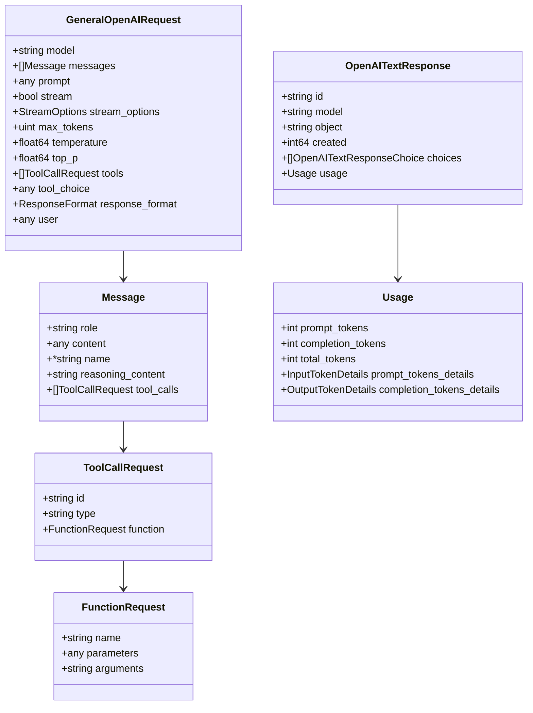
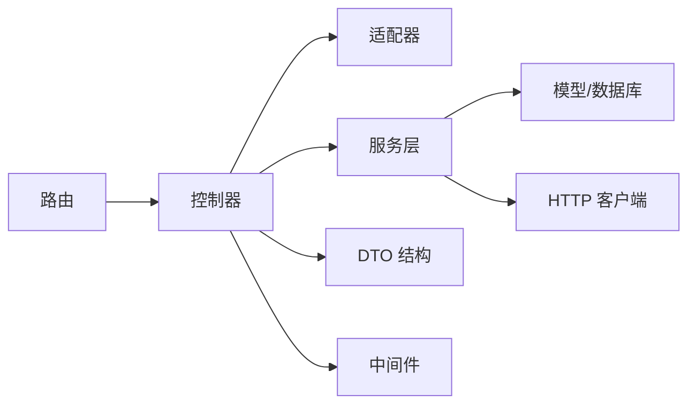

# API 参考文档

<cite>
**本文档引用的文件**
- [main.go](file://main.go)
- [router/main.go](file://router/main.go)
- [router/api-router.go](file://router/api-router.go)
- [router/relay-router.go](file://router/relay-router.go)
- [controller/relay.go](file://controller/relay.go)
- [relay/websocket.go](file://relay/websocket.go)
- [middleware/auth.go](file://middleware/auth.go)
- [common/rate-limit.go](file://common/rate-limit.go)
- [dto/openai_request.go](file://dto/openai_request.go)
- [dto/openai_response.go](file://dto/openai_response.go)
- [dto/error.go](file://dto/error.go)
- [dto/realtime.go](file://dto/realtime.go)
- [docs/openapi/api.json](file://docs/openapi/api.json)
</cite>

## 目录
1. [简介](#简介)
2. [项目结构](#项目结构)
3. [核心组件](#核心组件)
4. [架构总览](#架构总览)
5. [详细组件分析](#详细组件分析)
6. [依赖分析](#依赖分析)
7. [性能考虑](#性能考虑)
8. [故障排除指南](#故障排除指南)
9. [结论](#结论)
10. [附录](#附录)

## 简介
本参考文档面向 New API 的使用者与集成者，系统性梳理 REST API 与 WebSocket 接口、认证与限流机制、OpenAI 兼容层、实时通信协议与消息格式、错误码与响应规范、版本管理与迁移策略等。文档以代码为依据，结合路由与控制器实现，提供可操作的集成指南与最佳实践。

## 项目结构
New API 基于 Gin 框架构建，采用“路由分组 + 中间件 + 控制器 + 适配器”的分层设计：
- 入口程序负责初始化资源、数据库、缓存、国际化与路由挂载
- 路由模块划分 API、中继（Relay）、视频、Web 前端等子路由
- 控制器负责业务编排、鉴权、计费、渠道选择与上游调用
- DTO 定义请求/响应与错误结构，支持多厂商适配
- 中间件提供认证、速率限制、CORS、gzip、性能统计等横切能力

图表来源
- [main.go:43-199](file://main.go#L43-L199)
- [router/main.go:16-35](file://router/main.go#L16-L35)
- [router/api-router.go:14-380](file://router/api-router.go#L14-L380)
- [router/relay-router.go:13-225](file://router/relay-router.go#L13-L225)
- [controller/relay.go:67-200](file://controller/relay.go#L67-L200)
- [relay/websocket.go:15-47](file://relay/websocket.go#L15-L47)

章节来源
- [main.go:43-199](file://main.go#L43-L199)
- [router/main.go:16-35](file://router/main.go#L16-L35)

## 核心组件
- 路由与中间件
  - API 路由：系统状态、用户注册登录、订阅、渠道、令牌、日志、部署等
  - 中继路由：OpenAI/Gemini/Claude 等兼容接口，统一到 /v1 与 /v1beta
  - 中间件：CORS、gzip、请求体清理、全局/模型级速率限制、性能检查、鉴权等
- 控制器与适配器
  - Relay 控制器：根据请求格式选择适配器，执行上游调用，处理流式与非流式响应
  - WebSocket 辅助：建立与上游的 WebSocket 连接，转发二进制帧与事件
- DTO 与错误处理
  - 统一的 OpenAI 兼容请求/响应结构，支持流式增量与工具调用
  - 错误结构抽象，便于映射到标准 OpenAI 错误格式

章节来源
- [router/api-router.go:14-380](file://router/api-router.go#L14-L380)
- [router/relay-router.go:13-225](file://router/relay-router.go#L13-L225)
- [controller/relay.go:67-200](file://controller/relay.go#L67-L200)
- [dto/openai_request.go:29-109](file://dto/openai_request.go#L29-L109)
- [dto/openai_response.go:39-47](file://dto/openai_response.go#L39-L47)
- [dto/error.go:17-39](file://dto/error.go#L17-L39)

## 架构总览
New API 的请求处理链路如下：
- 客户端请求到达 Gin 路由
- 中间件按序执行（CORS、gzip、鉴权、速率限制、性能检查）
- 控制器解析请求、生成 RelayInfo、选择渠道与适配器
- 适配器调用上游服务，返回结果或建立 WebSocket 通道
- 控制器处理计费、错误映射与响应返回

图表来源
- [router/relay-router.go:67-166](file://router/relay-router.go#L67-L166)
- [controller/relay.go:108-200](file://controller/relay.go#L108-L200)
- [relay/websocket.go:15-47](file://relay/websocket.go#L15-L47)

## 详细组件分析

### REST API 端点总览
- 系统与公共信息
  - GET /api/status, /api/uptime/status, /api/about, /api/home_page_content, /api/pricing, /api/models
  - GET /api/notice, /api/user-agreement, /api/privacy-policy
- 用户与认证
  - GET /api/verification, /api/reset_password, POST /api/user/reset
  - POST /api/user/register, POST /api/user/login, POST /api/user/login/2fa
  - POST /api/user/passkey/login/begin, POST /api/user/passkey/login/finish
  - GET /api/user/logout
  - POST /api/oauth/:provider, GET /api/oauth/wechat, POST /api/oauth/wechat/bind, GET /api/oauth/telegram/login, GET /api/oauth/telegram/bind
- 用户中心
  - GET /api/user/self, PUT /api/user/self, DELETE /api/user/self
  - GET /api/user/token, GET /api/user/topup/self, POST /api/user/topup, POST /api/user/pay
  - GET /api/user/2fa/status, POST /api/user/2fa/setup, POST /api/user/2fa/enable, POST /api/user/2fa/disable, POST /api/user/2fa/backup_codes
  - GET /api/user/checkin, POST /api/user/checkin
  - GET /api/user/oauth/bindings, DELETE /api/user/oauth/bindings/:provider_id
- 订阅与支付
  - GET /api/subscription/plans, GET /api/subscription/self, PUT /api/subscription/self/preference
  - POST /api/subscription/epay/pay, POST /api/subscription/stripe/pay, POST /api/subscription/creem/pay
  - POST /api/subscription/epay/notify, GET /api/subscription/epay/notify, GET /api/subscription/epay/return
- 管理与运维
  - GET /api/option/, PUT /api/option/, POST /api/ratio_sync/fetch, GET /api/channel/models_enabled
  - GET /api/channel/test, GET /api/channel/update_balance, POST /api/channel/batch/tag
  - GET /api/token/search, POST /api/token/batch/keys
  - GET /api/log/self, GET /api/log/self/search, GET /api/data/self
  - GET /api/deployments/settings, POST /api/deployments/price-estimation, GET /api/deployments/check-name
- 第三方回调
  - POST /api/stripe/webhook, POST /api/creem/webhook, POST /api/waffo/webhook

章节来源
- [router/api-router.go:14-380](file://router/api-router.go#L14-L380)

### 中继路由与 OpenAI 兼容接口
- 模型查询
  - GET /v1/models, GET /v1/models/:model
  - GET /v1beta/models, GET /v1beta/openai/models
- 文本补全与聊天
  - POST /v1/completions, POST /v1/chat/completions
- 响应流式接口
  - POST /v1/responses, POST /v1/responses/compact
- 图像相关
  - POST /v1/edits, POST /v1/images/generations, POST /v1/images/edits
- 嵌入向量
  - POST /v1/embeddings
- 音频
  - POST /v1/audio/transcriptions, POST /v1/audio/translations, POST /v1/audio/speech
- 重排
  - POST /v1/rerank
- Gemini 兼容
  - POST /v1beta/models/*path
- Claude 兼容
  - POST /v1/messages
- 未实现端点（占位）
  - 文件、微调、模型删除等

章节来源
- [router/relay-router.go:19-201](file://router/relay-router.go#L19-L201)

### WebSocket 接口与实时通信
- 路由
  - GET /v1/realtime 建立 WebSocket 连接
- 协议与消息
  - 事件类型：error, session.update, conversation.item.create, response.create, input_audio_buffer.append, response.done 等
  - 消息结构：event_id, type, session, item, response, delta, audio 等
- 处理流程
  - 控制器升级连接，交由适配器与上游交互
  - 适配器负责读写二进制帧，转发事件与用量统计

图表来源
- [router/relay-router.go:76-81](file://router/relay-router.go#L76-L81)
- [controller/relay.go:78-106](file://controller/relay.go#L78-L106)
- [relay/websocket.go:15-47](file://relay/websocket.go#L15-L47)
- [dto/realtime.go:24-89](file://dto/realtime.go#L24-L89)

章节来源
- [router/relay-router.go:76-81](file://router/relay-router.go#L76-L81)
- [dto/realtime.go:24-89](file://dto/realtime.go#L24-L89)

### 认证与授权
- 会话认证（Cookie）
  - 登录后在 Cookie 中保存用户名、角色、ID、状态等
- 访问令牌（Authorization）
  - 支持 Bearer 令牌校验，校验失败返回相应错误
- 用户头（New-Api-User）
  - 必须提供，且与当前会话/令牌中的用户 ID 匹配
- 权限等级
  - 普通用户、管理员、根用户（系统设置）

图表来源
- [middleware/auth.go:36-157](file://middleware/auth.go#L36-L157)

章节来源
- [middleware/auth.go:36-157](file://middleware/auth.go#L36-L157)

### 速率限制与限流策略
- 全局/模型级限流
  - 全局 API 速率限制、模型请求速率限制、搜索/验证等专项限流
- 内存限流器
  - 基于滑动窗口的内存限流器，支持过期清理
- 压缩与清理
  - gzip 压缩、请求体存储清理，避免内存泄漏

图表来源
- [common/rate-limit.go:8-71](file://common/rate-limit.go#L8-L71)

章节来源
- [common/rate-limit.go:8-71](file://common/rate-limit.go#L8-L71)

### 请求与响应规范
- 请求体
  - 通用 OpenAI 兼容结构，支持消息数组、工具调用、流式选项、响应格式等
  - 支持多模态输入（文本、图片、音频、视频、文件）
- 响应体
  - 文本补全/聊天：choices、usage、finish_reason
  - 流式：增量 delta、工具调用、结束标记
  - 嵌入向量：对象、索引、嵌入向量
  - 响应流式（OpenAI Responses）：输出项、推理摘要、工具调用参数
- 错误
  - 统一映射为 OpenAI 标准错误结构，包含 type、message、param、code

图表来源
- [dto/openai_request.go:29-109](file://dto/openai_request.go#L29-L109)
- [dto/openai_request.go:277-460](file://dto/openai_request.go#L277-L460)
- [dto/openai_response.go:39-47](file://dto/openai_response.go#L39-L47)
- [dto/openai_response.go:222-242](file://dto/openai_response.go#L222-L242)

章节来源
- [dto/openai_request.go:29-109](file://dto/openai_request.go#L29-L109)
- [dto/openai_response.go:39-47](file://dto/openai_response.go#L39-L47)
- [dto/error.go:17-39](file://dto/error.go#L17-L39)

### 错误码与错误处理
- 错误映射
  - 将内部错误标准化为 OpenAI 错误结构，便于前端与 SDK 一致处理
- 响应结构
  - 支持多种错误字段（error、message、msg、err、error_msg、detail 等），自动提取可用消息
- WebSocket 错误
  - 通过 error 事件推送，包含 OpenAI 标准错误字段

章节来源
- [dto/error.go:41-94](file://dto/error.go#L41-L94)
- [dto/openai_response.go:392-431](file://dto/openai_response.go#L392-L431)

### OpenAI 兼容与第三方集成
- 兼容范围
  - /v1/chat/completions、/v1/completions、/v1/responses、/v1/embeddings、/v1/audio/*、/v1beta/models/*
- 第三方适配
  - 通过适配器模式对接多家厂商（如 Claude、Gemini、阿里、百度、AWS 等），统一请求/响应格式
- 实时接口
  - /v1/realtime 与上游实时协议互通，支持事件驱动的消息流

章节来源
- [router/relay-router.go:19-201](file://router/relay-router.go#L19-L201)
- [controller/relay.go:34-55](file://controller/relay.go#L34-L55)

### 自定义 API 扩展与 SDK 使用
- 扩展建议
  - 在 router/api-router.go 中新增路由，使用现有中间件链（鉴权、限流、CORS）
  - 在 controller 层实现业务逻辑，复用 DTO 与错误处理
- SDK 使用
  - 建议遵循 OpenAI 兼容请求结构，使用 Authorization 头传递访问令牌
  - 对于流式响应，建议使用 SSE 或 WebSocket（/v1/realtime）以获得更好的实时体验

章节来源
- [router/api-router.go:14-380](file://router/api-router.go#L14-L380)
- [dto/openai_request.go:29-109](file://dto/openai_request.go#L29-L109)

### 版本管理、向后兼容与迁移
- 版本策略
  - 通过路由前缀区分版本（/v1、/v1beta），保持向后兼容
- 迁移指南
  - 新增端点优先在新路由下实现，避免破坏既有行为
  - 对于变更较大的接口，提供过渡期并在文档中标注废弃时间线
- OpenAPI 规范
  - 提供 OpenAPI JSON 规范，便于自动化生成 SDK 与文档

章节来源
- [docs/openapi/api.json:1-800](file://docs/openapi/api.json#L1-L800)

## 依赖分析
- 组件耦合
  - 路由与控制器解耦，通过中间件注入上下文与鉴权信息
  - 控制器依赖适配器与服务层，服务层再依赖模型与外部 HTTP 客户端
- 外部依赖
  - Gin、gorilla/websocket、gopool、godotenv 等
- 循环依赖规避
  - 通过函数指针延迟绑定（如任务轮询适配器工厂）避免循环导入

图表来源
- [router/relay-router.go:67-166](file://router/relay-router.go#L67-L166)
- [controller/relay.go:108-200](file://controller/relay.go#L108-L200)

章节来源
- [router/relay-router.go:67-166](file://router/relay-router.go#L67-L166)
- [controller/relay.go:108-200](file://controller/relay.go#L108-L200)

## 性能考虑
- 压缩与传输
  - 默认启用 gzip 压缩，减少带宽占用
- 缓存与预取
  - 内存缓存与定时同步，降低数据库压力
- 并发与池化
  - 使用 gopool 并发执行后台任务，避免阻塞主请求
- 监控与分析
  - pprof 与系统监控，便于定位性能瓶颈

## 故障排除指南
- 常见错误与排查
  - 401 未授权：检查会话或访问令牌是否正确
  - 403 权限不足：确认用户角色是否满足路由要求
  - 429 限流：调整请求频率或联系管理员提升限额
  - 413 请求实体过大：减小请求体或调整服务器配置
  - WebSocket 连接失败：检查网络与上游实时服务可达性
- 日志与诊断
  - 使用 /api/log/self 与 /api/log/self/search 查看用户相关日志
  - 启用 pprof 与系统监控进行性能分析

章节来源
- [controller/relay.go:108-117](file://controller/relay.go#L108-L117)
- [router/api-router.go:284-292](file://router/api-router.go#L284-L292)

## 结论
New API 提供了完善的 REST 与 WebSocket 接口、统一的 OpenAI 兼容层、灵活的中间件体系与可扩展的适配器架构。通过明确的认证与限流策略、清晰的错误映射与日志体系，开发者可以快速集成并稳定运行。建议在生产环境中配合监控与压测，持续优化性能与稳定性。

## 附录
- 请求与响应示例
  - 文本补全请求与流式响应：参考通用 OpenAI 请求结构与流式响应结构
  - 嵌入向量请求与响应：参考嵌入向量请求与响应结构
  - 错误响应：参考统一错误映射与 OpenAI 错误结构
- 认证与限流示例
  - Authorization 头与 New-Api-User 头的使用
  - 模型级限流与全局限流的生效顺序
- OpenAPI 规范
  - 参考 docs/openapi/api.json 获取完整端点定义与参数说明

章节来源
- [dto/openai_request.go:29-109](file://dto/openai_request.go#L29-L109)
- [dto/openai_response.go:60-65](file://dto/openai_response.go#L60-L65)
- [dto/error.go:17-39](file://dto/error.go#L17-L39)
- [docs/openapi/api.json:1-800](file://docs/openapi/api.json#L1-L800)