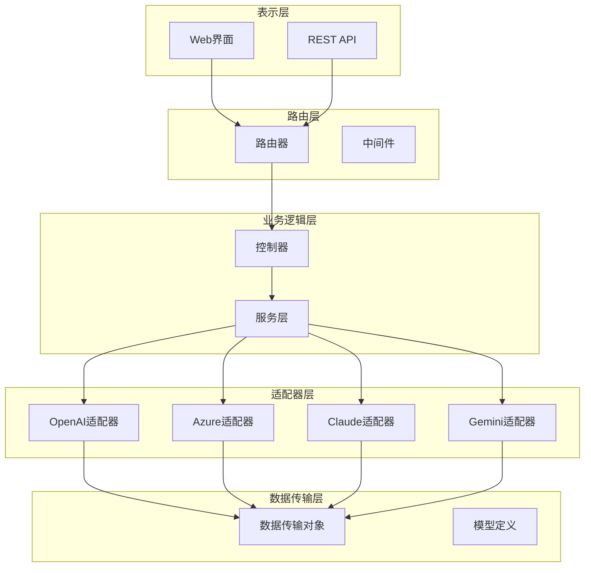
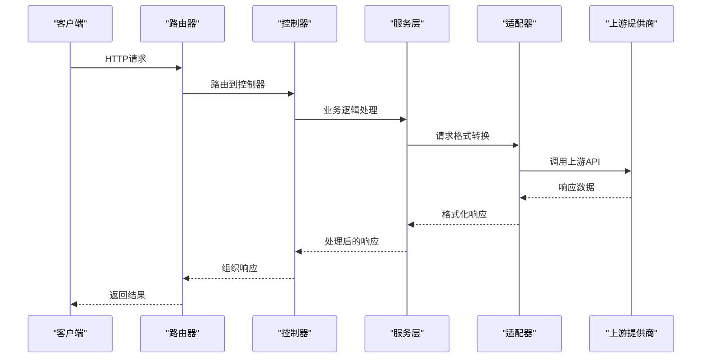
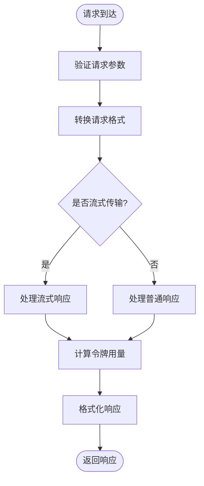
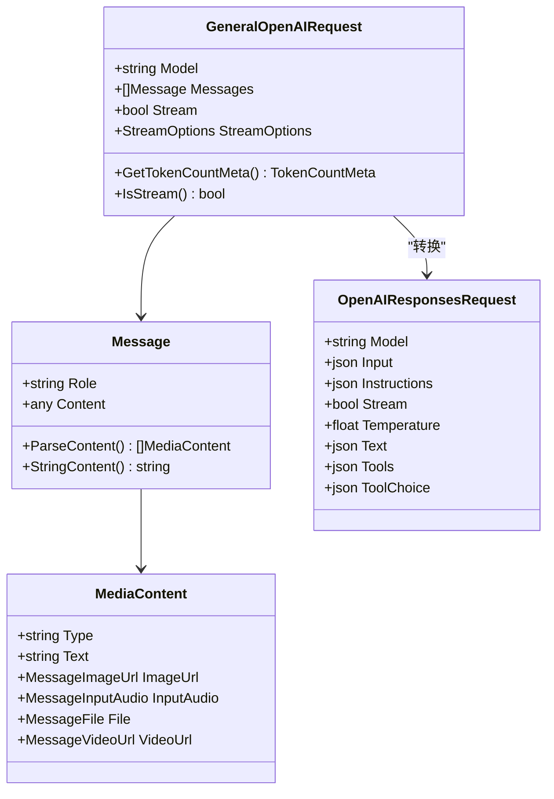
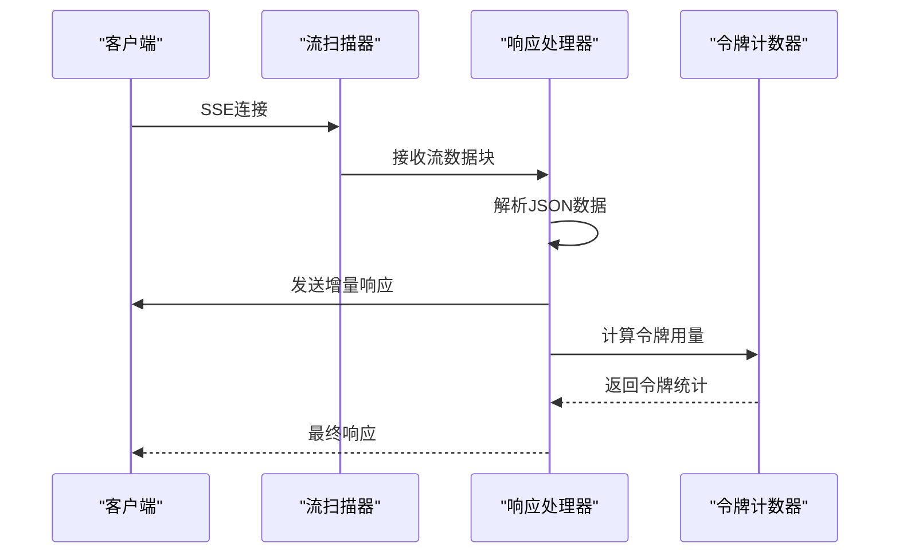
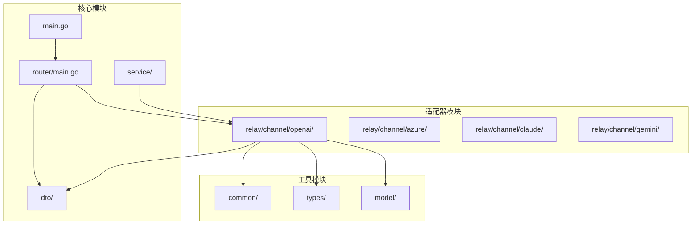

# OpenAI 兼容接口

<cite>
**本文档引用的文件**
- [main.go](file://main.go)
- [router/main.go](file://router/main.go)
- [router/api-router.go](file://router/api-router.go)
- [dto/openai_request.go](file://dto/openai_request.go)
- [dto/openai_response.go](file://dto/openai_response.go)
- [relay/channel/openai/adaptor.go](file://relay/channel/openai/adaptor.go)
- [relay/channel/openai/relay-openai.go](file://relay/channel/openai/relay-openai.go)
- [relay/chat_completions_via_responses.go](file://relay/chat_completions_via_responses.go)
- [service/openaicompat/chat_to_responses.go](file://service/openaicompat/chat_to_responses.go)
- [service/openaicompat/responses_to_chat.go](file://service/openaicompat/responses_to_chat.go)
</cite>

## 目录
1. [简介](#简介)
2. [项目结构](#项目结构)
3. [核心组件](#核心组件)
4. [架构概览](#架构概览)
5. [详细组件分析](#详细组件分析)
6. [依赖关系分析](#依赖关系分析)
7. [性能考虑](#性能考虑)
8. [故障排除指南](#故障排除指南)
9. [结论](#结论)

## 简介

New API 提供了完整的 OpenAI 兼容接口，支持 /v1/ 前缀下的多种 AI 模型服务。该系统实现了与 OpenAI API 的高度兼容性，包括聊天补全、嵌入向量、图像生成、音频处理等功能。

本项目采用模块化设计，通过适配器模式支持多种上游提供商，包括 OpenAI、Azure、Claude、Gemini 等。系统提供了灵活的请求转换机制，能够将 OpenAI 格式的请求转换为不同提供商所需的格式。

## 项目结构

项目采用分层架构设计，主要分为以下几个层次：

**图表来源**
- [main.go:43-199](file://main.go#L43-L199)
- [router/main.go:16-35](file://router/main.go#L16-L35)

**章节来源**
- [main.go:1-317](file://main.go#L1-L317)
- [router/main.go:1-36](file://router/main.go#L1-L36)

## 核心组件

### 数据传输对象 (DTO)

系统定义了完整的数据传输结构，支持 OpenAI 兼容的所有请求和响应格式：

- **GeneralOpenAIRequest**: 通用 OpenAI 请求结构，支持流式传输、工具调用、多模态内容
- **OpenAITextResponse**: 文本生成响应结构
- **ChatCompletionsStreamResponse**: 流式响应结构
- **Usage**: 计费使用统计结构

### 适配器模式

通过适配器模式实现对不同上游提供商的支持：

- **OpenAI 适配器**: 处理标准 OpenAI API
- **Azure 适配器**: 支持 Azure OpenAI 服务
- **Claude 适配器**: 兼容 Anthropic Claude API
- **Gemini 适配器**: 兼容 Google Gemini API

### 请求转换服务

提供请求格式转换功能，支持 OpenAI 到其他格式的双向转换。

**章节来源**
- [dto/openai_request.go:27-109](file://dto/openai_request.go#L27-L109)
- [dto/openai_response.go:39-47](file://dto/openai_response.go#L39-L47)
- [relay/channel/openai/adaptor.go:37-40](file://relay/channel/openai/adaptor.go#L37-L40)

## 架构概览

系统采用分层架构，通过中间件处理认证、限流、日志等功能，通过适配器模式实现对不同提供商的统一访问。

**图表来源**
- [router/api-router.go:14-380](file://router/api-router.go#L14-L380)
- [relay/channel/openai/adaptor.go:607-649](file://relay/channel/openai/adaptor.go#L607-L649)

## 详细组件分析

### OpenAI 请求处理流程

系统实现了完整的 OpenAI 兼容请求处理流程，包括请求验证、格式转换、流式处理等。

**图表来源**
- [relay/channel/openai/relay-openai.go:106-193](file://relay/channel/openai/relay-openai.go#L106-L193)
- [dto/openai_request.go:199-201](file://dto/openai_request.go#L199-L201)

### 请求格式转换机制

系统提供了强大的请求格式转换能力，支持 OpenAI 到其他格式的双向转换。

**图表来源**
- [dto/openai_request.go:27-109](file://dto/openai_request.go#L27-L109)
- [service/openaicompat/chat_to_responses.go:76-402](file://service/openaicompat/chat_to_responses.go#L76-L402)

### 流式响应处理

系统实现了高效的流式响应处理机制，支持实时数据传输和增量响应。

**图表来源**
- [relay/channel/openai/relay-openai.go:129-145](file://relay/channel/openai/relay-openai.go#L129-L145)
- [relay/channel/openai/relay-openai.go:25-104](file://relay/channel/openai/relay-openai.go#L25-L104)

**章节来源**
- [dto/openai_request.go:1-800](file://dto/openai_request.go#L1-L800)
- [dto/openai_response.go:1-432](file://dto/openai_response.go#L1-L432)
- [relay/channel/openai/relay-openai.go:1-719](file://relay/channel/openai/relay-openai.go#L1-L719)

### OpenAI 兼容接口实现

系统实现了以下 OpenAI 兼容接口：

#### 聊天补全接口
- **POST /v1/chat/completions**: 支持流式和非流式聊天补全
- **POST /v1/responses**: OpenAI Responses API 兼容接口

#### 嵌入向量接口
- **POST /v1/embeddings**: 生成文本嵌入向量

#### 图像生成接口
- **POST /v1/images/generations**: 生成图像
- **POST /v1/images/edits**: 图像编辑

#### 音频处理接口
- **POST /v1/audio/speech**: 文本转语音
- **POST /v1/audio/transcriptions**: 音频转录
- **POST /v1/audio/translations**: 音频翻译

**章节来源**
- [relay/channel/openai/adaptor.go:57-684](file://relay/channel/openai/adaptor.go#L57-L684)
- [relay/channel/openai/relay-openai.go:106-593](file://relay/channel/openai/relay-openai.go#L106-L593)

## 依赖关系分析

系统采用模块化设计，各组件之间依赖关系清晰：

**图表来源**
- [main.go:1-317](file://main.go#L1-L317)
- [router/main.go:1-36](file://router/main.go#L1-L36)

**章节来源**
- [main.go:1-317](file://main.go#L1-L317)
- [router/main.go:1-36](file://router/main.go#L1-L36)

## 性能考虑

系统在设计时充分考虑了性能优化：

### 缓存策略
- 内存缓存用于提升响应速度
- 磁盘缓存用于持久化数据
- Redis 缓存用于分布式场景

### 并发处理
- 使用 goroutine 实现并发处理
- 连接池管理减少连接开销
- 流式处理支持高并发场景

### 优化建议
1. 合理配置缓存参数
2. 使用连接池复用连接
3. 实施适当的超时控制
4. 监控系统性能指标

## 故障排除指南

### 常见问题及解决方案

#### 请求格式错误
- **症状**: 400 Bad Request
- **原因**: 请求参数不符合 OpenAI API 规范
- **解决**: 检查请求格式和必填参数

#### 认证失败
- **症状**: 401 Unauthorized
- **原因**: API 密钥无效或过期
- **解决**: 验证 API 密钥配置

#### 速率限制
- **症状**: 429 Too Many Requests
- **原因**: 超过 API 速率限制
- **解决**: 实施重试机制和退避算法

#### 上游服务不可用
- **症状**: 5xx 服务器错误
- **原因**: 上游提供商服务中断
- **解决**: 实施故障转移和降级策略

**章节来源**
- [relay/channel/openai/relay-openai.go:106-193](file://relay/channel/openai/relay-openai.go#L106-L193)

## 结论

New API 的 OpenAI 兼容接口提供了完整、高性能的 AI 服务集成方案。通过模块化设计和适配器模式，系统能够轻松支持多种上游提供商，同时保持与 OpenAI API 的高度兼容性。

系统的主要优势包括：
- 完整的 OpenAI API 兼容性
- 灵活的请求格式转换
- 高效的流式响应处理
- 完善的错误处理和重试机制
- 良好的性能表现和可扩展性

开发者可以基于此框架快速集成各种 AI 服务，实现无缝的 API 使用体验。