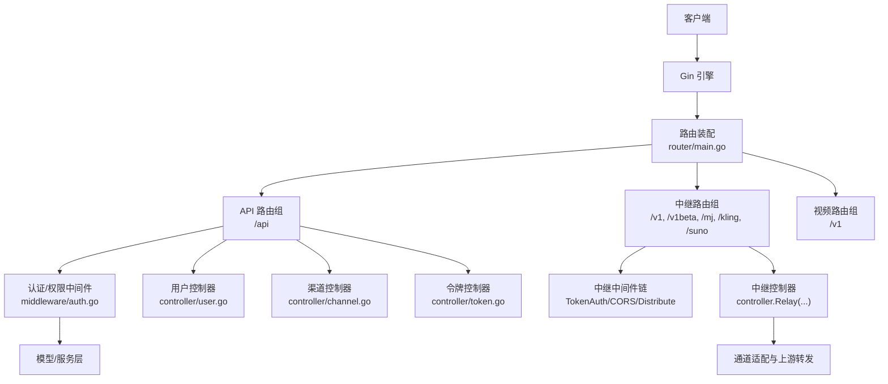
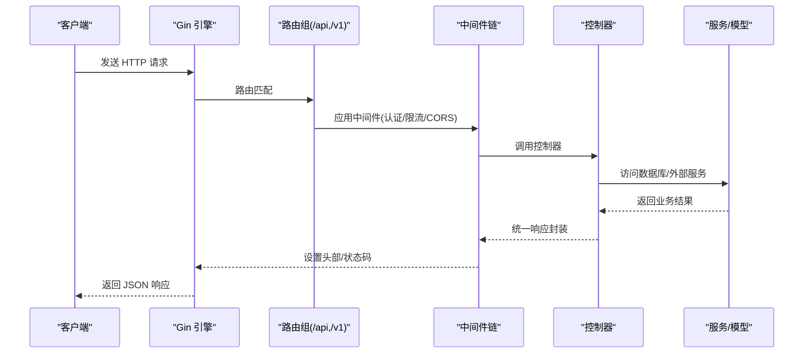
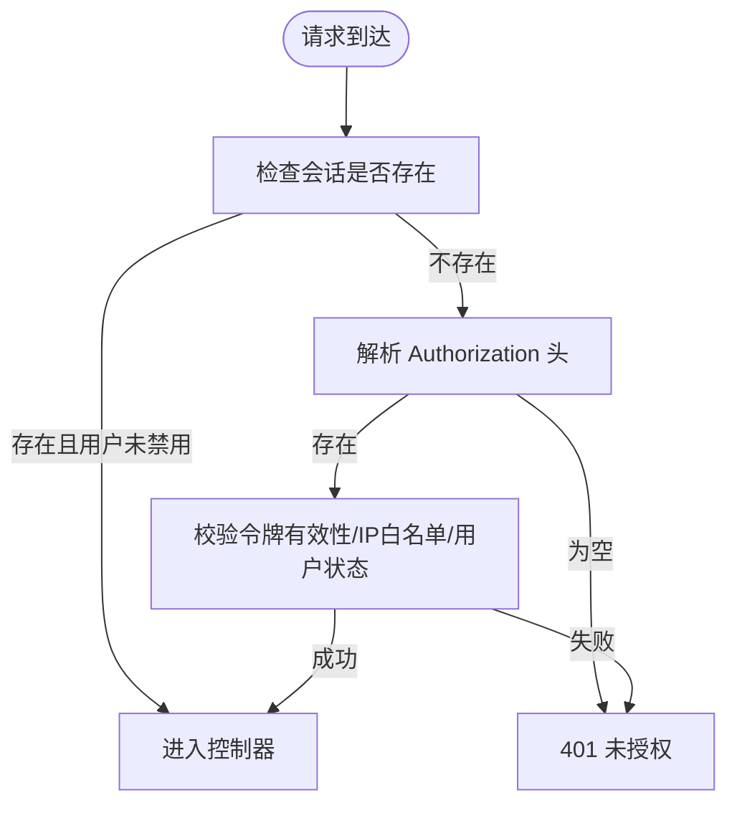
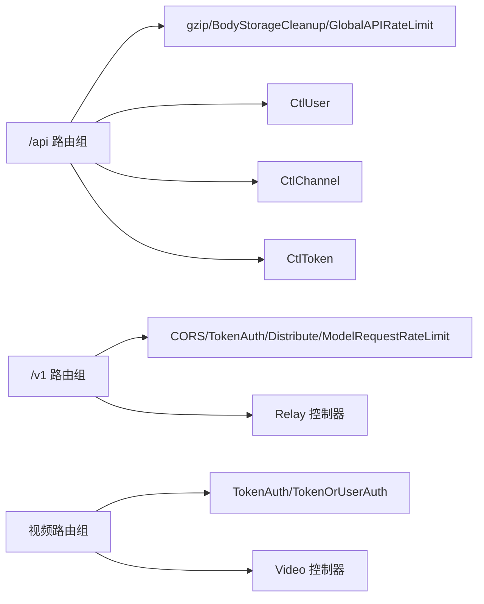

# REST API 接口

<cite>
**本文引用的文件**
- [main.go](file://main.go)
- [router/main.go](file://router/main.go)
- [router/api-router.go](file://router/api-router.go)
- [router/relay-router.go](file://router/relay-router.go)
- [router/video-router.go](file://router/video-router.go)
- [middleware/auth.go](file://middleware/auth.go)
- [middleware/rate-limit.go](file://middleware/rate-limit.go)
- [common/page_info.go](file://common/page_info.go)
- [common/endpoint_defaults.go](file://common/endpoint_defaults.go)
- [controller/user.go](file://controller/user.go)
- [controller/channel.go](file://controller/channel.go)
- [controller/token.go](file://controller/token.go)
- [dto/error.go](file://dto/error.go)
- [docs/openapi/api.json](file://docs/openapi/api.json)
- [docs/openapi/relay.json](file://docs/openapi/relay.json)
</cite>

## 目录
1. [简介](#简介)
2. [项目结构](#项目结构)
3. [核心组件](#核心组件)
4. [架构总览](#架构总览)
5. [详细组件分析](#详细组件分析)
6. [依赖分析](#依赖分析)
7. [性能考量](#性能考量)
8. [故障排查指南](#故障排查指南)
9. [结论](#结论)
10. [附录](#附录)

## 简介
本文件为 New API 的 REST API 接口参考文档，覆盖用户管理、系统管理、渠道管理、令牌管理、日志与数据统计、订阅与充值、模型与供应商管理、任务与部署等模块的完整接口规范。文档详细说明各端点的 HTTP 方法、URL 路径、请求参数、响应格式与状态码，并提供认证机制、权限要求、安全考虑、分页/过滤/排序等通用查询参数的使用方法，以及错误代码定义、错误处理策略与调试技巧，帮助开发者准确理解与使用所有 REST API。

## 项目结构
New API 基于 Gin 框架构建，采用“路由分组 + 中间件 + 控制器”的分层设计：
- 路由层：按功能域划分 API 路由组（如 /api、/v1、/mj、/kling 等），并在组内挂载统一中间件链。
- 中间件层：负责认证、速率限制、CORS、日志、国际化、请求体清理、性能监控等横切关注点。
- 控制器层：实现具体业务逻辑，封装数据访问与服务调用，输出统一的响应结构。
- 文档层：通过 OpenAPI JSON 提供系统与 AI 模型接口的完整契约。

图表来源
- [router/main.go:16-35](file://router/main.go#L16-L35)
- [router/api-router.go:14-379](file://router/api-router.go#L14-L379)
- [router/relay-router.go:13-200](file://router/relay-router.go#L13-L200)
- [router/video-router.go:10-53](file://router/video-router.go#L10-L53)
- [middleware/auth.go:36-440](file://middleware/auth.go#L36-L440)

章节来源
- [router/main.go:16-35](file://router/main.go#L16-L35)
- [router/api-router.go:14-379](file://router/api-router.go#L14-L379)
- [router/relay-router.go:13-200](file://router/relay-router.go#L13-L200)
- [router/video-router.go:10-53](file://router/video-router.go#L10-L53)

## 核心组件
- 路由装配：集中于 router/main.go，按需加载 API、中继、视频、仪表盘与 Web 路由。
- API 路由：集中于 router/api-router.go，覆盖系统、用户、订阅、渠道、令牌、日志、数据、模型、供应商、部署等模块。
- 中继路由：集中于 router/relay-router.go，提供 /v1、/v1beta、/mj、/kling、/suno 等多厂商兼容接口。
- 认证与权限：middleware/auth.go 提供 UserAuth/AdminAuth/RootAuth/TokenAuth 等中间件，支持会话与 API Key 双模式。
- 速率限制：middleware/rate-limit.go 提供全局、关键操作、下载/上传等多级限流。
- 分页与查询：common/page_info.go 统一分页参数解析；common/endpoint_defaults.go 提供默认端点映射。

章节来源
- [router/main.go:16-35](file://router/main.go#L16-L35)
- [router/api-router.go:14-379](file://router/api-router.go#L14-L379)
- [router/relay-router.go:13-200](file://router/relay-router.go#L13-L200)
- [middleware/auth.go:36-440](file://middleware/auth.go#L36-L440)
- [middleware/rate-limit.go:1-151](file://middleware/rate-limit.go#L1-L151)
- [common/page_info.go:41-82](file://common/page_info.go#L41-L82)
- [common/endpoint_defaults.go:19-34](file://common/endpoint_defaults.go#L19-L34)

## 架构总览
New API 的请求处理链路如下：
- 客户端请求进入 Gin 引擎。
- 根据路由组匹配到对应子路由（/api、/v1 等）。
- 应用中间件链：CORS、gzip、BodyStorageCleanup、GlobalAPIRateLimit、TokenAuth/UserAuth/AdminAuth 等。
- 进入控制器处理业务逻辑，调用模型与服务层。
- 统一响应封装，返回 JSON 结果。

图表来源
- [router/api-router.go:14-379](file://router/api-router.go#L14-L379)
- [router/relay-router.go:13-200](file://router/relay-router.go#L13-L200)
- [middleware/auth.go:36-440](file://middleware/auth.go#L36-L440)
- [middleware/rate-limit.go:1-151](file://middleware/rate-limit.go#L1-151)

## 详细组件分析

### 认证与权限机制
- 会话认证（Dashboard 登录）：通过 Cookie Session 存储用户身份，配合 UserAuth/AdminAuth/RootAuth 中间件校验角色。
- API Key 认证（API 客户端）：通过 Authorization 头传递 Bearer Token，TokenAuth 中间件解析并校验令牌有效性、IP 白名单、用户状态与分组限制。
- 令牌只读认证：TokenAuthReadOnly 放宽限制，仅校验令牌存在性与用户封禁状态，常用于查询类接口。
- 通用校验：中间件还会校验 New-Api-User 头与用户信息有效性，防止跨用户访问。

图表来源
- [middleware/auth.go:36-157](file://middleware/auth.go#L36-L157)
- [middleware/auth.go:214-274](file://middleware/auth.go#L214-L274)
- [middleware/auth.go:276-407](file://middleware/auth.go#L276-L407)

章节来源
- [middleware/auth.go:36-157](file://middleware/auth.go#L36-L157)
- [middleware/auth.go:214-274](file://middleware/auth.go#L214-L274)
- [middleware/auth.go:276-407](file://middleware/auth.go#L276-L407)

### 速率限制与安全
- 全局 API 限流：GlobalAPIRateLimit，基于 Redis 或内存实现滑动窗口。
- 关键操作限流：CriticalRateLimit，针对注册、验证码、重置密码等敏感操作。
- 用户级限流：userRateLimitFactory，基于用户 ID 的防代理轮换攻击。
- 下载/上传限流：DownloadRateLimit、UploadRateLimit。
- 中继路由：TokenAuth + ModelRequestRateLimit + Distribute，结合上游厂商限流策略。

章节来源
- [middleware/rate-limit.go:1-151](file://middleware/rate-limit.go#L1-L151)
- [router/relay-router.go:69-166](file://router/relay-router.go#L69-L166)

### 通用查询参数（分页/过滤/排序）
- 分页参数：p/page、page_size、ps、size，默认 page=1，page_size=默认值，最大 100。
- 过滤参数：各控制器按需支持 status、type、tag_mode、id_sort 等。
- 排序参数：部分接口支持 id_sort 等排序开关。
- 示例：分页解析逻辑见 common/page_info.go。

章节来源
- [common/page_info.go:41-82](file://common/page_info.go#L41-L82)
- [controller/channel.go:71-174](file://controller/channel.go#L71-L174)

### 错误处理与响应格式
- 统一错误结构：dto/error.go 定义了通用错误响应与 OpenAI 风格错误转换。
- OpenAI 风格错误：TokenAuth 在认证失败时返回标准 OpenAI 错误结构。
- 国际化消息：中间件与控制器广泛使用 i18n 消息，响应中包含本地化文案。

章节来源
- [dto/error.go:17-94](file://dto/error.go#L17-L94)
- [middleware/auth.go:339-348](file://middleware/auth.go#L339-L348)

### 系统与用户管理接口
- 系统状态与公告：/api/status、/api/uptime/status、/api/notice、/api/about、/api/home_page_content、/api/user-agreement、/api/privacy-policy。
- 初始化与状态：/api/setup(GET/POST)、/api/status(GET)、/api/status/test(GET)。
- 定价与倍率：/api/pricing(GET)、/api/ratio_config(GET)。
- 验证与重置：/api/verification(GET)、/api/reset_password(GET)、/api/user/reset(POST)。
- OAuth：/api/oauth/state(GET)、/api/oauth/wechat(GET/POST)、/api/oauth/telegram/login(GET/POST)、/api/oauth/:provider(GET)。
- 用户注册与登录：/api/user/register(POST)、/api/user/login(POST)、/api/user/login/2fa(POST)、/api/user/logout(GET)、/api/user/passkey/login/begin/finish(POST)。
- 用户自服务：/api/user/self(GET/PUT/DELETE)、/api/user/token(GET)、/api/user/groups(GET)、/api/user/topup/*、/api/user/stripe/*、/api/user/creem/*、/api/user/waffo/*。
- 管理员接口：/api/user(GET/POST/PUT/DELETE)、/api/user/search(GET)、/api/user/:id/oauth/bindings/*、/api/user/:id/*。

章节来源
- [router/api-router.go:21-51](file://router/api-router.go#L21-L51)
- [router/api-router.go:56-134](file://router/api-router.go#L56-L134)
- [router/api-router.go:136-161](file://router/api-router.go#L136-L161)
- [controller/user.go:32-117](file://controller/user.go#L32-L117)

### 渠道管理接口
- 列表与搜索：/api/channel(GET)、/api/channel/search(GET)、/api/channel/models(GET/Enabled)。
- 详情与操作：/api/channel/:id(GET/PUT/DELETE)、/api/channel/:id/key(POST)、/api/channel/test(GET/ID)、/api/channel/update_balance(GET/ID)。
- 批量与标签：/api/channel/batch(POST)、/api/channel/batch/tag(POST)、/api/channel/tag/disabled(POST)、/api/channel/tag/enabled(POST)、/api/channel/tag(models)。
- 模型同步：/api/channel/fetch_models/:id(GET)、/api/channel/fetch_models(POST)。
- Ollama：/api/channel/ollama/pull(POST)、/api/channel/ollama/pull/stream(POST)、/api/channel/ollama/delete(DELETE)、/api/channel/ollama/version/:id(GET)。
- 多 Key 管理：/api/channel/multi_key/manage(POST)。
- 上游更新：/api/channel/upstream_updates/detect(POST)、/api/channel/upstream_updates/apply(POST)、/api/channel/upstream_updates/detect_all(POST)、/api/channel/upstream_updates/apply_all(POST)。

章节来源
- [router/api-router.go:206-248](file://router/api-router.go#L206-L248)
- [controller/channel.go:71-174](file://controller/channel.go#L71-L174)

### 令牌管理接口
- 列表与搜索：/api/token(GET)、/api/token/search(GET)。
- 详情与密钥：/api/token/:id(GET)、/api/token/:id/key(POST)、/api/token/:id/keys(POST)。
- 新增/修改/删除：/api/token/(POST/PUT/DELETE)、/api/token/batch(POST)。
- 使用统计：/api/usage/token(GET)、/api/usage/token/self(GET)。

章节来源
- [router/api-router.go:249-261](file://router/api-router.go#L249-L261)
- [controller/token.go:34-165](file://controller/token.go#L34-L165)

### 日志与数据统计接口
- 管理员日志：/api/log(GET/DELETE/GET/stat/GET/self/stat/GET/search)。
- 自服务日志：/api/log/self(GET)、/api/log/self/search(GET)。
- 数据统计：/api/data(GET/users/self)。
- 渠道亲和度缓存：/api/log/channel_affinity_usage_cache(GET)。

章节来源
- [router/api-router.go:284-302](file://router/api-router.go#L284-L302)

### 订阅与充值接口
- 用户订阅：/api/subscription(GET/PUT/POST)、/api/subscription/epay/*、/api/subscription/stripe/*、/api/subscription/creem/*。
- 管理员订阅：/api/subscription/admin(GET/POST/PUT/PATCH/POST)、/api/subscription/admin/users/:id/subscriptions/*。
- 订阅回调：/api/subscription/epay/notify(GET/POST)、/api/subscription/epay/return(GET/POST)。

章节来源
- [router/api-router.go:136-167](file://router/api-router.go#L136-L167)

### 模型与供应商管理接口
- 模型元数据：/api/models(GET/GET/search/:id/POST/PUT/DELETE)、/api/models/sync_upstream*(POST)。
- 供应商：/api/vendors(GET/GET/search/:id/POST/PUT/DELETE)。
- 缺失模型：/api/models/missing(GET)。

章节来源
- [router/api-router.go:339-351](file://router/api-router.go#L339-L351)

### 系统设置与性能接口
- 系统设置：/api/option(GET/PUT/POST/DELETE)。
- 自定义 OAuth 提供商：/api/custom-oauth-provider(GET/GET/:id/POST/PUT/DELETE)。
- 性能：/api/performance(GET/DELETE/POST/POST/DELETE)。
- 倍率同步：/api/ratio_sync(GET/POST)。

章节来源
- [router/api-router.go:168-205](file://router/api-router.go#L168-L205)

### 模型部署管理接口
- 设置与连接测试：/api/deployments/settings(GET/POST)。
- 列表与搜索：/api/deployments(GET/GET/search)。
- 硬件与位置：/api/deployments/hardware-types(GET)、/api/deployments/locations(GET)、/api/deployments/available-replicas(GET)、/api/deployments/price-estimation(POST)、/api/deployments/check-name(GET)。
- 创建/更新/删除：/api/deployments/(POST/GET/:id/PUT/DELETE)。
- 日志与容器：/api/deployments/:id/logs(GET)、/api/deployments/:id/containers(GET)、/api/deployments/:id/containers/:container_id(GET)。

章节来源
- [router/api-router.go:354-377](file://router/api-router.go#L354-L377)

### 中继与 AI 模型接口
- 模型列表与检索：/v1/models(GET)、/v1beta/models(GET)、/v1beta/openai/models(GET)。
- 对话与响应：/v1/chat/completions(POST)、/v1/completions(POST)、/v1/responses(POST)、/v1/responses/compact(POST)。
- 图像生成：/v1/images/generations(POST)、/v1/images/edits(POST)。
- 嵌入与音频：/v1/embeddings(POST)、/v1/audio/transcriptions(POST)、/v1/audio/translations(POST)、/v1/audio/speech(POST)。
- 重排序与审核：/v1/rerank(POST)、/v1/moderations(POST)。
- Gemini：/v1beta/models/*(POST)、/v1/models/*(POST)。
- Claude：/v1/messages(POST)。
- 实时：/v1/realtime(GET)。
- 未实现：/v1/images/variations、/v1/files、/v1/fine-tunes 等。

章节来源
- [router/relay-router.go:19-200](file://router/relay-router.go#L19-L200)
- [docs/openapi/relay.json:74-781](file://docs/openapi/relay.json#L74-L781)

### 视频生成与代理接口
- 视频任务：/v1/videos(POST)、/v1/videos/:task_id(GET)。
- 内容获取：/v1/videos/:task_id/content(GET)。
- OpenAI 兼容：/v1/videos(POST)、/v1/videos/:task_id(GET)。
- Kling：/kling/v1/videos/text2video(POST)、/kling/v1/videos/image2video(POST)、/kling/v1/videos/*/GET。
- 即梦官方：/jimeng/(POST)。

章节来源
- [router/video-router.go:10-53](file://router/video-router.go#L10-L53)
- [docs/openapi/relay.json:546-781](file://docs/openapi/relay.json#L546-L781)

## 依赖分析
- 路由装配依赖：router/main.go 动态加载各子路由组。
- 中间件依赖：API 路由组统一挂载 gzip、BodyStorageCleanup、GlobalAPIRateLimit；中继路由组统一挂载 CORS、TokenAuth、Distribute、ModelRequestRateLimit。
- 控制器依赖：控制器通过 model 层访问数据库，通过 service 层调用外部服务或业务逻辑。
- 文档依赖：OpenAPI JSON 文件提供契约与示例，便于生成 SDK 与文档。

图表来源
- [router/api-router.go:14-379](file://router/api-router.go#L14-L379)
- [router/relay-router.go:13-200](file://router/relay-router.go#L13-L200)
- [router/video-router.go:10-53](file://router/video-router.go#L10-L53)

章节来源
- [router/api-router.go:14-379](file://router/api-router.go#L14-L379)
- [router/relay-router.go:13-200](file://router/relay-router.go#L13-L200)
- [router/video-router.go:10-53](file://router/video-router.go#L10-L53)

## 性能考量
- 中继路由组应用 SystemPerformanceCheck，避免系统过载。
- TokenAuth 中间件支持分组与跨组重试策略，结合 Ratelimit 与 Distribute 实现负载均衡。
- gzip 压缩与 BodyStorageCleanup 减少带宽与内存占用。
- Redis/内存限流策略可按需切换，建议生产环境启用 Redis 限流。

## 故障排查指南
- 认证失败：检查 Authorization 头格式、Bearer Token 是否正确；确认用户状态未被封禁；核对 New-Api-User 头与用户信息一致性。
- 429 限流：查看全局/关键操作/用户级限流配置，必要时调整阈值或升级配额。
- OpenAI 风格错误：参考 dto/error.go 的错误结构，定位上游返回或内部校验问题。
- 日志定位：使用 /api/log/* 与 /api/log/self/* 查询日志，结合 /api/log/search 与 /api/log/self/search 进行过滤。
- 性能问题：通过 /api/performance/stats 与 /api/performance/logs 查看系统指标与日志文件。

章节来源
- [dto/error.go:17-94](file://dto/error.go#L17-L94)
- [middleware/auth.go:339-348](file://middleware/auth.go#L339-L348)
- [middleware/rate-limit.go:1-151](file://middleware/rate-limit.go#L1-L151)
- [router/api-router.go:284-302](file://router/api-router.go#L284-L302)

## 结论
本参考文档系统梳理了 New API 的 REST API 接口规范，涵盖认证、权限、限流、分页、过滤、排序、错误处理与调试等关键主题。结合 OpenAPI JSON 契约与控制器实现，开发者可快速集成与扩展各模块接口，确保在安全性与性能之间取得平衡。

## 附录
- OpenAPI 契约
  - 系统与用户接口契约：[docs/openapi/api.json](file://docs/openapi/api.json)
  - AI 模型接口契约：[docs/openapi/relay.json](file://docs/openapi/relay.json)
- 默认端点映射
  - 端点类型到路径与方法的映射：[common/endpoint_defaults.go:19-34](file://common/endpoint_defaults.go#L19-L34)