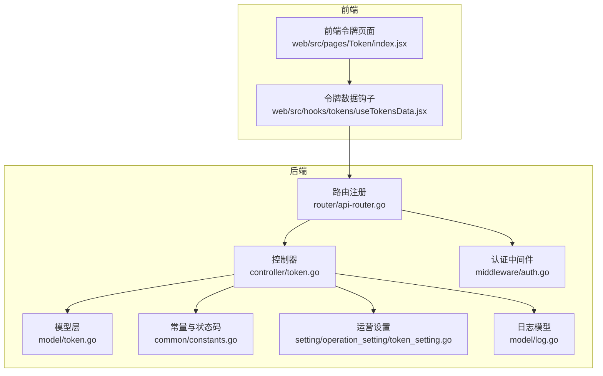
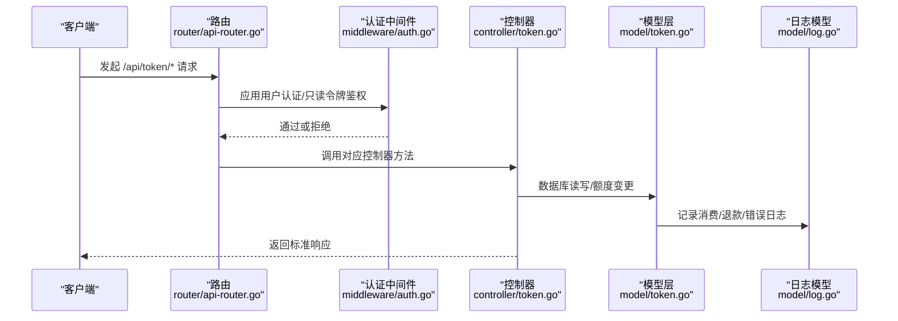
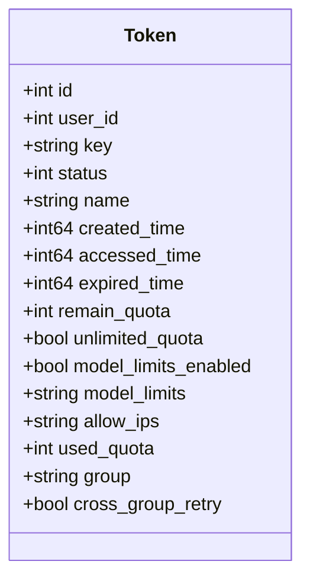
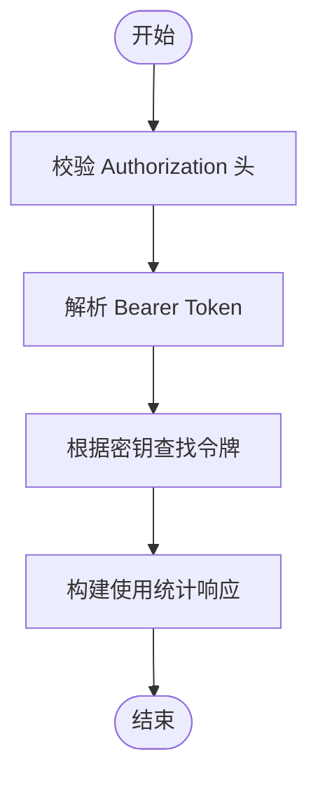
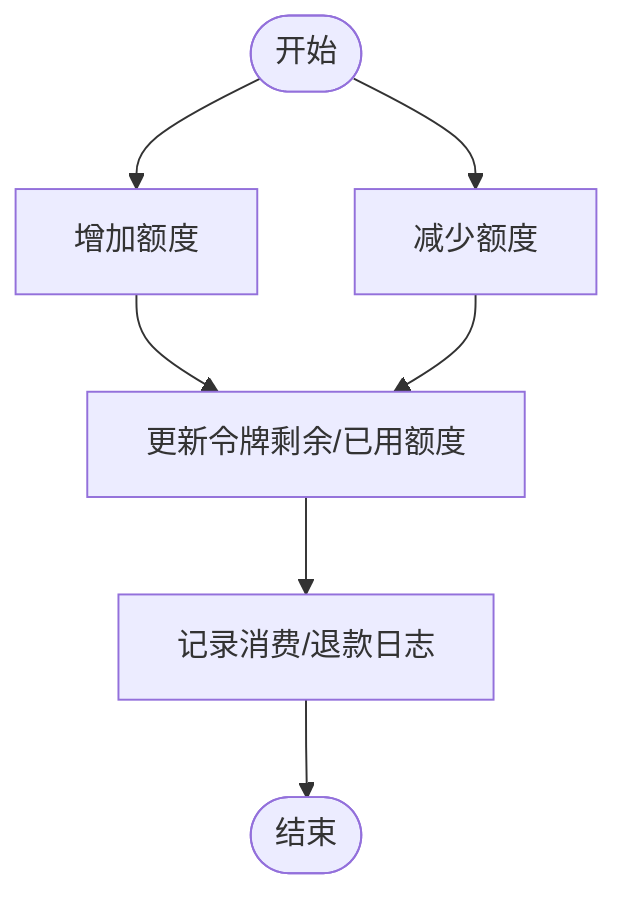
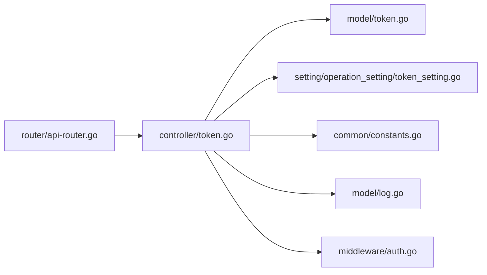

# 令牌管理接口

<cite>
**本文档引用的文件**
- [controller/token.go](file://controller/token.go)
- [model/token.go](file://model/token.go)
- [router/api-router.go](file://router/api-router.go)
- [common/constants.go](file://common/constants.go)
- [middleware/auth.go](file://middleware/auth.go)
- [setting/operation_setting/token_setting.go](file://setting/operation_setting/token_setting.go)
- [service/token_counter.go](file://service/token_counter.go)
- [model/log.go](file://model/log.go)
- [web/src/pages/Token/index.jsx](file://web/src/pages/Token/index.jsx)
- [web/src/hooks/tokens/useTokensData.jsx](file://web/src/hooks/tokens/useTokensData.jsx)
</cite>

## 目录
1. [简介](#简介)
2. [项目结构](#项目结构)
3. [核心组件](#核心组件)
4. [架构总览](#架构总览)
5. [详细组件分析](#详细组件分析)
6. [依赖关系分析](#依赖关系分析)
7. [性能考量](#性能考量)
8. [故障排查指南](#故障排查指南)
9. [结论](#结论)
10. [附录](#附录)

## 简介
本文件为 New API 的令牌管理接口提供系统化的 API 文档，覆盖访问令牌的生成、管理、使用统计、批量操作与安全策略。文档面向开发者与运维人员，帮助快速理解并正确实现令牌系统的增删改查、权限控制、额度管理与审计日志。

## 项目结构
令牌管理相关的核心代码分布在以下模块：
- 路由层：定义 /api/token 与 /api/usage/token 的路由与鉴权
- 控制器层：实现令牌 CRUD、批量操作、使用统计等业务逻辑
- 模型层：定义令牌实体、数据库操作、额度变更、缓存交互
- 中间件：用户认证、速率限制、缓存清理、只读令牌鉴权
- 设置层：令牌数量上限等运营配置
- 前端：令牌列表页面与交互逻辑

图表来源
- [router/api-router.go:249-261](file://router/api-router.go#L249-L261)
- [controller/token.go:34-359](file://controller/token.go#L34-L359)
- [model/token.go:14-32](file://model/token.go#L14-L32)
- [common/constants.go:193-198](file://common/constants.go#L193-L198)
- [middleware/auth.go:36-157](file://middleware/auth.go#L36-L157)
- [setting/operation_setting/token_setting.go:5-28](file://setting/operation_setting/token_setting.go#L5-L28)
- [model/log.go:19-40](file://model/log.go#L19-L40)

章节来源
- [router/api-router.go:249-261](file://router/api-router.go#L249-L261)
- [controller/token.go:34-359](file://controller/token.go#L34-L359)
- [model/token.go:14-32](file://model/token.go#L14-L32)
- [common/constants.go:193-198](file://common/constants.go#L193-L198)
- [middleware/auth.go:36-157](file://middleware/auth.go#L36-L157)
- [setting/operation_setting/token_setting.go:5-28](file://setting/operation_setting/token_setting.go#L5-L28)
- [model/log.go:19-40](file://model/log.go#L19-L40)

## 核心组件
- 令牌实体与字段：包含用户 ID、名称、密钥、状态、创建/访问时间、过期时间、剩余/已用额度、模型限额开关与列表、IP 白名单、分组、跨组重试等
- 控制器方法：列出、搜索、详情、获取密钥、创建、更新、删除、批量删除、批量导出密钥、使用统计
- 鉴权与中间件：用户认证、只读令牌鉴权、速率限制、缓存清理
- 额度与计费：额度增加/减少、结算与退款、日志记录
- 安全与审计：密钥掩码、IP 限制解析、日志统计、错误日志记录

章节来源
- [model/token.go:14-32](file://model/token.go#L14-L32)
- [controller/token.go:34-359](file://controller/token.go#L34-L359)
- [middleware/auth.go:36-157](file://middleware/auth.go#L36-L157)
- [model/log.go:19-40](file://model/log.go#L19-L40)

## 架构总览
令牌管理接口遵循“路由 -> 中间件 -> 控制器 -> 模型”的分层设计，使用 GIN 框架与 GORM 数据库访问，支持 Redis 缓存与批量更新优化。

图表来源
- [router/api-router.go:249-261](file://router/api-router.go#L249-L261)
- [middleware/auth.go:36-157](file://middleware/auth.go#L36-L157)
- [controller/token.go:34-359](file://controller/token.go#L34-L359)
- [model/token.go:279-330](file://model/token.go#L279-L330)
- [model/log.go:75-201](file://model/log.go#L75-L201)

## 详细组件分析

### 路由与鉴权
- 令牌路由组：/api/token 下的所有端点均需用户认证
- 使用统计路由：/api/usage/token/token 采用只读令牌鉴权
- 关键中间件：UserAuth、TokenAuthReadOnly、速率限制、缓存清理

章节来源
- [router/api-router.go:249-261](file://router/api-router.go#L249-L261)
- [router/api-router.go:263-271](file://router/api-router.go#L263-L271)
- [middleware/auth.go:36-157](file://middleware/auth.go#L36-L157)

### 令牌实体与字段
- 关键字段：用户 ID、名称、密钥、状态、创建/访问时间、过期时间、剩余/已用额度、模型限额开关与列表、IP 白名单、分组、跨组重试
- 状态枚举：启用、禁用、过期、耗尽
- 密钥掩码：对响应中的密钥进行安全掩码处理

章节来源
- [model/token.go:14-32](file://model/token.go#L14-L32)
- [common/constants.go:193-198](file://common/constants.go#L193-L198)
- [controller/token.go:17-32](file://controller/token.go#L17-L32)

### 令牌管理 API

#### 获取令牌列表
- 方法与路径：GET /api/token/
- 查询参数：p（页码）、size（每页大小）
- 成功响应：分页对象，items 中的令牌密钥被掩码
- 场景示例：管理员查看用户令牌列表

章节来源
- [controller/token.go:34-46](file://controller/token.go#L34-L46)
- [router/api-router.go:252](file://router/api-router.go#L252)

#### 搜索令牌
- 方法与路径：GET /api/token/search
- 查询参数：keyword（名称关键字）、token（令牌关键字）、p、size
- 成功响应：分页对象，items 中的令牌密钥被掩码
- 限制：当用户令牌数量超过上限时，禁止使用 % 通配符进行模糊搜索

章节来源
- [controller/token.go:48-63](file://controller/token.go#L48-L63)
- [model/token.go:127-186](file://model/token.go#L127-L186)
- [router/api-router.go:253](file://router/api-router.go#L253)

#### 获取单个令牌详情
- 方法与路径：GET /api/token/:id
- 参数：id（令牌 ID）
- 成功响应：令牌对象，密钥被掩码
- 场景示例：编辑令牌信息前的详情查看

章节来源
- [controller/token.go:65-78](file://controller/token.go#L65-L78)
- [router/api-router.go:254](file://router/api-router.go#L254)

#### 获取令牌密钥
- 方法与路径：POST /api/token/:id/key
- 参数：id（令牌 ID）
- 成功响应：包含完整密钥的对象
- 限制：速率限制与缓存禁用，防止泄露

章节来源
- [controller/token.go:80-95](file://controller/token.go#L80-L95)
- [router/api-router.go:255](file://router/api-router.go#L255)

#### 创建令牌
- 方法与路径：POST /api/token/
- 请求体：令牌对象（名称、过期时间、剩余额度、是否无限额度、模型限额开关与列表、IP 白名单、分组、跨组重试等）
- 成功响应：success=true
- 限制：用户令牌数量不得超过运营配置上限；额度范围校验；生成随机密钥

章节来源
- [controller/token.go:167-234](file://controller/token.go#L167-L234)
- [model/token.go:279-283](file://model/token.go#L279-L283)
- [setting/operation_setting/token_setting.go:25-28](file://setting/operation_setting/token_setting.go#L25-L28)

#### 更新令牌
- 方法与路径：PUT /api/token/
- 查询参数：status_only（仅更新状态）
- 请求体：令牌对象（可选字段：名称、状态、过期时间、剩余额度、是否无限额度、模型限额开关与列表、IP 白名单、分组、跨组重试）
- 成功响应：success=true，并返回掩码后的令牌对象
- 限制：启用状态校验（过期/耗尽状态不可启用）

章节来源
- [controller/token.go:250-313](file://controller/token.go#L250-L313)
- [model/token.go:286-300](file://model/token.go#L286-L300)

#### 删除令牌
- 方法与路径：DELETE /api/token/:id
- 参数：id（令牌 ID）
- 成功响应：success=true

章节来源
- [controller/token.go:236-248](file://controller/token.go#L236-L248)
- [model/token.go:362-373](file://model/token.go#L362-L373)

#### 批量删除令牌
- 方法与路径：POST /api/token/batch
- 请求体：ids（令牌 ID 数组）
- 成功响应：success=true，data 为删除数量
- 限制：数组长度校验与最大值限制

章节来源
- [controller/token.go:319-336](file://controller/token.go#L319-L336)
- [model/token.go:442-474](file://model/token.go#L442-L474)

#### 批量导出令牌密钥
- 方法与路径：POST /api/token/batch/keys
- 请求体：ids（令牌 ID 数组）
- 成功响应：包含映射 keys{id: fullKey}
- 限制：速率限制与缓存禁用；最大批量数量限制

章节来源
- [controller/token.go:338-359](file://controller/token.go#L338-L359)
- [model/token.go:476-482](file://model/token.go#L476-L482)

#### 令牌使用统计（只读令牌）
- 方法与路径：GET /api/usage/token/
- 请求头：Authorization: Bearer sk-...
- 成功响应：包含令牌名称、额度总计、已用、可用、是否无限额度、模型限额、过期时间等
- 场景示例：第三方应用查询令牌额度与限额

章节来源
- [controller/token.go:118-165](file://controller/token.go#L118-L165)
- [router/api-router.go:269](file://router/api-router.go#L269)

### 数据模型与流程

#### 令牌实体类图

图表来源
- [model/token.go:14-32](file://model/token.go#L14-L32)

#### 令牌使用统计流程

图表来源
- [controller/token.go:118-165](file://controller/token.go#L118-L165)

#### 额度变更与结算流程

图表来源
- [model/token.go:375-433](file://model/token.go#L375-L433)
- [model/log.go:152-201](file://model/log.go#L152-L201)

### 安全与审计

#### 密钥掩码与导出
- 响应中密钥默认掩码显示
- 导出密钥接口使用 POST 并带速率限制与缓存禁用，防止泄露

章节来源
- [controller/token.go:17-32](file://controller/token.go#L17-L32)
- [controller/token.go:80-95](file://controller/token.go#L80-L95)
- [controller/token.go:338-359](file://controller/token.go#L338-L359)

#### 日志与审计
- 消费日志、退款日志、错误日志统一记录
- 支持按用户、令牌、模型、时间范围、分组等维度查询统计

章节来源
- [model/log.go:75-201](file://model/log.go#L75-L201)
- [model/log.go:246-328](file://model/log.go#L246-L328)

#### IP 限制与白名单
- 解析令牌的 allow_ips 字段，支持换行与逗号分隔
- 用于访问控制与审计

章节来源
- [model/token.go:59-79](file://model/token.go#L59-L79)

## 依赖关系分析

图表来源
- [router/api-router.go:249-261](file://router/api-router.go#L249-L261)
- [controller/token.go:34-359](file://controller/token.go#L34-L359)
- [model/token.go:14-32](file://model/token.go#L14-L32)
- [setting/operation_setting/token_setting.go:5-28](file://setting/operation_setting/token_setting.go#L5-L28)
- [common/constants.go:193-198](file://common/constants.go#L193-L198)
- [middleware/auth.go:36-157](file://middleware/auth.go#L36-L157)
- [model/log.go:19-40](file://model/log.go#L19-L40)

章节来源
- [router/api-router.go:249-261](file://router/api-router.go#L249-L261)
- [controller/token.go:34-359](file://controller/token.go#L34-L359)
- [model/token.go:14-32](file://model/token.go#L14-L32)
- [setting/operation_setting/token_setting.go:5-28](file://setting/operation_setting/token_setting.go#L5-L28)
- [common/constants.go:193-198](file://common/constants.go#L193-L198)
- [middleware/auth.go:36-157](file://middleware/auth.go#L36-L157)
- [model/log.go:19-40](file://model/log.go#L19-L40)

## 性能考量
- 批量更新：支持批量额度变更，减少数据库往返
- 缓存：令牌密钥与额度变更支持异步缓存更新
- 速率限制：关键接口（如导出密钥、批量导出）启用速率限制
- 分页与硬上限：搜索与列表接口支持分页与硬上限，避免全表扫描

章节来源
- [model/token.go:375-433](file://model/token.go#L375-L433)
- [model/token.go:442-474](file://model/token.go#L442-L474)
- [router/api-router.go:255](file://router/api-router.go#L255)
- [router/api-router.go:260](file://router/api-router.go#L260)

## 故障排查指南
- 令牌状态异常：启用状态不可用于过期或耗尽令牌
- 额度越界：非无限额度时，剩余额度不得为负且不得超过最大值
- 搜索限制：超过令牌数量上限时，禁止使用 % 通配符进行模糊搜索
- 导出密钥失败：确认 Authorization 头格式正确且令牌存在
- 日志审计：通过日志接口查询消费/退款/错误日志，定位问题

章节来源
- [controller/token.go:279-288](file://controller/token.go#L279-L288)
- [controller/token.go:178-189](file://controller/token.go#L178-L189)
- [model/token.go:140-152](file://model/token.go#L140-L152)
- [controller/token.go:118-165](file://controller/token.go#L118-L165)
- [model/log.go:246-328](file://model/log.go#L246-L328)

## 结论
本令牌管理接口提供了从创建、管理到使用统计与批量操作的完整能力，结合严格的鉴权、速率限制与审计日志，确保系统安全与可观测性。开发者可据此快速集成令牌管理功能，并依据运营配置灵活扩展额度与权限策略。

## 附录

### 前端集成要点
- 令牌列表页面：通过 /api/token/ 获取分页数据
- 搜索：通过 /api/token/search 进行关键字搜索
- 导出密钥：通过 /api/token/:id/key 与 /api/token/batch/keys 获取密钥
- 批量操作：支持批量删除与批量复制密钥

章节来源
- [web/src/pages/Token/index.jsx:20-31](file://web/src/pages/Token/index.jsx#L20-L31)
- [web/src/hooks/tokens/useTokensData.jsx:104-121](file://web/src/hooks/tokens/useTokensData.jsx#L104-L121)
- [web/src/hooks/tokens/useTokensData.jsx:296-320](file://web/src/hooks/tokens/useTokensData.jsx#L296-L320)
- [web/src/hooks/tokens/useTokensData.jsx:377-404](file://web/src/hooks/tokens/useTokensData.jsx#L377-L404)
- [web/src/hooks/tokens/useTokensData.jsx:406-432](file://web/src/hooks/tokens/useTokensData.jsx#L406-L432)