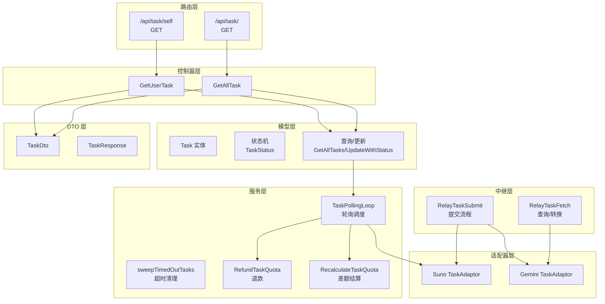
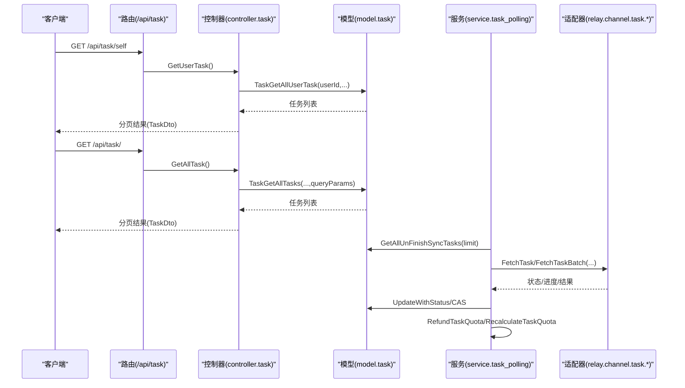
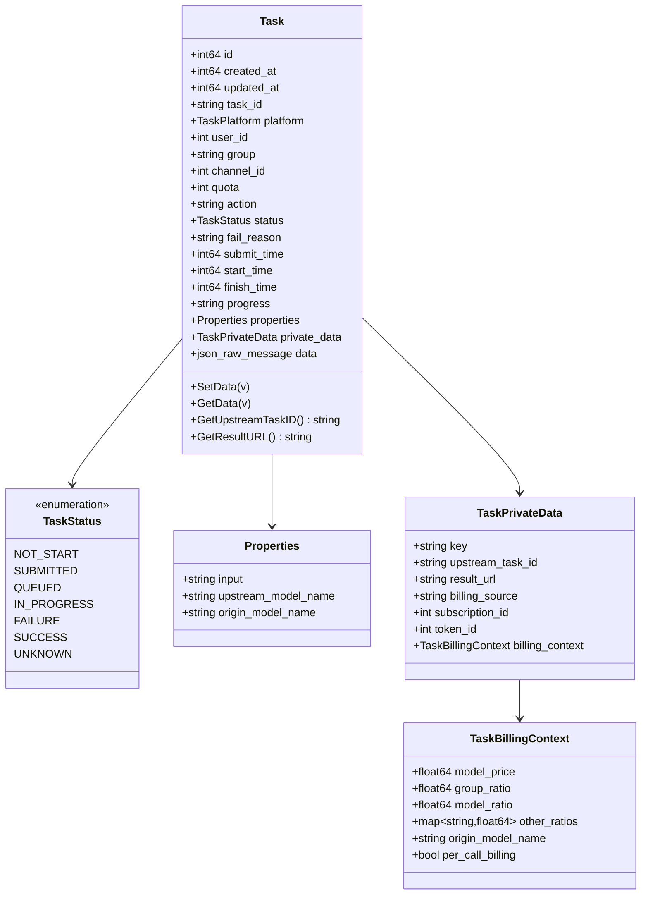
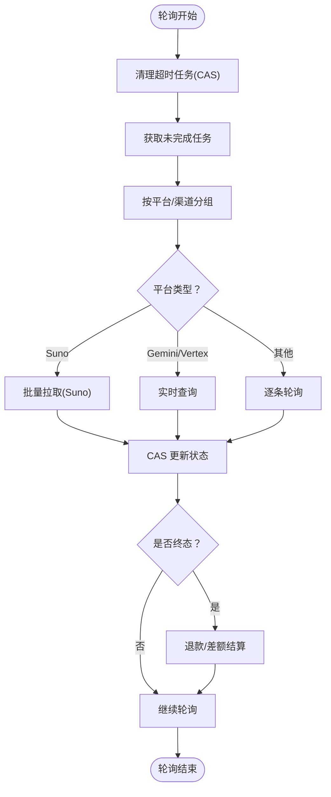
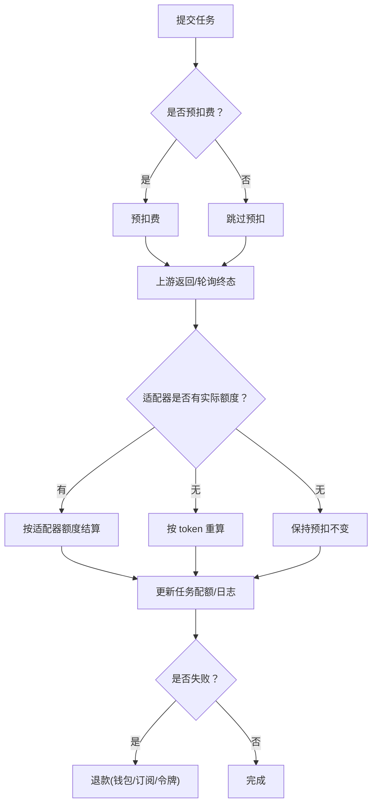
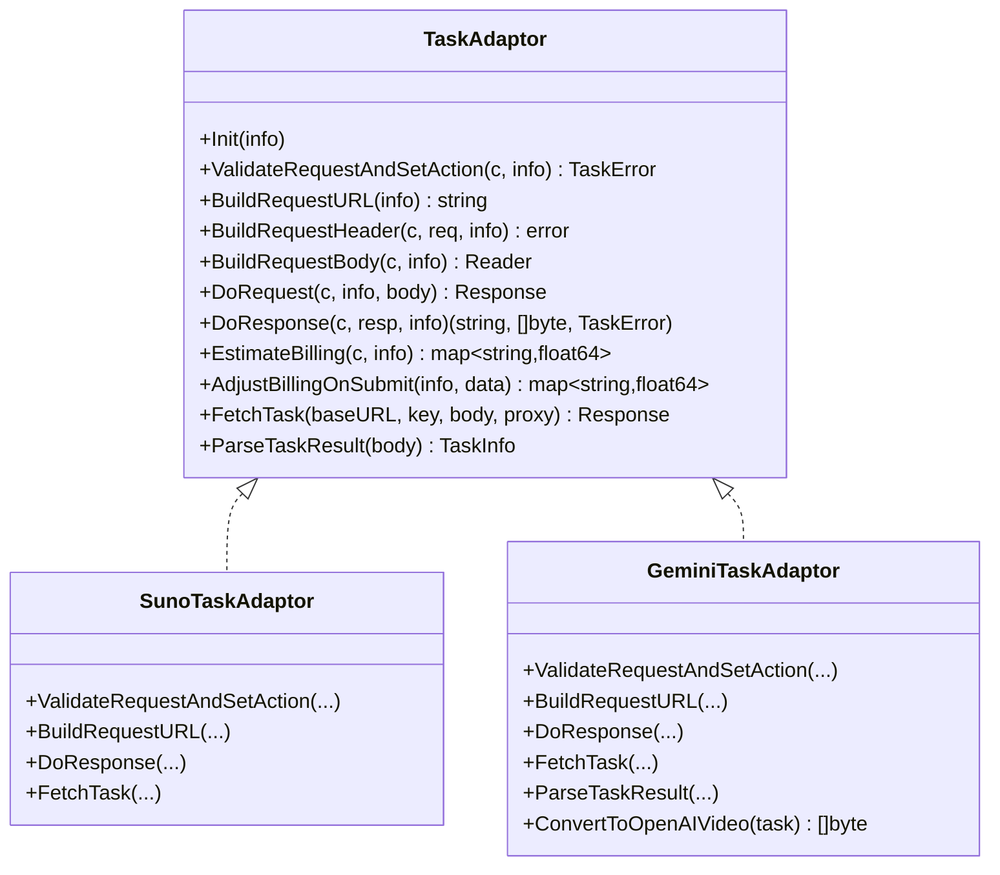
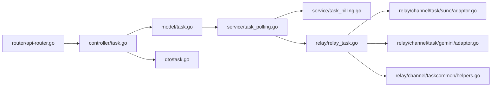

# 模型任务接口

<cite>
**本文引用的文件**
- [api-router.go](file://router/api-router.go)
- [task.go](file://controller/task.go)
- [task.go](file://model/task.go)
- [task.go](file://dto/task.go)
- [task.go](file://service/task_polling.go)
- [task_billing.go](file://service/task_billing.go)
- [task.go](file://relay/relay_task.go)
- [task.go](file://relay/channel/tas/taskcommon/helpers.go)
- [task.go](file://relay/channel/task/suno/adaptor.go)
- [task.go](file://relay/channel/task/gemini/adaptor.go)
- [task.go](file://constant/task.go)
- [api.json](file://docs/openapi/api.json)
</cite>

## 目录
1. [简介](#简介)
2. [项目结构](#项目结构)
3. [核心组件](#核心组件)
4. [架构总览](#架构总览)
5. [详细组件分析](#详细组件分析)
6. [依赖分析](#依赖分析)
7. [性能考虑](#性能考虑)
8. [故障排查指南](#故障排查指南)
9. [结论](#结论)
10. [附录](#附录)

## 简介
本文件面向 New API 的“模型任务接口”，系统性梳理模型任务的提交、查询、状态轮询、结果获取、计费结算、超时处理、批量任务与并发控制等能力。文档以接口规范为核心，结合代码结构与运行机制，帮助开发者准确实现完整的异步任务处理系统。

## 项目结构
围绕任务接口的关键模块分布如下：
- 路由层：定义 /api/task/* 的访问路径与鉴权要求
- 控制器层：封装分页查询、用户与管理员视角的任务列表
- 模型层：任务实体、状态机、查询与更新方法、快照与 CAS 更新
- DTO 层：任务响应结构、错误包装
- 服务层：轮询调度、超时清理、计费退款与差额结算
- 中继层：任务提交、请求构建、实时查询、适配器接口
- 适配器层：Suno、Gemini/Veo 等平台的请求与解析实现
- 常量层：任务平台与动作枚举、模型映射

图表来源
- [api-router.go:322-326](file://router/api-router.go#L322-L326)
- [task.go:22-67](file://controller/task.go#L22-L67)
- [task.go:15-66](file://model/task.go#L15-L66)
- [task.go:90-138](file://service/task_polling.go#L90-L138)
- [task.go:139-258](file://relay/relay_task.go#L139-L258)

章节来源
- [api-router.go:322-326](file://router/api-router.go#L322-L326)
- [task.go:22-67](file://controller/task.go#L22-L67)

## 核心组件
- 任务状态机：包含未开始、已提交、排队、处理中、成功、失败、未知等状态，用于统一描述异步任务生命周期
- 任务实体：包含任务标识、平台、用户、渠道、配额、动作、状态、失败原因、时间戳、进度、属性、私有数据、结果数据等字段
- 查询与分页：支持按平台、任务ID、状态、动作、时间范围、渠道等条件筛选，支持用户与管理员两种视角
- 轮询与清理：定时扫描未完成任务，按平台与渠道聚合，调用对应适配器批量/逐条拉取状态，执行退款与差额结算
- 计费与退款：支持预扣费、按次计费、token 重算、订阅/钱包来源退款与差额结算
- 实时查询：针对特定渠道（如 Gemini/Vertex）支持直连上游实时查询，或转换为 OpenAI Video 格式返回

章节来源
- [task.go:15-66](file://model/task.go#L15-L66)
- [task.go:438-497](file://model/task.go#L438-L497)
- [task.go:32-53](file://dto/task.go#L32-L53)
- [task.go:90-138](file://service/task_polling.go#L90-L138)
- [task_billing.go:150-182](file://service/task_billing.go#L150-L182)

## 架构总览
New API 的任务接口采用“控制器-服务-适配器”分层设计，控制器负责鉴权与参数解析，服务层负责轮询与计费，适配器负责对接不同平台的具体协议。

图表来源
- [api-router.go:322-326](file://router/api-router.go#L322-L326)
- [task.go:22-67](file://controller/task.go#L22-L67)
- [task.go:211-290](file://model/task.go#L211-L290)
- [task.go:90-138](file://service/task_polling.go#L90-L138)
- [task.go:287-308](file://relay/relay_task.go#L287-L308)

## 详细组件分析

### 接口规范与示例

- 获取个人任务列表
  - 方法与路径：GET /api/task/self
  - 鉴权：用户登录(User)
  - 查询参数：
    - start_timestamp：起始时间戳（秒）
    - end_timestamp：结束时间戳（秒）
    - platform：平台（可选）
    - task_id：任务ID（可选）
    - status：状态（可选）
    - action：动作（可选）
  - 响应：分页对象，items 为 TaskDto 数组
  - 示例响应字段（节选）：id、task_id、platform、user_id、group、channel_id、quota、action、status、fail_reason、result_url、submit_time、start_time、finish_time、progress、properties、username、data

- 获取全量任务列表（管理员）
  - 方法与路径：GET /api/task/
  - 鉴权：管理员(Admin)
  - 查询参数：同上，额外支持 channel_id
  - 响应：分页对象，items 为 TaskDto 数组（含用户名）

- 请求与响应示例（文字版）
  - 获取个人任务：携带分页与筛选参数，返回分页结果
  - 获取全量任务：管理员可按渠道筛选，返回含用户名的任务列表
  - 实时查询：对于特定渠道（如 Gemini/Vertex），可直接获取最新状态并转换为 OpenAI Video 格式

章节来源
- [api-router.go:322-326](file://router/api-router.go#L322-L326)
- [task.go:22-67](file://controller/task.go#L22-L67)
- [task.go:32-53](file://dto/task.go#L32-L53)
- [api.json:4321-4370](file://docs/openapi/api.json#L4321-L4370)

### 数据模型与状态机

图表来源
- [task.go:44-118](file://model/task.go#L44-L118)

章节来源
- [task.go:44-118](file://model/task.go#L44-L118)

### 轮询与状态更新

- 轮询调度
  - 触发：服务层循环，每 15 秒执行一次
  - 步骤：清理超时任务 → 获取未完成任务 → 按平台/渠道聚合 → 调用适配器批量/逐条拉取 → CAS 更新状态 → 执行退款/差额结算
- 超时清理
  - 截止时间：当前时间减去配置的超时分钟数
  - 采用 per-task CAS，避免覆盖被正常推进的任务
  - 对非遗留任务且存在预扣配额时执行退款
- 状态映射
  - 不同平台的状态码映射为统一进度值（提交/排队/处理中/完成）
  - 成功时填充结果 URL（支持 data: URI、直链、代理 URL）

图表来源
- [task.go:90-138](file://service/task_polling.go#L90-L138)
- [task.go:38-88](file://service/task_polling.go#L38-L88)
- [task.go:290-342](file://service/task_polling.go#L290-L342)
- [task.go:181-209](file://relay/channel/task/gemini/adaptor.go#L181-L209)

章节来源
- [task.go:90-138](file://service/task_polling.go#L90-L138)
- [task.go:38-88](file://service/task_polling.go#L38-L88)

### 计费与退款

- 预扣费与按次计费
  - 首次提交时进行预扣费（除非按次计费或免费模型）
  - 按次计费的任务在终态时不进行差额结算
- 差额结算
  - 优先使用适配器返回的实际额度
  - 否则回退到 token 重算
  - 最终更新任务配额并记录日志
- 退款
  - 失败时按资金来源（钱包/订阅）与令牌额度进行退款
  - 记录退款日志，包含模型名、倍率、其他比率等

图表来源
- [task.go:139-258](file://relay/relay_task.go#L139-L258)
- [task_billing.go:150-182](file://service/task_billing.go#L150-L182)
- [task_billing.go:184-245](file://service/task_billing.go#L184-L245)
- [task_billing.go:247-301](file://service/task_billing.go#L247-L301)

章节来源
- [task.go:139-258](file://relay/relay_task.go#L139-L258)
- [task_billing.go:150-182](file://service/task_billing.go#L150-L182)

### 适配器与平台集成

- 通用适配器接口
  - 初始化、校验请求、构建请求、发送请求、解析响应、估算/提交后计费调整、批量/单条轮询、状态解析
- Suno 适配器
  - 提交：/suno/submit/{action}
  - 轮询：/suno/fetch（批量）
  - 返回公开 task_id 给客户端
- Gemini/Vertex 适配器
  - 提交：predictLongRunning 操作
  - 轮询：operations GET
  - 支持实时查询与 OpenAI Video 格式转换

图表来源
- [task.go:34-54](file://relay/channel/adapter.go#L34-L54)
- [task.go:21-168](file://relay/channel/task/suno/adaptor.go#L21-L168)
- [task.go:29-293](file://relay/channel/task/gemini/adaptor.go#L29-L293)

章节来源
- [task.go:34-54](file://relay/channel/adapter.go#L34-L54)
- [task.go:21-168](file://relay/channel/task/suno/adaptor.go#L21-L168)
- [task.go:29-293](file://relay/channel/task/gemini/adaptor.go#L29-L293)

### 实时查询与结果获取

- 通用查询
  - 支持按任务ID查询，返回 TaskDto
  - 若为 OpenAI Video API 路径，转换为 OpenAIVideo 格式
- 实时查询
  - 针对 Gemini/Vertex 渠道，可直接向上游拉取最新状态
  - 更新本地任务状态并持久化
  - 非 OpenAI Video API 时返回自定义格式

章节来源
- [task.go:362-416](file://relay/relay_task.go#L362-L416)
- [task.go:418-500](file://relay/relay_task.go#L418-L500)
- [task.go:63-75](file://relay/channel/tas/taskcommon/helpers.go#L63-L75)

### 模型映射与任务动作

- 模型映射
  - 通过渠道配置将上游模型名映射为内部模型名，影响计费与日志
- 动作枚举
  - 平台动作（如 Suno 的 MUSIC/LYRICS）
  - 任务动作（generate、textGenerate、firstTailGenerate、referenceGenerate、remixGenerate）

章节来源
- [task.go:5-24](file://constant/task.go#L5-L24)
- [task.go:167-172](file://relay/relay_task.go#L167-L172)

## 依赖分析

图表来源
- [api-router.go:322-326](file://router/api-router.go#L322-L326)
- [task.go:22-67](file://controller/task.go#L22-L67)
- [task.go:211-290](file://model/task.go#L211-L290)
- [task.go:90-138](file://service/task_polling.go#L90-L138)
- [task_billing.go:150-182](file://service/task_billing.go#L150-L182)
- [task.go:139-258](file://relay/relay_task.go#L139-L258)
- [task.go:21-168](file://relay/channel/task/suno/adaptor.go#L21-L168)
- [task.go:29-293](file://relay/channel/task/gemini/adaptor.go#L29-L293)
- [task.go:63-75](file://relay/channel/tas/taskcommon/helpers.go#L63-L75)

章节来源
- [api-router.go:322-326](file://router/api-router.go#L322-L326)
- [task.go:22-67](file://controller/task.go#L22-L67)
- [task.go:211-290](file://model/task.go#L211-L290)
- [task.go:90-138](file://service/task_polling.go#L90-L138)

## 性能考虑
- 轮询频率：每 15 秒一次，避免频繁轮询造成上游压力
- 并发控制：视频类任务在逐条轮询时增加 1 秒间隔，降低上游限流风险
- 批量处理：Suno 采用批量查询接口，减少网络往返
- 数据库更新：使用 CAS（Compare-And-Swap）保证并发安全，避免覆盖其他进程的更新
- 日志与监控：关键路径均输出日志，便于定位性能瓶颈与异常

## 故障排查指南
- 任务长时间未完成
  - 检查轮询是否正常运行（服务日志）
  - 确认渠道可用性与密钥状态
  - 查看任务状态是否被 CAS 抢占更新
- 任务失败退款异常
  - 核对资金来源（钱包/订阅）、令牌额度是否正确
  - 检查计费上下文是否完整（模型倍率、分组倍率、其他比率）
- 实时查询失败
  - 确认渠道类型为 Gemini/Vertex
  - 检查上游 API Key 与 BaseURL 配置
- OpenAI Video 格式转换异常
  - 确认适配器实现了 ConvertToOpenAIVideo 接口
  - 检查任务状态与进度映射是否正确

章节来源
- [task.go:38-88](file://service/task_polling.go#L38-L88)
- [task_billing.go:150-182](file://service/task_billing.go#L150-L182)
- [task.go:246-270](file://relay/channel/task/gemini/adaptor.go#L246-L270)

## 结论
New API 的模型任务接口通过清晰的分层设计与完善的轮询、计费、退款机制，提供了稳定可靠的异步任务处理能力。开发者可依据本文档的接口规范与实现要点，快速集成并扩展至更多平台与业务场景。

## 附录

### 接口一览（摘要）
- GET /api/task/self：获取个人任务列表（分页、筛选）
- GET /api/task/：获取全量任务列表（管理员，分页、筛选）

章节来源
- [api-router.go:322-326](file://router/api-router.go#L322-L326)
- [api.json:4321-4370](file://docs/openapi/api.json#L4321-L4370)