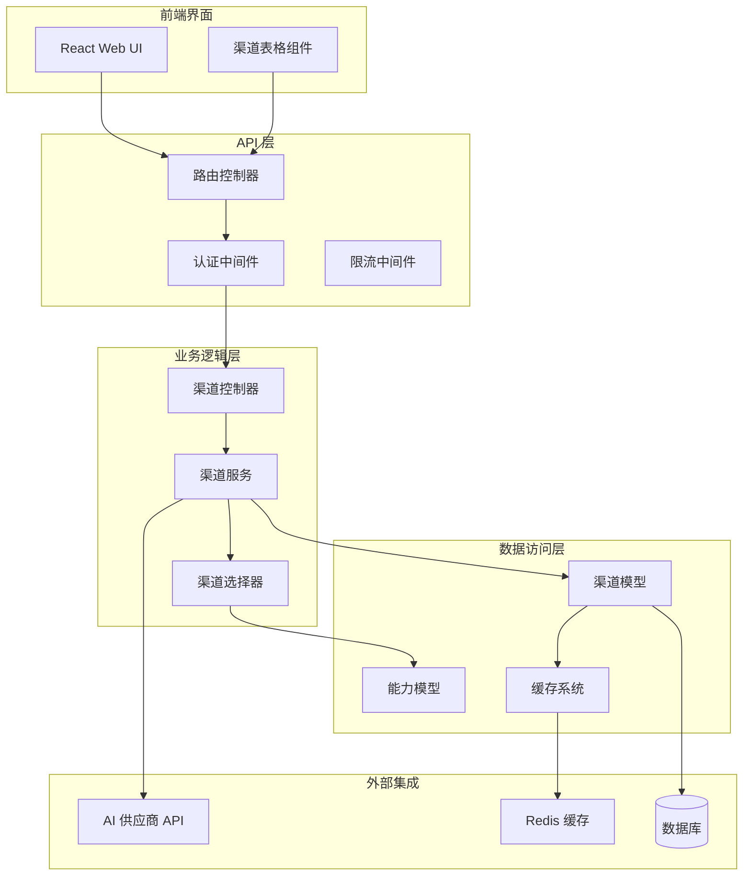
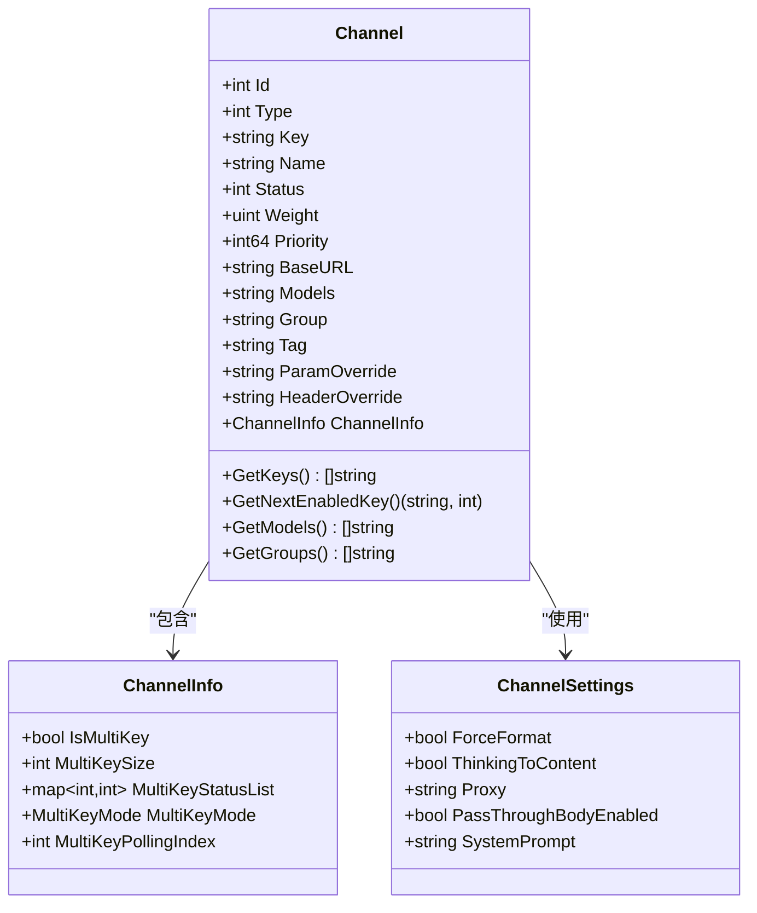
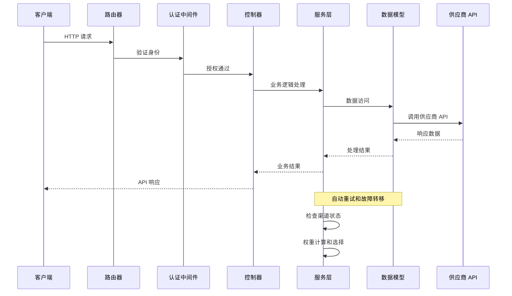
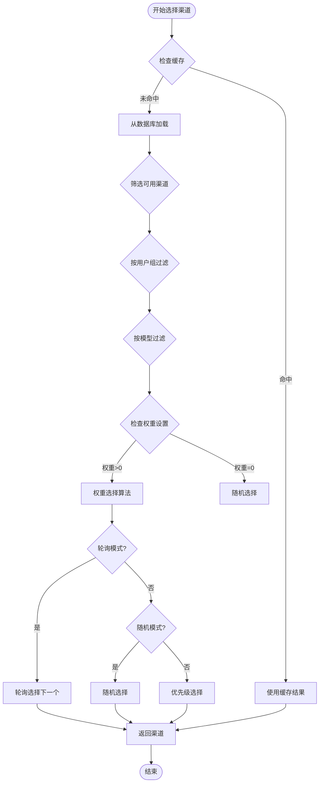
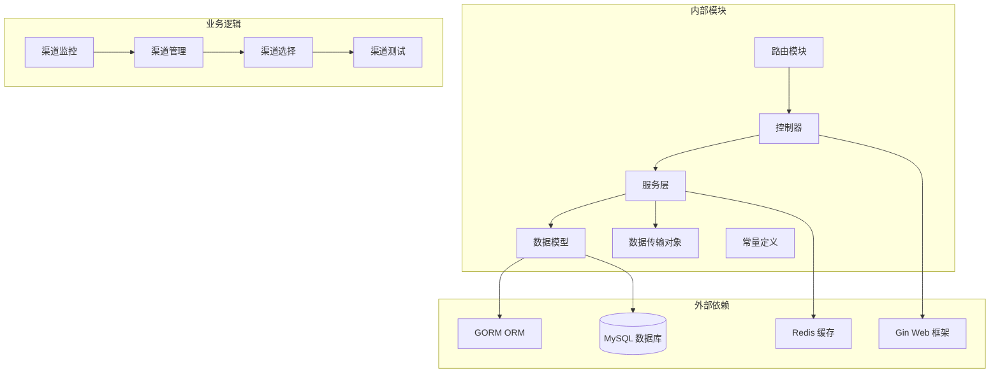
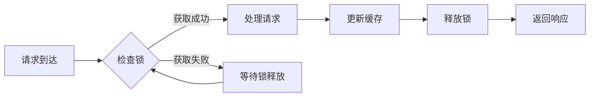

# 渠道管理接口

<cite>
**本文档引用的文件**
- [controller/channel.go](file://controller/channel.go)
- [controller/channel-test.go](file://controller/channel-test.go)
- [service/channel.go](file://service/channel.go)
- [service/channel_select.go](file://service/channel_select.go)
- [model/channel.go](file://model/channel.go)
- [model/channel_satisfy.go](file://model/channel_satisfy.go)
- [dto/channel_settings.go](file://dto/channel_settings.go)
- [router/api-router.go](file://router/api-router.go)
- [constant/channel.go](file://constant/channel.go)
- [constant/multi_key_mode.go](file://constant/multi_key_mode.go)
- [common/constants.go](file://common/constants.go)
- [web/src/pages/Channel/index.jsx](file://web/src/pages/Channel/index.jsx)
</cite>

## 目录
1. [简介](#简介)
2. [项目结构](#项目结构)
3. [核心组件](#核心组件)
4. [架构概览](#架构概览)
5. [详细组件分析](#详细组件分析)
6. [依赖关系分析](#依赖关系分析)
7. [性能考虑](#性能考虑)
8. [故障排除指南](#故障排除指南)
9. [结论](#结论)

## 简介

New API 的渠道管理接口是一个完整的 AI 服务渠道管理系统，提供了对各种 AI 供应商渠道的统一管理和控制。该系统支持多种渠道类型（OpenAI、Azure、Anthropic、Google Gemini 等 50 多种），具备智能路由、权重分配、自动重试、故障转移等高级功能。

## 项目结构

渠道管理系统的整体架构采用分层设计：



**图表来源**
- [router/api-router.go:206-248](file://router/api-router.go#L206-L248)
- [controller/channel.go:71-174](file://controller/channel.go#L71-L174)
- [model/channel.go:21-58](file://model/channel.go#L21-L58)

## 核心组件

### 渠道类型系统

系统支持 50 多种不同的 AI 供应商渠道，每种渠道都有其特定的配置要求和行为特征：

| 渠道类型 | 供应商 | 主要特性 |
|---------|--------|----------|
| OpenAI | OpenAI | 标准 OpenAI API 支持 |
| Azure | Microsoft Azure | 企业级云服务集成 |
| Anthropic | Anthropic | Claude 模型支持 |
| Google Gemini | Google | Gemini 模型支持 |
| VertexAI | Google Cloud | 企业级 AI 平台 |
| Azure | Microsoft | Azure OpenAI 服务 |
| Ollama | 本地部署 | 本地大模型推理 |

### 渠道配置结构



**图表来源**
- [model/channel.go:21-58](file://model/channel.go#L21-L58)
- [dto/channel_settings.go:3-10](file://dto/channel_settings.go#L3-L10)

**章节来源**
- [constant/channel.go:3-60](file://constant/channel.go#L3-L60)
- [model/channel.go:21-58](file://model/channel.go#L21-L58)
- [dto/channel_settings.go:26-44](file://dto/channel_settings.go#L26-L44)

## 架构概览

渠道管理系统的请求处理流程如下：



**图表来源**
- [router/api-router.go:206-248](file://router/api-router.go#L206-L248)
- [controller/channel.go:566-664](file://controller/channel.go#L566-L664)
- [service/channel_select.go:83-162](file://service/channel_select.go#L83-L162)

## 详细组件分析

### 渠道管理 API

#### GET /api/channel - 获取所有渠道

**功能描述**: 获取系统中配置的所有渠道列表，支持分页、筛选和排序。

**请求参数**:
- `page` (可选): 页码，默认 1
- `page_size` (可选): 每页数量，默认 20
- `status` (可选): 状态筛选 (enabled/disabled/all)
- `type` (可选): 渠道类型
- `id_sort` (可选): 是否按 ID 排序
- `tag_mode` (可选): 是否按标签模式查询

**响应格式**:
```json
{
  "success": true,
  "message": "",
  "data": {
    "items": [
      {
        "id": 1,
        "type": 1,
        "name": "OpenAI GPT-4",
        "status": 1,
        "weight": 10,
        "priority": 1,
        "models": "gpt-4,gpt-3.5-turbo",
        "group": "default",
        "tag": "production"
      }
    ],
    "total": 100,
    "page": 1,
    "page_size": 20,
    "type_counts": {
      "1": 50,
      "14": 20,
      "24": 15
    }
  }
}
```

**状态码**:
- 200: 成功
- 500: 服务器内部错误

#### POST /api/channel - 添加渠道

**功能描述**: 批量添加新的 AI 服务渠道，支持单键、多键和批量导入模式。

**请求体参数**:
```json
{
  "mode": "single|multi_to_single|batch",
  "multi_key_mode": "random|polling",
  "batch_add_set_key_prefix_2_name": true,
  "channel": {
    "type": 1,
    "name": "OpenAI Channel",
    "key": "sk-xxxxxxxxxxxxxxxxxxxxxxxx",
    "base_url": "https://api.openai.com",
    "models": "gpt-4,gpt-3.5-turbo",
    "group": "default",
    "weight": 10,
    "priority": 1,
    "setting": "{}",
    "param_override": "{}",
    "header_override": "{}"
  }
}
```

**响应格式**:
```json
{
  "success": true,
  "message": "",
  "data": null
}
```

**状态码**:
- 200: 成功
- 400: 参数错误
- 500: 服务器内部错误

#### PUT /api/channel - 更新渠道

**功能描述**: 更新现有渠道的配置信息。

**请求体参数**:
与添加渠道类似，但包含 `id` 字段标识要更新的渠道。

**状态码**:
- 200: 成功
- 404: 渠道不存在
- 500: 服务器内部错误

#### DELETE /api/channel/:id - 删除渠道

**功能描述**: 删除指定 ID 的渠道。

**状态码**:
- 200: 成功
- 404: 渠道不存在
- 500: 服务器内部错误

#### GET /api/channel/test/:id - 测试渠道连接

**功能描述**: 测试指定渠道的连通性和可用性。

**请求参数**:
- `model` (可选): 测试使用的模型名称
- `endpoint_type` (可选): 端点类型
- `stream` (可选): 是否使用流式传输

**响应格式**:
```json
{
  "success": true,
  "message": "",
  "time": 1.234
}
```

**状态码**:
- 200: 测试完成
- 404: 渠道不存在
- 500: 测试失败

#### POST /api/channel/tag - 批量标签操作

**功能描述**: 基于标签进行批量渠道操作。

**请求体参数**:
```json
{
  "tag": "production",
  "new_tag": "staging",
  "priority": 1,
  "weight": 5,
  "models": "gpt-4,gpt-3.5-turbo",
  "groups": "default,test",
  "param_override": "{}",
  "header_override": "{}"
}
```

**状态码**:
- 200: 成功
- 400: 参数错误
- 500: 服务器内部错误

**章节来源**
- [controller/channel.go:71-174](file://controller/channel.go#L71-L174)
- [controller/channel.go:566-664](file://controller/channel.go#L566-L664)
- [controller/channel.go:666-695](file://controller/channel.go#L666-L695)
- [controller/channel.go:709-800](file://controller/channel.go#L709-L800)
- [controller/channel-test.go:735-790](file://controller/channel-test.go#L735-L790)

### 权重算法和选择策略

系统实现了智能的渠道选择算法，支持多种权重分配策略：



**图表来源**
- [service/channel_select.go:83-162](file://service/channel_select.go#L83-L162)
- [model/channel.go:105-190](file://model/channel.go#L105-L190)

### 自动重试机制

系统实现了多层次的自动重试机制：

```mermaid
stateDiagram-v2
[*] --> NormalRequest
NormalRequest --> FirstAttempt : 发送请求
FirstAttempt --> Success : 响应正常
FirstAttempt --> RetryNeeded : 错误或超时
RetryNeeded --> CheckRetryCount{检查重试次数}
CheckRetryCount --> |未达到上限| RetryAttempt : 重试请求
CheckRetryCount --> |达到上限| Fail : 最终失败
RetryAttempt --> Success : 重试成功
RetryAttempt --> RetryNeeded : 重试失败
Success --> [*] : 请求完成
Fail --> [*] : 请求失败
```

**图表来源**
- [service/channel.go:45-79](file://service/channel.go#L45-L79)
- [common/constants.go:107-113](file://common/constants.go#L107-L113)

**章节来源**
- [service/channel_select.go:83-162](file://service/channel_select.go#L83-L162)
- [model/channel.go:105-190](file://model/channel.go#L105-L190)
- [service/channel.go:45-79](file://service/channel.go#L45-L79)

### 多键管理模式

系统支持多种多键管理模式：

| 模式 | 描述 | 适用场景 |
|------|------|----------|
| Random | 随机选择可用密钥 | 高并发场景，负载均衡 |
| Polling | 轮询选择密钥 | 均匀分配负载，避免单点压力 |

**章节来源**
- [constant/multi_key_mode.go:5-8](file://constant/multi_key_mode.go#L5-L8)
- [model/channel.go:105-190](file://model/channel.go#L105-L190)

## 依赖关系分析

渠道管理系统的依赖关系如下：



**图表来源**
- [router/api-router.go:14-380](file://router/api-router.go#L14-L380)
- [controller/channel.go:1-22](file://controller/channel.go#L1-L22)
- [model/channel.go:1-20](file://model/channel.go#L1-L20)

**章节来源**
- [router/api-router.go:14-380](file://router/api-router.go#L14-L380)
- [controller/channel.go:1-22](file://controller/channel.go#L1-L22)

## 性能考虑

### 缓存策略

系统采用了多层次的缓存策略来提升性能：

1. **内存缓存**: 缓存活跃的渠道配置和状态
2. **Redis 缓存**: 缓存热点数据和分布式共享状态
3. **数据库查询优化**: 使用索引和预编译语句

### 并发控制



**图表来源**
- [model/channel.go:537-571](file://model/channel.go#L537-L571)

### 批处理优化

系统支持批量操作来减少数据库往返次数：

- 批量插入渠道：每次最多 50 个渠道
- 批量删除渠道：每次最多 200 个渠道
- 批量更新配额：支持批量更新

## 故障排除指南

### 常见问题诊断

| 问题类型 | 症状 | 可能原因 | 解决方案 |
|----------|------|----------|----------|
| 渠道不可用 | 请求失败 | API 密钥无效 | 验证密钥格式和权限 |
| 连接超时 | 超时错误 | 网络问题或 API 限流 | 检查网络连接和速率限制 |
| 权重分配不均 | 某些渠道负载过高 | 权重设置不合理 | 调整权重值重新平衡 |
| 自动禁用频繁 | 渠道被自动禁用 | 频繁错误或配额耗尽 | 检查错误日志和配额设置 |

### 调试工具

系统提供了多种调试和监控工具：

1. **渠道测试**: 验证渠道连通性和响应时间
2. **实时监控**: 实时显示渠道状态和性能指标
3. **日志分析**: 详细的错误日志和性能日志
4. **配额监控**: 实时跟踪渠道使用情况

**章节来源**
- [controller/channel-test.go:735-790](file://controller/channel-test.go#L735-L790)
- [service/channel.go:18-34](file://service/channel.go#L18-L34)

## 结论

New API 的渠道管理接口提供了一个完整、灵活且高性能的 AI 服务渠道管理系统。通过标准化的 API 接口、智能的路由算法、完善的监控机制和强大的扩展能力，该系统能够有效管理复杂的多供应商 AI 服务环境。

主要优势包括：

1. **统一管理**: 支持 50 多种渠道类型的统一管理
2. **智能路由**: 基于权重、优先级和负载的智能选择算法
3. **高可用性**: 自动重试、故障转移和健康检查机制
4. **可观测性**: 详细的监控、日志和调试工具
5. **可扩展性**: 模块化设计，易于添加新的渠道类型

开发者可以基于此接口快速构建自己的 AI 服务管理平台，实现对多个 AI 供应商渠道的有效控制和优化。