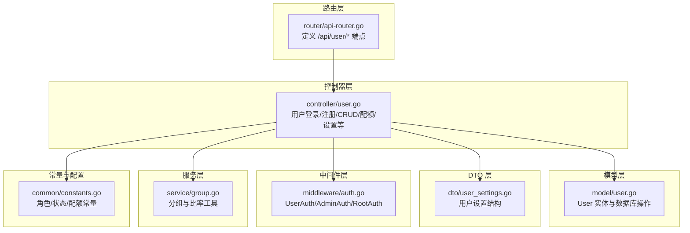
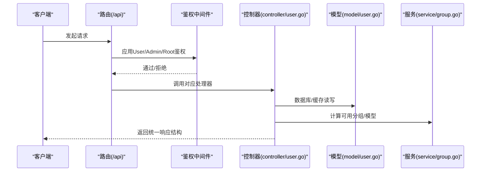
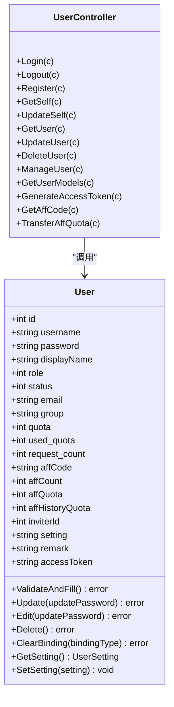
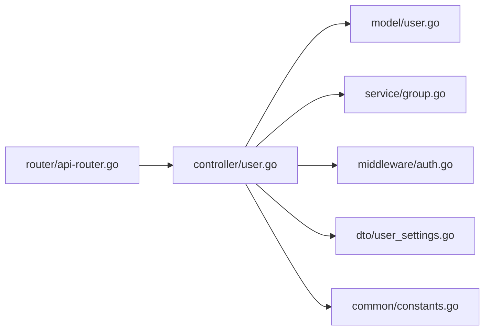

# 用户管理接口

<cite>
**本文引用的文件**
- [controller/user.go](file://controller/user.go)
- [router/api-router.go](file://router/api-router.go)
- [model/user.go](file://model/user.go)
- [dto/user_settings.go](file://dto/user_settings.go)
- [middleware/auth.go](file://middleware/auth.go)
- [service/group.go](file://service/group.go)
- [common/constants.go](file://common/constants.go)
</cite>

## 目录
1. [简介](#简介)
2. [项目结构](#项目结构)
3. [核心组件](#核心组件)
4. [架构总览](#架构总览)
5. [详细组件分析](#详细组件分析)
6. [依赖分析](#依赖分析)
7. [性能考虑](#性能考虑)
8. [故障排查指南](#故障排查指南)
9. [结论](#结论)
10. [附录](#附录)

## 简介
本文件面向 New API 的用户管理接口，提供完整、可执行的 API 规范与实现说明。内容覆盖用户信息管理、权限组管理、用户状态控制、配额与邀请机制、个人设置（含边栏模块与语言偏好）、管理员操作与批量能力、以及安全与鉴权约束。开发者可据此快速理解并实现完整的用户管理系统。

## 项目结构
用户管理相关代码主要分布在以下模块：
- 路由层：定义用户相关端点与鉴权中间件
- 控制器层：处理业务逻辑与请求响应
- 模型层：用户实体、缓存与数据库交互
- DTO 层：用户设置结构
- 中间件层：用户、管理员、根用户鉴权
- 服务层：分组与比率相关工具

**图表来源**
- [router/api-router.go:56-134](file://router/api-router.go#L56-L134)
- [controller/user.go:32-1246](file://controller/user.go#L32-L1246)
- [model/user.go:23-1049](file://model/user.go#L23-L1049)
- [dto/user_settings.go:3-19](file://dto/user_settings.go#L3-L19)
- [middleware/auth.go:36-186](file://middleware/auth.go#L36-L186)
- [service/group.go:10-66](file://service/group.go#L10-L66)
- [common/constants.go:141-198](file://common/constants.go#L141-L198)

**章节来源**
- [router/api-router.go:56-134](file://router/api-router.go#L56-L134)
- [controller/user.go:32-1246](file://controller/user.go#L32-L1246)
- [model/user.go:23-1049](file://model/user.go#L23-L1049)
- [dto/user_settings.go:3-19](file://dto/user_settings.go#L3-L19)
- [middleware/auth.go:36-186](file://middleware/auth.go#L36-L186)
- [service/group.go:10-66](file://service/group.go#L10-L66)
- [common/constants.go:141-198](file://common/constants.go#L141-L198)

## 核心组件
- 用户实体与数据库交互：包含用户名、显示名、角色、状态、邮箱、分组、配额、邀请相关字段、设置等；提供登录校验、更新、删除、配额变动、绑定清理等方法。
- 用户控制器：实现登录、注册、获取当前用户、获取他人信息、更新自身/他人信息、删除自身/他人、生成访问令牌、邀请码与额度转移、分组与可用模型查询、设置更新、管理员批量管理等。
- 路由与鉴权：按用户、管理员、根用户划分权限；支持会话与访问令牌两种认证方式。
- 用户设置：支持通知类型、阈值、Webhook、邮件、Bark、Gotify、上游模型更新通知、接受未设价模型、记录IP日志、边栏模块配置、语言偏好等。
- 分组与可用模型：根据用户分组与系统配置计算可用分组与模型集合。

**章节来源**
- [model/user.go:23-1049](file://model/user.go#L23-L1049)
- [controller/user.go:32-1246](file://controller/user.go#L32-L1246)
- [dto/user_settings.go:3-19](file://dto/user_settings.go#L3-L19)
- [service/group.go:10-66](file://service/group.go#L10-L66)
- [middleware/auth.go:36-186](file://middleware/auth.go#L36-L186)

## 架构总览
用户管理接口遵循“路由 -> 中间件 -> 控制器 -> 模型/服务”的分层架构，配合 DTO 与常量配置完成权限、状态、配额与分组等业务逻辑。

**图表来源**
- [router/api-router.go:56-134](file://router/api-router.go#L56-L134)
- [middleware/auth.go:36-186](file://middleware/auth.go#L36-L186)
- [controller/user.go:32-1246](file://controller/user.go#L32-L1246)
- [model/user.go:23-1049](file://model/user.go#L23-L1049)
- [service/group.go:10-66](file://service/group.go#L10-L66)

## 详细组件分析

### 登录与会话
- 端点
  - POST /api/user/login
  - POST /api/user/login/2fa
  - GET /api/user/logout
- 请求参数
  - 登录：username, password
  - 二次验证：验证码（登录流程中会话中携带 pending 信息）
  - 注销：无需请求体
- 响应
  - 成功：返回用户基本信息（不含敏感字段）
  - 失败：返回统一错误结构
- 权限与状态
  - 登录受全局速率限制与人机验证开关影响
  - 二次验证开启时，登录后返回 require_2fa 标识，需调用二次验证端点完成登录
- 安全
  - 登录成功写入会话（id、username、role、status、group），并保存 Cookie
  - 会话过期或禁用将导致后续请求被拒绝

**章节来源**
- [controller/user.go:32-134](file://controller/user.go#L32-L134)
- [router/api-router.go:58-64](file://router/api-router.go#L58-L64)
- [middleware/auth.go:36-186](file://middleware/auth.go#L36-L186)

### 注册与邮箱绑定
- 端点
  - POST /api/user/register
  - POST /api/user/oauth/email/bind
- 请求参数
  - 注册：username, password, 可选 email、verification_code（当启用邮箱验证时）
  - 邮箱绑定：email, code
- 响应
  - 成功：返回成功标志
  - 失败：返回统一错误结构
- 业务规则
  - 注册时若启用邮箱验证，必须提供正确验证码
  - 注册成功后可选择生成默认令牌与默认额度
  - 邮箱绑定通过验证码校验后直接更新用户邮箱字段

**章节来源**
- [controller/user.go:136-232](file://controller/user.go#L136-L232)
- [controller/user.go:979-1013](file://controller/user.go#L979-L1013)
- [router/api-router.go:58-59](file://router/api-router.go#L58-L59)
- [router/api-router.go:39](file://router/api-router.go#L39)

### 当前用户信息与设置
- 端点
  - GET /api/user/self
  - PUT /api/user/self
  - PUT /api/user/setting
  - DELETE /api/user/self
- 请求参数
  - 获取：无
  - 更新自身：可传 username、display_name、original_password、password 等（密码为空表示不更新）
  - 更新设置：notify_type、quota_warning_threshold、webhook_url、webhook_secret、notification_email、bark_url、gotify_url、gotify_token、gotify_priority、upstream_model_update_notify_enabled、accept_unset_model_ratio_model、record_ip_log、sidebar_modules、language
  - 删除自身：无
- 响应
  - 获取：返回用户完整信息（管理员备注在普通用户视角为空）
  - 更新：返回成功标志
  - 设置：返回保存成功提示
  - 删除：返回成功标志
- 权限
  - 以上端点均需通过 UserAuth 鉴权

**章节来源**
- [controller/user.go:373-425](file://controller/user.go#L373-L425)
- [controller/user.go:625-735](file://controller/user.go#L625-L735)
- [controller/user.go:1090-1245](file://controller/user.go#L1090-L1245)
- [router/api-router.go:72-78](file://router/api-router.go#L72-L78)
- [router/api-router.go:95](file://router/api-router.go#L95)

### 用户模型与分组
- 端点
  - GET /api/user/self/models
  - GET /api/user/models
  - GET /api/user/self/groups
  - GET /api/user/groups
- 请求参数
  - 获取自身可用模型：无
  - 获取指定用户可用模型：id
  - 获取分组：无
- 响应
  - 返回可用模型列表或分组列表
- 业务规则
  - 可用模型基于用户分组与系统配置计算
  - 分组可包含特殊规则（增删）

**章节来源**
- [controller/user.go:517-542](file://controller/user.go#L517-L542)
- [controller/user.go:68-68](file://controller/user.go#L68-L68)
- [service/group.go:10-66](file://service/group.go#L10-L66)
- [router/api-router.go:72-74](file://router/api-router.go#L72-L74)
- [router/api-router.go:67-67](file://router/api-router.go#L67-L67)

### 管理员用户管理
- 端点
  - GET /api/user/
  - GET /api/user/search
  - GET /api/user/:id
  - POST /api/user/
  - PUT /api/user/
  - DELETE /api/user/:id
  - POST /api/user/manage
  - DELETE /api/user/:id/bindings/:binding_type
- 请求参数
  - 查询：分页参数、keyword、group
  - 获取单个：id
  - 创建：username, password, display_name, role
  - 更新：id, username, display_name, group, remark, 可选 password
  - 管理：id, action（enable/disable/delete/promote/demote/add_quota），value, mode（add/subtract/override）
  - 清理绑定：binding_type（email/github/discord/oidc/wechat/telegram/linuxdo）
- 响应
  - 列表：分页结果
  - 单个：用户对象
  - 管理：成功标志
  - 清理绑定：成功标志
- 权限
  - 以上端点均需通过 AdminAuth 鉴权
  - 管理员不可提升/降级根用户，不可禁用/删除根用户

**章节来源**
- [controller/user.go:234-263](file://controller/user.go#L234-L263)
- [controller/user.go:265-287](file://controller/user.go#L265-L287)
- [controller/user.go:804-841](file://controller/user.go#L804-L841)
- [controller/user.go:850-972](file://controller/user.go#L850-L972)
- [controller/user.go:587-623](file://controller/user.go#L587-L623)
- [router/api-router.go:116-129](file://router/api-router.go#L116-L129)
- [middleware/auth.go:176-186](file://middleware/auth.go#L176-L186)

### 邀请与配额
- 端点
  - GET /api/user/aff
  - POST /api/user/aff_transfer
  - GET /api/user/token
- 请求参数
  - 获取邀请码：无
  - 邀请额度转余额：quota
  - 生成访问令牌：无
- 响应
  - 邀请码：返回 aff_code
  - 额度转移：返回成功提示
  - 访问令牌：返回 access_token
- 业务规则
  - 邀请额度最小单位受常量限制
  - 访问令牌生成后去重校验
  - 访问令牌可用于系统管理端鉴权

**章节来源**
- [controller/user.go:348-371](file://controller/user.go#L348-L371)
- [controller/user.go:328-346](file://controller/user.go#L328-L346)
- [controller/user.go:289-322](file://controller/user.go#L289-L322)
- [common/constants.go:22-110](file://common/constants.go#L22-L110)

### 统一响应结构与错误处理
- 成功响应
  - 结构：{"success": true, "message": "", "data": ...}
- 失败响应
  - 结构：{"success": false, "message": "..."}
  - 附加国际化消息与业务错误码
- 典型错误
  - 参数无效、权限不足、用户不存在、数据库错误、会话保存失败、验证码错误、禁止删除/禁用根用户等

**章节来源**
- [controller/user.go:32-134](file://controller/user.go#L32-L134)
- [controller/user.go:234-263](file://controller/user.go#L234-L263)
- [controller/user.go:850-972](file://controller/user.go#L850-L972)

### 类图：用户实体与控制器交互

**图表来源**
- [model/user.go:23-1049](file://model/user.go#L23-L1049)
- [controller/user.go:32-1246](file://controller/user.go#L32-L1246)

## 依赖分析
- 路由到控制器：路由层在 /api/user 下挂载多条子路由，分别绑定到控制器中的具体处理函数
- 控制器到模型：控制器通过模型层进行数据库读写、缓存更新、配额与状态变更
- 控制器到服务：在查询可用模型时调用服务层的分组工具
- 控制器到中间件：用户、管理员、根用户鉴权中间件在路由层应用
- 控制器到 DTO：用户设置结构化存储与解析

**图表来源**
- [router/api-router.go:56-134](file://router/api-router.go#L56-L134)
- [controller/user.go:32-1246](file://controller/user.go#L32-L1246)
- [model/user.go:23-1049](file://model/user.go#L23-L1049)
- [service/group.go:10-66](file://service/group.go#L10-L66)
- [middleware/auth.go:36-186](file://middleware/auth.go#L36-L186)
- [dto/user_settings.go:3-19](file://dto/user_settings.go#L3-L19)
- [common/constants.go:141-198](file://common/constants.go#L141-L198)

**章节来源**
- [router/api-router.go:56-134](file://router/api-router.go#L56-L134)
- [controller/user.go:32-1246](file://controller/user.go#L32-L1246)
- [model/user.go:23-1049](file://model/user.go#L23-L1049)
- [service/group.go:10-66](file://service/group.go#L10-L66)
- [middleware/auth.go:36-186](file://middleware/auth.go#L36-L186)
- [dto/user_settings.go:3-19](file://dto/user_settings.go#L3-L19)
- [common/constants.go:141-198](file://common/constants.go#L141-L198)

## 性能考虑
- 分页与事务：列表查询与搜索采用事务保证总数与数据一致性，避免并发不一致
- 缓存与批处理：配额增减支持异步缓存与批处理队列，降低数据库压力
- 速率限制：登录、注册、验证码等关键接口启用全局与关键速率限制
- 会话与令牌：会话保存失败与访问令牌校验失败均有明确错误处理

**章节来源**
- [model/user.go:191-223](file://model/user.go#L191-L223)
- [model/user.go:225-289](file://model/user.go#L225-L289)
- [model/user.go:883-942](file://model/user.go#L883-L942)
- [middleware/auth.go:36-186](file://middleware/auth.go#L36-L186)
- [common/constants.go:170-184](file://common/constants.go#L170-L184)

## 故障排查指南
- 登录失败
  - 检查用户名/密码是否为空、数据库连接是否正常、用户状态是否启用
  - 若启用二次验证，确认会话中 pending 信息是否存在
- 注册失败
  - 检查邮箱验证开关与验证码是否匹配
  - 检查用户名/邮箱是否已存在
- 权限不足
  - 确认请求头中 New-Api-User 与会话中的用户ID一致
  - 确认角色满足最低要求（User/Admin/Root）
- 删除/禁用根用户
  - 管理员不可对根用户执行删除或禁用
- 配额转移
  - 确认邀请额度大于等于最小单位
- 访问令牌
  - 确认令牌未过期且存在于数据库

**章节来源**
- [controller/user.go:32-134](file://controller/user.go#L32-L134)
- [controller/user.go:850-972](file://controller/user.go#L850-L972)
- [middleware/auth.go:36-186](file://middleware/auth.go#L36-L186)
- [common/constants.go:22-110](file://common/constants.go#L22-L110)

## 结论
本文档系统梳理了 New API 用户管理接口的端点、参数、响应与权限约束，并结合模型、服务与中间件说明了实现细节与最佳实践。开发者可据此快速集成用户登录、注册、信息维护、权限组与配额管理、个人设置等功能，构建稳定可靠的用户管理体系。

## 附录

### 端点一览与鉴权
- 自助服务（UserAuth）
  - GET /api/user/self
  - PUT /api/user/self
  - PUT /api/user/setting
  - DELETE /api/user/self
  - GET /api/user/self/models
  - GET /api/user/self/groups
  - GET /api/user/token
  - GET /api/user/aff
  - POST /api/user/aff_transfer
- 管理员服务（AdminAuth）
  - GET /api/user/
  - GET /api/user/search
  - GET /api/user/:id
  - POST /api/user/
  - PUT /api/user/
  - DELETE /api/user/:id
  - POST /api/user/manage
  - DELETE /api/user/:id/bindings/:binding_type
- 公共服务
  - POST /api/user/register
  - POST /api/user/login
  - POST /api/user/login/2fa
  - GET /api/user/logout
  - POST /api/user/oauth/email/bind

**章节来源**
- [router/api-router.go:56-134](file://router/api-router.go#L56-L134)

### 角色与状态常量
- 角色
  - GuestUser: 0
  - CommonUser: 1
  - AdminUser: 10
  - RootUser: 100
- 用户状态
  - Enabled: 1
  - Disabled: 2
- 令牌状态
  - Enabled: 1
  - Disabled: 2
  - Expired: 3
  - Exhausted: 4

**章节来源**
- [common/constants.go:141-198](file://common/constants.go#L141-L198)