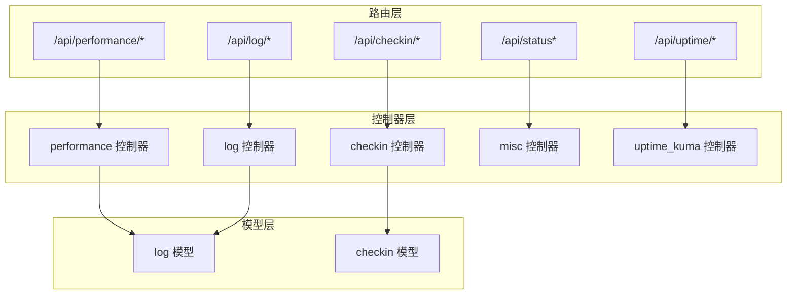
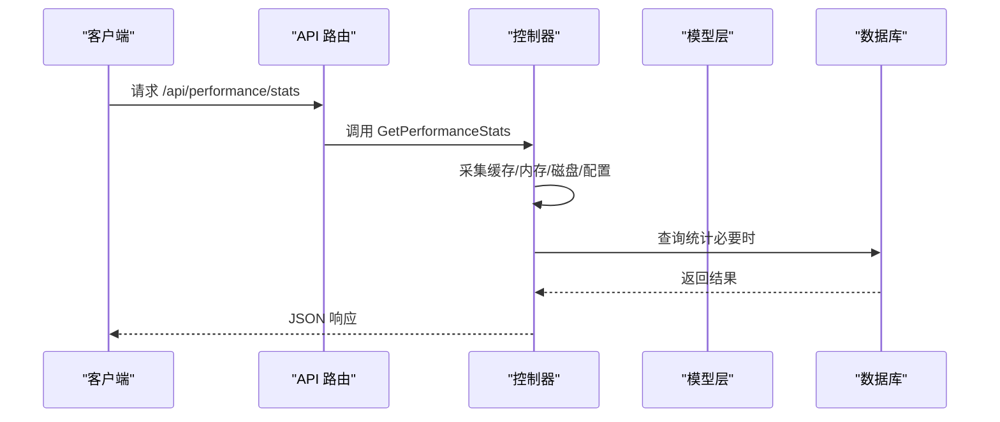
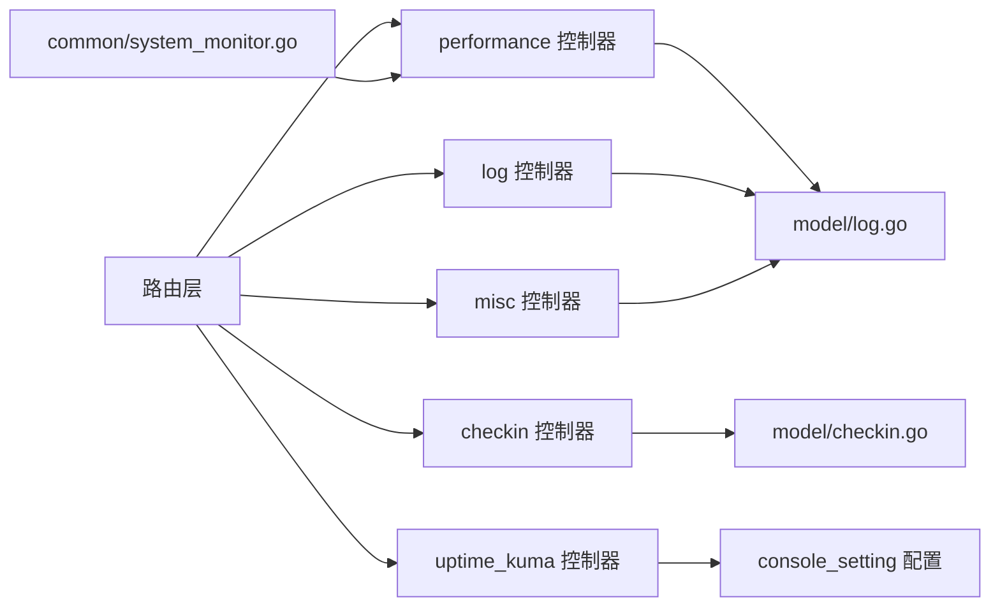

# 系统运维接口

<cite>
**本文引用的文件**
- [router/api-router.go](file://router/api-router.go)
- [controller/performance.go](file://controller/performance.go)
- [controller/log.go](file://controller/log.go)
- [controller/checkin.go](file://controller/checkin.go)
- [controller/misc.go](file://controller/misc.go)
- [controller/uptime_kuma.go](file://controller/uptime_kuma.go)
- [model/log.go](file://model/log.go)
- [model/checkin.go](file://model/checkin.go)
- [common/system_monitor.go](file://common/system_monitor.go)
- [docs/openapi/api.json](file://docs/openapi/api.json)
</cite>

## 目录
1. [简介](#简介)
2. [项目结构](#项目结构)
3. [核心组件](#核心组件)
4. [架构总览](#架构总览)
5. [详细组件分析](#详细组件分析)
6. [依赖分析](#依赖分析)
7. [性能考量](#性能考量)
8. [故障排查指南](#故障排查指南)
9. [结论](#结论)
10. [附录](#附录)

## 简介
本文件面向 New API 的系统运维接口，覆盖系统状态监控、日志管理、签到功能、公告与 FAQ 展示、Uptime Kuma 健康检查集成、性能统计与维护等运维能力。文档提供各端点的 HTTP 方法、URL 路径、请求参数、响应格式与状态码，并给出典型场景的请求/响应示例与实现要点，帮助开发者快速理解并实现完整的系统运维体系。

## 项目结构
系统运维接口主要通过统一的 API 路由注册，按功能域分组，配合控制器层完成业务逻辑与数据访问。

图表来源
- [router/api-router.go:190-379](file://router/api-router.go#L190-L379)
- [controller/performance.go:82-386](file://controller/performance.go#L82-L386)
- [controller/log.go:13-172](file://controller/log.go#L13-L172)
- [controller/checkin.go:15-73](file://controller/checkin.go#L15-L73)
- [controller/misc.go:23-167](file://controller/misc.go#L23-L167)
- [controller/uptime_kuma.go:131-156](file://controller/uptime_kuma.go#L131-L156)
- [model/log.go:19-482](file://model/log.go#L19-L482)
- [model/checkin.go:13-180](file://model/checkin.go#L13-L180)

章节来源
- [router/api-router.go:190-379](file://router/api-router.go#L190-L379)

## 核心组件
- 性能监控与维护：提供系统性能统计、磁盘缓存清理、GC 触发、日志文件列表与清理等运维能力。
- 日志管理：提供全站/用户日志查询、统计聚合、历史清理等能力。
- 签到功能：提供签到状态查询与签到执行，支持配额奖励与统计。
- 系统状态与公告：提供系统状态查询、公告与 FAQ 展示、Uptime Kuma 健康状态拉取。
- 健康检查：提供轻量健康探测与数据库连通性检测。

章节来源
- [controller/performance.go:82-386](file://controller/performance.go#L82-L386)
- [controller/log.go:13-172](file://controller/log.go#L13-L172)
- [controller/checkin.go:15-73](file://controller/checkin.go#L15-L73)
- [controller/misc.go:23-167](file://controller/misc.go#L23-L167)
- [controller/uptime_kuma.go:131-156](file://controller/uptime_kuma.go#L131-L156)

## 架构总览
系统运维接口采用“路由 -> 控制器 -> 模型”的分层设计，控制器负责参数解析、鉴权与调用模型层，模型层封装数据库与外部系统交互。

图表来源
- [router/api-router.go:190-199](file://router/api-router.go#L190-L199)
- [controller/performance.go:82-140](file://controller/performance.go#L82-L140)

## 详细组件分析

### 性能监控与维护接口
- 接口概览
  - GET /api/performance/stats：获取系统性能统计（缓存、内存、磁盘、配置）
  - DELETE /api/performance/disk_cache：清理不活跃磁盘缓存
  - POST /api/performance/reset_stats：重置性能统计
  - POST /api/performance/gc：强制触发 GC
  - GET /api/performance/logs：获取日志文件列表
  - DELETE /api/performance/logs：按数量或天数清理日志文件

- 请求参数与响应
  - GET /api/performance/stats
    - 成功响应包含缓存统计、内存统计、磁盘缓存信息、磁盘空间信息、配置信息
    - 状态码：200
  - DELETE /api/performance/disk_cache
    - 成功响应提示清理完成
    - 状态码：200
  - POST /api/performance/reset_stats
    - 成功响应提示重置完成
    - 状态码：200
  - POST /api/performance/gc
    - 成功响应提示 GC 已执行
    - 状态码：200
  - GET /api/performance/logs
    - 成功响应包含日志目录、启用状态、文件数量、总大小、最老/最新时间、文件列表
    - 状态码：200
  - DELETE /api/performance/logs
    - 参数：mode（by_count 或 by_days）、value（正整数）
    - 成功响应包含删除数量、释放字节数、失败文件列表（若存在）
    - 状态码：200 或 200（含失败明细）

- 实现要点
  - 性能统计通过原子缓存的系统状态与配置读取，避免频繁系统调用
  - 磁盘缓存清理基于时间阈值，避免影响进行中的请求
  - 日志清理支持两种模式：按文件数量保留最新 N 个；按天数清理早于阈值的日志

章节来源
- [router/api-router.go:190-199](file://router/api-router.go#L190-L199)
- [controller/performance.go:82-386](file://controller/performance.go#L82-L386)

### 日志管理接口
- 接口概览
  - GET /api/log：管理员查询全站日志
  - DELETE /api/log：管理员删除历史日志（按目标时间戳）
  - GET /api/log/stat：管理员统计全站消耗指标
  - GET /api/log/self/stat：用户查询自身消耗统计
  - GET /api/log/self：用户查询自身日志
  - GET /api/log/channel_affinity_usage_cache：获取通道亲和度用量缓存统计（管理员）

- 请求参数与响应
  - GET /api/log
    - 查询参数：type、start_timestamp、end_timestamp、model_name、username、token_name、channel、group、request_id
    - 成功响应为分页对象，包含日志列表与总数
    - 状态码：200
  - DELETE /api/log
    - 查询参数：target_timestamp（必需）
    - 成功响应包含删除条数
    - 状态码：200
  - GET /api/log/stat
    - 查询参数：type、start_timestamp、end_timestamp、model_name、username、token_name、channel、group
    - 成功响应包含配额、RPM、TPM
    - 状态码：200
  - GET /api/log/self/stat
    - 查询参数同上
    - 成功响应包含当前用户配额、RPM、TPM
    - 状态码：200
  - GET /api/log/self
    - 查询参数：type、start_timestamp、end_timestamp、model_name、token_name、group、request_id
    - 成功响应为分页对象
    - 状态码：200
  - GET /api/log/channel_affinity_usage_cache
    - 成功响应包含缓存统计
    - 状态码：200

- 实现要点
  - 日志表包含多维索引，支持按用户、模型、令牌、时间、通道、分组、请求 ID 等条件过滤
  - 统计接口对最近 60 秒内的 RPM/TPM 进行聚合，避免长周期统计带来的偏差
  - 用户侧日志查询受权限控制，且对敏感字段进行脱敏处理

章节来源
- [router/api-router.go:284-292](file://router/api-router.go#L284-L292)
- [controller/log.go:13-172](file://controller/log.go#L13-L172)
- [model/log.go:246-482](file://model/log.go#L246-L482)

### 签到功能接口
- 接口概览
  - GET /api/checkin/status：获取用户签到状态与历史统计（支持按月查询）
  - POST /api/checkin：执行用户签到，发放随机额度奖励

- 请求参数与响应
  - GET /api/checkin/status
    - 查询参数：month（默认当前年-月）
    - 成功响应包含 enabled、min_quota、max_quota、stats（含累计配额、累计签到次数、本月签到次数、今日是否已签到、签到记录）
    - 状态码：200
  - POST /api/checkin
    - 成功响应包含奖励配额与签到日期
    - 失败响应包含错误信息（如未启用、今日已签到、额度更新失败等）
    - 状态码：200

- 实现要点
  - 签到功能受配置开关控制，每日仅一次有效
  - 奖励配额在最小值与最大值之间随机产生
  - 事务/顺序操作保证签到记录与额度更新的原子性

章节来源
- [router/api-router.go:200-205](file://router/api-router.go#L200-L205)
- [controller/checkin.go:15-73](file://controller/checkin.go#L15-L73)
- [model/checkin.go:52-180](file://model/checkin.go#L52-L180)

### 系统状态与公告接口
- 接口概览
  - GET /api/status：获取系统状态与面板开关、公告、FAQ、API 信息等
  - GET /api/status/test：健康检查（管理员）

- 请求参数与响应
  - GET /api/status
    - 成功响应包含版本、启动时间、功能开关、面板开关（api_info_enabled、uptime_kuma_enabled、announcements_enabled、faq_enabled）、公告、FAQ、API 信息等
    - 状态码：200
  - GET /api/status/test
    - 成功响应包含服务运行状态与 HTTP 统计
    - 状态码：200

- 实现要点
  - 系统状态接口根据面板开关动态注入公告、FAQ、API 信息
  - 健康检查包含数据库连通性检测

章节来源
- [router/api-router.go:179-189](file://router/api-router.go#L179-L189)
- [controller/misc.go:23-167](file://controller/misc.go#L23-L167)

### Uptime Kuma 健康检查接口
- 接口概览
  - GET /api/uptime/status：拉取 Uptime Kuma 状态页的监控分组与心跳状态

- 请求参数与响应
  - GET /api/uptime/status
    - 成功响应包含分组名称与监控列表，每项包含监控名称、分组、可用率、状态
    - 状态码：200

- 实现要点
  - 并行拉取状态页与心跳接口，聚合返回
  - 支持多组配置，按组并行获取

章节来源
- [router/api-router.go:177-179](file://router/api-router.go#L177-L179)
- [controller/uptime_kuma.go:131-156](file://controller/uptime_kuma.go#L131-L156)

## 依赖分析
- 路由到控制器
  - /api/performance/* → performance 控制器
  - /api/log/* → log 控制器
  - /api/checkin/* → checkin 控制器
  - /api/status* → misc 控制器
  - /api/uptime/* → uptime_kuma 控制器

- 控制器到模型
  - performance 控制器 → model/log.go（日志统计与清理）
  - log 控制器 → model/log.go（日志查询、统计、清理）
  - checkin 控制器 → model/checkin.go（签到记录与统计）
  - misc 控制器 → model/log.go（健康检查时的日志统计）
  - uptime_kuma 控制器 → console_setting（配置读取）

- 系统监控
  - common/system_monitor.go 提供系统状态采集与缓存，供性能接口复用

图表来源
- [router/api-router.go:190-379](file://router/api-router.go#L190-L379)
- [controller/performance.go:82-140](file://controller/performance.go#L82-L140)
- [controller/log.go:13-172](file://controller/log.go#L13-L172)
- [controller/checkin.go:15-73](file://controller/checkin.go#L15-L73)
- [controller/misc.go:23-167](file://controller/misc.go#L23-L167)
- [controller/uptime_kuma.go:131-156](file://controller/uptime_kuma.go#L131-L156)
- [model/log.go:246-482](file://model/log.go#L246-L482)
- [model/checkin.go:52-180](file://model/checkin.go#L52-L180)
- [common/system_monitor.go:36-82](file://common/system_monitor.go#L36-L82)

章节来源
- [router/api-router.go:190-379](file://router/api-router.go#L190-L379)
- [common/system_monitor.go:36-82](file://common/system_monitor.go#L36-L82)

## 性能考量
- 系统监控
  - 通过原子缓存存储最新系统状态，降低频繁系统调用成本
  - 性能接口避免全量扫描磁盘，依赖原子计数器与缓存配置
- 日志统计
  - RPM/TPM 统计限定最近 60 秒窗口，提升实时性与准确性
  - 支持分页与多维过滤，避免一次性返回大量数据
- 磁盘缓存与日志清理
  - 清理策略基于时间阈值与保留策略，避免误删进行中的请求文件
  - 日志清理支持按数量与按天数两种模式，兼顾容量与保留周期

[本节为通用性能建议，无需特定文件引用]

## 故障排查指南
- 健康检查失败
  - 使用 /api/status/test 检查数据库连通性与 HTTP 统计
  - 若返回非 200，优先检查数据库连接与中间件链路
- 性能异常
  - 使用 /api/performance/stats 查看内存、磁盘使用率与缓存状态
  - 如内存持续增长，可调用 /api/performance/gc 强制 GC
  - 如磁盘空间紧张，使用 /api/performance/disk_cache 清理不活跃缓存
- 日志问题
  - 使用 /api/log/stat 与 /api/log/self/stat 核对消耗统计是否异常
  - 使用 /api/performance/logs 查看日志文件数量与大小，必要时清理过期日志
- 签到异常
  - 使用 /api/checkin/status 检查是否已签到、是否启用
  - 若额度未到账，检查签到事务与额度更新流程

章节来源
- [controller/misc.go:23-40](file://controller/misc.go#L23-L40)
- [controller/performance.go:82-176](file://controller/performance.go#L82-L176)
- [controller/log.go:96-172](file://controller/log.go#L96-L172)
- [controller/checkin.go:15-73](file://controller/checkin.go#L15-L73)

## 结论
本文档梳理了 New API 的系统运维接口，覆盖性能监控、日志管理、签到、公告与健康检查等关键运维能力。通过清晰的端点划分、参数与响应规范以及实现要点说明，开发者可快速集成并稳定运行系统运维体系。

[本节为总结性内容，无需特定文件引用]

## 附录

### 端点一览与示例

- GET /api/performance/stats
  - 请求：无
  - 响应：包含 cache_stats、memory_stats、disk_cache_info、disk_space_info、config
  - 示例：成功返回包含各项统计与配置信息的对象
  - 状态码：200

- DELETE /api/performance/disk_cache
  - 请求：无
  - 响应：提示清理完成
  - 状态码：200

- POST /api/performance/reset_stats
  - 请求：无
  - 响应：提示重置完成
  - 状态码：200

- POST /api/performance/gc
  - 请求：无
  - 响应：提示 GC 已执行
  - 状态码：200

- GET /api/performance/logs
  - 请求：无
  - 响应：包含 log_dir、enabled、file_count、total_size、oldest_time、newest_time、files
  - 状态码：200

- DELETE /api/performance/logs?mode=by_count&value=10
  - 请求：mode（by_count 或 by_days）、value（正整数）
  - 响应：deleted_count、freed_bytes、failed_files（若存在）
  - 状态码：200 或 200（含失败明细）

- GET /api/log?type=2&start_timestamp=1700000000&end_timestamp=1700006400
  - 请求：type、start_timestamp、end_timestamp、model_name、username、token_name、channel、group、request_id
  - 响应：分页对象（items、total）
  - 状态码：200

- DELETE /api/log?target_timestamp=1700000000
  - 请求：target_timestamp（必需）
  - 响应：data（删除条数）
  - 状态码：200

- GET /api/log/stat
  - 请求：type、start_timestamp、end_timestamp、model_name、username、token_name、channel、group
  - 响应：quota、rpm、tpm
  - 状态码：200

- GET /api/log/self/stat
  - 请求：type、start_timestamp、end_timestamp、model_name、token_name、channel、group
  - 响应：quota、rpm、tpm
  - 状态码：200

- GET /api/log/self
  - 请求：type、start_timestamp、end_timestamp、model_name、token_name、group、request_id
  - 响应：分页对象（items、total）
  - 状态码：200

- GET /api/checkin/status?month=2025-04
  - 请求：month（默认当前年-月）
  - 响应：enabled、min_quota、max_quota、stats（含累计配额、累计签到次数、本月签到次数、今日是否已签到、签到记录）
  - 状态码：200

- POST /api/checkin
  - 请求：无
  - 响应：quota_awarded、checkin_date
  - 状态码：200

- GET /api/status
  - 请求：无
  - 响应：版本、启动时间、功能开关、面板开关、公告、FAQ、API 信息等
  - 状态码：200

- GET /api/status/test
  - 请求：无
  - 响应：success、message、http_stats
  - 状态码：200

- GET /api/uptime/status
  - 请求：无
  - 响应：categoryName、monitors（name、uptime、status、group）
  - 状态码：200

章节来源
- [router/api-router.go:190-379](file://router/api-router.go#L190-L379)
- [controller/performance.go:82-386](file://controller/performance.go#L82-L386)
- [controller/log.go:13-172](file://controller/log.go#L13-L172)
- [controller/checkin.go:15-73](file://controller/checkin.go#L15-L73)
- [controller/misc.go:23-167](file://controller/misc.go#L23-L167)
- [controller/uptime_kuma.go:131-156](file://controller/uptime_kuma.go#L131-L156)
- [docs/openapi/api.json:127-198](file://docs/openapi/api.json#L127-L198)