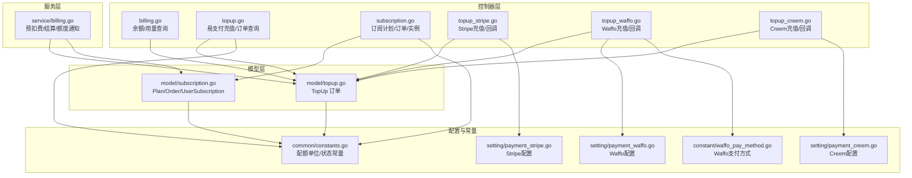
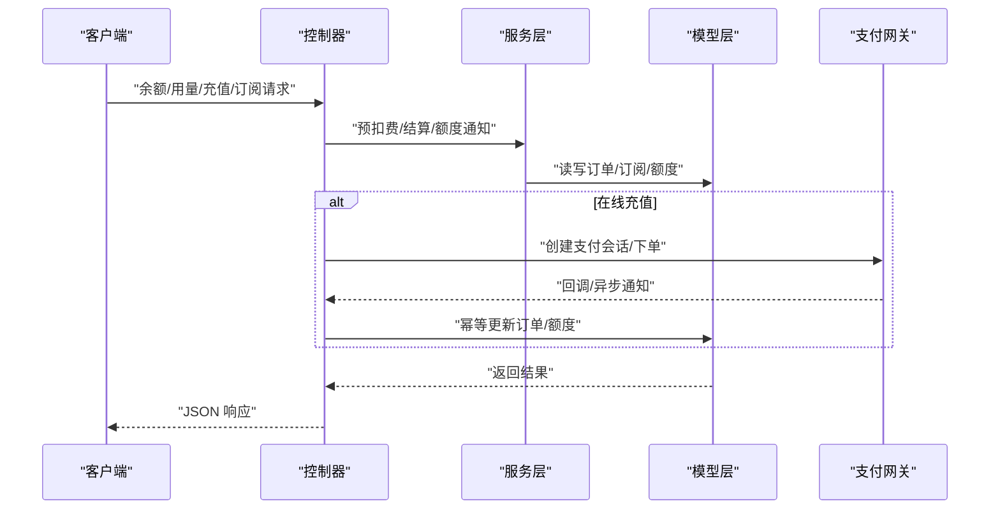
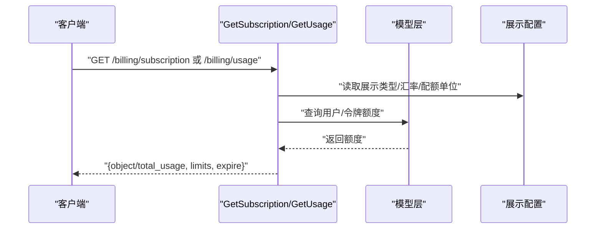
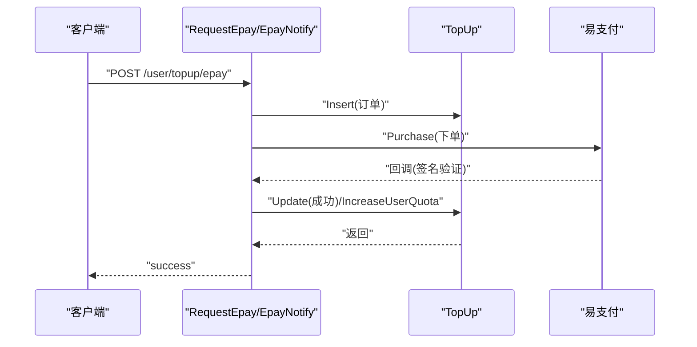
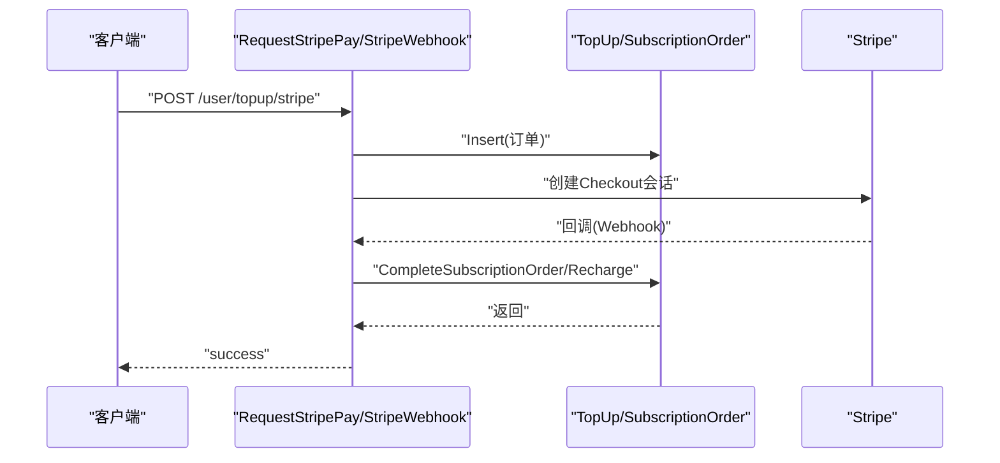
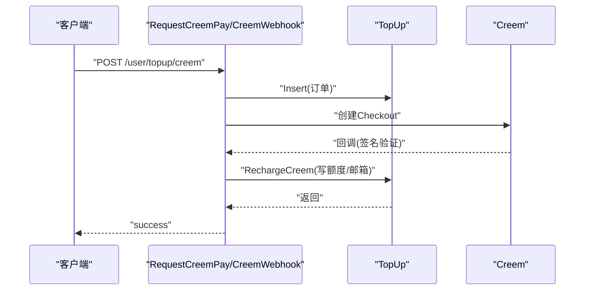
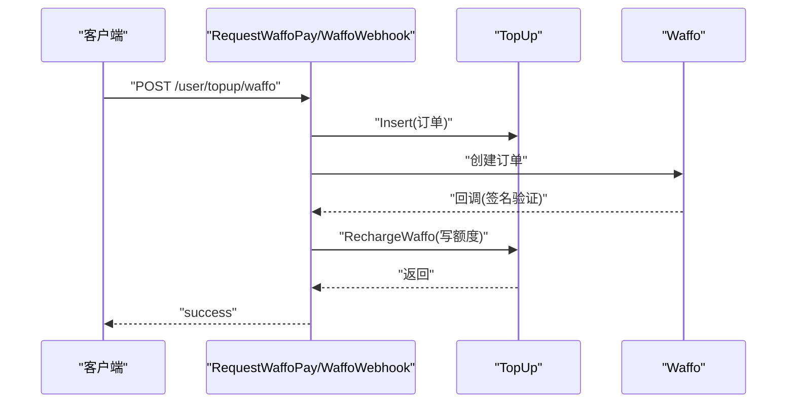
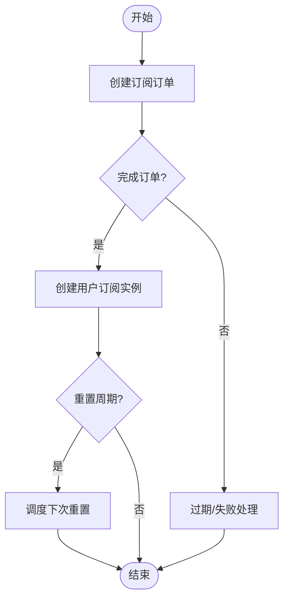
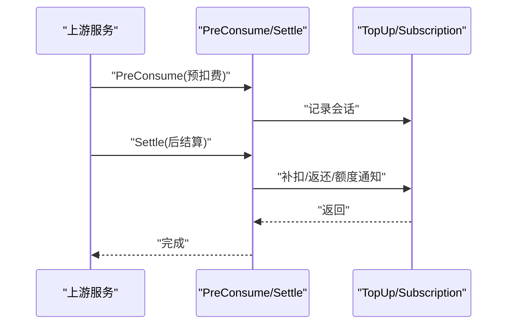
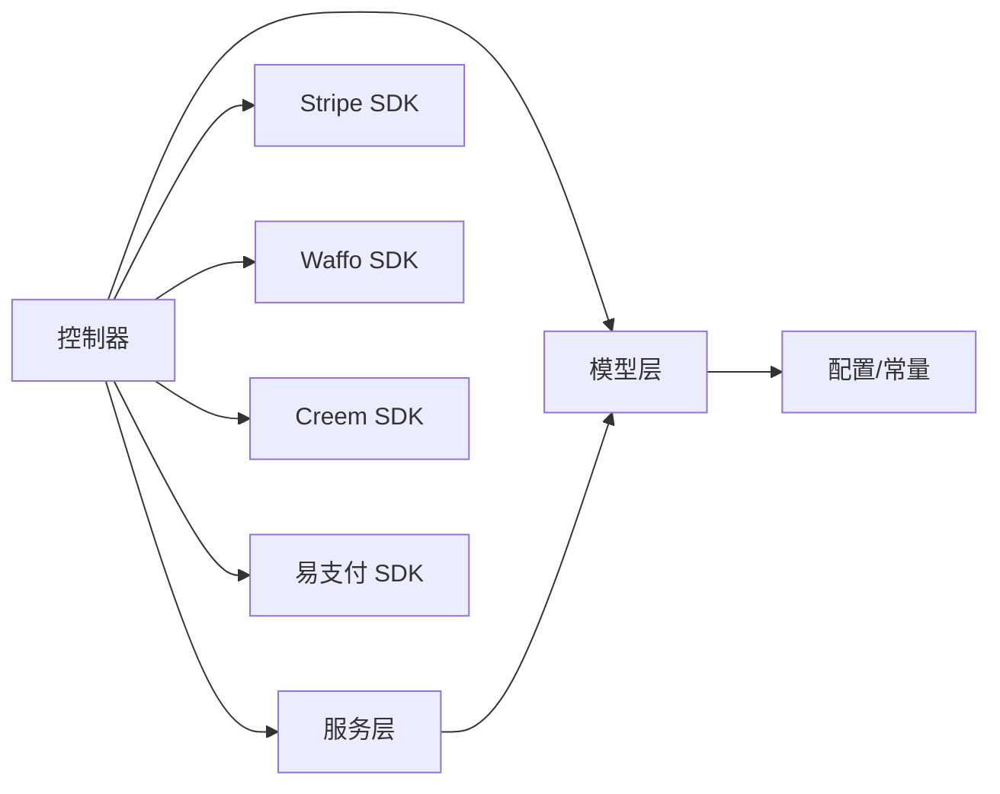

# 计费充值接口

<cite>
**本文引用的文件**
- [billing.go](file://controller/billing.go)
- [topup.go](file://controller/topup.go)
- [subscription.go](file://controller/subscription.go)
- [topup_stripe.go](file://controller/topup_stripe.go)
- [topup_waffo.go](file://controller/topup_waffo.go)
- [topup_creem.go](file://controller/topup_creem.go)
- [billing.go](file://service/billing.go)
- [topup.go](file://model/topup.go)
- [subscription.go](file://model/subscription.go)
- [constants.go](file://common/constants.go)
- [payment_stripe.go](file://setting/payment_stripe.go)
- [payment_waffo.go](file://setting/payment_waffo.go)
- [payment_creem.go](file://setting/payment_creem.go)
- [waffo_pay_method.go](file://constant/waffo_pay_method.go)
- [error.go](file://dto/error.go)
</cite>

## 目录
1. [简介](#简介)
2. [项目结构](#项目结构)
3. [核心组件](#核心组件)
4. [架构总览](#架构总览)
5. [详细组件分析](#详细组件分析)
6. [依赖分析](#依赖分析)
7. [性能考虑](#性能考虑)
8. [故障排查指南](#故障排查指南)
9. [结论](#结论)
10. [附录](#附录)

## 简介
本文件面向 New API 的计费充值体系，提供完整的余额管理、在线充值、订阅管理、使用统计等接口规范。文档覆盖以下能力：
- 余额查询与使用统计（兼容 OpenAI 计费接口风格）
- 在线充值（易支付、Stripe、Creem、Waffo）
- 订阅购买与管理（计划、订单、实例、重置策略）
- 订单管理与对账（回调、幂等、补单）
- 财务与风控（汇率/折扣、最小充值、支付方式校验、并发锁）
- 开发者示例与最佳实践

## 项目结构
计费充值相关代码主要分布在以下模块：
- 控制器层：负责路由、参数校验、调用服务层与第三方 SDK
- 服务层：封装计费会话、预扣费/结算、额度通知
- 模型层：订单、用户订阅、额度持久化
- 设置与常量：支付网关配置、展示类型、汇率等

图表来源
- [billing.go:1-109](file://controller/billing.go#L1-L109)
- [topup.go:1-471](file://controller/topup.go#L1-L471)
- [subscription.go:1-384](file://controller/subscription.go#L1-L384)
- [topup_stripe.go:1-427](file://controller/topup_stripe.go#L1-L427)
- [topup_waffo.go:1-381](file://controller/topup_waffo.go#L1-L381)
- [topup_creem.go:1-466](file://controller/topup_creem.go#L1-L466)
- [billing.go:1-79](file://service/billing.go#L1-L79)
- [topup.go:1-452](file://model/topup.go#L1-L452)
- [subscription.go:1-800](file://model/subscription.go#L1-L800)
- [constants.go:20-219](file://common/constants.go#L20-L219)
- [payment_stripe.go:1-9](file://setting/payment_stripe.go#L1-L9)
- [payment_waffo.go:1-68](file://setting/payment_waffo.go#L1-L68)
- [payment_creem.go:1-7](file://setting/payment_creem.go#L1-L7)
- [waffo_pay_method.go:1-17](file://constant/waffo_pay_method.go#L1-L17)

章节来源
- [billing.go:1-109](file://controller/billing.go#L1-L109)
- [topup.go:1-471](file://controller/topup.go#L1-L471)
- [subscription.go:1-384](file://controller/subscription.go#L1-L384)
- [topup_stripe.go:1-427](file://controller/topup_stripe.go#L1-L427)
- [topup_waffo.go:1-381](file://controller/topup_waffo.go#L1-L381)
- [topup_creem.go:1-466](file://controller/topup_creem.go#L1-L466)
- [billing.go:1-79](file://service/billing.go#L1-L79)
- [topup.go:1-452](file://model/topup.go#L1-L452)
- [subscription.go:1-800](file://model/subscription.go#L1-L800)
- [constants.go:20-219](file://common/constants.go#L20-L219)
- [payment_stripe.go:1-9](file://setting/payment_stripe.go#L1-L9)
- [payment_waffo.go:1-68](file://setting/payment_waffo.go#L1-L68)
- [payment_creem.go:1-7](file://setting/payment_creem.go#L1-L7)
- [waffo_pay_method.go:1-17](file://constant/waffo_pay_method.go#L1-L17)

## 核心组件
- 余额与用量查询：提供 OpenAI 兼容的订阅与用量接口，支持按展示类型（USD/CNY/TOKENS）换算
- 在线充值：统一入口聚合易支付、Stripe、Creem、Waffo，含最小充值、折扣、汇率、并发锁
- 订阅管理：计划、订单、用户订阅实例、重置周期、升级分组、到期/失效/删除
- 计费会话：预扣费、后结算、额度通知，兼容旧路径与新路径
- 错误与对账：统一封装错误响应、回调验签、幂等处理、管理员补单

章节来源
- [billing.go:11-108](file://controller/billing.go#L11-L108)
- [topup.go:25-471](file://controller/topup.go#L25-L471)
- [subscription.go:26-384](file://controller/subscription.go#L26-L384)
- [billing.go:17-79](file://service/billing.go#L17-L79)
- [topup.go:14-452](file://model/topup.go#L14-L452)
- [subscription.go:145-800](file://model/subscription.go#L145-L800)

## 架构总览
计费充值整体流程分为“前端调用—控制器—服务层—模型层—第三方支付网关”的链路。

图表来源
- [billing.go:11-108](file://controller/billing.go#L11-L108)
- [topup.go:166-396](file://controller/topup.go#L166-L396)
- [topup_stripe.go:68-126](file://controller/topup_stripe.go#L68-L126)
- [topup_waffo.go:103-270](file://controller/topup_waffo.go#L103-L270)
- [topup_creem.go:68-144](file://controller/topup_creem.go#L68-L144)
- [billing.go:17-79](file://service/billing.go#L17-L79)
- [topup.go:14-452](file://model/topup.go#L14-L452)
- [subscription.go:195-572](file://model/subscription.go#L195-L572)

## 详细组件分析

### 余额与用量查询
- 接口目标：兼容 OpenAI 计费接口风格，返回订阅限额与已用额度
- 关键逻辑：
  - 展示类型切换：USD/CNY/TOKENS，分别按配额单位换算
  - 令牌统计开关：可按令牌维度显示
  - 无限额度：特殊标记
- 返回字段：对象类型、限额（软/硬/系统）、到期时间、总量换算

图表来源
- [billing.go:11-108](file://controller/billing.go#L11-L108)
- [constants.go:20-219](file://common/constants.go#L20-L219)

章节来源
- [billing.go:11-108](file://controller/billing.go#L11-L108)
- [constants.go:20-219](file://common/constants.go#L20-L219)

### 在线充值（易支付）
- 功能概览：根据展示类型计算应付金额，支持最小充值、折扣、分组倍率
- 支付流程：
  - 生成订单（状态 pending）
  - 调用易支付 SDK 拉起支付
  - 回调验签通过后，幂等更新订单与用户额度
- 并发控制：基于 trade_no 的互斥锁，避免重复入账
- 管理员补单：手动标记成功并入账

图表来源
- [topup.go:166-396](file://controller/topup.go#L166-L396)
- [topup.go:14-452](file://model/topup.go#L14-L452)

章节来源
- [topup.go:25-471](file://controller/topup.go#L25-L471)
- [topup.go:14-452](file://model/topup.go#L14-L452)

### 在线充值（Stripe）
- 功能概览：使用 Stripe Checkout 会话完成支付，支持促销码、最小充值、分组倍率、折扣
- 支付流程：
  - 生成参考号（referenceId），创建订单
  - 生成 Checkout URL，跳转支付
  - Webhook 验签后，先尝试订阅订单完成，否则走充值入账
- 异步支付：银行转账等延迟支付失败时标记失败

图表来源
- [topup_stripe.go:68-187](file://controller/topup_stripe.go#L68-L187)
- [topup_stripe.go:189-388](file://controller/topup_stripe.go#L189-L388)
- [subscription.go:508-572](file://model/subscription.go#L508-L572)
- [topup.go:60-111](file://model/topup.go#L60-L111)

章节来源
- [topup_stripe.go:1-427](file://controller/topup_stripe.go#L1-L427)
- [subscription.go:195-572](file://model/subscription.go#L195-L572)
- [payment_stripe.go:1-9](file://setting/payment_stripe.go#L1-L9)

### 在线充值（Creem）
- 功能概览：按产品配置直充额度，支持测试模式、签名验签、回调处理
- 支付流程：
  - 选择产品，创建订单
  - 调用 Creem API 生成支付链接
  - Webhook 验签后，按订单类型处理（订阅/充值），充值时写入额度与邮箱

图表来源
- [topup_creem.go:68-144](file://controller/topup_creem.go#L68-L144)
- [topup_creem.go:232-366](file://controller/topup_creem.go#L232-L366)
- [topup.go:315-388](file://model/topup.go#L315-L388)

章节来源
- [topup_creem.go:1-466](file://controller/topup_creem.go#L1-L466)
- [payment_creem.go:1-7](file://setting/payment_creem.go#L1-L7)

### 在线充值（Waffo）
- 功能概览：支持多支付方式、沙箱/生产、零小数币种、最小充值、折扣、分组倍率
- 支付流程：
  - 选择支付方式，创建订单
  - 调用 Waffo SDK 创建订单，获取支付链接
  - Webhook 验签后，充值入账

图表来源
- [topup_waffo.go:103-270](file://controller/topup_waffo.go#L103-L270)
- [topup_waffo.go:288-381](file://controller/topup_waffo.go#L288-L381)
- [topup.go:390-451](file://model/topup.go#L390-L451)
- [payment_waffo.go:1-68](file://setting/payment_waffo.go#L1-L68)
- [waffo_pay_method.go:1-17](file://constant/waffo_pay_method.go#L1-L17)

章节来源
- [topup_waffo.go:1-381](file://controller/topup_waffo.go#L1-L381)
- [payment_waffo.go:1-68](file://setting/payment_waffo.go#L1-L68)
- [waffo_pay_method.go:1-17](file://constant/waffo_pay_method.go#L1-L17)

### 订阅管理
- 计划管理：增删改查、启用/禁用、排序、重置周期、升级分组
- 订单与实例：创建订单、完成订单（订阅/充值）、过期/失败/取消/删除
- 用户订阅：查询有效/全部订阅、额度重置策略、分组升降级

图表来源
- [subscription.go:26-384](file://controller/subscription.go#L26-L384)
- [subscription.go:508-798](file://model/subscription.go#L508-L798)

章节来源
- [subscription.go:1-384](file://controller/subscription.go#L1-L384)
- [subscription.go:145-800](file://model/subscription.go#L145-L800)

### 计费会话与结算
- 预扣费：根据用户计费偏好创建会话，预扣额度
- 后结算：比较预扣与实际消耗，补扣/返还，发送额度通知
- 兼容路径：无会话时回退到旧的按次计费路径

图表来源
- [billing.go:17-79](file://service/billing.go#L17-L79)

章节来源
- [billing.go:1-79](file://service/billing.go#L1-L79)

## 依赖分析
- 控制器依赖服务层进行计费会话与结算，依赖模型层进行订单/订阅持久化
- 支付网关 SDK 仅在对应控制器内使用，避免全局耦合
- 配置集中于 setting 与 constant，便于运行时切换与热更新

图表来源
- [topup_stripe.go:1-427](file://controller/topup_stripe.go#L1-L427)
- [topup_waffo.go:1-381](file://controller/topup_waffo.go#L1-L381)
- [topup_creem.go:1-466](file://controller/topup_creem.go#L1-L466)
- [topup.go:1-471](file://controller/topup.go#L1-L471)
- [billing.go:1-79](file://service/billing.go#L1-L79)
- [topup.go:1-452](file://model/topup.go#L1-L452)
- [subscription.go:1-800](file://model/subscription.go#L1-L800)
- [constants.go:20-219](file://common/constants.go#L20-L219)

章节来源
- [topup_stripe.go:1-427](file://controller/topup_stripe.go#L1-L427)
- [topup_waffo.go:1-381](file://controller/topup_waffo.go#L1-L381)
- [topup_creem.go:1-466](file://controller/topup_creem.go#L1-L466)
- [topup.go:1-471](file://controller/topup.go#L1-L471)
- [billing.go:1-79](file://service/billing.go#L1-L79)
- [topup.go:1-452](file://model/topup.go#L1-L452)
- [subscription.go:1-800](file://model/subscription.go#L1-L800)
- [constants.go:20-219](file://common/constants.go#L20-L219)

## 性能考虑
- 并发安全：订单级互斥锁（基于 trade_no）避免重复入账与竞态
- 事务一致性：充值与额度更新在数据库事务内完成，保证原子性
- 缓存与重试：订阅计划缓存支持内存+Redis，降低查询开销
- 限额与风控：全局/用户级限流、最小充值校验、支付方式白名单

## 故障排查指南
- 回调验签失败：检查支付网关签名密钥与回调地址配置
- 订单状态异常：核对 pending/success/failed/expired 状态流转
- 幂等问题：确认 trade_no 唯一性与互斥锁生效
- 管理员补单：使用补单接口，确保订单状态为 pending
- 错误响应：统一使用通用错误结构，便于前端解析

章节来源
- [topup.go:283-370](file://controller/topup.go#L283-L370)
- [topup_stripe.go:148-187](file://controller/topup_stripe.go#L148-L187)
- [topup_waffo.go:288-337](file://controller/topup_waffo.go#L288-L337)
- [topup_creem.go:232-284](file://controller/topup_creem.go#L232-L284)
- [error.go:17-94](file://dto/error.go#L17-L94)

## 结论
本计费充值体系以控制器-服务-模型分层设计，结合多种支付网关与灵活的展示类型，满足多币种、多额度单位的计费需求。通过严格的并发控制、幂等处理与对账机制，保障交易一致性与可追溯性。建议在生产环境中完善监控告警、日志审计与风控策略，持续优化用户体验与系统稳定性。

## 附录

### 接口清单与规范

- 余额查询
  - 方法与路径：GET /billing/subscription
  - 请求参数：无
  - 响应字段：对象类型、限额（软/硬/系统）、到期时间、额度换算
  - 示例：见“余额查询示例”

- 用量查询
  - 方法与路径：GET /billing/usage
  - 请求参数：无
  - 响应字段：对象类型、总用量（cent）
  - 示例：见“用量查询示例”

- 易支付充值
  - 方法与路径：POST /user/topup/epay
  - 请求体：amount, payment_method
  - 响应：支付链接与参数
  - 回调：POST/GET 回调，验签后更新订单与额度
  - 示例：见“易支付充值示例”

- Stripe 充值
  - 方法与路径：POST /user/topup/stripe
  - 请求体：amount, payment_method, success_url, cancel_url
  - 响应：支付链接
  - 回调：Webhook 验签后完成订单或充值
  - 示例：见“Stripe 充值示例”

- Creem 充值
  - 方法与路径：POST /user/topup/creem
  - 请求体：product_id, payment_method
  - 响应：支付链接与订单号
  - 回调：Webhook 验签后充值入账
  - 示例：见“Creem 充值示例”

- Waffo 充值
  - 方法与路径：POST /user/topup/waffo
  - 请求体：amount, pay_method_index/pay_method_type/pay_method_name
  - 响应：支付链接与订单号
  - 回调：Webhook 验签后充值入账
  - 示例：见“Waffo 充值示例”

- 订阅计划
  - 方法与路径：GET /subscription/plans
  - 响应：启用的订阅计划列表
  - 示例：见“订阅计划示例”

- 订阅购买
  - 方法与路径：POST /subscription/orders
  - 请求体：plan_id, payment_method
  - 响应：订单号
  - 回调：Webhook 完成订阅实例创建
  - 示例：见“订阅购买示例”

- 订阅查询
  - 方法与路径：GET /subscription/self
  - 响应：计费偏好、有效订阅、全部订阅
  - 示例：见“订阅查询示例”

- 订单查询
  - 方法与路径：GET /user/topups
  - 查询参数：keyword（订单号模糊）、page/page_size
  - 响应：分页订单列表
  - 示例：见“订单查询示例”

- 管理员补单
  - 方法与路径：POST /admin/topup/complete
  - 请求体：trade_no
  - 响应：成功
  - 示例：见“管理员补单示例”

- 管理员订阅管理
  - 方法与路径：POST /admin/subscription/bind
  - 请求体：user_id, plan_id
  - 响应：成功或提示信息
  - 示例：见“管理员绑定订阅示例”

章节来源
- [billing.go:11-108](file://controller/billing.go#L11-L108)
- [topup.go:25-471](file://controller/topup.go#L25-L471)
- [topup_stripe.go:68-187](file://controller/topup_stripe.go#L68-L187)
- [topup_waffo.go:103-270](file://controller/topup_waffo.go#L103-L270)
- [topup_creem.go:68-144](file://controller/topup_creem.go#L68-L144)
- [subscription.go:26-384](file://controller/subscription.go#L26-L384)

### 业务规则与算法

- 配额换算
  - 展示类型为 TOKENS：amount = tokens
  - 展示类型为 CNY：amount = quota / 单位 * 汇率
  - 展示类型为 USD：amount = quota / 单位
- 最小充值
  - 不同支付方式最小充值阈值不同，按展示类型换算
- 折扣与分组倍率
  - 按用户分组倍率与预设折扣计算应付金额
- 并发锁
  - 基于 trade_no 的互斥锁，确保同一订单幂等处理
- 订阅重置
  - 支持每日/每周/每月/自定义周期重置额度

章节来源
- [billing.go:48-66](file://controller/billing.go#L48-L66)
- [topup.go:126-164](file://controller/topup.go#L126-L164)
- [topup_stripe.go:399-426](file://controller/topup_stripe.go#L399-L426)
- [topup_waffo.go:77-93](file://controller/topup_waffo.go#L77-L93)
- [subscription.go:299-347](file://model/subscription.go#L299-L347)

### 请求与响应示例（路径引用）

- 余额查询示例
  - 请求：GET /billing/subscription
  - 响应：包含对象类型、限额、到期时间
  - 参考路径：[billing.go:59-67](file://controller/billing.go#L59-L67)

- 用量查询示例
  - 请求：GET /billing/usage
  - 响应：包含对象类型、总用量
  - 参考路径：[billing.go:102-106](file://controller/billing.go#L102-L106)

- 易支付充值示例
  - 请求：POST /user/topup/epay
  - 响应：支付链接与参数
  - 回调：验签后更新订单与额度
  - 参考路径：[topup.go:166-239](file://controller/topup.go#L166-L239), [topup.go:283-370](file://controller/topup.go#L283-L370)

- Stripe 充值示例
  - 请求：POST /user/topup/stripe
  - 响应：支付链接
  - 回调：Webhook 完成订单或充值
  - 参考路径：[topup_stripe.go:68-126](file://controller/topup_stripe.go#L68-L126), [topup_stripe.go:148-286](file://controller/topup_stripe.go#L148-L286)

- Creem 充值示例
  - 请求：POST /user/topup/creem
  - 响应：支付链接与订单号
  - 回调：Webhook 验签后充值入账
  - 参考路径：[topup_creem.go:68-144](file://controller/topup_creem.go#L68-L144), [topup_creem.go:232-366](file://controller/topup_creem.go#L232-L366)

- Waffo 充值示例
  - 请求：POST /user/topup/waffo
  - 响应：支付链接与订单号
  - 回调：Webhook 验签后充值入账
  - 参考路径：[topup_waffo.go:103-270](file://controller/topup_waffo.go#L103-L270), [topup_waffo.go:288-368](file://controller/topup_waffo.go#L288-L368)

- 订阅计划示例
  - 请求：GET /subscription/plans
  - 响应：订阅计划列表
  - 参考路径：[subscription.go:26-39](file://controller/subscription.go#L26-L39)

- 订阅购买示例
  - 请求：POST /subscription/orders
  - 响应：订单号
  - 回调：Webhook 完成订阅实例创建
  - 参考路径：[subscription.go:285-301](file://controller/subscription.go#L285-L301), [subscription.go:508-572](file://model/subscription.go#L508-L572)

- 订阅查询示例
  - 请求：GET /subscription/self
  - 响应：计费偏好、有效订阅、全部订阅
  - 参考路径：[subscription.go:41-63](file://controller/subscription.go#L41-L63)

- 订单查询示例
  - 请求：GET /user/topups
  - 查询参数：keyword、page、page_size
  - 响应：分页订单列表
  - 参考路径：[topup.go:398-421](file://controller/topup.go#L398-L421)

- 管理员补单示例
  - 请求：POST /admin/topup/complete
  - 请求体：trade_no
  - 响应：成功
  - 参考路径：[topup.go:452-469](file://controller/topup.go#L452-L469)

- 管理员绑定订阅示例
  - 请求：POST /admin/subscription/bind
  - 请求体：user_id, plan_id
  - 响应：成功或提示信息
  - 参考路径：[subscription.go:285-301](file://controller/subscription.go#L285-L301)