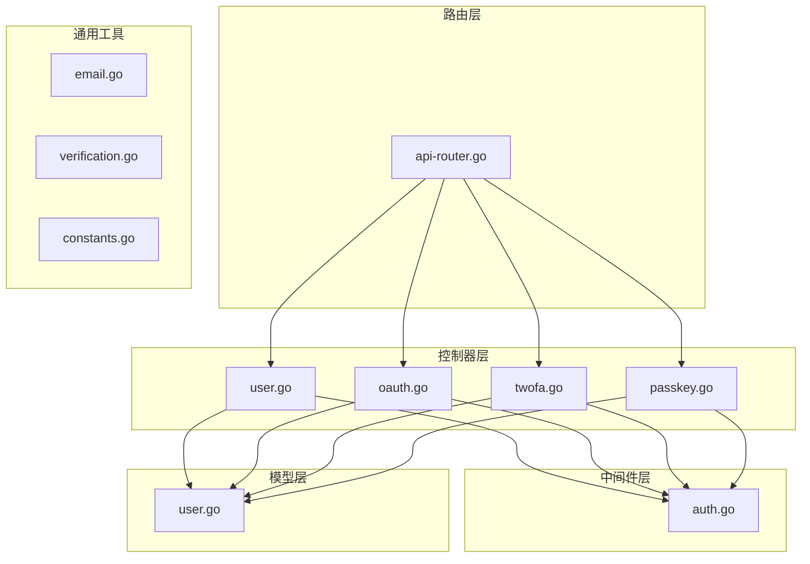
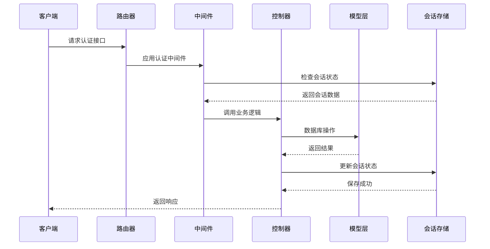

# 认证相关接口

<cite>
**本文档引用的文件**
- [api-router.go](file://router/api-router.go)
- [user.go](file://controller/user.go)
- [oauth.go](file://controller/oauth.go)
- [twofa.go](file://controller/twofa.go)
- [passkey.go](file://controller/passkey.go)
- [auth.go](file://middleware/auth.go)
- [email.go](file://common/email.go)
- [verification.go](file://common/verification.go)
- [user.go](file://model/user.go)
- [context_key.go](file://constant/context_key.go)
- [constants.go](file://common/constants.go)
</cite>

## 目录
1. [简介](#简介)
2. [项目结构](#项目结构)
3. [核心组件](#核心组件)
4. [架构概览](#架构概览)
5. [详细组件分析](#详细组件分析)
6. [依赖分析](#依赖分析)
7. [性能考虑](#性能考虑)
8. [故障排除指南](#故障排除指南)
9. [结论](#结论)

## 简介

本文档详细描述了 New API 的认证相关接口，涵盖了用户注册、登录、登出、两步验证、Passkey 登录、OAuth 登录等完整的认证流程。文档提供了每个端点的 HTTP 方法、URL 路径、请求参数、响应格式和状态码，并包含完整的请求响应示例、认证机制说明、JWT 令牌管理、权限要求和安全考虑。

## 项目结构

New API 的认证系统采用模块化设计，主要分布在以下目录：



**图表来源**
- [api-router.go:14-380](file://router/api-router.go#L14-L380)
- [user.go:1-1246](file://controller/user.go#L1-L1246)
- [oauth.go:1-363](file://controller/oauth.go#L1-L363)
- [twofa.go:1-555](file://controller/twofa.go#L1-L555)
- [passkey.go:1-507](file://controller/passkey.go#L1-L507)

**章节来源**
- [api-router.go:14-380](file://router/api-router.go#L14-L380)

## 核心组件

### 认证中间件

系统实现了多层认证机制：

1. **会话认证**：基于 Gin Sessions 的传统 Web 应用认证
2. **令牌认证**：基于 API Key 的无状态认证
3. **混合认证**：支持会话和令牌两种认证方式

认证中间件支持的角色层级：
- Guest User (访客)
- Common User (普通用户)  
- Admin User (管理员)
- Root User (超级管理员)

### 用户模型

用户模型包含完整的认证相关信息：
- 基本信息：用户名、显示名称、邮箱
- 权限信息：角色、状态、配额
- 绑定信息：GitHub、Discord、OIDC 等第三方平台 ID
- 安全信息：密码哈希、访问令牌

**章节来源**
- [auth.go:36-157](file://middleware/auth.go#L36-L157)
- [user.go:23-53](file://model/user.go#L23-L53)
- [constants.go:141-146](file://common/constants.go#L141-L146)

## 架构概览



**图表来源**
- [auth.go:36-157](file://middleware/auth.go#L36-L157)
- [api-router.go:14-380](file://router/api-router.go#L14-L380)

## 详细组件分析

### 用户注册接口

#### 接口定义
- **HTTP 方法**: POST
- **URL 路径**: `/api/user/register`
- **认证要求**: 无需认证
- **速率限制**: 启用

#### 请求参数
| 参数 | 类型 | 必填 | 描述 |
|------|------|------|------|
| username | string | 是 | 用户名，最大20字符 |
| password | string | 是 | 密码，最小8字符 |
| display_name | string | 否 | 显示名称 |
| email | string | 可选 | 邮箱地址（启用邮箱验证时必需） |
| verification_code | string | 可选 | 邮箱验证码（启用邮箱验证时必需） |
| aff_code | string | 可选 | 邀请码 |

#### 响应格式
```json
{
  "success": true,
  "message": "",
  "data": null
}
```

#### 成功场景示例
```json
{
  "success": true,
  "message": "",
  "data": null
}
```

#### 失败场景示例
```json
{
  "success": false,
  "message": "用户名或邮箱已存在",
  "data": null
}
```

**章节来源**
- [user.go:136-232](file://controller/user.go#L136-L232)
- [api-router.go:58](file://router/api-router.go#L58)

### 用户登录接口

#### 接口定义
- **HTTP 方法**: POST  
- **URL 路径**: `/api/user/login`
- **认证要求**: 无需认证
- **速率限制**: 启用

#### 请求参数
| 参数 | 类型 | 必填 | 描述 |
|------|------|------|------|
| username | string | 是 | 用户名 |
| password | string | 是 | 密码 |

#### 响应格式
```json
{
  "success": true,
  "message": "",
  "data": {
    "id": 1,
    "username": "john_doe",
    "display_name": "John Doe",
    "role": 1,
    "status": 1,
    "group": "default"
  }
}
```

#### 两步验证场景
如果用户启用了两步验证，响应将包含：
```json
{
  "success": true,
  "message": "需要两步验证",
  "data": {
    "require_2fa": true
  }
}
```

**章节来源**
- [user.go:32-117](file://controller/user.go#L32-L117)
- [api-router.go:59](file://router/api-router.go#L59)

### 两步验证登录

#### 接口定义
- **HTTP 方法**: POST
- **URL 路径**: `/api/user/login/2fa`
- **认证要求**: 无需认证（基于会话）
- **速率限制**: 启用

#### 请求参数
| 参数 | 类型 | 必填 | 描述 |
|------|------|------|------|
| code | string | 是 | 6位数字验证码 |

#### 响应格式
```json
{
  "success": true,
  "message": "",
  "data": {
    "id": 1,
    "username": "john_doe",
    "display_name": "John Doe",
    "role": 1,
    "status": 1,
    "group": "default"
  }
}
```

**章节来源**
- [twofa.go:398-487](file://controller/twofa.go#L398-L487)
- [api-router.go:60](file://router/api-router.go#L60)

### 用户登出

#### 接口定义
- **HTTP 方法**: GET
- **URL 路径**: `/api/user/logout`
- **认证要求**: 需要认证
- **速率限制**: 启用

#### 请求参数
无

#### 响应格式
```json
{
  "success": true,
  "message": "",
  "data": null
}
```

**章节来源**
- [user.go:119-134](file://controller/user.go#L119-L134)
- [api-router.go:64](file://router/api-router.go#L64)

### Passkey 登录

#### 开始登录流程
- **HTTP 方法**: POST
- **URL 路径**: `/api/user/passkey/login/begin`
- **认证要求**: 无需认证
- **速率限制**: 启用

#### 结束登录流程  
- **HTTP 方法**: POST
- **URL 路径**: `/api/user/passkey/login/finish`
- **认证要求**: 无需认证
- **速率限制**: 启用

#### 响应格式
```json
{
  "success": true,
  "message": "",
  "data": {
    "options": {
      "challenge": "string",
      "rpId": "example.com",
      "allowCredentials": []
    }
  }
}
```

**章节来源**
- [passkey.go:203-327](file://controller/passkey.go#L203-L327)
- [api-router.go:61](file://router/api-router.go#L61)
- [api-router.go:62](file://router/api-router.go#L62)

### OAuth 登录

#### 生成 OAuth 状态码
- **HTTP 方法**: GET
- **URL 路径**: `/api/oauth/state`
- **认证要求**: 无需认证
- **速率限制**: 启用

#### OAuth 回调处理
- **HTTP 方法**: GET
- **URL 路径**: `/api/oauth/:provider`
- **认证要求**: 无需认证
- **速率限制**: 启用

#### 请求参数
| 参数 | 类型 | 必填 | 描述 |
|------|------|------|------|
| state | string | 是 | CSRF 防护状态码 |
| code | string | 是 | OAuth 授权码 |
| error | string | 否 | 错误信息 |
| aff | string | 否 | 邀请码 |

#### 响应格式
```json
{
  "success": true,
  "message": "",
  "data": {
    "id": 1,
    "username": "john_doe",
    "display_name": "John Doe",
    "role": 1,
    "status": 1,
    "group": "default"
  }
}
```

**章节来源**
- [oauth.go:22-128](file://controller/oauth.go#L22-L128)
- [api-router.go:38](file://router/api-router.go#L38)
- [api-router.go:46](file://router/api-router.go#L46)

### 邮箱验证码发送

#### 接口定义
- **HTTP 方法**: GET
- **URL 路径**: `/api/verification`
- **认证要求**: 无需认证
- **速率限制**: 启用

#### 请求参数
| 参数 | 类型 | 必填 | 描述 |
|------|------|------|------|
| email | string | 是 | 目标邮箱地址 |
| turnstile | string | 可选 | Turnstile 验证码 |

#### 响应格式
```json
{
  "success": true,
  "message": "验证码发送成功",
  "data": null
}
```

**章节来源**
- [api-router.go:34](file://router/api-router.go#L34)

### 密码重置

#### 发送重置邮件
- **HTTP 方法**: GET
- **URL 路径**: `/api/reset_password`
- **认证要求**: 无需认证
- **速率限制**: 启用

#### 重置密码
- **HTTP 方法**: POST  
- **URL 路径**: `/api/user/reset`
- **认证要求**: 无需认证
- **速率限制**: 启用

#### 请求参数
| 参数 | 类型 | 必填 | 描述 |
|------|------|------|------|
| email | string | 是 | 用户邮箱 |
| token | string | 是 | 重置令牌 |
| new_password | string | 是 | 新密码 |

**章节来源**
- [api-router.go:35](file://router/api-router.go#L35)
- [api-router.go:36](file://router/api-router.go#L36)

## 依赖分析

```mermaid
graph TD
subgraph "认证接口"
Register[/api/user/register]
Login[/api/user/login]
Logout[/api/user/logout]
TwoFALogin[/api/user/login/2fa]
PasskeyLoginBegin[/api/user/passkey/login/begin]
PasskeyLoginFinish[/api/user/passkey/login/finish]
OAuthState[/api/oauth/state]
OAuthCallback[/api/oauth/:provider]
Verification[/api/verification]
ResetPassword[/api/reset_password]
ResetUserPassword[/api/user/reset]
end
subgraph "认证中间件"
UserAuth[UserAuth]
AdminAuth[AdminAuth]
RootAuth[RootAuth]
TokenAuth[TokenAuth]
end
subgraph "会话管理"
Session[Session Storage]
Cookie[Cookie Management]
end
subgraph "数据库"
UserModel[User Model]
TwoFAModel[TwoFA Model]
PasskeyModel[Passkey Model]
OAuthModel[OAuth Model]
end
Register --> UserAuth
Login --> UserAuth
Logout --> UserAuth
TwoFALogin --> UserAuth
PasskeyLoginBegin --> UserAuth
PasskeyLoginFinish --> UserAuth
OAuthState --> UserAuth
OAuthCallback --> UserAuth
Verification --> UserAuth
ResetPassword --> UserAuth
ResetUserPassword --> UserAuth
UserAuth --> Session
UserAuth --> Cookie
UserAuth --> UserModel
TwoFALogin --> TwoFAModel
PasskeyLoginFinish --> PasskeyModel
OAuthCallback --> OAuthModel
```

**图表来源**
- [api-router.go:14-380](file://router/api-router.go#L14-L380)
- [auth.go:170-186](file://middleware/auth.go#L170-L186)

**章节来源**
- [api-router.go:14-380](file://router/api-router.go#L14-L380)
- [auth.go:170-186](file://middleware/auth.go#L170-L186)

## 性能考虑

### 会话存储优化
- 使用内存会话存储提高响应速度
- 会话数据自动过期管理
- 支持分布式会话存储扩展

### 速率限制策略
- 全局 API 速率限制
- 关键操作独立速率限制
- 用户搜索操作单独限制

### 缓存机制
- 用户信息缓存
- 权限信息缓存
- 配额信息缓存

## 故障排除指南

### 常见认证错误

| 错误代码 | 描述 | 解决方案 |
|----------|------|----------|
| 401 | 未登录或会话过期 | 检查会话状态，重新登录 |
| 403 | 权限不足 | 验证用户角色和权限 |
| 429 | 请求过于频繁 | 等待速率限制冷却 |
| 500 | 服务器内部错误 | 检查服务器日志 |

### 调试技巧

1. **启用调试模式**：设置 `DebugEnabled=true`
2. **查看系统日志**：检查认证相关的日志信息
3. **验证配置**：确认认证相关配置正确
4. **测试连接**：验证数据库和外部服务连接

### 安全最佳实践

1. **密码安全**：使用强密码策略
2. **会话安全**：定期轮换会话密钥
3. **CSRF 保护**：使用状态码防止跨站请求伪造
4. **速率限制**：防止暴力破解攻击
5. **日志审计**：记录重要的认证事件

**章节来源**
- [constants.go:72-184](file://common/constants.go#L72-L184)
- [auth.go:36-157](file://middleware/auth.go#L36-L157)

## 结论

New API 的认证系统提供了完整的企业级认证解决方案，支持多种认证方式和安全机制。系统通过模块化设计实现了高可扩展性和安全性，同时保持了良好的开发体验。开发者可以根据具体需求选择合适的认证方式，并遵循安全最佳实践来保护应用的安全性。