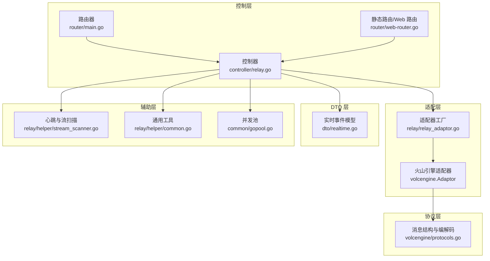
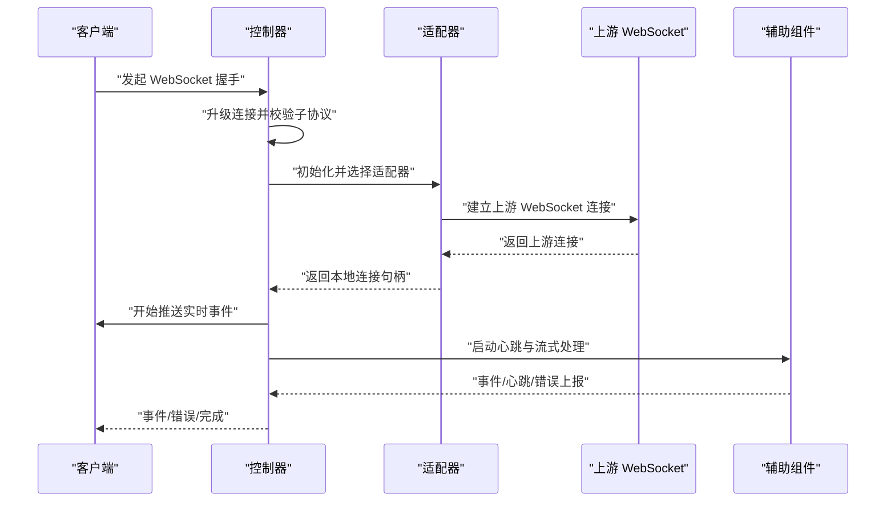
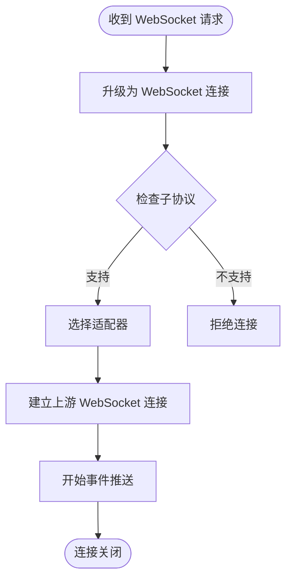
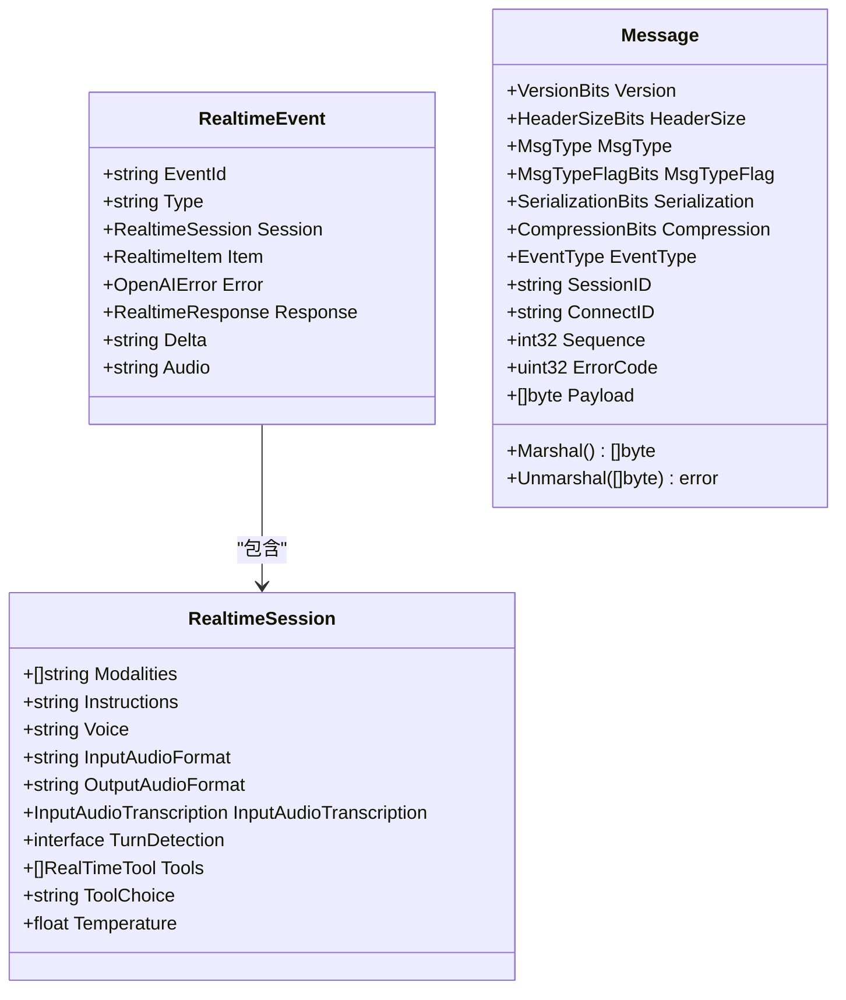
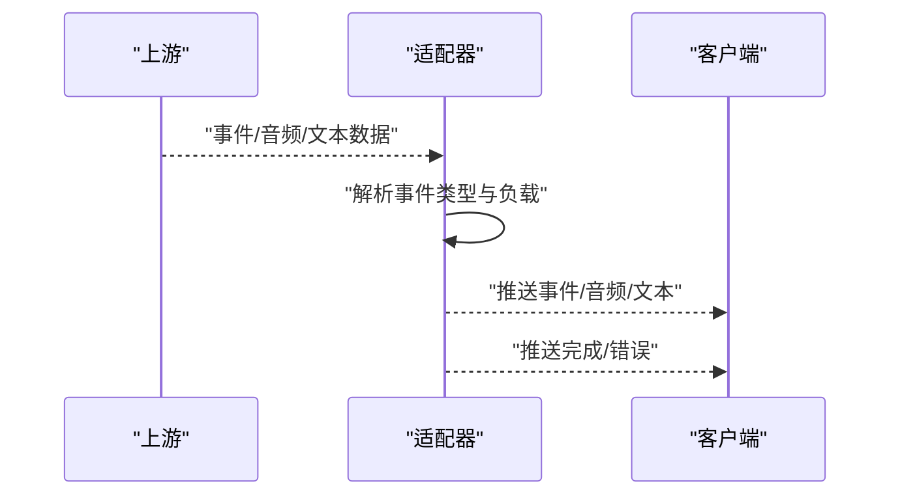
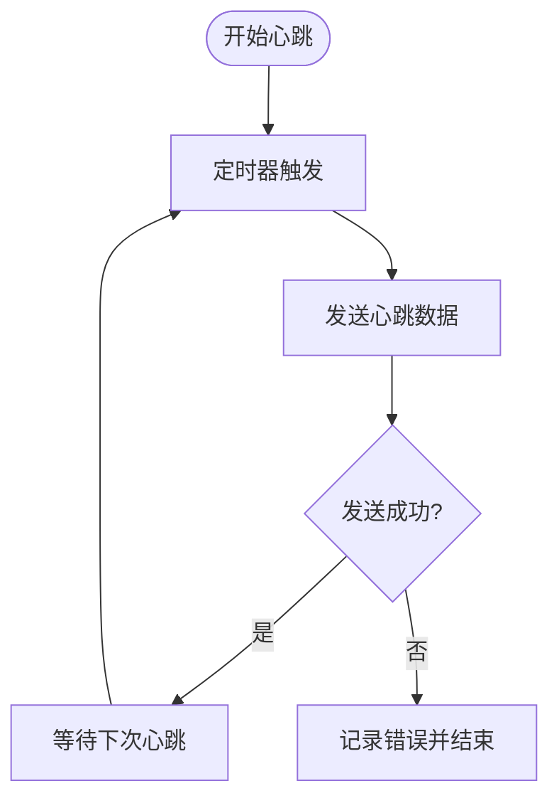
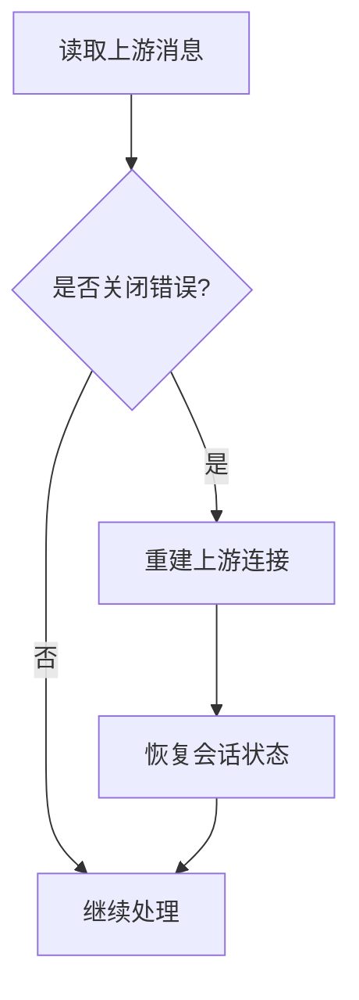
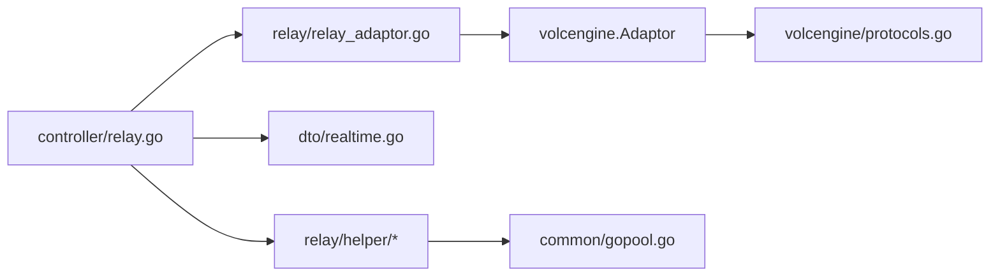

# WebSocket 实时接口

<cite>
**本文档引用的文件**
- [websocket.go](file://relay/websocket.go)
- [realtime.go](file://dto/realtime.go)
- [protocols.go](file://relay/channel/volcengine/protocols.go)
- [stream_scanner.go](file://relay/helper/stream_scanner.go)
- [common.go](file://relay/helper/common.go)
- [gopool.go](file://common/gopool.go)
- [relay_adaptor.go](file://relay/relay_adaptor.go)
- [relay_mode.go](file://relay/constant/relay_mode.go)
- [relay.go](file://controller/relay.go)
- [main.go](file://router/main.go)
- [web-router.go](file://router/web-router.go)
</cite>

## 目录
1. [简介](#简介)
2. [项目结构](#项目结构)
3. [核心组件](#核心组件)
4. [架构总览](#架构总览)
5. [详细组件分析](#详细组件分析)
6. [依赖关系分析](#依赖关系分析)
7. [性能考量](#性能考量)
8. [故障排除指南](#故障排除指南)
9. [结论](#结论)
10. [附录](#附录)

## 简介
本文件面向开发者，系统性阐述 New API 的 WebSocket 实时通信接口，覆盖连接建立流程、消息格式与协议设计、实时消息类型与事件推送机制、连接状态管理、认证与心跳、断线重连策略、并发连接与消息队列、性能优化、客户端集成示例与最佳实践，以及常见问题排查方法。目标是帮助开发者正确实现与使用 WebSocket 实时通信功能。

## 项目结构
New API 的 WebSocket 实时通信由以下模块协同实现：
- 控制层：负责路由匹配、握手升级与请求转发
- 适配层：根据上游渠道选择具体适配器（如火山引擎）
- DTO 层：定义实时事件的数据模型
- 协议层：自定义二进制帧协议（含事件类型、序列号、负载等）
- 辅助层：心跳与流式扫描、并发池与资源清理

**图表来源**
- [relay.go:244-249](file://controller/relay.go#L244-L249)
- [main.go:16-35](file://router/main.go#L16-L35)
- [web-router.go:16-30](file://router/web-router.go#L16-L30)
- [relay_adaptor.go:53-127](file://relay/relay_adaptor.go#L53-L127)
- [protocols.go:209-534](file://relay/channel/volcengine/protocols.go#L209-L534)
- [realtime.go:24-89](file://dto/realtime.go#L24-L89)
- [stream_scanner.go:37-300](file://relay/helper/stream_scanner.go#L37-L300)
- [common.go:94-144](file://relay/helper/common.go#L94-L144)
- [gopool.go:1-25](file://common/gopool.go#L1-L25)

**章节来源**
- [relay.go:244-249](file://controller/relay.go#L244-L249)
- [main.go:16-35](file://router/main.go#L16-L35)
- [web-router.go:16-30](file://router/web-router.go#L16-L30)
- [relay_adaptor.go:53-127](file://relay/relay_adaptor.go#L53-L127)
- [protocols.go:209-534](file://relay/channel/volcengine/protocols.go#L209-L534)
- [realtime.go:24-89](file://dto/realtime.go#L24-L89)
- [stream_scanner.go:37-300](file://relay/helper/stream_scanner.go#L37-L300)
- [common.go:94-144](file://relay/helper/common.go#L94-L144)
- [gopool.go:1-25](file://common/gopool.go#L1-L25)

## 核心组件
- WebSocket 协议与握手
  - 控制器通过 Upgrader 将 HTTP 连接升级为 WebSocket，并声明支持的子协议
  - 允许跨域访问，便于前端直连
- 适配器与通道
  - 适配器工厂根据 API 类型选择具体适配器（如火山引擎）
  - 适配器负责初始化、发起上游请求、处理响应与用量统计
- 实时事件模型
  - 定义事件类型常量与事件结构体，包含会话、对话项、响应、增量音频/文本等字段
- 自定义二进制帧协议
  - 定义消息头版本、类型、标志位、序列号、事件类型、会话/连接标识、负载长度与负载
  - 提供编解码函数与收发封装
- 心跳与流式处理
  - 基于定时器周期发送心跳数据，配合扫描器处理上游流式响应
  - 并发池与资源清理保障稳定性

**章节来源**
- [relay.go:244-249](file://controller/relay.go#L244-L249)
- [relay_adaptor.go:53-127](file://relay/relay_adaptor.go#L53-L127)
- [realtime.go:5-89](file://dto/realtime.go#L5-L89)
- [protocols.go:209-534](file://relay/channel/volcengine/protocols.go#L209-L534)
- [stream_scanner.go:37-300](file://relay/helper/stream_scanner.go#L37-L300)
- [common.go:94-144](file://relay/helper/common.go#L94-L144)
- [gopool.go:1-25](file://common/gopool.go#L1-L25)

## 架构总览
WebSocket 实时通信的整体流程如下：
- 客户端发起 WebSocket 握手，服务端升级连接
- 服务端根据请求路径与参数选择适配器
- 适配器向上游发起 WebSocket 请求并获取上游连接
- 服务端在本地维护上游连接，同时向客户端推送事件
- 通过心跳维持连接活性，断线时进行重连与恢复

**图表来源**
- [relay.go:244-249](file://controller/relay.go#L244-L249)
- [websocket.go:15-46](file://relay/websocket.go#L15-L46)
- [relay_adaptor.go:53-127](file://relay/relay_adaptor.go#L53-L127)
- [stream_scanner.go:37-300](file://relay/helper/stream_scanner.go#L37-L300)
- [common.go:94-144](file://relay/helper/common.go#L94-L144)

## 详细组件分析

### 组件一：WebSocket 连接与握手
- 握手与子协议
  - 控制器使用 Upgrader 升级 HTTP 连接为 WebSocket，声明支持的子协议列表
  - 默认允许跨域，便于前端直连
- 路由与入口
  - 路由器将请求分发到控制器，控制器根据路径与模式选择适配器
- 连接生命周期
  - 适配器建立上游连接后，服务端持有连接句柄，负责读取与转发

**图表来源**
- [relay.go:244-249](file://controller/relay.go#L244-L249)
- [main.go:16-35](file://router/main.go#L16-L35)
- [web-router.go:16-30](file://router/web-router.go#L16-L30)

**章节来源**
- [relay.go:244-249](file://controller/relay.go#L244-L249)
- [main.go:16-35](file://router/main.go#L16-L35)
- [web-router.go:16-30](file://router/web-router.go#L16-L30)

### 组件二：消息格式与协议设计
- 实时事件模型
  - 定义事件类型常量（如会话更新、响应创建、音频增量、函数调用参数等）
  - 事件结构体包含事件 ID、类型、会话、对话项、错误、响应、增量内容与音频字段
- 自定义二进制帧协议
  - 消息头包含版本、头部大小、消息类型、类型标志位、序列化方式、压缩方式
  - 可选事件类型、会话 ID、连接 ID、序列号、错误码
  - 负载前缀包含负载长度，随后是原始负载
  - 提供编解码函数与收发封装，支持二进制与文本消息类型判断

**图表来源**
- [realtime.go:24-89](file://dto/realtime.go#L24-L89)
- [protocols.go:209-534](file://relay/channel/volcengine/protocols.go#L209-L534)

**章节来源**
- [realtime.go:5-89](file://dto/realtime.go#L5-L89)
- [protocols.go:209-534](file://relay/channel/volcengine/protocols.go#L209-L534)

### 组件三：实时消息类型与事件推送机制
- 事件类型
  - 错误、会话更新/创建、对话项创建、响应创建/完成、音频增量、转录增量、函数调用参数增量/完成等
- 推送机制
  - 适配器在建立上游连接后，将事件按类型推送给客户端
  - 对于音频类事件，直接推送二进制音频数据；对于文本/JSON类事件，推送结构化数据
  - 完成信号通过特定事件或序列号标记

**图表来源**
- [protocols.go:263-296](file://relay/channel/volcengine/protocols.go#L263-L296)
- [realtime.go:5-22](file://dto/realtime.go#L5-L22)

**章节来源**
- [protocols.go:263-296](file://relay/channel/volcengine/protocols.go#L263-L296)
- [realtime.go:5-22](file://dto/realtime.go#L5-L22)

### 组件四：连接状态管理与心跳机制
- 心跳
  - 基于定时器周期发送心跳数据，可配置启用与间隔
  - 写入失败或超时会记录错误并触发结束原因
- 超时与停止
  - 扫描器设置流式超时计时器，超时或客户端断开时结束
  - 并发 goroutine 在停止信号、上下文取消或异常时安全退出
- 资源清理
  - 使用 WaitGroup 等待 goroutine 完全退出，避免泄漏
  - 并发池统一管理 goroutine 生命周期

**图表来源**
- [stream_scanner.go:120-183](file://relay/helper/stream_scanner.go#L120-L183)
- [common.go:94-107](file://relay/helper/common.go#L94-L107)
- [gopool.go:1-25](file://common/gopool.go#L1-L25)

**章节来源**
- [stream_scanner.go:53-183](file://relay/helper/stream_scanner.go#L53-L183)
- [common.go:94-107](file://relay/helper/common.go#L94-L107)
- [gopool.go:1-25](file://common/gopool.go#L1-L25)

### 组件五：断线重连策略
- 断线检测
  - 读取上游消息时识别关闭错误，触发断线处理
- 重连与恢复
  - 适配器负责重建上游连接并恢复会话状态
  - 客户端侧应监听连接状态变化并执行指数退避重连
- 会话一致性
  - 通过会话 ID 与事件序号保证事件顺序与完整性

**图表来源**
- [protocols.go:253-261](file://relay/channel/volcengine/protocols.go#L253-L261)

**章节来源**
- [protocols.go:253-261](file://relay/channel/volcengine/protocols.go#L253-L261)

### 组件六：并发连接管理、消息队列与性能优化
- 并发模型
  - 使用并发池统一调度 goroutine，捕获 panic 并安全停止
  - 扫描器与心跳分别在独立 goroutine 中运行，互不阻塞
- 消息队列
  - 扫描器将解析后的数据放入带缓冲通道，处理器异步消费
  - 写入互斥锁保护，避免并发写导致的竞态
- 性能优化
  - 可配置扫描器缓冲区大小，避免内存峰值过高
  - 心跳发送采用超时保护，防止阻塞
  - 资源清理及时，避免 goroutine 泄漏

**章节来源**
- [gopool.go:1-25](file://common/gopool.go#L1-L25)
- [stream_scanner.go:185-282](file://relay/helper/stream_scanner.go#L185-L282)
- [common.go:145-144](file://relay/helper/common.go#L145-L144)

### 组件七：客户端集成示例与最佳实践
- 客户端建议
  - 明确子协议，确保握手成功
  - 实现心跳处理与超时检测
  - 针对不同事件类型进行差异化渲染（文本/音频/错误）
  - 断线时采用指数退避重连
- 服务端建议
  - 合理设置心跳间隔与流式超时
  - 记录详细的连接状态与错误日志
  - 对并发 goroutine 进行统一监控与告警

[本节为概念性指导，无需“章节来源”]

## 依赖关系分析
- 控制器依赖适配器工厂与 Upgrader
- 适配器依赖具体通道（如火山引擎）实现
- 协议层提供消息编解码能力
- 辅助层提供心跳、流式扫描与并发池

**图表来源**
- [relay.go:244-249](file://controller/relay.go#L244-L249)
- [relay_adaptor.go:53-127](file://relay/relay_adaptor.go#L53-L127)
- [protocols.go:209-534](file://relay/channel/volcengine/protocols.go#L209-L534)
- [realtime.go:24-89](file://dto/realtime.go#L24-L89)
- [stream_scanner.go:37-300](file://relay/helper/stream_scanner.go#L37-L300)
- [gopool.go:1-25](file://common/gopool.go#L1-L25)

**章节来源**
- [relay.go:244-249](file://controller/relay.go#L244-L249)
- [relay_adaptor.go:53-127](file://relay/relay_adaptor.go#L53-L127)
- [protocols.go:209-534](file://relay/channel/volcengine/protocols.go#L209-L534)
- [realtime.go:24-89](file://dto/realtime.go#L24-L89)
- [stream_scanner.go:37-300](file://relay/helper/stream_scanner.go#L37-L300)
- [gopool.go:1-25](file://common/gopool.go#L1-L25)

## 性能考量
- 心跳与超时
  - 合理设置心跳间隔，避免频繁心跳造成压力
  - 流式超时与客户端断开检测需平衡延迟与资源占用
- 并发与内存
  - 通道缓冲区与扫描器缓冲区需根据业务峰值调整
  - 并发池上限与 panic 处理保障稳定性
- 序列化与传输
  - 二进制帧协议减少序列化开销，适合高频事件推送
  - 音频数据直接透传，降低中间层处理成本

[本节为一般性指导，无需“章节来源”]

## 故障排除指南
- 握手失败
  - 检查子协议是否在列表中声明
  - 确认跨域策略与 Origin 校验
- 心跳失败
  - 查看心跳发送超时与写入错误日志
  - 调整心跳间隔与超时阈值
- 连接中断
  - 捕获关闭错误并触发重连
  - 校验会话 ID 与事件序号一致性
- 资源泄漏
  - 确保 goroutine 安全退出与 WaitGroup 等待
  - 并发池 panic 处理与停止信号传递

**章节来源**
- [relay.go:244-249](file://controller/relay.go#L244-L249)
- [stream_scanner.go:84-108](file://relay/helper/stream_scanner.go#L84-L108)
- [protocols.go:253-261](file://relay/channel/volcengine/protocols.go#L253-L261)

## 结论
New API 的 WebSocket 实时通信接口以清晰的分层架构与完善的协议设计为基础，结合心跳、流式处理与并发池，提供了稳定高效的实时能力。开发者可据此快速实现认证、事件推送、断线重连与性能优化，满足多样化的实时场景需求。

[本节为总结性内容，无需“章节来源”]

## 附录
- 路由与入口
  - 路由器负责将请求分发至控制器
  - 控制器负责握手与适配器选择
- 实时模式识别
  - 路径前缀 /v1/realtime 识别为实时模式，便于后续适配器选择

**章节来源**
- [main.go:16-35](file://router/main.go#L16-L35)
- [relay_mode.go:87-88](file://relay/constant/relay_mode.go#L87-L88)