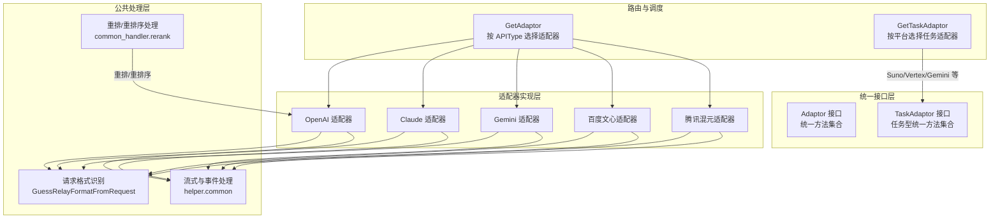
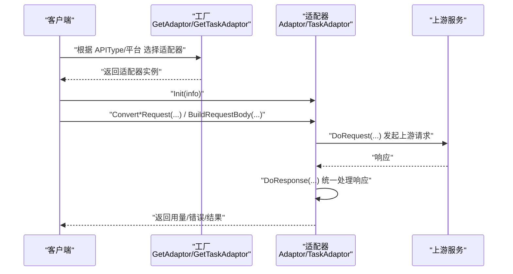
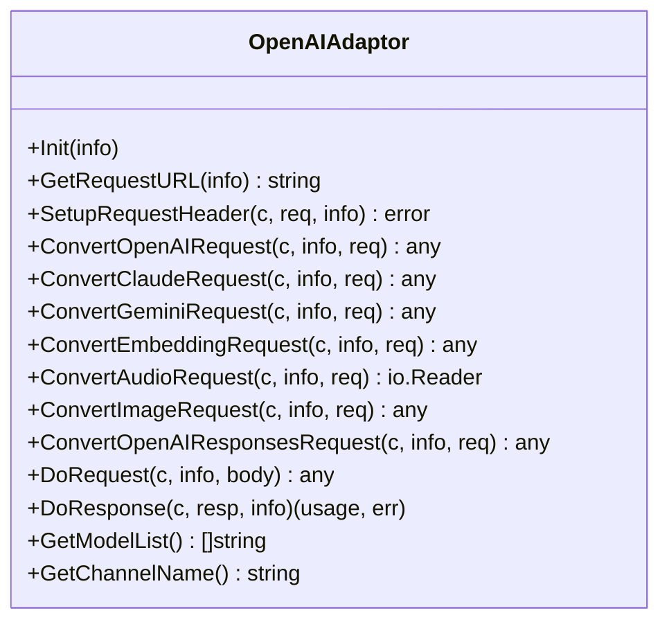
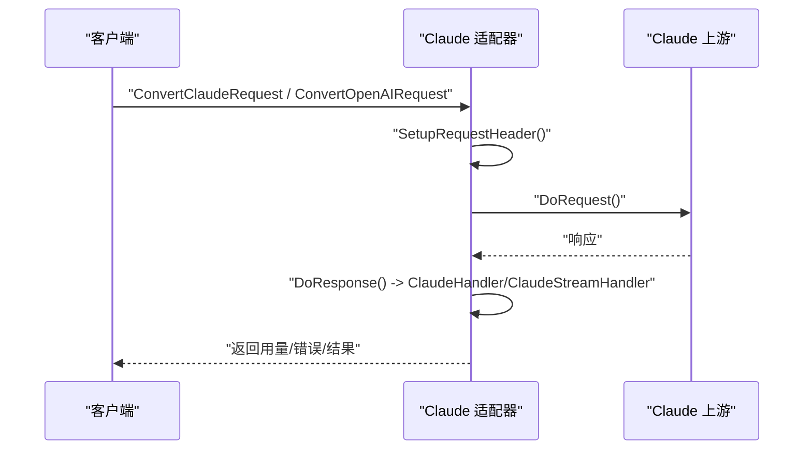
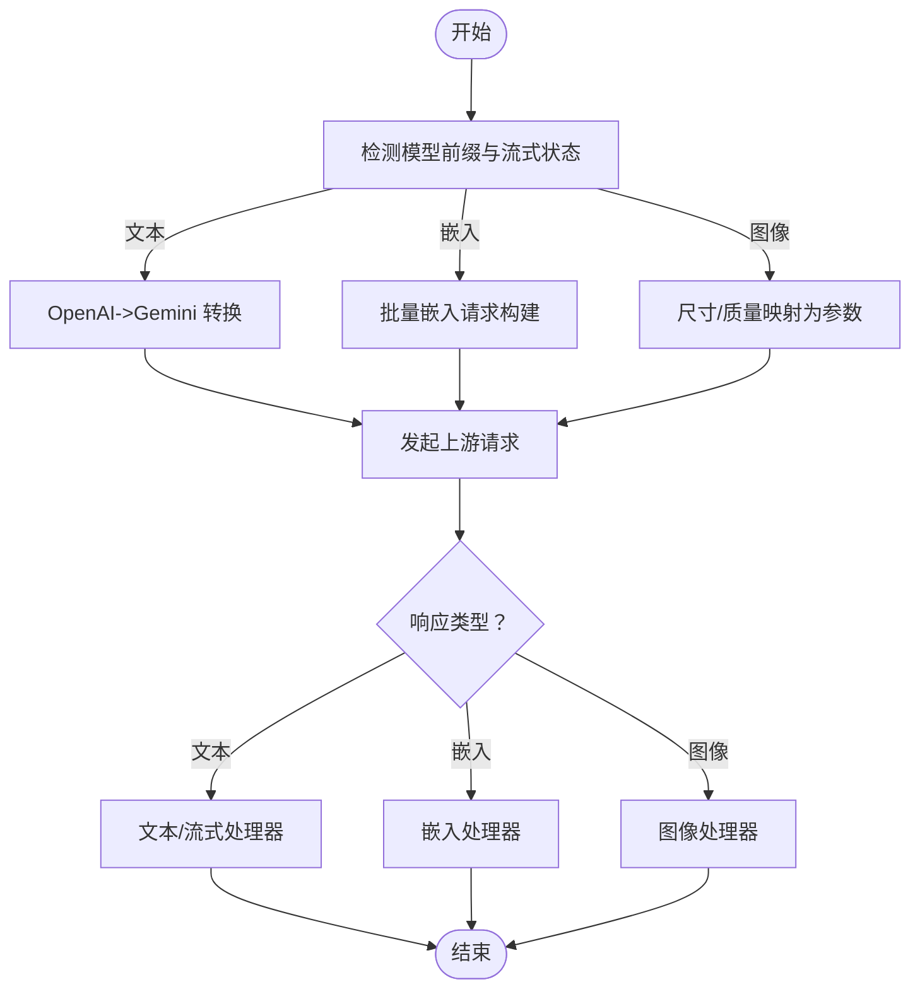
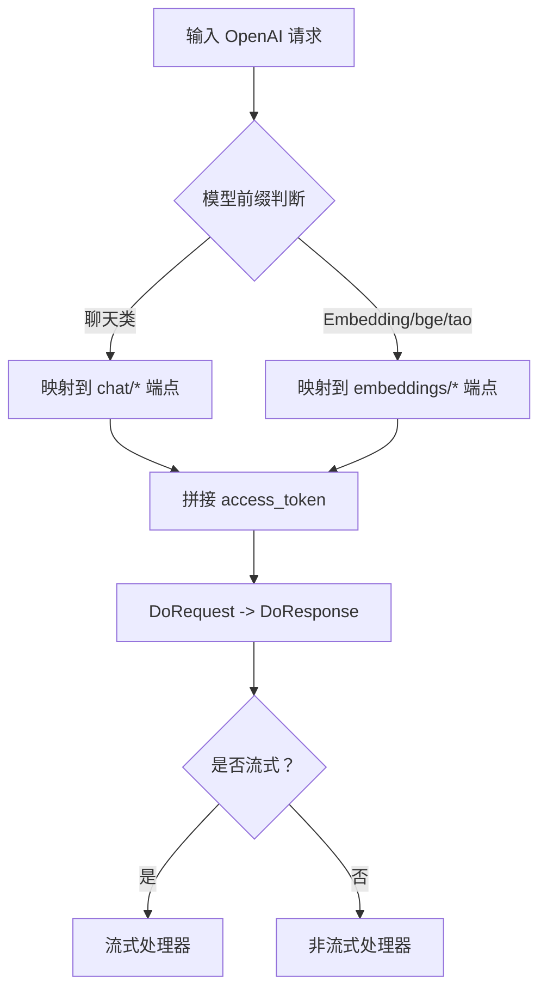
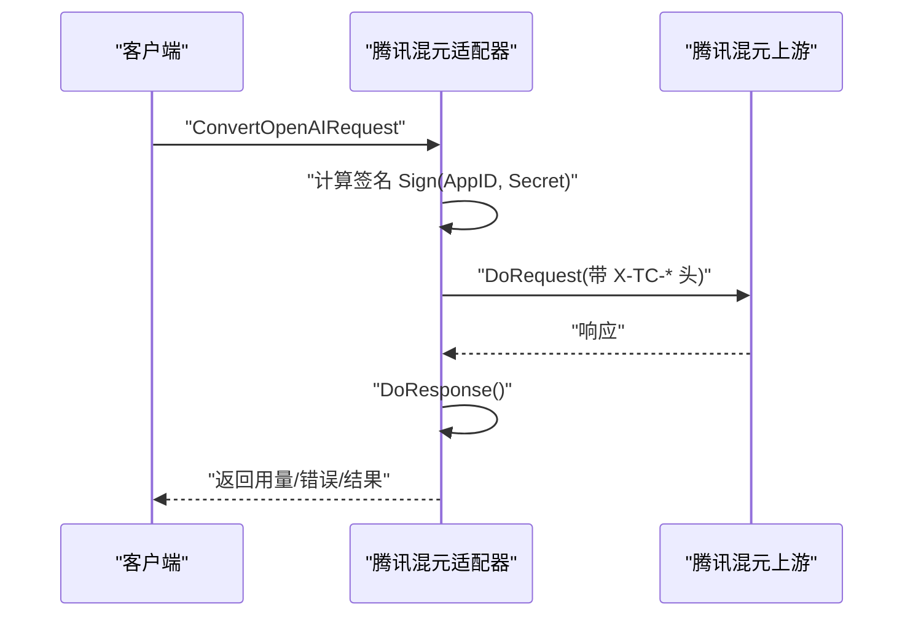
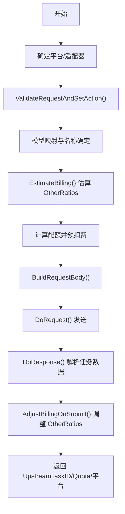
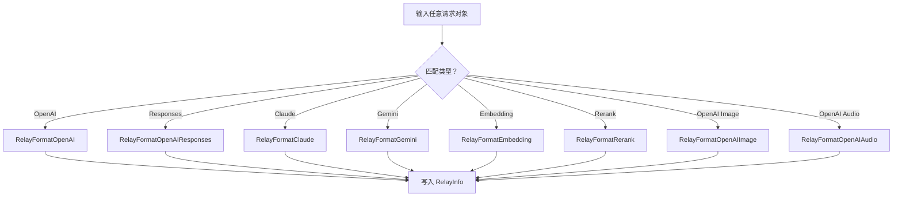
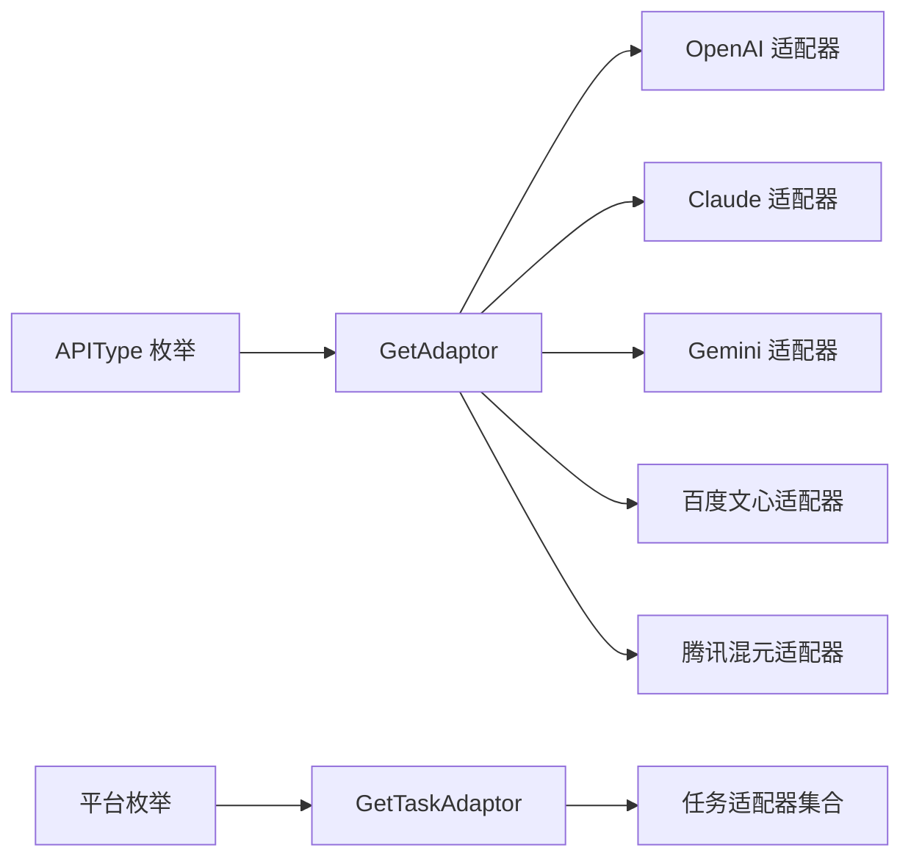

# AI 服务适配器

<cite>
**本文档引用的文件**
- [adapter.go](file://relay/channel/adapter.go)
- [relay_adaptor.go](file://relay/relay_adaptor.go)
- [request_conversion.go](file://relay/common/request_conversion.go)
- [openai_request.go](file://dto/openai_request.go)
- [openai_response.go](file://dto/openai_response.go)
- [adaptor.go](file://relay/channel/openai/adaptor.go)
- [adaptor.go](file://relay/channel/claude/adaptor.go)
- [adaptor.go](file://relay/channel/gemini/adaptor.go)
- [adaptor.go](file://relay/channel/baidu/adaptor.go)
- [adaptor.go](file://relay/channel/tencent/adaptor.go)
- [rerank.go](file://relay/common_handler/rerank.go)
- [common.go](file://relay/helper/common.go)
- [api_type.go](file://constant/api_type.go)
- [relay_task.go](file://relay/relay_task.go)
- [audio_handler.go](file://relay/audio_handler.go)
</cite>

## 目录
1. [简介](#简介)
2. [项目结构](#项目结构)
3. [核心组件](#核心组件)
4. [架构总览](#架构总览)
5. [详细组件分析](#详细组件分析)
6. [依赖分析](#依赖分析)
7. [性能考虑](#性能考虑)
8. [故障排查指南](#故障排查指南)
9. [结论](#结论)
10. [附录](#附录)

## 简介
本文件面向 New API 的 AI 服务适配器系统，系统性阐述适配器模式在统一接口、请求格式转换与响应处理方面的实现原理。文档覆盖 OpenAI、Claude、Gemini、百度文心、阿里通义、腾讯混元、讯飞星火等主流服务提供商的适配器实现，说明各适配器的特殊功能、参数映射与兼容性处理策略，并提供扩展新服务提供商的集成步骤与最佳实践。同时给出错误处理策略、性能优化技巧与调试方法，帮助开发者快速理解与维护该适配体系。

## 项目结构
New API 的适配器体系采用“统一接口 + 多实现”的适配器模式，核心接口位于通道层，具体适配器按服务提供商拆分实现，公共的请求/响应处理与工具函数分布在 common 与 helper 层，任务型能力（如视频生成）通过独立的任务适配器与统一的任务流程编排。

图表来源
- [adapter.go:15-32](file://relay/channel/adapter.go#L15-L32)
- [relay_adaptor.go:53-125](file://relay/relay_adaptor.go#L53-L125)
- [request_conversion.go:8-29](file://relay/common/request_conversion.go#L8-L29)
- [common.go:41-118](file://relay/helper/common.go#L41-L118)
- [rerank.go:18-75](file://relay/common_handler/rerank.go#L18-L75)

章节来源
- [adapter.go:15-32](file://relay/channel/adapter.go#L15-L32)
- [relay_adaptor.go:53-125](file://relay/relay_adaptor.go#L53-L125)
- [request_conversion.go:8-29](file://relay/common/request_conversion.go#L8-L29)

## 核心组件
- 统一接口 Adaptor：定义初始化、请求 URL 构造、请求头设置、各类请求转换（OpenAI/Claude/Gemini/Embedding/Audio/Image/OpenAI Responses）、上游请求执行、响应处理、模型列表与通道名等方法，确保不同服务提供商具备一致的调用契约。
- 统一接口 TaskAdaptor：面向任务型能力（如视频生成），提供请求校验、计费估算/调整、请求构建、请求执行、响应解析、轮询与结果解析等方法。
- 适配器工厂 GetAdaptor/GetTaskAdaptor：依据 API 类型或平台枚举，返回对应适配器实例，集中管理适配器注册与切换。
- 请求格式识别：根据请求对象类型自动识别 RelayFormat，辅助后续转换与处理分支。
- 流式与事件处理：封装 SSE/WS 数据帧拼装、刷新、PING、对象序列化等通用能力。
- 重排/重排序处理：统一重排结果的解析与 OpenAI 兼容输出。

章节来源
- [adapter.go:15-32](file://relay/channel/adapter.go#L15-L32)
- [adapter.go:34-79](file://relay/channel/adapter.go#L34-L79)
- [relay_adaptor.go:53-125](file://relay/relay_adaptor.go#L53-L125)
- [relay_adaptor.go:135-165](file://relay/relay_adaptor.go#L135-L165)
- [request_conversion.go:8-29](file://relay/common/request_conversion.go#L8-L29)
- [common.go:41-118](file://relay/helper/common.go#L41-L118)
- [rerank.go:18-75](file://relay/common_handler/rerank.go#L18-L75)

## 架构总览
New API 的适配器架构围绕“统一接口 + 工厂调度 + 公共处理”展开。客户端请求进入后，通过工厂选择适配器，适配器完成请求格式转换与上游调用，再由适配器统一处理响应并进行计费与用量统计。任务型能力通过独立的任务适配器与统一的任务流程编排，支持预估计费、预扣费、提交后调整与轮询查询。

图表来源
- [relay_adaptor.go:53-125](file://relay/relay_adaptor.go#L53-L125)
- [relay_adaptor.go:135-165](file://relay/relay_adaptor.go#L135-L165)
- [adaptor.go:98-109](file://relay/channel/openai/adaptor.go#L98-L109)
- [adaptor.go:607-617](file://relay/channel/openai/adaptor.go#L607-L617)

## 详细组件分析

### OpenAI 适配器（统一接口与多形态支持）
- 初始化与推理效率后缀处理：支持从模型名解析推理强度后缀，适配 o1/o3/o4 系列与 gpt-5 系列的参数兼容。
- 请求 URL 构造：针对 Azure、自定义渠道与 Claude/Gemini 转换场景，动态拼接路径与查询参数。
- 请求头设置：Azure 使用专用头，OpenAI 支持组织头；实时语音场景设置 WebSocket 协议头；OpenRouter 注入 Referer 与标题头。
- 请求转换：
  - OpenAI：处理 ReasoningEffort、Reasoning、StreamOptions、模型后缀兼容等。
  - Claude/Gemini：通过服务层转换为 OpenAI 兼容格式后再统一处理。
  - 音频：区分语音合成与转写/翻译两类模式，分别走 JSON 体或 multipart 表单。
  - 图像：支持编辑/遮罩等多图场景，自动检测 MIME 类型并构造表单。
  - OpenAI Responses：处理推理强度后缀与 Reasoning 字段。
- 响应处理：根据 RelayMode 分派至不同处理器，包括流式、实时、音频、图像、重排、Responses 等。
- 模型列表与通道名：按渠道类型返回相应模型清单与通道名。

图表来源
- [adaptor.go:37-40](file://relay/channel/openai/adaptor.go#L37-L40)
- [adaptor.go:98-109](file://relay/channel/openai/adaptor.go#L98-L109)
- [adaptor.go:111-187](file://relay/channel/openai/adaptor.go#L111-L187)
- [adaptor.go:189-241](file://relay/channel/openai/adaptor.go#L189-L241)
- [adaptor.go:243-364](file://relay/channel/openai/adaptor.go#L243-L364)
- [adaptor.go:370-438](file://relay/channel/openai/adaptor.go#L370-L438)
- [adaptor.go:440-586](file://relay/channel/openai/adaptor.go#L440-L586)
- [adaptor.go:588-605](file://relay/channel/openai/adaptor.go#L588-L605)
- [adaptor.go:607-649](file://relay/channel/openai/adaptor.go#L607-L649)
- [adaptor.go:651-683](file://relay/channel/openai/adaptor.go#L651-L683)

章节来源
- [adaptor.go:42-55](file://relay/channel/openai/adaptor.go#L42-L55)
- [adaptor.go:111-187](file://relay/channel/openai/adaptor.go#L111-L187)
- [adaptor.go:189-241](file://relay/channel/openai/adaptor.go#L189-L241)
- [adaptor.go:243-364](file://relay/channel/openai/adaptor.go#L243-L364)
- [adaptor.go:370-438](file://relay/channel/openai/adaptor.go#L370-L438)
- [adaptor.go:440-586](file://relay/channel/openai/adaptor.go#L440-L586)
- [adaptor.go:588-605](file://relay/channel/openai/adaptor.go#L588-L605)
- [adaptor.go:607-649](file://relay/channel/openai/adaptor.go#L607-L649)
- [adaptor.go:651-683](file://relay/channel/openai/adaptor.go#L651-L683)

### Claude 适配器（消息接口与流式处理）
- 请求 URL：默认 /v1/messages，可按配置附加 beta 查询参数。
- 请求头：设置 x-api-key 与 anthropic-version，支持从请求头透传 anthropic-beta。
- 请求转换：将 OpenAI 请求转换为 Claude 消息格式；Gemini 转换通过 OpenAI 适配器间接完成。
- 响应处理：根据是否流式选择不同的处理器，统一设置最终格式为 Claude。

图表来源
- [adaptor.go:27-99](file://relay/channel/claude/adaptor.go#L27-L99)
- [adaptor.go:82-92](file://relay/channel/claude/adaptor.go#L82-L92)
- [adaptor.go:115-126](file://relay/channel/claude/adaptor.go#L115-L126)

章节来源
- [adaptor.go:44-58](file://relay/channel/claude/adaptor.go#L44-L58)
- [adaptor.go:82-92](file://relay/channel/claude/adaptor.go#L82-L92)
- [adaptor.go:94-99](file://relay/channel/claude/adaptor.go#L94-L99)
- [adaptor.go:115-126](file://relay/channel/claude/adaptor.go#L115-L126)

### Gemini 适配器（文本/嵌入/图像/流式）
- 请求 URL：根据模型前缀与流式状态选择 generateContent/streamGenerateContent/embedContent/batchEmbedContents 等端点。
- 请求头：设置 x-goog-api-key。
- 请求转换：
  - 文本：OpenAI -> Gemini 的消息与内容转换。
  - 嵌入：批量构建请求，按模型支持设置维度等参数。
  - 图像：将尺寸映射为宽高比，质量映射为图片大小，限制仅支持 Imagen 系列。
- 响应处理：根据模式与端点选择对应处理器，支持文本生成、流式、嵌入与图像生成。

图表来源
- [adaptor.go:130-171](file://relay/channel/gemini/adaptor.go#L130-L171)
- [adaptor.go:173-177](file://relay/channel/gemini/adaptor.go#L173-L177)
- [adaptor.go:179-190](file://relay/channel/gemini/adaptor.go#L179-L190)
- [adaptor.go:196-238](file://relay/channel/gemini/adaptor.go#L196-L238)
- [adaptor.go:249-279](file://relay/channel/gemini/adaptor.go#L249-L279)

章节来源
- [adaptor.go:130-171](file://relay/channel/gemini/adaptor.go#L130-L171)
- [adaptor.go:173-177](file://relay/channel/gemini/adaptor.go#L173-L177)
- [adaptor.go:179-190](file://relay/channel/gemini/adaptor.go#L179-L190)
- [adaptor.go:196-238](file://relay/channel/gemini/adaptor.go#L196-L238)
- [adaptor.go:249-279](file://relay/channel/gemini/adaptor.go#L249-L279)

### 百度文心适配器（多模型路由与令牌注入）
- 请求 URL：根据模型前缀映射到不同 RPC 端点，自动拼接 access_token。
- 请求头：设置 Authorization 为 Bearer + apiKey。
- 请求转换：将 OpenAI 请求转换为文心格式；嵌入请求单独处理。
- 响应处理：根据模式选择流式或非流式处理器。

图表来源
- [adaptor.go:47-113](file://relay/channel/baidu/adaptor.go#L47-L113)
- [adaptor.go:115-119](file://relay/channel/baidu/adaptor.go#L115-L119)
- [adaptor.go:121-130](file://relay/channel/baidu/adaptor.go#L121-L130)
- [adaptor.go:136-139](file://relay/channel/baidu/adaptor.go#L136-L139)
- [adaptor.go:150-162](file://relay/channel/baidu/adaptor.go#L150-L162)

章节来源
- [adaptor.go:47-113](file://relay/channel/baidu/adaptor.go#L47-L113)
- [adaptor.go:115-119](file://relay/channel/baidu/adaptor.go#L115-L119)
- [adaptor.go:121-130](file://relay/channel/baidu/adaptor.go#L121-L130)
- [adaptor.go:136-139](file://relay/channel/baidu/adaptor.go#L136-L139)
- [adaptor.go:150-162](file://relay/channel/baidu/adaptor.go#L150-L162)

### 腾讯混元适配器（签名与动作参数）
- 初始化：设置 Action、Version、Timestamp。
- 请求 URL：直接使用基础地址。
- 请求头：设置 Authorization 为签名，附加 X-TC-* 头。
- 请求转换：将 OpenAI 请求转换为混元格式，并在转换时计算签名。
- 响应处理：根据模式选择流式或非流式处理器。

图表来源
- [adaptor.go:50-58](file://relay/channel/tencent/adaptor.go#L50-L58)
- [adaptor.go:60-67](file://relay/channel/tencent/adaptor.go#L60-L67)
- [adaptor.go:69-84](file://relay/channel/tencent/adaptor.go#L69-L84)
- [adaptor.go:100-111](file://relay/channel/tencent/adaptor.go#L100-L111)

章节来源
- [adaptor.go:50-58](file://relay/channel/tencent/adaptor.go#L50-L58)
- [adaptor.go:60-67](file://relay/channel/tencent/adaptor.go#L60-L67)
- [adaptor.go:69-84](file://relay/channel/tencent/adaptor.go#L69-L84)
- [adaptor.go:100-111](file://relay/channel/tencent/adaptor.go#L100-L111)

### 任务型适配器与统一流程
- 平台选择：根据平台枚举选择任务适配器（如 Suno、Vertex、Gemini 等）。
- 请求校验与动作设置：在提交前验证请求并设置动作（如 remix/continuation）。
- 计费估算与预扣费：适配器估算 OtherRatios（时长、分辨率等），计算基础配额并预扣费。
- 请求构建与发送：构建请求体并发送至上游，返回任务数据与上游任务 ID。
- 提交后调整：根据上游返回的实际参数调整 OtherRatios 与配额。
- 结果查询：支持实时查询与 OpenAI Video API 格式转换。

图表来源
- [relay_task.go:139-258](file://relay/relay_task.go#L139-L258)
- [relay_task.go:260-279](file://relay/relay_task.go#L260-L279)
- [relay_task.go:418-500](file://relay/relay_task.go#L418-L500)
- [relay_task.go:541-564](file://relay/relay_task.go#L541-L564)

章节来源
- [relay_task.go:139-258](file://relay/relay_task.go#L139-L258)
- [relay_task.go:260-279](file://relay/relay_task.go#L260-L279)
- [relay_task.go:418-500](file://relay/relay_task.go#L418-L500)
- [relay_task.go:541-564](file://relay/relay_task.go#L541-L564)

### 请求格式识别与通用处理
- 请求格式识别：根据请求对象类型自动识别 OpenAI、OpenAI Responses、Claude、Gemini、Embedding、Rerank、OpenAI Image、OpenAI Audio 等格式。
- 通用处理：SSE/WS 数据帧、PING、刷新、对象序列化等。

图表来源
- [request_conversion.go:8-29](file://relay/common/request_conversion.go#L8-L29)
- [request_conversion.go:31-40](file://relay/common/request_conversion.go#L31-L40)
- [common.go:41-118](file://relay/helper/common.go#L41-L118)

章节来源
- [request_conversion.go:8-29](file://relay/common/request_conversion.go#L8-L29)
- [request_conversion.go:31-40](file://relay/common/request_conversion.go#L31-L40)
- [common.go:41-118](file://relay/helper/common.go#L41-L118)

### DTO 与响应模型
- 通用 OpenAI 请求结构：统一承载 messages、tools、stream、temperature、top_p、max_tokens 等参数，并支持多模态内容解析与工具调用。
- 响应模型：文本、流式、嵌入、重排、Responses 等多种响应结构，统一错误提取与工具方法。

章节来源
- [openai_request.go:29-109](file://dto/openai_request.go#L29-L109)
- [openai_request.go:111-197](file://dto/openai_request.go#L111-L197)
- [openai_response.go:14-52](file://dto/openai_response.go#L14-L52)
- [openai_response.go:392-431](file://dto/openai_response.go#L392-L431)

### 重排/重排序处理
- 统一解析上游重排结果，兼容 Xinference 输出，转换为通用重排响应并设置用量。

章节来源
- [rerank.go:18-75](file://relay/common_handler/rerank.go#L18-L75)

### 音频能力与用量结算
- 音频助手：统一处理音频转写/翻译/合成，区分音频令牌与文本令牌，分别结算。

章节来源
- [audio_handler.go:18-77](file://relay/audio_handler.go#L18-L77)

## 依赖分析
- 适配器工厂集中注册：通过 APIType 枚举与平台枚举，统一返回对应适配器实例，便于扩展与替换。
- 适配器间协作：Gemini/Claude 可通过 OpenAI 适配器进行格式转换，减少重复实现。
- 公共处理模块：请求格式识别、流式与事件处理、重排处理等模块被多个适配器复用。

图表来源
- [api_type.go:3-40](file://constant/api_type.go#L3-L40)
- [relay_adaptor.go:53-125](file://relay/relay_adaptor.go#L53-L125)
- [relay_adaptor.go:135-165](file://relay/relay_adaptor.go#L135-L165)

章节来源
- [api_type.go:3-40](file://constant/api_type.go#L3-L40)
- [relay_adaptor.go:53-125](file://relay/relay_adaptor.go#L53-L125)
- [relay_adaptor.go:135-165](file://relay/relay_adaptor.go#L135-L165)

## 性能考虑
- 请求体复用与流式传输：优先使用流式/分块传输，减少内存占用与延迟。
- 模型映射与预估计费：在请求早期完成模型映射与计费估算，避免多次往返。
- 适配器缓存与复用：合理利用适配器实例，避免重复初始化。
- 响应解析与错误短路：在解析失败或状态异常时尽早返回，减少无效处理。

## 故障排查指南
- 请求格式识别失败：确认请求对象类型与 RelayFormat 是否匹配，检查请求转换分支。
- 认证与头设置：Azure 使用专用头，OpenAI 支持组织头，Claude 需要 x-api-key 与版本头，Gemini 需要 x-goog-api-key，混元需要 X-TC-* 头与签名。
- 流式与事件：SSE/WS 场景下注意 Ping、Flush、对象序列化与错误事件发送。
- 重排/重排序：确认上游输出格式与通用重排响应的映射关系。
- 任务型流程：检查 ValidateRequest、EstimateBilling、AdjustBillingOnSubmit 的调用顺序与返回值。

章节来源
- [common.go:41-118](file://relay/helper/common.go#L41-L118)
- [rerank.go:18-75](file://relay/common_handler/rerank.go#L18-L75)
- [relay_task.go:139-258](file://relay/relay_task.go#L139-L258)

## 结论
New API 的适配器体系通过统一接口与工厂调度，实现了对多家服务提供商的一致接入与灵活扩展。OpenAI/Claude/Gemini/Baidu/Tencent 等适配器在请求转换、头设置、响应处理等方面形成互补，配合任务型适配器与统一流程，满足从对话到生成的多样化需求。建议在新增适配器时遵循现有接口契约与处理流程，确保一致性与可维护性。

## 附录

### 适配器扩展指南（新服务提供商集成步骤）
- 定义适配器结构与实现接口方法：参考现有适配器，至少实现 Init、GetRequestURL、SetupRequestHeader、Convert*Request、DoRequest、DoResponse、GetModelList、GetChannelName。
- 在工厂中注册：在 GetAdaptor/GetTaskAdaptor 中添加 APIType/平台枚举分支，返回新适配器实例。
- 请求转换与兼容性：根据上游 API 差异，补充请求参数映射与兼容处理（如推理强度、流式选项、特殊头等）。
- 响应处理：实现 DoResponse 分支，支持流式与非流式场景，并正确设置用量。
- 模型列表与通道名：提供模型清单与通道名，便于前端与控制台展示。
- 测试与调试：结合日志与断点，验证请求体、响应体与用量统计的正确性。

章节来源
- [adapter.go:15-32](file://relay/channel/adapter.go#L15-L32)
- [adapter.go:34-79](file://relay/channel/adapter.go#L34-L79)
- [relay_adaptor.go:53-125](file://relay/relay_adaptor.go#L53-L125)
- [relay_adaptor.go:135-165](file://relay/relay_adaptor.go#L135-L165)