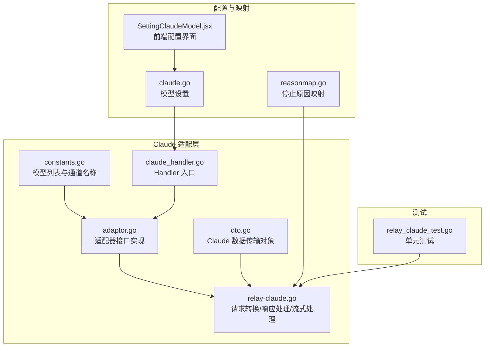
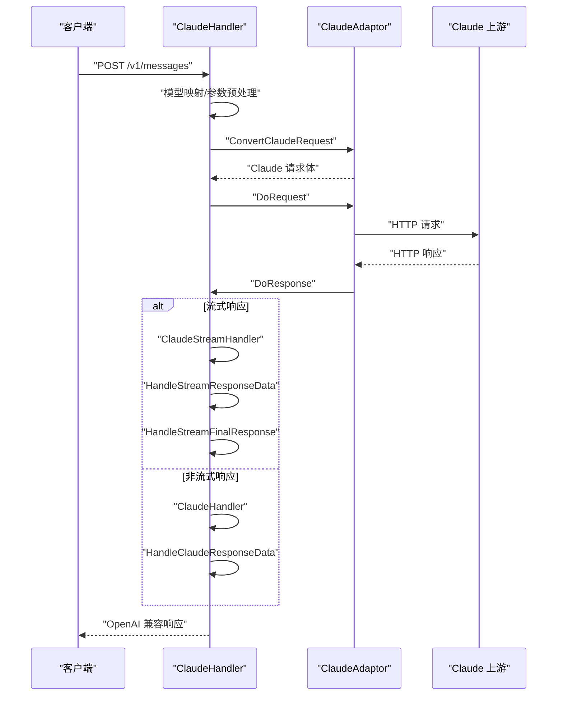
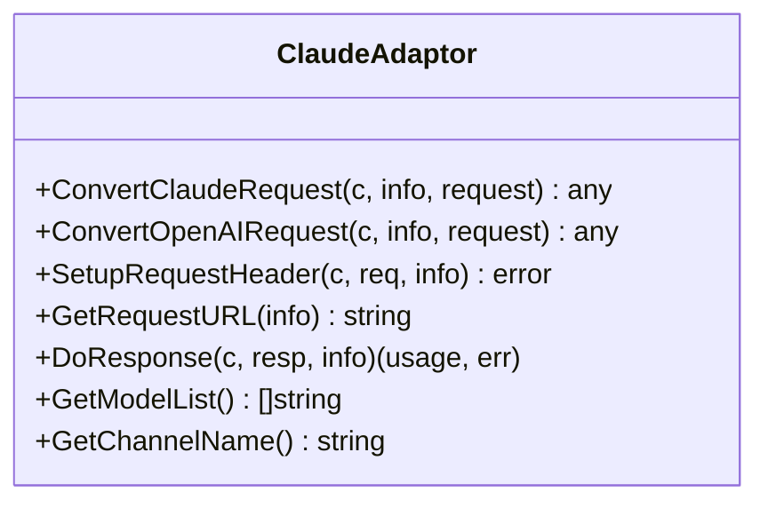
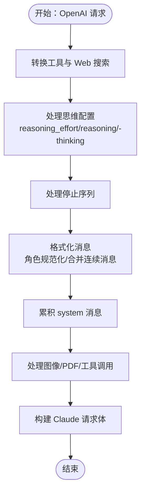
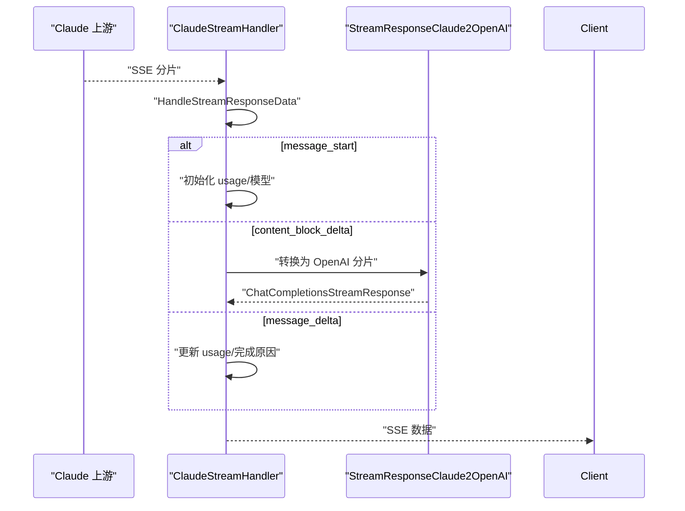
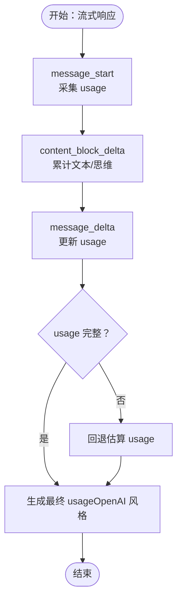
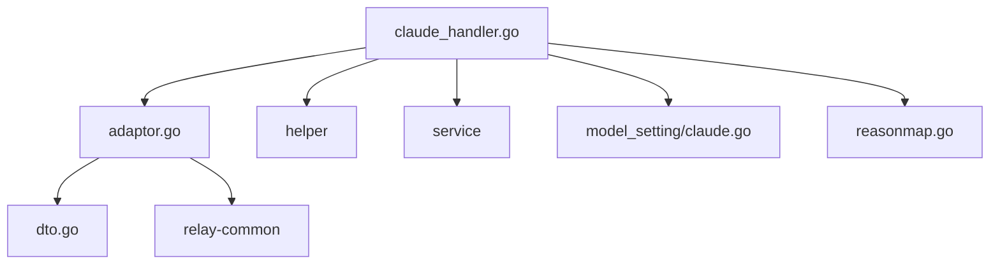

# Claude 适配器

<cite>
**本文档引用的文件**
- [adaptor.go](file://relay/channel/claude/adaptor.go)
- [constants.go](file://relay/channel/claude/constants.go)
- [dto.go](file://relay/channel/claude/dto.go)
- [relay-claude.go](file://relay/channel/claude/relay-claude.go)
- [claude.go](file://dto/claude.go)
- [claude_handler.go](file://relay/claude_handler.go)
- [claude.go](file://setting/model_setting/claude.go)
- [reasonmap.go](file://relay/reasonmap/reasonmap.go)
- [SettingClaudeModel.jsx](file://web/src/pages/Setting/Model/SettingClaudeModel.jsx)
- [relay_claude_test.go](file://relay/channel/claude/relay_claude_test.go)
</cite>

## 目录
1. [简介](#简介)
2. [项目结构](#项目结构)
3. [核心组件](#核心组件)
4. [架构概览](#架构概览)
5. [详细组件分析](#详细组件分析)
6. [依赖关系分析](#依赖关系分析)
7. [性能考量](#性能考量)
8. [故障排除指南](#故障排除指南)
9. [结论](#结论)
10. [附录](#附录)

## 简介
本文件为 Claude 适配器的详细技术文档，面向需要在系统中集成 Anthropic Claude Messages API 的开发者与运维人员。文档涵盖消息格式转换、流式响应处理、错误映射机制、Claude 特有参数配置、模型选择与功能支持、与 OpenAI 格式的差异与兼容策略，并提供配置指南、最佳实践与故障排除方法。

## 项目结构
Claude 适配器位于 relay/channel/claude 目录下，核心文件包括：
- 适配器实现：adaptor.go
- 常量定义：constants.go
- DTO 结构：dto.go
- 请求/响应转换与流式处理：relay-claude.go
- Handler 入口：claude_handler.go
- 配置设置：setting/model_setting/claude.go
- 错误映射：relay/reasonmap/reasonmap.go
- 前端配置界面：web/src/pages/Setting/Model/SettingClaudeModel.jsx
- 单元测试：relay/channel/claude/relay_claude_test.go

**图表来源**
- [adaptor.go:1-135](file://relay/channel/claude/adaptor.go#L1-L135)
- [constants.go:1-32](file://relay/channel/claude/constants.go#L1-L32)
- [dto.go:1-96](file://relay/channel/claude/dto.go#L1-L96)
- [relay-claude.go:1-991](file://relay/channel/claude/relay-claude.go#L1-L991)
- [claude_handler.go:1-196](file://relay/claude_handler.go#L1-L196)
- [claude.go:1-90](file://setting/model_setting/claude.go#L1-L90)
- [reasonmap.go:1-42](file://relay/reasonmap/reasonmap.go#L1-L42)
- [SettingClaudeModel.jsx:1-251](file://web/src/pages/Setting/Model/SettingClaudeModel.jsx#L1-L251)
- [relay_claude_test.go:1-383](file://relay/channel/claude/relay_claude_test.go#L1-L383)

**章节来源**
- [adaptor.go:1-135](file://relay/channel/claude/adaptor.go#L1-L135)
- [constants.go:1-32](file://relay/channel/claude/constants.go#L1-L32)
- [dto.go:1-96](file://relay/channel/claude/dto.go#L1-L96)
- [relay-claude.go:1-991](file://relay/channel/claude/relay-claude.go#L1-L991)
- [claude_handler.go:1-196](file://relay/claude_handler.go#L1-L196)
- [claude.go:1-90](file://setting/model_setting/claude.go#L1-L90)
- [reasonmap.go:1-42](file://relay/reasonmap/reasonmap.go#L1-L42)
- [SettingClaudeModel.jsx:1-251](file://web/src/pages/Setting/Model/SettingClaudeModel.jsx#L1-L251)
- [relay_claude_test.go:1-383](file://relay/channel/claude/relay_claude_test.go#L1-L383)

## 核心组件
- 适配器 Adaptor：实现请求/响应转换、请求 URL 构造、请求头设置、流式与非流式响应处理。
- DTO 层：定义 Claude 请求/响应数据结构、媒体消息、工具、思维配置等。
- Handler：统一入口，负责模型映射、请求预处理、参数覆盖、请求转发与响应消费。
- 配置设置：ClaudeSettings 提供模型头追加、默认 MaxTokens、思考适配开关与预算百分比。
- 错误映射：将 Claude 停止原因映射为 OpenAI 兼容的完成原因。
- 流式处理：支持 SSE 分片解析、增量 usage 补丁、最终 usage 合并与回退估算。

**章节来源**
- [adaptor.go:19-135](file://relay/channel/claude/adaptor.go#L19-L135)
- [claude_handler.go:24-196](file://relay/claude_handler.go#L24-L196)
- [claude.go:16-90](file://setting/model_setting/claude.go#L16-L90)
- [reasonmap.go:9-42](file://relay/reasonmap/reasonmap.go#L9-L42)

## 架构概览
Claude 适配器采用“适配器模式 + Handler 中枢”的架构设计，将上游 Claude API 的请求/响应与下游 OpenAI 兼容格式进行双向转换，并在流式场景下保证 usage 的准确性与完整性。

**图表来源**
- [claude_handler.go:24-196](file://relay/claude_handler.go#L24-L196)
- [adaptor.go:115-126](file://relay/channel/claude/adaptor.go#L115-L126)
- [relay-claude.go:850-939](file://relay/channel/claude/relay-claude.go#L850-L939)

## 详细组件分析

### 适配器 Adaptor
- 请求转换
  - ConvertClaudeRequest：直接返回原始 Claude 请求，便于透传或按需调整。
  - ConvertOpenAIRequest：将 OpenAI 风格请求转换为 Claude 请求，处理工具、Web 搜索、思维配置、停止序列、消息格式化等。
  - ConvertEmbeddingRequest/ConvertRerankRequest/ConvertAudioRequest/ConvertImageRequest：当前未实现或暂不支持。
- 请求头设置
  - SetupRequestHeader：设置 x-api-key、anthropic-version，默认 2023-06-01；可选 anthropic-beta；调用公共头部操作函数写入模型特定头。
  - CommonClaudeHeadersOperation：合并模型级别的自定义请求头。
- 请求 URL
  - GetRequestURL：基础 URL 为 {base}/v1/messages；当需要时附加 beta 查询参数。
- 响应处理
  - DoResponse：根据是否流式调用 ClaudeStreamHandler 或 ClaudeHandler。
  - GetModelList/GetChannelName：提供模型列表与通道名称。

**图表来源**
- [adaptor.go:27-135](file://relay/channel/claude/adaptor.go#L27-L135)

**章节来源**
- [adaptor.go:27-135](file://relay/channel/claude/adaptor.go#L27-L135)

### 请求转换：OpenAI → Claude
- 工具转换：遍历 OpenAI 工具，构建 Claude Tool/InputSchema，保留 type/properties/required 等关键字段。
- Web 搜索工具：将 WebSearchOptions 转换为 ClaudeWebSearchTool，支持 user_location 与 search_context_size 到 max_uses 的映射。
- 思维配置：
  - reasoning_effort：根据 effort 值设置 Thinking 与 OutputConfig。
  - reasoning 参数：支持显式指定 max_tokens 作为预算。
  - -thinking 后缀：启用 Extended Thinking，自动设置 BudgetTokens 与温度，必要时补齐 MaxTokens。
  - claude-opus-4-6 模型：通过 effort 后缀触发 adaptive thinking。
- 停止序列：支持字符串或数组，统一转为数组。
- 消息格式化：
  - 角色规范化：空角色设为 user。
  - 连续相同角色的消息合并为单条，避免 Claude API 的严格顺序要求。
  - system 消息：累积为数组形式，支持文本与媒体混合。
  - tool 消息：与用户消息合并为 tool_result，确保上下文连贯。
  - 图像/PDF：转为 base64 并设置类型（image/document），文本内容保持不变。
  - tool_calls：转换为 tool_use 内容块。

**图表来源**
- [relay-claude.go:47-416](file://relay/channel/claude/relay-claude.go#L47-L416)

**章节来源**
- [relay-claude.go:47-416](file://relay/channel/claude/relay-claude.go#L47-L416)

### 响应转换：Claude → OpenAI
- 流式响应：
  - message_start：初始化响应 ID、模型与 usage。
  - content_block_start：准备首段文本或工具调用。
  - content_block_delta：增量文本、输入 JSON、签名、思维内容。
  - message_delta：完成原因映射与 usage 更新。
  - message_stop：结束流。
- 非流式响应：将 Claude 响应内容块组合为完整文本，提取工具调用与思维内容，生成 OpenAI 风格响应。

**图表来源**
- [relay-claude.go:418-500](file://relay/channel/claude/relay-claude.go#L418-L500)
- [relay-claude.go:765-810](file://relay/channel/claude/relay-claude.go#L765-L810)

**章节来源**
- [relay-claude.go:418-500](file://relay/channel/claude/relay-claude.go#L418-L500)
- [relay-claude.go:765-810](file://relay/channel/claude/relay-claude.go#L765-L810)

### 流式响应处理与 Usage 合成
- usage 合成：
  - message_start：采集 prompt_tokens/cache 相关字段。
  - message_delta：优先使用上游提供的完整 usage；若缺失 input_tokens/cache 字段，基于已接收分片进行补丁。
  - content_block_delta：累计文本与思维内容，用于最终统计。
- 回退估算：若上游 usage 不完整，基于文本长度与提示词估算补全。
- OpenAI 风格 usage：将 Claude usage 转换为 OpenAI 风格，合并缓存创建与读取令牌，计算总输入与总消耗。

**图表来源**
- [relay-claude.go:563-647](file://relay/channel/claude/relay-claude.go#L563-L647)
- [relay-claude.go:812-848](file://relay/channel/claude/relay-claude.go#L812-L848)

**章节来源**
- [relay-claude.go:563-647](file://relay/channel/claude/relay-claude.go#L563-L647)
- [relay-claude.go:812-848](file://relay/channel/claude/relay-claude.go#L812-L848)

### 错误映射与拒绝标记
- 停止原因映射：将 Claude 停止原因映射为 OpenAI 完成原因，如 stop_sequence/end_turn→stop、max_tokens→length、tool_use→tool_calls、refusal→content_filter。
- 拒绝标记：当停止原因为 refusal 时，在上下文中设置拒绝原因键，便于上层策略处理。

**章节来源**
- [reasonmap.go:9-42](file://relay/reasonmap/reasonmap.go#L9-L42)
- [relay-claude.go:34-45](file://relay/channel/claude/relay-claude.go#L34-L45)

### Handler 入口与参数预处理
- 模型映射：根据渠道配置映射模型名称。
- 思维适配：根据模型后缀与配置启用 Extended Thinking，自动设置 BudgetTokens 与温度。
- 系统提示：支持覆盖或前置系统提示，确保上下文一致性。
- 请求透传：支持完全透传原始请求体，或按需移除禁用字段与应用参数覆盖。
- 响应处理：根据 Content-Type 判断是否流式，调用相应处理器并消费配额。

**章节来源**
- [claude_handler.go:24-196](file://relay/claude_handler.go#L24-L196)

### 配置与最佳实践
- 模型头追加：通过模型级别配置追加请求头（如 anthropic-beta），避免覆盖已有值。
- 默认 MaxTokens：按模型维度设置默认最大令牌数，保障不同模型的合理上限。
- 思维适配：开启后自动为 -thinking 模型设置预算与温度，必要时补齐 MaxTokens。
- 前端配置界面：提供可视化编辑模型头追加、默认 MaxTokens、思维适配开关与预算百分比。

**章节来源**
- [claude.go:16-90](file://setting/model_setting/claude.go#L16-L90)
- [SettingClaudeModel.jsx:33-251](file://web/src/pages/Setting/Model/SettingClaudeModel.jsx#L33-L251)

## 依赖关系分析
- 组件耦合
  - Adaptor 依赖 relay-common、channel 与 model_setting，用于请求构造与配置读取。
  - Handler 依赖 Adaptor、DTO、helper、service 等，形成统一的请求生命周期。
  - DTO 层独立于具体适配器，便于跨通道复用。
- 外部依赖
  - Claude 上游 API：消息接口、SSE 流、错误结构。
  - OpenAI 兼容层：完成原因映射、响应格式转换。
- 循环依赖
  - 代码结构清晰，未发现循环导入。

**图表来源**
- [claude_handler.go:1-196](file://relay/claude_handler.go#L1-L196)
- [adaptor.go:1-135](file://relay/channel/claude/adaptor.go#L1-L135)
- [dto.go:1-596](file://dto/claude.go#L1-L596)
- [claude.go:1-90](file://setting/model_setting/claude.go#L1-L90)
- [reasonmap.go:1-42](file://relay/reasonmap/reasonmap.go#L1-L42)

**章节来源**
- [claude_handler.go:1-196](file://relay/claude_handler.go#L1-L196)
- [adaptor.go:1-135](file://relay/channel/claude/adaptor.go#L1-L135)
- [dto.go:1-596](file://dto/claude.go#L1-L596)
- [claude.go:1-90](file://setting/model_setting/claude.go#L1-L90)
- [reasonmap.go:1-42](file://relay/reasonmap/reasonmap.go#L1-L42)

## 性能考量
- 流式解耦：使用 StreamScannerHandler 实现上游与下游处理的解耦，降低端到端延迟。
- usage 补丁：针对上游缺失字段进行本地补丁，减少等待时间并提升准确性。
- 回退估算：在 usage 不完整时快速估算，避免长时间阻塞。
- 参数覆盖与禁用字段：在透传模式下移除无效字段，减少网络开销。

[本节为通用指导，无需特定文件引用]

## 故障排除指南
- 常见问题
  - 流式 usage 不完整：检查上游是否返回完整 usage，必要时启用补丁逻辑或回退估算。
  - 拒绝内容：当停止原因为 refusal 时，系统会标记拒绝原因，需检查渠道策略与内容过滤规则。
  - 工具调用失败：确认工具定义与参数 schema 是否正确，特别是 JSON 输入的解析。
  - 思维适配异常：检查 -thinking 模型的 BudgetTokens 与 MaxTokens 设置，确保满足最低阈值。
- 排查步骤
  - 开启调试日志，观察请求/响应体与 usage 合成过程。
  - 使用单元测试验证消息格式化与 usage 计算逻辑。
  - 检查模型头追加与默认 MaxTokens 配置是否符合预期。

**章节来源**
- [relay-claude.go:765-848](file://relay/channel/claude/relay-claude.go#L765-L848)
- [relay_claude_test.go:1-383](file://relay/channel/claude/relay_claude_test.go#L1-L383)

## 结论
Claude 适配器通过完善的请求/响应转换、健壮的流式处理与准确的 usage 合成，实现了对 Anthropic Claude Messages API 的高效适配。配合灵活的配置与前端界面，能够满足多场景下的部署与运维需求。建议在生产环境中结合单元测试与监控日志，持续优化参数与策略。

[本节为总结性内容，无需特定文件引用]

## 附录

### Claude 特有参数与功能支持
- 思维配置：支持 reasoning_effort、reasoning 参数与 -thinking 后缀模型的 Extended Thinking。
- Web 搜索：通过 WebSearchTool 与 user_location、max_uses 映射实现。
- 输出配置：支持 OutputConfig 与 Speed、ServiceTier 等高级字段（受渠道设置控制）。
- 缓存控制：支持 cache_control 与缓存读取/创建令牌的追踪。

**章节来源**
- [relay-claude.go:187-221](file://relay/channel/claude/relay-claude.go#L187-L221)
- [dto.go:206-237](file://dto/claude.go#L206-L237)

### 与 OpenAI 格式的差异与兼容策略
- 完成原因映射：stop_sequence/end_turn→stop、max_tokens→length、tool_use→tool_calls、refusal→content_filter。
- 流式分片：将 Claude SSE 事件映射为 OpenAI chunk，保留工具调用与思维内容。
- usage 转换：将 Claude usage 转为 OpenAI 风格，合并缓存相关字段。

**章节来源**
- [reasonmap.go:9-42](file://relay/reasonmap/reasonmap.go#L9-L42)
- [relay-claude.go:418-500](file://relay/channel/claude/relay-claude.go#L418-L500)
- [relay-claude.go:586-604](file://relay/channel/claude/relay-claude.go#L586-L604)

### 配置指南与最佳实践
- 模型头追加：按模型维度配置 anthropic-beta 等头，避免覆盖已有值。
- 默认 MaxTokens：为不同模型设置合理的默认上限，兼顾性能与成本。
- 思维适配：启用后自动设置 BudgetTokens 与温度，注意最小 MaxTokens 要求。
- 前端配置：通过界面可视化编辑配置，便于团队协作与审计。

**章节来源**
- [claude.go:51-90](file://setting/model_setting/claude.go#L51-L90)
- [SettingClaudeModel.jsx:125-251](file://web/src/pages/Setting/Model/SettingClaudeModel.jsx#L125-L251)

### 调用示例与参数对照
- 示例路径
  - OpenAI → Claude 请求转换：[RequestOpenAI2ClaudeMessage:47-416](file://relay/channel/claude/relay-claude.go#L47-L416)
  - 流式响应转换：[StreamResponseClaude2OpenAI:418-500](file://relay/channel/claude/relay-claude.go#L418-L500)
  - 非流式响应转换：[ResponseClaude2OpenAI:502-561](file://relay/channel/claude/relay-claude.go#L502-L561)
  - Handler 入口：[ClaudeHelper:24-196](file://relay/claude_handler.go#L24-L196)
- 参数对照
  - 工具与 Web 搜索：参见 [Tool/ClaudeWebSearchTool:173-198](file://dto/claude.go#L173-L198)
  - 思维配置：参见 [Thinking:448-458](file://dto/claude.go#L448-L458)
  - usage 字段：参见 [ClaudeUsage:552-596](file://dto/claude.go#L552-L596)

**章节来源**
- [relay-claude.go:47-561](file://relay/channel/claude/relay-claude.go#L47-L561)
- [claude_handler.go:24-196](file://relay/claude_handler.go#L24-L196)
- [dto.go:173-596](file://dto/claude.go#L173-L596)