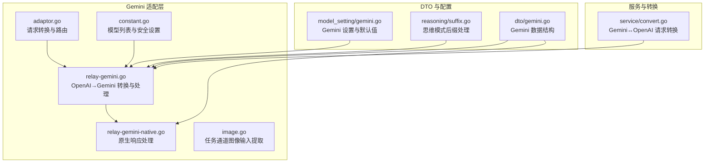
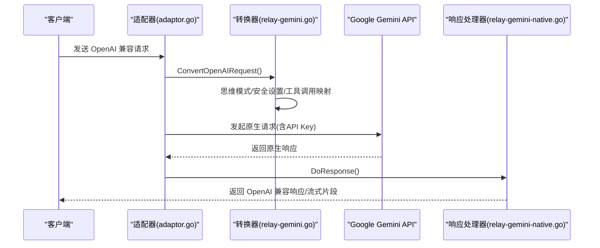
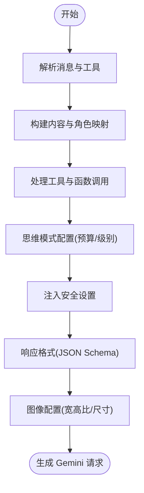
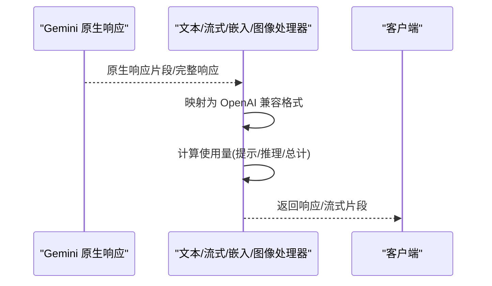
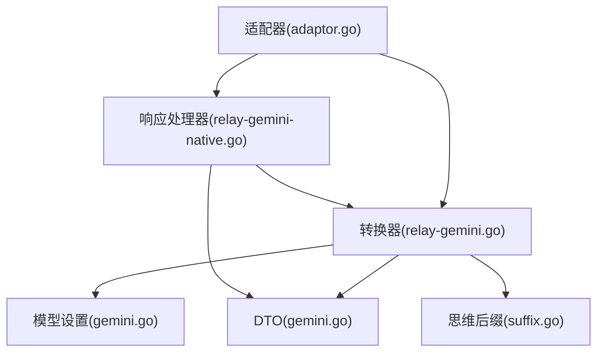

# Gemini 适配器

<cite>
**本文档引用的文件**
- [adaptor.go](file://relay/channel/gemini/adaptor.go)
- [relay-gemini.go](file://relay/channel/gemini/relay-gemini.go)
- [relay-gemini-native.go](file://relay/channel/gemini/relay-gemini-native.go)
- [gemini.go](file://dto/gemini.go)
- [gemini.go](file://setting/model_setting/gemini.go)
- [constant.go](file://relay/channel/gemini/constant.go)
- [suffix.go](file://setting/reasoning/suffix.go)
- [image.go](file://relay/channel/task/gemini/image.go)
- [convert.go](file://service/convert.go)
</cite>

## 目录
1. [简介](#简介)
2. [项目结构](#项目结构)
3. [核心组件](#核心组件)
4. [架构总览](#架构总览)
5. [详细组件分析](#详细组件分析)
6. [依赖关系分析](#依赖关系分析)
7. [性能考虑](#性能考虑)
8. [故障排除指南](#故障排除指南)
9. [结论](#结论)
10. [附录](#附录)

## 简介
本文件为 Gemini 适配器的完整技术文档，面向需要在系统中集成 Google Gemini API 的开发者与运维人员。文档覆盖以下关键主题：
- 多模态支持：文本、图像、音频、视频与代码执行的适配机制
- 思维模式（Thinking）功能：预算控制、级别映射与兼容性处理
- 安全设置：安全分类阈值与默认策略
- Gemini 特有参数：生成配置、工具调用、响应格式与图像配置
- 模型能力与功能映射：聊天、嵌入、图像生成、流式与非流式响应
- 图像处理流程：数据 URI、Base64、MIME 类型校验与大小限制
- 配置指南、性能优化与调试方法
- 功能示例与参数对照说明

## 项目结构
Gemini 适配器位于 relay/channel/gemini 目录下，配合 DTO 定义、模型设置与工具函数共同完成 OpenAI 兼容请求到 Gemini 原生请求的转换，以及响应的回传与格式化。

**图表来源**
- [adaptor.go:1-288](file://relay/channel/gemini/adaptor.go#L1-L288)
- [relay-gemini.go:1-1716](file://relay/channel/gemini/relay-gemini.go#L1-L1716)
- [relay-gemini-native.go:1-98](file://relay/channel/gemini/relay-gemini-native.go#L1-L98)
- [gemini.go:1-581](file://dto/gemini.go#L1-L581)
- [gemini.go:1-77](file://setting/model_setting/gemini.go#L1-L77)
- [constant.go:1-44](file://relay/channel/gemini/constant.go#L1-L44)
- [suffix.go:1-21](file://setting/reasoning/suffix.go#L1-L21)
- [image.go:1-101](file://relay/channel/task/gemini/image.go#L1-L101)
- [convert.go:658-815](file://service/convert.go#L658-L815)

**章节来源**
- [adaptor.go:1-288](file://relay/channel/gemini/adaptor.go#L1-L288)
- [relay-gemini.go:1-1716](file://relay/channel/gemini/relay-gemini.go#L1-L1716)
- [gemini.go:1-581](file://dto/gemini.go#L1-L581)
- [gemini.go:1-77](file://setting/model_setting/gemini.go#L1-L77)
- [constant.go:1-44](file://relay/channel/gemini/constant.go#L1-L44)
- [suffix.go:1-21](file://setting/reasoning/suffix.go#L1-L21)
- [image.go:1-101](file://relay/channel/task/gemini/image.go#L1-L101)
- [convert.go:658-815](file://service/convert.go#L658-L815)

## 核心组件
- 适配器入口与路由
  - 负责根据上游模型名选择合适的端点动作（聊天、嵌入、图像生成、流式等），并设置请求头（API Key）。
  - 支持思维模式开关与预算处理逻辑的前置清理。
- OpenAI→Gemini 转换器
  - 将 OpenAI 兼容的消息、工具、响应格式等映射到 Gemini 结构；处理思维模式配置、停止序列、种子、响应模态等。
  - 支持额外体（extra_body）中的 Google 特定参数（如 thinking_config、image_config）。
- 响应处理器
  - 非流式：解析原生响应，构建使用量统计，必要时注入拒绝原因上下文。
  - 流式：逐段解析，映射为 OpenAI 兼容的流式响应，处理工具调用与思维内容分发。
- DTO 与配置
  - 定义 Gemini 请求/响应结构、思维配置、图像请求/响应、嵌入请求/响应等。
  - 模型设置提供安全阈值、版本映射、思维适配开关与默认值。
- 常量与工具
  - 模型清单、安全分类、思维预算边界与后缀解析工具。

**章节来源**
- [adaptor.go:26-171](file://relay/channel/gemini/adaptor.go#L26-L171)
- [relay-gemini.go:200-645](file://relay/channel/gemini/relay-gemini.go#L200-L645)
- [gemini.go:14-581](file://dto/gemini.go#L14-L581)
- [gemini.go:7-77](file://setting/model_setting/gemini.go#L7-L77)
- [constant.go:3-44](file://relay/channel/gemini/constant.go#L3-L44)
- [suffix.go:9-21](file://setting/reasoning/suffix.go#L9-L21)

## 架构总览
Gemini 适配器采用“请求转换 + 原生调用 + 响应映射”的三层架构：
- 请求转换层：将 OpenAI 兼容请求转换为 Gemini 原生请求，并注入安全设置、思维配置与工具调用。
- 原生调用层：通过适配器构造请求 URL 与头部，调用 Google Gemini API。
- 响应映射层：将原生响应映射为 OpenAI 兼容格式，计算使用量并处理流式输出。

**图表来源**
- [adaptor.go:179-279](file://relay/channel/gemini/adaptor.go#L179-L279)
- [relay-gemini.go:200-645](file://relay/channel/gemini/relay-gemini.go#L200-L645)
- [relay-gemini-native.go:20-98](file://relay/channel/gemini/relay-gemini-native.go#L20-L98)

## 详细组件分析

### 请求转换与路由（适配器）
- 模型与端点选择
  - 根据模型前缀判断：imagen 模型走预测端点；嵌入模型走 embedContent/batchEmbedContents；其他走 generateContent/streamGenerateContent。
  - 流式模式自动切换到 alt=sse 并禁用 ping。
- 思维模式处理
  - 在开启思维适配时，对模型名进行清洗（去除 -thinking/-nothinking 与 effort 后缀），并在生成配置中注入思维预算与级别。
- 请求头设置
  - 通过 x-goog-api-key 注入 API Key。

**章节来源**
- [adaptor.go:130-171](file://relay/channel/gemini/adaptor.go#L130-L171)
- [adaptor.go:173-177](file://relay/channel/gemini/adaptor.go#L173-L177)

### OpenAI→Gemini 转换器
- 角色与内容映射
  - system/developer → systemInstruction；assistant → model；tool/function → functionResponse；其余保留为 user。
  - 支持 Markdown 图片内联（data URI）解析为 inlineData。
- 工具与函数调用
  - 将 OpenAI tools 映射为 Gemini 工具声明与 functionDeclarations；支持 tool_choice 到 functionCallingConfig 的映射。
  - 可选启用 codeExecution、googleSearch、urlContext 等工具。
- 思维模式配置
  - 支持 extra_body.google.thinking_config.thinking_budget/thinking_level/include_thoughts。
  - 若未显式配置，依据模型类型与 effort 参数自动计算预算并钳制在允许范围内。
- 响应格式与图像配置
  - 当响应格式为 json_schema/json_object 时，设置 responseMimeType 为 application/json，并清洗 JSON Schema。
  - 支持 extra_body.google.image_config.aspect_ratio/image_size 的 snake_case 到 camelCase 转换。
- 安全设置
  - 为每个 HARM_CATEGORY 注入阈值，默认值来自模型设置。

**图表来源**
- [relay-gemini.go:200-645](file://relay/channel/gemini/relay-gemini.go#L200-L645)

**章节来源**
- [relay-gemini.go:200-645](file://relay/channel/gemini/relay-gemini.go#L200-L645)
- [relay-gemini.go:134-198](file://relay/channel/gemini/relay-gemini.go#L134-L198)
- [relay-gemini.go:1658-1716](file://relay/channel/gemini/relay-gemini.go#L1658-L1716)

### 响应处理器
- 非流式文本生成
  - 解析原生响应，若无候选且存在 blockReason，注入拒绝原因上下文；计算使用量（prompt/candidates/thoughts/tokens）。
- 嵌入与批量嵌入
  - 解析单条或多条嵌入结果，转换为 OpenAI 兼容格式并计算使用量。
- 流式文本生成
  - 逐段解析，映射为 OpenAI 兼容 chunk；处理工具调用索引与思维内容；在首次工具调用时发送空响应以满足 OpenAI 协议。
- 图像生成
  - 解析预测结果，过滤被过滤项，转换为 OpenAI 图像响应；每张图固定计费 258 tokens。

**图表来源**
- [relay-gemini-native.go:20-98](file://relay/channel/gemini/relay-gemini-native.go#L20-L98)
- [relay-gemini.go:1014-1052](file://relay/channel/gemini/relay-gemini.go#L1014-L1052)
- [relay-gemini.go:1319-1407](file://relay/channel/gemini/relay-gemini.go#L1319-L1407)
- [relay-gemini.go:1486-1583](file://relay/channel/gemini/relay-gemini.go#L1486-L1583)

**章节来源**
- [relay-gemini-native.go:20-98](file://relay/channel/gemini/relay-gemini-native.go#L20-L98)
- [relay-gemini.go:1014-1052](file://relay/channel/gemini/relay-gemini.go#L1014-L1052)
- [relay-gemini.go:1319-1407](file://relay/channel/gemini/relay-gemini.go#L1319-L1407)
- [relay-gemini.go:1486-1583](file://relay/channel/gemini/relay-gemini.go#L1486-L1583)

### 数据结构与模型映射（DTO）
- 聊天请求/响应
  - 内容由角色与部件组成；部件支持文本、内联数据、函数调用、函数响应、可执行代码与代码执行结果。
  - 响应包含候选、提示反馈与使用元数据。
- 嵌入请求/响应
  - 支持单条与批量嵌入；可设置输出维度（部分新模型）。
- 图像请求/响应
  - 实例包含提示词；参数包含采样数、宽高比、人物生成策略与图像尺寸。
- 思维配置
  - 支持 include_thoughts、thinking_budget、thinking_level，兼容 snake_case 与 camelCase 字段。

**章节来源**
- [gemini.go:14-581](file://dto/gemini.go#L14-L581)

### 模型设置与安全
- 安全设置
  - 默认关闭（OFF）；可针对不同分类设置阈值。
- 版本设置
  - 不同模型使用不同 API 版本（如 gemini-1.0-pro 使用 v1，其他默认 v1beta）。
- 思维适配
  - 开关与预算百分比；函数调用思维签名与移除函数响应 ID 的开关。
- 模型清单
  - 包含稳定版、最新版、预览版、嵌入与图像模型等。

**章节来源**
- [gemini.go:7-77](file://setting/model_setting/gemini.go#L7-L77)
- [constant.go:3-44](file://relay/channel/gemini/constant.go#L3-L44)

### 思维模式与预算控制
- 预算钳制
  - 针对不同模型（如 gemini-2.5-pro、2.5-flash-lite）设定最小/最大预算范围。
- effort 映射
  - high/medium/low/minimal 映射为预算占最大输出令牌的百分比。
- 模型后缀处理
  - 支持 -thinking、-nothinking 与 effort 后缀（-max/-high/-medium/-low/-minimal）的解析与剥离。

**章节来源**
- [relay-gemini.go:74-132](file://relay/channel/gemini/relay-gemini.go#L74-L132)
- [relay-gemini.go:134-198](file://relay/channel/gemini/relay-gemini.go#L134-L198)
- [suffix.go:11-21](file://setting/reasoning/suffix.go#L11-L21)

### 图像处理与多模态
- 输入来源
  - 支持 multipart/form-data 中的 input_reference 文件；支持 data URI 与 raw Base64。
  - 限制最大 20MB；自动推断 MIME 类型。
- MIME 类型白名单
  - 严格校验支持的媒体类型（PDF、音频、图像、文本、视频）。
- 输出映射
  - 将 Gemini 图像预测结果转换为 OpenAI 图像响应；每张图固定计费 258 tokens。

**章节来源**
- [image.go:18-101](file://relay/channel/task/gemini/image.go#L18-L101)
- [relay-gemini.go:31-51](file://relay/channel/gemini/relay-gemini.go#L31-L51)
- [relay-gemini.go:598-601](file://relay/channel/gemini/relay-gemini.go#L598-L601)
- [relay-gemini.go:1531-1583](file://relay/channel/gemini/relay-gemini.go#L1531-L1583)

### Gemini↔OpenAI 转换
- 反向转换（Gemini→OpenAI）
  - 将 Gemini 候选内容映射为 OpenAI 消息；处理工具调用、思维内容与媒体链接。
- OpenAI 工具到 Gemini 工具
  - 支持 tool_choice 的 AUTO/NONE/ANY 映射与特定函数名限制。

**章节来源**
- [convert.go:658-815](file://service/convert.go#L658-L815)
- [relay-gemini.go:1658-1716](file://relay/channel/gemini/relay-gemini.go#L1658-L1716)

## 依赖关系分析
- 组件耦合
  - 适配器依赖转换器与响应处理器；转换器依赖 DTO、模型设置与工具函数；响应处理器依赖转换器与使用量计算。
- 外部依赖
  - Google Gemini API；HTTP 客户端；日志与错误处理模块。
- 循环依赖
  - 未发现循环导入；各模块职责清晰。

**图表来源**
- [adaptor.go:1-288](file://relay/channel/gemini/adaptor.go#L1-L288)
- [relay-gemini.go:1-1716](file://relay/channel/gemini/relay-gemini.go#L1-L1716)
- [gemini.go:1-581](file://dto/gemini.go#L1-L581)
- [gemini.go:1-77](file://setting/model_setting/gemini.go#L1-L77)
- [suffix.go:1-21](file://setting/reasoning/suffix.go#L1-L21)
- [relay-gemini-native.go:1-98](file://relay/channel/gemini/relay-gemini-native.go#L1-L98)

**章节来源**
- [adaptor.go:1-288](file://relay/channel/gemini/adaptor.go#L1-L288)
- [relay-gemini.go:1-1716](file://relay/channel/gemini/relay-gemini.go#L1-L1716)

## 性能考虑
- 流式处理
  - 使用流扫描器逐段解析响应，减少内存占用；在首次工具调用时发送空响应以满足协议要求。
- 使用量估算
  - 当上游未提供使用量时，基于文本估算；图像生成固定计费 tokens。
- MIME 类型校验
  - 严格的白名单校验避免无效媒体导致的额外开销与错误。
- 思维预算钳制
  - 避免超大预算导致延迟与成本上升；对不同模型设定合理边界。

[本节为通用指导，无需具体文件分析]

## 故障排除指南
- 常见错误与定位
  - 响应体解析失败：检查响应体是否为有效 JSON；查看错误码与状态码映射。
  - 空候选或被阻止：当 candidates 为空且存在 blockReason 时，注入拒绝原因上下文，便于定位。
  - MIME 类型不支持：确保媒体类型在白名单内；检查 data URI 或上传文件的 Content-Type。
  - 工具调用参数错误：extra_body 中 thinking_config/image_config 的字段名需为 snake_case。
- 调试建议
  - 启用调试模式查看原始响应；核对转换前后请求体差异；验证思维预算与工具调用映射。
- 限流与配额
  - 结合系统级限流与渠道配额策略，避免触发 API 限流。

**章节来源**
- [relay-gemini-native.go:20-50](file://relay/channel/gemini/relay-gemini-native.go#L20-L50)
- [relay-gemini.go:598-601](file://relay/channel/gemini/relay-gemini.go#L598-L601)
- [relay-gemini.go:250-353](file://relay/channel/gemini/relay-gemini.go#L250-L353)

## 结论
Gemini 适配器通过清晰的三层架构实现了 OpenAI 兼容接口与 Google Gemini API 的无缝对接。其特性包括：
- 全面的多模态支持与严格的媒体类型校验
- 灵活的思维模式预算与级别控制
- 完整的工具调用与响应格式映射
- 高效的流式处理与使用量统计
- 可配置的安全设置与版本策略

该适配器为系统提供了稳定、可扩展的 Gemini 集成方案，适合在生产环境中部署与维护。

[本节为总结，无需具体文件分析]

## 附录

### 配置指南
- 安全设置
  - 在模型设置中配置各类安全分类的阈值，默认关闭（OFF）。
- 版本设置
  - 为特定模型指定 API 版本；默认使用 v1beta。
- 思维适配
  - 开启开关与预算百分比；可选择是否移除函数响应 ID、是否附加思维签名。
- 模型清单
  - 使用内置模型列表或动态拉取模型列表。

**章节来源**
- [gemini.go:7-77](file://setting/model_setting/gemini.go#L7-L77)
- [constant.go:3-44](file://relay/channel/gemini/constant.go#L3-L44)

### 参数对照表（OpenAI ↔ Gemini）
- 角色映射
  - system/developer → systemInstruction；assistant → model；tool/function → functionResponse。
- 工具映射
  - tools → Gemini 工具声明；tool_choice → functionCallingConfig.mode。
- 响应格式
  - response_format=json_schema/json_object → responseMimeType=application/json；清洗 JSON Schema。
- 思维模式
  - extra_body.google.thinking_config.thinking_budget/thinking_level/include_thoughts；模型后缀 -thinking/-nothinking 与 effort 后缀。
- 图像配置
  - extra_body.google.image_config.aspect_ratio/image_size → camelCase；支持采样数、宽高比、人物生成策略与图像尺寸。

**章节来源**
- [relay-gemini.go:200-645](file://relay/channel/gemini/relay-gemini.go#L200-L645)
- [relay-gemini.go:1658-1716](file://relay/channel/gemini/relay-gemini.go#L1658-L1716)
- [convert.go:658-815](file://service/convert.go#L658-L815)

### 功能示例路径
- 文本生成（含思维模式）
  - 请求转换：[CovertOpenAI2Gemini:200-645](file://relay/channel/gemini/relay-gemini.go#L200-L645)
  - 响应处理：[GeminiChatHandler:1409-1484](file://relay/channel/gemini/relay-gemini.go#L1409-L1484)
- 流式文本生成
  - 响应处理：[GeminiChatStreamHandler:1319-1407](file://relay/channel/gemini/relay-gemini.go#L1319-L1407)
- 嵌入
  - 请求转换：[ConvertEmbeddingRequest:196-238](file://relay/channel/gemini/adaptor.go#L196-L238)
  - 响应处理：[GeminiEmbeddingHandler:1486-1529](file://relay/channel/gemini/relay-gemini.go#L1486-L1529)
- 图像生成
  - 请求转换：[ConvertImageRequest:60-124](file://relay/channel/gemini/adaptor.go#L60-L124)
  - 响应处理：[GeminiImageHandler:1531-1583](file://relay/channel/gemini/relay-gemini.go#L1531-L1583)
- 图像输入提取（任务通道）
  - [ExtractMultipartImage:18-52](file://relay/channel/task/gemini/image.go#L18-L52)

**章节来源**
- [adaptor.go:60-124](file://relay/channel/gemini/adaptor.go#L60-L124)
- [adaptor.go:196-238](file://relay/channel/gemini/adaptor.go#L196-L238)
- [relay-gemini.go:200-645](file://relay/channel/gemini/relay-gemini.go#L200-L645)
- [relay-gemini.go:1319-1407](file://relay/channel/gemini/relay-gemini.go#L1319-L1407)
- [relay-gemini.go:1409-1484](file://relay/channel/gemini/relay-gemini.go#L1409-L1484)
- [relay-gemini.go:1486-1529](file://relay/channel/gemini/relay-gemini.go#L1486-L1529)
- [relay-gemini.go:1531-1583](file://relay/channel/gemini/relay-gemini.go#L1531-L1583)
- [image.go:18-52](file://relay/channel/task/gemini/image.go#L18-L52)