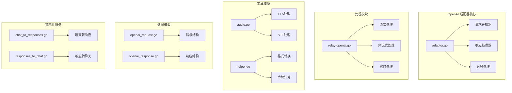
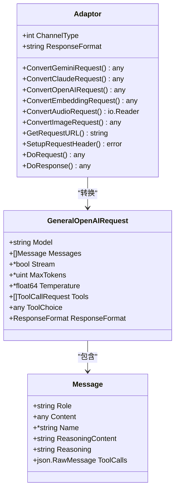
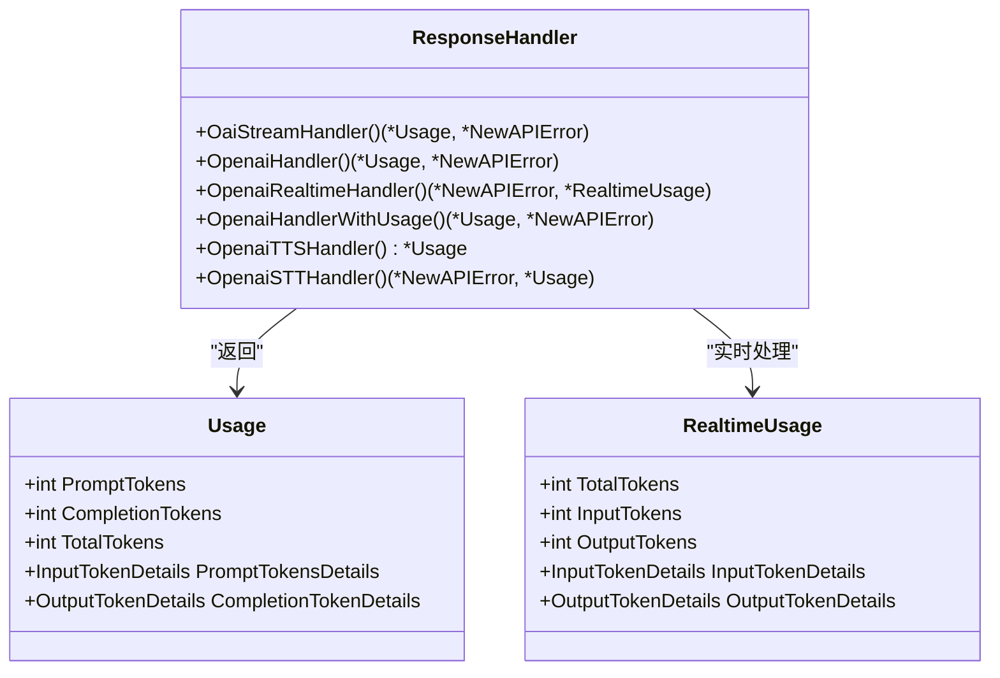
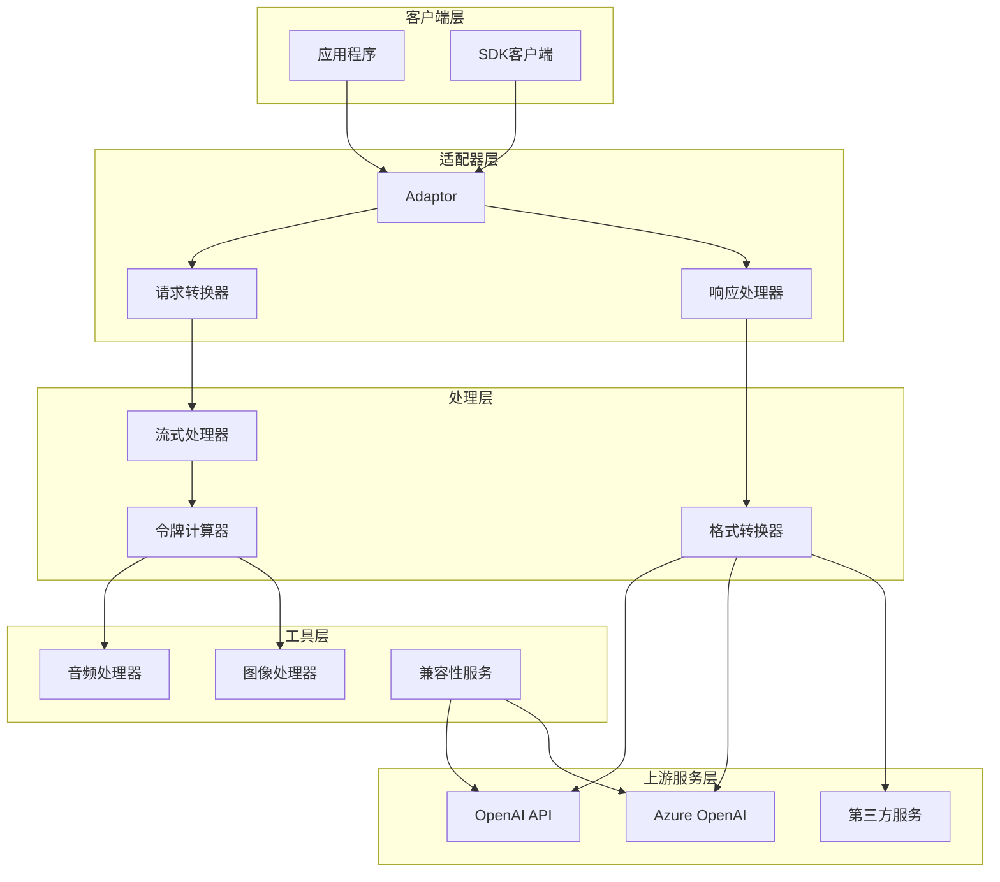
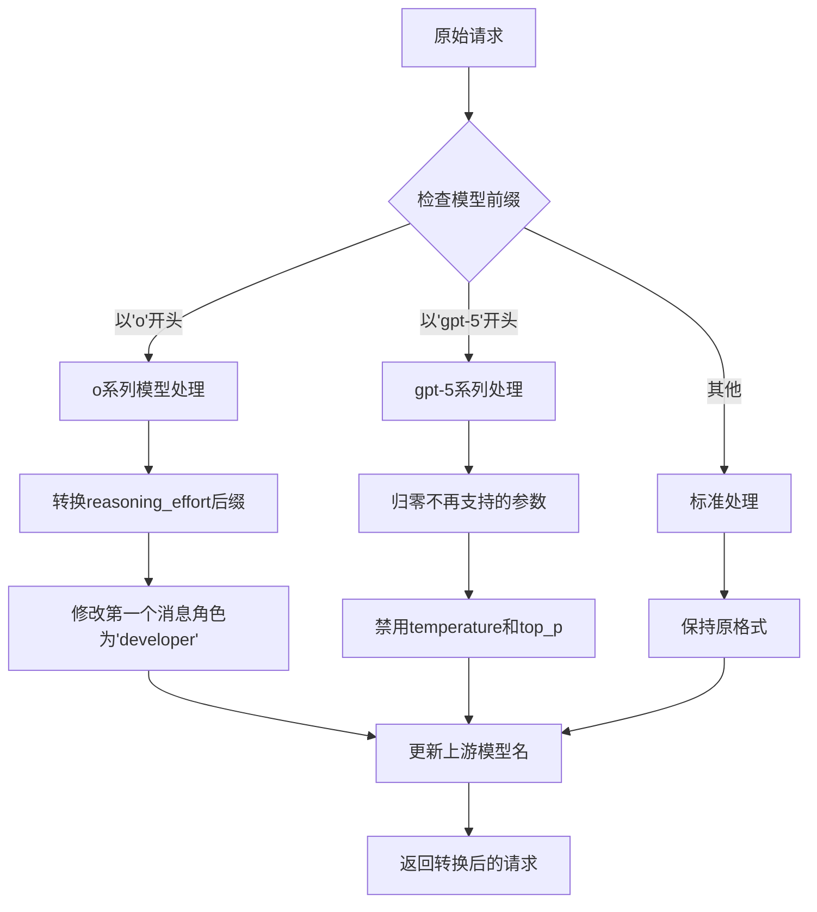
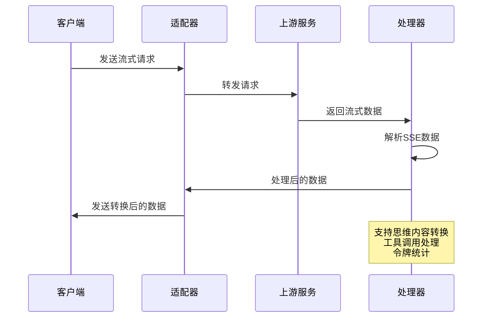
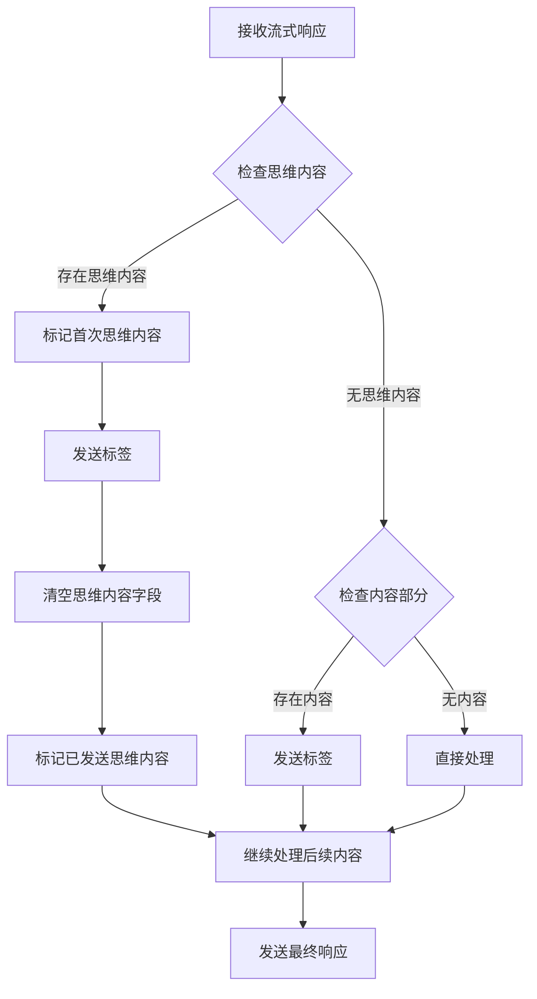
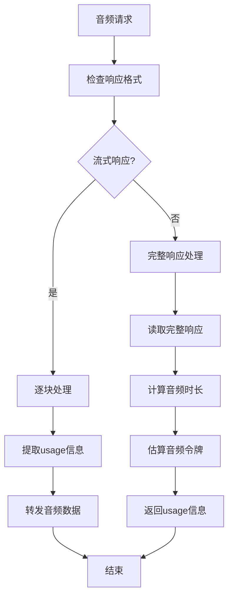
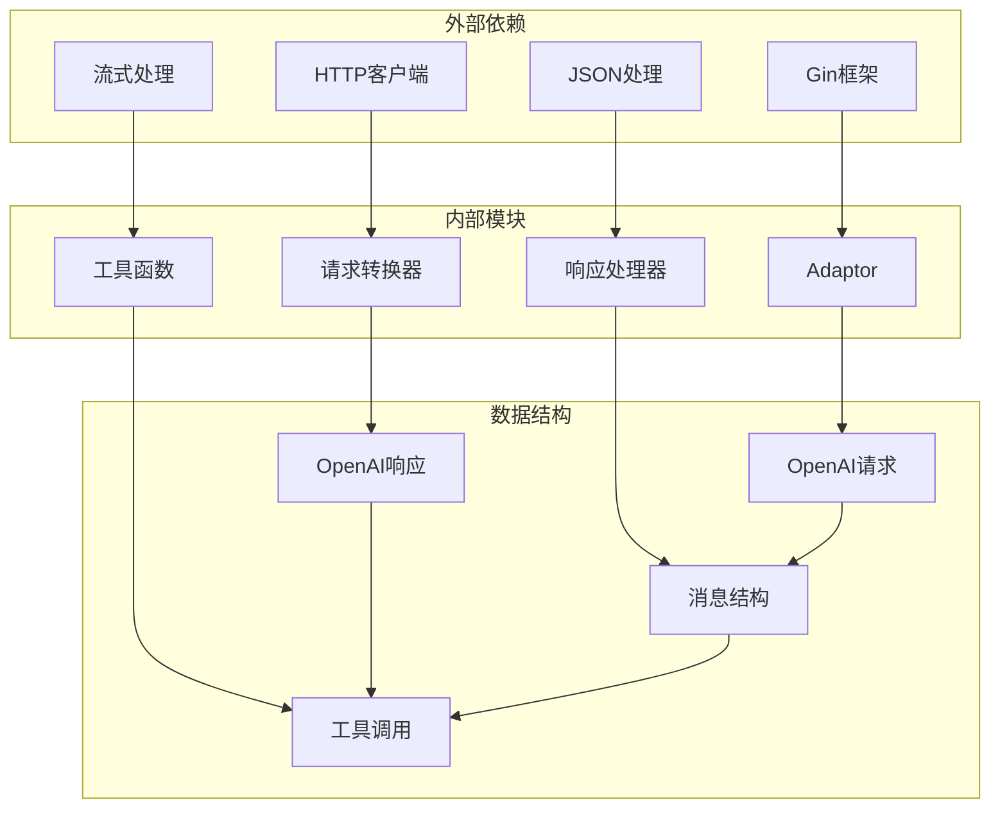

# OpenAI 适配器

<cite>
**本文档引用的文件**
- [adaptor.go](file://relay/channel/openai/adaptor.go)
- [relay-openai.go](file://relay/channel/openai/relay-openai.go)
- [audio.go](file://relay/channel/openai/audio.go)
- [constant.go](file://relay/channel/openai/constant.go)
- [helper.go](file://relay/channel/openai/helper.go)
- [openai_request.go](file://dto/openai_request.go)
- [openai_response.go](file://dto/openai_response.go)
- [chat_to_responses.go](file://service/openaicompat/chat_to_responses.go)
- [responses_to_chat.go](file://service/openaicompat/responses_to_chat.go)
</cite>

## 目录
1. [简介](#简介)
2. [项目结构](#项目结构)
3. [核心组件](#核心组件)
4. [架构概览](#架构概览)
5. [详细组件分析](#详细组件分析)
6. [依赖关系分析](#依赖关系分析)
7. [性能考虑](#性能考虑)
8. [故障排除指南](#故障排除指南)
9. [结论](#结论)
10. [附录](#附录)

## 简介

OpenAI 适配器是 NewAPI 项目中的核心组件，负责实现与 OpenAI API 的完全兼容性。该适配器不仅支持标准的聊天补全功能，还提供了嵌入向量、音频处理、图像生成等高级功能的完整适配机制。

该适配器的主要特点包括：
- **多模型支持**：支持从 gpt-3.5 到 gpt-5 系列的所有 OpenAI 模型
- **兼容性增强**：提供与 Claude、Gemini 等其他 AI 模型的双向转换能力
- **流式处理**：完整的流式响应处理机制，支持实时交互
- **功能扩展**：支持思维模式、函数调用、推理能力等 OpenAI 特有功能
- **音频处理**：完整的语音合成(TTS)和语音识别(STT)支持
- **响应格式转换**：支持多种响应格式的自动转换

## 项目结构

OpenAI 适配器位于 `relay/channel/openai/` 目录下，采用模块化设计，每个功能模块都有独立的文件：

**图表来源**
- [adaptor.go:1-684](file://relay/channel/openai/adaptor.go#L1-L684)
- [relay-openai.go:1-719](file://relay/channel/openai/relay-openai.go#L1-L719)

**章节来源**
- [adaptor.go:1-684](file://relay/channel/openai/adaptor.go#L1-L684)
- [constant.go:1-77](file://relay/channel/openai/constant.go#L1-L77)

## 核心组件

### 请求转换器 (Adaptor)

Adaptor 是 OpenAI 适配器的核心组件，负责将上游请求转换为兼容的 OpenAI 格式。它支持多种输入格式的转换：

**图表来源**
- [adaptor.go:37-40](file://relay/channel/openai/adaptor.go#L37-L40)
- [openai_request.go:29-109](file://dto/openai_request.go#L29-L109)

### 响应处理器

响应处理器负责处理来自上游服务的响应，并将其转换为标准的 OpenAI 格式：

**图表来源**
- [relay-openai.go:106-193](file://relay/channel/openai/relay-openai.go#L106-L193)
- [relay-openai.go:335-540](file://relay/channel/openai/relay-openai.go#L335-L540)

**章节来源**
- [adaptor.go:243-364](file://relay/channel/openai/adaptor.go#L243-L364)
- [relay-openai.go:195-300](file://relay/channel/openai/relay-openai.go#L195-L300)

## 架构概览

OpenAI 适配器采用分层架构设计，确保了高度的模块化和可维护性：

**图表来源**
- [adaptor.go:111-187](file://relay/channel/openai/adaptor.go#L111-L187)
- [helper.go:21-34](file://relay/channel/openai/helper.go#L21-L34)

## 详细组件分析

### 请求格式转换机制

OpenAI 适配器实现了复杂的请求格式转换机制，支持多种输入格式到标准 OpenAI 格式的转换：

#### 模型推理能力适配

**图表来源**
- [adaptor.go:327-361](file://relay/channel/openai/adaptor.go#L327-L361)

#### 函数调用参数映射

函数调用功能是 OpenAI 的重要特性，适配器提供了完整的参数映射策略：

| OpenAI 参数 | 映射目标 | 处理逻辑 |
|------------|----------|----------|
| `functions` | `tools` | 自动转换为工具定义 |
| `function_call` | `tool_choice` | 支持特定函数调用 |
| `parallel_tool_calls` | `parallel_tool_calls` | 并行工具调用控制 |
| `tool_choice` | `tool_choice` | 工具选择策略 |

**章节来源**
- [adaptor.go:243-364](file://relay/channel/openai/adaptor.go#L243-L364)
- [openai_request.go:49-58](file://dto/openai_request.go#L49-L58)

### 流式响应处理

流式响应处理是 OpenAI 适配器的核心功能之一，支持实时的数据传输和处理：

**图表来源**
- [relay-openai.go:106-193](file://relay/channel/openai/relay-openai.go#L106-L193)
- [helper.go:22-34](file://relay/channel/openai/helper.go#L22-L34)

#### 思维内容转换

OpenAI 的思维模式功能允许模型输出推理过程，适配器提供了智能的思维内容转换机制：

**图表来源**
- [relay-openai.go:25-104](file://relay/channel/openai/relay-openai.go#L25-L104)

**章节来源**
- [relay-openai.go:106-193](file://relay/channel/openai/relay-openai.go#L106-L193)
- [helper.go:21-93](file://relay/channel/openai/helper.go#L21-L93)

### 音频处理功能

OpenAI 适配器提供了完整的音频处理功能，包括语音合成和语音识别：

#### 语音合成 (TTS) 处理

**图表来源**
- [audio.go:21-112](file://relay/channel/openai/audio.go#L21-L112)

#### 语音识别 (STT) 处理

语音识别功能支持多种音频格式的处理：

| 音频格式 | 处理方式 | 令牌计算 |
|----------|----------|----------|
| `mp3`/`aac`/`flac` | 使用音频时长计算 | 基于时长的估算公式 |
| `pcm` | 使用固定参数计算 | 24kHz, 16位, 单声道 |
| `wav` | 使用音频时长计算 | 基于时长的估算公式 |

**章节来源**
- [audio.go:114-146](file://relay/channel/openai/audio.go#L114-L146)

### OpenAI 响应格式转换

适配器提供了强大的响应格式转换能力，支持 OpenAI 原生格式与其他格式之间的互转：

#### 聊天补全到响应格式转换

**图表来源**
- [chat_to_responses.go:76-402](file://service/openaicompat/chat_to_responses.go#L76-L402)

#### 响应格式到聊天补全转换

响应格式到聊天补全的转换相对简单，主要处理输出文本提取和工具调用转换：

**章节来源**
- [responses_to_chat.go:10-99](file://service/openaicompat/responses_to_chat.go#L10-L99)

## 依赖关系分析

OpenAI 适配器的依赖关系相对清晰，主要依赖于核心的 relay 框架和通用工具：

**图表来源**
- [adaptor.go:3-35](file://relay/channel/openai/adaptor.go#L3-L35)
- [openai_request.go:29-109](file://dto/openai_request.go#L29-L109)

**章节来源**
- [adaptor.go:1-684](file://relay/channel/openai/adaptor.go#L1-L684)
- [openai_response.go:14-432](file://dto/openai_response.go#L14-L432)

## 性能考虑

OpenAI 适配器在设计时充分考虑了性能优化，采用了多种策略来提升系统的整体性能：

### 流式处理优化

1. **零拷贝处理**：在可能的情况下避免不必要的数据复制
2. **内存池管理**：使用预分配的缓冲区减少内存分配开销
3. **异步处理**：利用 goroutine 实现并发处理

### 缓存策略

1. **模型列表缓存**：静态模型列表缓存避免重复加载
2. **响应格式缓存**：常用响应格式的转换结果缓存
3. **令牌计算缓存**：频繁使用的令牌计算结果缓存

### 错误处理优化

1. **快速失败机制**：及时检测和报告错误状态
2. **优雅降级**：在上游服务不可用时提供降级方案
3. **重试策略**：智能的重试机制避免无限循环

## 故障排除指南

### 常见问题及解决方案

#### 流式响应处理问题

**问题**：流式响应处理中断或数据丢失
**解决方案**：
1. 检查上游服务的 SSE 实现
2. 验证网络连接稳定性
3. 确认客户端正确处理了所有事件

#### 令牌计算不准确

**问题**：令牌使用量统计与预期不符
**解决方案**：
1. 检查模型的令牌计算规则
2. 验证特殊字符的处理
3. 确认工具调用的令牌计算

#### 音频处理异常

**问题**：音频时长计算错误或音频质量异常
**解决方案**：
1. 验证音频格式支持
2. 检查音频编码参数
3. 确认音频时长提取逻辑

**章节来源**
- [relay-openai.go:595-719](file://relay/channel/openai/relay-openai.go#L595-L719)

### 调试技巧

1. **启用调试日志**：通过 `common.DebugEnabled` 获取详细的处理信息
2. **监控响应时间**：使用 `info.FirstResponseTime` 监控延迟
3. **跟踪令牌使用**：通过 `info.Usage` 跟踪令牌消耗情况

## 结论

OpenAI 适配器是一个功能完整、设计精良的组件，成功实现了与 OpenAI API 的完全兼容性。其核心优势包括：

1. **全面的功能支持**：从基础的聊天补全到高级的音频处理功能
2. **灵活的格式转换**：支持多种输入格式到标准 OpenAI 格式的转换
3. **高效的流式处理**：提供低延迟的实时交互体验
4. **强大的兼容性**：支持与其他 AI 模型的双向转换
5. **完善的错误处理**：提供健壮的错误处理和恢复机制

该适配器为 NewAPI 项目提供了坚实的基础设施，使得系统能够无缝集成各种 OpenAI 兼容的服务，为用户提供了丰富而强大的 AI 功能。

## 附录

### 配置选项说明

| 配置项 | 类型 | 默认值 | 描述 |
|--------|------|--------|------|
| `ForceFormat` | bool | false | 强制格式转换 |
| `ThinkingToContent` | bool | false | 思维内容转换 |
| `AllowServiceTier` | bool | false | 允许服务层级参数 |
| `DisableStore` | bool | false | 禁用数据存储 |
| `AllowSafetyIdentifier` | bool | false | 允许安全标识符 |

### API 调用示例

由于代码库中包含大量的示例和测试，具体的 API 调用示例可以在以下文件中找到：
- `dto/openai_request.go` - 请求结构定义
- `dto/openai_response.go` - 响应结构定义
- `relay/channel/openai/relay-openai.go` - 处理器实现

### 最佳实践

1. **合理使用流式处理**：对于长文本生成建议使用流式处理
2. **正确处理工具调用**：确保工具定义的完整性和准确性
3. **优化令牌使用**：合理设置温度和最大令牌数
4. **错误处理**：实现完善的错误处理和重试机制