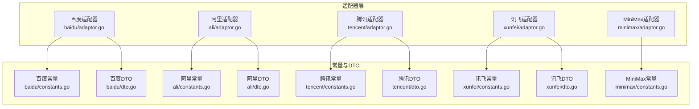
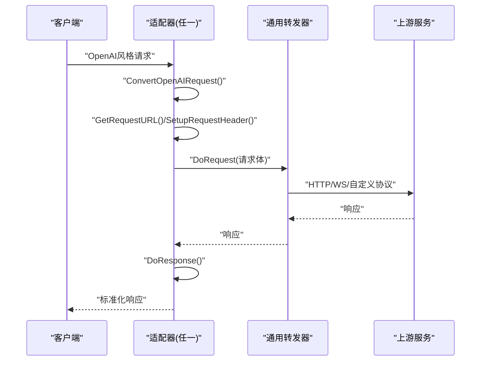
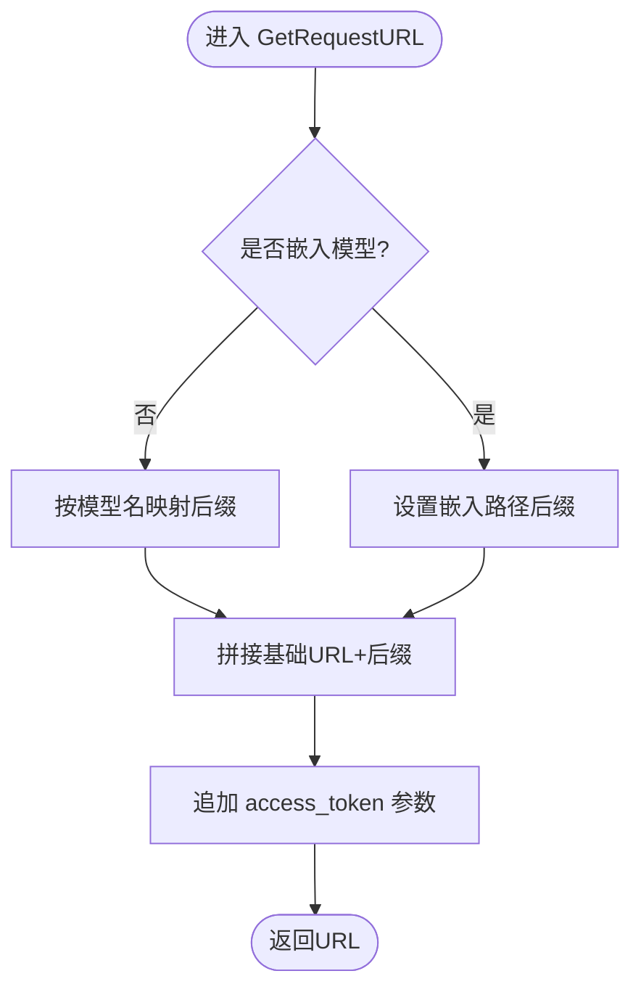
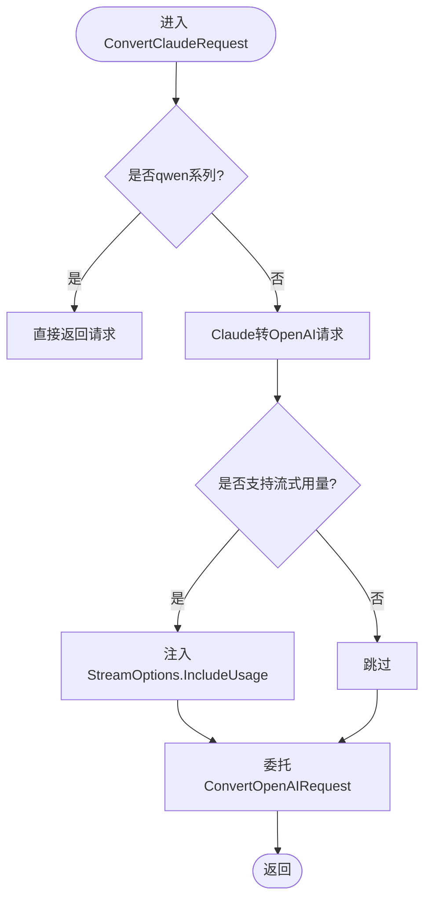
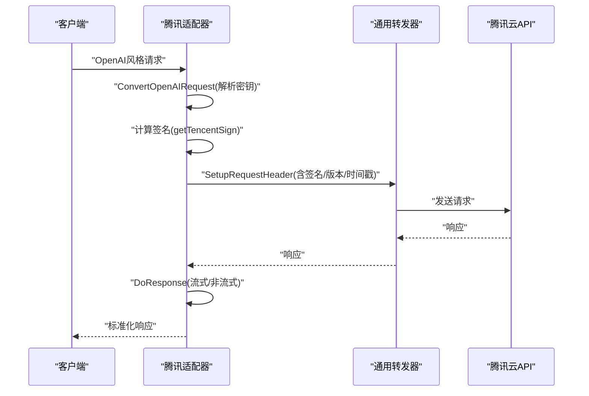
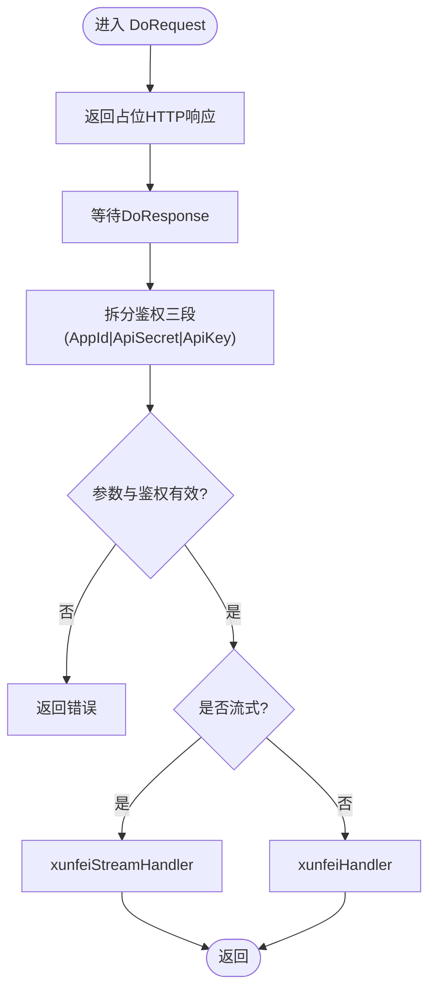
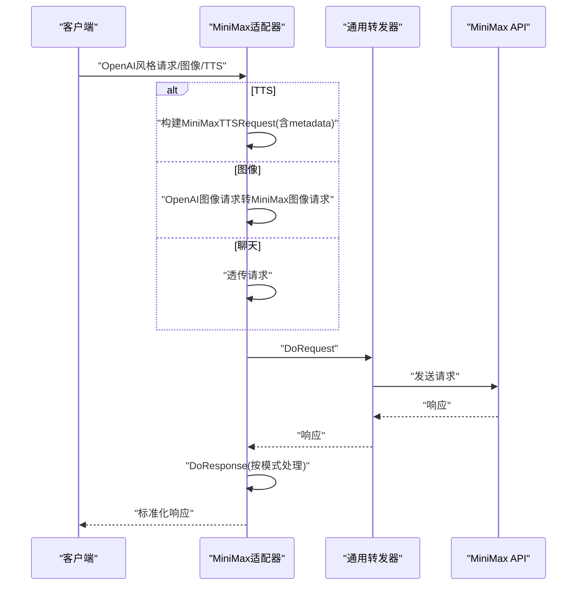
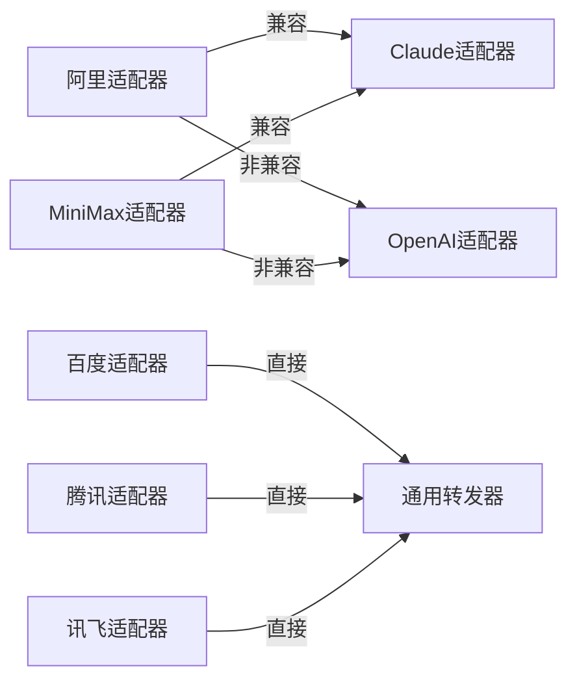

# 其他适配器

<cite>
**本文引用的文件**
- [baidu/adaptor.go](file://relay/channel/baidu/adaptor.go)
- [baidu/constants.go](file://relay/channel/baidu/constants.go)
- [baidu/dto.go](file://relay/channel/baidu/dto.go)
- [ali/adaptor.go](file://relay/channel/ali/adaptor.go)
- [ali/constants.go](file://relay/channel/ali/constants.go)
- [ali/dto.go](file://relay/channel/ali/dto.go)
- [tencent/adaptor.go](file://relay/channel/tencent/adaptor.go)
- [tencent/constants.go](file://relay/channel/tencent/constants.go)
- [tencent/dto.go](file://relay/channel/tencent/dto.go)
- [xunfei/adaptor.go](file://relay/channel/xunfei/adaptor.go)
- [xunfei/constants.go](file://relay/channel/xunfei/constants.go)
- [xunfei/dto.go](file://relay/channel/xunfei/dto.go)
- [minimax/adaptor.go](file://relay/channel/minimax/adaptor.go)
- [minimax/constants.go](file://relay/channel/minimax/constants.go)
</cite>

## 目录
1. [简介](#简介)
2. [项目结构](#项目结构)
3. [核心组件](#核心组件)
4. [架构总览](#架构总览)
5. [详细组件分析](#详细组件分析)
6. [依赖关系分析](#依赖关系分析)
7. [性能考虑](#性能考虑)
8. [故障排查指南](#故障排查指南)
9. [结论](#结论)
10. [附录](#附录)

## 简介
本文件面向“其他适配器”模块，系统梳理并对比百度文心、阿里通义、腾讯混元、讯飞星火、MiniMax 等多家第三方 AI 服务提供商的适配实现。内容覆盖：
- 各适配器的统一接口职责与差异点
- 特殊功能与参数映射策略
- 兼容性处理与限制条件
- 统一配置指南、错误处理与性能优化建议
- 功能对比表与迁移指南

## 项目结构
“其他适配器”采用按供应商分层的目录组织，每个供应商一个子目录，包含适配器入口、常量与数据模型等文件。核心适配器均实现统一的适配器接口，负责请求转换、头部设置、请求转发与响应处理。

图表来源
- [baidu/adaptor.go:1-171](file://relay/channel/baidu/adaptor.go#L1-L171)
- [ali/adaptor.go:1-255](file://relay/channel/ali/adaptor.go#L1-L255)
- [tencent/adaptor.go:1-120](file://relay/channel/tencent/adaptor.go#L1-L120)
- [xunfei/adaptor.go:1-106](file://relay/channel/xunfei/adaptor.go#L1-L106)
- [minimax/adaptor.go:1-148](file://relay/channel/minimax/adaptor.go#L1-L148)

章节来源
- [baidu/adaptor.go:1-171](file://relay/channel/baidu/adaptor.go#L1-L171)
- [ali/adaptor.go:1-255](file://relay/channel/ali/adaptor.go#L1-L255)
- [tencent/adaptor.go:1-120](file://relay/channel/tencent/adaptor.go#L1-L120)
- [xunfei/adaptor.go:1-106](file://relay/channel/xunfei/adaptor.go#L1-L106)
- [minimax/adaptor.go:1-148](file://relay/channel/minimax/adaptor.go#L1-L148)

## 核心组件
- 统一适配器接口职责
  - 请求转换：ConvertOpenAIRequest、ConvertClaudeRequest、ConvertGeminiRequest、ConvertEmbeddingRequest、ConvertRerankRequest、ConvertImageRequest、ConvertAudioRequest、ConvertOpenAIResponsesRequest
  - 请求准备：GetRequestURL、SetupRequestHeader、Init
  - 请求执行与响应处理：DoRequest、DoResponse
  - 模型清单与通道名：GetModelList、GetChannelName

- 关键差异点
  - 百度：根据上游模型名动态选择 RPC 路径；嵌入模型走独立路径；需要通过 access_token 参数鉴权
  - 阿里：支持 Claude 兼容消息（qwen 系列）直通；非 qwen 系列转 OpenAI 请求；图片生成/编辑区分同步/异步；支持插件头与 SSE 头
  - 腾讯：签名机制在请求头中注入；Action/Version/Timestamp 固定；按模型选择不同路由
  - 讯飞：鉴权采用“AppId|ApiSecret|ApiKey”的三段式；非 HTTP 请求，DoRequest 返回占位响应；流式/非流式分别处理
  - MiniMax：支持 TTS（语音合成）与图像生成功能；TTS 支持同步扩展字段合并；Claude 兼容模式委托给 Claude 适配器

章节来源
- [baidu/adaptor.go:47-113](file://relay/channel/baidu/adaptor.go#L47-L113)
- [ali/adaptor.go:72-111](file://relay/channel/ali/adaptor.go#L72-L111)
- [tencent/adaptor.go:56-67](file://relay/channel/tencent/adaptor.go#L56-L67)
- [xunfei/adaptor.go:77-97](file://relay/channel/xunfei/adaptor.go#L77-L97)
- [minimax/adaptor.go:90-98](file://relay/channel/minimax/adaptor.go#L90-L98)

## 架构总览
下图展示适配器在统一转发流程中的角色与交互：

图表来源
- [baidu/adaptor.go:146-162](file://relay/channel/baidu/adaptor.go#L146-L162)
- [ali/adaptor.go:218-246](file://relay/channel/ali/adaptor.go#L218-L246)
- [tencent/adaptor.go:100-111](file://relay/channel/tencent/adaptor.go#L100-L111)
- [xunfei/adaptor.go:76-97](file://relay/channel/xunfei/adaptor.go#L76-L97)
- [minimax/adaptor.go:119-139](file://relay/channel/minimax/adaptor.go#L119-L139)

## 详细组件分析

### 百度文心适配器
- 特殊功能
  - 模型名到 RPC 路径映射：根据上游模型前缀与精确匹配决定后缀路径
  - 嵌入模型专用路径：Embedding-V1、bge-large-zh/en、tao-8k 等
  - 鉴权：通过 access_token 查询参数传递
- 参数映射
  - 温度、top_p、惩罚系数、最大输出、是否搜索、是否引用、system、user_id 等
- 兼容性处理
  - 非流式与流式响应分别处理
  - 嵌入模型走独立处理器
- 限制条件
  - 需要先获取 access_token 并拼接到 URL
  - 部分模型仅支持特定参数组合

图表来源
- [baidu/adaptor.go:47-113](file://relay/channel/baidu/adaptor.go#L47-L113)

章节来源
- [baidu/adaptor.go:47-113](file://relay/channel/baidu/adaptor.go#L47-L113)
- [baidu/constants.go:1-23](file://relay/channel/baidu/constants.go#L1-L23)
- [baidu/dto.go:10-48](file://relay/channel/baidu/dto.go#L10-L48)

### 阿里通义适配器
- 特殊功能
  - Claude 兼容消息直通：qwen 系列模型直接透传 Anthropic 风格消息
  - 非 qwen 系列转 OpenAI 请求，并可注入流式用量
  - 图片生成/编辑：区分同步与异步；支持插件头与 SSE 头
- 参数映射
  - top_p、top_k、seed、enable_search、增量输出等
  - 图像生成参数：尺寸、步数、缩放、水印、提示扩展、思维模式、顺序生成、bbox/palette、seed
- 兼容性处理
  - 不同 RelayFormat 下走不同下游适配器（Claude/OpenAI）
  - 图片编辑支持表单与 JSON 两种输入
- 限制条件
  - 部分图像模型仅支持同步；编辑场景对 WAN 系列有差异化处理

图表来源
- [ali/adaptor.go:54-67](file://relay/channel/ali/adaptor.go#L54-L67)
- [ali/adaptor.go:138-159](file://relay/channel/ali/adaptor.go#L138-L159)

章节来源
- [ali/adaptor.go:34-47](file://relay/channel/ali/adaptor.go#L34-L47)
- [ali/adaptor.go:54-67](file://relay/channel/ali/adaptor.go#L54-L67)
- [ali/adaptor.go:138-159](file://relay/channel/ali/adaptor.go#L138-L159)
- [ali/adaptor.go:161-199](file://relay/channel/ali/adaptor.go#L161-L199)
- [ali/constants.go:1-15](file://relay/channel/ali/constants.go#L1-L15)
- [ali/dto.go:12-40](file://relay/channel/ali/dto.go#L12-L40)
- [ali/dto.go:166-185](file://relay/channel/ali/dto.go#L166-L185)

### 腾讯混元适配器
- 特殊功能
  - 签名机制：在请求头注入 Authorization、X-TC-Action、X-TC-Version、X-TC-Timestamp
  - 模型路由：根据模型选择不同 Action 与版本
- 参数映射
  - 模型名、消息列表、流式开关、TopP、Temperature
- 兼容性处理
  - 流式与非流式分别处理
- 限制条件
  - 需要正确的 AppId/SecretId/SecretKey 组合进行签名计算

图表来源
- [tencent/adaptor.go:69-84](file://relay/channel/tencent/adaptor.go#L69-L84)
- [tencent/adaptor.go:104-111](file://relay/channel/tencent/adaptor.go#L104-L111)

章节来源
- [tencent/adaptor.go:50-58](file://relay/channel/tencent/adaptor.go#L50-L58)
- [tencent/adaptor.go:60-67](file://relay/channel/tencent/adaptor.go#L60-L67)
- [tencent/adaptor.go:69-84](file://relay/channel/tencent/adaptor.go#L69-L84)
- [tencent/constants.go:1-11](file://relay/channel/tencent/constants.go#L1-L11)
- [tencent/dto.go:8-44](file://relay/channel/tencent/dto.go#L8-L44)

### 讯飞星火适配器
- 特殊功能
  - 鉴权三段式：AppId|ApiSecret|ApiKey
  - 非 HTTP 请求：DoRequest 返回占位响应，实际由 DoResponse 完成业务逻辑
  - 流式/非流式分别处理
- 参数映射
  - header.app_id、parameter.chat、payload.message.text
- 兼容性处理
  - DoResponse 中拆分鉴权三段并校验
- 限制条件
  - 需要严格遵循三段式格式

图表来源
- [xunfei/adaptor.go:76-97](file://relay/channel/xunfei/adaptor.go#L76-L97)

章节来源
- [xunfei/adaptor.go:84-97](file://relay/channel/xunfei/adaptor.go#L84-L97)
- [xunfei/constants.go:1-13](file://relay/channel/xunfei/constants.go#L1-L13)
- [xunfei/dto.go:10-28](file://relay/channel/xunfei/dto.go#L10-L28)

### MiniMax 适配器
- 特殊功能
  - TTS（语音合成）：支持 voice、speed、response_format、metadata 扩展字段
  - 图像生成：OpenAI 图像请求转 MiniMax 图像请求
  - Claude 兼容：RelayFormat 为 Claude 时委托 Claude 适配器
- 参数映射
  - TTS：模型名、文本、音色、语速、音频格式、输出格式
  - 图像：输入 prompt、negative_prompt、messages 等
- 兼容性处理
  - 不同模式（TTS/图像/聊天）走不同处理器
- 限制条件
  - 非 TTS/图像模式下，DoResponse 默认委托 OpenAI 适配器

图表来源
- [minimax/adaptor.go:35-78](file://relay/channel/minimax/adaptor.go#L35-L78)
- [minimax/adaptor.go:119-139](file://relay/channel/minimax/adaptor.go#L119-L139)

章节来源
- [minimax/adaptor.go:23-28](file://relay/channel/minimax/adaptor.go#L23-L28)
- [minimax/adaptor.go:35-78](file://relay/channel/minimax/adaptor.go#L35-L78)
- [minimax/adaptor.go:80-85](file://relay/channel/minimax/adaptor.go#L80-L85)
- [minimax/constants.go:1-29](file://relay/channel/minimax/constants.go#L1-L29)

## 依赖关系分析
- 适配器间耦合
  - 阿里适配器在 Claude 兼容模式下委托 Claude 适配器；在非兼容模式下委托 OpenAI 适配器
  - MiniMax 适配器在 Claude 兼容模式下委托 Claude 适配器
- 外部依赖
  - 通用转发器：DoApiRequest 封装 HTTP 请求与响应
  - 通用头部设置：SetupApiRequestHeader 统一注入通用头
- 潜在循环依赖
  - 通过“委托”而非直接导入避免循环依赖

图表来源
- [ali/adaptor.go:225-231](file://relay/channel/ali/adaptor.go#L225-L231)
- [minimax/adaptor.go:132-137](file://relay/channel/minimax/adaptor.go#L132-L137)

章节来源
- [ali/adaptor.go:222-246](file://relay/channel/ali/adaptor.go#L222-L246)
- [minimax/adaptor.go:123-139](file://relay/channel/minimax/adaptor.go#L123-L139)

## 性能考虑
- 流式传输
  - 阿里：在支持流式用量时注入 IncludeUsage，减少二次统计成本
  - 腾讯/百度/讯飞：流式响应按增量拼接，注意客户端拼接与内存占用
- 异步任务
  - 阿里：图片生成/编辑区分同步/异步，异步需轮询或回调，合理设置超时与重试
- 鉴权与签名
  - 腾讯：签名计算与头注入应尽量复用，避免重复计算
  - 百度：access_token 获取与缓存策略需避免频繁刷新
- 响应处理
  - 不同适配器的 DoResponse 分支较多，建议在上层统一缓存与日志，降低重复处理开销

## 故障排查指南
- 常见错误类型
  - 鉴权失败：检查密钥格式与签名参数（腾讯）、三段式格式（讯飞）、access_token 有效性（百度）
  - 模型不支持：确认模型是否在对应供应商的 ModelList 中
  - 参数不兼容：对照各 DTO 字段，确保参数映射正确
- 定位步骤
  - 开启详细日志，观察适配器入口函数（Convert*/GetRequestURL/SetupRequestHeader/DoResponse）
  - 对比上游响应与下游 DTO 结构，定位字段缺失或类型不匹配
- 建议
  - 在统一错误包装中记录 ErrorCode 与错误上下文
  - 对于异步任务，增加重试与超时控制

章节来源
- [tencent/adaptor.go:73-83](file://relay/channel/tencent/adaptor.go#L73-L83)
- [xunfei/adaptor.go:84-97](file://relay/channel/xunfei/adaptor.go#L84-L97)
- [baidu/adaptor.go:106-112](file://relay/channel/baidu/adaptor.go#L106-L112)

## 结论
“其他适配器”模块通过统一接口抽象，实现了多家供应商的差异化适配。核心策略包括：
- 按供应商定制请求转换与头部设置
- 在流式、异步、签名等场景下提供兼容处理
- 通过委托模式降低耦合并提升可维护性
建议在生产环境中结合各供应商的速率限制、计费规则与参数约束，完善鉴权缓存、超时与重试策略，并持续监控错误率与延迟指标。

## 附录

### 功能对比表
- 支持能力
  - 百度：聊天、嵌入、鉴权参数化
  - 阿里：聊天、嵌入、图像生成/编辑、插件与SSE、Claude兼容
  - 腾讯：聊天、签名机制、多模型
  - 讯飞：聊天、三段式鉴权、非HTTP请求
  - MiniMax：聊天、TTS、图像、Claude兼容

- 参数映射要点
  - 百度：温度、top_p、惩罚、最大输出、system、user_id、禁用搜索、引用
  - 阿里：top_p、top_k、seed、enable_search、增量输出、图像参数丰富
  - 腾讯：模型名、消息、流式、TopP、Temperature
  - 讯飞：header.app_id、parameter.chat、payload.message.text
  - MiniMax：TTS voice/speed/format/metadata、图像 prompt/negative_prompt

- 兼容性与限制
  - 百度：嵌入模型独立路径、access_token
  - 阿里：qwen系列直通Claude、图像同步/异步差异
  - 腾讯：签名头固定、Action/Version/Timestamp
  - 讯飞：三段式鉴权、非HTTP请求
  - MiniMax：Claude兼容模式委托、TTS扩展字段

### 迁移指南
- 从 OpenAI 到其他适配器
  - 参数映射：优先使用 OpenAI 通用字段，无法映射的在适配器内做兼容转换
  - 流式：若目标适配器不支持流式，需在上层聚合后再返回
  - 图像：注意不同供应商的图像输入格式与参数差异
- 从某供应商迁移到另一供应商
  - 比对模型清单与能力差异，调整上游模型名
  - 更新鉴权方式与请求头设置
  - 校验响应结构与用量统计字段