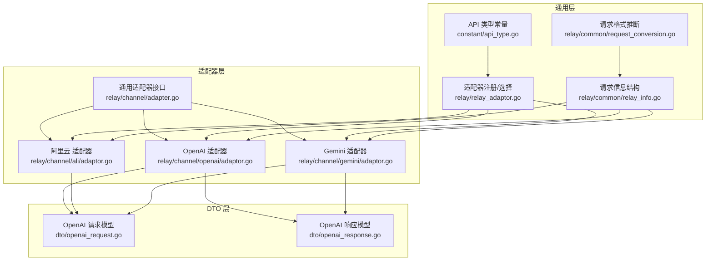
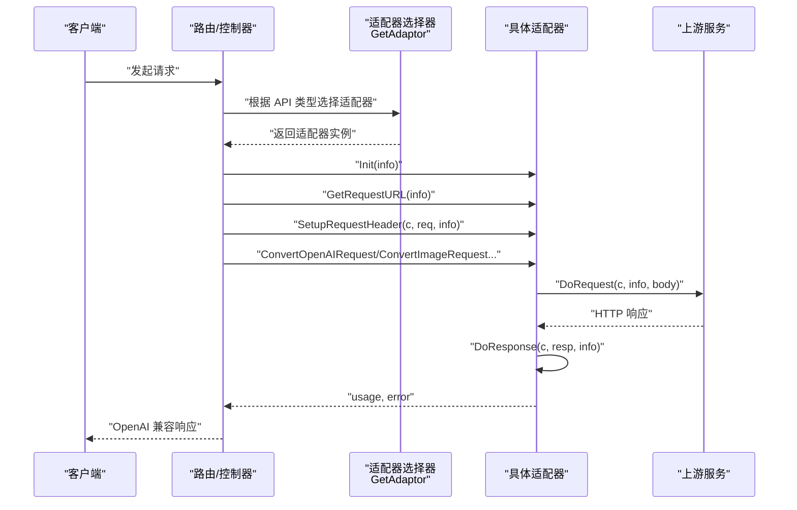
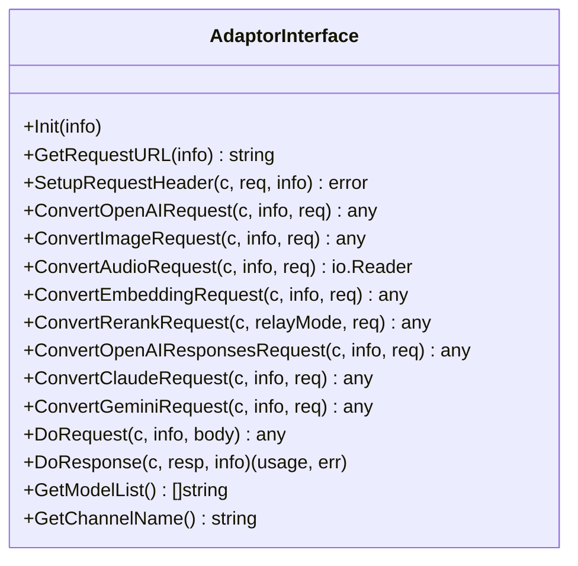
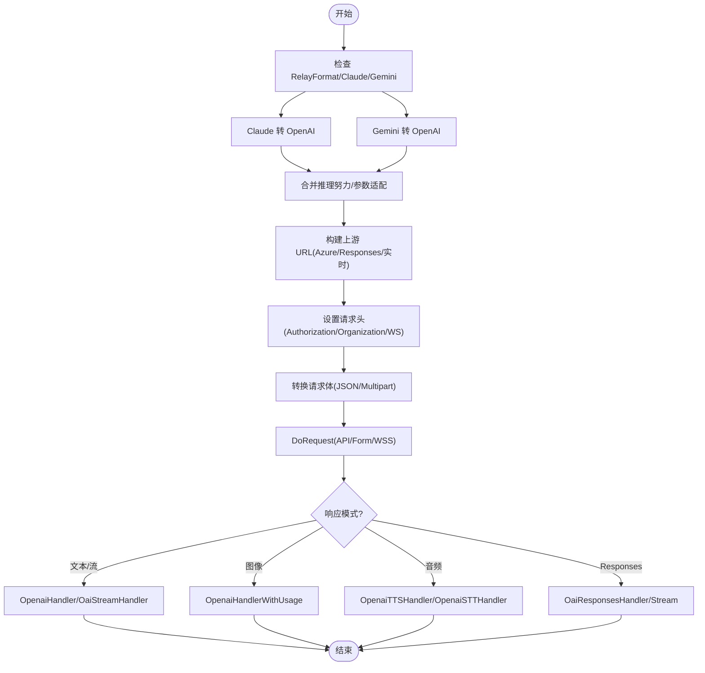
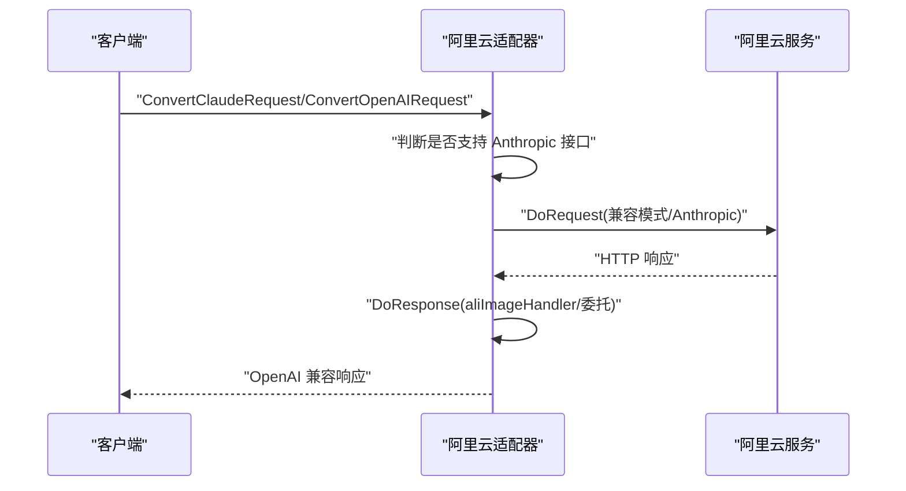
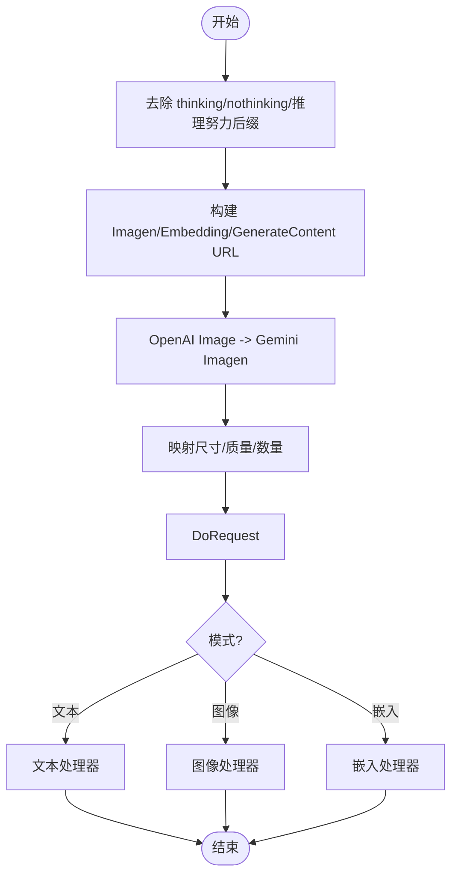
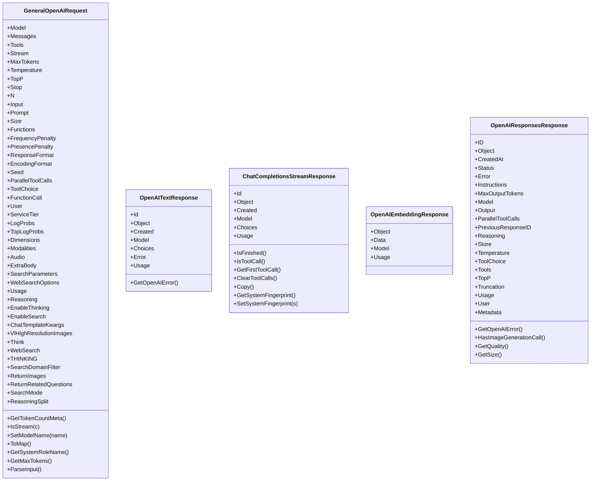
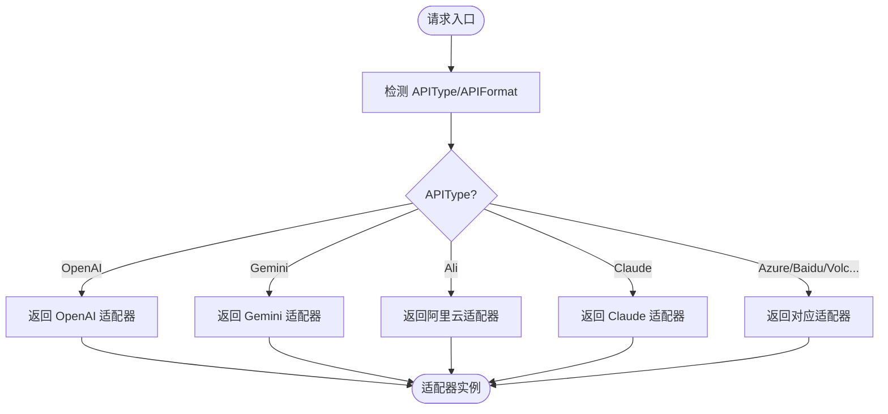
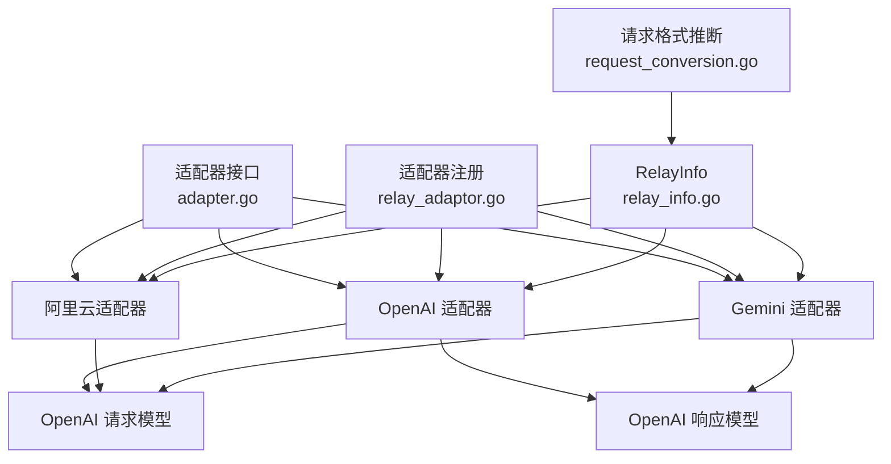

# 适配器开发指南

<cite>
**本文档引用的文件**
- [adapter.go](file://relay/channel/adapter.go)
- [relay_adaptor.go](file://relay/relay_adaptor.go)
- [openai_request.go](file://dto/openai_request.go)
- [openai_response.go](file://dto/openai_response.go)
- [adaptor.go](file://relay/channel/openai/adaptor.go)
- [adaptor.go](file://relay/channel/ali/adaptor.go)
- [adaptor.go](file://relay/channel/gemini/adaptor.go)
- [relay_info.go](file://relay/common/relay_info.go)
- [request_conversion.go](file://relay/common/request_conversion.go)
- [api_type.go](file://constant/api_type.go)
- [README.md](file://README.md)
- [README.md](file://constant/README.md)
- [adaptor_test.go](file://relay/channel/minimax/adaptor_test.go)
</cite>

## 目录
1. [简介](#简介)
2. [项目结构](#项目结构)
3. [核心组件](#核心组件)
4. [架构总览](#架构总览)
5. [详细组件分析](#详细组件分析)
6. [依赖关系分析](#依赖关系分析)
7. [性能考虑](#性能考虑)
8. [故障排查指南](#故障排查指南)
9. [结论](#结论)
10. [附录](#附录)

## 简介
本指南面向希望为新 AI 服务提供商开发适配器的工程师，系统阐述如何基于现有框架完成从请求转换、上游调用到响应处理与错误处理的全流程开发。文档涵盖接口设计、请求/响应转换、错误处理、测试策略、调试工具、性能优化与最佳实践，并提供完整的开发示例与检查清单，帮助快速、高质量地完成适配器集成。

## 项目结构
该项目采用模块化分层架构，适配器位于 relay/channel 下，按服务提供商划分子包；公共请求/响应模型位于 dto；通用中间件与信息结构位于 relay/common；常量定义位于 constant；整体通过 relay_adaptor 统一调度。

**图表来源**
- [adapter.go:15-32](file://relay/channel/adapter.go#L15-L32)
- [adaptor.go:37-40](file://relay/channel/openai/adaptor.go#L37-L40)
- [adaptor.go:23-25](file://relay/channel/ali/adaptor.go#L23-L25)
- [adaptor.go:23-24](file://relay/channel/gemini/adaptor.go#L23-L24)
- [relay_info.go:86-175](file://relay/common/relay_info.go#L86-L175)
- [request_conversion.go:8-29](file://relay/common/request_conversion.go#L8-L29)
- [relay_adaptor.go:53-125](file://relay/relay_adaptor.go#L53-L125)
- [api_type.go:3-40](file://constant/api_type.go#L3-L40)

**章节来源**
- [README.md:178-287](file://README.md#L178-L287)
- [README.md:291-404](file://README.md#L291-L404)

## 核心组件
- 适配器接口：定义统一的 Init、请求构建、请求转换、上游调用、响应处理、模型列表与通道名等方法，支持文本、图像、音频、嵌入、重排、Responses 等多种格式。
- 通用请求信息结构：封装请求上下文、渠道元数据、计费信息、流状态、推理努力等级等，贯穿适配器生命周期。
- 请求格式推断：根据请求内容自动判断格式（OpenAI、Responses、Claude、Gemini、Embedding、Rerank、OpenAI Image/Audio），并记录转换链。
- 适配器注册与选择：根据 API 类型常量选择具体适配器实例，支持多渠道类型扩展。

**章节来源**
- [adapter.go:15-32](file://relay/channel/adapter.go#L15-L32)
- [relay_info.go:86-175](file://relay/common/relay_info.go#L86-L175)
- [request_conversion.go:8-29](file://relay/common/request_conversion.go#L8-L29)
- [relay_adaptor.go:53-125](file://relay/relay_adaptor.go#L53-L125)
- [api_type.go:3-40](file://constant/api_type.go#L3-L40)

## 架构总览
适配器开发遵循“统一接口 + 具体实现 + 注册调度”的模式。请求进入后，先通过请求格式推断确定 RelayFormat，随后根据 API 类型选择对应适配器，执行 Init、构建上游 URL、设置请求头、转换请求体、调用上游、处理响应与用量统计，最后返回统一的 OpenAI 兼容响应。

**图表来源**
- [relay_adaptor.go:53-125](file://relay/relay_adaptor.go#L53-L125)
- [adapter.go:15-32](file://relay/channel/adapter.go#L15-L32)
- [adaptor.go:98-187](file://relay/channel/openai/adaptor.go#L98-L187)

## 详细组件分析

### 适配器接口设计
- 初始化：Init 接收 RelayInfo，用于设置通道类型、推理内容信息等。
- URL 构建：GetRequestURL 根据渠道类型与模式（如 Azure、Responses、实时）生成最终上游地址。
- 请求头设置：SetupRequestHeader 设置鉴权、组织、协议等头部，支持覆盖与 WebSocket 协议头。
- 请求转换：ConvertOpenAIRequest、ConvertImageRequest、ConvertAudioRequest、ConvertEmbeddingRequest、ConvertRerankRequest、ConvertOpenAIResponsesRequest、ConvertClaudeRequest、ConvertGeminiRequest 等，负责将统一 DTO 转换为上游所需格式。
- 上游调用：DoRequest 支持普通 API、表单上传、WebSocket 实时会话等不同场景。
- 响应处理：DoResponse 根据模式（文本、流、图像、音频、Responses、嵌入、重排）进行差异化处理与用量统计。
- 元信息：GetModelList、GetChannelName 返回模型列表与通道名称。

**图表来源**
- [adapter.go:15-32](file://relay/channel/adapter.go#L15-L32)

**章节来源**
- [adapter.go:15-32](file://relay/channel/adapter.go#L15-L32)

### OpenAI 适配器实现要点
- 推理努力后缀解析：从模型名解析推理努力等级，必要时调整请求参数。
- Claude/Gemini 转换：提供 ConvertClaudeRequest/ConvertGeminiRequest，内部转换为 OpenAI 请求后再统一处理。
- Azure 特殊处理：拼接 api-version、部署路径、Responses API 特定路径等。
- OpenRouter 思考模式适配：将 THINKING 字段映射为 reasoning 结构。
- 流式选项：根据渠道支持情况设置 StreamOptions。
- 实时会话：针对实时模式设置 Sec-WebSocket-Protocol 或 openai-beta 头部。
- 响应处理：根据模式选择 OpenaiHandler、OaiResponsesHandler、OpenaiTTSHandler 等。

**图表来源**
- [adaptor.go:57-96](file://relay/channel/openai/adaptor.go#L57-L96)
- [adaptor.go:111-187](file://relay/channel/openai/adaptor.go#L111-L187)
- [adaptor.go:189-241](file://relay/channel/openai/adaptor.go#L189-L241)
- [adaptor.go:607-649](file://relay/channel/openai/adaptor.go#L607-L649)

**章节来源**
- [adaptor.go:98-187](file://relay/channel/openai/adaptor.go#L98-L187)
- [adaptor.go:189-241](file://relay/channel/openai/adaptor.go#L189-L241)
- [adaptor.go:243-364](file://relay/channel/openai/adaptor.go#L243-L364)
- [adaptor.go:607-649](file://relay/channel/openai/adaptor.go#L607-L649)

### 阿里云适配器实现要点
- Claude 兼容消息：部分模型直接走 Anthropic 接口，否则转换为 OpenAI 兼容格式。
- 图像生成/编辑：区分同步与异步模式，设置 X-DashScope-Async/X-DashScope-SSE 等头部。
- 请求转换：将 OpenAI 请求映射为阿里云兼容格式，处理 enable_thinking、stream 等差异。
- 响应处理：根据模式调用 aliImageHandler 或委托 OpenAI 适配器处理。

**图表来源**
- [adaptor.go:54-67](file://relay/channel/ali/adaptor.go#L54-L67)
- [adaptor.go:113-136](file://relay/channel/ali/adaptor.go#L113-L136)
- [adaptor.go:138-159](file://relay/channel/ali/adaptor.go#L138-L159)
- [adaptor.go:222-245](file://relay/channel/ali/adaptor.go#L222-L245)

**章节来源**
- [adaptor.go:69-111](file://relay/channel/ali/adaptor.go#L69-L111)
- [adaptor.go:113-136](file://relay/channel/ali/adaptor.go#L113-L136)
- [adaptor.go:138-159](file://relay/channel/ali/adaptor.go#L138-L159)
- [adaptor.go:222-245](file://relay/channel/ali/adaptor.go#L222-L245)

### Gemini 适配器实现要点
- 模型名处理：去除 -thinking/-nothinking 后缀或解析推理努力后缀。
- 图像生成：将 OpenAI Image 请求转换为 Gemini Imagen 请求，映射尺寸与质量到 aspectRatio 与 imageSize。
- 嵌入批量：强制批量嵌入端点，适配不同模型的输出维度。
- 响应处理：根据模式选择文本/图像/嵌入处理器。

**图表来源**
- [adaptor.go:126-145](file://relay/channel/gemini/adaptor.go#L126-L145)
- [adaptor.go:130-171](file://relay/channel/gemini/adaptor.go#L130-L171)
- [adaptor.go:60-124](file://relay/channel/gemini/adaptor.go#L60-L124)
- [adaptor.go:249-279](file://relay/channel/gemini/adaptor.go#L249-L279)

**章节来源**
- [adaptor.go:126-171](file://relay/channel/gemini/adaptor.go#L126-L171)
- [adaptor.go:179-190](file://relay/channel/gemini/adaptor.go#L179-L190)
- [adaptor.go:196-238](file://relay/channel/gemini/adaptor.go#L196-L238)
- [adaptor.go:249-279](file://relay/channel/gemini/adaptor.go#L249-L279)

### 请求/响应模型与格式推断
- 请求模型：GeneralOpenAIRequest 统一封装消息、工具、参数等，支持多模态内容解析与工具调用序列化。
- 响应模型：OpenAITextResponse、ChatCompletionsStreamResponse、OpenAIEmbeddingResponse、Responses 相关结构等，支持错误提取与流式处理。
- 格式推断：根据请求类型自动识别 RelayFormat，并记录转换链，便于后续适配器选择与调试。

**图表来源**
- [openai_request.go:29-109](file://dto/openai_request.go#L29-L109)
- [openai_request.go:111-197](file://dto/openai_request.go#L111-L197)
- [openai_response.go:39-47](file://dto/openai_response.go#L39-L47)
- [openai_response.go:141-149](file://dto/openai_response.go#L141-L149)
- [openai_response.go:60-65](file://dto/openai_response.go#L60-L65)
- [openai_response.go:268-291](file://dto/openai_response.go#L268-L291)

**章节来源**
- [openai_request.go:29-109](file://dto/openai_request.go#L29-L109)
- [openai_response.go:39-47](file://dto/openai_response.go#L39-L47)
- [openai_response.go:141-149](file://dto/openai_response.go#L141-L149)
- [openai_response.go:60-65](file://dto/openai_response.go#L60-L65)
- [openai_response.go:268-291](file://dto/openai_response.go#L268-L291)

### 适配器注册与选择
- GetAdaptor：根据 APIType 常量返回对应适配器实例，支持 OpenAI、Azure、Gemini、Claude、阿里云、AWS、Cohere、Dify、Jina、Cloudflare、SiliconFlow、VertexAI、Mistral、DeepSeek、MokaAI、火山引擎、百度 V2、OpenRouter、XAI、Coze、Jimeng、Moonshot、Submodel、MiniMax、Replicate、Codex 等。
- GetTaskAdaptor：根据任务平台常量返回任务型适配器，支持 Suno 等。

**图表来源**
- [relay_adaptor.go:53-125](file://relay/relay_adaptor.go#L53-L125)

**章节来源**
- [relay_adaptor.go:53-125](file://relay/relay_adaptor.go#L53-L125)
- [api_type.go:3-40](file://constant/api_type.go#L3-L40)

## 依赖关系分析
- 适配器接口与具体实现解耦：通过统一接口约束，新增适配器只需实现必要方法。
- 通用层与业务层分离：RelayInfo、请求格式推断、注册选择等位于通用层，减少重复代码。
- 常量层独立：API 类型、任务平台等常量集中管理，避免硬编码。

**图表来源**
- [adapter.go:15-32](file://relay/channel/adapter.go#L15-L32)
- [adaptor.go:37-40](file://relay/channel/openai/adaptor.go#L37-L40)
- [adaptor.go:23-25](file://relay/channel/ali/adaptor.go#L23-L25)
- [adaptor.go:23-24](file://relay/channel/gemini/adaptor.go#L23-L24)
- [relay_adaptor.go:53-125](file://relay/relay_adaptor.go#L53-L125)
- [relay_info.go:86-175](file://relay/common/relay_info.go#L86-L175)
- [request_conversion.go:8-29](file://relay/common/request_conversion.go#L8-L29)

**章节来源**
- [adapter.go:15-32](file://relay/channel/adapter.go#L15-L32)
- [relay_adaptor.go:53-125](file://relay/relay_adaptor.go#L53-L125)
- [relay_info.go:86-175](file://relay/common/relay_info.go#L86-L175)
- [request_conversion.go:8-29](file://relay/common/request_conversion.go#L8-L29)

## 性能考虑
- 流式处理：合理使用 StreamOptions 与 SSE，避免一次性加载大响应体。
- 并发与超时：根据上游限制设置合理的连接池与超时时间，避免阻塞。
- 缓存与复用：对静态模型列表、通道元数据进行缓存，减少重复计算。
- 日志与采样：生产环境启用必要的日志与性能监控，避免过度 IO。
- 资源释放：及时关闭文件句柄、流与连接，防止内存泄漏。

[本节为通用指导，无需特定文件引用]

## 故障排查指南
- 参数映射问题：核对 ConvertOpenAIRequest 中的字段映射与上游要求，关注推理努力、思考模式、流式选项等差异。
- 格式转换异常：检查请求格式推断逻辑与 RelayFormat 设置，确认转换链正确。
- 认证失败：核对 SetupRequestHeader 中的 Authorization/Organization/协议头，确保未被覆盖。
- 响应解析错误：使用 GetOpenAIError 提取统一错误结构，结合上游返回体定位问题。
- 流式处理卡顿：检查流扫描缓冲区与超时设置，必要时增大 STREAM_SCANNER_MAX_BUFFER_MB 与 STREAMING_TIMEOUT。
- 图像/音频上传失败：确认 Content-Type 与 multipart 字段，检查文件大小与格式限制。

**章节来源**
- [openai_response.go:392-431](file://dto/openai_response.go#L392-L431)
- [README.md:304-330](file://README.md#L304-L330)

## 结论
通过统一的适配器接口与完善的通用层支撑，新 AI 服务提供商可快速完成适配器开发。遵循本文档的接口设计、请求/响应转换、错误处理、测试与调试流程，可显著提升开发效率与稳定性。建议在集成过程中持续关注性能指标与用户体验，逐步完善测试覆盖与监控体系。

[本节为总结，无需特定文件引用]

## 附录

### 开发流程与检查清单
- 准备工作
  - 明确上游 API 文档与认证方式
  - 确定支持的模式（文本/流/图像/音频/嵌入/重排/Responses/实时）
  - 设计请求/响应转换映射
- 接口实现
  - 实现 Init、GetRequestURL、SetupRequestHeader
  - 实现 Convert*Request 与 DoRequest
  - 实现 DoResponse 与用量统计
  - 实现 GetModelList、GetChannelName
- 测试策略
  - 单元测试：覆盖关键转换逻辑与边界条件
  - 集成测试：模拟真实上游响应，验证 DoResponse
  - 回归测试：新增功能后回归既有模式
- 调试与优化
  - 启用必要的日志与性能监控
  - 分析慢请求与错误日志
  - 优化参数映射与流式处理
- 提交与验收
  - 补充文档与注释
  - 提供最小可复现示例
  - 通过代码审查与测试

**章节来源**
- [adaptor_test.go:18-85](file://relay/channel/minimax/adaptor_test.go#L18-L85)
- [README.md:435-444](file://README.md#L435-L444)

### 常见问题与解决方案
- 问题：推理努力后缀未生效
  - 解决：在 ConvertOpenAIRequest 中解析模型后缀并设置 ReasoningEffort
- 问题：Azure 部署路径错误
  - 解决：在 GetRequestURL 中拼接 api-version 与部署路径
- 问题：图像生成返回原始字段而非 OpenAI 格式
  - 解决：在 DoResponse 中转换为 OpenAI 兼容结构
- 问题：实时会话无法建立
  - 解决：检查 Sec-WebSocket-Protocol 与 openai-beta 头部设置

**章节来源**
- [adaptor.go:42-55](file://relay/channel/openai/adaptor.go#L42-L55)
- [adaptor.go:111-187](file://relay/channel/openai/adaptor.go#L111-L187)
- [adaptor.go:619-649](file://relay/channel/openai/adaptor.go#L619-L649)
- [adaptor.go:222-245](file://relay/channel/ali/adaptor.go#L222-L245)

### 代码规范与最佳实践
- 接口一致性：严格遵循 Adaptor 接口，保证方法命名与签名一致
- 错误处理：统一使用 types.NewAPIError，保留上游错误信息
- 日志记录：使用 logger 包记录关键步骤与调试信息
- 配置管理：通过 ChannelSetting/ChannelOtherSettings 控制参数透传与安全过滤
- 测试驱动：为每个适配器提供单元测试与集成测试

**章节来源**
- [README.md:20-26](file://constant/README.md#L20-L26)
- [README.md:435-444](file://README.md#L435-L444)