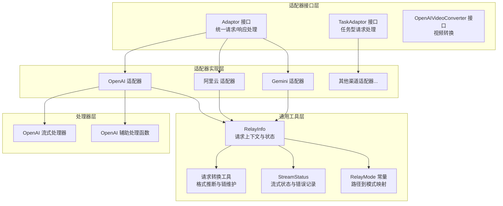
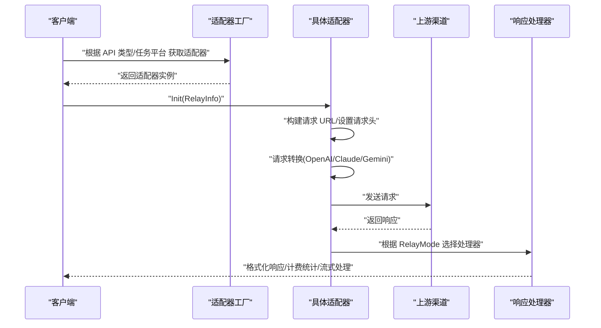
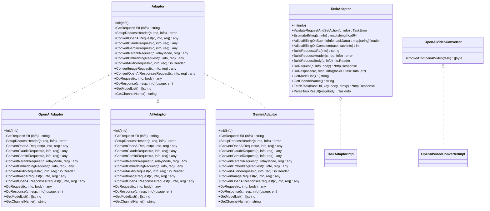
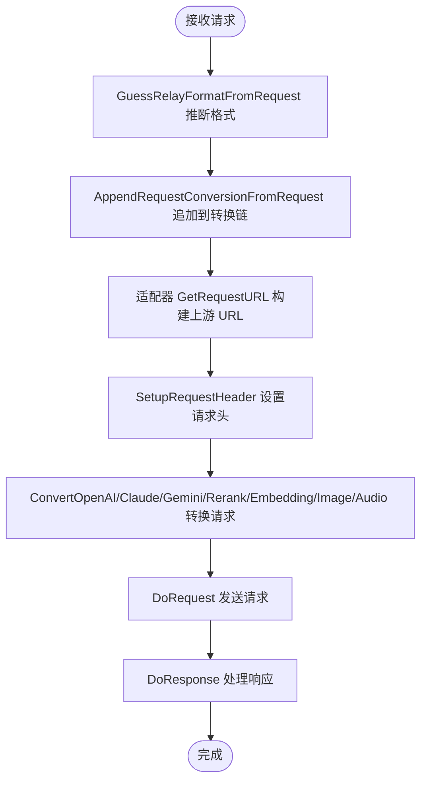
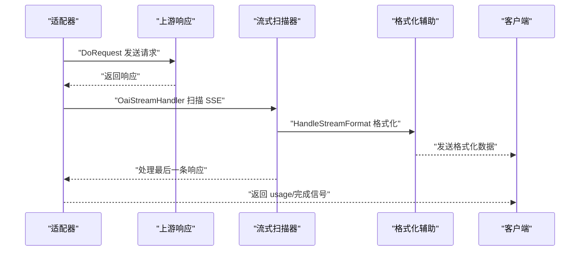
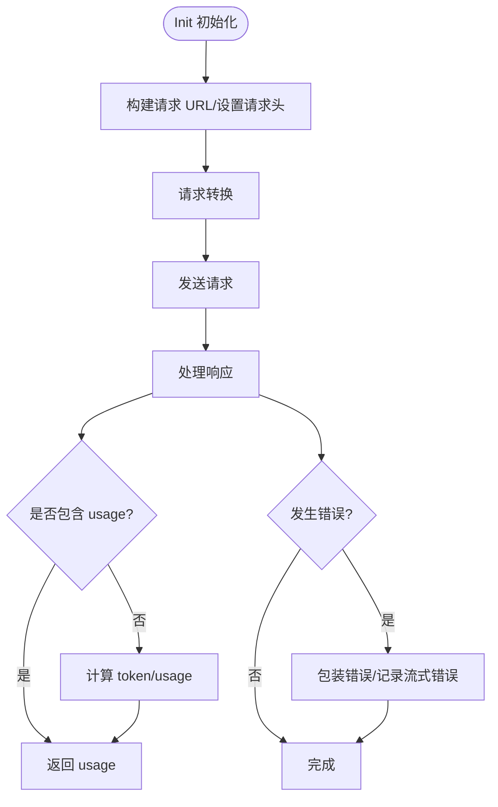
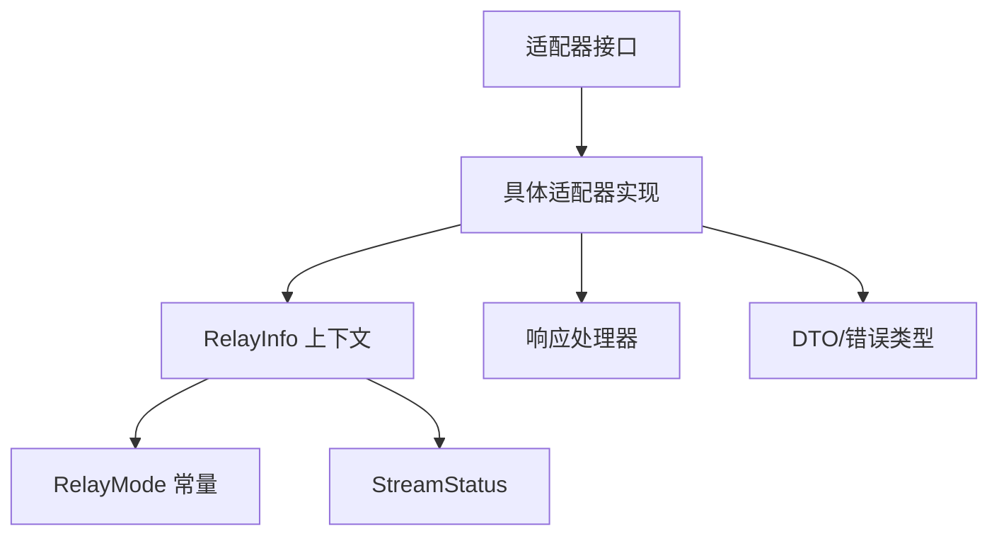

# 适配器架构设计

<cite>
**本文档引用的文件**
- [adapter.go](file://relay/channel/adapter.go)
- [relay_adaptor.go](file://relay/relay_adaptor.go)
- [adaptor.go](file://relay/channel/openai/adaptor.go)
- [adaptor.go](file://relay/channel/ali/adaptor.go)
- [adaptor.go](file://relay/channel/gemini/adaptor.go)
- [request_conversion.go](file://relay/common/request_conversion.go)
- [relay_info.go](file://relay/common/relay_info.go)
- [stream_status.go](file://relay/common/stream_status.go)
- [relay_mode.go](file://relay/constant/relay_mode.go)
- [relay-openai.go](file://relay/channel/openai/relay-openai.go)
- [helper.go](file://relay/channel/openai/helper.go)
- [error.go](file://dto/error.go)
</cite>

## 目录
1. [引言](#引言)
2. [项目结构](#项目结构)
3. [核心组件](#核心组件)
4. [架构总览](#架构总览)
5. [详细组件分析](#详细组件分析)
6. [依赖关系分析](#依赖关系分析)
7. [性能考虑](#性能考虑)
8. [故障排查指南](#故障排查指南)
9. [结论](#结论)
10. [附录](#附录)

## 引言
本技术文档围绕 New API 中的适配器架构设计展开，系统阐述适配器模式在统一接口抽象、请求转换与响应处理方面的核心理念与实现原理。文档重点覆盖以下方面：
- 统一接口抽象：通过 Adaptor/TaskAdaptor 接口定义，屏蔽不同上游渠道的差异。
- 请求转换机制：基于 RelayInfo 与请求格式链，实现 OpenAI/Claude/Gemini 等多格式请求的转换与路由。
- 响应处理流程：针对流式与非流式响应，提供统一的处理与格式化能力。
- 生命周期管理：RelayInfo 的初始化、转换链维护与状态跟踪。
- 错误处理策略：统一错误包装与多源错误提取。
- 性能优化方案：流式扫描、并发与资源释放。
- 开发最佳实践：代码组织、测试策略与调试技巧。

## 项目结构
New API 的适配器架构主要分布在以下模块：
- 适配器接口层：定义通用适配器接口与任务型适配器接口。
- 适配器实现层：各渠道具体适配器（如 OpenAI、阿里云、Gemini 等）。
- 通用工具层：请求转换、RelayInfo 生命周期、流式状态管理、常量定义。
- 处理器层：针对 OpenAI 格式的流式与非流式响应处理器。

**图表来源**
- [adapter.go:15-32](file://relay/channel/adapter.go#L15-L32)
- [relay_adaptor.go:53-125](file://relay/relay_adaptor.go#L53-L125)
- [adaptor.go:37-40](file://relay/channel/openai/adaptor.go#L37-L40)
- [adaptor.go:23-25](file://relay/channel/ali/adaptor.go#L23-L25)
- [adaptor.go:23-24](file://relay/channel/gemini/adaptor.go#L23-L24)
- [relay_info.go:86-175](file://relay/common/relay_info.go#L86-L175)
- [request_conversion.go:8-40](file://relay/common/request_conversion.go#L8-L40)
- [stream_status.go:31-39](file://relay/common/stream_status.go#L31-L39)
- [relay_mode.go:8-55](file://relay/constant/relay_mode.go#L8-L55)
- [relay-openai.go:106-193](file://relay/channel/openai/relay-openai.go#L106-L193)
- [helper.go:21-34](file://relay/channel/openai/helper.go#L21-L34)

**章节来源**
- [adapter.go:15-32](file://relay/channel/adapter.go#L15-L32)
- [relay_adaptor.go:53-125](file://relay/relay_adaptor.go#L53-L125)
- [relay_info.go:86-175](file://relay/common/relay_info.go#L86-L175)
- [request_conversion.go:8-40](file://relay/common/request_conversion.go#L8-L40)
- [stream_status.go:31-39](file://relay/common/stream_status.go#L31-L39)
- [relay_mode.go:8-55](file://relay/constant/relay_mode.go#L8-L55)

## 核心组件
- 适配器接口族
  - Adaptor：定义统一的请求/响应处理方法，涵盖 URL 构建、请求头设置、各类请求转换、请求发送与响应处理。
  - TaskAdaptor：面向任务型请求（如视频/图像生成），提供任务生命周期管理与计费估算/调整。
  - OpenAIVideoConverter：将上游任务结果转换为 OpenAI 视频格式。
- 适配器工厂
  - GetAdaptor：根据 API 类型返回对应渠道适配器实例。
  - GetTaskAdaptor：根据任务平台返回任务型适配器实例。
- 请求上下文与转换
  - RelayInfo：承载请求上下文、渠道元数据、流式状态、计费信息与请求转换链。
  - 请求转换工具：GuessRelayFormatFromRequest 与 AppendRequestConversionFromRequest，用于推断与维护请求格式链。
- 流式状态管理
  - StreamStatus：记录流式结束原因、错误统计与摘要信息。
- 常量与模式
  - RelayMode：路径到业务模式的映射，支撑不同适配器的差异化处理。

**章节来源**
- [adapter.go:15-32](file://relay/channel/adapter.go#L15-L32)
- [adapter.go:34-79](file://relay/channel/adapter.go#L34-L79)
- [adapter.go:81-84](file://relay/channel/adapter.go#L81-L84)
- [relay_adaptor.go:53-125](file://relay/relay_adaptor.go#L53-L125)
- [relay_adaptor.go:135-165](file://relay/relay_adaptor.go#L135-L165)
- [relay_info.go:86-175](file://relay/common/relay_info.go#L86-L175)
- [request_conversion.go:8-40](file://relay/common/request_conversion.go#L8-L40)
- [stream_status.go:31-39](file://relay/common/stream_status.go#L31-L39)
- [relay_mode.go:57-95](file://relay/constant/relay_mode.go#L57-L95)

## 架构总览
适配器架构采用“接口抽象 + 工厂选择 + 上下文驱动”的设计，核心流程如下：
- 请求进入后，根据路径与格式生成 RelayInfo，并推断请求转换链。
- 通过工厂方法选择具体适配器，调用 Init 完成初始化。
- 适配器负责构建上游请求 URL、设置请求头、执行请求转换与发送。
- 适配器根据 RelayMode 与格式选择对应的响应处理器，完成响应格式化与计费统计。
- 流式场景通过 StreamStatus 记录状态与错误，确保异常可追踪。

**图表来源**
- [relay_adaptor.go:53-125](file://relay/relay_adaptor.go#L53-L125)
- [adaptor.go:98-109](file://relay/channel/openai/adaptor.go#L98-L109)
- [adaptor.go:111-187](file://relay/channel/openai/adaptor.go#L111-L187)
- [adaptor.go:189-241](file://relay/channel/openai/adaptor.go#L189-L241)
- [adaptor.go:243-364](file://relay/channel/openai/adaptor.go#L243-L364)
- [adaptor.go:607-617](file://relay/channel/openai/adaptor.go#L607-L617)
- [adaptor.go:619-649](file://relay/channel/openai/adaptor.go#L619-L649)
- [relay-openai.go:106-193](file://relay/channel/openai/relay-openai.go#L106-L193)

## 详细组件分析

### 适配器接口与工厂
- 接口职责
  - Adaptor：统一处理 Init、URL 构建、请求头设置、请求转换、请求发送与响应处理。
  - TaskAdaptor：扩展任务型请求的生命周期管理，包括计费估算、提交后的调整与完成时的结算。
  - OpenAIVideoConverter：任务型结果到 OpenAI 视频格式的转换。
- 工厂方法
  - GetAdaptor：依据 APIType 返回对应渠道适配器；GetTaskAdaptor：依据任务平台返回任务型适配器。
- 设计要点
  - 通过接口隔离渠道差异，工厂方法集中管理实例化与路由。
  - 适配器内部通过 RelayInfo 获取渠道配置、模型映射与流式选项。

**图表来源**
- [adapter.go:15-32](file://relay/channel/adapter.go#L15-L32)
- [adapter.go:34-79](file://relay/channel/adapter.go#L34-L79)
- [adapter.go:81-84](file://relay/channel/adapter.go#L81-L84)
- [adaptor.go:37-40](file://relay/channel/openai/adaptor.go#L37-L40)
- [adaptor.go:23-25](file://relay/channel/ali/adaptor.go#L23-L25)
- [adaptor.go:23-24](file://relay/channel/gemini/adaptor.go#L23-L24)

**章节来源**
- [adapter.go:15-32](file://relay/channel/adapter.go#L15-L32)
- [adapter.go:34-79](file://relay/channel/adapter.go#L34-L79)
- [adapter.go:81-84](file://relay/channel/adapter.go#L81-L84)
- [relay_adaptor.go:53-125](file://relay/relay_adaptor.go#L53-L125)
- [adaptor.go:37-40](file://relay/channel/openai/adaptor.go#L37-L40)
- [adaptor.go:23-25](file://relay/channel/ali/adaptor.go#L23-L25)
- [adaptor.go:23-24](file://relay/channel/gemini/adaptor.go#L23-L24)

### 请求转换机制
- 格式推断
  - GuessRelayFormatFromRequest：根据请求类型推断 RelayFormat（OpenAI、Responses、Claude、Gemini、Embedding、Rerank、Image、Audio）。
  - AppendRequestConversionFromRequest：将推断的格式追加到 RelayInfo 的转换链。
- 转换链维护
  - RelayInfo 提供 InitRequestConversionChain、AppendRequestConversion、GetFinalRequestRelayFormat 方法，保证转换链的有序与可追溯。
- 适配器内的转换
  - OpenAI 适配器对 Reasoning/Effort、模型后缀、流式选项进行适配。
  - 阿里云适配器对 Claude 兼容接口与 OpenAI 请求进行转换。
  - Gemini 适配器对内容角色、推理后缀与图像尺寸进行适配。

**图表来源**
- [request_conversion.go:8-40](file://relay/common/request_conversion.go#L8-L40)
- [relay_info.go:579-621](file://relay/common/relay_info.go#L579-L621)
- [adaptor.go:111-187](file://relay/channel/openai/adaptor.go#L111-L187)
- [adaptor.go:189-241](file://relay/channel/openai/adaptor.go#L189-L241)
- [adaptor.go:243-364](file://relay/channel/openai/adaptor.go#L243-L364)
- [adaptor.go:72-111](file://relay/channel/ali/adaptor.go#L72-L111)
- [adaptor.go:113-136](file://relay/channel/ali/adaptor.go#L113-L136)
- [adaptor.go:138-159](file://relay/channel/ali/adaptor.go#L138-L159)
- [adaptor.go:130-171](file://relay/channel/gemini/adaptor.go#L130-L171)
- [adaptor.go:173-177](file://relay/channel/gemini/adaptor.go#L173-L177)
- [adaptor.go:179-190](file://relay/channel/gemini/adaptor.go#L179-L190)

**章节来源**
- [request_conversion.go:8-40](file://relay/common/request_conversion.go#L8-L40)
- [relay_info.go:579-621](file://relay/common/relay_info.go#L579-L621)
- [adaptor.go:111-187](file://relay/channel/openai/adaptor.go#L111-L187)
- [adaptor.go:189-241](file://relay/channel/openai/adaptor.go#L189-L241)
- [adaptor.go:243-364](file://relay/channel/openai/adaptor.go#L243-L364)
- [adaptor.go:72-111](file://relay/channel/ali/adaptor.go#L72-L111)
- [adaptor.go:113-136](file://relay/channel/ali/adaptor.go#L113-L136)
- [adaptor.go:138-159](file://relay/channel/ali/adaptor.go#L138-L159)
- [adaptor.go:130-171](file://relay/channel/gemini/adaptor.go#L130-L171)
- [adaptor.go:173-177](file://relay/channel/gemini/adaptor.go#L173-L177)
- [adaptor.go:179-190](file://relay/channel/gemini/adaptor.go#L179-L190)

### 响应处理流程
- 流式处理
  - OpenAI 流式处理器 OaiStreamHandler：扫描 SSE 数据，格式化为 OpenAI/Claude/Gemini 格式，计算 token 并处理最后一条响应。
  - OpenAI 辅助处理函数：HandleStreamFormat、handleClaudeFormat、handleGeminiFormat，分别处理不同格式的流式响应。
- 非流式处理
  - OpenaiHandler：读取完整响应体，解析并返回 usage。
- 实时/语音/图像等特殊模式
  - Realtime、AudioSpeech、AudioTranscription/Translation、ImagesGenerations/Edits 等模式由适配器 DoResponse 分派至相应处理器。

**图表来源**
- [adaptor.go:607-617](file://relay/channel/openai/adaptor.go#L607-L617)
- [adaptor.go:619-649](file://relay/channel/openai/adaptor.go#L619-L649)
- [relay-openai.go:106-193](file://relay/channel/openai/relay-openai.go#L106-L193)
- [helper.go:21-34](file://relay/channel/openai/helper.go#L21-L34)
- [helper.go:36-76](file://relay/channel/openai/helper.go#L36-L76)

**章节来源**
- [adaptor.go:607-617](file://relay/channel/openai/adaptor.go#L607-L617)
- [adaptor.go:619-649](file://relay/channel/openai/adaptor.go#L619-L649)
- [relay-openai.go:106-193](file://relay/channel/openai/relay-openai.go#L106-L193)
- [helper.go:21-34](file://relay/channel/openai/helper.go#L21-L34)
- [helper.go:36-76](file://relay/channel/openai/helper.go#L36-L76)

### 生命周期管理与错误处理
- 生命周期
  - Init：适配器初始化，设置通道类型、推理内容转换等。
  - RelayInfo：贯穿请求全生命周期，维护请求转换链、流式状态、计费信息与渠道元数据。
- 错误处理
  - 统一错误包装：OpenAIErrorWithStatusCode、GeneralErrorResponse 提供多源错误提取与消息拼装。
  - 流式错误记录：StreamStatus 记录软错误数量与最近错误条目，便于诊断。

**图表来源**
- [adaptor.go:98-109](file://relay/channel/openai/adaptor.go#L98-L109)
- [relay_info.go:86-175](file://relay/common/relay_info.go#L86-L175)
- [stream_status.go:45-53](file://relay/common/stream_status.go#L45-L53)
- [error.go:17-39](file://dto/error.go#L17-L39)
- [error.go:41-94](file://dto/error.go#L41-L94)

**章节来源**
- [adaptor.go:98-109](file://relay/channel/openai/adaptor.go#L98-L109)
- [relay_info.go:86-175](file://relay/common/relay_info.go#L86-L175)
- [stream_status.go:45-53](file://relay/common/stream_status.go#L45-L53)
- [error.go:17-39](file://dto/error.go#L17-L39)
- [error.go:41-94](file://dto/error.go#L41-L94)

## 依赖关系分析
- 组件耦合
  - 适配器与 RelayInfo 强耦合，适配器通过 RelayInfo 获取渠道配置、模型映射与流式选项。
  - 适配器与处理器解耦，通过 DoResponse 将响应处理委托给具体处理器。
- 外部依赖
  - HTTP 客户端与 WebSocket 客户端用于与上游通信。
  - 日志与工具库用于调试与资源管理。
- 循环依赖
  - 通过接口与工厂方法避免直接导入循环，RelayInfo 作为共享上下文承载状态。

**图表来源**
- [adapter.go:15-32](file://relay/channel/adapter.go#L15-L32)
- [adaptor.go:37-40](file://relay/channel/openai/adaptor.go#L37-L40)
- [relay_info.go:86-175](file://relay/common/relay_info.go#L86-L175)
- [relay_mode.go:57-95](file://relay/constant/relay_mode.go#L57-L95)
- [stream_status.go:31-39](file://relay/common/stream_status.go#L31-L39)
- [error.go:17-39](file://dto/error.go#L17-L39)

**章节来源**
- [adapter.go:15-32](file://relay/channel/adapter.go#L15-L32)
- [adaptor.go:37-40](file://relay/channel/openai/adaptor.go#L37-L40)
- [relay_info.go:86-175](file://relay/common/relay_info.go#L86-L175)
- [relay_mode.go:57-95](file://relay/constant/relay_mode.go#L57-L95)
- [stream_status.go:31-39](file://relay/common/stream_status.go#L31-L39)
- [error.go:17-39](file://dto/error.go#L17-L39)

## 性能考虑
- 流式扫描与格式化
  - 使用流式扫描器逐条处理 SSE 数据，减少内存占用与延迟。
  - 格式化辅助函数按需转换，避免不必要的对象复制。
- 资源管理
  - 响应体在处理完成后及时关闭，防止连接泄漏。
  - 流式错误记录限制最大条目数，避免内存膨胀。
- 并发与池化
  - 通过并发池与连接复用提升吞吐量（具体实现依赖外部库）。

[本节为通用指导，无需特定文件来源]

## 故障排查指南
- 常见问题定位
  - 请求格式不匹配：检查请求转换链与 RelayMode 是否正确。
  - 计费异常：核对 EstimateBilling 与 AdjustBillingOnComplete 的返回值。
  - 流式中断：查看 StreamStatus 的结束原因与错误条目。
- 错误提取
  - 使用 GeneralErrorResponse.TryToOpenAIError 与 ToMessage 提取消息。
- 调试建议
  - 启用调试日志，观察请求/响应体与转换过程。
  - 使用 RelayInfo.ToString 输出关键上下文信息。

**章节来源**
- [error.go:41-94](file://dto/error.go#L41-L94)
- [stream_status.go:97-112](file://relay/common/stream_status.go#L97-L112)
- [relay_info.go:230-303](file://relay/common/relay_info.go#L230-L303)

## 结论
New API 的适配器架构通过统一接口、工厂选择与上下文驱动，有效屏蔽了多渠道差异，实现了请求转换与响应处理的标准化。配合流式处理、错误包装与生命周期管理，整体具备良好的可扩展性与可维护性。建议在新增渠道时遵循现有接口与流程，确保一致性与稳定性。

[本节为总结性内容，无需特定文件来源]

## 附录
- 开发最佳实践
  - 代码组织：按渠道拆分目录，统一实现 Adaptor 接口；公共逻辑放入工具包。
  - 测试策略：针对请求转换与响应处理编写单元测试，覆盖流式与非流式场景。
  - 调试技巧：利用 RelayInfo.ToString 与日志输出快速定位问题；使用最小复现请求验证转换链。
- 关键流程参考
  - 请求转换链：[request_conversion.go:8-40](file://relay/common/request_conversion.go#L8-L40)、[relay_info.go:579-621](file://relay/common/relay_info.go#L579-L621)
  - 流式处理：[relay-openai.go:106-193](file://relay/channel/openai/relay-openai.go#L106-L193)、[helper.go:21-34](file://relay/channel/openai/helper.go#L21-L34)
  - 错误处理：[error.go:17-39](file://dto/error.go#L17-L39)

[本节为补充内容，无需特定文件来源]