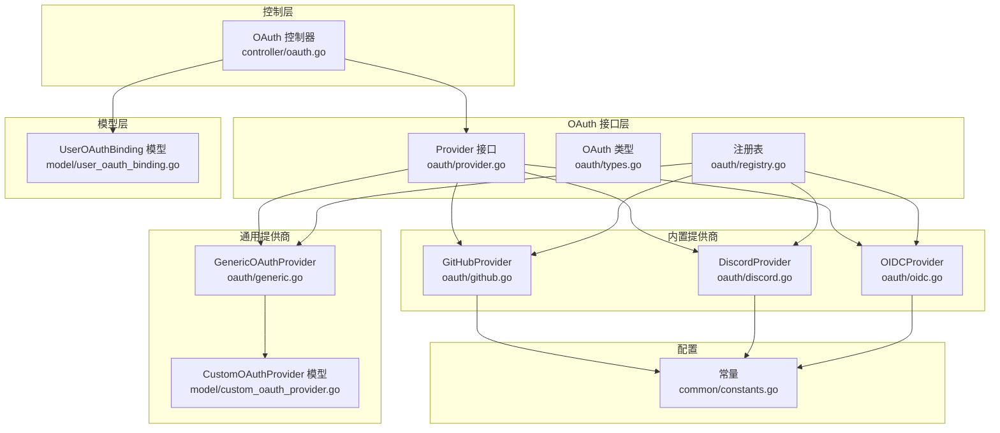
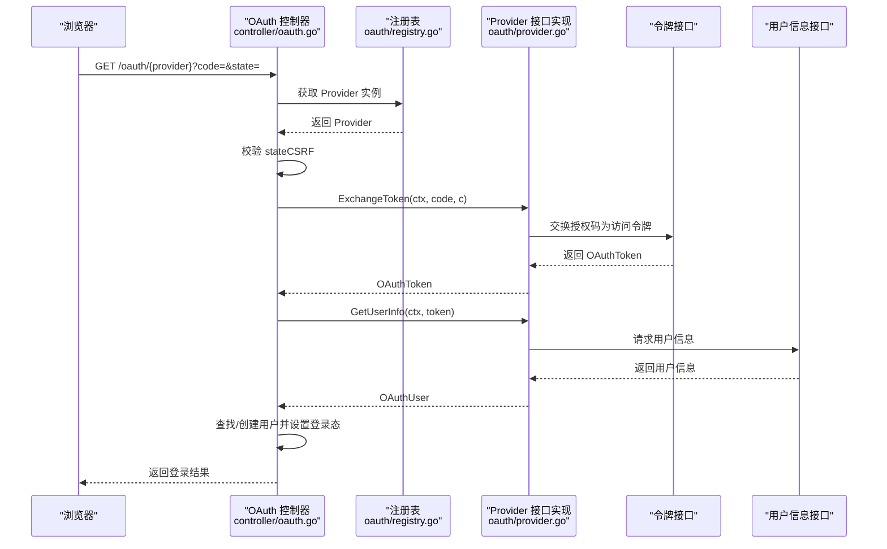
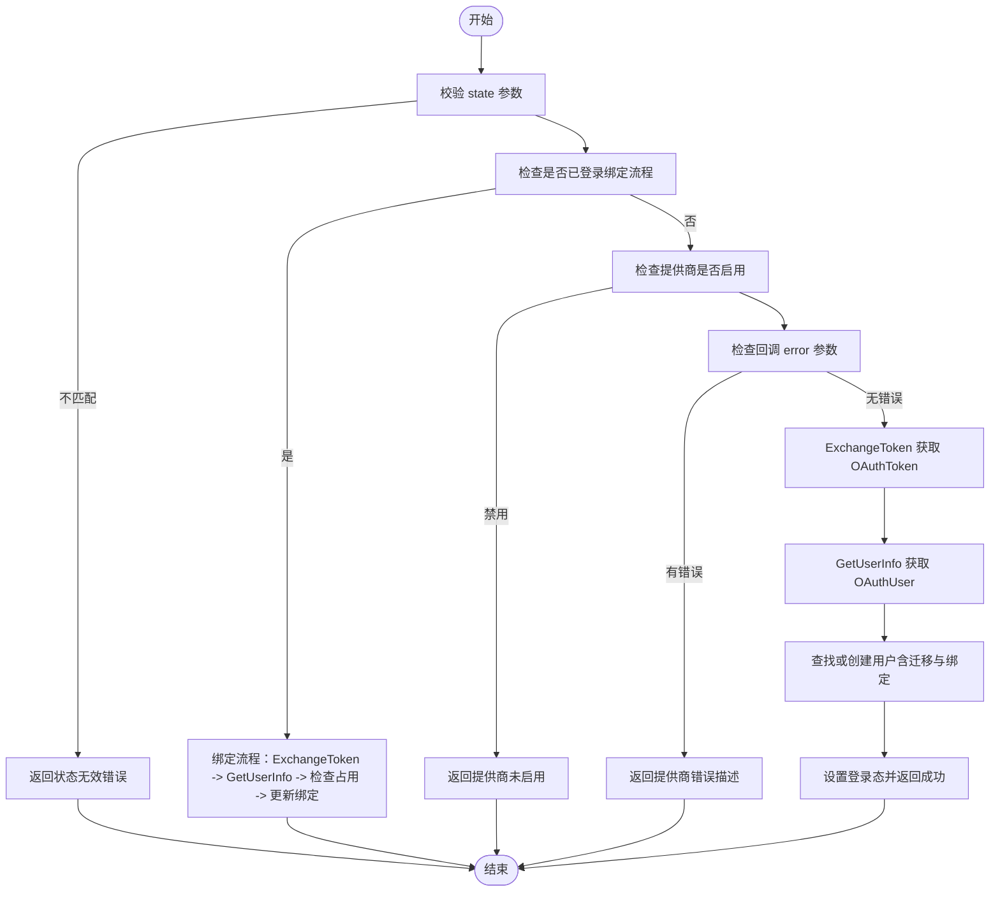
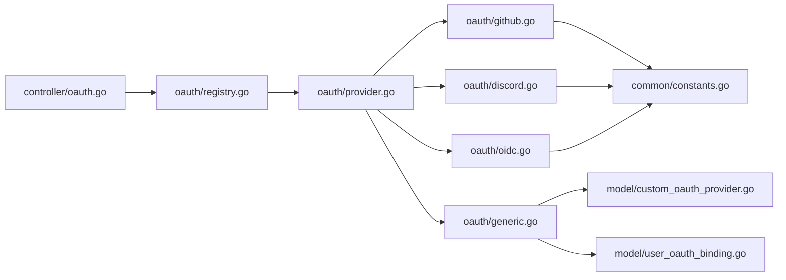

# OAuth 提供商接口

<cite>
**本文引用的文件**
- [oauth/provider.go](file://oauth/provider.go)
- [oauth/types.go](file://oauth/types.go)
- [oauth/registry.go](file://oauth/registry.go)
- [oauth/github.go](file://oauth/github.go)
- [oauth/discord.go](file://oauth/discord.go)
- [oauth/oidc.go](file://oauth/oidc.go)
- [oauth/generic.go](file://oauth/generic.go)
- [controller/oauth.go](file://controller/oauth.go)
- [model/custom_oauth_provider.go](file://model/custom_oauth_provider.go)
- [model/user_oauth_binding.go](file://model/user_oauth_binding.go)
- [common/constants.go](file://common/constants.go)
</cite>

## 目录
1. [简介](#简介)
2. [项目结构](#项目结构)
3. [核心组件](#核心组件)
4. [架构总览](#架构总览)
5. [详细组件分析](#详细组件分析)
6. [依赖分析](#依赖分析)
7. [性能考虑](#性能考虑)
8. [故障排查指南](#故障排查指南)
9. [结论](#结论)
10. [附录：自定义 OAuth 提供商实现指南](#附录自定义-oauth-提供商实现指南)

## 简介
本文件面向需要集成或扩展 OAuth 登录能力的开发者，系统性阐述 OAuth 提供商接口的设计与实现，覆盖以下主题：
- Provider 接口的设计理念与核心方法职责
- OAuthToken、OAuthUser、OAuthError 等数据结构的定义与用途
- 标准内置提供商（GitHub、Discord、OIDC）与通用自定义提供商（GenericOAuthProvider）的实现要点
- 注册表与控制器的协作流程
- 错误处理与国际化消息映射
- 自定义 OAuth 提供商的实现步骤、最佳实践与常见陷阱
- 完整的扩展实现路径指引（以代码片段路径形式给出）

## 项目结构
围绕 OAuth 的核心代码主要分布在以下模块：
- oauth：接口定义、类型、注册表、内置提供商与通用提供商
- controller：OAuth 回调处理、登录流程编排、错误处理
- model：自定义提供商配置、用户 OAuth 绑定关系等持久化模型
- common：全局常量（如各提供商开关、客户端凭据等）

图表来源
- [oauth/provider.go:10-36](file://oauth/provider.go#L10-L36)
- [oauth/registry.go:18-46](file://oauth/registry.go#L18-L46)
- [oauth/github.go:24-179](file://oauth/github.go#L24-L179)
- [oauth/discord.go:23-173](file://oauth/discord.go#L23-L173)
- [oauth/oidc.go:23-178](file://oauth/oidc.go#L23-L178)
- [oauth/generic.go:34-331](file://oauth/generic.go#L34-L331)
- [controller/oauth.go:43-128](file://controller/oauth.go#L43-L128)
- [model/user_oauth_binding.go:10-148](file://model/user_oauth_binding.go#L10-L148)
- [model/custom_oauth_provider.go:39-71](file://model/custom_oauth_provider.go#L39-L71)
- [common/constants.go:46-102](file://common/constants.go#L46-L102)

章节来源
- [oauth/provider.go:10-36](file://oauth/provider.go#L10-L36)
- [oauth/registry.go:18-46](file://oauth/registry.go#L18-L46)
- [controller/oauth.go:43-128](file://controller/oauth.go#L43-L128)

## 核心组件
- Provider 接口：统一抽象所有 OAuth 提供商的行为，包括名称、启用状态、授权码换令牌、获取用户信息、用户 ID 占用检查、填充用户、设置用户 ID、用户名前缀等。
- OAuth 类型：OAuthToken、OAuthUser、OAuthError 及相关错误类型，用于标准化令牌、用户信息与错误表达。
- 注册表：提供并发安全的注册、查询、加载自定义提供商的能力，并区分内置与自定义提供商。
- 内置提供商：GitHub、Discord、OIDC 的具体实现，展示标准 OAuth/OIDC 流程与错误处理。
- 通用提供商：基于配置的可插拔实现，支持字段映射、访问策略与多种认证风格。
- 控制器：编排 OAuth 回调流程，包括状态校验、错误处理、用户查找/创建、登录态设置等。

章节来源
- [oauth/provider.go:10-36](file://oauth/provider.go#L10-L36)
- [oauth/types.go:3-69](file://oauth/types.go#L3-L69)
- [oauth/registry.go:18-135](file://oauth/registry.go#L18-L135)
- [controller/oauth.go:43-128](file://controller/oauth.go#L43-L128)

## 架构总览
下图展示了从浏览器发起 OAuth 到最终登录成功的端到端流程，以及 Provider 接口在其中的角色。

图表来源
- [controller/oauth.go:43-128](file://controller/oauth.go#L43-L128)
- [oauth/registry.go:41-46](file://oauth/registry.go#L41-L46)
- [oauth/provider.go:18-23](file://oauth/provider.go#L18-L23)

## 详细组件分析

### Provider 接口设计与方法详解
- GetName：返回提供商显示名称，用于日志与国际化消息模板。
- IsEnabled：判断提供商是否启用，内置提供商通常由配置常量控制，通用提供商由数据库配置控制。
- ExchangeToken：使用授权码换取访问令牌，需处理网络错误、解析失败、空令牌等场景，并返回标准化的 OAuthToken。
- GetUserInfo：使用访问令牌请求用户信息，解析并返回标准化的 OAuthUser；同时可设置额外字段（如迁移兼容的旧 ID）。
- IsUserIDTaken：检查提供商用户 ID 是否已被占用（内置通过模型方法，通用通过用户 OAuth 绑定表）。
- FillUserByProviderID：根据提供商用户 ID 填充用户对象（内置直接填充对应字段，通用通过绑定表查询用户）。
- SetProviderUserID：为用户模型设置提供商用户 ID（内置直接赋值，通用通过绑定表维护）。
- GetProviderPrefix：生成自动用户名前缀（如 "github_"），避免冲突。

章节来源
- [oauth/provider.go:10-36](file://oauth/provider.go#L10-L36)

### OAuth 数据结构与错误处理
- OAuthToken：承载访问令牌、令牌类型、刷新令牌、过期时间、作用域、ID 令牌等字段，便于后续调用用户信息接口与刷新令牌。
- OAuthUser：承载提供商用户唯一标识、用户名、显示名、邮箱及扩展字段（可用于迁移兼容、附加元数据）。
- OAuthError：可国际化的错误封装，包含消息键、参数与原始错误字符串，便于前端展示与后端日志。
- AccessDeniedError：当访问策略拒绝时返回的人类可读错误。

章节来源
- [oauth/types.go:3-69](file://oauth/types.go#L3-L69)

### 内置提供商实现要点

#### GitHubProvider
- 启用状态：由全局常量控制。
- ExchangeToken：构造 JSON 负载，向 GitHub 令牌端点发起请求，解析响应，确保返回 AccessToken。
- GetUserInfo：调用 GitHub 用户信息端点，解析用户 ID、登录名、姓名、邮箱，必要时记录旧 ID 以便迁移。
- 其他：ID 占用检查、填充用户、设置用户 ID、用户名前缀均按 GitHub 字段约定实现。

章节来源
- [oauth/github.go:24-179](file://oauth/github.go#L24-L179)
- [common/constants.go:46-92](file://common/constants.go#L46-L92)

#### DiscordProvider
- 启用状态：由系统设置中的 Discord 配置控制。
- ExchangeToken：使用表单编码方式提交客户端凭据与授权码，解析响应并返回 OAuthToken。
- GetUserInfo：调用 Discord 用户信息端点，解析 UID、用户名、显示名等字段。

章节来源
- [oauth/discord.go:23-173](file://oauth/discord.go#L23-L173)

#### OIDCProvider
- 启用状态：由系统设置中的 OIDC 配置控制。
- ExchangeToken：使用系统设置中的令牌端点与客户端凭据，解析响应并返回 OAuthToken。
- GetUserInfo：使用系统设置中的用户信息端点，解析 OpenID、邮箱、用户名、显示名等字段。

章节来源
- [oauth/oidc.go:23-178](file://oauth/oidc.go#L23-L178)

### 通用提供商 GenericOAuthProvider
- 配置驱动：通过 CustomOAuthProvider 模型配置授权端点、令牌端点、用户信息端点、作用域、字段映射、认证风格、访问策略等。
- 认证风格：支持自动检测、参数传递、头部 Basic 认证三种风格。
- 字段映射：使用 JSONPath（gjson）从用户信息响应中提取用户 ID、用户名、显示名、邮箱等字段。
- 访问策略：支持多条件与分组的策略表达式，支持比较运算符、存在性判断、集合包含等，拒绝时可渲染带上下文的错误消息。
- 绑定管理：通过 UserOAuthBinding 表维护用户与提供商的绑定关系，ID 占用检查与填充用户均基于该表。

章节来源
- [oauth/generic.go:34-331](file://oauth/generic.go#L34-L331)
- [model/custom_oauth_provider.go:39-71](file://model/custom_oauth_provider.go#L39-L71)
- [model/user_oauth_binding.go:10-148](file://model/user_oauth_binding.go#L10-L148)

### 控制器编排逻辑
- 状态校验：从会话中取出预生成的 state，与回调参数 state 对比，防止 CSRF 攻击。
- 绑定流程：若当前会话已登录，则进入“绑定”流程，检查用户 ID 是否已被占用，支持自定义提供商的绑定表更新。
- 用户查找/创建：优先按新 ID 匹配，其次尝试旧 ID 迁移；若未找到且允许注册，则创建新用户并完成绑定或直接写入内置字段。
- 登录态设置：设置会话并返回成功结果；对已删除用户、注册关闭等场景返回相应国际化消息。

图表来源
- [controller/oauth.go:43-196](file://controller/oauth.go#L43-L196)

章节来源
- [controller/oauth.go:43-196](file://controller/oauth.go#L43-L196)

## 依赖分析
- Provider 接口被控制器调用，控制器通过注册表按名称获取 Provider 实例。
- 内置 Provider 依赖全局常量与系统设置（如 GitHub、Discord、OIDC 的开关与凭据）。
- 通用 Provider 依赖 CustomOAuthProvider 配置与 UserOAuthBinding 绑定表。
- 注册表支持并发读写，内置 Provider 在 init 中注册，通用 Provider 通过数据库动态加载。

图表来源
- [controller/oauth.go:43-128](file://controller/oauth.go#L43-L128)
- [oauth/registry.go:18-46](file://oauth/registry.go#L18-L46)
- [oauth/github.go:20-22](file://oauth/github.go#L20-L22)
- [oauth/discord.go:19-21](file://oauth/discord.go#L19-L21)
- [oauth/oidc.go:19-21](file://oauth/oidc.go#L19-L21)
- [oauth/generic.go:74-76](file://oauth/generic.go#L74-L76)
- [model/custom_oauth_provider.go:39-71](file://model/custom_oauth_provider.go#L39-L71)
- [model/user_oauth_binding.go:10-148](file://model/user_oauth_binding.go#L10-L148)
- [common/constants.go:46-102](file://common/constants.go#L46-L102)

章节来源
- [oauth/registry.go:18-135](file://oauth/registry.go#L18-L135)
- [oauth/generic.go:74-76](file://oauth/generic.go#L74-L76)

## 性能考虑
- 超时控制：内置与通用提供商在 HTTP 请求中设置了合理的超时时间，避免阻塞。
- 并发安全：注册表使用读写锁保护，保证在高并发场景下的稳定性。
- 日志与可观测性：提供详细的调试日志，便于定位网络错误与解析失败。
- 访问策略评估：通用提供商的策略评估使用 JSONPath 快速提取字段，建议合理配置字段路径与策略复杂度。

## 故障排查指南
- 授权码无效：ExchangeToken 输入为空时返回国际化错误，检查回调参数与 state 校验。
- 网络连接失败：HTTP 请求错误会被包装为 OAuthError 并携带原始错误，检查端点可达性与凭据正确性。
- 解析失败：令牌或用户信息响应格式不符合预期时，返回解析错误；检查端点返回格式与字段映射。
- 用户信息缺失：当用户 ID 或关键字段为空时，返回用户信息为空错误；核对作用域与用户信息端点权限。
- 访问策略拒绝：通用提供商可渲染带上下文的拒绝消息，便于用户理解原因。
- 绑定冲突：若提供商用户 ID 已被占用，返回绑定冲突错误；检查绑定表与迁移逻辑。

章节来源
- [oauth/github.go:48-103](file://oauth/github.go#L48-L103)
- [oauth/discord.go:49-108](file://oauth/discord.go#L49-L108)
- [oauth/oidc.go:51-110](file://oauth/oidc.go#L51-L110)
- [oauth/generic.go:90-200](file://oauth/generic.go#L90-L200)
- [controller/oauth.go:346-362](file://controller/oauth.go#L346-L362)

## 结论
Provider 接口提供了统一的 OAuth 抽象，结合注册表与控制器，实现了从授权码到登录态的一体化流程。内置提供商展示了标准 OAuth/OIDC 的典型实现，通用提供商则通过配置实现了高度可扩展的接入能力。通过完善的错误处理与访问策略，系统在易用性与安全性之间取得了良好平衡。

## 附录：自定义 OAuth 提供商实现指南

### 实现步骤
1. 定义结构体并实现 Provider 接口的所有方法（GetName、IsEnabled、ExchangeToken、GetUserInfo、IsUserIDTaken、FillUserByProviderID、SetProviderUserID、GetProviderPrefix）。
2. 在 init 函数中通过 Register 注册你的 Provider 实例。
3. 若为通用场景，可参考 GenericOAuthProvider 的字段映射与访问策略实现，结合 CustomOAuthProvider 配置进行开发。
4. 在控制器中无需修改即可复用现有回调流程，包括状态校验、错误处理、用户查找/创建与登录态设置。

### 最佳实践
- 明确启用条件：内置提供商通过常量控制，通用提供商通过数据库配置控制，确保启停可控。
- 规范字段映射：使用稳定的 JSONPath，避免频繁变更；必要时保留旧 ID 以支持迁移。
- 严谨错误处理：对外统一返回 OAuthError 或 AccessDeniedError，便于国际化与前端展示。
- 并发安全：在注册表层面已提供并发保护，自定义实现中注意避免共享可变状态。
- 性能与可观测性：设置合理超时，记录关键日志，便于问题定位。

### 常见陷阱
- 忽视状态校验：未校验 state 将导致 CSRF 风险。
- 不一致的用户 ID：不同提供商可能返回字符串或数值 ID，务必统一转换为字符串存储。
- 作用域不足：用户信息端点可能需要额外作用域，确保配置正确。
- 访问策略误判：策略表达式与 JSONPath 不匹配会导致误拒绝，建议先在测试环境验证。

### 完整扩展实现路径（代码片段路径）
- 接口定义与注册
  - [Provider 接口:10-36](file://oauth/provider.go#L10-L36)
  - [注册表注册:18-46](file://oauth/registry.go#L18-L46)
- 内置提供商参考实现
  - [GitHubProvider 实现:24-179](file://oauth/github.go#L24-L179)
  - [DiscordProvider 实现:23-173](file://oauth/discord.go#L23-L173)
  - [OIDCProvider 实现:23-178](file://oauth/oidc.go#L23-L178)
- 通用提供商参考实现
  - [GenericOAuthProvider 实现:34-331](file://oauth/generic.go#L34-L331)
  - [CustomOAuthProvider 模型:39-71](file://model/custom_oauth_provider.go#L39-L71)
  - [UserOAuthBinding 模型:10-148](file://model/user_oauth_binding.go#L10-L148)
- 控制器编排
  - [OAuth 回调处理:43-128](file://controller/oauth.go#L43-128)
  - [绑定流程:130-196](file://controller/oauth.go#L130-196)