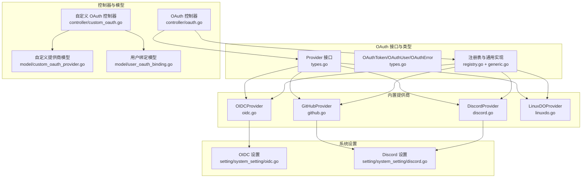
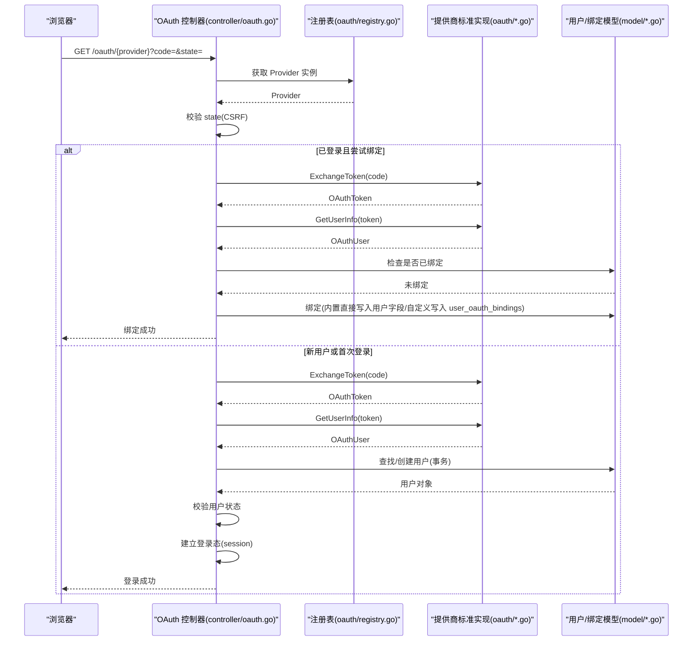
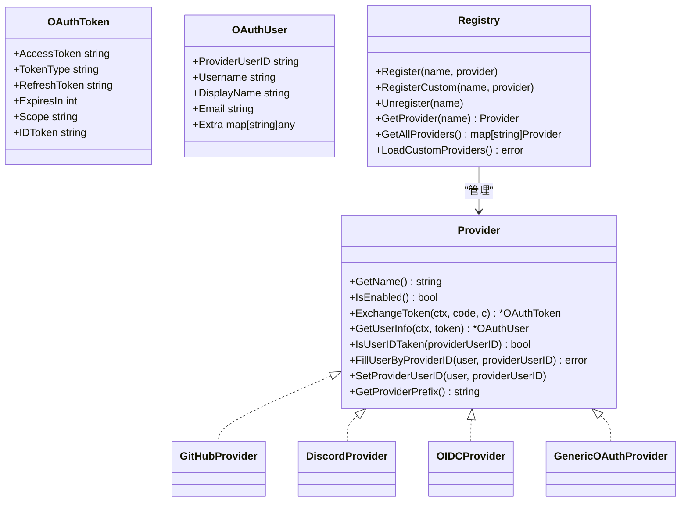
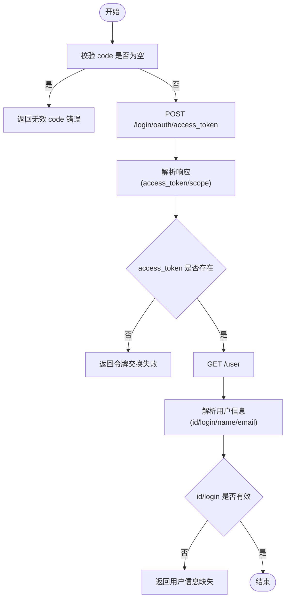
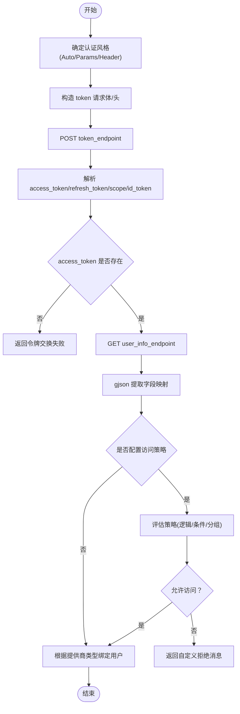
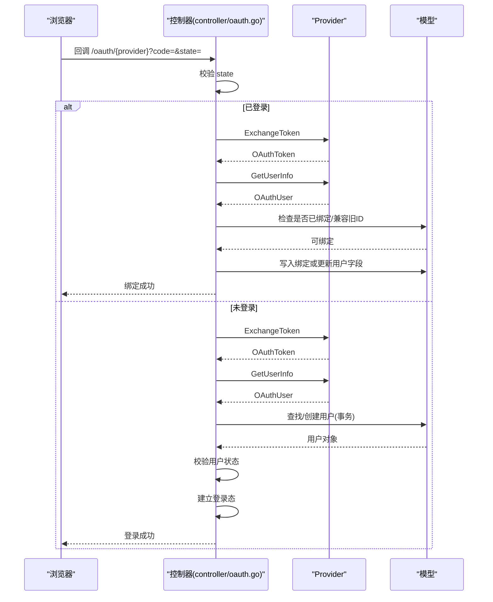
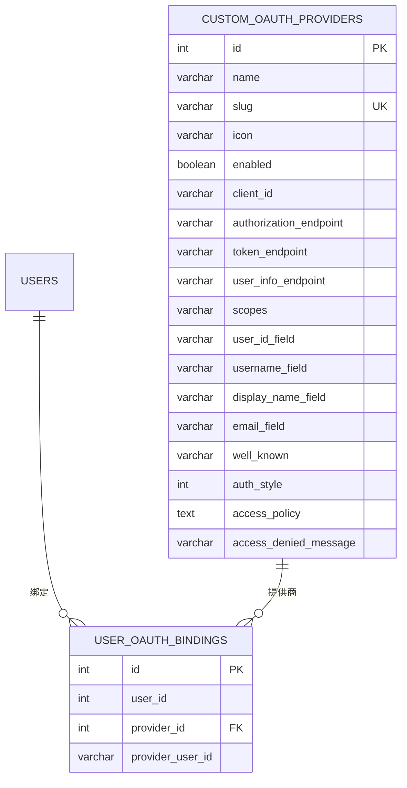
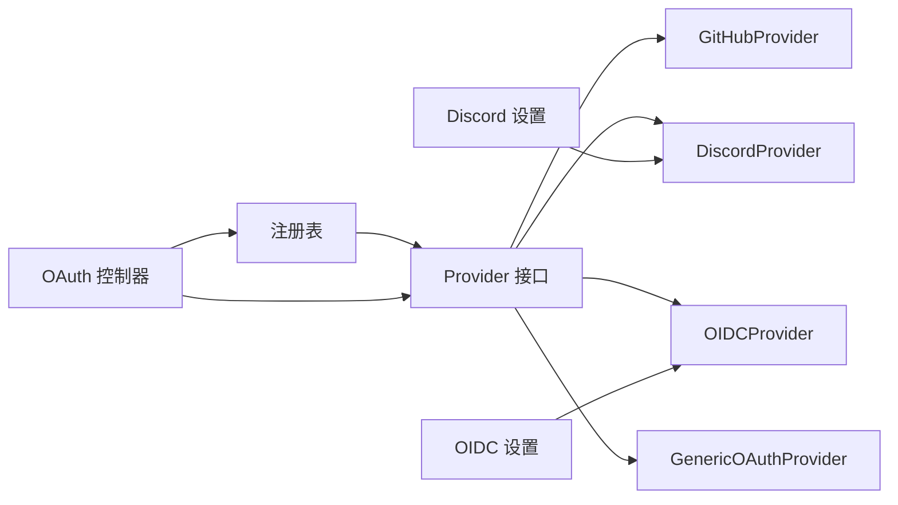

# OAuth 集成

<cite>
**本文引用的文件**
- [oauth/provider.go](file://oauth/provider.go)
- [oauth/types.go](file://oauth/types.go)
- [oauth/registry.go](file://oauth/registry.go)
- [oauth/github.go](file://oauth/github.go)
- [oauth/discord.go](file://oauth/discord.go)
- [oauth/oidc.go](file://oauth/oidc.go)
- [oauth/generic.go](file://oauth/generic.go)
- [oauth/linuxdo.go](file://oauth/linuxdo.go)
- [controller/oauth.go](file://controller/oauth.go)
- [controller/custom_oauth.go](file://controller/custom_oauth.go)
- [model/custom_oauth_provider.go](file://model/custom_oauth_provider.go)
- [model/user_oauth_binding.go](file://model/user_oauth_binding.go)
- [setting/system_setting/oidc.go](file://setting/system_setting/oidc.go)
- [setting/system_setting/discord.go](file://setting/system_setting/discord.go)
</cite>

## 目录
1. [简介](#简介)
2. [项目结构](#项目结构)
3. [核心组件](#核心组件)
4. [架构总览](#架构总览)
5. [详细组件分析](#详细组件分析)
6. [依赖分析](#依赖分析)
7. [性能考量](#性能考量)
8. [故障排除指南](#故障排除指南)
9. [结论](#结论)
10. [附录](#附录)

## 简介
本文件面向 OAuth 集成系统的开发者与运维人员，系统性阐述支持的 OAuth 提供商（GitHub、Discord、OIDC、Linux DO 等），OAuth 2.0 授权流程在本项目中的实现（授权码获取、令牌交换、用户信息获取）、自定义 OAuth 提供商的配置与扩展机制、完整的集成示例（回调地址、作用域、用户绑定）、安全注意事项（CSRF 防护、令牌存储与会话管理）以及故障排除与性能优化建议。

## 项目结构
OAuth 子系统由“接口与类型”、“内置提供商标准实现”、“注册表与通用实现”、“控制器与模型支撑”四部分组成，并通过系统设置模块注入配置。

**图表来源**
- [oauth/provider.go:10-36](file://oauth/provider.go#L10-L36)
- [oauth/types.go:3-69](file://oauth/types.go#L3-L69)
- [oauth/registry.go:18-72](file://oauth/registry.go#L18-L72)
- [oauth/github.go:24-46](file://oauth/github.go#L24-L46)
- [oauth/discord.go:23-47](file://oauth/discord.go#L23-L47)
- [oauth/oidc.go:23-49](file://oauth/oidc.go#L23-L49)
- [oauth/generic.go:34-84](file://oauth/generic.go#L34-L84)
- [controller/oauth.go:43-128](file://controller/oauth.go#L43-L128)
- [controller/custom_oauth.go:72-90](file://controller/custom_oauth.go#L72-L90)
- [model/custom_oauth_provider.go:39-67](file://model/custom_oauth_provider.go#L39-L67)
- [model/user_oauth_binding.go:10-21](file://model/user_oauth_binding.go#L10-L21)
- [setting/system_setting/oidc.go:5-25](file://setting/system_setting/oidc.go#L5-L25)
- [setting/system_setting/discord.go:5-21](file://setting/system_setting/discord.go#L5-L21)

**章节来源**
- [oauth/provider.go:10-36](file://oauth/provider.go#L10-L36)
- [oauth/types.go:3-69](file://oauth/types.go#L3-L69)
- [oauth/registry.go:18-72](file://oauth/registry.go#L18-L72)
- [oauth/github.go:24-46](file://oauth/github.go#L24-L46)
- [oauth/discord.go:23-47](file://oauth/discord.go#L23-L47)
- [oauth/oidc.go:23-49](file://oauth/oidc.go#L23-L49)
- [oauth/generic.go:34-84](file://oauth/generic.go#L34-L84)
- [controller/oauth.go:43-128](file://controller/oauth.go#L43-L128)
- [controller/custom_oauth.go:72-90](file://controller/custom_oauth.go#L72-L90)
- [model/custom_oauth_provider.go:39-67](file://model/custom_oauth_provider.go#L39-L67)
- [model/user_oauth_binding.go:10-21](file://model/user_oauth_binding.go#L10-L21)
- [setting/system_setting/oidc.go:5-25](file://setting/system_setting/oidc.go#L5-L25)
- [setting/system_setting/discord.go:5-21](file://setting/system_setting/discord.go#L5-L21)

## 核心组件
- Provider 接口：统一抽象各 OAuth 提供商的名称、启用状态、授权码换令牌、获取用户信息、用户 ID 占用检测、按提供商标识填充/设置用户、用户名前缀等能力。
- OAuthToken/OAuthUser/OAuthError：标准化令牌、用户信息与错误表示。
- 注册表与通用实现：集中注册/注销提供商，加载数据库中的自定义提供商，区分内置与自定义提供商；通用提供商支持可配置字段映射、访问策略与认证风格。
- 内置提供商：GitHub、Discord、OIDC、Linux DO 的具体实现，均遵循 Provider 接口。
- 控制器：处理 OAuth 回调、CSRF 校验、用户查找/创建、绑定、登录态建立、错误处理。
- 模型：自定义提供商配置持久化、用户与自定义提供商的绑定关系持久化。
- 系统设置：OIDC/Discord 的客户端凭据与端点配置。

**章节来源**
- [oauth/provider.go:10-36](file://oauth/provider.go#L10-L36)
- [oauth/types.go:3-69](file://oauth/types.go#L3-L69)
- [oauth/registry.go:18-72](file://oauth/registry.go#L18-L72)
- [oauth/generic.go:34-84](file://oauth/generic.go#L34-L84)
- [controller/oauth.go:43-128](file://controller/oauth.go#L43-L128)
- [model/custom_oauth_provider.go:39-67](file://model/custom_oauth_provider.go#L39-L67)
- [model/user_oauth_binding.go:10-21](file://model/user_oauth_binding.go#L10-L21)
- [setting/system_setting/oidc.go:5-25](file://setting/system_setting/oidc.go#L5-L25)
- [setting/system_setting/discord.go:5-21](file://setting/system_setting/discord.go#L5-L21)

## 架构总览
下图展示从浏览器发起 OAuth 到登录完成的关键交互路径，涵盖 CSRF 校验、令牌交换、用户信息获取、用户查找/创建与绑定、登录态建立。

**图表来源**
- [controller/oauth.go:43-128](file://controller/oauth.go#L43-L128)
- [oauth/registry.go:41-57](file://oauth/registry.go#L41-L57)
- [oauth/github.go:48-103](file://oauth/github.go#L48-L103)
- [oauth/discord.go:49-108](file://oauth/discord.go#L49-L108)
- [oauth/oidc.go:51-110](file://oauth/oidc.go#L51-L110)
- [oauth/generic.go:90-200](file://oauth/generic.go#L90-L200)
- [model/user_oauth_binding.go:63-105](file://model/user_oauth_binding.go#L63-L105)

**章节来源**
- [controller/oauth.go:43-128](file://controller/oauth.go#L43-L128)
- [oauth/registry.go:41-57](file://oauth/registry.go#L41-L57)

## 详细组件分析

### Provider 接口与数据模型
- Provider 接口定义了 OAuth 提供商的最小能力集，确保不同提供商以一致方式接入。
- OAuthToken/OAuthUser/OAuthError 提供统一的数据结构与错误表达，便于控制器进行跨提供商的一致处理。
- 注册表负责提供商的注册、查询、启用状态判断、自定义提供商的动态加载与注销。

**图表来源**
- [oauth/provider.go:10-36](file://oauth/provider.go#L10-L36)
- [oauth/types.go:3-69](file://oauth/types.go#L3-L69)
- [oauth/registry.go:18-72](file://oauth/registry.go#L18-L72)
- [oauth/github.go:24-46](file://oauth/github.go#L24-L46)
- [oauth/discord.go:23-47](file://oauth/discord.go#L23-L47)
- [oauth/oidc.go:23-49](file://oauth/oidc.go#L23-L49)
- [oauth/generic.go:34-84](file://oauth/generic.go#L34-L84)

**章节来源**
- [oauth/provider.go:10-36](file://oauth/provider.go#L10-L36)
- [oauth/types.go:3-69](file://oauth/types.go#L3-L69)
- [oauth/registry.go:18-72](file://oauth/registry.go#L18-L72)

### 内置提供商实现

#### GitHub
- 授权码换取令牌：向 GitHub 授权服务器发送 POST，携带 client_id、client_secret、code。
- 获取用户信息：调用 GitHub 用户信息接口，解析返回的 numeric ID、login、name、email。
- 用户迁移：保留旧的 login 作为 legacy_id，用于从旧账号迁移到新的 numeric ID。
- 用户名前缀：github_。

**图表来源**
- [oauth/github.go:48-103](file://oauth/github.go#L48-L103)
- [oauth/github.go:105-161](file://oauth/github.go#L105-L161)

**章节来源**
- [oauth/github.go:48-161](file://oauth/github.go#L48-L161)

#### Discord
- 授权码换取令牌：使用 x-www-form-urlencoded，携带 client_id、client_secret、code、grant_type、redirect_uri。
- 获取用户信息：调用 /users/@me，解析 UID、username、global_name。
- 用户名前缀：discord_。

**章节来源**
- [oauth/discord.go:49-155](file://oauth/discord.go#L49-L155)

#### OIDC
- 授权码换取令牌：从系统设置读取 TokenEndpoint，使用 x-www-form-urlencoded，携带 client_id、client_secret、code、grant_type、redirect_uri。
- 获取用户信息：从系统设置读取 UserInfoEndpoint，解析 sub、email、preferred_username、name。
- 用户名前缀：oidc_。

**章节来源**
- [oauth/oidc.go:51-159](file://oauth/oidc.go#L51-L159)
- [setting/system_setting/oidc.go:5-25](file://setting/system_setting/oidc.go#L5-L25)

#### Linux DO
- 授权码换取令牌：使用 Basic Auth，携带 client_id:client_secret，构造 Authorization 头。
- 获取用户信息：调用用户接口，解析 id、username、name、trust_level、active、silenced。
- 访问控制：当 trust_level 低于阈值时拒绝登录，并返回信任等级错误。

**章节来源**
- [oauth/linuxdo.go:45-167](file://oauth/linuxdo.go#L45-L167)

### 通用自定义提供商（Generic）
- 支持可配置字段映射：通过 JSONPath 从用户信息响应中提取用户 ID、用户名、显示名、邮箱。
- 支持访问策略：基于用户信息的 JSON 结构进行条件判断（支持 and/or、比较运算符、数组包含、字符串包含等），并可自定义拒绝消息模板。
- 支持认证风格：自动检测、参数传递、Basic Auth 头三种方式。
- 用户绑定：自定义提供商采用 user_oauth_bindings 表进行绑定，避免污染用户主表字段。

**图表来源**
- [oauth/generic.go:90-200](file://oauth/generic.go#L90-L200)
- [oauth/generic.go:202-291](file://oauth/generic.go#L202-L291)
- [oauth/generic.go:333-452](file://oauth/generic.go#L333-L452)
- [oauth/generic.go:623-673](file://oauth/generic.go#L623-L673)

**章节来源**
- [oauth/generic.go:90-291](file://oauth/generic.go#L90-L291)
- [oauth/generic.go:333-452](file://oauth/generic.go#L333-L452)
- [oauth/generic.go:623-673](file://oauth/generic.go#L623-L673)

### 控制器与用户流程

#### OAuth 回调处理（含绑定）
- CSRF 校验：从 Session 中取出 oauth_state 并与回调参数 state 对比。
- 绑定流程：若当前会话已登录，则进入绑定分支，检查是否已绑定、兼容旧 ID、写入绑定或更新用户字段。
- 登录流程：若未登录，执行令牌交换与用户信息获取，查找/创建用户（事务），校验用户状态，建立登录态。

**图表来源**
- [controller/oauth.go:43-128](file://controller/oauth.go#L43-L128)
- [controller/oauth.go:130-196](file://controller/oauth.go#L130-L196)
- [controller/oauth.go:198-331](file://controller/oauth.go#L198-L331)

**章节来源**
- [controller/oauth.go:43-196](file://controller/oauth.go#L43-L196)
- [controller/oauth.go:198-331](file://controller/oauth.go#L198-L331)

#### 自定义提供商管理
- 列表/详情：返回不含敏感字段的配置视图。
- 发现配置：支持通过 Well-Known 或 Issuer URL 自动拉取 OIDC 配置。
- 创建/更新：校验 slug 冲突、字段合法性、访问策略 JSON 校验；更新后注册到注册表。
- 删除：需先解除所有用户绑定，再删除并从注册表注销。

**章节来源**
- [controller/custom_oauth.go:72-90](file://controller/custom_oauth.go#L72-L90)
- [controller/custom_oauth.go:141-211](file://controller/custom_oauth.go#L141-L211)
- [controller/custom_oauth.go:213-267](file://controller/custom_oauth.go#L213-L267)
- [controller/custom_oauth.go:291-400](file://controller/custom_oauth.go#L291-L400)
- [controller/custom_oauth.go:402-442](file://controller/custom_oauth.go#L402-L442)

### 数据模型与绑定
- 自定义提供商配置：包含端点、客户端凭据、字段映射、作用域、认证风格、访问策略、拒绝消息等。
- 用户绑定：每用户每提供商唯一绑定，防止重复绑定；支持按 provider_id+provider_user_id 查询用户。

**图表来源**
- [model/custom_oauth_provider.go:39-67](file://model/custom_oauth_provider.go#L39-L67)
- [model/user_oauth_binding.go:10-21](file://model/user_oauth_binding.go#L10-L21)

**章节来源**
- [model/custom_oauth_provider.go:39-67](file://model/custom_oauth_provider.go#L39-L67)
- [model/user_oauth_binding.go:10-21](file://model/user_oauth_binding.go#L10-L21)

## 依赖分析
- Provider 接口与实现：所有内置提供商均实现 Provider 接口，保证统一行为。
- 注册表：集中管理 Provider 的生命周期，支持自定义提供商的动态加载与注销。
- 控制器：依赖 Provider 与模型层，负责业务流程编排与错误处理。
- 系统设置：OIDC/Discord 的配置通过系统设置模块注入，避免硬编码。

**图表来源**
- [oauth/provider.go:10-36](file://oauth/provider.go#L10-L36)
- [oauth/registry.go:18-72](file://oauth/registry.go#L18-L72)
- [oauth/github.go:24-46](file://oauth/github.go#L24-L46)
- [oauth/discord.go:23-47](file://oauth/discord.go#L23-L47)
- [oauth/oidc.go:23-49](file://oauth/oidc.go#L23-L49)
- [oauth/generic.go:34-84](file://oauth/generic.go#L34-L84)
- [controller/oauth.go:43-128](file://controller/oauth.go#L43-L128)
- [setting/system_setting/oidc.go:5-25](file://setting/system_setting/oidc.go#L5-L25)
- [setting/system_setting/discord.go:5-21](file://setting/system_setting/discord.go#L5-L21)

**章节来源**
- [oauth/provider.go:10-36](file://oauth/provider.go#L10-L36)
- [oauth/registry.go:18-72](file://oauth/registry.go#L18-L72)
- [controller/oauth.go:43-128](file://controller/oauth.go#L43-L128)
- [setting/system_setting/oidc.go:5-25](file://setting/system_setting/oidc.go#L5-L25)
- [setting/system_setting/discord.go:5-21](file://setting/system_setting/discord.go#L5-L21)

## 性能考量
- 超时控制：各提供商在令牌交换与用户信息获取阶段均设置了合理的 HTTP 超时，避免阻塞。
- 事务一致性：新用户创建与绑定采用数据库事务，确保原子性，减少不一致风险。
- 缓存与并发：注册表使用读写锁保护，支持高并发场景下的提供商查询与动态更新。
- 日志与可观测性：关键步骤记录调试日志，便于定位性能瓶颈与异常。

[本节为通用指导，无需特定文件来源]

## 故障排除指南
- 回调 state 校验失败：检查前端生成的 state 是否正确保存至 Session，并与回调参数一致。
- 令牌交换失败：确认回调 code 有效、客户端凭据正确、redirect_uri 与注册一致、网络可达。
- 用户信息缺失：检查用户信息端点返回格式、字段映射配置、访问策略是否导致拒绝。
- 自定义提供商删除失败：检查是否存在用户绑定，需先解除绑定再删除。
- Linux DO 信任等级不足：提升用户信任等级或调整最低信任阈值。
- OIDC/Discord 未启用：检查系统设置中的 Enabled 字段与客户端凭据。

**章节来源**
- [controller/oauth.go:57-65](file://controller/oauth.go#L57-L65)
- [oauth/github.go:48-103](file://oauth/github.go#L48-L103)
- [oauth/discord.go:49-108](file://oauth/discord.go#L49-L108)
- [oauth/oidc.go:51-110](file://oauth/oidc.go#L51-L110)
- [controller/custom_oauth.go:402-442](file://controller/custom_oauth.go#L402-L442)
- [oauth/linuxdo.go:146-154](file://oauth/linuxdo.go#L146-L154)

## 结论
本 OAuth 集成体系以 Provider 接口为核心，结合注册表与通用实现，既覆盖主流内置提供商（GitHub、Discord、OIDC、Linux DO），又提供强大的自定义扩展能力。通过严格的 CSRF 校验、事务化的用户创建与绑定、可配置的访问策略与字段映射，系统在安全性与灵活性之间取得平衡。配合完善的控制器与模型支撑，开发者可以快速完成 OAuth 集成与扩展。

[本节为总结，无需特定文件来源]

## 附录

### OAuth 2.0 流程实现要点
- 授权码获取：由前端引导用户跳转至提供商授权页面，回调携带 code。
- 令牌交换：控制器调用 Provider.ExchangeToken，内部向提供商端点发送授权码换取令牌。
- 用户信息获取：调用 Provider.GetUserInfo，解析用户标识与基础资料。
- 用户查找/创建：优先按提供商标识查找，不存在则创建新用户（事务内），内置提供商直接写入用户字段，自定义提供商写入 user_oauth_bindings。
- 登录态建立：设置会话并返回登录结果。

**章节来源**
- [controller/oauth.go:43-128](file://controller/oauth.go#L43-L128)
- [oauth/github.go:48-103](file://oauth/github.go#L48-L103)
- [oauth/discord.go:49-108](file://oauth/discord.go#L49-L108)
- [oauth/oidc.go:51-110](file://oauth/oidc.go#L51-L110)
- [oauth/generic.go:90-200](file://oauth/generic.go#L90-L200)

### 自定义 OAuth 提供商配置与扩展
- 必填项：名称、slug、客户端 ID、授权端点、令牌端点、用户信息端点。
- 字段映射：支持 JSONPath 提取用户 ID、用户名、显示名、邮箱。
- 访问策略：支持 and/or 逻辑、多种比较运算符、数组/字符串匹配、嵌套分组。
- 认证风格：自动检测、参数传递、Basic Auth 头。
- 发现配置：支持通过 Well-Known 或 Issuer URL 自动拉取 OIDC 配置。

**章节来源**
- [controller/custom_oauth.go:141-211](file://controller/custom_oauth.go#L141-L211)
- [controller/custom_oauth.go:213-267](file://controller/custom_oauth.go#L213-L267)
- [controller/custom_oauth.go:291-400](file://controller/custom_oauth.go#L291-L400)
- [oauth/generic.go:202-291](file://oauth/generic.go#L202-L291)
- [oauth/generic.go:333-452](file://oauth/generic.go#L333-L452)

### 安全考虑
- CSRF 防护：回调参数 state 必须与 Session 中的 oauth_state 匹配。
- 令牌存储：令牌交换成功后，应仅在内存中持有短期令牌，必要时持久化需加密存储。
- 会话管理：登录成功后设置安全的会话标识，避免泄露。
- 访问策略：通过访问策略限制不符合条件的用户登录，降低风险面。
- 最小权限：作用域按需配置，避免过度授权。

**章节来源**
- [controller/oauth.go:57-65](file://controller/oauth.go#L57-L65)
- [oauth/generic.go:266-281](file://oauth/generic.go#L266-L281)

### 集成示例（步骤指引）
- GitHub
  - 在 GitHub OAuth Apps 中创建应用，回调地址为 {server}/oauth/github。
  - 在系统设置中启用 GitHub 并填入 Client ID/Secret。
  - 前端引导用户访问 /oauth/github，完成授权后回调处理。
- Discord
  - 在 Discord 应用中创建应用，OAuth2 Redirects 配置 {server}/oauth/discord。
  - 在系统设置中启用 Discord 并填入 Client ID/Secret。
- OIDC
  - 在系统设置中启用 OIDC，填入 Client ID/Secret 与端点（或使用 Well-Known）。
  - 前端引导用户访问 /oauth/oidc。
- Linux DO
  - 在系统设置中启用 Linux DO 并填入 Client ID/Secret 与端点。
  - 前端引导用户访问 /oauth/linuxdo。
- 自定义提供商
  - 通过管理端创建自定义提供商，配置端点、字段映射、作用域、认证风格。
  - 使用 /oauth/{slug} 进行授权与回调。
  - 如需发现配置，可通过后台接口拉取 OIDC 发现文档。

**章节来源**
- [setting/system_setting/discord.go:5-21](file://setting/system_setting/discord.go#L5-L21)
- [setting/system_setting/oidc.go:5-25](file://setting/system_setting/oidc.go#L5-L25)
- [controller/custom_oauth.go:213-267](file://controller/custom_oauth.go#L213-L267)
- [controller/custom_oauth.go:141-211](file://controller/custom_oauth.go#L141-L211)