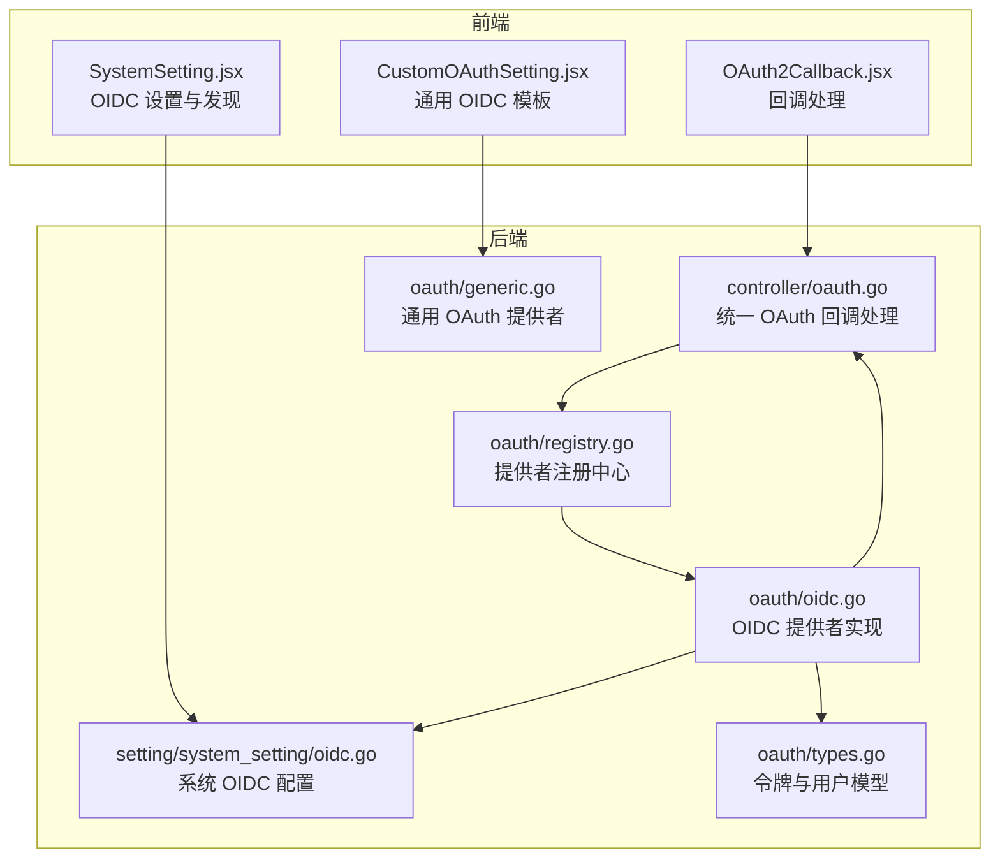
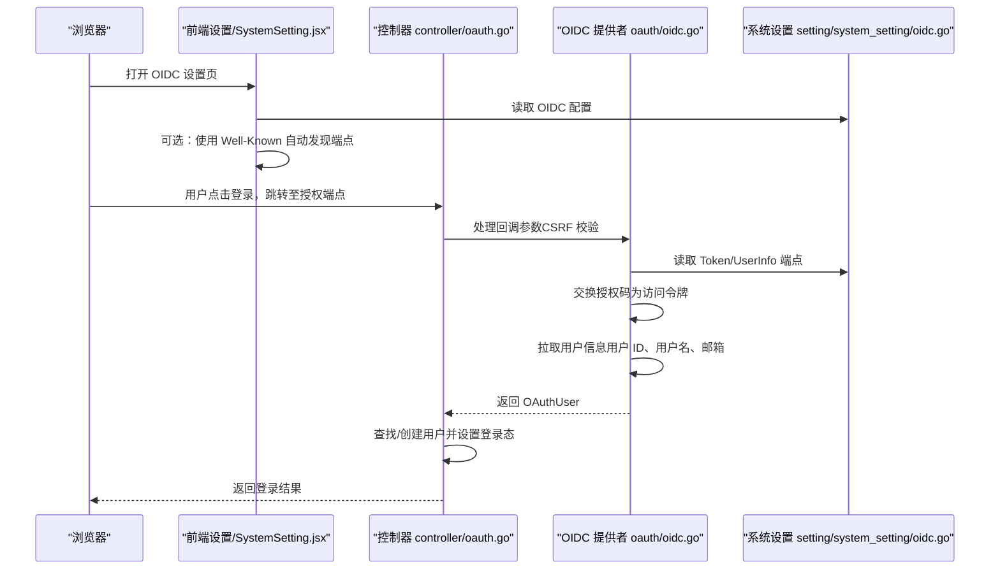
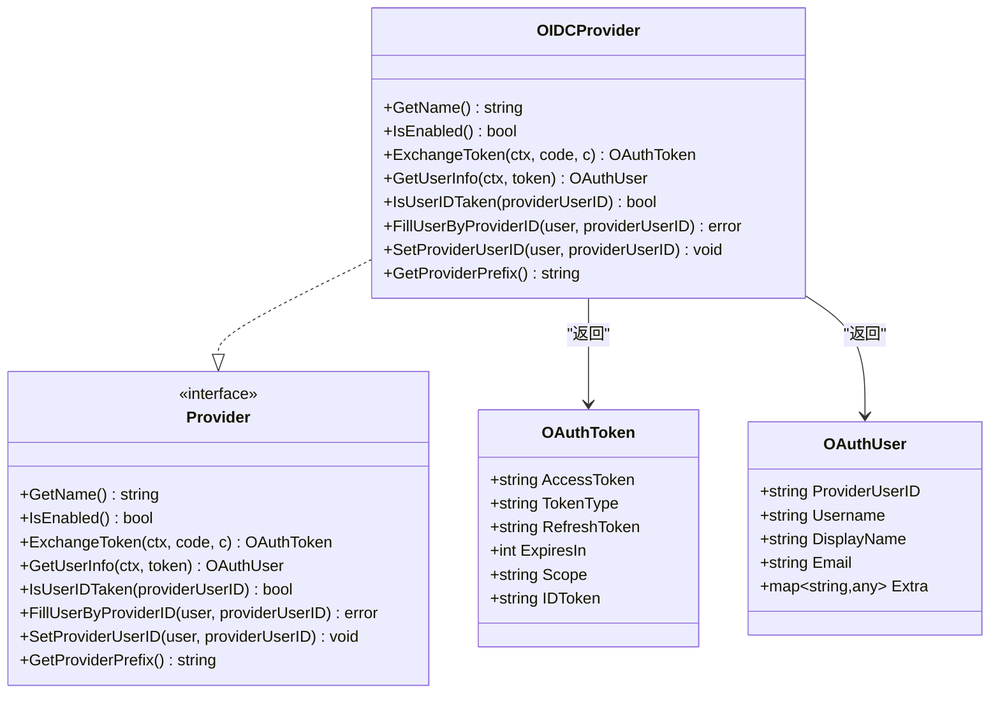
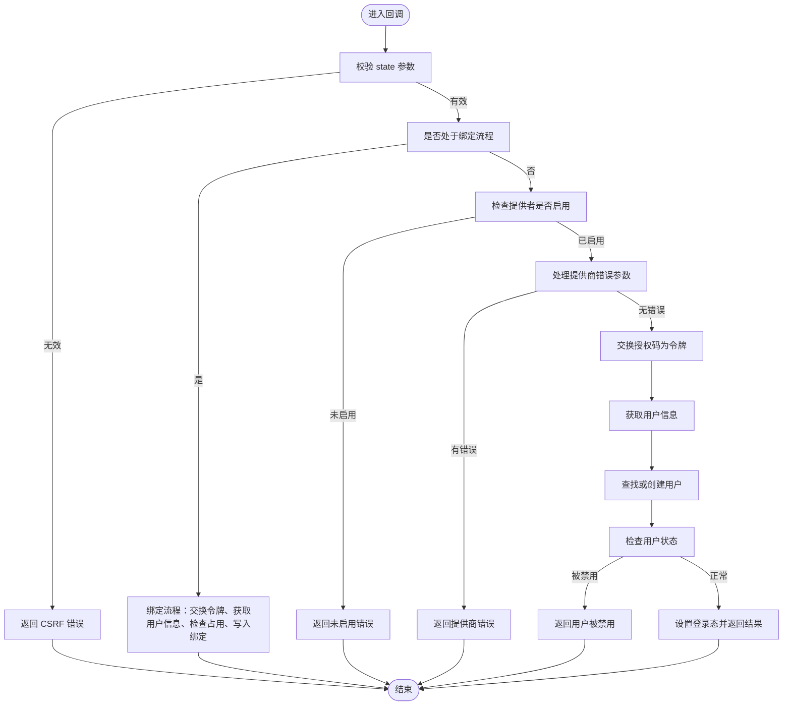
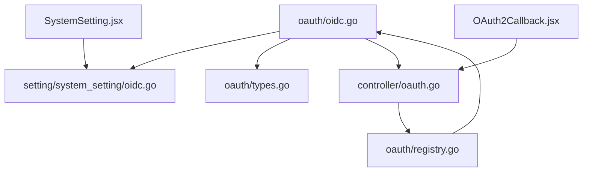

# OIDC 集成

<cite>
**本文档引用的文件**
- [oauth/oidc.go](file://oauth/oidc.go)
- [setting/system_setting/oidc.go](file://setting/system_setting/oidc.go)
- [controller/oauth.go](file://controller/oauth.go)
- [oauth/types.go](file://oauth/types.go)
- [oauth/provider.go](file://oauth/provider.go)
- [oauth/registry.go](file://oauth/registry.go)
- [web/src/components/settings/SystemSetting.jsx](file://web/src/components/settings/SystemSetting.jsx)
- [web/src/components/settings/CustomOAuthSetting.jsx](file://web/src/components/settings/CustomOAuthSetting.jsx)
- [web/src/components/auth/OAuth2Callback.jsx](file://web/src/components/auth/OAuth2Callback.jsx)
- [oauth/generic.go](file://oauth/generic.go)
</cite>

## 目录
1. [简介](#简介)
2. [项目结构](#项目结构)
3. [核心组件](#核心组件)
4. [架构总览](#架构总览)
5. [详细组件分析](#详细组件分析)
6. [依赖分析](#依赖分析)
7. [性能考量](#性能考量)
8. [故障排除指南](#故障排除指南)
9. [结论](#结论)
10. [附录](#附录)

## 简介
本文件面向 OIDC（OpenID Connect）集成，系统性说明协议工作原理、与 OAuth 2.0 的关系、提供商发现机制、ID Token 验证流程、通用 OIDC 提供商适配器实现与配置项，并提供完整集成示例、安全注意事项与常见提供商配置模板及故障排除建议。本文档基于仓库中的 OIDC 实现进行技术解读，帮助开发者快速完成对接。

## 项目结构
OIDC 集成涉及后端提供者实现、系统设置、控制器处理、前端回调与设置界面等模块。下图展示与 OIDC 相关的关键文件及其交互关系：

**图表来源**
- [web/src/components/settings/SystemSetting.jsx:508-581](file://web/src/components/settings/SystemSetting.jsx#L508-L581)
- [web/src/components/settings/CustomOAuthSetting.jsx:80-127](file://web/src/components/settings/CustomOAuthSetting.jsx#L80-L127)
- [web/src/components/auth/OAuth2Callback.jsx:33-102](file://web/src/components/auth/OAuth2Callback.jsx#L33-L102)
- [oauth/oidc.go:19-21](file://oauth/oidc.go#L19-L21)
- [controller/oauth.go:43-128](file://controller/oauth.go#L43-L128)
- [oauth/types.go:3-25](file://oauth/types.go#L3-L25)
- [oauth/registry.go:18-46](file://oauth/registry.go#L18-L46)
- [setting/system_setting/oidc.go:5-25](file://setting/system_setting/oidc.go#L5-L25)
- [oauth/generic.go:34-76](file://oauth/generic.go#L34-L76)

**章节来源**
- [oauth/oidc.go:19-21](file://oauth/oidc.go#L19-L21)
- [controller/oauth.go:43-128](file://controller/oauth.go#L43-L128)
- [oauth/types.go:3-25](file://oauth/types.go#L3-L25)
- [oauth/registry.go:18-46](file://oauth/registry.go#L18-L46)
- [setting/system_setting/oidc.go:5-25](file://setting/system_setting/oidc.go#L5-L25)
- [web/src/components/settings/SystemSetting.jsx:508-581](file://web/src/components/settings/SystemSetting.jsx#L508-L581)
- [web/src/components/settings/CustomOAuthSetting.jsx:80-127](file://web/src/components/settings/CustomOAuthSetting.jsx#L80-L127)
- [web/src/components/auth/OAuth2Callback.jsx:33-102](file://web/src/components/auth/OAuth2Callback.jsx#L33-L102)
- [oauth/generic.go:34-76](file://oauth/generic.go#L34-L76)

## 核心组件
- OIDC 提供者实现：负责交换授权码为访问令牌、拉取用户信息、用户 ID 冲突检测与填充、用户名前缀生成等。
- 统一 OAuth 控制器：负责回调参数校验（CSRF）、错误处理、用户查找/创建、登录态设置。
- 系统 OIDC 配置：集中管理启用开关、客户端凭据、Well-Known 发现地址以及各端点。
- 类型与接口：抽象出 Provider 接口、OAuthToken/OAuthUser 数据模型与错误类型。
- 注册中心：维护内置与自定义提供者的注册与查询。
- 前端设置与回调：支持通过 Well-Known 自动发现端点、手动填写端点、回调处理与登录态更新。

**章节来源**
- [oauth/oidc.go:23-178](file://oauth/oidc.go#L23-L178)
- [controller/oauth.go:43-128](file://controller/oauth.go#L43-L128)
- [setting/system_setting/oidc.go:5-25](file://setting/system_setting/oidc.go#L5-L25)
- [oauth/types.go:3-25](file://oauth/types.go#L3-L25)
- [oauth/provider.go:10-36](file://oauth/provider.go#L10-L36)
- [oauth/registry.go:18-46](file://oauth/registry.go#L18-L46)
- [web/src/components/settings/SystemSetting.jsx:508-581](file://web/src/components/settings/SystemSetting.jsx#L508-L581)
- [web/src/components/auth/OAuth2Callback.jsx:33-102](file://web/src/components/auth/OAuth2Callback.jsx#L33-L102)

## 架构总览
OIDC 集成遵循 OAuth 2.0 授权码流程，同时扩展了 ID Token 与用户信息端点，用于身份认证与用户资料获取。整体流程如下：

**图表来源**
- [controller/oauth.go:43-128](file://controller/oauth.go#L43-L128)
- [oauth/oidc.go:51-160](file://oauth/oidc.go#L51-L160)
- [setting/system_setting/oidc.go:5-25](file://setting/system_setting/oidc.go#L5-L25)
- [web/src/components/settings/SystemSetting.jsx:508-581](file://web/src/components/settings/SystemSetting.jsx#L508-L581)

## 详细组件分析

### OIDC 提供者实现
- 初始化注册：在包初始化时注册 OIDC 提供者名称。
- 令牌交换：构造 POST 请求，携带客户端凭据、授权码、重定向 URI、授权类型等，解析响应中的访问令牌、ID 令牌、过期时间与作用域。
- 用户信息获取：向 UserInfo 端点发起 Bearer 访问令牌请求，解析标准声明（sub、preferred_username、name、email），并校验关键字段非空。
- 用户 ID 冲突检测与填充：根据 ProviderUserID 查询用户是否存在；若存在则填充用户信息；否则在统一控制器中创建新用户。
- 用户名前缀：内置 OIDC 提供者使用“oidc_”作为用户名前缀，避免冲突。

**图表来源**
- [oauth/oidc.go:23-178](file://oauth/oidc.go#L23-L178)
- [oauth/provider.go:10-36](file://oauth/provider.go#L10-L36)
- [oauth/types.go:3-25](file://oauth/types.go#L3-L25)

**章节来源**
- [oauth/oidc.go:23-178](file://oauth/oidc.go#L23-L178)
- [oauth/types.go:3-25](file://oauth/types.go#L3-L25)
- [oauth/provider.go:10-36](file://oauth/provider.go#L10-L36)

### 统一 OAuth 回调处理
- 参数校验：校验 state 与会话中的 state 是否一致，防止 CSRF 攻击。
- 绑定流程：若当前已登录，走账户绑定流程，检查 ProviderUserID 是否已被占用。
- 启用检查：确保对应提供者已启用。
- 错误处理：对提供商返回的 error 参数进行处理，统一国际化消息。
- 用户查找/创建：优先按 ProviderUserID 查找；若不存在，按用户名/显示名/邮箱等策略创建新用户；支持事务保证原子性。
- 登录态设置：设置用户会话并返回前端登录结果。

**图表来源**
- [controller/oauth.go:43-128](file://controller/oauth.go#L43-L128)
- [controller/oauth.go:130-196](file://controller/oauth.go#L130-L196)
- [controller/oauth.go:198-331](file://controller/oauth.go#L198-L331)

**章节来源**
- [controller/oauth.go:43-128](file://controller/oauth.go#L43-L128)
- [controller/oauth.go:130-196](file://controller/oauth.go#L130-L196)
- [controller/oauth.go:198-331](file://controller/oauth.go#L198-L331)

### 系统 OIDC 配置
- 配置项：启用开关、客户端 ID/密钥、Well-Known 发现地址、授权端点、令牌端点、用户信息端点。
- 默认注册：通过全局配置管理器注册“oidc”键，便于前后端读取与更新。
- 前端发现：支持通过 Well-Known URL 自动填充授权、令牌、用户信息端点。

**章节来源**
- [setting/system_setting/oidc.go:5-25](file://setting/system_setting/oidc.go#L5-L25)
- [web/src/components/settings/SystemSetting.jsx:508-581](file://web/src/components/settings/SystemSetting.jsx#L508-L581)

### 前端设置与回调
- OIDC 设置页：支持输入 Well-Known URL 并自动发现端点；手动填写端点；保存配置。
- 回调处理：接收 code 与 state，调用后端统一回调接口，处理绑定或登录流程，更新本地用户状态。

**章节来源**
- [web/src/components/settings/SystemSetting.jsx:508-581](file://web/src/components/settings/SystemSetting.jsx#L508-L581)
- [web/src/components/auth/OAuth2Callback.jsx:33-102](file://web/src/components/auth/OAuth2Callback.jsx#L33-L102)

### 通用 OIDC 提供商适配器
- 适用场景：当需要对接非内置 OIDC 提供商或需灵活字段映射时，可使用通用 OAuth 提供者适配器。
- 关键能力：支持多种认证风格（参数/头部 Basic Auth）、自动解析 JSON/URL 编码响应、用户信息字段 JSONPath 映射、访问策略（条件/分组/运算符）与拒绝消息模板。
- 与 OIDC 的关系：通用适配器可复用 OIDC 的用户信息端点与 ID Token 字段映射逻辑，但更侧重于通用 OAuth 场景。

**章节来源**
- [oauth/generic.go:34-76](file://oauth/generic.go#L34-L76)
- [oauth/generic.go:90-200](file://oauth/generic.go#L90-L200)
- [oauth/generic.go:202-291](file://oauth/generic.go#L202-L291)
- [oauth/generic.go:333-452](file://oauth/generic.go#L333-L452)
- [oauth/generic.go:623-673](file://oauth/generic.go#L623-L673)

## 依赖分析
- OIDC 提供者依赖系统设置读取端点与凭据，依赖控制器进行统一回调处理。
- 注册中心维护提供者注册表，OIDC 提供者在初始化时注册。
- 类型模块为提供者与控制器提供统一的数据结构与错误类型。
- 前端设置与回调通过后端接口进行配置与登录态同步。

**图表来源**
- [oauth/oidc.go:51-160](file://oauth/oidc.go#L51-L160)
- [setting/system_setting/oidc.go:5-25](file://setting/system_setting/oidc.go#L5-L25)
- [oauth/types.go:3-25](file://oauth/types.go#L3-L25)
- [controller/oauth.go:43-128](file://controller/oauth.go#L43-L128)
- [oauth/registry.go:18-46](file://oauth/registry.go#L18-L46)
- [web/src/components/settings/SystemSetting.jsx:508-581](file://web/src/components/settings/SystemSetting.jsx#L508-L581)
- [web/src/components/auth/OAuth2Callback.jsx:33-102](file://web/src/components/auth/OAuth2Callback.jsx#L33-L102)

**章节来源**
- [oauth/oidc.go:51-160](file://oauth/oidc.go#L51-L160)
- [controller/oauth.go:43-128](file://controller/oauth.go#L43-L128)
- [oauth/registry.go:18-46](file://oauth/registry.go#L18-L46)

## 性能考量
- 超时控制：令牌交换与用户信息获取均设置了较短超时，避免阻塞请求。
- 日志与调试：在关键步骤输出调试日志，便于定位问题。
- 事务一致性：用户创建与绑定在事务中完成，保证数据一致性。
- 前端重试：回调处理具备有限重试与退避策略，提升弱网环境下的成功率。

**章节来源**
- [oauth/oidc.go:76-84](file://oauth/oidc.go#L76-L84)
- [oauth/oidc.go:123-131](file://oauth/oidc.go#L123-L131)
- [controller/oauth.go:272-328](file://controller/oauth.go#L272-L328)
- [web/src/components/auth/OAuth2Callback.jsx:45-82](file://web/src/components/auth/OAuth2Callback.jsx#L45-L82)

## 故障排除指南
- Well-Known 发现失败
  - 现象：填写 Well-Known URL 后无法自动填充端点。
  - 排查：确认 URL 以 http:// 或 https:// 开头；检查网络连通性与提供商可达性；查看前端错误提示。
  - 参考
    - [web/src/components/settings/SystemSetting.jsx:508-531](file://web/src/components/settings/SystemSetting.jsx#L508-L531)
- 回调参数缺失或非法
  - 现象：未获取到授权码或 state 不匹配。
  - 排查：确认重定向 URI 与提供商配置一致；检查会话中 state 是否存在且未过期。
  - 参考
    - [controller/oauth.go:57-65](file://controller/oauth.go#L57-L65)
- 令牌交换失败
  - 现象：提供商返回错误或空访问令牌。
  - 排查：核对客户端 ID/密钥；确认授权码未过期；检查端点可达性与鉴权风格。
  - 参考
    - [oauth/oidc.go:51-110](file://oauth/oidc.go#L51-L110)
- 用户信息获取失败
  - 现象：用户信息端点返回非 200 或缺少关键字段。
  - 排查：确认作用域包含 openid、profile、email；检查 UserInfo 端点配置；核对令牌权限。
  - 参考
    - [oauth/oidc.go:112-160](file://oauth/oidc.go#L112-L160)
- 用户被禁用或账户已删除
  - 现象：登录后被禁止或提示用户不存在。
  - 排查：检查用户状态与删除标记；必要时联系管理员。
  - 参考
    - [controller/oauth.go:120-124](file://controller/oauth.go#L120-L124)
- 绑定冲突
  - 现象：提示该 OIDC 用户 ID 已被绑定。
  - 排查：确认当前用户是否已绑定其他账户；清理历史绑定或更换账户。
  - 参考
    - [controller/oauth.go:152-163](file://controller/oauth.go#L152-L163)

## 结论
本项目提供了完整的 OIDC 集成方案：内置 OIDC 提供者、统一回调处理、系统级配置与前端发现能力。通过标准化的 Provider 接口与类型模型，既满足内置 OIDC 场景，又可通过通用适配器覆盖更多自定义 OAuth/ OIDC 提供商。结合完善的错误处理与前端回调机制，能够快速、安全地完成 OIDC 对接。

## 附录

### OIDC 协议与 OAuth 2.0 的关系
- OIDC 在 OAuth 2.0 授权框架之上增加了身份层，通过 ID Token 提供受信的身份信息，配合 UserInfo 端点获取标准化声明。
- OIDC 通常使用“openid”作用域，并要求授权端点、令牌端点、用户信息端点与 JWKS 端点（用于 ID Token 验证）。

### OIDC 提供商发现机制
- Well-Known 发现：通过“/.well-known/openid-configuration”返回授权端点、令牌端点、用户信息端点、作用域与声明等元数据。
- 前端自动发现：系统设置页支持输入 Well-Known URL 并自动填充端点。
- 参考
  - [web/src/components/settings/SystemSetting.jsx:508-531](file://web/src/components/settings/SystemSetting.jsx#L508-L531)

### JWKS 端点与 ID Token 验证
- JWKS（JSON Web Key Set）端点用于发布公钥，客户端可据此验证 ID Token 的签名。
- 当前 OIDC 提供者实现未直接展示 JWKS 获取与签名验证逻辑，但可通过扩展在令牌交换后对 ID Token 进行签名校验与声明解析。

### 通用 OIDC 提供商适配器实现要点
- 认证风格：支持参数传递与 Basic Auth 头两种方式，必要时可自动探测。
- 用户信息映射：通过 JSONPath（gjson）从用户信息响应中提取字段，支持数值与字符串转换。
- 访问策略：支持多条件与分组、多种比较运算符，拒绝时可渲染模板化消息。
- 参考
  - [oauth/generic.go:27-32](file://oauth/generic.go#L27-L32)
  - [oauth/generic.go:202-291](file://oauth/generic.go#L202-L291)
  - [oauth/generic.go:333-452](file://oauth/generic.go#L333-L452)
  - [oauth/generic.go:623-673](file://oauth/generic.go#L623-L673)

### OIDC 集成示例（配置文件与回调）
- 配置文件设置
  - 在系统设置中填写 OIDC 配置：启用开关、客户端 ID/密钥、Well-Known URL 或手动填写授权/令牌/用户信息端点。
  - 参考
    - [web/src/components/settings/SystemSetting.jsx:508-581](file://web/src/components/settings/SystemSetting.jsx#L508-L581)
- 回调处理
  - 前端回调组件接收 code 与 state，调用后端统一回调接口，处理绑定或登录流程。
  - 参考
    - [web/src/components/auth/OAuth2Callback.jsx:33-102](file://web/src/components/auth/OAuth2Callback.jsx#L33-L102)
    - [controller/oauth.go:43-128](file://controller/oauth.go#L43-L128)

### OIDC 特有安全考虑
- nonce 验证：在授权请求中生成并校验 nonce，防止重放攻击。
- 签名算法选择：优先使用 RS256 等强算法；避免使用不安全算法。
- 证书管理：确保证书链完整、域名匹配；定期轮换密钥与证书。
- 作用域最小化：仅请求必要的 openid、profile、email 等作用域。
- 参考
  - [oauth/oidc.go:51-110](file://oauth/oidc.go#L51-L110)
  - [oauth/oidc.go:112-160](file://oauth/oidc.go#L112-L160)

### 常见 OIDC 提供商配置模板
- Nextcloud、Keycloak、Authentik、ORY Hydra 等预设模板，包含授权端点、令牌端点、用户信息端点、默认作用域与字段映射。
- 参考
  - [web/src/components/settings/CustomOAuthSetting.jsx:80-127](file://web/src/components/settings/CustomOAuthSetting.jsx#L80-L127)