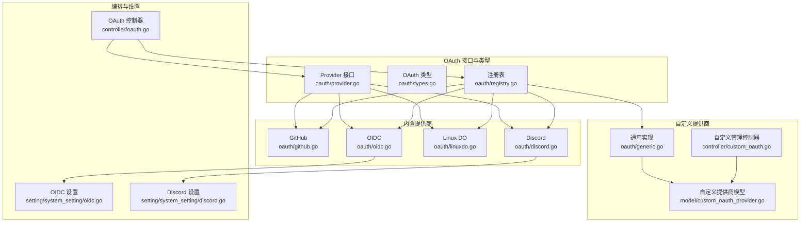
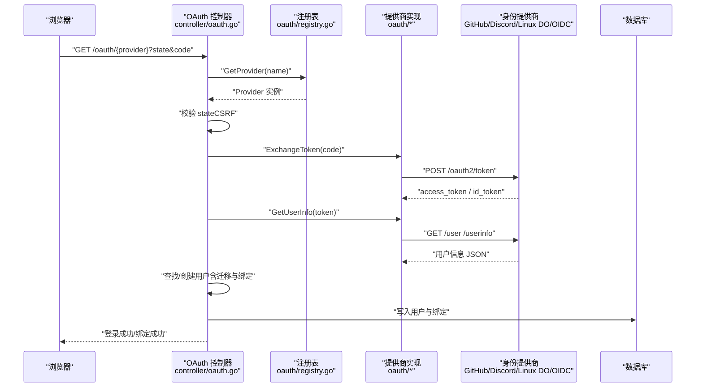
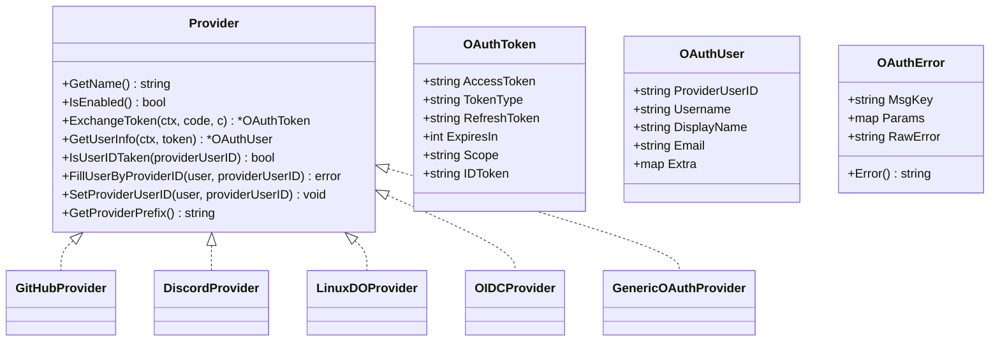
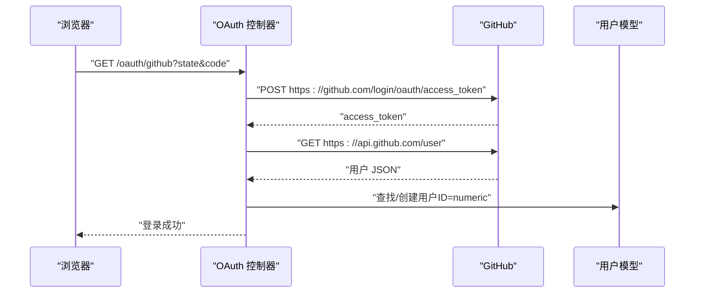
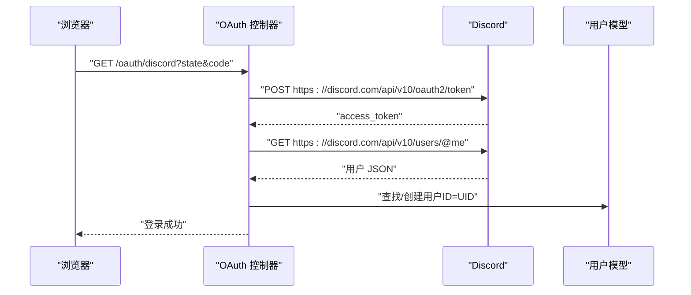
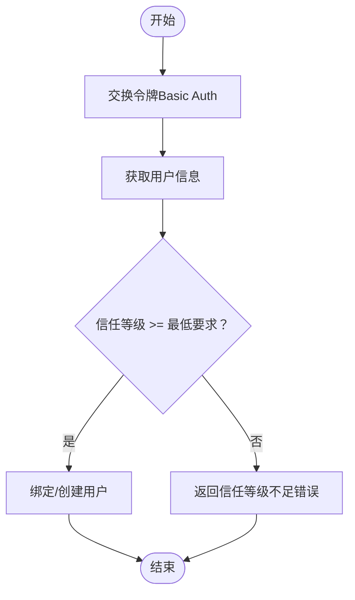
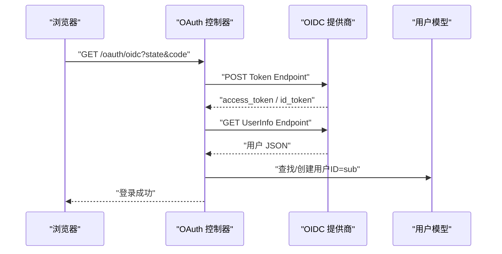
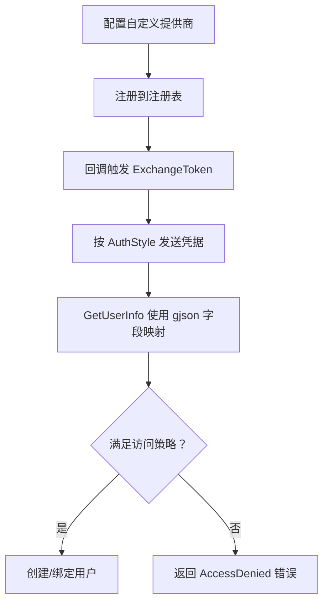
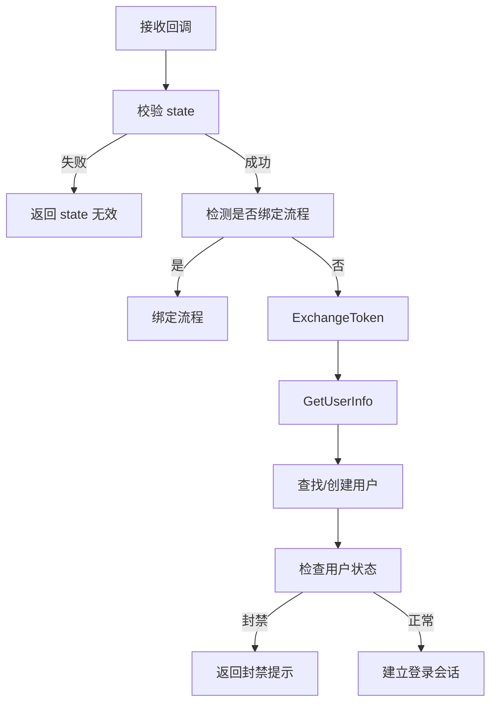
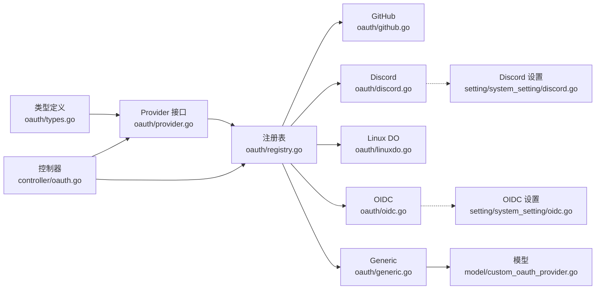

# 标准 OAuth 提供商

<cite>
**本文引用的文件**
- [oauth/provider.go](file://oauth/provider.go)
- [oauth/types.go](file://oauth/types.go)
- [oauth/registry.go](file://oauth/registry.go)
- [oauth/generic.go](file://oauth/generic.go)
- [oauth/github.go](file://oauth/github.go)
- [oauth/discord.go](file://oauth/discord.go)
- [oauth/linuxdo.go](file://oauth/linuxdo.go)
- [oauth/oidc.go](file://oauth/oidc.go)
- [controller/oauth.go](file://controller/oauth.go)
- [controller/custom_oauth.go](file://controller/custom_oauth.go)
- [model/custom_oauth_provider.go](file://model/custom_oauth_provider.go)
- [setting/system_setting/oidc.go](file://setting/system_setting/oidc.go)
- [setting/system_setting/discord.go](file://setting/system_setting/discord.go)
- [i18n/keys.go](file://i18n/keys.go)
- [i18n/locales/zh-CN.yaml](file://i18n/locales/zh-CN.yaml)
</cite>

## 目录
1. [简介](#简介)
2. [项目结构](#项目结构)
3. [核心组件](#核心组件)
4. [架构总览](#架构总览)
5. [详细组件分析](#详细组件分析)
6. [依赖分析](#依赖分析)
7. [性能考虑](#性能考虑)
8. [故障排除指南](#故障排除指南)
9. [结论](#结论)
10. [附录](#附录)

## 简介
本文件面向标准 OAuth 提供商集成，覆盖 GitHub、Discord、Linux DO、OIDC（通用）等主流 OAuth 提供商的实现细节。文档解释各提供商的授权流程差异、API 端点配置、用户信息获取方式、特有配置项、作用域与限制，并提供完整的配置示例与回调 URL 设置指南。同时给出认证流程图、错误处理策略、故障排除与性能优化建议。

## 项目结构
OAuth 子系统由“接口与类型定义”“具体提供商实现”“控制器编排”“自定义提供商管理”“系统设置与国际化”等模块组成，采用“接口抽象 + 具体实现 + 注册表”的设计，既支持内置提供商，也支持可动态加载的自定义提供商。

图表来源
- [oauth/provider.go:10-36](file://oauth/provider.go#L10-L36)
- [oauth/registry.go:18-46](file://oauth/registry.go#L18-L46)
- [oauth/github.go:24-46](file://oauth/github.go#L24-L46)
- [oauth/discord.go:23-47](file://oauth/discord.go#L23-L47)
- [oauth/linuxdo.go:25-43](file://oauth/linuxdo.go#L25-L43)
- [oauth/oidc.go:23-49](file://oauth/oidc.go#L23-L49)
- [oauth/generic.go:34-88](file://oauth/generic.go#L34-L88)
- [controller/oauth.go:43-128](file://controller/oauth.go#L43-L128)
- [controller/custom_oauth.go:72-112](file://controller/custom_oauth.go#L72-L112)
- [model/custom_oauth_provider.go:39-67](file://model/custom_oauth_provider.go#L39-L67)
- [setting/system_setting/oidc.go:5-25](file://setting/system_setting/oidc.go#L5-L25)
- [setting/system_setting/discord.go:5-21](file://setting/system_setting/discord.go#L5-L21)

章节来源
- [oauth/provider.go:10-36](file://oauth/provider.go#L10-L36)
- [oauth/registry.go:18-46](file://oauth/registry.go#L18-L46)
- [controller/oauth.go:43-128](file://controller/oauth.go#L43-L128)

## 核心组件
- Provider 接口：统一定义提供商能力（名称、启用状态、交换令牌、获取用户信息、用户 ID 绑定与填充、前缀等），确保内置与自定义提供商一致的行为契约。
- OAuth 类型：封装令牌、用户信息、可翻译错误等通用数据结构。
- 注册表：提供并发安全的提供商注册、查询、动态加载/卸载能力。
- 内置提供商：GitHub、Discord、Linux DO、OIDC 的具体实现，覆盖端点、鉴权风格、用户字段映射与访问控制。
- 自定义提供商：通过数据库配置与通用实现，支持任意 OAuth/OIDC 服务；提供发现、策略、字段映射与绑定管理。
- 控制器：编排 OAuth 回调流程、CSRF 校验、用户查找/创建、状态检查与登录会话建立。
- 设置与国际化：系统级 OIDC/Discord 开关与凭据；错误消息多语言支持。

章节来源
- [oauth/types.go:3-25](file://oauth/types.go#L3-L25)
- [oauth/registry.go:18-46](file://oauth/registry.go#L18-L46)
- [controller/oauth.go:43-128](file://controller/oauth.go#L43-L128)
- [i18n/keys.go:279-295](file://i18n/keys.go#L279-L295)

## 架构总览
下图展示从浏览器发起授权到完成登录的端到端流程，涵盖内置与自定义提供商的共性步骤与差异点。

图表来源
- [controller/oauth.go:43-128](file://controller/oauth.go#L43-L128)
- [oauth/registry.go:41-46](file://oauth/registry.go#L41-L46)
- [oauth/github.go:48-103](file://oauth/github.go#L48-L103)
- [oauth/discord.go:49-108](file://oauth/discord.go#L49-L108)
- [oauth/linuxdo.go:45-108](file://oauth/linuxdo.go#L45-L108)
- [oauth/oidc.go:51-110](file://oauth/oidc.go#L51-L110)

## 详细组件分析

### Provider 接口与类型
- Provider 接口：定义 GetName、IsEnabled、ExchangeToken、GetUserInfo、IsUserIDTaken、FillUserByProviderID、SetProviderUserID、GetProviderPrefix 等方法，保证不同提供商的一致行为。
- OAuth 类型：OAuthToken、OAuthUser、OAuthError、AccessDeniedError 等，用于标准化令牌、用户信息与错误处理。

图表来源
- [oauth/provider.go:10-36](file://oauth/provider.go#L10-L36)
- [oauth/types.go:3-25](file://oauth/types.go#L3-L25)

章节来源
- [oauth/provider.go:10-36](file://oauth/provider.go#L10-L36)
- [oauth/types.go:3-25](file://oauth/types.go#L3-L25)

### GitHub 集成
- 启用条件：通过全局开关判断是否启用。
- 授权端点：固定为平台地址。
- 令牌交换：向 GitHub 专用端点发送 JSON 负载，包含客户端凭据与授权码。
- 用户信息：调用 GitHub API 获取用户 JSON，字段包括 numeric ID、login、name、email。
- 用户 ID：使用 numeric ID 作为主键，兼容旧版 login 迁移逻辑。
- 特殊行为：支持“遗留 ID”检查以避免迁移期重复绑定。

图表来源
- [oauth/github.go:48-103](file://oauth/github.go#L48-L103)
- [oauth/github.go:105-161](file://oauth/github.go#L105-L161)

章节来源
- [oauth/github.go:44-46](file://oauth/github.go#L44-L46)
- [oauth/github.go:48-103](file://oauth/github.go#L48-L103)
- [oauth/github.go:105-161](file://oauth/github.go#L105-L161)

### Discord 集成
- 启用条件：读取系统设置中的开关与凭据。
- 授权端点：固定为平台地址。
- 令牌交换：使用表单编码，携带客户端凭据与授权码。
- 用户信息：调用 Discord API 获取用户 JSON，字段包括 UID、用户名、显示名。
- 特殊行为：使用系统设置中的 ClientId/ClientSecret 与 UserInfoEndpoint。

图表来源
- [oauth/discord.go:49-108](file://oauth/discord.go#L49-L108)
- [oauth/discord.go:110-155](file://oauth/discord.go#L110-L155)
- [setting/system_setting/discord.go:5-21](file://setting/system_setting/discord.go#L5-L21)

章节来源
- [oauth/discord.go:45-47](file://oauth/discord.go#L45-L47)
- [oauth/discord.go:49-108](file://oauth/discord.go#L49-L108)
- [oauth/discord.go:110-155](file://oauth/discord.go#L110-L155)
- [setting/system_setting/discord.go:18-21](file://setting/system_setting/discord.go#L18-L21)

### Linux DO 集成
- 启用条件：通过全局开关判断是否启用。
- 令牌交换：使用 Basic Auth，携带客户端凭据与授权码。
- 用户信息：调用 Linux DO 用户端点，返回用户 JSON，包含 trust_level、active、silenced 等字段。
- 访问控制：若信任等级低于阈值，拒绝访问并返回特定错误类型。
- 特殊行为：支持环境变量覆盖端点；信任等级不足时抛出 TrustLevelError。

图表来源
- [oauth/linuxdo.go:45-108](file://oauth/linuxdo.go#L45-L108)
- [oauth/linuxdo.go:110-167](file://oauth/linuxdo.go#L110-L167)

章节来源
- [oauth/linuxdo.go:41-43](file://oauth/linuxdo.go#L41-L43)
- [oauth/linuxdo.go:45-108](file://oauth/linuxdo.go#L45-L108)
- [oauth/linuxdo.go:110-167](file://oauth/linuxdo.go#L110-L167)

### OIDC 集成
- 启用条件：读取系统设置中的 OIDC 开关与端点。
- 令牌交换：使用表单编码，携带客户端凭据与授权码。
- 用户信息：调用 OIDC 用户信息端点，返回标准字段如 sub、email、name、preferred_username、picture。
- 特殊行为：使用系统设置中的 ClientId/ClientSecret 与 UserInfoEndpoint。

图表来源
- [oauth/oidc.go:51-110](file://oauth/oidc.go#L51-L110)
- [oauth/oidc.go:112-159](file://oauth/oidc.go#L112-L159)
- [setting/system_setting/oidc.go:5-25](file://setting/system_setting/oidc.go#L5-L25)

章节来源
- [oauth/oidc.go:47-49](file://oauth/oidc.go#L47-L49)
- [oauth/oidc.go:51-110](file://oauth/oidc.go#L51-L110)
- [oauth/oidc.go:112-159](file://oauth/oidc.go#L112-L159)
- [setting/system_setting/oidc.go:18-25](file://setting/system_setting/oidc.go#L18-L25)

### 自定义 OAuth 提供商（Generic）
- 适用场景：任意 OAuth/OIDC 服务，无需修改核心代码。
- 关键配置：授权端点、令牌端点、用户信息端点、作用域、鉴权风格（自动/参数/头）、字段映射（gjson 路径）、访问策略（JSON Policy）、拒绝提示模板。
- 访问策略：支持 and/or 逻辑、多种比较操作（eq/ne/gt/gte/lt/lte/in/not_in/contains/not_contains/exists/not_exists），可对用户信息进行条件判断。
- 用户绑定：内置提供商直接更新用户记录；自定义提供商通过 user_oauth_bindings 表进行绑定。
- 动态加载：从数据库加载配置，支持注册/更新/卸载。

图表来源
- [oauth/generic.go:90-200](file://oauth/generic.go#L90-L200)
- [oauth/generic.go:202-291](file://oauth/generic.go#L202-L291)
- [oauth/generic.go:333-452](file://oauth/generic.go#L333-L452)
- [controller/custom_oauth.go:213-267](file://controller/custom_oauth.go#L213-L267)
- [model/custom_oauth_provider.go:39-67](file://model/custom_oauth_provider.go#L39-L67)

章节来源
- [oauth/generic.go:34-88](file://oauth/generic.go#L34-L88)
- [oauth/generic.go:90-200](file://oauth/generic.go#L90-L200)
- [oauth/generic.go:202-291](file://oauth/generic.go#L202-L291)
- [oauth/generic.go:333-452](file://oauth/generic.go#L333-L452)
- [controller/custom_oauth.go:72-112](file://controller/custom_oauth.go#L72-L112)
- [controller/custom_oauth.go:213-267](file://controller/custom_oauth.go#L213-L267)
- [model/custom_oauth_provider.go:148-205](file://model/custom_oauth_provider.go#L148-L205)

### OAuth 控制器编排
- CSRF 保护：生成随机 state 并保存于会话，回调时比对。
- 绑定流程：若当前会话存在用户，则执行“绑定”而非“登录”，防止重复绑定。
- 用户查找/创建：优先按新 ID 查找；若失败且存在“遗留 ID”，尝试迁移；否则在允许注册时创建新用户。
- 状态检查：禁止被封禁用户登录。
- 错误处理：根据错误类型返回国际化消息或直接错误响应。

图表来源
- [controller/oauth.go:43-128](file://controller/oauth.go#L43-L128)
- [controller/oauth.go:198-331](file://controller/oauth.go#L198-L331)

章节来源
- [controller/oauth.go:43-128](file://controller/oauth.go#L43-L128)
- [controller/oauth.go:198-331](file://controller/oauth.go#L198-L331)

## 依赖分析
- Provider 接口与类型为所有提供商提供统一契约，降低耦合度。
- 注册表集中管理提供商实例，支持内置与自定义提供商混用。
- 内置提供商依赖系统设置（Discord/OIDC）或全局开关（GitHub/Linux DO）。
- 自定义提供商依赖数据库配置与通用实现，通过注册表动态生效。
- 控制器依赖 Provider 接口与注册表，实现流程编排与错误处理。

图表来源
- [oauth/types.go:3-25](file://oauth/types.go#L3-L25)
- [oauth/provider.go:10-36](file://oauth/provider.go#L10-L36)
- [oauth/registry.go:18-46](file://oauth/registry.go#L18-L46)
- [oauth/github.go:24-46](file://oauth/github.go#L24-L46)
- [oauth/discord.go:23-47](file://oauth/discord.go#L23-L47)
- [oauth/linuxdo.go:25-43](file://oauth/linuxdo.go#L25-L43)
- [oauth/oidc.go:23-49](file://oauth/oidc.go#L23-L49)
- [oauth/generic.go:34-88](file://oauth/generic.go#L34-L88)
- [model/custom_oauth_provider.go:39-67](file://model/custom_oauth_provider.go#L39-L67)
- [controller/oauth.go:43-128](file://controller/oauth.go#L43-L128)
- [setting/system_setting/discord.go:5-21](file://setting/system_setting/discord.go#L5-L21)
- [setting/system_setting/oidc.go:5-25](file://setting/system_setting/oidc.go#L5-L25)

章节来源
- [oauth/registry.go:18-46](file://oauth/registry.go#L18-L46)
- [controller/oauth.go:43-128](file://controller/oauth.go#L43-L128)

## 性能考虑
- 超时控制：内置提供商与通用实现均设置了合理的 HTTP 超时，避免阻塞。
- 日志与调试：在关键路径输出调试日志，便于定位问题但需注意生产环境日志级别。
- 访问策略评估：复杂策略可能带来 JSON 解析与路径遍历开销，建议简化策略或缓存必要数据。
- 数据库事务：用户创建与绑定在事务中完成，保证一致性，但需关注锁竞争与回滚成本。
- 缓存与限流：结合系统级限流与缓存策略，减少频繁第三方请求带来的压力。

## 故障排除指南
- 常见错误与提示
  - 无效授权码：检查回调参数是否正确传递。
  - 服务器连接失败：检查网络连通性与端点可达性。
  - 获取用户信息失败：确认用户信息端点与权限范围。
  - 用户信息为空：检查字段映射与作用域配置。
  - 信任等级不足（Linux DO）：提升用户信任等级或调整最低要求。
  - 提供商未启用：检查系统设置或自定义提供商启用状态。
  - 用户被封禁：联系管理员恢复。
- 定位方法
  - 查看控制器错误处理分支与国际化消息键。
  - 检查注册表是否正确注册提供商。
  - 核对系统设置与环境变量（Linux DO 端点）。
  - 对照内置与自定义实现的关键步骤进行逐项验证。

章节来源
- [i18n/keys.go:279-295](file://i18n/keys.go#L279-L295)
- [i18n/locales/zh-CN.yaml:235-249](file://i18n/locales/zh-CN.yaml#L235-L249)
- [controller/oauth.go:346-362](file://controller/oauth.go#L346-L362)
- [oauth/linuxdo.go:146-154](file://oauth/linuxdo.go#L146-L154)

## 结论
本系统通过 Provider 接口与注册表实现了对 GitHub、Discord、Linux DO、OIDC 与自定义 OAuth 提供商的统一支持。内置提供商聚焦典型平台特性，自定义提供商则通过灵活的端点、字段映射与访问策略适配更多场景。配合完善的错误处理与国际化消息，能够快速落地并稳定运行于生产环境。

## 附录

### 配置示例与回调 URL 设置指南
- GitHub
  - 授权端点：固定为平台地址
  - 令牌端点：固定为平台地址
  - 用户信息端点：固定为平台地址
  - 回调 URL：服务端地址 + /oauth/github
  - 作用域：按需配置（如公开信息）
- Discord
  - 授权端点：固定为平台地址
  - 令牌端点：固定为平台地址
  - 用户信息端点：固定为平台地址
  - 回调 URL：服务端地址 + /oauth/discord
  - 作用域：按需配置（如 identify、guilds）
- Linux DO
  - 令牌端点：可通过环境变量覆盖
  - 用户信息端点：可通过环境变量覆盖
  - 回调 URL：服务端地址 + /api/oauth/linuxdo
  - 作用域：按需配置（如 openid）
- OIDC
  - 授权端点：系统设置中的授权端点
  - 令牌端点：系统设置中的令牌端点
  - 用户信息端点：系统设置中的用户信息端点
  - 回调 URL：服务端地址 + /oauth/oidc
  - 作用域：系统设置中的作用域
- 自定义 OAuth
  - 授权端点、令牌端点、用户信息端点：自定义配置
  - 作用域：自定义配置
  - 鉴权风格：自动/参数/头
  - 字段映射：使用 gjson 路径
  - 访问策略：JSON Policy
  - 回调 URL：服务端地址 + /oauth/{slug}

章节来源
- [oauth/github.go:55-60](file://oauth/github.go#L55-L60)
- [oauth/discord.go:56-63](file://oauth/discord.go#L56-L63)
- [oauth/linuxdo.go:52-62](file://oauth/linuxdo.go#L52-L62)
- [oauth/oidc.go:58-65](file://oauth/oidc.go#L58-L65)
- [oauth/generic.go:97-101](file://oauth/generic.go#L97-L101)
- [controller/custom_oauth.go:213-267](file://controller/custom_oauth.go#L213-L267)