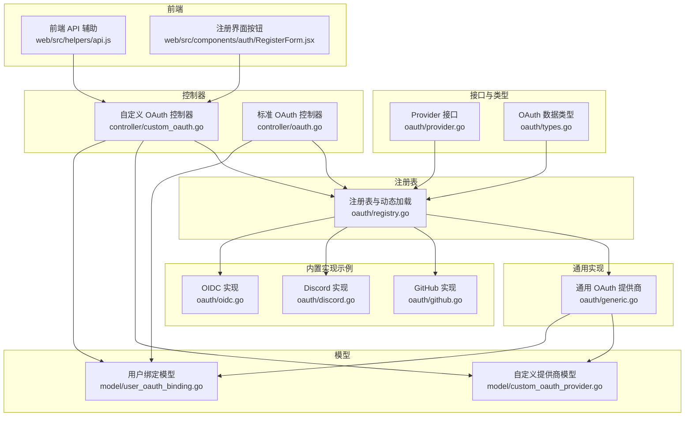
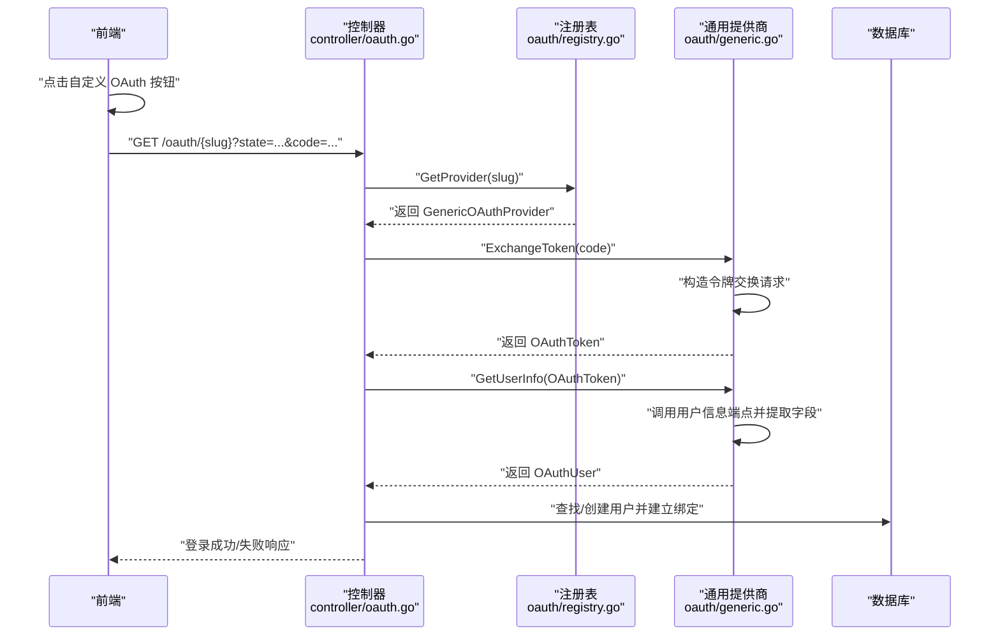
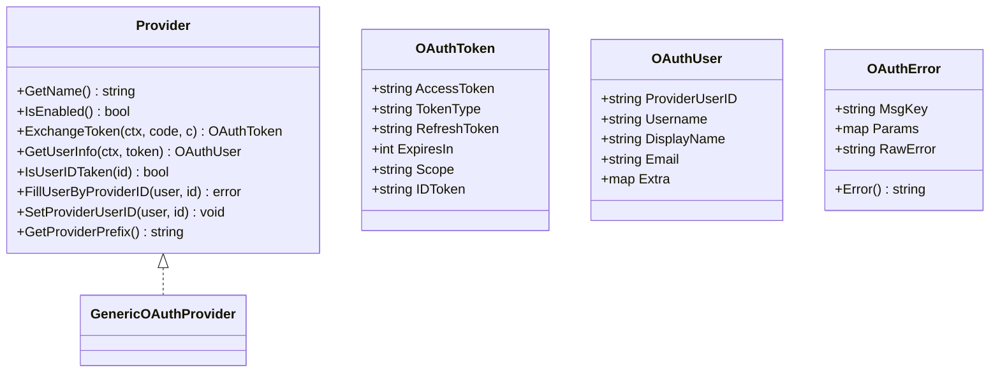
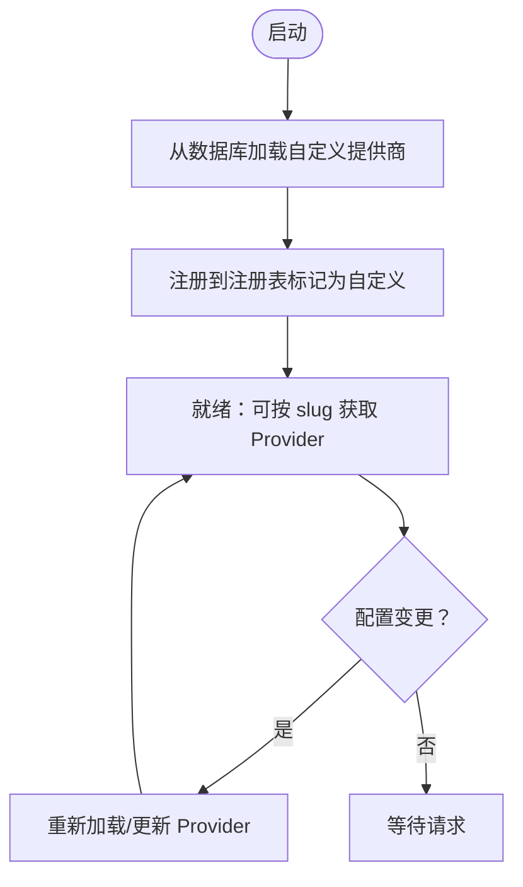
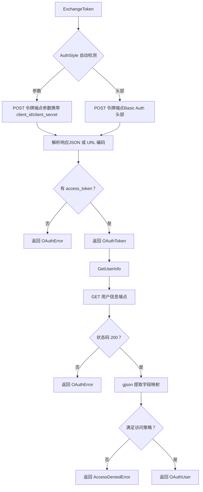
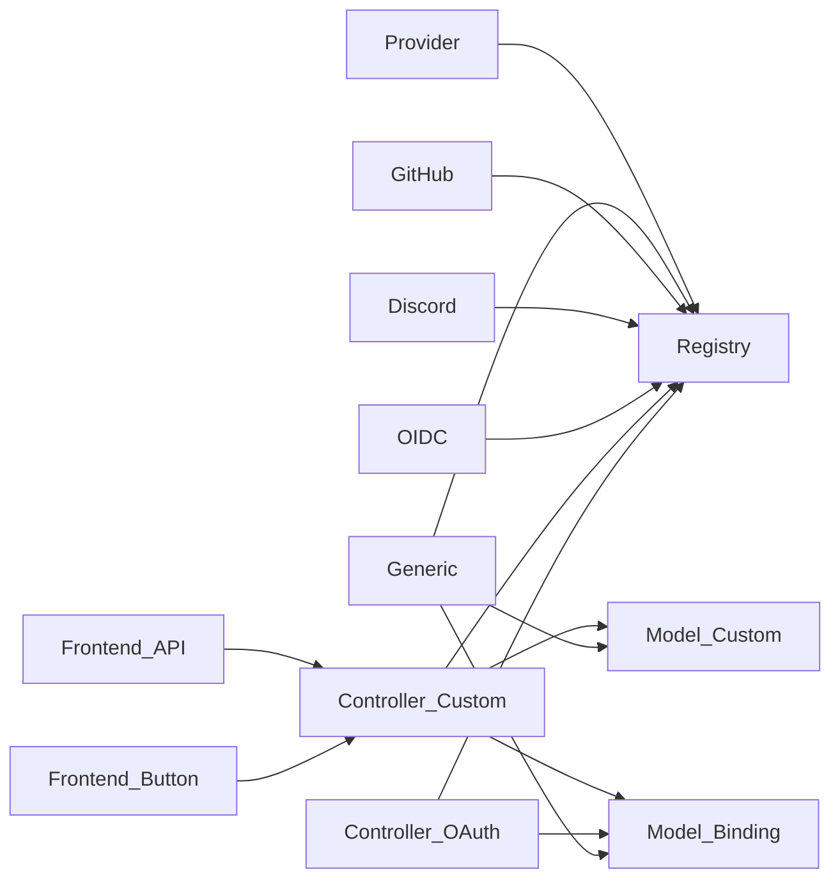

# 自定义 OAuth 扩展

<cite>
**本文档引用的文件**
- [oauth/provider.go](file://oauth/provider.go)
- [oauth/registry.go](file://oauth/registry.go)
- [oauth/types.go](file://oauth/types.go)
- [oauth/generic.go](file://oauth/generic.go)
- [oauth/github.go](file://oauth/github.go)
- [oauth/discord.go](file://oauth/discord.go)
- [oauth/oidc.go](file://oauth/oidc.go)
- [controller/custom_oauth.go](file://controller/custom_oauth.go)
- [controller/oauth.go](file://controller/oauth.go)
- [model/custom_oauth_provider.go](file://model/custom_oauth_provider.go)
- [model/user_oauth_binding.go](file://model/user_oauth_binding.go)
- [main.go](file://main.go)
- [web/src/helpers/api.js](file://web/src/helpers/api.js)
- [web/src/components/auth/RegisterForm.jsx](file://web/src/components/auth/RegisterForm.jsx)
</cite>

## 目录
1. [简介](#简介)
2. [项目结构](#项目结构)
3. [核心组件](#核心组件)
4. [架构总览](#架构总览)
5. [详细组件分析](#详细组件分析)
6. [依赖关系分析](#依赖关系分析)
7. [性能考量](#性能考量)
8. [故障排查指南](#故障排查指南)
9. [结论](#结论)
10. [附录](#附录)

## 简介
本技术文档面向需要在系统中注册与配置自定义 OAuth 提供商的开发者，涵盖从提供商注册流程、配置参数与校验规则，到提供商注册表工作机制与扩展点的完整说明。文档还提供自定义 OAuth 提供商的实现指南（接口实现、配置管理、测试策略）、部署与维护注意事项，并给出与现有系统集成与兼容性的建议。最后通过序列图与类图直观展示关键流程与数据结构。

## 项目结构
自定义 OAuth 扩展由以下模块协同工作：
- 接口与类型层：定义 Provider 接口、通用 OAuth 数据结构与错误类型
- 注册表层：集中管理内置与自定义 OAuth 提供商的注册、查询与动态加载
- 通用实现层：基于通用配置的 OAuth 实现，支持字段映射、访问控制策略与多种认证风格
- 控制器层：提供自定义提供商的增删改查、发现配置、用户绑定等 API
- 模型层：持久化自定义提供商配置与用户 OAuth 绑定关系
- 前端集成：前端发起授权跳转与回调处理

图表来源
- [oauth/provider.go:1-37](file://oauth/provider.go#L1-L37)
- [oauth/registry.go:1-135](file://oauth/registry.go#L1-L135)
- [oauth/generic.go:1-674](file://oauth/generic.go#L1-L674)
- [oauth/github.go:1-179](file://oauth/github.go#L1-L179)
- [oauth/discord.go:1-173](file://oauth/discord.go#L1-L173)
- [oauth/oidc.go:1-178](file://oauth/oidc.go#L1-L178)
- [controller/custom_oauth.go:1-585](file://controller/custom_oauth.go#L1-L585)
- [controller/oauth.go:1-363](file://controller/oauth.go#L1-L363)
- [model/custom_oauth_provider.go:1-248](file://model/custom_oauth_provider.go#L1-L248)
- [model/user_oauth_binding.go:1-148](file://model/user_oauth_binding.go#L1-L148)
- [web/src/helpers/api.js:332-368](file://web/src/helpers/api.js#L332-L368)
- [web/src/components/auth/RegisterForm.jsx:336-345](file://web/src/components/auth/RegisterForm.jsx#L336-L345)

章节来源
- [oauth/provider.go:1-37](file://oauth/provider.go#L1-L37)
- [oauth/registry.go:1-135](file://oauth/registry.go#L1-L135)
- [oauth/generic.go:1-674](file://oauth/generic.go#L1-L674)
- [controller/custom_oauth.go:1-585](file://controller/custom_oauth.go#L1-L585)
- [model/custom_oauth_provider.go:1-248](file://model/custom_oauth_provider.go#L1-L248)

## 核心组件
- Provider 接口：定义提供商名称、启用状态、令牌交换、用户信息获取、用户 ID 占用检测、按 ID 填充用户、设置提供商用户 ID、前缀生成等方法
- OAuth 数据类型：OAuthToken、OAuthUser、OAuthError、AccessDeniedError 等
- 注册表：提供注册、注销、查询、批量获取、动态加载自定义提供商等功能
- 通用 OAuth 提供商：基于数据库配置的通用实现，支持字段映射、访问策略、认证风格自动检测
- 控制器：提供自定义提供商的 CRUD、发现配置、用户绑定查询与解绑等 API
- 模型：存储自定义提供商配置与用户绑定关系，并进行配置校验与访问策略验证
- 前端：负责发起授权跳转与回调处理

章节来源
- [oauth/provider.go:10-36](file://oauth/provider.go#L10-L36)
- [oauth/types.go:3-69](file://oauth/types.go#L3-L69)
- [oauth/registry.go:18-87](file://oauth/registry.go#L18-L87)
- [oauth/generic.go:34-331](file://oauth/generic.go#L34-L331)
- [controller/custom_oauth.go:72-442](file://controller/custom_oauth.go#L72-L442)
- [model/custom_oauth_provider.go:39-205](file://model/custom_oauth_provider.go#L39-L205)
- [model/user_oauth_binding.go:10-148](file://model/user_oauth_binding.go#L10-L148)

## 架构总览
自定义 OAuth 的核心流程如下：
- 启动时加载内置提供商并在包初始化函数中注册
- 启动时从数据库加载自定义提供商并注册到注册表
- 前端点击“自定义 OAuth”按钮，构造授权 URL 并跳转
- 用户授权后回调至 /oauth/{slug}，控制器调用对应 Provider 完成令牌交换与用户信息获取
- 根据是否已存在用户或是否允许新用户注册，决定登录或创建用户并建立绑定关系

图表来源
- [controller/oauth.go:43-128](file://controller/oauth.go#L43-L128)
- [oauth/registry.go:41-46](file://oauth/registry.go#L41-L46)
- [oauth/generic.go:90-200](file://oauth/generic.go#L90-L200)
- [oauth/generic.go:202-291](file://oauth/generic.go#L202-L291)

## 详细组件分析

### Provider 接口与数据类型
- Provider 接口：统一抽象不同 OAuth 提供商的行为，便于注册表集中管理
- OAuth 数据类型：标准化令牌、用户信息与错误表示，便于控制器与通用实现共享

图表来源
- [oauth/provider.go:10-36](file://oauth/provider.go#L10-L36)
- [oauth/types.go:3-69](file://oauth/types.go#L3-L69)
- [oauth/generic.go:34-331](file://oauth/generic.go#L34-L331)

章节来源
- [oauth/provider.go:10-36](file://oauth/provider.go#L10-L36)
- [oauth/types.go:3-69](file://oauth/types.go#L3-L69)

### 注册表与动态加载
- 注册表提供线程安全的注册、查询、注销与批量获取能力
- 支持区分内置与自定义提供商，动态加载自定义提供商并可热更新
- 提供获取启用的自定义提供商列表，用于前端展示

图表来源
- [oauth/registry.go:89-115](file://oauth/registry.go#L89-L115)
- [oauth/registry.go:122-129](file://oauth/registry.go#L122-L129)

章节来源
- [oauth/registry.go:18-87](file://oauth/registry.go#L18-L87)
- [oauth/registry.go:89-135](file://oauth/registry.go#L89-L135)

### 通用 OAuth 提供商实现
- 令牌交换：支持三种认证风格（自动、参数、头部），自动检测并选择合适风格
- 用户信息获取：通过用户信息端点获取数据，使用 JSONPath 风格字段映射提取用户 ID、用户名、显示名、邮箱
- 访问策略：支持复杂条件与分组，支持多操作符（等于、不等、范围、包含、存在等）
- 错误处理：统一转换为 OAuthError 或 AccessDeniedError，便于控制器国际化输出

图表来源
- [oauth/generic.go:90-200](file://oauth/generic.go#L90-L200)
- [oauth/generic.go:202-291](file://oauth/generic.go#L202-L291)
- [oauth/generic.go:333-452](file://oauth/generic.go#L333-L452)

章节来源
- [oauth/generic.go:27-331](file://oauth/generic.go#L27-L331)
- [oauth/generic.go:333-674](file://oauth/generic.go#L333-L674)

### 内置 OAuth 提供商对比
- GitHub：使用固定端点与 JSON 请求，返回数值型用户 ID 作为唯一标识
- Discord：使用表单编码与固定端点，返回用户 UID、用户名与显示名
- OIDC：使用系统设置中的端点与客户端凭据，返回 OpenID、用户名、显示名与邮箱

章节来源
- [oauth/github.go:24-179](file://oauth/github.go#L24-L179)
- [oauth/discord.go:23-173](file://oauth/discord.go#L23-L173)
- [oauth/oidc.go:23-178](file://oauth/oidc.go#L23-L178)

### 控制器：自定义 OAuth 提供商管理
- 列表与详情：返回自定义提供商配置（排除敏感字段）
- 创建：校验 slug 冲突与内置提供商冲突，保存配置并注册到注册表
- 更新：支持部分字段更新，必要时迁移 slug 并重新注册
- 删除：检查用户绑定数量，避免破坏性删除
- 发现配置：通过后端请求 OIDC 发现文档，避免 CORS 限制
- 用户绑定：查询当前用户或管理员视角下的绑定情况，支持解绑

章节来源
- [controller/custom_oauth.go:72-442](file://controller/custom_oauth.go#L72-L442)

### 控制器：标准 OAuth 流程
- 生成 state 用于 CSRF 保护
- 回调处理：校验 state、错误参数、提供商启用状态
- 令牌交换与用户信息获取：调用 Provider 接口
- 查找或创建用户：根据是否允许注册与是否已有绑定决定行为
- 绑定流程：自定义提供商写入 user_oauth_bindings 表，内置提供商直接更新用户记录
- 错误处理：统一转换为国际化消息或用户可见提示

章节来源
- [controller/oauth.go:22-363](file://controller/oauth.go#L22-L363)

### 模型：自定义提供商与用户绑定
- 自定义提供商模型：存储提供商配置、字段映射、访问策略与认证风格
- 配置校验：必填项校验、slug 规范、访问策略 JSON 结构与语义校验
- 用户绑定模型：确保一个用户对一个提供商仅绑定一次，一个 OAuth 账户对一个提供商仅绑定一次

章节来源
- [model/custom_oauth_provider.go:39-205](file://model/custom_oauth_provider.go#L39-L205)
- [model/user_oauth_binding.go:10-148](file://model/user_oauth_binding.go#L10-L148)

### 前端集成
- 前端辅助：构造授权 URL，要求 authorization_endpoint 必须为完整 URL
- 注册界面：提供自定义 OAuth 按钮，触发授权流程

章节来源
- [web/src/helpers/api.js:332-368](file://web/src/helpers/api.js#L332-L368)
- [web/src/components/auth/RegisterForm.jsx:336-345](file://web/src/components/auth/RegisterForm.jsx#L336-L345)

## 依赖关系分析
- Provider 接口与注册表：注册表持有 Provider 实例映射，支持按名称检索
- 通用实现与模型：通用提供商读取自定义提供商配置并持久化，同时依赖用户绑定模型完成绑定
- 控制器与注册表：控制器通过注册表获取 Provider 并调用其方法
- 前端与控制器：前端通过 /oauth/{slug} 回调与控制器交互

图表来源
- [oauth/registry.go:18-87](file://oauth/registry.go#L18-L87)
- [oauth/generic.go:34-331](file://oauth/generic.go#L34-L331)
- [controller/custom_oauth.go:72-442](file://controller/custom_oauth.go#L72-L442)
- [controller/oauth.go:43-128](file://controller/oauth.go#L43-L128)
- [model/custom_oauth_provider.go:39-205](file://model/custom_oauth_provider.go#L39-L205)
- [model/user_oauth_binding.go:10-148](file://model/user_oauth_binding.go#L10-L148)
- [web/src/helpers/api.js:332-368](file://web/src/helpers/api.js#L332-L368)
- [web/src/components/auth/RegisterForm.jsx:336-345](file://web/src/components/auth/RegisterForm.jsx#L336-L345)

## 性能考量
- 注册表采用读写锁保证并发安全，避免频繁重建注册表
- 通用提供商在令牌交换与用户信息获取阶段设置合理超时，防止阻塞
- 访问策略评估使用 gjson 进行路径提取，尽量减少不必要的字符串处理
- 建议在高并发场景下：
  - 将令牌交换与用户信息端点调用置于独立限流策略之下
  - 对访问策略复杂的提供商开启缓存策略（如用户信息缓存）
  - 使用连接池与合理的超时配置

## 故障排查指南
- 授权失败：检查 authorization_endpoint 是否为完整 URL；确认 redirect_uri 与提供商配置一致
- 令牌交换失败：查看日志中的错误码与错误描述，确认 client_id/client_secret 与认证风格
- 用户信息为空：检查 UserInfoEndpoint 返回格式与字段映射配置
- 访问策略拒绝：根据 AccessDeniedError 中的字段与期望值定位策略问题
- 用户绑定冲突：确认同一 OAuth 账户未被其他用户绑定

章节来源
- [oauth/generic.go:90-200](file://oauth/generic.go#L90-L200)
- [oauth/generic.go:202-291](file://oauth/generic.go#L202-L291)
- [oauth/generic.go:401-452](file://oauth/generic.go#L401-L452)
- [model/user_oauth_binding.go:56-105](file://model/user_oauth_binding.go#L56-L105)

## 结论
自定义 OAuth 扩展通过 Provider 接口与注册表实现了高度可插拔的架构，通用实现提供了灵活的字段映射与访问策略能力，配合完善的控制器与模型，能够快速集成新的 OAuth 提供商。前端通过统一的授权流程与回调处理，简化了用户体验。建议在生产环境中结合限流、缓存与可观测性策略，确保稳定与高性能。

## 附录

### 自定义 OAuth 提供商实现指南
- 实现 Provider 接口：至少实现 GetName、IsEnabled、ExchangeToken、GetUserInfo、IsUserIDTaken、FillUserByProviderID、SetProviderUserID、GetProviderPrefix
- 在包初始化函数中注册内置提供商
- 通过控制器创建/更新自定义提供商配置，确保 slug 唯一且不与内置提供商冲突
- 配置字段映射与访问策略，确保用户信息端点返回结构与映射一致
- 前端按钮触发授权流程，回调至 /oauth/{slug}

章节来源
- [oauth/provider.go:10-36](file://oauth/provider.go#L10-L36)
- [oauth/registry.go:18-46](file://oauth/registry.go#L18-L46)
- [controller/custom_oauth.go:213-267](file://controller/custom_oauth.go#L213-L267)
- [web/src/helpers/api.js:332-368](file://web/src/helpers/api.js#L332-L368)

### 配置参数与校验规则
- 必填项：名称、slug、client_id、授权端点、令牌端点、用户信息端点
- slug 规范：小写字母、数字与连字符组合
- 字段映射默认值：sub、preferred_username、name、email
- 访问策略：支持逻辑与条件，需为合法 JSON 结构并通过语义校验

章节来源
- [model/custom_oauth_provider.go:148-205](file://model/custom_oauth_provider.go#L148-L205)

### 部署与维护注意事项
- 启动时加载自定义提供商：确保数据库中配置正确
- 热更新：通过控制器更新配置后重新注册，不影响在线服务
- 删除前检查：确保无用户绑定，避免破坏性操作
- 日志与监控：关注令牌交换与用户信息获取阶段的日志，及时发现异常

章节来源
- [oauth/registry.go:89-135](file://oauth/registry.go#L89-L135)
- [controller/custom_oauth.go:402-442](file://controller/custom_oauth.go#L402-L442)

### 与现有系统的集成与兼容性
- 内置提供商与自定义提供商共享同一控制器与模型层，保持一致的登录与绑定体验
- 访问策略与错误处理机制对内置与自定义提供商透明
- 前端授权流程对自定义提供商透明，仅需正确配置 authorization_endpoint 与 client_id

章节来源
- [controller/oauth.go:43-128](file://controller/oauth.go#L43-L128)
- [oauth/generic.go:34-331](file://oauth/generic.go#L34-L331)
- [web/src/helpers/api.js:332-368](file://web/src/helpers/api.js#L332-L368)