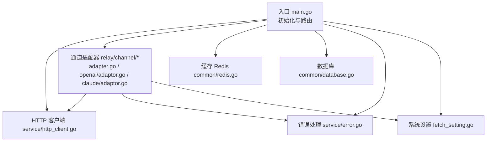
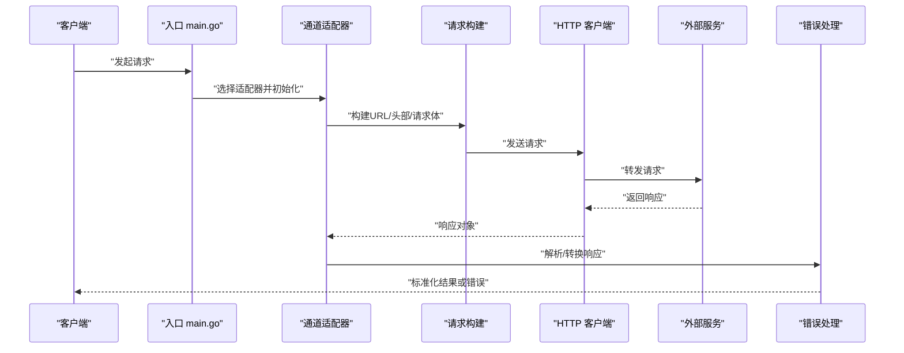
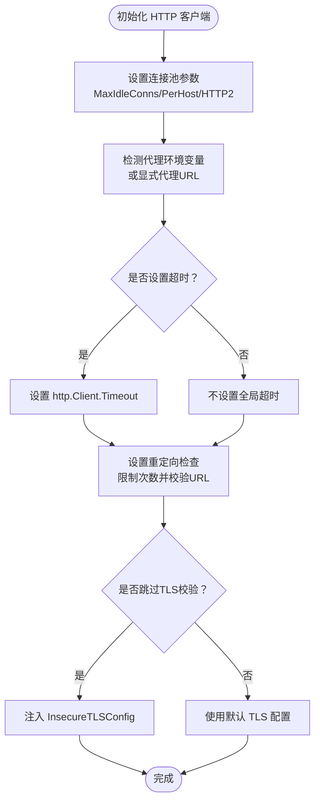
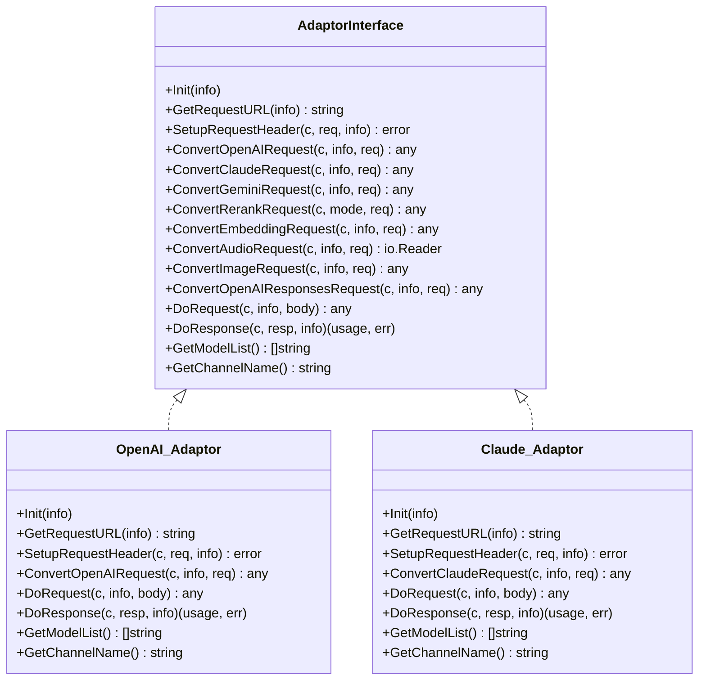
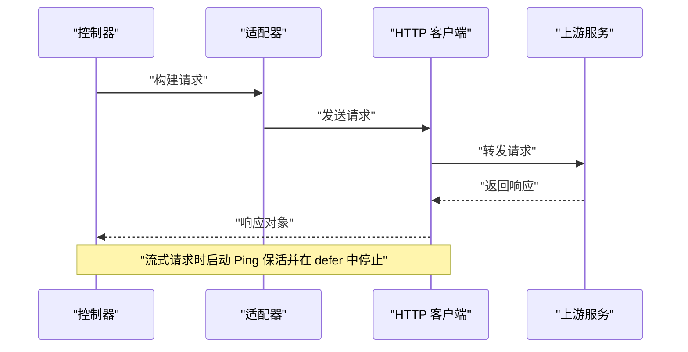
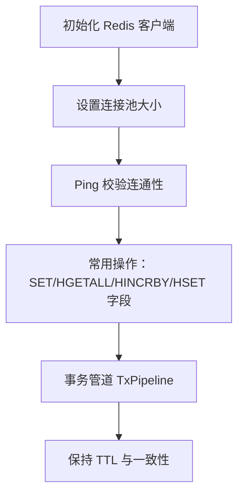
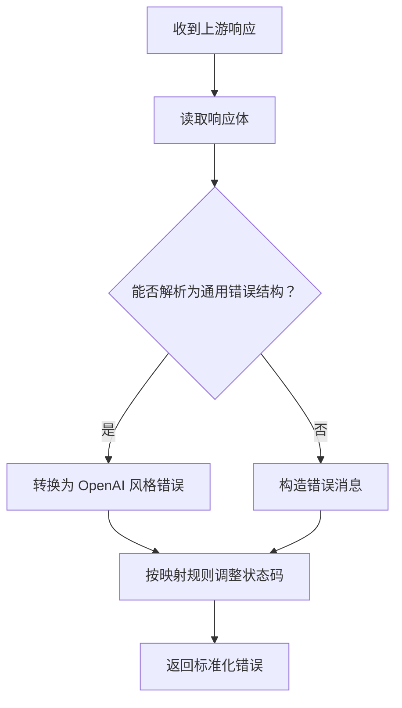
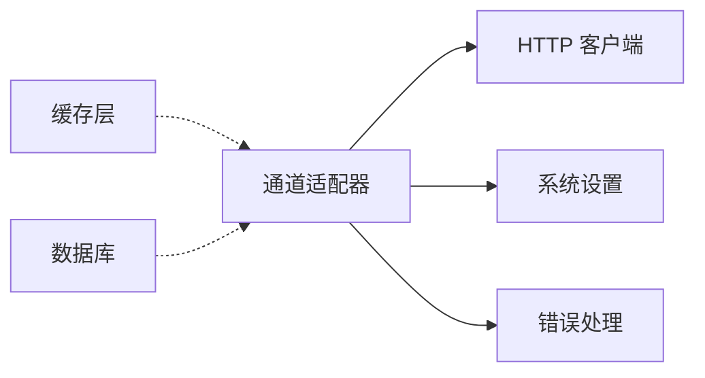

# 外部 API 集成

<cite>
**本文引用的文件**
- [main.go](file://main.go)
- [http_client.go](file://service/http_client.go)
- [adapter.go](file://relay/channel/adapter.go)
- [api_request.go](file://relay/channel/api_request.go)
- [redis.go](file://common/redis.go)
- [database.go](file://common/database.go)
- [error.go](file://service/error.go)
- [env.go](file://common/env.go)
- [constants.go](file://common/constants.go)
- [fetch_setting.go](file://setting/system_setting/fetch_setting.go)
- [adaptor.go（OpenAI 通道）](file://relay/channel/openai/adaptor.go)
- [adaptor.go（Claude 通道）](file://relay/channel/claude/adaptor.go)
- [BT.md](file://docs/installation/BT.md)
</cite>

## 目录
1. [简介](#简介)
2. [项目结构](#项目结构)
3. [核心组件](#核心组件)
4. [架构总览](#架构总览)
5. [详细组件分析](#详细组件分析)
6. [依赖分析](#依赖分析)
7. [性能考量](#性能考量)
8. [故障排查指南](#故障排查指南)
9. [结论](#结论)
10. [附录](#附录)

## 简介
本文件面向外部 API 集成系统，系统通过统一的适配器模式对接多家外部服务（如 OpenAI、Claude、Gemini 等），提供 HTTP 客户端配置、连接池与超时管理、代理与 SSL/TLS 安全、请求头透传与覆盖、流式与非流式响应处理、任务型请求的轮询与计费对齐、以及基于 Redis 的缓存与一致性保障。本文同时给出外部服务配置示例、错误处理与降级策略、性能监控与日志调试方法。

## 项目结构
围绕“外部 API 集成”的关键模块分布如下：
- 入口与初始化：main.go 负责加载环境变量、初始化 HTTP 客户端、数据库与 Redis、国际化与 OAuth 提供商等。
- 通道适配层：relay/channel/* 提供各外部服务的适配器接口与具体实现，负责请求构建、头部处理、请求与响应转换。
- 通用 HTTP 客户端：service/http_client.go 统一管理 http.Client、连接池、超时、代理（HTTP/SOCKS5）、SSRF 校验。
- 缓存与数据库：common/redis.go 提供 Redis 访问封装；common/database.go 描述数据库类型常量与路径。
- 错误处理：service/error.go 提供统一错误包装、状态码映射与本地化错误。
- 系统设置：setting/system_setting/fetch_setting.go 提供 SSRF 与域名/IP/端口白/黑名单等安全策略。
- 配置与常量：common/constants.go、common/env.go 提供超时、连接池、TLS 跳过校验等运行时配置项。

图表来源
- [main.go:242-316](file://main.go#L242-L316)
- [http_client.go:36-59](file://service/http_client.go#L36-L59)
- [adapter.go:15-32](file://relay/channel/adapter.go#L15-L32)
- [adaptor.go（OpenAI 通道）:111-187](file://relay/channel/openai/adaptor.go#L111-L187)
- [adaptor.go（Claude 通道）:44-71](file://relay/channel/claude/adaptor.go#L44-L71)
- [redis.go:24-54](file://common/redis.go#L24-L54)
- [database.go:3-16](file://common/database.go#L3-L16)
- [error.go:86-129](file://service/error.go#L86-L129)
- [fetch_setting.go:5-35](file://setting/system_setting/fetch_setting.go#L5-L35)

章节来源
- [main.go:242-316](file://main.go#L242-L316)
- [http_client.go:36-59](file://service/http_client.go#L36-L59)
- [adapter.go:15-32](file://relay/channel/adapter.go#L15-L32)
- [redis.go:24-54](file://common/redis.go#L24-L54)
- [database.go:3-16](file://common/database.go#L3-L16)
- [error.go:86-129](file://service/error.go#L86-L129)
- [fetch_setting.go:5-35](file://setting/system_setting/fetch_setting.go#L5-L35)

## 核心组件
- HTTP 客户端与连接池
  - 默认 http.Client，支持 MaxIdleConns、MaxIdleConnsPerHost、HTTP/2、环境代理、超时与重定向检查。
  - 支持按代理 URL 动态创建客户端并缓存，支持 HTTP/HTTPS 与 SOCKS5 代理。
  - 支持 TLS 跳过校验（开发/测试场景）。
- 通道适配器
  - 统一接口：Init、GetRequestURL、SetupRequestHeader、Convert*Request、DoRequest、DoResponse、GetModelList、GetChannelName。
  - OpenAI/Claude/Gemini 等通道适配器实现具体协议差异与头部处理。
- 请求执行与流式处理
  - DoApiRequest/DoFormRequest/DoWssRequest 统一封装不同内容类型的请求。
  - 流式请求支持 Ping 保活与超时保护。
- 错误处理与状态码映射
  - RelayErrorHandler 解析上游错误响应，支持本地化与敏感信息脱敏。
  - 支持将错误映射为指定 HTTP 状态码。
- 缓存与一致性
  - Redis 封装：SET/HGETALL/HINCRBY/HSET 字段等，支持事务管道与 TTL 保持。
  - 与内存缓存/通道缓存配合，保证读写一致性与过期策略。
- 安全与 SSRF
  - FetchSetting 提供域名/IP 白/黑名单、端口范围、SSRF 开关等。
  - 重定向检查与 URL 校验，阻止私网访问与不安全目标。

章节来源
- [http_client.go:36-169](file://service/http_client.go#L36-L169)
- [adapter.go:15-32](file://relay/channel/adapter.go#L15-L32)
- [api_request.go:290-555](file://relay/channel/api_request.go#L290-L555)
- [error.go:86-129](file://service/error.go#L86-L129)
- [redis.go:64-327](file://common/redis.go#L64-L327)
- [fetch_setting.go:5-35](file://setting/system_setting/fetch_setting.go#L5-L35)

## 架构总览
下图展示了从入口到外部服务的关键交互流程，包括 HTTP 客户端、通道适配器、错误处理与缓存。

图表来源
- [main.go:242-316](file://main.go#L242-L316)
- [adapter.go:15-32](file://relay/channel/adapter.go#L15-L32)
- [api_request.go:290-555](file://relay/channel/api_request.go#L290-L555)
- [error.go:86-129](file://service/error.go#L86-L129)

## 详细组件分析

### HTTP 客户端与连接池管理
- 连接池参数
  - MaxIdleConns、MaxIdleConnsPerHost、ForceAttemptHTTP2 由运行时常量控制。
- 超时与重定向
  - 若 RelayTimeout 为 0 则无全局超时；否则设置 http.Client.Timeout。
  - 自定义 CheckRedirect，限制最大重定向次数，并结合 FetchSetting 进行 SSRF 校验。
- 代理支持
  - 支持 HTTP/HTTPS 代理与 SOCKS5/socks5h 代理，自动解析认证信息。
  - 按代理 URL 缓存客户端实例，避免重复创建。
- TLS 与安全
  - 支持 TLSInsecureSkipVerify，便于开发环境快速验证。
- 环境变量与默认值
  - RelayTimeout、RelayMaxIdleConns、RelayMaxIdleConnsPerHost、TLSInsecureSkipVerify 等来自运行时常量与环境。

图表来源
- [http_client.go:36-59](file://service/http_client.go#L36-L59)
- [http_client.go:85-169](file://service/http_client.go#L85-L169)
- [constants.go:127-131](file://common/constants.go#L127-L131)
- [constants.go:77-78](file://common/constants.go#L77-L78)

章节来源
- [http_client.go:36-169](file://service/http_client.go#L36-L169)
- [constants.go:127-131](file://common/constants.go#L127-L131)
- [constants.go:77-78](file://common/constants.go#L77-L78)

### 通道适配器与调用模式
- 接口职责
  - Init：初始化通道类型与特性（如思维内容透传）。
  - GetRequestURL：根据通道类型与模式拼接最终请求 URL。
  - SetupRequestHeader：设置鉴权与业务相关头部（如 Authorization、Anthropic-Version、OpenAI-Organization）。
  - Convert*Request：将统一请求转换为上游期望格式（OpenAI/Claude/Gemini/Rerank/Embedding/Audio/Image）。
  - DoRequest/DoResponse：执行请求与响应处理（含流式与非流式）。
  - GetModelList/GetChannelName：模型列表与通道标识。
- OpenAI 通道示例
  - Azure 部署路径、Responses API、实时模式、Reasoning/Effort 适配。
  - 头部处理：Azure 使用 api-key，OpenAI 支持 Organization，实时模式使用 Sec-WebSocket-Protocol。
- Claude 通道示例
  - 消息接口 /v1/messages，支持 anthropic-beta 与 anthropic-version。
  - 透传与模型设置钩子。

图表来源
- [adapter.go:15-32](file://relay/channel/adapter.go#L15-L32)
- [adaptor.go（OpenAI 通道）:37-40](file://relay/channel/openai/adaptor.go#L37-L40)
- [adaptor.go（OpenAI 通道）:98-109](file://relay/channel/openai/adaptor.go#L98-L109)
- [adaptor.go（OpenAI 通道）:111-187](file://relay/channel/openai/adaptor.go#L111-L187)
- [adaptor.go（Claude 通道）:19-21](file://relay/channel/claude/adaptor.go#L19-L21)
- [adaptor.go（Claude 通道）:44-71](file://relay/channel/claude/adaptor.go#L44-L71)

章节来源
- [adapter.go:15-32](file://relay/channel/adapter.go#L15-L32)
- [adaptor.go（OpenAI 通道）:111-187](file://relay/channel/openai/adaptor.go#L111-L187)
- [adaptor.go（Claude 通道）:44-71](file://relay/channel/claude/adaptor.go#L44-L71)

### 请求执行与流式处理
- DoApiRequest/DoFormRequest/DoWssRequest
  - 统一构造请求、应用 Header Override（用户设置优先级高于默认），随后调用 doRequest。
- doRequest
  - 优先使用通道设置的 Proxy；否则使用默认 http.Client。
  - 流式请求设置 SSE 头并启动 Ping 保活（受全局设置与禁用标志控制），并在 defer 中确保停止。
- 流式 Ping 保活
  - 周期性发送心跳，带超时与最大运行时长保护，避免 goroutine 泄漏。

图表来源
- [api_request.go:290-555](file://relay/channel/api_request.go#L290-L555)
- [api_request.go:486-530](file://relay/channel/api_request.go#L486-L530)
- [api_request.go:384-481](file://relay/channel/api_request.go#L384-L481)

章节来源
- [api_request.go:290-555](file://relay/channel/api_request.go#L290-L555)
- [api_request.go:486-530](file://relay/channel/api_request.go#L486-L530)
- [api_request.go:384-481](file://relay/channel/api_request.go#L384-L481)

### 缓存策略与数据一致性
- Redis 初始化
  - 从环境变量解析连接串，设置连接池大小，Ping 成功后启用。
- 常用操作
  - RedisSet/RedisGet/RedisDel：键值操作。
  - RedisHSetObj/RedisHGetObj：结构体序列化/反序列化为哈希字段。
  - RedisIncr/RedisHIncrBy/RedisHSetField：原子增量与字段更新，同时保持 TTL。
- 事务与管道
  - 使用 TxPipeline 执行多命令，保证一致性与原子性。
- 与内存缓存协同
  - 通过同步频率与内存缓存开关协调，保证热数据一致性。

图表来源
- [redis.go:24-54](file://common/redis.go#L24-L54)
- [redis.go:64-327](file://common/redis.go#L64-L327)

章节来源
- [redis.go:24-54](file://common/redis.go#L24-L54)
- [redis.go:64-327](file://common/redis.go#L64-L327)

### 错误处理与降级策略
- RelayErrorHandler
  - 读取响应体，尝试解析为通用错误结构；若为对象则转为 OpenAI 风格错误。
  - 支持在失败时显示原始 Body 或仅记录状态码。
- 状态码映射
  - 支持将特定上游状态码映射为下游期望状态码，便于前端统一处理。
- 本地化与脱敏
  - 对网络类错误进行本地化描述与敏感信息脱敏，避免泄露内部细节。

图表来源
- [error.go:86-129](file://service/error.go#L86-L129)
- [error.go:131-183](file://service/error.go#L131-L183)

章节来源
- [error.go:86-129](file://service/error.go#L86-L129)
- [error.go:131-183](file://service/error.go#L131-L183)

### 外部服务配置示例
- 代理设置
  - HTTP/HTTPS 代理：通过环境变量 HTTP_PROXY/HTTPS_PROXY/NO_PROXY 生效；或在通道设置中显式指定 Proxy。
  - SOCKS5/socks5h 代理：支持用户名/密码认证，自动解析代理 URL 并创建拨号器。
- SSL 证书与 TLS
  - 开发环境可启用 TLSInsecureSkipVerify 跳过校验；生产环境建议使用受信证书。
- 认证方式
  - OpenAI：Authorization: Bearer <api_key>；Azure：api-key；Claude：x-api-key。
- SSRF 与域名/IP 白/黑名单
  - 通过 FetchSetting 控制是否启用 SSRF 保护、允许私网、域名/IP 过滤模式、允许端口范围等。

章节来源
- [http_client.go:41-45](file://service/http_client.go#L41-L45)
- [http_client.go:106-168](file://service/http_client.go#L106-L168)
- [adaptor.go（OpenAI 通道）:189-241](file://relay/channel/openai/adaptor.go#L189-L241)
- [adaptor.go（Claude 通道）:82-92](file://relay/channel/claude/adaptor.go#L82-L92)
- [fetch_setting.go:5-35](file://setting/system_setting/fetch_setting.go#L5-L35)

## 依赖分析
- 组件耦合
  - 通道适配器依赖 HTTP 客户端与系统设置；错误处理与日志贯穿请求生命周期。
  - 缓存层与通道层解耦，通过统一接口访问。
- 外部依赖
  - Go 标准库 net/http、golang.org/x/net/proxy、github.com/go-redis/redis/v8。
- 循环依赖规避
  - 通过函数工厂（如 GetTaskAdaptorFunc）延迟绑定，避免服务层与通道层直接循环导入。

图表来源
- [main.go:115-122](file://main.go#L115-L122)
- [adapter.go:15-32](file://relay/channel/adapter.go#L15-L32)
- [http_client.go:36-59](file://service/http_client.go#L36-L59)
- [error.go:86-129](file://service/error.go#L86-L129)

章节来源
- [main.go:115-122](file://main.go#L115-L122)
- [adapter.go:15-32](file://relay/channel/adapter.go#L15-L32)
- [http_client.go:36-59](file://service/http_client.go#L36-L59)
- [error.go:86-129](file://service/error.go#L86-L129)

## 性能考量
- 连接池与 HTTP/2
  - 合理设置 MaxIdleConns 与 MaxIdleConnsPerHost，提升并发复用率。
  - ForceAttemptHTTP2 降低握手开销，提高吞吐。
- 超时与重定向
  - 明确设置 RelayTimeout，避免请求悬挂；限制重定向次数，防止链路劫持。
- 流式请求保活
  - Ping 保活周期与超时需平衡用户体验与资源占用。
- 缓存命中率
  - Redis 连接池大小与过期策略影响读写性能；事务管道减少往返。

## 故障排查指南
- 网络异常与超时
  - 检查 RelayTimeout、代理配置与网络连通性；查看重定向日志与 SSRF 校验结果。
- 服务不可用
  - 观察上游状态码映射与错误响应体；必要时启用本地错误描述与敏感信息脱敏。
- 缓存一致性问题
  - 确认 Redis 连接串与池大小；检查 TTL 保持与事务执行情况。
- 日志与调试
  - 启用 Debug 模式与 pprof（通过环境变量 ENABLE_PPROF）；结合请求 ID 追踪链路。

章节来源
- [http_client.go:24-34](file://service/http_client.go#L24-L34)
- [error.go:86-129](file://service/error.go#L86-L129)
- [redis.go:24-54](file://common/redis.go#L24-L54)
- [main.go:141-147](file://main.go#L141-L147)

## 结论
该外部 API 集成体系以适配器为核心，结合统一的 HTTP 客户端、连接池与超时管理、代理与安全策略、错误处理与降级、以及 Redis 缓存与一致性保障，实现了对多家外部服务的稳定接入与高效运行。通过合理的配置与监控手段，可在保证性能的同时提升可用性与可观测性。

## 附录
- 环境变量与部署参考
  - 宝塔面板部署与环境变量配置可参考安装文档。
- 常用配置要点
  - 代理：HTTP_PROXY/HTTPS_PROXY/NO_PROXY 或通道 Proxy。
  - Redis：REDIS_CONN_STRING、REDIS_POOL_SIZE。
  - 超时：RELAY_TIMEOUT、RELAY_MAX_IDLE_CONNS、RELAY_MAX_IDLE_CONNS_PER_HOST。
  - 安全：ENABLE_SSFR_PROTECTION、ALLOW_PRIVATE_IP、DOMAIN_LIST、IP_LIST、ALLOWED_PORTS。

章节来源
- [BT.md:83-91](file://docs/installation/BT.md#L83-L91)
- [constants.go:127-131](file://common/constants.go#L127-L131)
- [constants.go:29-33](file://common/constants.go#L29-L33)