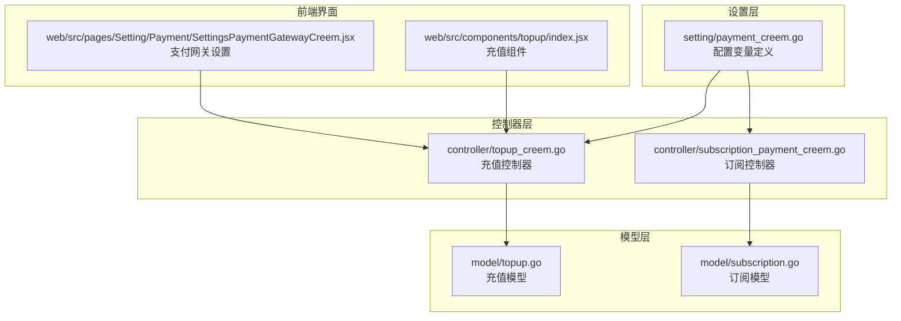
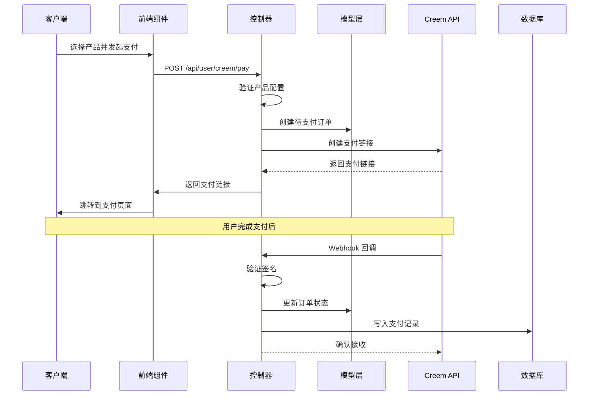
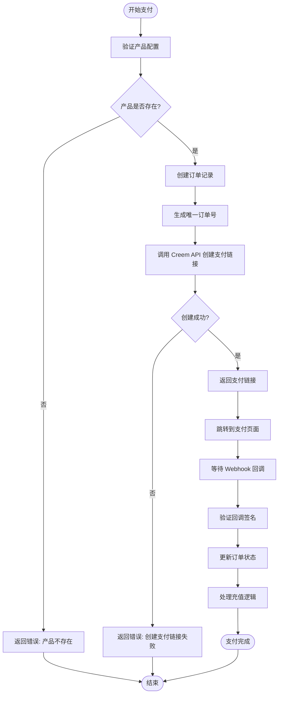
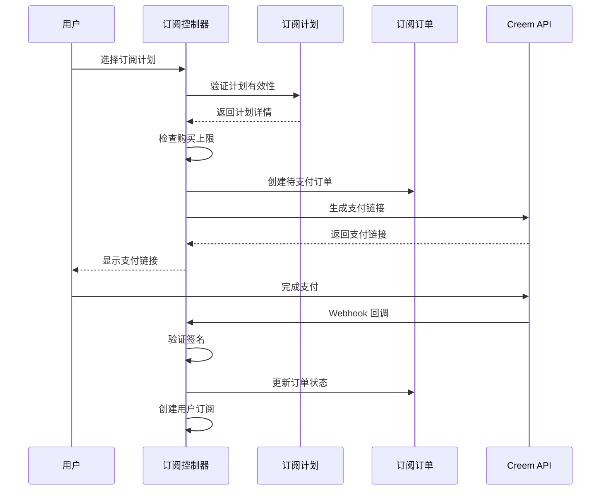
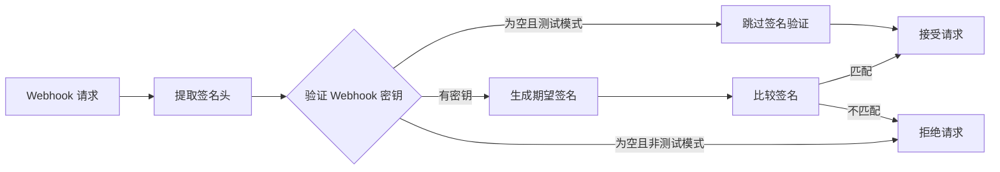
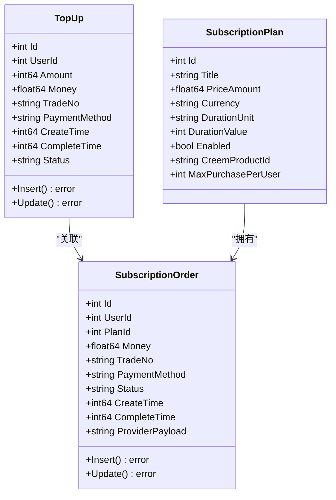
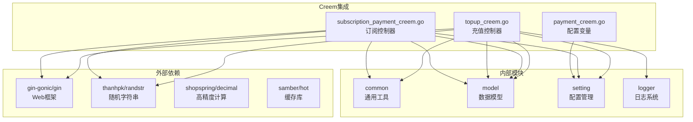
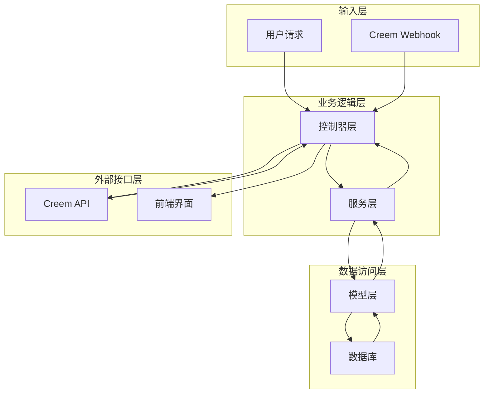

# Creem 支付集成

<cite>
**本文档引用的文件**
- [payment_creem.go](file://setting/payment_creem.go)
- [topup_creem.go](file://controller/topup_creem.go)
- [subscription_payment_creem.go](file://controller/subscription_payment_creem.go)
- [SettingsPaymentGatewayCreem.jsx](file://web/src/pages/Setting/Payment/SettingsPaymentGatewayCreem.jsx)
- [index.jsx](file://web/src/components/topup/index.jsx)
- [topup.go](file://controller/topup.go)
- [subscription.go](file://model/subscription.go)
- [topup.go](file://model/topup.go)
</cite>

## 目录
1. [简介](#简介)
2. [项目结构](#项目结构)
3. [核心组件](#核心组件)
4. [架构概览](#架构概览)
5. [详细组件分析](#详细组件分析)
6. [依赖关系分析](#依赖关系分析)
7. [性能考虑](#性能考虑)
8. [故障排除指南](#故障排除指南)
9. [结论](#结论)
10. [附录](#附录)

## 简介

Creem 是一个基于 Go 语言开发的支付网关集成模块，支持通过 Creem 平台进行在线充值和订阅支付。该系统提供了完整的支付流程，包括产品配置、支付页面集成、回调处理和订单状态管理。

本系统集成了以下主要功能：
- 支持多种货币（USD、EUR）
- HMAC-SHA256 签名验证
- 测试模式支持
- 订单状态跟踪
- 防重放攻击机制
- 完整的错误处理和日志记录

## 项目结构

Creem 支付集成在项目中的组织结构如下：



**图表来源**
- [payment_creem.go:1-7](file://setting/payment_creem.go#L1-L7)
- [topup_creem.go:1-50](file://controller/topup_creem.go#L1-L50)
- [subscription_payment_creem.go:1-30](file://controller/subscription_payment_creem.go#L1-L30)

**章节来源**
- [payment_creem.go:1-7](file://setting/payment_creem.go#L1-L7)
- [topup_creem.go:1-50](file://controller/topup_creem.go#L1-L50)
- [subscription_payment_creem.go:1-30](file://controller/subscription_payment_creem.go#L1-L30)

## 核心组件

### 配置管理组件

系统使用全局变量管理 Creem 支付配置：

| 配置项 | 类型 | 描述 | 默认值 |
|--------|------|------|--------|
| CreemApiKey | string | API 密钥 | "" |
| CreemProducts | string | 产品配置 JSON | "[]" |
| CreemTestMode | bool | 测试模式开关 | false |
| CreemWebhookSecret | string | Webhook 密钥 | "" |

### 支付控制器组件

系统包含两个主要的支付控制器：

1. **充值控制器** (`topup_creem.go`)
   - 处理一次性充值请求
   - 生成支付链接
   - 处理 Webhook 回调

2. **订阅控制器** (`subscription_payment_creem.go`)
   - 处理订阅计划购买
   - 管理订阅订单生命周期
   - 支持购买上限控制

### 前端集成组件

- **支付网关设置界面** (`SettingsPaymentGatewayCreem.jsx`)
  - 提供 Creem 配置界面
  - 支持产品配置管理
  - 实时配置验证

- **充值组件** (`index.jsx`)
  - 前端充值入口
  - 支付流程引导
  - 错误处理和反馈

**章节来源**
- [payment_creem.go:3-6](file://setting/payment_creem.go#L3-L6)
- [topup_creem.go:23-28](file://controller/topup_creem.go#L23-L28)
- [subscription_payment_creem.go:17-19](file://controller/subscription_payment_creem.go#L17-L19)

## 架构概览

Creem 支付系统的整体架构采用分层设计，确保了良好的可维护性和扩展性：



**图表来源**
- [topup_creem.go:68-144](file://controller/topup_creem.go#L68-L144)
- [topup_creem.go:232-284](file://controller/topup_creem.go#L232-L284)

## 详细组件分析

### 支付流程组件

#### 充值支付流程



**图表来源**
- [topup_creem.go:68-144](file://controller/topup_creem.go#L68-L144)
- [topup_creem.go:286-366](file://controller/topup_creem.go#L286-L366)

#### 订阅支付流程



**图表来源**
- [subscription_payment_creem.go:21-129](file://controller/subscription_payment_creem.go#L21-L129)

### 安全机制组件

#### 签名验证机制

系统实现了完整的 HMAC-SHA256 签名验证机制：



**图表来源**
- [topup_creem.go:37-50](file://controller/topup_creem.go#L37-L50)

#### 防重放攻击机制

系统通过以下方式防止重放攻击：

1. **订单锁定机制**：使用 `LockOrder` 和 `UnlockOrder` 函数确保同一订单的并发处理
2. **订单状态检查**：验证订单状态是否为待支付
3. **请求 ID 验证**：使用 `request_id` 字段确保请求的唯一性

**章节来源**
- [topup_creem.go:304-305](file://controller/topup_creem.go#L304-L305)
- [topup_creem.go:338-342](file://controller/topup_creem.go#L338-L342)

### 数据模型组件

#### 订单数据模型



**图表来源**
- [topup.go:14-24](file://model/topup.go#L14-L24)
- [subscription.go:195-208](file://model/subscription.go#L195-L208)
- [subscription.go:145-180](file://model/subscription.go#L145-L180)

**章节来源**
- [topup.go:14-24](file://model/topup.go#L14-L24)
- [subscription.go:195-208](file://model/subscription.go#L195-L208)
- [subscription.go:145-180](file://model/subscription.go#L145-L180)

## 依赖关系分析

### 组件依赖图



**图表来源**
- [topup_creem.go:3-21](file://controller/topup_creem.go#L3-L21)
- [subscription_payment_creem.go:3-15](file://controller/subscription_payment_creem.go#L3-L15)

### 数据流依赖

系统中的数据流向体现了清晰的职责分离：



**图表来源**
- [topup_creem.go:68-144](file://controller/topup_creem.go#L68-L144)
- [subscription_payment_creem.go:21-129](file://controller/subscription_payment_creem.go#L21-L129)

**章节来源**
- [topup_creem.go:3-21](file://controller/topup_creem.go#L3-L21)
- [subscription_payment_creem.go:3-15](file://controller/subscription_payment_creem.go#L3-L15)

## 性能考虑

### 缓存策略

系统实现了多层次的缓存机制：

1. **订阅计划缓存**：使用 `cachex.HybridCache` 实现内存和 Redis 双层缓存
2. **缓存 TTL 管理**：支持动态配置缓存过期时间
3. **缓存容量控制**：限制内存缓存大小，避免内存溢出

### 并发处理

- **订单锁定**：使用 `LockOrder`/`UnlockOrder` 确保订单处理的原子性
- **并发安全**：所有数据库操作都在事务中执行
- **资源清理**：及时释放 HTTP 连接和数据库连接

### 异步处理

- **Webhook 处理**：异步处理支付回调，避免阻塞主请求线程
- **超时控制**：对外部 API 调用设置合理的超时时间
- **重试机制**：对临时性错误提供有限的重试机会

## 故障排除指南

### 常见问题诊断

#### 支付链接创建失败

**可能原因**：
1. API 密钥未正确配置
2. 产品配置无效
3. 网络连接问题

**解决方案**：
1. 检查 `CreemApiKey` 配置
2. 验证产品配置 JSON 格式
3. 确认网络连通性

#### Webhook 签名验证失败

**可能原因**：
1. Webhook 密钥配置错误
2. 请求被中间件修改
3. 时间同步问题

**解决方案**：
1. 重新生成并配置 Webhook 密钥
2. 检查代理服务器配置
3. 同步系统时间

#### 订单状态异常

**可能原因**：
1. 并发处理冲突
2. 数据库连接问题
3. 缓存不同步

**解决方案**：
1. 检查订单锁定机制
2. 重启数据库连接池
3. 清理相关缓存

### 日志分析

系统提供了详细的日志记录：

- **请求日志**：记录所有 API 请求的详细信息
- **错误日志**：捕获和记录所有异常情况
- **调试日志**：在测试模式下输出敏感信息

**章节来源**
- [topup_creem.go:38-46](file://controller/topup_creem.go#L38-L46)
- [topup_creem.go:246-252](file://controller/topup_creem.go#L246-L252)

## 结论

Creem 支付集成系统提供了完整的支付解决方案，具有以下优势：

1. **安全性**：实现了多重安全保护机制，包括签名验证、防重放攻击等
2. **可靠性**：具备完善的错误处理和恢复机制
3. **可扩展性**：模块化设计便于功能扩展和维护
4. **易用性**：提供了直观的配置界面和清晰的错误提示

该系统适合需要集成 Creem 支付功能的应用场景，能够满足大多数在线支付需求。

## 附录

### 配置示例

#### 基础配置

```yaml
# API 配置
CreemApiKey: "your_api_key_here"
CreemWebhookSecret: "your_webhook_secret_here"

# 功能配置
CreemTestMode: false
CreemProducts: "[{productId: 'prod_example', name: 'Basic Plan', price: 4.99, quota: 10000, currency: 'USD'}]"
```

#### 产品配置格式

```json
[
  {
    "productId": "prod_6I8rBerHpPxyoiU9WK4kot",
    "name": "基础套餐",
    "price": 4.99,
    "quota": 10000,
    "currency": "USD"
  }
]
```

### API 接口规范

#### 充值接口

- **URL**: `/api/user/creem/pay`
- **方法**: POST
- **参数**:
  - `product_id`: 产品ID
  - `payment_method`: 支付方式 (固定为 "creem")

#### 订阅接口

- **URL**: `/api/user/subscription/creem/pay`
- **方法**: POST
- **参数**:
  - `plan_id`: 订阅计划ID

### 监控配置建议

1. **健康检查**：定期检查 API 连接状态
2. **性能监控**：监控支付响应时间和成功率
3. **错误监控**：实时监控支付失败率和错误类型
4. **安全监控**：监控签名验证失败和异常请求