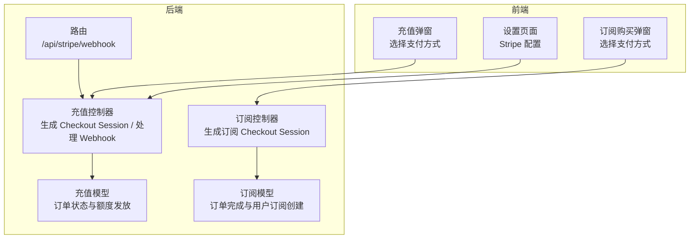
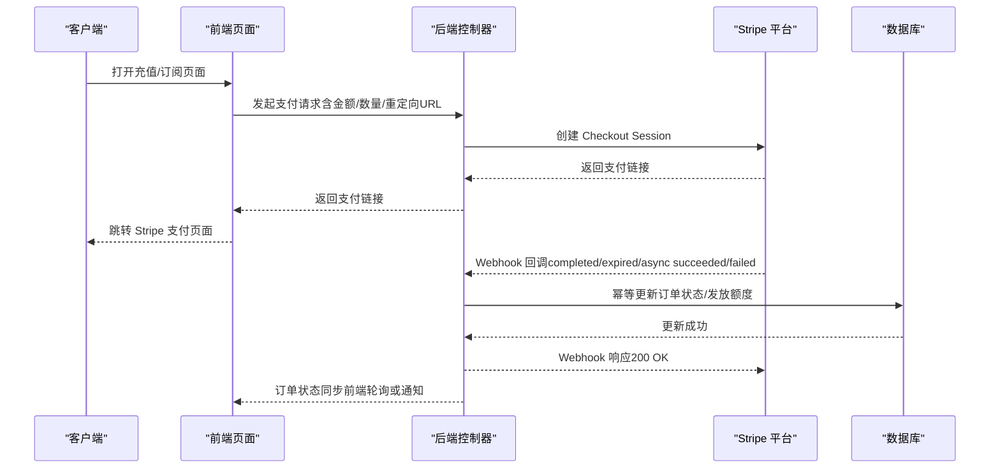
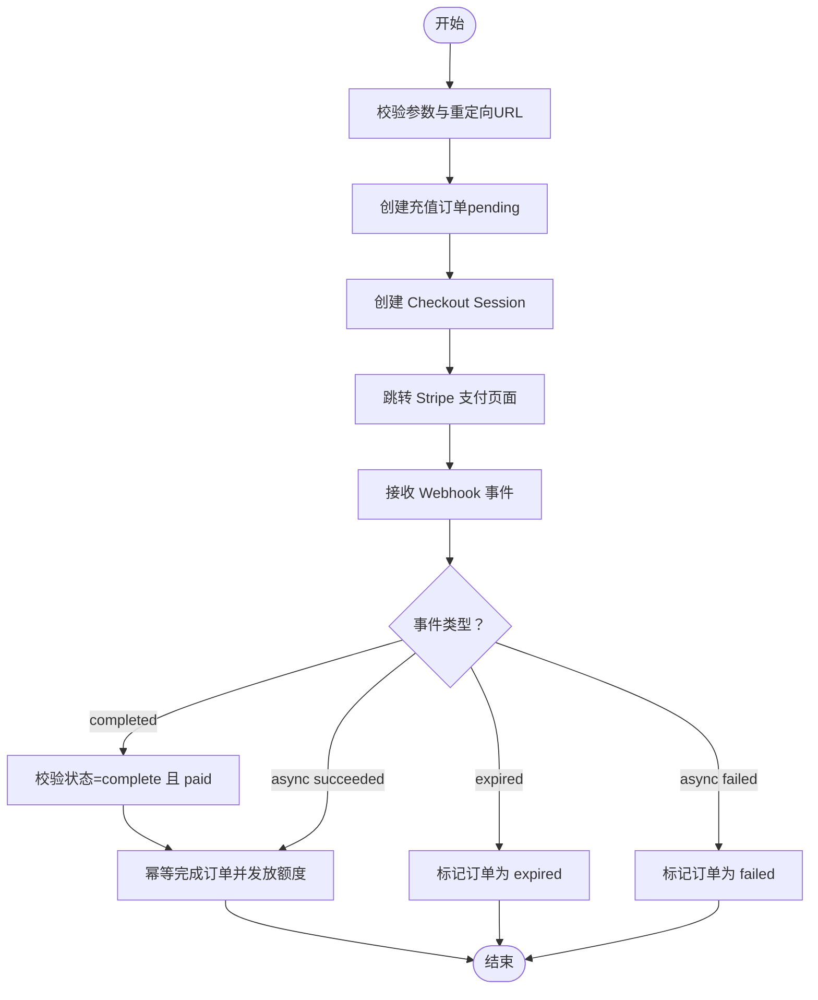
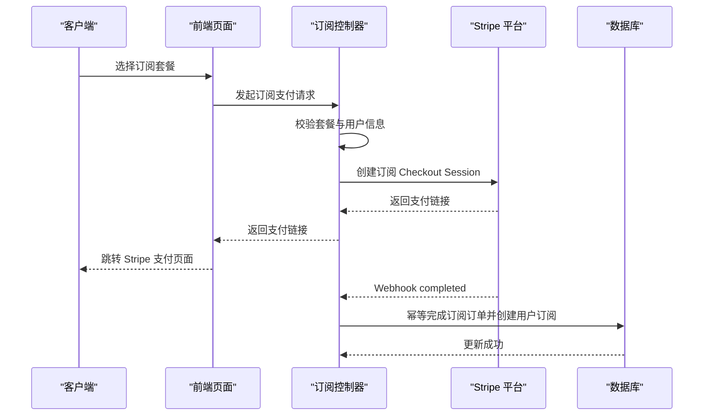
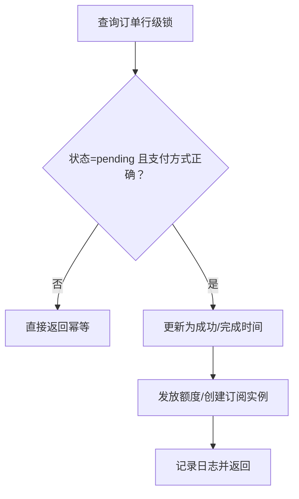
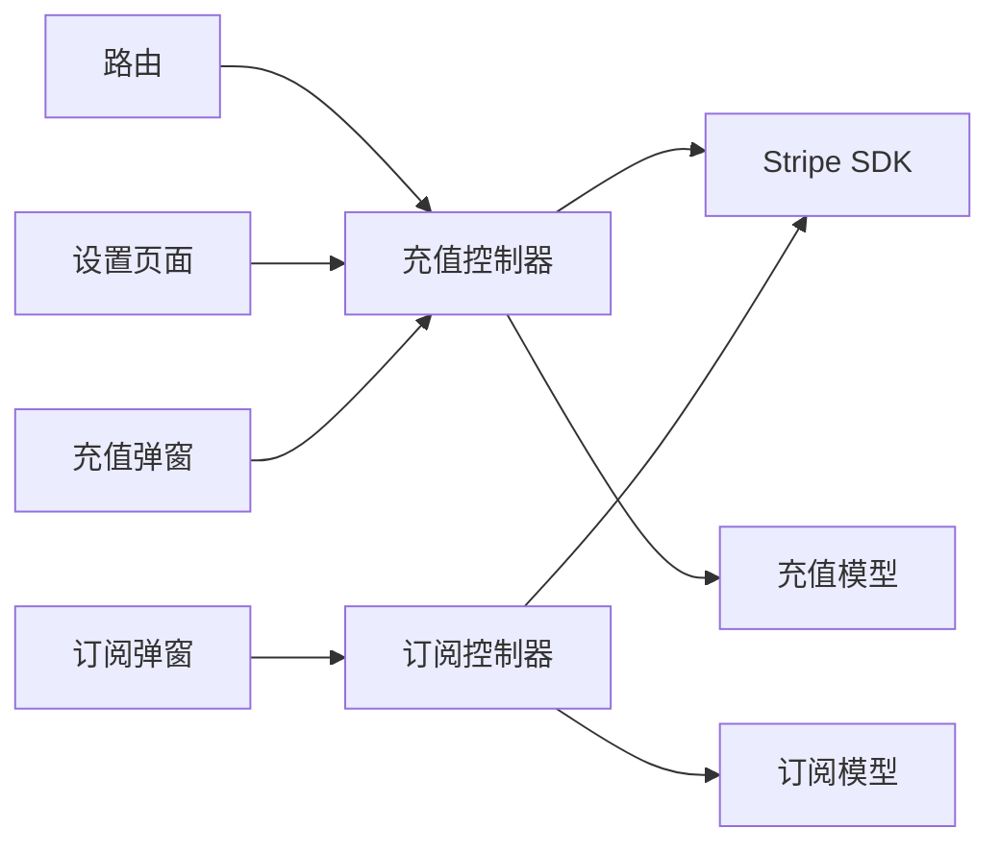

# Stripe 支付集成

<cite>
**本文档引用的文件**
- [controller/topup_stripe.go](file://controller/topup_stripe.go)
- [controller/subscription_payment_stripe.go](file://controller/subscription_payment_stripe.go)
- [setting/payment_stripe.go](file://setting/payment_stripe.go)
- [model/topup.go](file://model/topup.go)
- [model/subscription.go](file://model/subscription.go)
- [router/api-router.go](file://router/api-router.go)
- [web/src/pages/Setting/Payment/SettingsPaymentGatewayStripe.jsx](file://web/src/pages/Setting/Payment/SettingsPaymentGatewayStripe.jsx)
- [web/src/components/topup/modals/PaymentConfirmModal.jsx](file://web/src/components/topup/modals/PaymentConfirmModal.jsx)
- [web/src/components/topup/modals/SubscriptionPurchaseModal.jsx](file://web/src/components/topup/modals/SubscriptionPurchaseModal.jsx)
- [controller/misc.go](file://controller/misc.go)
- [controller/subscription.go](file://controller/subscription.go)
</cite>

## 目录
1. [简介](#简介)
2. [项目结构](#项目结构)
3. [核心组件](#核心组件)
4. [架构概览](#架构概览)
5. [详细组件分析](#详细组件分析)
6. [依赖关系分析](#依赖关系分析)
7. [性能考虑](#性能考虑)
8. [故障排除指南](#故障排除指南)
9. [结论](#结论)
10. [附录](#附录)

## 简介
本文件为该代码库中 Stripe 支付集成的详细技术文档。内容涵盖 Stripe 支付网关的配置与集成过程，包括 API 密钥设置、Webhook 配置与支付流程实现；详细说明 Stripe Checkout Session 的创建、支付确认与状态同步机制；解释 Stripe 价格配置、货币处理与汇率转换；提供完整的集成示例（前端支付页面集成、后端 Webhook 处理与订单状态管理）；说明 Stripe 安全措施（签名验证、防重放攻击与数据加密）；包含支付失败处理、退款机制与对账功能；最后提供故障排除指南与监控配置建议。

## 项目结构
该 Stripe 集成涉及后端控制器、模型层、路由与前端设置界面等多个模块：

- 后端控制器
  - 充值支付控制器：负责生成 Stripe Checkout Session、处理 Webhook 事件与订单状态同步
  - 订阅支付控制器：负责订阅计划的 Stripe 支付流程
- 模型层
  - 充值订单模型：维护充值订单状态与额度发放
  - 订阅订单模型：维护订阅订单状态与用户订阅实例创建
- 路由
  - 提供 /api/stripe/webhook 接口用于接收 Stripe Webhook
- 前端设置界面
  - 提供 Stripe 配置项的可视化设置与 Webhook 地址提示

**图表来源**
- [controller/topup_stripe.go:148-187](file://controller/topup_stripe.go#L148-L187)
- [controller/subscription_payment_stripe.go:24-106](file://controller/subscription_payment_stripe.go#L24-L106)
- [model/topup.go:60-111](file://model/topup.go#L60-L111)
- [model/subscription.go:508-572](file://model/subscription.go#L508-L572)
- [router/api-router.go:49](file://router/api-router.go#L49)

**章节来源**
- [controller/topup_stripe.go:1-427](file://controller/topup_stripe.go#L1-L427)
- [controller/subscription_payment_stripe.go:1-139](file://controller/subscription_payment_stripe.go#L1-L139)
- [router/api-router.go:49](file://router/api-router.go#L49)

## 核心组件
- Stripe 配置变量
  - API 密钥、Webhook 密钥、默认价格 ID、单价、最小充值金额、促销码开关
- 充值控制器
  - 生成 Stripe Checkout Session、校验参数与重定向 URL、创建充值订单、处理 Webhook 事件
- 订阅控制器
  - 生成订阅 Checkout Session、校验套餐与用户信息、创建订阅订单
- 模型层
  - 充值订单模型：幂等完成充值、更新用户额度
  - 订阅订单模型：幂等完成订阅、创建用户订阅实例
- 路由
  - 注册 /api/stripe/webhook 接口
- 前端设置界面
  - 可视化配置 Stripe 参数、展示 Webhook 地址与所需事件

**章节来源**
- [setting/payment_stripe.go:1-9](file://setting/payment_stripe.go#L1-L9)
- [controller/topup_stripe.go:68-126](file://controller/topup_stripe.go#L68-L126)
- [controller/subscription_payment_stripe.go:24-106](file://controller/subscription_payment_stripe.go#L24-L106)
- [model/topup.go:60-111](file://model/topup.go#L60-L111)
- [model/subscription.go:508-572](file://model/subscription.go#L508-L572)
- [router/api-router.go:49](file://router/api-router.go#L49)
- [web/src/pages/Setting/Payment/SettingsPaymentGatewayStripe.jsx:161-200](file://web/src/pages/Setting/Payment/SettingsPaymentGatewayStripe.jsx#L161-L200)

## 架构概览
Stripe 支付集成采用“前端发起支付 → 后端创建 Checkout Session → 用户在 Stripe 页面完成支付 → Stripe Webhook 回调 → 后端幂等完成订单”的闭环流程。系统通过行级锁与幂等操作确保并发安全与数据一致性。

**图表来源**
- [controller/topup_stripe.go:68-126](file://controller/topup_stripe.go#L68-L126)
- [controller/topup_stripe.go:148-187](file://controller/topup_stripe.go#L148-L187)
- [controller/topup_stripe.go:255-286](file://controller/topup_stripe.go#L255-L286)
- [model/topup.go:60-111](file://model/topup.go#L60-L111)
- [router/api-router.go:49](file://router/api-router.go#L49)

## 详细组件分析

### Stripe 配置与前端设置
- 配置项
  - API 密钥：用于初始化 Stripe SDK
  - Webhook 密钥：用于验证回调签名
  - 默认价格 ID：用于按数量计费的充值场景
  - 单价：美元与配额单位的换算系数
  - 最小充值金额：按配额显示类型转换后的最小值
  - 促销码开关：是否允许在 Checkout 中使用促销码
- 前端设置页面
  - 展示并提交上述配置项
  - 自动提示 Webhook 地址与所需事件（checkout.session.completed、checkout.session.expired）

**章节来源**
- [setting/payment_stripe.go:1-9](file://setting/payment_stripe.go#L1-L9)
- [web/src/pages/Setting/Payment/SettingsPaymentGatewayStripe.jsx:161-200](file://web/src/pages/Setting/Payment/SettingsPaymentGatewayStripe.jsx#L161-L200)

### 充值支付流程（Stripe Checkout Session）
- 请求参数校验
  - 支付方式必须为 stripe
  - 数量不得低于最小充值金额
  - 成功/取消重定向 URL 必须在可信域名列表内
- 订单创建
  - 生成唯一交易号（referenceId），创建充值订单（状态 pending）
- Session 创建
  - 使用默认价格 ID 与数量创建支付会话
  - 自定义成功/取消跳转地址
  - 若无 Stripe Customer ID 则自动创建客户
- Webhook 处理
  - completed：校验状态为 complete 且 payment_status 为 paid，幂等完成订单并发放额度
  - expired：过期订单标记为 expired
  - async_payment_succeeded/failed：异步支付成功/失败，分别幂等完成或标记失败

**图表来源**
- [controller/topup_stripe.go:68-126](file://controller/topup_stripe.go#L68-L126)
- [controller/topup_stripe.go:148-187](file://controller/topup_stripe.go#L148-L187)
- [controller/topup_stripe.go:189-205](file://controller/topup_stripe.go#L189-L205)
- [controller/topup_stripe.go:288-329](file://controller/topup_stripe.go#L288-L329)
- [controller/topup_stripe.go:209-215](file://controller/topup_stripe.go#L209-L215)
- [controller/topup_stripe.go:219-253](file://controller/topup_stripe.go#L219-L253)

**章节来源**
- [controller/topup_stripe.go:68-126](file://controller/topup_stripe.go#L68-L126)
- [controller/topup_stripe.go:148-187](file://controller/topup_stripe.go#L148-L187)
- [controller/topup_stripe.go:189-205](file://controller/topup_stripe.go#L189-L205)
- [controller/topup_stripe.go:209-215](file://controller/topup_stripe.go#L209-L215)
- [controller/topup_stripe.go:219-253](file://controller/topup_stripe.go#L219-L253)
- [controller/topup_stripe.go:288-329](file://controller/topup_stripe.go#L288-L329)

### 订阅支付流程（Stripe Checkout Session）
- 参数校验
  - 必须传入有效的订阅套餐 ID
  - 套餐需启用且配置了 Stripe Price ID
  - API 密钥与 Webhook 密钥必须有效
- 订单创建
  - 生成唯一交易号（referenceId），创建订阅订单（状态 pending）
- Session 创建
  - 使用套餐的 Stripe Price ID 创建订阅模式的 Checkout Session
  - 自定义成功/取消跳转地址
  - 若无 Stripe Customer ID 则自动创建客户
- Webhook 处理
  - completed：幂等完成订阅订单，创建用户订阅实例，同步充值记录

**图表来源**
- [controller/subscription_payment_stripe.go:24-106](file://controller/subscription_payment_stripe.go#L24-L106)
- [controller/subscription_payment_stripe.go:108-138](file://controller/subscription_payment_stripe.go#L108-L138)
- [controller/topup_stripe.go:189-205](file://controller/topup_stripe.go#L189-L205)
- [model/subscription.go:508-572](file://model/subscription.go#L508-L572)

**章节来源**
- [controller/subscription_payment_stripe.go:24-106](file://controller/subscription_payment_stripe.go#L24-L106)
- [controller/subscription_payment_stripe.go:108-138](file://controller/subscription_payment_stripe.go#L108-L138)
- [controller/topup_stripe.go:189-205](file://controller/topup_stripe.go#L189-L205)
- [model/subscription.go:508-572](file://model/subscription.go#L508-L572)

### 模型层与幂等处理
- 充值模型
  - 幂等完成充值：行级锁查询订单，校验支付方式与状态，更新为成功并发放额度
  - 支持管理员手动补单：根据支付方式与金额计算应发额度并更新用户余额
- 订阅模型
  - 幂等完成订阅：行级锁查询订单，校验状态，创建用户订阅实例，同步充值记录
  - 订阅过期：将 pending 订单标记为 expired

**图表来源**
- [model/topup.go:60-111](file://model/topup.go#L60-L111)
- [model/subscription.go:508-572](file://model/subscription.go#L508-L572)
- [model/subscription.go:608-628](file://model/subscription.go#L608-L628)

**章节来源**
- [model/topup.go:60-111](file://model/topup.go#L60-L111)
- [model/subscription.go:508-572](file://model/subscription.go#L508-L572)
- [model/subscription.go:608-628](file://model/subscription.go#L608-L628)

### 前端集成示例
- 设置页面
  - 可配置 API 密钥、Webhook 密钥、价格 ID、单价、最小充值金额、促销码开关
  - 自动提示 Webhook 地址与所需事件
- 充值弹窗
  - 显示 Stripe 支付方式图标与名称
- 订阅购买弹窗
  - 在有 Stripe 启用时显示 Stripe 支付按钮

**章节来源**
- [web/src/pages/Setting/Payment/SettingsPaymentGatewayStripe.jsx:161-200](file://web/src/pages/Setting/Payment/SettingsPaymentGatewayStripe.jsx#L161-L200)
- [web/src/components/topup/modals/PaymentConfirmModal.jsx:172-184](file://web/src/components/topup/modals/PaymentConfirmModal.jsx#L172-L184)
- [web/src/components/topup/modals/SubscriptionPurchaseModal.jsx:189-216](file://web/src/components/topup/modals/SubscriptionPurchaseModal.jsx#L189-L216)

## 依赖关系分析
- 控制器依赖
  - Stripe SDK：创建 Checkout Session 与解析 Webhook
  - 系统设置：获取服务器地址与 Stripe 配置
  - 模型层：订单创建与状态更新
- 路由依赖
  - 注册 /api/stripe/webhook 接口
- 前端依赖
  - 设置页面与支付弹窗组件

**图表来源**
- [controller/topup_stripe.go:14-23](file://controller/topup_stripe.go#L14-L23)
- [controller/subscription_payment_stripe.go:14-16](file://controller/subscription_payment_stripe.go#L14-L16)
- [router/api-router.go:49](file://router/api-router.go#L49)

**章节来源**
- [controller/topup_stripe.go:14-23](file://controller/topup_stripe.go#L14-L23)
- [controller/subscription_payment_stripe.go:14-16](file://controller/subscription_payment_stripe.go#L14-L16)
- [router/api-router.go:49](file://router/api-router.go#L49)

## 性能考虑
- 幂等与行级锁
  - Webhook 处理与订单完成均使用行级锁，避免并发导致的重复入账与状态异常
- 缓存与事务
  - 订阅计划与信息具备混合缓存与 TTL 管理，减少数据库压力
- 金额计算
  - 使用浮点数进行小额金额计算，避免大数精度问题；若业务规模扩大，建议迁移到高精度库

[本节为通用性能讨论，无需具体文件分析]

## 故障排除指南
- Webhook 验签失败
  - 检查 Webhook 密钥是否正确配置
  - 确认 Stripe Dashboard 中的 Webhook 端点已启用所需事件
- 支付未到账
  - 确认 completed 事件已到达且 payment_status 为 paid
  - 检查 referenceId 是否正确传递至 Webhook payload
- 订单状态异常
  - 查看订单状态是否为 pending，避免重复处理
  - 使用管理员补单功能（针对充值订单）进行人工干预
- 重定向 URL 不生效
  - 确认成功/取消重定向 URL 在可信域名列表中
- 金额与额度不符
  - 检查单价、分组倍率与显示类型（配额/令牌）的换算逻辑

**章节来源**
- [controller/topup_stripe.go:148-187](file://controller/topup_stripe.go#L148-L187)
- [controller/topup_stripe.go:219-253](file://controller/topup_stripe.go#L219-L253)
- [model/topup.go:245-314](file://model/topup.go#L245-L314)

## 结论
该 Stripe 集成通过清晰的控制器职责划分、严格的幂等与行级锁设计、完善的 Webhook 事件处理以及前后端协同的配置界面，实现了从支付到对账的完整闭环。系统具备良好的扩展性与安全性，适合在生产环境中稳定运行。

[本节为总结性内容，无需具体文件分析]

## 附录

### Stripe 配置清单
- API 密钥：用于初始化 Stripe SDK
- Webhook 密钥：用于验证回调签名
- 默认价格 ID：按数量计费的充值场景使用
- 单价：美元与配额单位的换算系数
- 最小充值金额：按配额显示类型转换后的最小值
- 促销码开关：是否允许在 Checkout 中使用促销码

**章节来源**
- [setting/payment_stripe.go:1-9](file://setting/payment_stripe.go#L1-L9)
- [web/src/pages/Setting/Payment/SettingsPaymentGatewayStripe.jsx:161-200](file://web/src/pages/Setting/Payment/SettingsPaymentGatewayStripe.jsx#L161-L200)

### Webhook 事件与处理
- checkout.session.completed：完成支付后触发，幂等完成订单并发放额度
- checkout.session.expired：会话过期，标记订单为 expired
- checkout.session.async_payment_succeeded：异步支付成功，幂等完成
- checkout.session.async_payment_failed：异步支付失败，标记订单为 failed

**章节来源**
- [controller/topup_stripe.go:173-184](file://controller/topup_stripe.go#L173-L184)
- [controller/topup_stripe.go:189-205](file://controller/topup_stripe.go#L189-L205)
- [controller/topup_stripe.go:288-329](file://controller/topup_stripe.go#L288-L329)
- [controller/topup_stripe.go:209-215](file://controller/topup_stripe.go#L209-L215)
- [controller/topup_stripe.go:219-253](file://controller/topup_stripe.go#L219-L253)

### 价格配置与货币处理
- 价格配置
  - 充值：使用默认价格 ID 与数量
  - 订阅：使用套餐的 Stripe Price ID
- 货币与汇率
  - 系统以美元为基准单位，通过单价与分组倍率换算为配额
  - Stripe 返回的金额以最小货币单位表示，系统将其转换为美元并换算配额

**章节来源**
- [controller/topup_stripe.go:343-388](file://controller/topup_stripe.go#L343-L388)
- [controller/subscription_payment_stripe.go:108-138](file://controller/subscription_payment_stripe.go#L108-L138)
- [model/topup.go:390-418](file://model/topup.go#L390-L418)

### 安全措施
- 签名验证
  - Webhook 使用 Stripe-Signature 头部与 Webhook 密钥进行验签
- 防重放攻击
  - 使用行级锁与幂等操作，避免重复处理同一订单
- 数据加密
  - API 密钥与 Webhook 密钥通过配置项管理，前端仅展示提示信息

**章节来源**
- [controller/topup_stripe.go:162-171](file://controller/topup_stripe.go#L162-L171)
- [model/topup.go:60-111](file://model/topup.go#L60-L111)
- [model/subscription.go:508-572](file://model/subscription.go#L508-L572)

### 退款与对账
- 退款机制
  - 由 Stripe 平台处理退款，系统通过 Webhook 的异步支付失败事件标记订单为 failed
- 对账功能
  - 订单状态与额度发放均具备幂等与日志记录，便于对账核对

**章节来源**
- [controller/topup_stripe.go:219-253](file://controller/topup_stripe.go#L219-L253)
- [model/topup.go:60-111](file://model/topup.go#L60-L111)