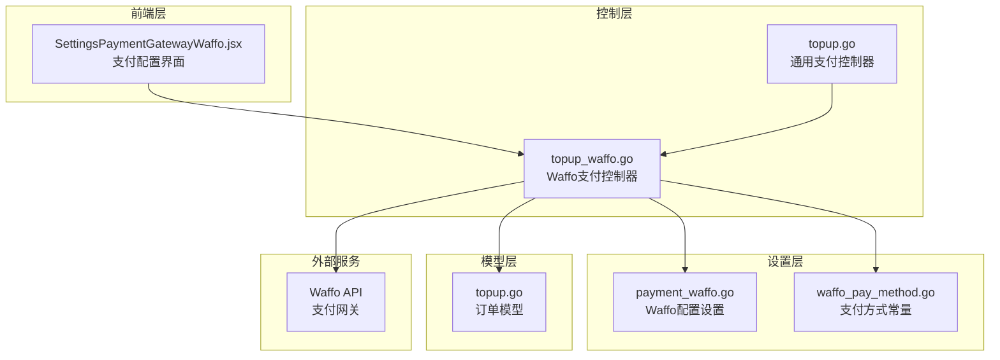
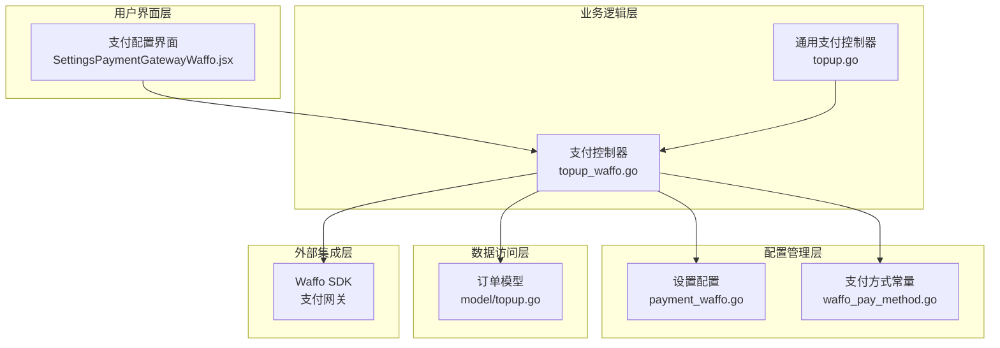
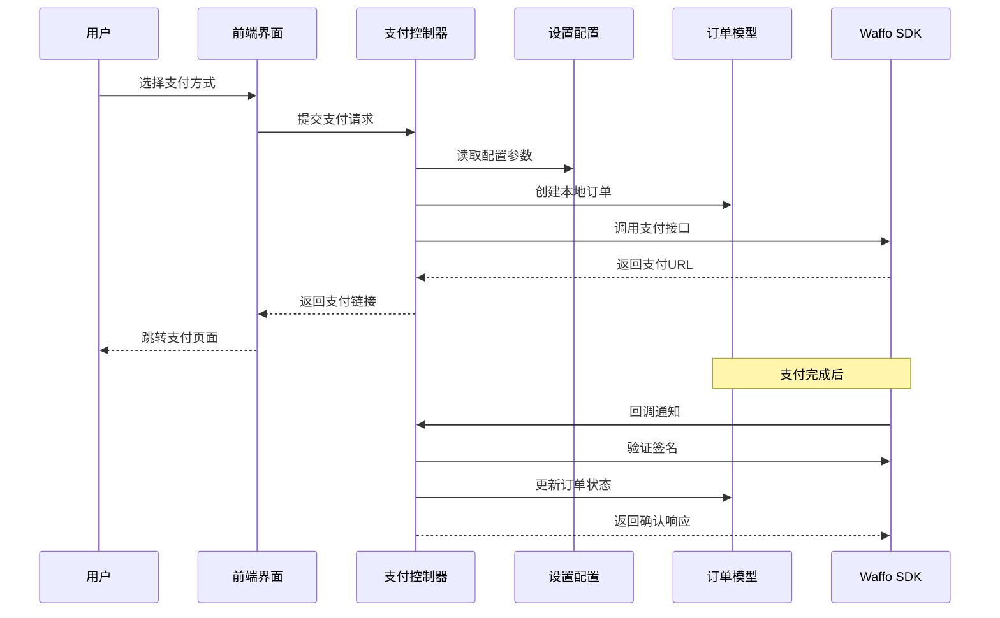
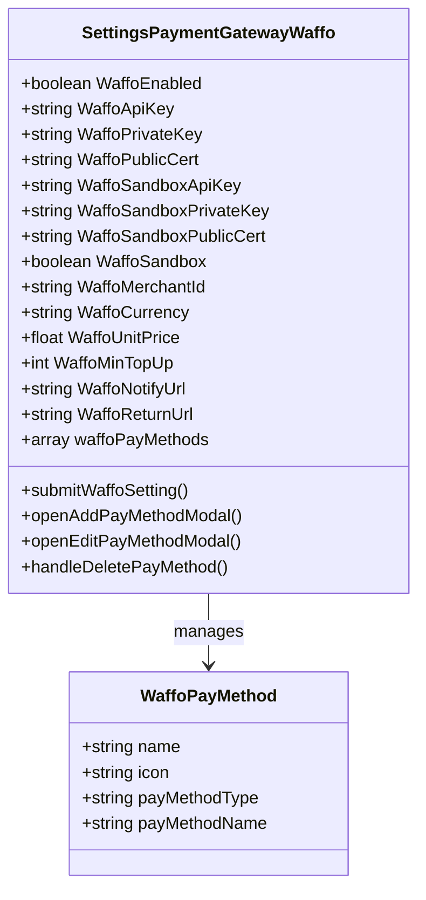
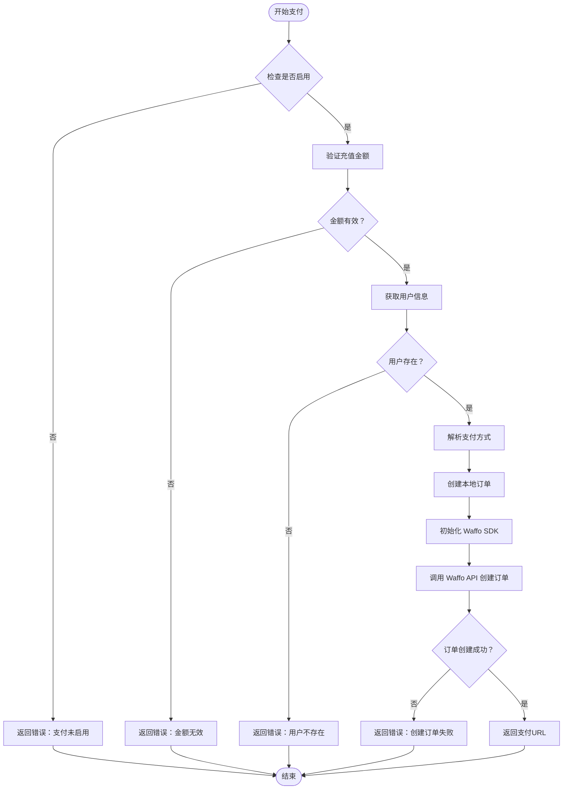
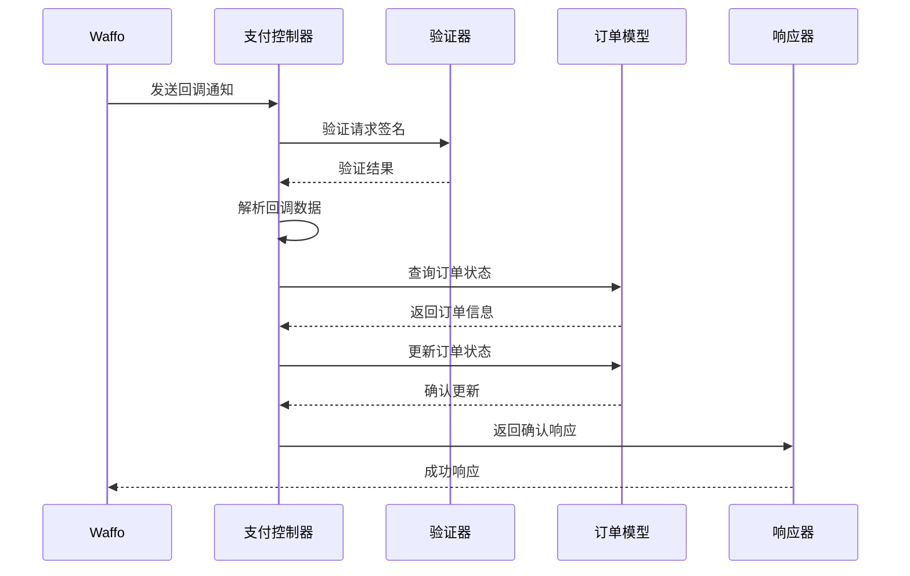
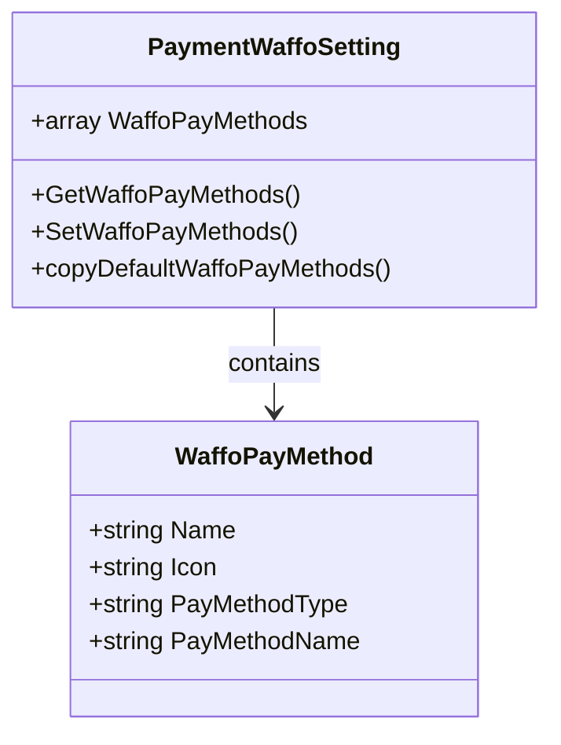
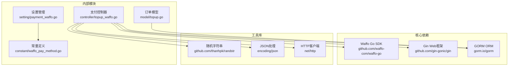
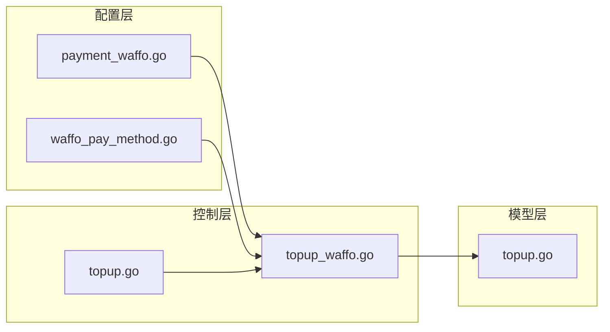
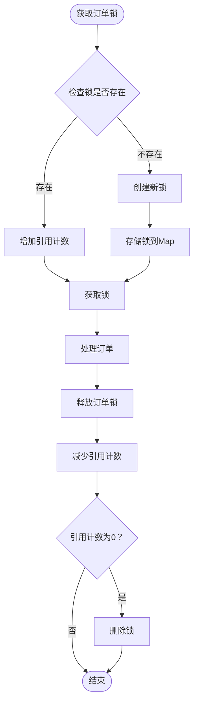

# Waffo 支付集成

<cite>
**本文档引用的文件**
- [topup_waffo.go](file://controller/topup_waffo.go)
- [payment_waffo.go](file://setting/payment_waffo.go)
- [waffo_pay_method.go](file://constant/waffo_pay_method.go)
- [topup.go](file://controller/topup.go)
- [topup.go](file://model/topup.go)
- [SettingsPaymentGatewayWaffo.jsx](file://web/src/pages/Setting/Payment/SettingsPaymentGatewayWaffo.jsx)
</cite>

## 目录
1. [简介](#简介)
2. [项目结构](#项目结构)
3. [核心组件](#核心组件)
4. [架构概览](#架构概览)
5. [详细组件分析](#详细组件分析)
6. [依赖关系分析](#依赖关系分析)
7. [性能考虑](#性能考虑)
8. [故障排除指南](#故障排除指南)
9. [结论](#结论)
10. [附录](#附录)

## 简介

Waffo 支付集成是一个基于 Go 语言开发的支付解决方案，集成了 Waffo 支付聚合平台。该系统支持多种支付方式，包括信用卡、Apple Pay 和 Google Pay，并提供了完整的支付流程管理，包括订单创建、支付处理、回调通知和状态管理。

本系统采用模块化设计，通过清晰的分层架构实现了支付功能的完整生命周期管理。系统支持沙盒模式和生产环境配置，提供了灵活的支付方式配置选项和强大的安全机制。

## 项目结构

Waffo 支付集成在整体项目中的位置和组织结构如下：

**图表来源**
- [SettingsPaymentGatewayWaffo.jsx:1-609](file://web/src/pages/Setting/Payment/SettingsPaymentGatewayWaffo.jsx#L1-609)
- [topup_waffo.go:1-381](file://controller/topup_waffo.go#L1-381)
- [payment_waffo.go:1-68](file://setting/payment_waffo.go#L1-68)

**章节来源**
- [SettingsPaymentGatewayWaffo.jsx:1-609](file://web/src/pages/Setting/Payment/SettingsPaymentGatewayWaffo.jsx#L1-609)
- [topup_waffo.go:1-381](file://controller/topup_waffo.go#L1-381)
- [payment_waffo.go:1-68](file://setting/payment_waffo.go#L1-68)

## 核心组件

### 支付配置组件

系统的核心配置组件包括以下关键部分：

#### Waffo 支付设置
- **API 密钥管理**: 支持生产环境和沙盒环境的独立 API 密钥配置
- **证书配置**: 提供 RSA 私钥和 Waffo 公钥的完整配置支持
- **商户信息**: 支持商户 ID 的配置和管理
- **货币设置**: 默认支持 USD 货币，可配置其他货币类型
- **单价配置**: 支持按充值单位计算 USD 金额的单价设置
- **最小充值**: 可配置最低充值数量限制

#### 支付方式配置
- **默认支付方式**: 预设了信用卡、Apple Pay、Google Pay 三种支付方式
- **自定义支付方式**: 支持动态添加和管理自定义支付方式
- **图标支持**: 支付方式图标上传和管理功能
- **参数映射**: 支付方式类型和名称的 API 参数映射

**章节来源**
- [payment_waffo.go:8-24](file://setting/payment_waffo.go#L8-24)
- [waffo_pay_method.go:11-16](file://constant/waffo_pay_method.go#L11-16)
- [SettingsPaymentGatewayWaffo.jsx:39-609](file://web/src/pages/Setting/Payment/SettingsPaymentGatewayWaffo.jsx#L39-609)

### 支付处理组件

#### 订单创建流程
- **订单参数构建**: 包含金额、货币、描述、时间戳等完整订单信息
- **用户信息管理**: 用户 ID、邮箱、终端类型等用户相关信息
- **支付信息配置**: 支付方式类型和名称的精确配置
- **回调地址设置**: 自动化的通知和返回地址配置

#### 回调处理机制
- **签名验证**: 基于 Waffo SDK 的数字签名验证
- **事件类型处理**: 支付事件的分类处理和响应
- **幂等性保证**: 订单状态的幂等处理和并发控制
- **错误处理**: 完善的错误捕获和响应机制

**章节来源**
- [topup_waffo.go:102-270](file://controller/topup_waffo.go#L102-270)
- [topup_waffo.go:288-380](file://controller/topup_waffo.go#L288-380)

## 架构概览

Waffo 支付集成采用了分层架构设计，确保了系统的可维护性和扩展性：

**图表来源**
- [SettingsPaymentGatewayWaffo.jsx:320-484](file://web/src/pages/Setting/Payment/SettingsPaymentGatewayWaffo.jsx#L320-484)
- [topup_waffo.go:25-49](file://controller/topup_waffo.go#L25-49)
- [payment_waffo.go:1-68](file://setting/payment_waffo.go#L1-68)

### 数据流架构

系统的数据流遵循严格的处理顺序，确保支付流程的完整性和安全性：

**图表来源**
- [topup_waffo.go:102-270](file://controller/topup_waffo.go#L102-270)
- [topup_waffo.go:288-380](file://controller/topup_waffo.go#L288-380)

## 详细组件分析

### 支付配置管理

#### 前端配置界面

前端支付配置界面提供了直观的用户交互体验：

**图表来源**
- [SettingsPaymentGatewayWaffo.jsx:39-609](file://web/src/pages/Setting/Payment/SettingsPaymentGatewayWaffo.jsx#L39-609)
- [waffo_pay_method.go:3-9](file://constant/waffo_pay_method.go#L3-9)

#### 配置参数详解

| 配置项 | 类型 | 必填 | 描述 |
|--------|------|------|------|
| WaffoEnabled | boolean | 是 | 是否启用 Waffo 支付 |
| WaffoApiKey | string | 生产环境必需 | 生产环境 API 密钥 |
| WaffoSandboxApiKey | string | 沙盒环境必需 | 沙盒环境 API 密钥 |
| WaffoPrivateKey | string | 生产环境必需 | 生产环境 RSA 私钥 |
| WaffoSandboxPrivateKey | string | 沙盒环境必需 | 沙盒环境 RSA 私钥 |
| WaffoPublicCert | string | 生产环境必需 | 生产环境 Waffo 公钥 |
| WaffoSandboxPublicCert | string | 沙盒环境必需 | 沙盒环境 Waffo 公钥 |
| WaffoSandbox | boolean | 是 | 是否启用沙盒模式 |
| WaffoMerchantId | string | 否 | 商户 ID |
| WaffoCurrency | string | 否 | 货币类型，默认 USD |
| WaffoUnitPrice | float | 否 | 单价，默认 1.0 |
| WaffoMinTopUp | int | 否 | 最低充值数量，默认 1 |
| WaffoNotifyUrl | string | 否 | 回调通知地址 |
| WaffoReturnUrl | string | 否 | 支付返回地址 |

**章节来源**
- [SettingsPaymentGatewayWaffo.jsx:93-198](file://web/src/pages/Setting/Payment/SettingsPaymentGatewayWaffo.jsx#L93-198)
- [payment_waffo.go:8-24](file://setting/payment_waffo.go#L8-24)

### 支付流程实现

#### 订单创建流程

支付订单的创建遵循严格的安全和验证流程：

**图表来源**
- [topup_waffo.go:102-270](file://controller/topup_waffo.go#L102-270)

#### 回调处理流程

Waffo 回调通知的处理确保了支付状态的准确同步：

**图表来源**
- [topup_waffo.go:288-380](file://controller/topup_waffo.go#L288-380)

**章节来源**
- [topup_waffo.go:102-270](file://controller/topup_waffo.go#L102-270)
- [topup_waffo.go:288-380](file://controller/topup_waffo.go#L288-380)

### 支付方式管理

#### 默认支付方式配置

系统预设了三种标准支付方式，满足大多数用户需求：

| 支付方式 | 支付方式类型 | 支付方式名称 | 图标 |
|----------|-------------|-------------|------|
| 信用卡 | CREDITCARD,DEBITCARD | 空 | /pay-card.png |
| Apple Pay | APPLEPAY | APPLEPAY | /pay-apple.png |
| Google Pay | GOOGLEPAY | GOOGLEPAY | /pay-google.png |

#### 自定义支付方式

用户可以通过管理界面添加自定义支付方式：

**图表来源**
- [waffo_pay_method.go:3-9](file://constant/waffo_pay_method.go#L3-9)
- [payment_waffo.go:26-52](file://setting/payment_waffo.go#L26-52)

**章节来源**
- [waffo_pay_method.go:11-16](file://constant/waffo_pay_method.go#L11-16)
- [payment_waffo.go:26-52](file://setting/payment_waffo.go#L26-52)

## 依赖关系分析

### 外部依赖

Waffo 支付集成主要依赖以下外部组件：

**图表来源**
- [topup_waffo.go:3-23](file://controller/topup_waffo.go#L3-23)
- [payment_waffo.go:3-6](file://setting/payment_waffo.go#L3-6)

### 内部模块依赖

系统内部模块之间的依赖关系清晰明确：

**图表来源**
- [payment_waffo.go:1-68](file://setting/payment_waffo.go#L1-68)
- [topup_waffo.go:1-381](file://controller/topup_waffo.go#L1-381)
- [topup.go:51-79](file://controller/topup.go#L51-79)

**章节来源**
- [topup_waffo.go:1-381](file://controller/topup_waffo.go#L1-381)
- [payment_waffo.go:1-68](file://setting/payment_waffo.go#L1-68)

## 性能考虑

### 并发控制

系统采用了多层并发控制机制来确保支付流程的线程安全：

#### 订单锁定机制
- **订单级互斥锁**: 使用 `sync.Map` 实现订单级别的并发控制
- **引用计数锁**: 防止锁被过早释放，确保最后一个使用者负责清理
- **超时保护**: 避免死锁情况的发生

#### 锁管理实现

**图表来源**
- [topup.go:241-281](file://controller/topup.go#L241-281)

### 缓存策略

系统通过合理的缓存策略提升性能：

- **配置缓存**: 支付配置信息的内存缓存
- **支付方式缓存**: 支付方式列表的快速访问
- **订单状态缓存**: 高频查询的订单状态缓存

### 错误处理优化

- **快速失败**: 对无效输入进行快速验证和拒绝
- **降级处理**: 在外部服务不可用时提供降级方案
- **重试机制**: 对临时性错误提供智能重试

## 故障排除指南

### 常见问题诊断

#### 支付配置问题

| 问题症状 | 可能原因 | 解决方案 |
|----------|----------|----------|
| 支付未启用 | WaffoEnabled 为 false | 检查配置并启用支付功能 |
| API 密钥错误 | 密钥格式不正确 | 验证密钥格式和有效期 |
| 证书验证失败 | 证书不匹配 | 确认证书与密钥对应关系 |
| 支付方式无效 | 支付方式配置错误 | 检查支付方式参数映射 |

#### 订单处理问题

| 问题症状 | 可能原因 | 解决方案 |
|----------|----------|----------|
| 订单状态异常 | 并发访问冲突 | 检查订单锁定机制 |
| 回调处理失败 | 签名验证错误 | 验证回调签名算法 |
| 重复支付 | 幂等性处理失败 | 检查订单状态检查逻辑 |
| 支付超时 | 网络连接问题 | 检查网络配置和超时设置 |

#### 调试建议

1. **启用详细日志**: 在开发环境中启用详细的调试日志
2. **监控指标**: 设置关键性能指标的监控告警
3. **测试环境**: 使用沙盒环境进行全面的功能测试
4. **错误报告**: 建立完善的错误收集和报告机制

**章节来源**
- [topup_waffo.go:288-380](file://controller/topup_waffo.go#L288-380)
- [topup.go:241-281](file://controller/topup.go#L241-281)

## 结论

Waffo 支付集成为用户提供了完整、安全、高效的支付解决方案。系统通过模块化设计、严格的错误处理和完善的监控机制，确保了支付流程的可靠性和用户体验。

### 主要优势

1. **完整的支付生态**: 支持多种主流支付方式，满足不同用户需求
2. **安全可靠**: 采用数字签名验证、订单锁定等多重安全机制
3. **灵活配置**: 支持沙盒模式、自定义支付方式等灵活配置选项
4. **易于集成**: 清晰的 API 接口和详细的文档支持快速集成

### 技术特点

- **模块化架构**: 清晰的分层设计便于维护和扩展
- **并发安全**: 完善的并发控制机制确保数据一致性
- **错误处理**: 全面的错误处理和恢复机制
- **监控完善**: 详细的日志记录和性能监控

### 未来改进方向

1. **支付方式扩展**: 支持更多地区性的支付方式
2. **国际化支持**: 增强多语言和多币种支持
3. **性能优化**: 进一步优化高并发场景下的性能表现
4. **用户体验**: 改进支付流程的用户界面和交互体验

## 附录

### 集成步骤

#### 前端集成步骤

1. **安装依赖**: 确保前端项目包含必要的支付组件依赖
2. **配置界面**: 在支付设置页面添加 Waffo 支付配置选项
3. **样式定制**: 根据品牌要求定制支付界面的视觉效果
4. **测试验证**: 在沙盒环境中进行全面的功能测试

#### 后端集成步骤

1. **SDK 集成**: 在后端项目中集成 Waffo Go SDK
2. **配置管理**: 实现支付配置的动态管理和持久化存储
3. **回调处理**: 实现 Waffo 回调通知的处理逻辑
4. **错误处理**: 建立完善的错误处理和日志记录机制

### 最佳实践

1. **安全第一**: 始终验证支付数据的完整性和真实性
2. **性能优化**: 合理使用缓存和异步处理提升系统性能
3. **监控告警**: 建立完善的监控体系及时发现和解决问题
4. **文档维护**: 保持技术文档的及时更新和准确性