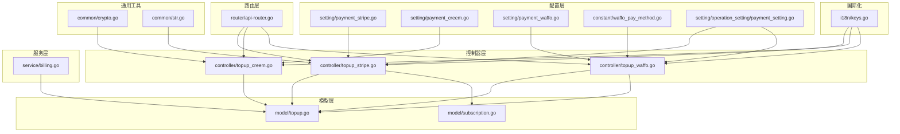
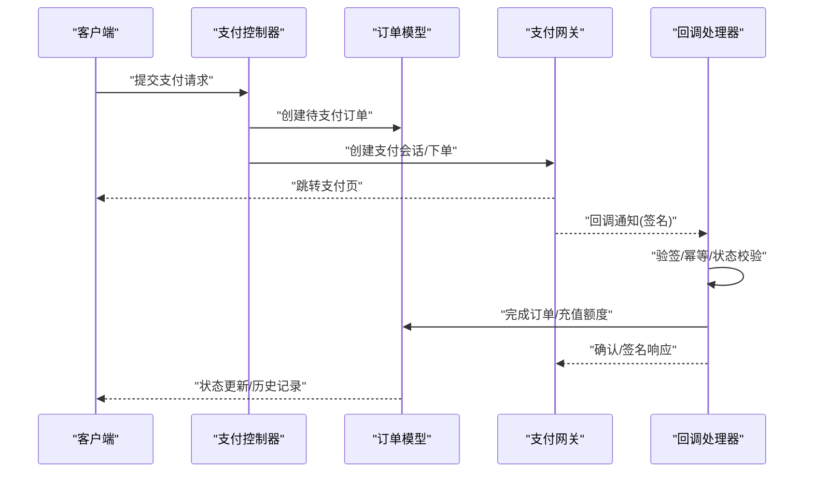
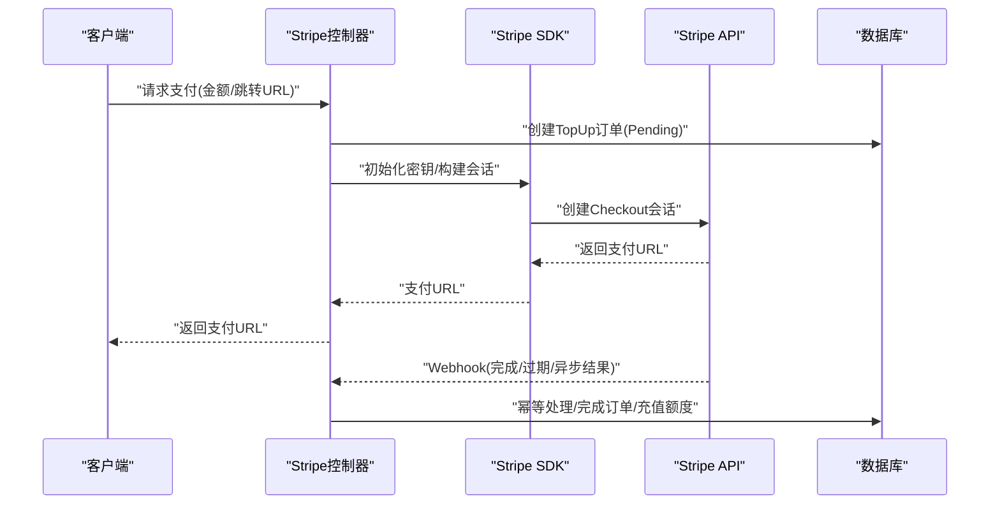
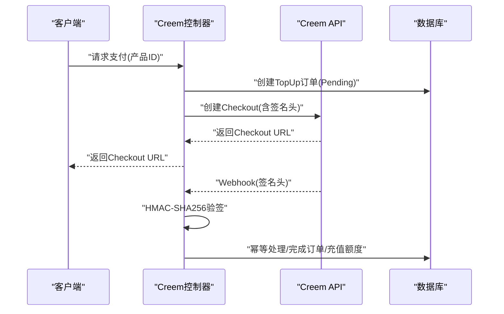
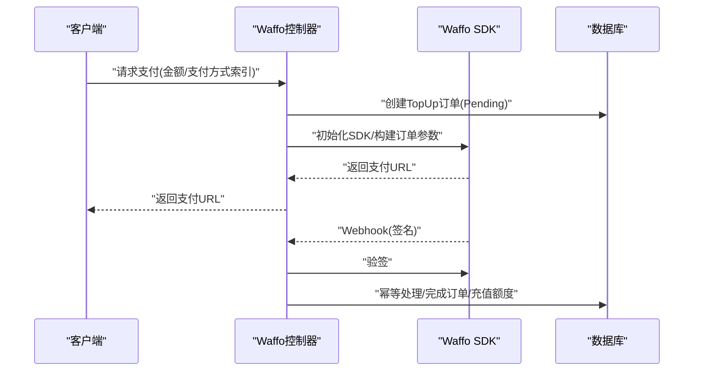
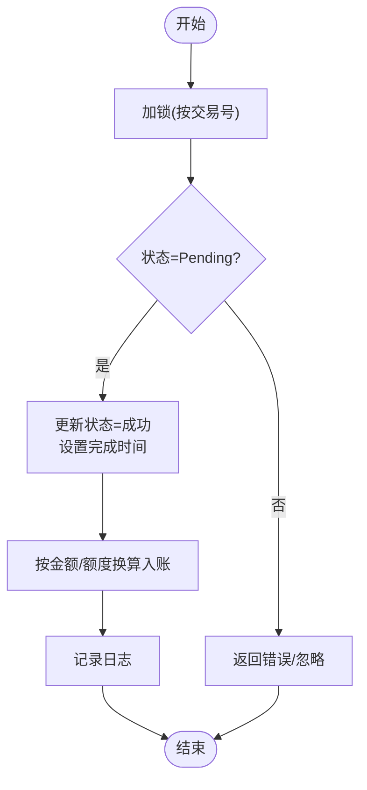
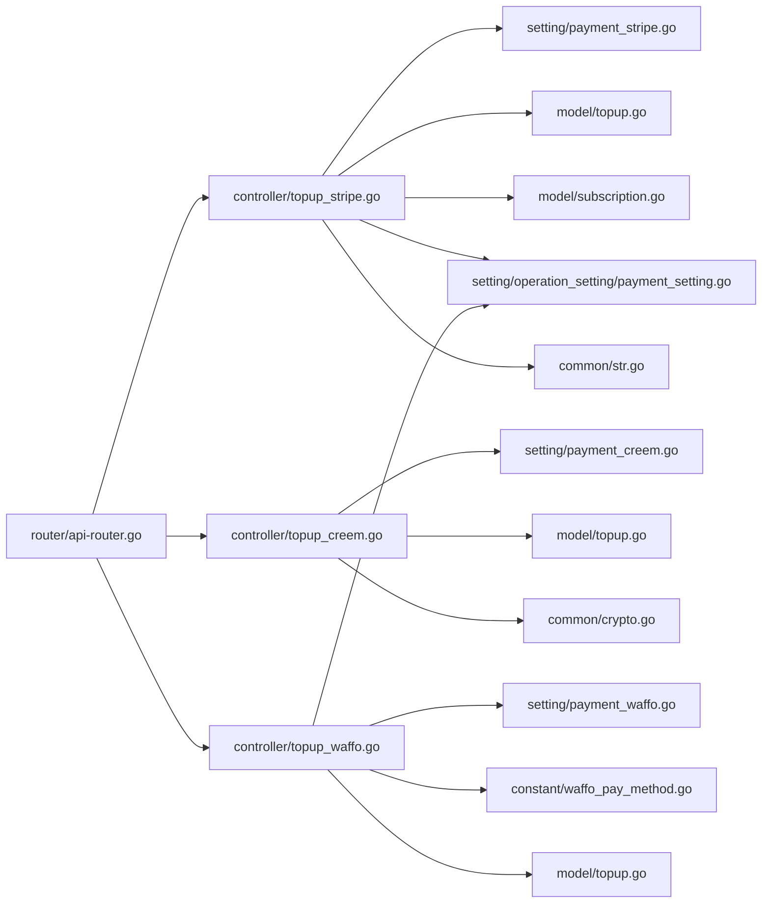

# 支付服务提供商

<cite>
**本文档引用的文件**
- [payment_stripe.go](file://setting/payment_stripe.go)
- [payment_creem.go](file://setting/payment_creem.go)
- [payment_waffo.go](file://setting/payment_waffo.go)
- [waffo_pay_method.go](file://constant/waffo_pay_method.go)
- [topup_stripe.go](file://controller/topup_stripe.go)
- [topup_creem.go](file://controller/topup_creem.go)
- [topup_waffo.go](file://controller/topup_waffo.go)
- [topup.go](file://model/topup.go)
- [billing.go](file://service/billing.go)
- [api-router.go](file://router/api-router.go)
- [payment_setting.go](file://setting/operation_setting/payment_setting.go)
- [crypto.go](file://common/crypto.go)
- [str.go](file://common/str.go)
- [keys.go](file://i18n/keys.go)
- [subscription.go](file://model/subscription.go)
</cite>

## 目录
1. [简介](#简介)
2. [项目结构](#项目结构)
3. [核心组件](#核心组件)
4. [架构总览](#架构总览)
5. [详细组件分析](#详细组件分析)
6. [依赖关系分析](#依赖关系分析)
7. [性能考量](#性能考量)
8. [故障排除指南](#故障排除指南)
9. [结论](#结论)
10. [附录](#附录)

## 简介
本文件面向支付服务提供商集成，系统性梳理并说明以下第三方支付网关的集成方案：
- Stripe：基于 Checkout Session 的一次性支付，支持促销码与 Webhook 状态同步。
- Creem：自研支付网关，采用 HMAC-SHA256 签名验证与回调处理。
- Waffo：本地化支付网关，统一以美元计价，支持多种支付方式与签名验证。

文档覆盖集成配置、API 密钥设置、回调处理、支付流程（订单创建、支付确认、状态同步）、金额与货币处理、安全措施（签名验证、防重放、幂等）、失败处理与退款、对账与监控建议等内容。

## 项目结构
支付相关代码主要分布在以下模块：
- 配置层：各支付网关的密钥与参数配置
- 控制器层：对外暴露的支付接口与回调入口
- 模型层：充值订单持久化与额度变更
- 服务层：计费会话与结算辅助
- 路由层：Webhook 路由注册
- 常量与国际化：支付方式定义与提示文案键

**图表来源**
- [payment_stripe.go:1-9](file://setting/payment_stripe.go#L1-L9)
- [payment_creem.go:1-7](file://setting/payment_creem.go#L1-L7)
- [payment_waffo.go:1-68](file://setting/payment_waffo.go#L1-L68)
- [waffo_pay_method.go:1-17](file://constant/waffo_pay_method.go#L1-L17)
- [payment_setting.go:1-24](file://setting/operation_setting/payment_setting.go#L1-L24)
- [topup_stripe.go:1-427](file://controller/topup_stripe.go#L1-L427)
- [topup_creem.go:1-466](file://controller/topup_creem.go#L1-L466)
- [topup_waffo.go:1-381](file://controller/topup_waffo.go#L1-L381)
- [topup.go:1-452](file://model/topup.go#L1-L452)
- [subscription.go:507-549](file://model/subscription.go#L507-L549)
- [billing.go:1-79](file://service/billing.go#L1-L79)
- [api-router.go:49-51](file://router/api-router.go#L49-L51)
- [crypto.go:1-33](file://common/crypto.go#L1-L33)
- [str.go:63-124](file://common/str.go#L63-L124)
- [keys.go:143-164](file://i18n/keys.go#L143-L164)

**章节来源**
- [payment_stripe.go:1-9](file://setting/payment_stripe.go#L1-L9)
- [payment_creem.go:1-7](file://setting/payment_creem.go#L1-L7)
- [payment_waffo.go:1-68](file://setting/payment_waffo.go#L1-L68)
- [waffo_pay_method.go:1-17](file://constant/waffo_pay_method.go#L1-L17)
- [payment_setting.go:1-24](file://setting/operation_setting/payment_setting.go#L1-L24)
- [topup_stripe.go:1-427](file://controller/topup_stripe.go#L1-L427)
- [topup_creem.go:1-466](file://controller/topup_creem.go#L1-L466)
- [topup_waffo.go:1-381](file://controller/topup_waffo.go#L1-L381)
- [topup.go:1-452](file://model/topup.go#L1-L452)
- [subscription.go:507-549](file://model/subscription.go#L507-L549)
- [billing.go:1-79](file://service/billing.go#L1-L79)
- [api-router.go:49-51](file://router/api-router.go#L49-L51)
- [crypto.go:1-33](file://common/crypto.go#L1-L33)
- [str.go:63-124](file://common/str.go#L63-L124)
- [keys.go:143-164](file://i18n/keys.go#L143-L164)

## 核心组件
- 支付配置变量
  - Stripe：密钥、Webhook 密钥、价格 ID、单价、最小充值、促销码开关
  - Creem：API Key、产品列表、测试模式、Webhook 密钥
  - Waffo：启用开关、API Key、私钥、公钥、沙盒配置、商户号、回调/跳转地址、币种、单价、最小充值
- 支付适配器与控制器
  - Stripe：请求金额计算、创建 Checkout 会话、Webhook 事件处理（完成、过期、异步支付结果）
  - Creem：请求支付、生成支付链接、回调签名验证、支付完成处理
  - Waffo：请求支付、SDK 初始化、回调签名验证、支付完成处理
- 订单与额度
  - TopUp 模型：订单持久化、状态流转、额度充值、日志记录
  - 订阅订单：订阅类订单的幂等完成与快照创建
- 计费与结算
  - Billing 会话：预扣费与后结算，支持订阅与钱包两种来源
- 路由与安全
  - Webhook 路由注册
  - HMAC 与签名工具
  - 参数校验与重放防护

**章节来源**
- [payment_stripe.go:1-9](file://setting/payment_stripe.go#L1-L9)
- [payment_creem.go:1-7](file://setting/payment_creem.go#L1-L7)
- [payment_waffo.go:1-68](file://setting/payment_waffo.go#L1-L68)
- [topup_stripe.go:1-427](file://controller/topup_stripe.go#L1-L427)
- [topup_creem.go:1-466](file://controller/topup_creem.go#L1-L466)
- [topup_waffo.go:1-381](file://controller/topup_waffo.go#L1-L381)
- [topup.go:1-452](file://model/topup.go#L1-L452)
- [subscription.go:507-549](file://model/subscription.go#L507-L549)
- [billing.go:1-79](file://service/billing.go#L1-L79)
- [api-router.go:49-51](file://router/api-router.go#L49-L51)
- [crypto.go:1-33](file://common/crypto.go#L1-L33)
- [str.go:63-124](file://common/str.go#L63-L124)

## 架构总览
支付流程在“请求支付—创建订单—跳转支付—回调确认—额度入账”的闭环内运行，Stripe 与 Waffo 通过各自 SDK 或 API 创建支付会话，Creem 通过外部 Checkout 接口；回调阶段均进行签名验证与幂等处理，最终调用模型层完成额度充值与日志记录。

**图表来源**
- [topup_stripe.go:68-126](file://controller/topup_stripe.go#L68-L126)
- [topup_creem.go:68-144](file://controller/topup_creem.go#L68-L144)
- [topup_waffo.go:103-270](file://controller/topup_waffo.go#L103-L270)
- [topup.go:60-111](file://model/topup.go#L60-L111)
- [api-router.go:49-51](file://router/api-router.go#L49-L51)

## 详细组件分析

### Stripe 集成
- 配置要点
  - API 密钥与 Webhook 密钥必须正确配置，否则拒绝处理回调
  - 价格 ID、单价、最小充值、促销码开关通过配置项控制
- 支付流程
  - 计算应付金额：根据显示单位（美元/人民币/Token）与分组折扣、金额折扣计算
  - 创建 Checkout 会话：自动为客户创建或复用客户，支持自定义成功/取消跳转地址
  - 回调处理：完成、过期、异步支付成功/失败事件分别处理
- 安全与幂等
  - 使用官方 Webhook 构造函数进行验签
  - 对订单号加锁，避免并发重复入账
  - 订阅与充值订单分别处理，确保幂等
- 金额与货币
  - 金额以美分为单位，Stripe 会话中使用价格 ID 与数量
- 失败与对账
  - 异步支付失败事件将订单标记为失败
  - 对账可通过订单状态与回调日志核对

**图表来源**
- [topup_stripe.go:68-126](file://controller/topup_stripe.go#L68-L126)
- [topup_stripe.go:148-187](file://controller/topup_stripe.go#L148-L187)
- [topup_stripe.go:189-286](file://controller/topup_stripe.go#L189-L286)
- [topup.go:60-111](file://model/topup.go#L60-L111)

**章节来源**
- [payment_stripe.go:1-9](file://setting/payment_stripe.go#L1-L9)
- [topup_stripe.go:1-427](file://controller/topup_stripe.go#L1-L427)
- [topup.go:1-452](file://model/topup.go#L1-L452)

### Creem 集成
- 配置要点
  - API Key、产品列表、测试模式、Webhook 密钥
  - 产品列表为 JSON 数组，包含 productId/name/price/currency/quota
- 支付流程
  - 选择产品后创建本地订单，再调用 Creem API 获取 Checkout URL
  - 回调携带签名头，需进行 HMAC-SHA256 验签
- 安全与幂等
  - 回调验签失败直接拒绝
  - 通过订单号加锁，避免重复处理
  - 支持订阅与一次性充值两类订单
- 金额与货币
  - 以 Creem 返回的金额与币种为准，直接使用产品配置的 quota 与 price

**图表来源**
- [topup_creem.go:68-144](file://controller/topup_creem.go#L68-L144)
- [topup_creem.go:232-284](file://controller/topup_creem.go#L232-L284)
- [topup_creem.go:286-366](file://controller/topup_creem.go#L286-L366)
- [crypto.go:11-21](file://common/crypto.go#L11-L21)

**章节来源**
- [payment_creem.go:1-7](file://setting/payment_creem.go#L1-L7)
- [topup_creem.go:1-466](file://controller/topup_creem.go#L1-L466)
- [topup.go:315-388](file://model/topup.go#L315-L388)
- [crypto.go:1-33](file://common/crypto.go#L1-L33)

### Waffo 集成
- 配置要点
  - 启用开关、API Key、私钥、公钥、沙盒/生产环境切换
  - 支付方式列表：名称、图标、支付方式类型/名称
  - 商户号、回调/跳转地址、币种、单价、最小充值
- 支付流程
  - 服务端解析支付方式索引或兼容字段，构造订单参数
  - 调用 Waffo SDK 创建订单，返回支付 URL
  - 回调验签通过后完成订单与额度充值
- 安全与幂等
  - 使用 SDK 提供的签名验证方法
  - 订单号加锁，失败订单标记为失败，避免悬置
- 金额与货币
  - 统一以目标币种计价，零小数位币种不带小数
  - 显示单位为 Token 时进行归一化处理

**图表来源**
- [topup_waffo.go:103-270](file://controller/topup_waffo.go#L103-L270)
- [topup_waffo.go:288-381](file://controller/topup_waffo.go#L288-L381)
- [payment_waffo.go:27-67](file://setting/payment_waffo.go#L27-L67)
- [waffo_pay_method.go:1-17](file://constant/waffo_pay_method.go#L1-L17)

**章节来源**
- [payment_waffo.go:1-68](file://setting/payment_waffo.go#L1-L68)
- [waffo_pay_method.go:1-17](file://constant/waffo_pay_method.go#L1-L17)
- [topup_waffo.go:1-381](file://controller/topup_waffo.go#L1-L381)
- [topup.go:390-451](file://model/topup.go#L390-L451)

### 订单与额度处理
- 订单模型
  - 字段：用户 ID、数量、金额、交易号、支付方式、时间戳、状态
  - 方法：插入、更新、按 ID/交易号查询、分页查询、管理员检索
- 充值逻辑
  - Stripe：锁定订单、校验支付方式与状态、更新完成时间与状态、按金额换算额度入账
  - Creem：锁定订单、校验支付方式与状态、更新完成时间与状态、按产品额度入账
  - Waffo：锁定订单、幂等处理、按金额换算额度入账
- 订阅订单
  - 幂等完成：创建用户订阅快照、更新订阅充值记录、标记成功

**图表来源**
- [topup.go:60-111](file://model/topup.go#L60-L111)
- [topup.go:315-388](file://model/topup.go#L315-L388)
- [topup.go:390-451](file://model/topup.go#L390-L451)
- [subscription.go:507-549](file://model/subscription.go#L507-L549)

**章节来源**
- [topup.go:1-452](file://model/topup.go#L1-L452)
- [subscription.go:507-549](file://model/subscription.go#L507-L549)

### 计费与结算
- 预扣费与后结算
  - 根据用户计费偏好创建 BillingSession，支持 subscription_first/wallet_first 等策略
  - 实际用量与预扣量差异进行补扣或返还
  - 订阅计费与钱包计费分别触发通知

**章节来源**
- [billing.go:1-79](file://service/billing.go#L1-L79)

## 依赖关系分析
- 控制器依赖配置与模型
  - Stripe/Creem/Waffo 控制器均依赖对应配置变量、系统设置、模型层进行订单与额度操作
- Webhook 路由
  - 路由层统一注册 /api/stripe/webhook、/api/creem/webhook、/api/waffo/webhook
- 安全工具
  - HMAC 与密码哈希工具被 Creem 签名与通用加密使用
- 参数校验
  - URL 白名单校验、金额/数量边界检查、显示单位与折扣联动

**图表来源**
- [api-router.go:49-51](file://router/api-router.go#L49-L51)
- [topup_stripe.go:1-427](file://controller/topup_stripe.go#L1-L427)
- [topup_creem.go:1-466](file://controller/topup_creem.go#L1-L466)
- [topup_waffo.go:1-381](file://controller/topup_waffo.go#L1-L381)
- [payment_stripe.go:1-9](file://setting/payment_stripe.go#L1-L9)
- [payment_creem.go:1-7](file://setting/payment_creem.go#L1-L7)
- [payment_waffo.go:1-68](file://setting/payment_waffo.go#L1-L68)
- [waffo_pay_method.go:1-17](file://constant/waffo_pay_method.go#L1-L17)
- [topup.go:1-452](file://model/topup.go#L1-L452)
- [subscription.go:507-549](file://model/subscription.go#L507-L549)
- [payment_setting.go:1-24](file://setting/operation_setting/payment_setting.go#L1-L24)
- [crypto.go:1-33](file://common/crypto.go#L1-L33)
- [str.go:63-124](file://common/str.go#L63-L124)

**章节来源**
- [api-router.go:49-51](file://router/api-router.go#L49-L51)
- [topup_stripe.go:1-427](file://controller/topup_stripe.go#L1-L427)
- [topup_creem.go:1-466](file://controller/topup_creem.go#L1-L466)
- [topup_waffo.go:1-381](file://controller/topup_waffo.go#L1-L381)
- [payment_stripe.go:1-9](file://setting/payment_stripe.go#L1-L9)
- [payment_creem.go:1-7](file://setting/payment_creem.go#L1-L7)
- [payment_waffo.go:1-68](file://setting/payment_waffo.go#L1-L68)
- [waffo_pay_method.go:1-17](file://constant/waffo_pay_method.go#L1-L17)
- [topup.go:1-452](file://model/topup.go#L1-L452)
- [subscription.go:507-549](file://model/subscription.go#L507-L549)
- [payment_setting.go:1-24](file://setting/operation_setting/payment_setting.go#L1-L24)
- [crypto.go:1-33](file://common/crypto.go#L1-L33)
- [str.go:63-124](file://common/str.go#L63-L124)

## 性能考量
- 并发控制
  - 订单号加锁（按交易号 FOR UPDATE）避免并发重复处理与超扣
- 数据库事务
  - 充值与额度更新在同一事务内完成，保证一致性
- 金额计算
  - 使用浮点计算满足小额场景，注意精度与舍入策略
- 网络调用
  - Stripe 与 Waffo SDK 调用需考虑超时与重试策略
- 日志与监控
  - 回调日志、订单状态变化、异常计数应纳入监控

[本节为通用指导，无需特定文件来源]

## 故障排除指南
- Stripe
  - Webhook 密钥未配置：回调直接拒绝
  - 验签失败：检查密钥与版本兼容
  - 异步支付失败：回调将订单标记为失败
- Creem
  - 缺少签名头或验签失败：回调直接拒绝
  - 产品配置错误：解析失败导致创建订单失败
- Waffo
  - SDK 初始化失败：检查 API Key/私钥/公钥/环境配置
  - 签名验证失败：检查回调头 X-SIGNATURE
- 通用
  - 订单状态非 Pending：幂等处理直接忽略
  - 金额过低/超出限制：控制器侧拦截并返回错误
  - 国际化提示键：参考支付相关键值定位问题

**章节来源**
- [topup_stripe.go:148-187](file://controller/topup_stripe.go#L148-L187)
- [topup_stripe.go:219-253](file://controller/topup_stripe.go#L219-L253)
- [topup_creem.go:232-284](file://controller/topup_creem.go#L232-L284)
- [topup_creem.go:286-366](file://controller/topup_creem.go#L286-L366)
- [topup_waffo.go:288-381](file://controller/topup_waffo.go#L288-L381)
- [keys.go:143-164](file://i18n/keys.go#L143-L164)

## 结论
该支付体系通过清晰的配置、严格的签名验证与幂等处理，实现了 Stripe、Creem、Waffo 三类支付网关的统一接入。结合订单模型与计费服务，能够稳定支撑充值与订阅场景。建议在生产环境中严格配置密钥与回调地址，完善监控与告警，确保支付安全与一致性。

[本节为总结，无需特定文件来源]

## 附录

### 集成配置清单
- Stripe
  - 必填：API 密钥、Webhook 密钥、价格 ID
  - 可选：促销码开关、最小充值、单价
- Creem
  - 必填：API Key、产品列表(JSON)、Webhook 密钥
  - 可选：测试模式
- Waffo
  - 必填：启用开关、API Key、私钥、公钥、支付方式列表
  - 可选：沙盒开关、商户号、回调/跳转地址、币种、单价、最小充值

**章节来源**
- [payment_stripe.go:1-9](file://setting/payment_stripe.go#L1-L9)
- [payment_creem.go:1-7](file://setting/payment_creem.go#L1-L7)
- [payment_waffo.go:1-68](file://setting/payment_waffo.go#L1-L68)
- [waffo_pay_method.go:1-17](file://constant/waffo_pay_method.go#L1-L17)

### Webhook 路由
- /api/stripe/webhook
- /api/creem/webhook
- /api/waffo/webhook

**章节来源**
- [api-router.go:49-51](file://router/api-router.go#L49-L51)

### 金额与货币处理要点
- Stripe：以美分为单位，使用价格 ID 与数量
- Creem：以 Creem 返回金额为准
- Waffo：统一目标币种，零小数位币种不带小数；Token 显示单位需归一化

**章节来源**
- [topup_stripe.go:399-418](file://controller/topup_stripe.go#L399-L418)
- [topup_waffo.go:62-93](file://controller/topup_waffo.go#L62-L93)
- [topup.go:315-388](file://model/topup.go#L315-L388)

### 安全措施
- Stripe：官方 Webhook 验签
- Creem：HMAC-SHA256 签名验证
- Waffo：SDK 提供签名验证
- 重放防护：订单号加锁、幂等处理、状态校验
- 数据加密：密码哈希、通用 HMAC 工具

**章节来源**
- [topup_stripe.go:162-171](file://controller/topup_stripe.go#L162-L171)
- [topup_creem.go:38-50](file://controller/topup_creem.go#L38-L50)
- [topup_waffo.go:309-313](file://controller/topup_waffo.go#L309-L313)
- [crypto.go:11-21](file://common/crypto.go#L11-L21)