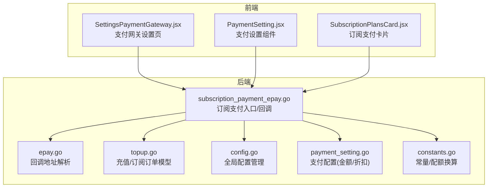
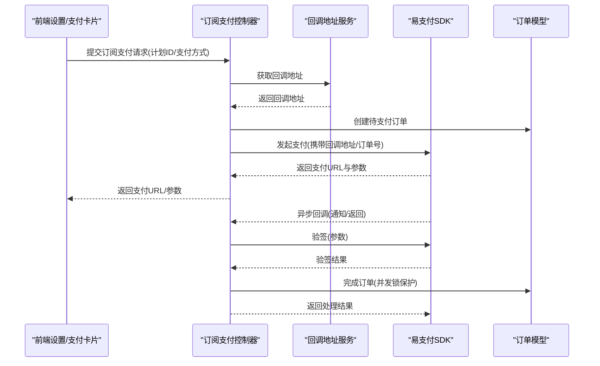
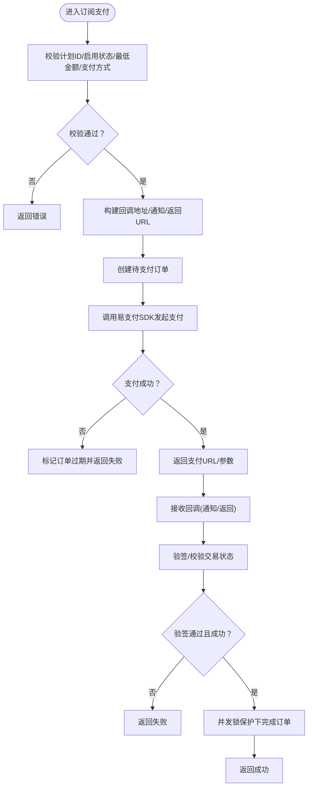
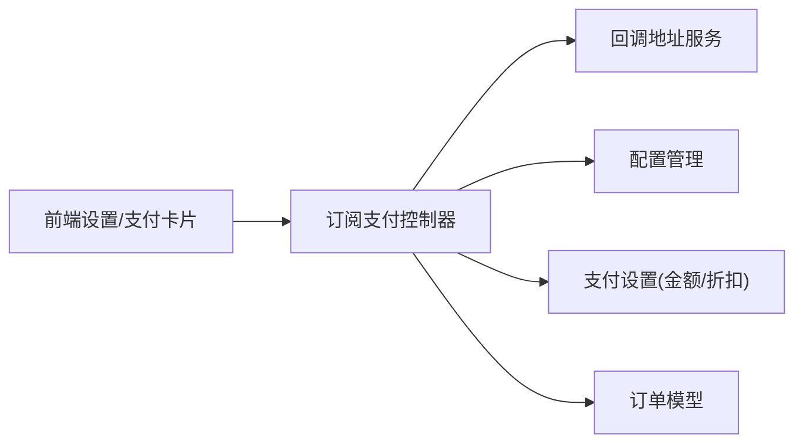

# 易支付集成

<cite>
**本文引用的文件**
- [subscription_payment_epay.go](file://controller/subscription_payment_epay.go)
- [epay.go](file://service/epay.go)
- [config.go](file://setting/config/config.go)
- [payment_setting.go](file://setting/operation_setting/payment_setting.go)
- [constants.go](file://common/constants.go)
- [topup.go](file://model/topup.go)
- [SettingsPaymentGateway.jsx](file://web/src/pages/Setting/Payment/SettingsPaymentGateway.jsx)
- [PaymentSetting.jsx](file://web/src/components/settings/PaymentSetting.jsx)
- [SubscriptionPlansCard.jsx](file://web/src/components/topup/SubscriptionPlansCard.jsx)
- [topup.go](file://controller/topup.go)
</cite>

## 目录
1. [简介](#简介)
2. [项目结构](#项目结构)
3. [核心组件](#核心组件)
4. [架构总览](#架构总览)
5. [组件详解](#组件详解)
6. [依赖关系分析](#依赖关系分析)
7. [性能考量](#性能考量)
8. [故障排除指南](#故障排除指南)
9. [结论](#结论)
10. [附录](#附录)

## 简介
本文件面向需要在系统中集成“易支付”（EPay）网关的开发者与运维人员，提供从配置到支付流程、回调处理、订单状态管理、安全防护、失败处理与对账的完整技术文档。内容覆盖：
- 易支付商户 ID、密钥与支付方式配置
- 支付方式支持、金额计算与折扣配置
- 签名验证、回调处理与订单状态同步
- 前端支付页面集成与后端回调对接
- 安全措施（签名验证、防重放、数据保护）
- 支付失败处理、退款与对账建议
- 故障排除与监控配置建议

## 项目结构
易支付集成涉及后端控制器、服务层、配置管理、模型与前端设置页/支付卡片组件。下图展示与易支付相关的关键模块与交互：

图表来源
- [subscription_payment_epay.go:1-217](file://controller/subscription_payment_epay.go#L1-L217)
- [epay.go:1-14](file://service/epay.go#L1-L14)
- [config.go:1-298](file://setting/config/config.go#L1-L298)
- [payment_setting.go:1-24](file://setting/operation_setting/payment_setting.go#L1-L24)
- [constants.go:1-200](file://common/constants.go#L1-L200)
- [topup.go:1-200](file://model/topup.go#L1-L200)
- [SettingsPaymentGateway.jsx:32-250](file://web/src/pages/Setting/Payment/SettingsPaymentGateway.jsx#L32-L250)
- [PaymentSetting.jsx:30-53](file://web/src/components/settings/Payment/SettingsPaymentGateway.jsx#L30-L53)
- [SubscriptionPlansCard.jsx:42-91](file://web/src/components/topup/SubscriptionPlansCard.jsx#L42-L91)

章节来源
- [subscription_payment_epay.go:1-217](file://controller/subscription_payment_epay.go#L1-L217)
- [epay.go:1-14](file://service/epay.go#L1-L14)
- [config.go:1-298](file://setting/config/config.go#L1-L298)
- [payment_setting.go:1-24](file://setting/operation_setting/payment_setting.go#L1-L24)
- [constants.go:1-200](file://common/constants.go#L1-L200)
- [topup.go:1-200](file://model/topup.go#L1-L200)
- [SettingsPaymentGateway.jsx:32-250](file://web/src/pages/Setting/Payment/SettingsPaymentGateway.jsx#L32-L250)
- [PaymentSetting.jsx:30-53](file://web/src/components/settings/PaymentSetting.jsx#L30-L53)
- [SubscriptionPlansCard.jsx:42-91](file://web/src/components/topup/SubscriptionPlansCard.jsx#L42-L91)

## 核心组件
- 易支付控制器：负责发起支付、接收回调、校验签名、完成订单。
- 回调地址服务：根据运营配置决定回调地址来源（优先自定义回调地址，否则回退到系统地址）。
- 配置管理：统一注册与持久化支付相关配置（含金额选项与折扣）。
- 订单模型：提供充值/订阅订单的创建、查询、状态变更与并发控制。
- 前端设置页与支付卡片：提供易支付商户信息录入、支付方式选择与提交。

章节来源
- [subscription_payment_epay.go:25-112](file://controller/subscription_payment_epay.go#L25-L112)
- [epay.go:8-13](file://service/epay.go#L8-L13)
- [config.go:27-90](file://setting/config/config.go#L27-L90)
- [payment_setting.go:5-24](file://setting/operation_setting/payment_setting.go#L5-L24)
- [topup.go:14-38](file://model/topup.go#L14-L38)
- [SettingsPaymentGateway.jsx:32-182](file://web/src/pages/Setting/Payment/SettingsPaymentGateway.jsx#L32-L182)
- [SubscriptionPlansCard.jsx:42-91](file://web/src/components/topup/SubscriptionPlansCard.jsx#L42-L91)

## 架构总览
易支付集成采用“前端设置 → 后端控制器 → 易支付SDK → 回调校验 → 订单完成”的闭环流程。回调地址由服务层统一解析，确保一致性与可配置性。

图表来源
- [subscription_payment_epay.go:25-112](file://controller/subscription_payment_epay.go#L25-L112)
- [epay.go:8-13](file://service/epay.go#L8-L13)
- [topup.go:83-111](file://model/topup.go#L83-L111)

章节来源
- [subscription_payment_epay.go:25-112](file://controller/subscription_payment_epay.go#L25-L112)
- [epay.go:8-13](file://service/epay.go#L8-L13)
- [topup.go:83-111](file://model/topup.go#L83-L111)

## 组件详解

### 易支付控制器（订阅支付）
- 参数校验：计划ID、启用状态、最低金额、支付方式是否在运营配置中。
- 回调地址：从服务层获取，支持自定义回调地址优先。
- 订单创建：生成唯一交易号，写入待支付状态。
- 发起支付：通过易支付SDK构造支付参数（类型、订单号、名称、金额、设备、回调地址），返回支付URL与参数。
- 回调处理（通知/返回）：解析参数、验签、判断交易状态、并发锁保护下完成订单；返回成功/失败响应。

图表来源
- [subscription_payment_epay.go:25-112](file://controller/subscription_payment_epay.go#L25-L112)
- [subscription_payment_epay.go:114-165](file://controller/subscription_payment_epay.go#L114-L165)
- [subscription_payment_epay.go:169-216](file://controller/subscription_payment_epay.go#L169-L216)

章节来源
- [subscription_payment_epay.go:25-112](file://controller/subscription_payment_epay.go#L25-L112)
- [subscription_payment_epay.go:114-165](file://controller/subscription_payment_epay.go#L114-L165)
- [subscription_payment_epay.go:169-216](file://controller/subscription_payment_epay.go#L169-L216)

### 回调地址服务
- 优先使用运营配置中的自定义回调地址；若为空则回退到系统地址。
- 保证前后端回调地址一致，避免跨域或地址不匹配导致的回调失败。

章节来源
- [epay.go:8-13](file://service/epay.go#L8-L13)

### 配置管理与支付设置
- 全局配置管理器统一注册与持久化配置模块。
- 支付设置包含金额选项与折扣映射，用于前端展示与促销策略。

章节来源
- [config.go:27-90](file://setting/config/config.go#L27-L90)
- [payment_setting.go:5-24](file://setting/operation_setting/payment_setting.go#L5-L24)

### 订单模型与并发控制
- 订单创建/更新/查询等基础操作。
- 充值场景下使用数据库行级锁保障幂等与并发安全。
- 订单完成后记录日志与配额变更。

章节来源
- [topup.go:14-38](file://model/topup.go#L14-L38)
- [topup.go:60-111](file://model/topup.go#L60-L111)

### 前端集成要点
- 设置页：录入易支付商户ID、密钥、回调地址、支付方式、金额选项与折扣。
- 支付卡片：过滤非易支付方式，构造隐藏表单并提交至易支付支付页。

章节来源
- [SettingsPaymentGateway.jsx:32-182](file://web/src/pages/Setting/Payment/SettingsPaymentGateway.jsx#L32-L182)
- [PaymentSetting.jsx:30-53](file://web/src/components/settings/PaymentSetting.jsx#L30-L53)
- [SubscriptionPlansCard.jsx:42-91](file://web/src/components/topup/SubscriptionPlansCard.jsx#L42-L91)

## 依赖关系分析
- 控制器依赖服务层获取回调地址，依赖配置模块进行支付方式校验与金额/折扣读取，依赖模型完成订单生命周期管理。
- 前端设置页与支付卡片依赖后端接口暴露的支付能力与配置。

图表来源
- [subscription_payment_epay.go:1-217](file://controller/subscription_payment_epay.go#L1-L217)
- [epay.go:1-14](file://service/epay.go#L1-L14)
- [config.go:1-298](file://setting/config/config.go#L1-L298)
- [payment_setting.go:1-24](file://setting/operation_setting/payment_setting.go#L1-L24)
- [topup.go:1-200](file://model/topup.go#L1-L200)
- [SettingsPaymentGateway.jsx:32-250](file://web/src/pages/Setting/Payment/SettingsPaymentGateway.jsx#L32-L250)
- [SubscriptionPlansCard.jsx:42-91](file://web/src/components/topup/SubscriptionPlansCard.jsx#L42-L91)

章节来源
- [subscription_payment_epay.go:1-217](file://controller/subscription_payment_epay.go#L1-L217)
- [epay.go:1-14](file://service/epay.go#L1-L14)
- [config.go:1-298](file://setting/config/config.go#L1-L298)
- [payment_setting.go:1-24](file://setting/operation_setting/payment_setting.go#L1-L24)
- [topup.go:1-200](file://model/topup.go#L1-L200)
- [SettingsPaymentGateway.jsx:32-250](file://web/src/pages/Setting/Payment/SettingsPaymentGateway.jsx#L32-L250)
- [SubscriptionPlansCard.jsx:42-91](file://web/src/components/topup/SubscriptionPlansCard.jsx#L42-L91)

## 性能考量
- 并发锁保护：回调处理中对订单号加锁，避免重复处理与并发写冲突。
- 数据库事务：充值场景使用事务与行级锁，确保状态一致性与原子性。
- 配置缓存：全局配置管理器集中注册与持久化，减少重复解析成本。
- 回调地址复用：统一服务层解析，避免重复拼接与错误。

章节来源
- [subscription_payment_epay.go:156-164](file://controller/subscription_payment_epay.go#L156-L164)
- [topup.go:73-111](file://model/topup.go#L73-L111)
- [config.go:27-90](file://setting/config/config.go#L27-L90)
- [epay.go:8-13](file://service/epay.go#L8-L13)

## 故障排除指南
- 回调地址为空或错误
  - 确认运营配置中已填写自定义回调地址或系统地址有效。
  - 检查控制器中回调地址拼接逻辑。
  - 参考：[epay.go:8-13](file://service/epay.go#L8-L13)、[subscription_payment_epay.go:63-73](file://controller/subscription_payment_epay.go#L63-L73)
- 支付发起失败
  - 检查易支付商户ID、密钥与支付地址是否正确配置。
  - 查看控制器创建订单与调用SDK的错误分支。
  - 参考：[subscription_payment_epay.go:78-111](file://controller/subscription_payment_epay.go#L78-L111)、[topup.go:112-124](file://controller/topup.go#L112-L124)
- 回调验签失败
  - 确认回调参数完整、签名算法与密钥一致。
  - 检查控制器验签与交易状态判断逻辑。
  - 参考：[subscription_payment_epay.go:140-164](file://controller/subscription_payment_epay.go#L140-L164)
- 订单状态异常
  - 检查并发锁是否正确释放、事务是否回滚。
  - 参考：[subscription_payment_epay.go:156-164](file://controller/subscription_payment_epay.go#L156-L164)、[topup.go:73-111](file://model/topup.go#L73-L111)
- 前端无法显示易支付方式
  - 确认运营配置中的支付方式列表包含易支付类型。
  - 参考：[SettingsPaymentGateway.jsx:32-182](file://web/src/pages/Setting/Payment/SettingsPaymentGateway.jsx#L32-L182)、[SubscriptionPlansCard.jsx:42-91](file://web/src/components/topup/SubscriptionPlansCard.jsx#L42-L91)

章节来源
- [epay.go:8-13](file://service/epay.go#L8-L13)
- [subscription_payment_epay.go:63-111](file://controller/subscription_payment_epay.go#L63-L111)
- [subscription_payment_epay.go:140-164](file://controller/subscription_payment_epay.go#L140-L164)
- [topup.go:73-111](file://model/topup.go#L73-L111)
- [SettingsPaymentGateway.jsx:32-182](file://web/src/pages/Setting/Payment/SettingsPaymentGateway.jsx#L32-L182)
- [SubscriptionPlansCard.jsx:42-91](file://web/src/components/topup/SubscriptionPlansCard.jsx#L42-L91)

## 结论
本方案通过清晰的控制器职责划分、统一的回调地址解析、严谨的验签与并发控制，以及完善的前端配置与支付卡片，实现了易支付网关的稳定集成。建议在生产环境：
- 严格管理易支付商户ID与密钥，避免明文泄露
- 开启回调验签与并发锁，防止重复处理
- 建立回调监控与重试机制，确保订单最终一致
- 对金额与折扣配置进行灰度发布与A/B测试

## 附录

### 集成步骤清单
- 后端
  - 配置易支付地址、商户ID、密钥
  - 配置支付方式与金额选项/折扣
  - 部署订阅支付控制器与回调路由
- 前端
  - 在设置页填写易支付配置
  - 在支付卡片中选择易支付方式并提交
- 测试
  - 本地/沙箱环境发起支付与回调
  - 校验订单状态与配额到账

章节来源
- [SettingsPaymentGateway.jsx:32-182](file://web/src/pages/Setting/Payment/SettingsPaymentGateway.jsx#L32-L182)
- [subscription_payment_epay.go:25-112](file://controller/subscription_payment_epay.go#L25-L112)
- [payment_setting.go:5-24](file://setting/operation_setting/payment_setting.go#L5-L24)