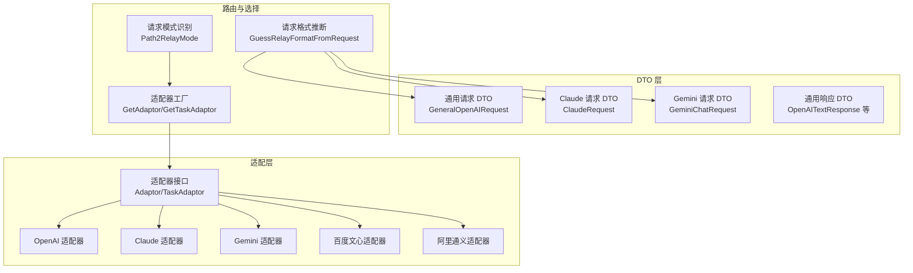
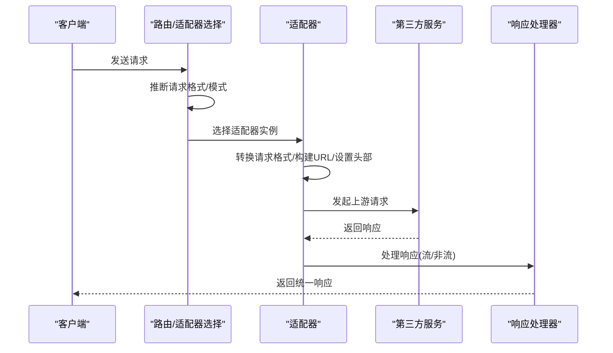
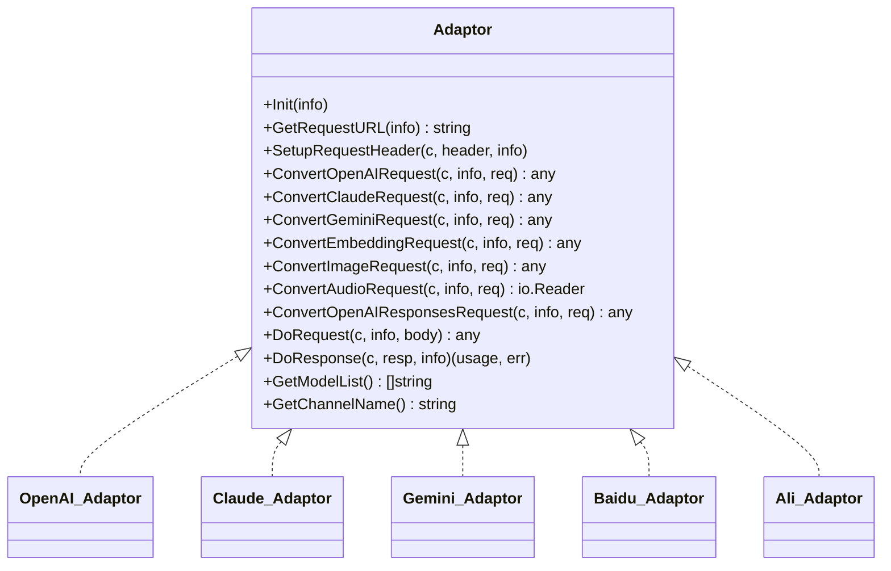
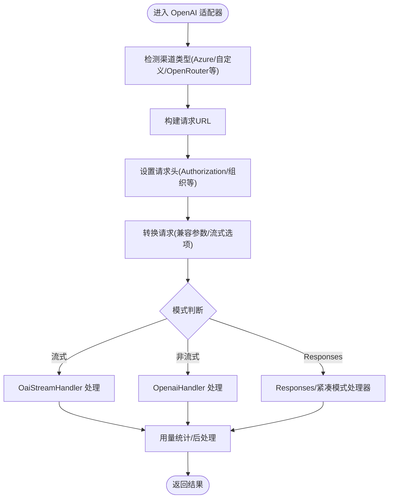
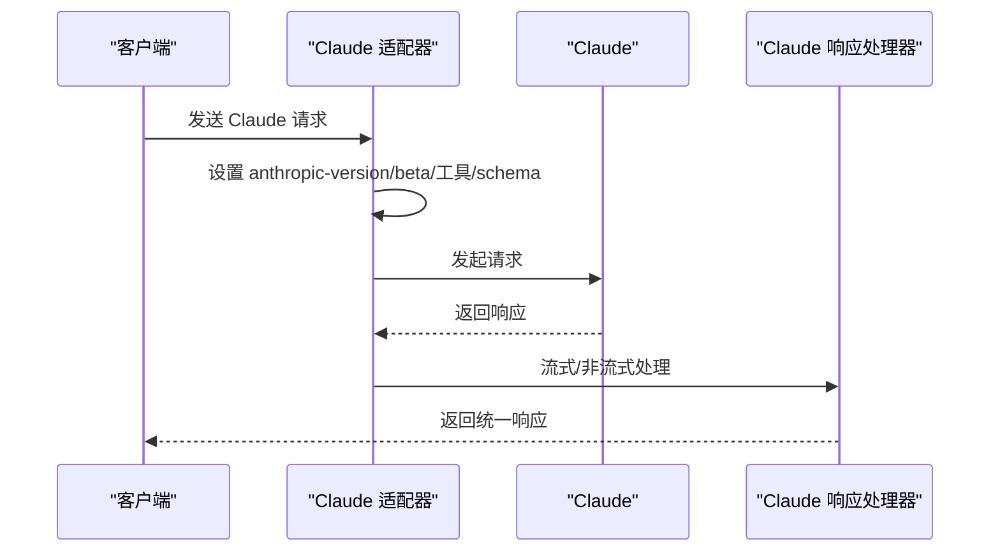
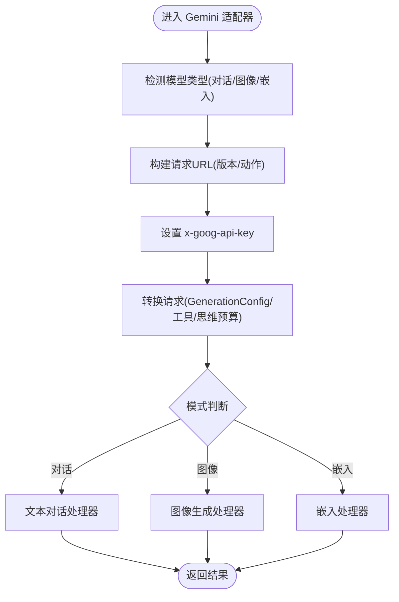
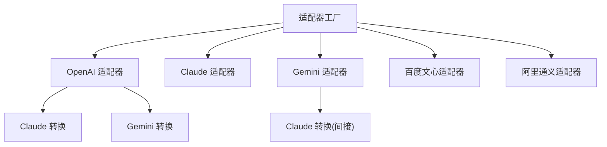

# 第三方服务集成

<cite>
**本文档引用的文件**
- [adapter.go](file://relay/channel/adapter.go)
- [relay_adaptor.go](file://relay/relay_adaptor.go)
- [openai_request.go](file://dto/openai_request.go)
- [openai_response.go](file://dto/openai_response.go)
- [request_conversion.go](file://relay/common/request_conversion.go)
- [adaptor.go](file://relay/channel/openai/adaptor.go)
- [adaptor.go](file://relay/channel/claude/adaptor.go)
- [adaptor.go](file://relay/channel/gemini/adaptor.go)
- [adaptor.go](file://relay/channel/baidu/adaptor.go)
- [adaptor.go](file://relay/channel/ali/adaptor.go)
- [api_type.go](file://constant/api_type.go)
- [relay_mode.go](file://relay/constant/relay_mode.go)
- [relay_info.go](file://relay/common/relay_info.go)
- [relay-openai.go](file://relay/channel/openai/relay-openai.go)
- [relay-claude.go](file://relay/channel/claude/relay-claude.go)
- [relay-gemini.go](file://relay/channel/gemini/relay-gemini.go)
- [claude.go](file://dto/claude.go)
- [gemini.go](file://dto/gemini.go)
</cite>

## 目录
1. [简介](#简介)
2. [项目结构](#项目结构)
3. [核心组件](#核心组件)
4. [架构总览](#架构总览)
5. [详细组件分析](#详细组件分析)
6. [依赖关系分析](#依赖关系分析)
7. [性能考虑](#性能考虑)
8. [故障排除指南](#故障排除指南)
9. [结论](#结论)
10. [附录](#附录)

## 简介
本文件面向 New API 的第三方服务集成功能，系统化梳理了对 OpenAI、Claude、Gemini、百度文心、阿里通义等主流 AI 服务的适配与集成方案。文档覆盖适配器接口设计、请求格式转换、响应处理、配置参数、使用限制、扩展方法、故障排除与性能优化等内容，帮助开发者快速完成多厂商服务的统一接入与稳定运行。

## 项目结构
New API 采用“适配器模式 + 统一请求转换”的架构，通过统一的适配器接口对接不同第三方服务，内部以 DTO 结构描述请求与响应，配合通用的请求转换与响应处理器，实现跨厂商的兼容与一致性。

**图表来源**
- [adapter.go:15-32](file://relay/channel/adapter.go#L15-L32)
- [relay_adaptor.go:53-127](file://relay/relay_adaptor.go#L53-L127)
- [request_conversion.go:8-29](file://relay/common/request_conversion.go#L8-L29)
- [relay_mode.go:57-95](file://relay/constant/relay_mode.go#L57-L95)

**章节来源**
- [adapter.go:15-32](file://relay/channel/adapter.go#L15-L32)
- [relay_adaptor.go:53-127](file://relay/relay_adaptor.go#L53-L127)
- [request_conversion.go:8-29](file://relay/common/request_conversion.go#L8-L29)
- [relay_mode.go:57-95](file://relay/constant/relay_mode.go#L57-L95)

## 核心组件
- 适配器接口：定义统一的请求/响应转换、请求构建、头部设置、模型列表与通道名等能力，支持文本、嵌入、图像、音频、Responses 等多种模式。
- 适配器工厂：根据 API 类型与任务平台选择具体适配器实例。
- 请求转换：基于请求体自动推断格式（OpenAI/Claude/Gemini/Embedding/Rerank/OpenAI Images/Audio），并记录转换链。
- 请求模式识别：根据路径判断聊天补全、嵌入、图像、音频、Responses、实时语音等模式。
- DTO 层：抽象各厂商请求/响应结构，提供统一的序列化/反序列化与字段访问方法。

**章节来源**
- [adapter.go:15-32](file://relay/channel/adapter.go#L15-L32)
- [relay_adaptor.go:53-127](file://relay/relay_adaptor.go#L53-L127)
- [openai_request.go:27-109](file://dto/openai_request.go#L27-L109)
- [openai_response.go:14-47](file://dto/openai_response.go#L14-L47)
- [request_conversion.go:8-29](file://relay/common/request_conversion.go#L8-L29)
- [relay_mode.go:57-95](file://relay/constant/relay_mode.go#L57-L95)

## 架构总览
New API 的第三方服务集成遵循“统一入口 + 适配器 + DTO + 通用处理器”的分层设计。请求进入后，先识别格式与模式，随后通过适配器将请求转换为目标厂商格式，发起上游请求并处理响应，最终返回统一的 OpenAI 兼容响应。

**图表来源**
- [relay_adaptor.go:53-127](file://relay/relay_adaptor.go#L53-L127)
- [request_conversion.go:8-29](file://relay/common/request_conversion.go#L8-L29)
- [relay_mode.go:57-95](file://relay/constant/relay_mode.go#L57-L95)
- [adaptor.go:111-187](file://relay/channel/openai/adaptor.go#L111-L187)
- [relay-openai.go:106-193](file://relay/channel/openai/relay-openai.go#L106-L193)

## 详细组件分析

### 适配器接口与工厂
- 适配器接口定义了 Init、GetRequestURL、SetupRequestHeader、各类 ConvertXxxRequest、DoRequest、DoResponse、GetModelList、GetChannelName 等方法，覆盖文本、嵌入、图像、音频、Responses、Claude、Gemini 等场景。
- 适配器工厂根据 API 类型映射到具体适配器实现，如 OpenAI、Claude、Gemini、百度文心、阿里通义等。
- 任务型适配器（TaskAdaptor）用于异步任务（如视频/图像生成），支持预估计费、提交后调整计费、轮询完成后的最终结算。

**图表来源**
- [adapter.go:15-32](file://relay/channel/adapter.go#L15-L32)
- [adaptor.go:37-40](file://relay/channel/openai/adaptor.go#L37-L40)
- [adaptor.go:19-20](file://relay/channel/claude/adaptor.go#L19-L20)
- [adaptor.go:23-24](file://relay/channel/gemini/adaptor.go#L23-L24)
- [adaptor.go:19-20](file://relay/channel/baidu/adaptor.go#L19-L20)
- [adaptor.go:23-25](file://relay/channel/ali/adaptor.go#L23-L25)

**章节来源**
- [adapter.go:15-32](file://relay/channel/adapter.go#L15-L32)
- [relay_adaptor.go:53-127](file://relay/relay_adaptor.go#L53-L127)

### OpenAI 适配器
- 功能特性
  - 支持将 Claude/Gemini 请求转换为 OpenAI 兼容格式，便于统一处理。
  - Azure/自定义渠道适配，支持实时语音（WebSocket）、Responses API（含紧凑模式）。
  - 流式与非流式响应处理，支持流式选项（stream_options）。
  - 思维内容（thinking）转内容的可选开关，以及推理效率（reasoning_effort）适配。
- 请求转换
  - ConvertOpenAIRequest：针对不同模型（如 o 系列、gpt-5）进行参数归一化与兼容处理。
  - ConvertClaudeRequest/ConvertGeminiRequest：委托 service 层转换为 OpenAI 请求。
  - ConvertAudioRequest/ConvertImageRequest：构建 multipart/form-data 或直接 JSON。
- 响应处理
  - OaiStreamHandler：逐条处理 SSE 流，支持思维内容合并与工具调用。
  - OpenaiHandler：非流式响应处理与用量统计。
  - Responses 相关处理器：支持 Responses 与紧凑模式。

**图表来源**
- [adaptor.go:111-187](file://relay/channel/openai/adaptor.go#L111-L187)
- [adaptor.go:243-364](file://relay/channel/openai/adaptor.go#L243-L364)
- [relay-openai.go:106-193](file://relay/channel/openai/relay-openai.go#L106-L193)

**章节来源**
- [adaptor.go:98-187](file://relay/channel/openai/adaptor.go#L98-L187)
- [adaptor.go:243-364](file://relay/channel/openai/adaptor.go#L243-L364)
- [relay-openai.go:106-193](file://relay/channel/openai/relay-openai.go#L106-L193)

### Claude 适配器
- 功能特性
  - 直接处理 Claude 请求，支持流式与非流式响应。
  - 自动注入 anthropic-version、anthropic-beta 等头部。
  - 工具（含网络搜索）与推理预算（thinking）适配。
- 请求转换
  - ConvertClaudeRequest：将 OpenAI 请求转换为 Claude 请求，含工具 schema、推理预算等。
  - ConvertOpenAIRequest：将通用 OpenAI 请求转换为 Claude 请求。
- 响应处理
  - ClaudeStreamHandler/ClaudeHandler：处理 Claude 响应，包含停止原因映射与拒绝标记。

**图表来源**
- [adaptor.go:82-92](file://relay/channel/claude/adaptor.go#L82-L92)
- [adaptor.go:94-99](file://relay/channel/claude/adaptor.go#L94-L99)
- [relay-claude.go:106-200](file://relay/channel/claude/relay-claude.go#L106-L200)

**章节来源**
- [adaptor.go:82-92](file://relay/channel/claude/adaptor.go#L82-L92)
- [adaptor.go:94-99](file://relay/channel/claude/adaptor.go#L94-L99)
- [claude.go:206-237](file://dto/claude.go#L206-L237)
- [relay-claude.go:106-200](file://relay/channel/claude/relay-claude.go#L106-L200)

### Gemini 适配器
- 功能特性
  - 支持文本对话、图像生成（Imagen）、嵌入（Embedding）等多种模式。
  - 思维预算（thinking budget）与推理等级（thinking level）适配。
  - SSE 流式响应与批量嵌入。
- 请求转换
  - ConvertGeminiRequest：规范化内容角色与媒体类型。
  - ConvertOpenAIRequest：将 OpenAI 请求转换为 Gemini 请求，含 generationConfig、工具等。
  - ConvertImageRequest：将尺寸/质量映射为 Gemini 图像参数。
- 响应处理
  - GeminiChatStreamHandler/GeminiChatHandler：文本对话。
  - GeminiImageHandler：图像生成。
  - GeminiEmbeddingHandler/NativeGeminiEmbeddingHandler：嵌入处理。

**图表来源**
- [adaptor.go:130-171](file://relay/channel/gemini/adaptor.go#L130-L171)
- [adaptor.go:179-190](file://relay/channel/gemini/adaptor.go#L179-L190)
- [adaptor.go:262-278](file://relay/channel/gemini/adaptor.go#L262-L278)
- [gemini.go:16-23](file://dto/gemini.go#L16-L23)

**章节来源**
- [adaptor.go:130-171](file://relay/channel/gemini/adaptor.go#L130-L171)
- [adaptor.go:179-190](file://relay/channel/gemini/adaptor.go#L179-L190)
- [adaptor.go:262-278](file://relay/channel/gemini/adaptor.go#L262-L278)
- [gemini.go:16-23](file://dto/gemini.go#L16-L23)

### 百度文心适配器
- 功能特性
  - 支持聊天与嵌入两种模式，自动拼接 access_token。
  - 不同模型映射到不同 RPC 接口。
- 请求转换
  - ConvertOpenAIRequest：将通用 OpenAI 请求转换为百度文心格式。
  - ConvertEmbeddingRequest：嵌入请求转换。
- 响应处理
  - baiduHandler/baiduEmbeddingHandler：分别处理聊天与嵌入响应。

**章节来源**
- [adaptor.go:47-113](file://relay/channel/baidu/adaptor.go#L47-L113)
- [adaptor.go:121-139](file://relay/channel/baidu/adaptor.go#L121-L139)
- [adaptor.go:150-162](file://relay/channel/baidu/adaptor.go#L150-L162)

### 阿里通义适配器
- 功能特性
  - 支持 Claude 兼容消息接口与 OpenAI 兼容模式。
  - 图像生成（同步/异步）与图像编辑（表单/JSON）。
  - 文本、嵌入、Rerank、Responses 等模式。
- 请求转换
  - ConvertClaudeRequest：支持 qwen 型号的 Anthropic 兼容消息。
  - ConvertOpenAIRequest：将 OpenAI 请求转换为阿里通义格式。
  - ConvertImageRequest：根据模型类型选择同步/异步图像生成。
- 响应处理
  - aliImageHandler：图像生成/编辑处理。
  - RerankHandler：Rerank 处理。
  - OpenAI 适配器回退：非图像/非 Rerank 场景复用 OpenAI 适配器。

**章节来源**
- [adaptor.go:72-111](file://relay/channel/ali/adaptor.go#L72-L111)
- [adaptor.go:138-159](file://relay/channel/ali/adaptor.go#L138-L159)
- [adaptor.go:161-199](file://relay/channel/ali/adaptor.go#L161-L199)
- [adaptor.go:222-246](file://relay/channel/ali/adaptor.go#L222-L246)

### 请求格式推断与模式识别
- 请求格式推断：根据请求体类型自动判断是 OpenAI、Claude、Gemini、Embedding、Rerank、OpenAI Images、OpenAI Audio 等格式。
- 模式识别：根据路径判断聊天补全、嵌入、图像、音频、Responses、实时语音、Midjourney 等模式。

**章节来源**
- [request_conversion.go:8-29](file://relay/common/request_conversion.go#L8-L29)
- [relay_mode.go:57-95](file://relay/constant/relay_mode.go#L57-L95)

### 统一请求信息与计费
- RelayInfo：承载请求上下文、渠道元数据、计费会话、流状态、思维内容信息等。
- 计费会话：支持预扣费、结算与退款，订阅与钱包双来源，异步任务强制预扣。
- 字段过滤：默认过滤敏感字段（如 service_tier、inference_geo、speed、store、safety_identifier 等），可通过渠道设置允许透传。

**章节来源**
- [relay_info.go:86-175](file://relay/common/relay_info.go#L86-L175)
- [relay_info.go:778-800](file://relay/common/relay_info.go#L778-L800)

## 依赖关系分析
- 适配器工厂集中管理 API 类型到适配器的映射，覆盖 OpenAI、Claude、Gemini、百度文心、阿里通义、AWS、Cohere、Perplexity、Vertex AI、Mistral、DeepSeek、VolcEngine、OpenRouter、Xinference、XAI、Coze、Jimeng、Moonshot、Submodel、MiniMax、Replicate、Codex 等。
- 适配器之间存在协作：OpenAI 适配器可将 Claude/Gemini 请求转换为 OpenAI 格式；Gemini 适配器可将 Claude 请求转换为 OpenAI 再交由 OpenAI 适配器处理。
- DTO 层提供跨厂商的统一结构，减少适配器内部的字段差异处理复杂度。

**图表来源**
- [relay_adaptor.go:53-127](file://relay/relay_adaptor.go#L53-L127)
- [adaptor.go:57-64](file://relay/channel/openai/adaptor.go#L57-L64)
- [adaptor.go:46-53](file://relay/channel/gemini/adaptor.go#L46-L53)

**章节来源**
- [relay_adaptor.go:53-127](file://relay/relay_adaptor.go#L53-L127)

## 性能考虑
- 流式处理：优先使用流式响应（SSE/WebSocket）降低首字节延迟，提升用户体验。
- 请求预估：RelayInfo 提供估算 token 数，辅助预扣费与限流策略。
- 头部与连接：合理设置超时、重试与连接池，避免上游限流导致的抖动。
- 模型映射：通过模型映射减少参数转换成本，提高适配器执行效率。
- 日志与调试：在开发环境开启调试日志，生产环境控制日志级别，避免性能损耗。

[本节为通用指导，无需特定文件引用]

## 故障排除指南
- 常见错误类型
  - OpenAI 错误：通过响应 DTO 的 GetOpenAIError 提取错误类型与消息。
  - Claude 错误：通过 ClaudeResponse 的 GetClaudeError 提取错误类型与消息。
- 停止原因映射：Claude 停止原因映射为 OpenAI finish_reason，便于统一处理。
- 字段过滤：若出现计费异常或隐私合规问题，检查 service_tier、inference_geo、speed、store、safety_identifier 等字段是否被过滤。
- 实时语音：确认 Sec-WebSocket-Protocol 或 openai-beta 头设置正确，避免认证失败。
- 思维内容：若出现思维内容未合并或标签缺失，检查 ThinkingToContent 配置与适配器处理逻辑。

**章节来源**
- [openai_response.go:392-431](file://dto/openai_response.go#L392-L431)
- [claude.go:516-550](file://dto/claude.go#L516-L550)
- [relay-claude.go:34-45](file://relay/channel/claude/relay-claude.go#L34-L45)
- [relay_info.go:778-800](file://relay/common/relay_info.go#L778-L800)
- [adaptor.go:209-241](file://relay/channel/openai/adaptor.go#L209-L241)

## 结论
New API 的第三方服务集成功能通过统一的适配器接口与 DTO 抽象，实现了对多家厂商服务的一致接入。借助请求格式推断、模式识别与响应处理器，开发者可以快速扩展新的服务提供商，并在保证性能与稳定性的同时，满足不同厂商的参数差异与使用限制。

## 附录

### 支持的服务提供商与适配器映射
- OpenAI：OpenAI 适配器
- Claude：Claude 适配器
- Gemini：Gemini 适配器
- 百度文心：百度文心适配器
- 阿里通义：阿里通义适配器
- 其他：AWS、Cohere、Perplexity、Vertex AI、Mistral、DeepSeek、VolcEngine、OpenRouter、Xinference、XAI、Coze、Jimeng、Moonshot、Submodel、MiniMax、Replicate、Codex 等

**章节来源**
- [api_type.go:3-40](file://constant/api_type.go#L3-L40)
- [relay_adaptor.go:53-127](file://relay/relay_adaptor.go#L53-L127)

### 集成步骤与最佳实践
- 步骤
  - 在适配器工厂中注册新服务的 API 类型映射。
  - 实现适配器接口的关键方法：GetRequestURL、SetupRequestHeader、ConvertXxxRequest、DoRequest、DoResponse。
  - 在请求转换模块中添加对应格式的推断逻辑。
  - 编写响应处理器，支持流式与非流式场景。
  - 配置渠道参数（API Key、Base URL、组织等），必要时启用字段透传。
- 最佳实践
  - 保持请求转换最小化，尽量复用现有 DTO。
  - 严格区分流式与非流式处理路径，避免混用。
  - 对敏感字段进行显式过滤，遵守隐私与计费规则。
  - 为异步任务实现预估计费与最终结算，确保账单准确。

**章节来源**
- [adapter.go:15-32](file://relay/channel/adapter.go#L15-L32)
- [request_conversion.go:8-29](file://relay/common/request_conversion.go#L8-L29)
- [relay_info.go:778-800](file://relay/common/relay_info.go#L778-L800)