# 认证与授权

<cite>
**本文引用的文件**
- [middleware/auth.go](file://middleware/auth.go)
- [controller/oauth.go](file://controller/oauth.go)
- [oauth/provider.go](file://oauth/provider.go)
- [oauth/registry.go](file://oauth/registry.go)
- [oauth/github.go](file://oauth/github.go)
- [oauth/discord.go](file://oauth/discord.go)
- [oauth/generic.go](file://oauth/generic.go)
- [controller/token.go](file://controller/token.go)
- [model/token.go](file://model/token.go)
- [model/user.go](file://model/user.go)
- [model/custom_oauth_provider.go](file://model/custom_oauth_provider.go)
- [constant/context_key.go](file://constant/context_key.go)
- [common/constants.go](file://common/constants.go)
- [setting/system_setting/oidc.go](file://setting/system_setting/oidc.go)
- [router/main.go](file://router/main.go)
</cite>

## 目录
1. [简介](#简介)
2. [项目结构](#项目结构)
3. [核心组件](#核心组件)
4. [架构总览](#架构总览)
5. [详细组件分析](#详细组件分析)
6. [依赖分析](#依赖分析)
7. [性能考虑](#性能考虑)
8. [故障排查指南](#故障排查指南)
9. [结论](#结论)
10. [附录](#附录)

## 简介
本文件面向 New API 的认证与授权系统，围绕以下主题展开：  
- 会话与令牌双轨认证模型：既支持基于 Session 的 Web 登录，也支持基于 API Key 的令牌认证；  
- OAuth 集成：内置 GitHub、Discord 等标准 OAuth 提供商，以及可配置的通用 OIDC/OAuth2 提供商；  
- 令牌生命周期与额度控制：令牌状态、过期、配额、IP 白名单、模型限制、跨分组重试等；  
- 权限与角色：用户角色分级、最小权限校验、上下文键传递；  
- 安全最佳实践：CSRF、状态码错误处理、访问策略、速率限制与会话超时；  
- 扩展指南：如何新增自定义 OAuth 提供商与令牌策略。

## 项目结构
认证与授权相关代码主要分布在如下模块：
- 中间件层：统一的认证与权限校验入口，负责拦截请求并注入用户上下文
- 控制器层：OAuth 回调处理、令牌 CRUD、令牌状态查询
- 模型层：用户、令牌、自定义 OAuth 提供商的持久化与业务规则
- OAuth 抽象层：Provider 接口、注册表、内置提供器与通用提供器
- 常量与配置：角色、状态码、上下文键、OIDC 设置

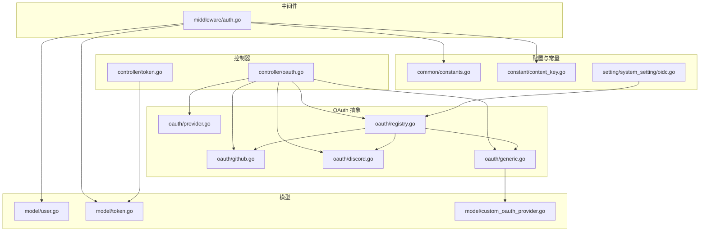

**图表来源**
- [middleware/auth.go:36-157](file://middleware/auth.go#L36-L157)
- [controller/oauth.go:44-128](file://controller/oauth.go#L44-L128)
- [oauth/registry.go:18-46](file://oauth/registry.go#L18-L46)
- [oauth/generic.go:74-88](file://oauth/generic.go#L74-L88)
- [model/token.go:14-32](file://model/token.go#L14-L32)
- [model/user.go:23-53](file://model/user.go#L23-L53)
- [common/constants.go:141-198](file://common/constants.go#L141-L198)
- [constant/context_key.go:5-69](file://constant/context_key.go#L5-L69)
- [setting/system_setting/oidc.go:5-25](file://setting/system_setting/oidc.go#L5-L25)

**章节来源**
- [middleware/auth.go:36-157](file://middleware/auth.go#L36-L157)
- [controller/oauth.go:44-128](file://controller/oauth.go#L44-L128)
- [oauth/registry.go:18-46](file://oauth/registry.go#L18-L46)
- [oauth/generic.go:74-88](file://oauth/generic.go#L74-L88)
- [model/token.go:14-32](file://model/token.go#L14-L32)
- [model/user.go:23-53](file://model/user.go#L23-L53)
- [common/constants.go:141-198](file://common/constants.go#L141-L198)
- [constant/context_key.go:5-69](file://constant/context_key.go#L5-L69)
- [setting/system_setting/oidc.go:5-25](file://setting/system_setting/oidc.go#L5-L25)

## 核心组件
- 会话与令牌认证中间件：统一处理 Session 登录态与 API Key 校验，注入用户信息与令牌上下文
- OAuth 控制器：处理 OAuth 回调、状态校验、用户查找/创建、绑定与登录
- Provider 抽象与注册表：定义 Provider 接口、注册内置与自定义提供器
- 令牌模型与控制器：令牌的增删改查、额度与有效期、IP 限制、模型限制、跨分组重试
- 用户模型：角色、状态、访问令牌、配额等
- 上下文键与常量：统一的角色、状态码、令牌相关上下文键

**章节来源**
- [middleware/auth.go:36-157](file://middleware/auth.go#L36-L157)
- [controller/oauth.go:44-128](file://controller/oauth.go#L44-L128)
- [oauth/provider.go:10-36](file://oauth/provider.go#L10-L36)
- [oauth/registry.go:18-46](file://oauth/registry.go#L18-L46)
- [controller/token.go:167-234](file://controller/token.go#L167-L234)
- [model/token.go:14-32](file://model/token.go#L14-L32)
- [model/user.go:23-53](file://model/user.go#L23-L53)
- [constant/context_key.go:5-69](file://constant/context_key.go#L5-L69)
- [common/constants.go:141-198](file://common/constants.go#L141-L198)

## 架构总览
New API 采用“会话 + 令牌”双轨认证模型：
- Web 端通过 Session 登录，中间件优先读取 Session 并进行权限校验
- API 客户端通过 Authorization 头传入 API Key，中间件校验令牌有效性、状态、额度与 IP 限制
- OAuth 登录通过回调交换令牌并完成用户绑定或创建，随后写入 Session

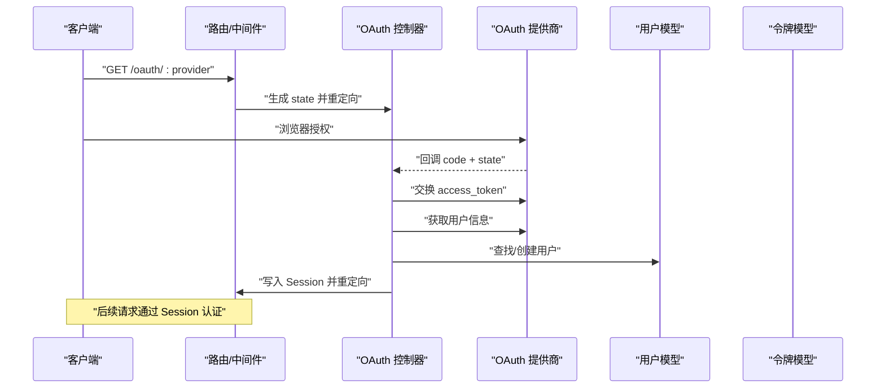

**图表来源**
- [controller/oauth.go:22-128](file://controller/oauth.go#L22-L128)
- [oauth/github.go:48-103](file://oauth/github.go#L48-L103)
- [oauth/discord.go:49-108](file://oauth/discord.go#L49-L108)
- [oauth/generic.go:90-200](file://oauth/generic.go#L90-L200)
- [model/user.go:436-492](file://model/user.go#L436-L492)

**章节来源**
- [controller/oauth.go:22-128](file://controller/oauth.go#L22-L128)
- [oauth/github.go:48-103](file://oauth/github.go#L48-L103)
- [oauth/discord.go:49-108](file://oauth/discord.go#L49-L108)
- [oauth/generic.go:90-200](file://oauth/generic.go#L90-L200)
- [model/user.go:436-492](file://model/user.go#L436-L492)

## 详细组件分析

### 会话与令牌认证中间件
- 会话优先：若 Session 存在且用户状态正常，则直接放行并注入用户上下文
- 令牌回退：若无 Session，则解析 Authorization 头，支持多种前缀与格式，校验令牌状态、过期、额度、IP 限制
- 权限校验：支持普通用户、管理员、超级管理员三级角色，最小权限校验
- 上下文注入：将用户 ID、角色、令牌 ID、名称、额度、模型限制、分组等写入上下文

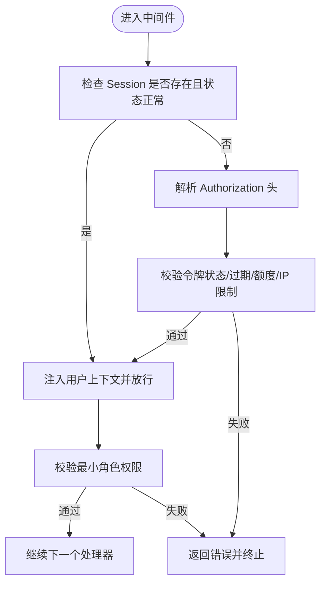

**图表来源**
- [middleware/auth.go:36-157](file://middleware/auth.go#L36-L157)
- [middleware/auth.go:276-407](file://middleware/auth.go#L276-L407)

**章节来源**
- [middleware/auth.go:36-157](file://middleware/auth.go#L36-L157)
- [middleware/auth.go:276-407](file://middleware/auth.go#L276-L407)
- [constant/context_key.go:5-69](file://constant/context_key.go#L5-L69)
- [common/constants.go:141-198](file://common/constants.go#L141-L198)

### OAuth 集成与回调流程
- 状态保护：生成随机 state 并保存至 Session，回调时校验防止 CSRF
- 绑定与登录：若已登录则执行绑定，否则查找/创建用户并写入 Session
- 错误处理：对提供商错误、信任等级不足、注册关闭等情况进行国际化提示
- 自定义提供商：支持通过数据库配置通用 OIDC/OAuth2 提供商，动态加载与注册

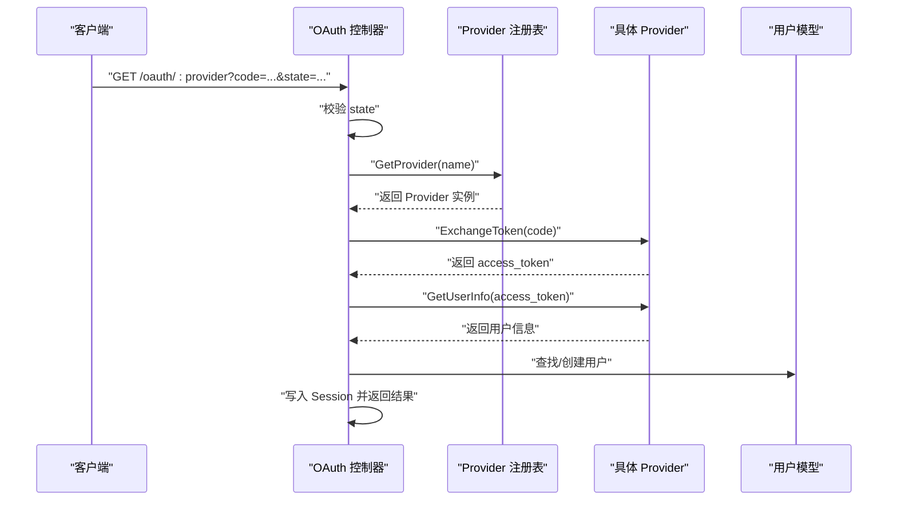

**图表来源**
- [controller/oauth.go:44-128](file://controller/oauth.go#L44-L128)
- [oauth/registry.go:41-57](file://oauth/registry.go#L41-L57)
- [oauth/github.go:48-103](file://oauth/github.go#L48-L103)
- [oauth/discord.go:49-108](file://oauth/discord.go#L49-L108)
- [oauth/generic.go:90-200](file://oauth/generic.go#L90-L200)

**章节来源**
- [controller/oauth.go:44-128](file://controller/oauth.go#L44-L128)
- [oauth/registry.go:41-57](file://oauth/registry.go#L41-L57)
- [oauth/github.go:48-103](file://oauth/github.go#L48-L103)
- [oauth/discord.go:49-108](file://oauth/discord.go#L49-L108)
- [oauth/generic.go:90-200](file://oauth/generic.go#L90-L200)

### 令牌模型与令牌控制器
- 令牌模型：包含用户 ID、密钥、状态、名称、创建/访问时间、过期时间、剩余/已用额度、模型限制、IP 白名单、分组、跨分组重试等
- 令牌校验：校验状态、过期、额度、IP 限制；支持宽松只读模式（仅校验令牌存在性）
- 令牌 CRUD：支持分页查询、搜索、创建、更新、批量删除、导出密钥等
- 令牌额度：支持增加/减少额度，异步缓存更新

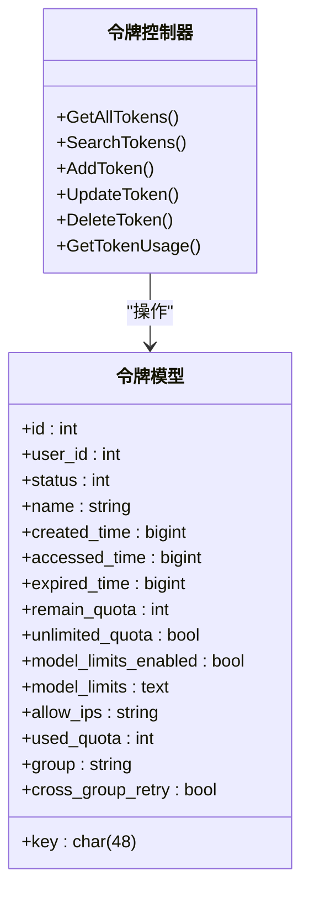

**图表来源**
- [model/token.go:14-32](file://model/token.go#L14-L32)
- [controller/token.go:34-63](file://controller/token.go#L34-L63)
- [controller/token.go:167-234](file://controller/token.go#L167-L234)
- [controller/token.go:250-313](file://controller/token.go#L250-L313)

**章节来源**
- [model/token.go:14-32](file://model/token.go#L14-L32)
- [controller/token.go:34-63](file://controller/token.go#L34-L63)
- [controller/token.go:167-234](file://controller/token.go#L167-L234)
- [controller/token.go:250-313](file://controller/token.go#L250-L313)

### 用户模型与角色权限
- 用户模型：包含用户名、显示名、角色、状态、邮箱、各平台绑定 ID、配额、分组、邀请相关字段等
- 角色与状态：角色分为访客、普通用户、管理员、超级管理员；用户状态包含启用/禁用
- 访问令牌：系统管理使用的 access_token，用于后台管理端登录
- 权限校验：中间件通过角色阈值与用户状态进行最小权限校验

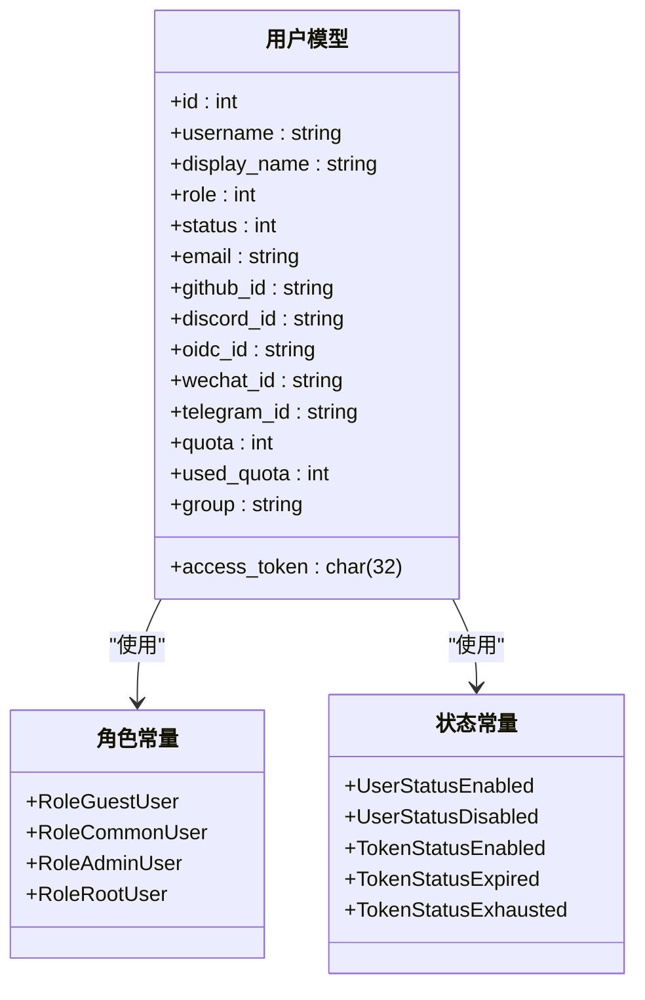

**图表来源**
- [model/user.go:23-53](file://model/user.go#L23-L53)
- [common/constants.go:141-198](file://common/constants.go#L141-L198)

**章节来源**
- [model/user.go:23-53](file://model/user.go#L23-L53)
- [common/constants.go:141-198](file://common/constants.go#L141-L198)

### Provider 抽象与注册表
- Provider 接口：定义提供商名称、启用状态、令牌交换、用户信息获取、ID 占用检查、填充与设置绑定 ID、前缀等
- 注册表：提供注册、注销、获取、加载自定义提供商、重载等功能
- 内置提供器：GitHub、Discord 等
- 通用提供器：通过数据库配置，支持 OIDC 发现端点、字段映射、访问策略、拒绝消息模板等

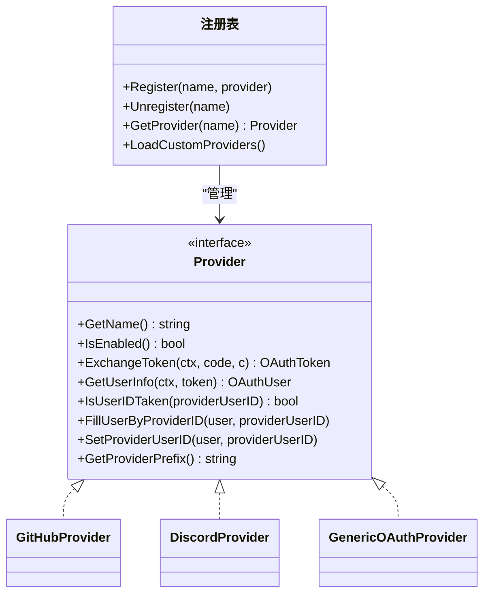

**图表来源**
- [oauth/provider.go:10-36](file://oauth/provider.go#L10-L36)
- [oauth/registry.go:18-46](file://oauth/registry.go#L18-L46)
- [oauth/github.go:24-46](file://oauth/github.go#L24-L46)
- [oauth/discord.go:23-47](file://oauth/discord.go#L23-L47)
- [oauth/generic.go:34-88](file://oauth/generic.go#L34-L88)

**章节来源**
- [oauth/provider.go:10-36](file://oauth/provider.go#L10-L36)
- [oauth/registry.go:18-46](file://oauth/registry.go#L18-L46)
- [oauth/github.go:24-46](file://oauth/github.go#L24-L46)
- [oauth/discord.go:23-47](file://oauth/discord.go#L23-L47)
- [oauth/generic.go:34-88](file://oauth/generic.go#L34-L88)

### OIDC 与自定义 OAuth 提供商
- OIDC 设置：通过系统设置模块暴露 OIDC 配置项，便于注册到全局配置管理器
- 自定义提供商：从数据库加载配置，支持字段映射、访问策略、拒绝消息模板、认证风格（参数/头部）、Well-Known 发现等
- 动态加载：支持运行时加载、重载与注销，保证配置变更生效

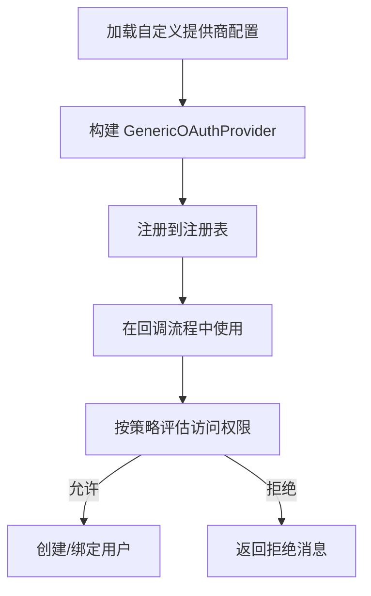

**图表来源**
- [oauth/generic.go:90-200](file://oauth/generic.go#L90-L200)
- [oauth/generic.go:266-281](file://oauth/generic.go#L266-L281)
- [model/custom_oauth_provider.go:74-105](file://model/custom_oauth_provider.go#L74-L105)
- [setting/system_setting/oidc.go:5-25](file://setting/system_setting/oidc.go#L5-L25)

**章节来源**
- [oauth/generic.go:90-200](file://oauth/generic.go#L90-L200)
- [oauth/generic.go:266-281](file://oauth/generic.go#L266-L281)
- [model/custom_oauth_provider.go:74-105](file://model/custom_oauth_provider.go#L74-L105)
- [setting/system_setting/oidc.go:5-25](file://setting/system_setting/oidc.go#L5-L25)

## 依赖分析
- 中间件依赖模型层进行用户与令牌校验，并通过常量与上下文键传递权限信息
- OAuth 控制器依赖注册表与 Provider 接口，实现多提供商统一处理
- 令牌控制器依赖模型层进行 CRUD 与额度更新
- OIDC 设置与注册表共同驱动自定义提供商的动态加载

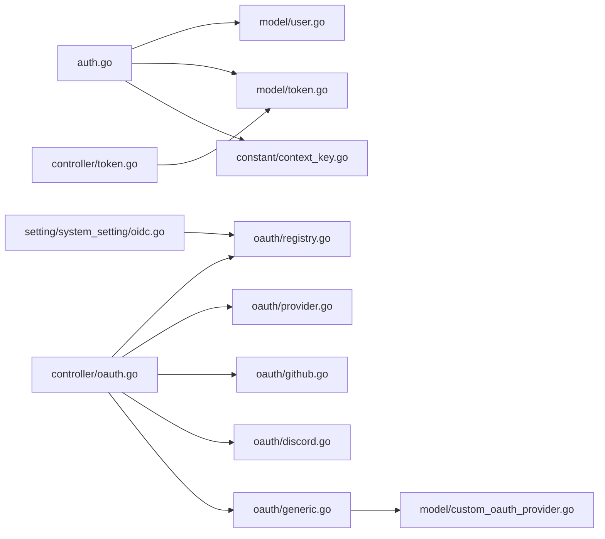

**图表来源**
- [middleware/auth.go:36-157](file://middleware/auth.go#L36-L157)
- [controller/oauth.go:44-128](file://controller/oauth.go#L44-L128)
- [oauth/registry.go:18-46](file://oauth/registry.go#L18-L46)
- [oauth/provider.go:10-36](file://oauth/provider.go#L10-L36)
- [oauth/github.go:24-46](file://oauth/github.go#L24-L46)
- [oauth/discord.go:23-47](file://oauth/discord.go#L23-L47)
- [oauth/generic.go:34-88](file://oauth/generic.go#L34-L88)
- [controller/token.go:167-234](file://controller/token.go#L167-L234)
- [model/token.go:14-32](file://model/token.go#L14-L32)
- [model/custom_oauth_provider.go:74-105](file://model/custom_oauth_provider.go#L74-L105)
- [constant/context_key.go:5-69](file://constant/context_key.go#L5-L69)
- [setting/system_setting/oidc.go:5-25](file://setting/system_setting/oidc.go#L5-L25)

**章节来源**
- [middleware/auth.go:36-157](file://middleware/auth.go#L36-L157)
- [controller/oauth.go:44-128](file://controller/oauth.go#L44-L128)
- [oauth/registry.go:18-46](file://oauth/registry.go#L18-L46)
- [oauth/provider.go:10-36](file://oauth/provider.go#L10-L36)
- [oauth/github.go:24-46](file://oauth/github.go#L24-L46)
- [oauth/discord.go:23-47](file://oauth/discord.go#L23-L47)
- [oauth/generic.go:34-88](file://oauth/generic.go#L34-L88)
- [controller/token.go:167-234](file://controller/token.go#L167-L234)
- [model/token.go:14-32](file://model/token.go#L14-L32)
- [model/custom_oauth_provider.go:74-105](file://model/custom_oauth_provider.go#L74-L105)
- [constant/context_key.go:5-69](file://constant/context_key.go#L5-L69)
- [setting/system_setting/oidc.go:5-25](file://setting/system_setting/oidc.go#L5-L25)

## 性能考虑
- 缓存与批量更新：令牌额度与用户状态支持异步缓存更新与批量更新，降低数据库压力
- IP 限制与模型限制：在中间件阶段尽早过滤无效请求，减少下游开销
- 令牌宽松只读模式：对只读查询放行，避免不必要的额度与状态检查
- 注册表并发安全：提供器注册表使用读写锁，保障并发加载与注销的安全性

[本节为通用指导，无需特定文件引用]

## 故障排查指南
- 令牌无效/过期/额度耗尽：检查令牌状态、过期时间、剩余额度与 IP 限制
- 用户被封禁：检查用户状态与令牌绑定用户状态
- OAuth 回调失败：确认 state 校验、提供商配置、回调地址与网络连通性
- 自定义提供商策略拒绝：检查访问策略 JSON、字段路径与拒绝消息模板
- 会话异常：确认 Session 存储、Cookie 配置与前端重定向

**章节来源**
- [middleware/auth.go:339-407](file://middleware/auth.go#L339-L407)
- [controller/oauth.go:57-65](file://controller/oauth.go#L57-L65)
- [oauth/generic.go:266-281](file://oauth/generic.go#L266-L281)
- [model/token.go:188-226](file://model/token.go#L188-L226)

## 结论
New API 的认证与授权体系以“会话 + 令牌”为核心，结合 OAuth 提供商抽象与自定义策略，实现了灵活、可扩展、安全的认证方案。通过中间件统一接入、模型层严谨约束、控制器完备的 CRUD 与只读模式，以及注册表与 OIDC 设置的动态能力，开发者可以快速集成标准与自定义身份源，并在生产环境中稳定运行。

[本节为总结性内容，无需特定文件引用]

## 附录

### 常用流程图：令牌刷新与权限验证
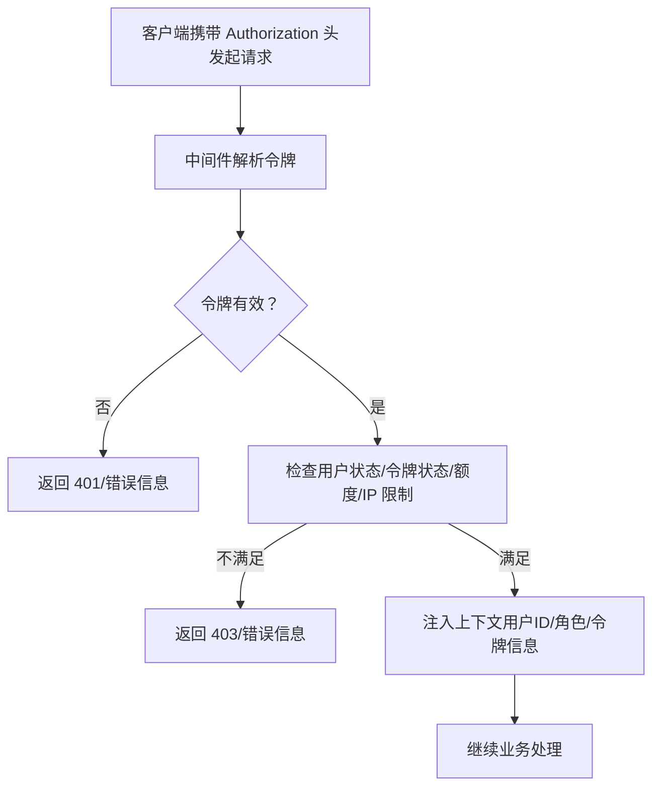

**图表来源**
- [middleware/auth.go:276-407](file://middleware/auth.go#L276-L407)
- [model/token.go:188-226](file://model/token.go#L188-L226)

### 常用流程图：用户登录与权限验证
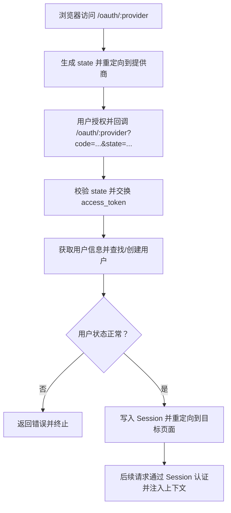

**图表来源**
- [controller/oauth.go:22-128](file://controller/oauth.go#L22-L128)
- [oauth/github.go:48-103](file://oauth/github.go#L48-L103)
- [oauth/discord.go:49-108](file://oauth/discord.go#L49-L108)

### 扩展指南：自定义认证提供器
- 新增 Provider 实现：实现 Provider 接口，注册到注册表
- 自定义 OIDC/OAuth2：在数据库中配置自定义提供商，设置字段映射、访问策略、认证风格与发现端点
- 动态加载：通过注册表加载/重载/注销自定义提供商，确保配置变更即时生效

**章节来源**
- [oauth/provider.go:10-36](file://oauth/provider.go#L10-L36)
- [oauth/registry.go:89-135](file://oauth/registry.go#L89-L135)
- [oauth/generic.go:74-88](file://oauth/generic.go#L74-L88)
- [model/custom_oauth_provider.go:108-121](file://model/custom_oauth_provider.go#L108-L121)