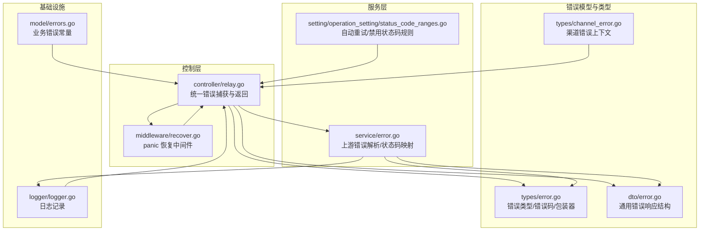
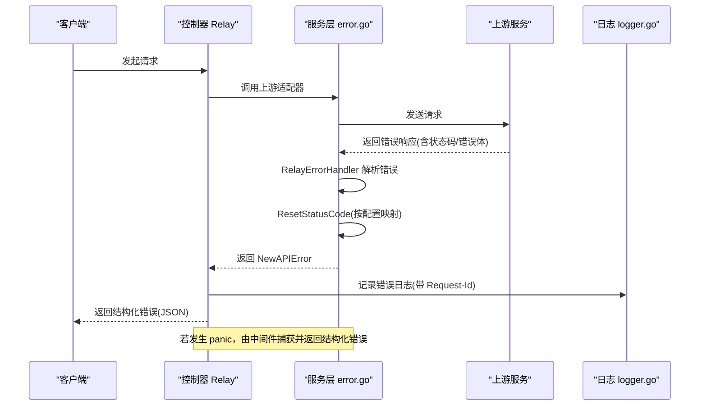
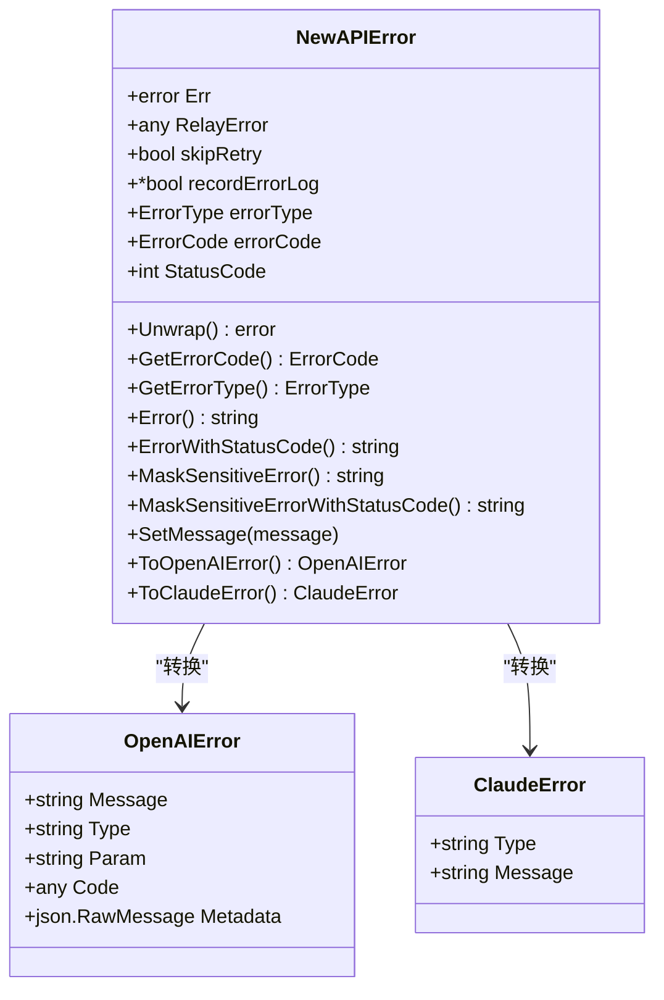
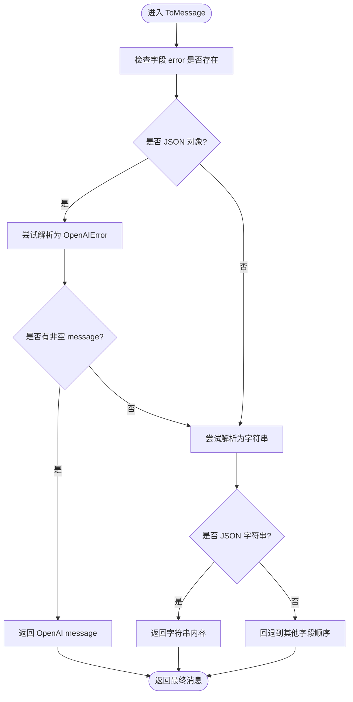
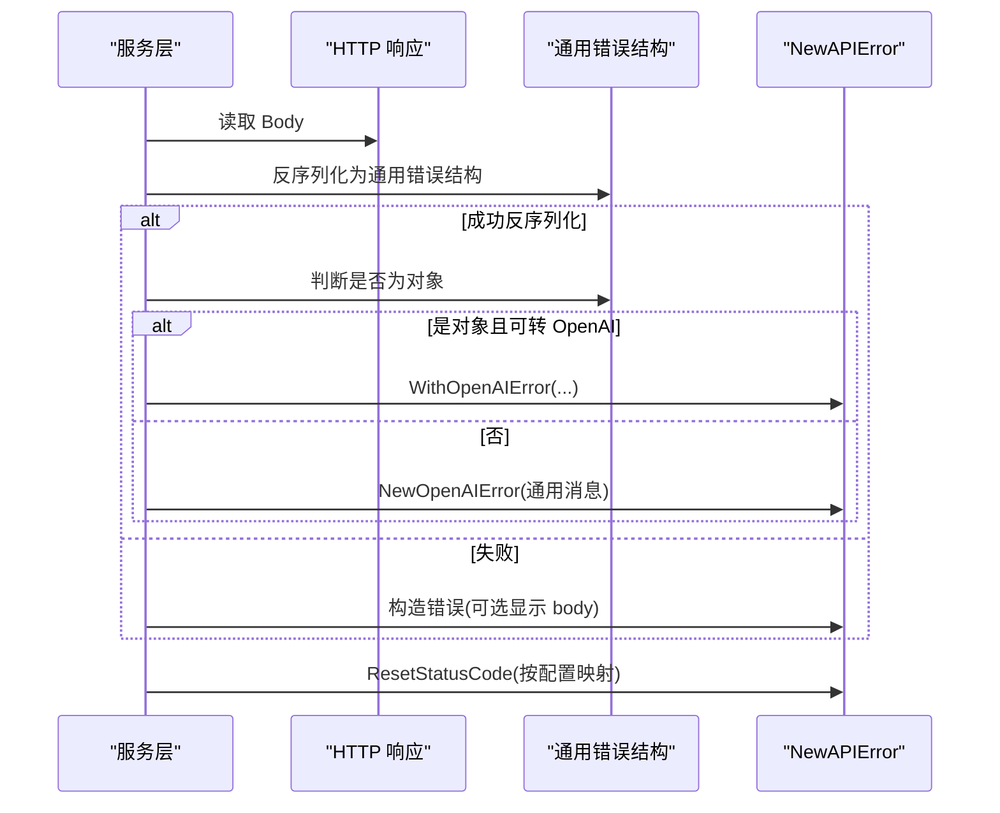
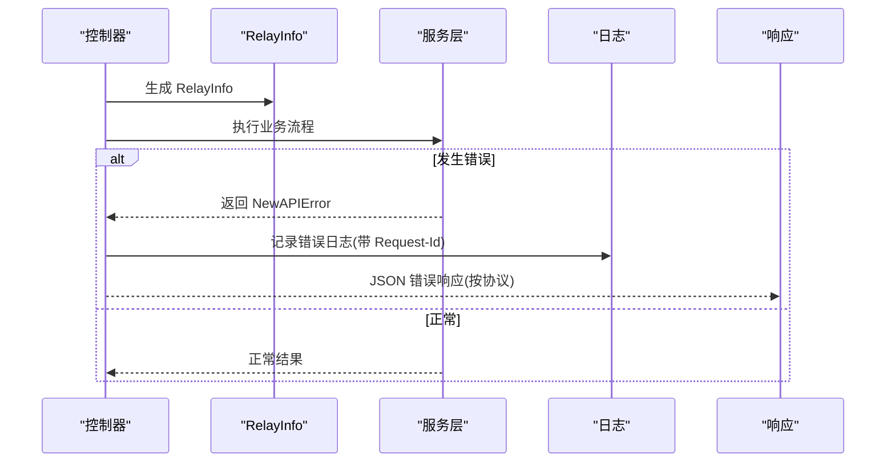
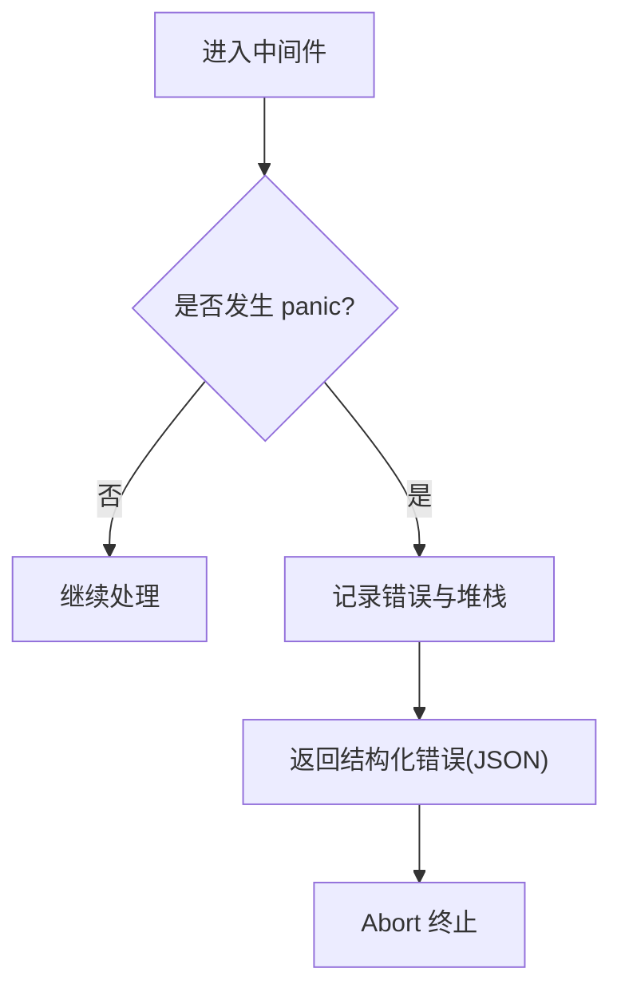
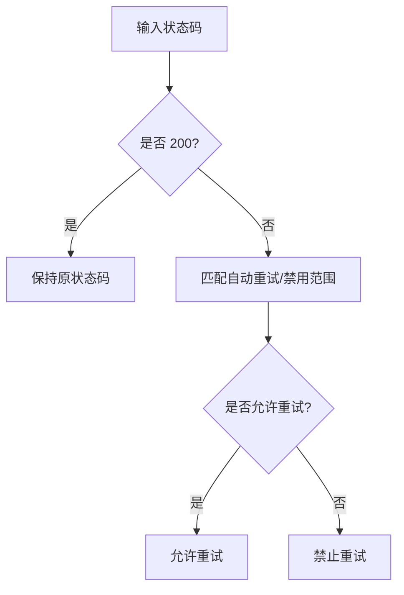
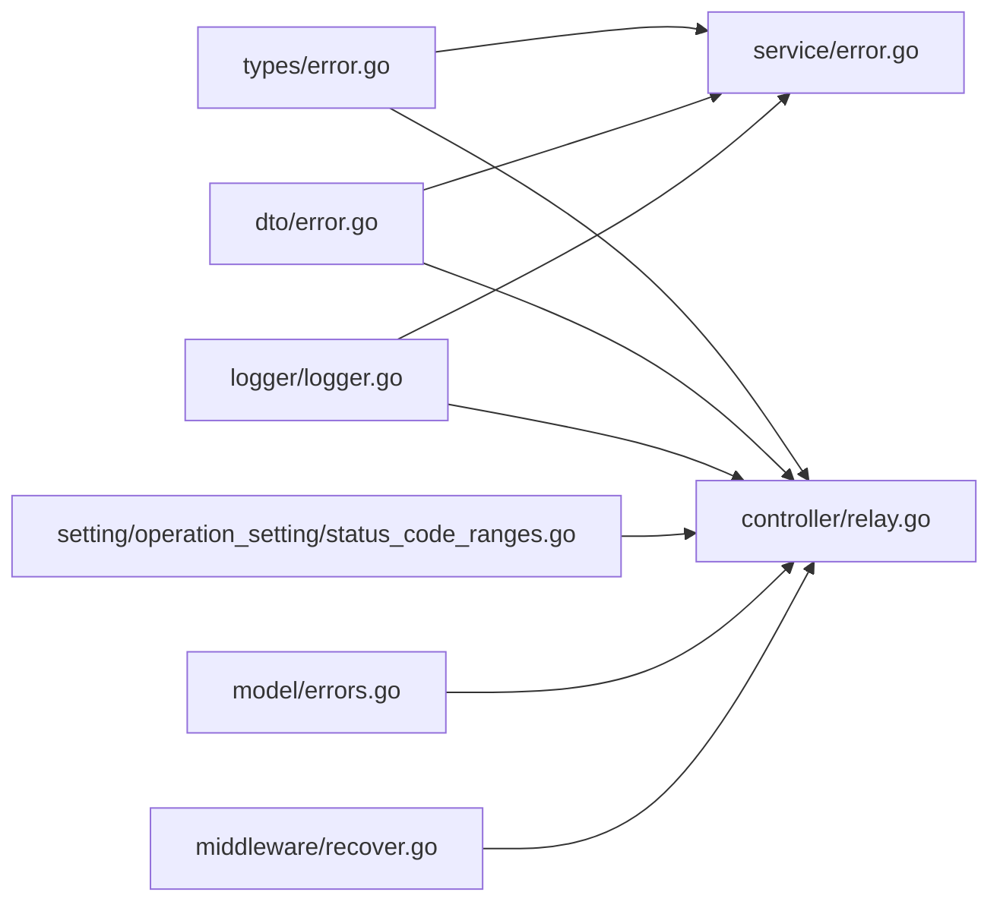

# 错误处理与状态码

<cite>
**本文引用的文件**
- [types/error.go](file://types/error.go)
- [dto/error.go](file://dto/error.go)
- [service/error.go](file://service/error.go)
- [controller/relay.go](file://controller/relay.go)
- [middleware/recover.go](file://middleware/recover.go)
- [setting/operation_setting/status_code_ranges.go](file://setting/operation_setting/status_code_ranges.go)
- [logger/logger.go](file://logger/logger.go)
- [model/errors.go](file://model/errors.go)
- [types/channel_error.go](file://types/channel_error.go)
- [service/error_test.go](file://service/error_test.go)
</cite>

## 目录
1. [简介](#简介)
2. [项目结构](#项目结构)
3. [核心组件](#核心组件)
4. [架构总览](#架构总览)
5. [详细组件分析](#详细组件分析)
6. [依赖分析](#依赖分析)
7. [性能考虑](#性能考虑)
8. [故障排查指南](#故障排查指南)
9. [结论](#结论)
10. [附录](#附录)

## 简介
本文件系统性梳理 New API 的错误处理机制，覆盖错误类型与状态码定义、错误消息格式、内置错误、业务逻辑错误与网络异常处理策略，并提供完整的错误响应示例、分类体系、日志与监控告警机制、常见场景与预防措施，以及客户端处理最佳实践与用户体验优化建议。目标是帮助开发者准确识别、处理与报告各类错误。

## 项目结构
围绕错误处理的关键模块与文件如下：
- 类型与错误模型：types/error.go 定义统一错误类型、错误码、错误包装器与转换方法
- 通用错误响应结构：dto/error.go 提供通用错误响应结构与消息提取工具
- 上游错误解析与状态码映射：service/error.go 提供 RelayErrorHandler、ResetStatusCode 等
- 控制器错误入口与返回：controller/relay.go 统一捕获与返回错误
- 异常恢复中间件：middleware/recover.go 捕获 panic 并返回结构化错误
- 状态码范围与重试规则：setting/operation_setting/status_code_ranges.go
- 日志记录：logger/logger.go
- 业务层基础错误常量：model/errors.go
- 渠道错误上下文：types/channel_error.go

**图表来源**
- [types/error.go:1-418](file://types/error.go#L1-L418)
- [dto/error.go:1-94](file://dto/error.go#L1-L94)
- [service/error.go:1-222](file://service/error.go#L1-L222)
- [controller/relay.go:1-648](file://controller/relay.go#L1-L648)
- [middleware/recover.go:1-30](file://middleware/recover.go#L1-L30)
- [setting/operation_setting/status_code_ranges.go:1-209](file://setting/operation_setting/status_code_ranges.go#L1-L209)
- [logger/logger.go:1-182](file://logger/logger.go#L1-L182)
- [model/errors.go:1-27](file://model/errors.go#L1-L27)
- [types/channel_error.go:1-22](file://types/channel_error.go#L1-L22)

**章节来源**
- [types/error.go:1-418](file://types/error.go#L1-L418)
- [dto/error.go:1-94](file://dto/error.go#L1-L94)
- [service/error.go:1-222](file://service/error.go#L1-L222)
- [controller/relay.go:1-200](file://controller/relay.go#L1-L200)
- [middleware/recover.go:1-30](file://middleware/recover.go#L1-L30)
- [setting/operation_setting/status_code_ranges.go:1-209](file://setting/operation_setting/status_code_ranges.go#L1-L209)
- [logger/logger.go:1-182](file://logger/logger.go#L1-L182)
- [model/errors.go:1-27](file://model/errors.go#L1-L27)
- [types/channel_error.go:1-22](file://types/channel_error.go#L1-L22)

## 核心组件
- 统一错误类型与错误码
  - 错误类型枚举：new_api_error、openai_error、claude_error、midjourney_error、gemini_error、rerank_error、upstream_error
  - 错误码覆盖：请求参数、请求体、通道参数覆盖、通道可用密钥、通道响应超时、令牌计数失败、模型价格错误、上游响应异常、配额不足等
- 错误包装与转换
  - NewAPIError 包装底层 error，携带错误类型、错误码、HTTP 状态码、元数据
  - 提供 ToOpenAIError、ToClaudeError 等转换方法，便于不同下游协议的一致化
- 通用错误响应结构
  - GeneralErrorResponse 支持多种字段别名，TryToOpenAIError 与 ToMessage 提供消息提取与兼容
- 上游错误解析与状态码映射
  - RelayErrorHandler 解析上游错误响应，优先尝试 OpenAI 格式，否则回退到通用消息
  - ResetStatusCode 基于配置将错误状态码映射为其他状态码（如 429 -> 503）
- 控制器统一错误返回
  - Relay 流程中捕获错误，注入 Request-Id，按 OpenAI/Claude/默认格式返回
- 异常恢复中间件
  - RelayPanicRecover 捕获 panic，记录堆栈并返回结构化错误
- 状态码范围与重试规则
  - 自动重试/禁用状态码范围，支持配置化合并与排序
- 日志记录
  - 统一日志接口，带请求 ID 与级别，支持滚动与多写入器

**章节来源**
- [types/error.go:26-88](file://types/error.go#L26-L88)
- [types/error.go:90-240](file://types/error.go#L90-L240)
- [dto/error.go:23-94](file://dto/error.go#L23-L94)
- [service/error.go:86-129](file://service/error.go#L86-L129)
- [service/error.go:131-183](file://service/error.go#L131-L183)
- [controller/relay.go:67-106](file://controller/relay.go#L67-L106)
- [middleware/recover.go:12-29](file://middleware/recover.go#L12-L29)
- [setting/operation_setting/status_code_ranges.go:17-85](file://setting/operation_setting/status_code_ranges.go#L17-L85)
- [logger/logger.go:76-118](file://logger/logger.go#L76-L118)

## 架构总览
New API 的错误处理贯穿“类型定义 -> 服务解析 -> 控制器返回 -> 中间件兜底”的链路，配合状态码映射与日志记录形成闭环。

**图表来源**
- [controller/relay.go:67-106](file://controller/relay.go#L67-L106)
- [service/error.go:86-129](file://service/error.go#L86-L129)
- [service/error.go:131-183](file://service/error.go#L131-L183)
- [middleware/recover.go:12-29](file://middleware/recover.go#L12-L29)
- [logger/logger.go:76-118](file://logger/logger.go#L76-L118)

## 详细组件分析

### 组件一：错误类型与错误码体系
- 错误类型
  - 用于区分错误来源与协议形态，便于下游转换与 UI 展示
- 错误码
  - 覆盖请求层（无效请求、读取请求体失败、访问拒绝）、通道层（无可用密钥、参数覆盖无效、AWS 客户端错误、响应超时）、响应层（读取响应体失败、状态码异常、空响应、模型未找到、提示被拦截）、SQL 层（查询/更新失败）、配额层（余额不足、预扣失败）

**图表来源**
- [types/error.go:90-240](file://types/error.go#L90-L240)
- [types/error.go:13-24](file://types/error.go#L13-L24)

**章节来源**
- [types/error.go:26-88](file://types/error.go#L26-L88)
- [types/error.go:90-240](file://types/error.go#L90-L240)

### 组件二：通用错误响应结构与消息提取
- 结构化字段
  - error、message、msg、err、error_msg、metadata、detail、header.message、response.error.message
- TryToOpenAIError 与 ToMessage
  - 优先从 JSON 对象提取 OpenAI 风格错误，否则按字符串或默认字段回退

**图表来源**
- [dto/error.go:41-94](file://dto/error.go#L41-L94)

**章节来源**
- [dto/error.go:23-94](file://dto/error.go#L23-L94)

### 组件三：上游错误解析与状态码映射
- RelayErrorHandler
  - 读取上游响应体，尝试解析为通用错误结构；若为对象则优先 OpenAI 格式；否则回退为通用消息
  - 可选择在失败时显示原始 body，便于调试
- ResetStatusCode
  - 将错误状态码按配置映射为其他状态码（仅对非 200 生效），支持字符串/整数/浮点/数字类型解析

**图表来源**
- [service/error.go:86-129](file://service/error.go#L86-L129)
- [service/error.go:131-183](file://service/error.go#L131-L183)

**章节来源**
- [service/error.go:86-129](file://service/error.go#L86-L129)
- [service/error.go:131-183](file://service/error.go#L131-L183)
- [service/error_test.go:10-57](file://service/error_test.go#L10-L57)

### 组件四：控制器统一错误返回与渠道错误上下文
- Relay
  - 在 defer 中统一捕获错误，注入 Request-Id，按协议格式返回
  - 对 WebSocket 实时流返回 WssError
- 渠道错误上下文
  - ChannelError 携带渠道 ID、类型、名称、密钥使用状态与自动封禁标记，便于定位与审计

**图表来源**
- [controller/relay.go:67-106](file://controller/relay.go#L67-L106)
- [types/channel_error.go:3-22](file://types/channel_error.go#L3-L22)

**章节来源**
- [controller/relay.go:67-106](file://controller/relay.go#L67-L106)
- [types/channel_error.go:3-22](file://types/channel_error.go#L3-L22)

### 组件五：异常恢复中间件与日志记录
- RelayPanicRecover
  - 捕获 panic，记录错误与堆栈，返回结构化错误，终止后续处理
- 日志记录
  - 统一 INFO/WARN/ERR/DEBUG 接口，带请求 ID 与时间戳；支持滚动与多写入器

**图表来源**
- [middleware/recover.go:12-29](file://middleware/recover.go#L12-L29)
- [logger/logger.go:76-118](file://logger/logger.go#L76-L118)

**章节来源**
- [middleware/recover.go:12-29](file://middleware/recover.go#L12-L29)
- [logger/logger.go:76-118](file://logger/logger.go#L76-L118)

### 组件六：状态码范围与重试策略
- 默认自动重试范围：1xx、3xx、4xx(除 400/408)、5xx(除 504/524)
- 默认禁用范围：401
- 支持配置化合并与排序，自动去重连续区间
- 提供“总是跳过重试”的状态码与错误码集合

**图表来源**
- [setting/operation_setting/status_code_ranges.go:17-85](file://setting/operation_setting/status_code_ranges.go#L17-L85)
- [setting/operation_setting/status_code_ranges.go:117-209](file://setting/operation_setting/status_code_ranges.go#L117-L209)

**章节来源**
- [setting/operation_setting/status_code_ranges.go:17-85](file://setting/operation_setting/status_code_ranges.go#L17-L85)
- [setting/operation_setting/status_code_ranges.go:117-209](file://setting/operation_setting/status_code_ranges.go#L117-L209)

## 依赖分析
- 类型层依赖
  - types/error.go 作为核心，被 service/error.go、controller/relay.go、dto/error.go 使用
- 服务层依赖
  - service/error.go 依赖 common、dto、logger、types，负责上游错误解析与状态码映射
- 控制层依赖
  - controller/relay.go 依赖 service、types、dto、logger、setting.operation_setting，负责统一错误返回与重试参数
- 基础设施依赖
  - logger/logger.go 为全局日志入口，被 controller 与 service 使用
- 业务错误常量
  - model/errors.go 提供数据库、认证、令牌、兑换、二次验证等基础错误常量

**图表来源**
- [types/error.go:1-418](file://types/error.go#L1-L418)
- [dto/error.go:1-94](file://dto/error.go#L1-L94)
- [service/error.go:1-222](file://service/error.go#L1-L222)
- [controller/relay.go:1-648](file://controller/relay.go#L1-L648)
- [middleware/recover.go:1-30](file://middleware/recover.go#L1-L30)
- [setting/operation_setting/status_code_ranges.go:1-209](file://setting/operation_setting/status_code_ranges.go#L1-L209)
- [logger/logger.go:1-182](file://logger/logger.go#L1-L182)
- [model/errors.go:1-27](file://model/errors.go#L1-L27)

**章节来源**
- [types/error.go:1-418](file://types/error.go#L1-L418)
- [dto/error.go:1-94](file://dto/error.go#L1-L94)
- [service/error.go:1-222](file://service/error.go#L1-L222)
- [controller/relay.go:1-648](file://controller/relay.go#L1-L648)
- [middleware/recover.go:1-30](file://middleware/recover.go#L1-L30)
- [setting/operation_setting/status_code_ranges.go:1-209](file://setting/operation_setting/status_code_ranges.go#L1-L209)
- [logger/logger.go:1-182](file://logger/logger.go#L1-L182)
- [model/errors.go:1-27](file://model/errors.go#L1-L27)

## 性能考虑
- 错误解析与状态码映射
  - 仅在错误路径执行，避免对正常路径造成额外开销
- 日志滚动
  - 达阈值触发异步滚动，减少阻塞
- 重试策略
  - 默认自动重试范围经过精简，避免对 2xx 与特定错误码进行不必要重试

[本节为通用指导，无需具体文件分析]

## 故障排查指南
- 常见错误场景与定位
  - 请求阶段：读取请求体失败、请求体过大、非法请求参数
  - 通道阶段：无可用密钥、参数/头覆盖无效、AWS 客户端错误、响应超时
  - 响应阶段：读取响应体失败、状态码异常、空响应、模型未找到、提示被拦截
  - 配额阶段：余额不足、预扣失败
- 调试线索
  - 查看日志中的 Request-Id，结合错误消息与状态码定位问题
  - 使用 ResetStatusCode 映射将上游 429 映射为 503，便于客户端统一处理
- 预防措施
  - 启用敏感词检测与令牌计数估算，提前发现潜在问题
  - 配置合理的状态码重试范围与禁用范围，避免无限重试
  - 使用 ChannelError 上下文记录渠道信息，便于封禁与限流

**章节来源**
- [controller/relay.go:108-178](file://controller/relay.go#L108-L178)
- [service/error.go:86-129](file://service/error.go#L86-L129)
- [service/error.go:131-183](file://service/error.go#L131-L183)
- [logger/logger.go:76-118](file://logger/logger.go#L76-L118)
- [types/channel_error.go:3-22](file://types/channel_error.go#L3-L22)

## 结论
New API 的错误处理机制以 types/error.go 为核心，通过统一错误类型与错误码、服务层上游错误解析与状态码映射、控制器统一返回与中间件兜底，形成闭环。配合状态码范围与重试策略、日志记录与渠道上下文，既保证了错误的可观测性，也提升了系统的稳定性与可维护性。建议在生产环境中启用敏感词检测、合理配置状态码映射与重试规则，并通过 Request-Id 快速定位问题。

[本节为总结，无需具体文件分析]

## 附录

### A. 错误类型与错误码对照表
- 错误类型
  - new_api_error、openai_error、claude_error、midjourney_error、gemini_error、rerank_error、upstream_error
- 错误码（节选）
  - 请求层：invalid_request、read_request_body_failed、convert_request_failed、access_denied
  - 通道层：channel:no_available_key、channel:param_override_invalid、channel:header_override_invalid、channel:aws_client_error、channel:response_time_exceeded
  - 响应层：bad_request_body、read_response_body_failed、bad_response_status_code、bad_response、bad_response_body、empty_response、model_not_found、prompt_blocked
  - SQL 层：query_data_error、update_data_error
  - 配额层：insufficient_user_quota、pre_consume_token_quota_failed

**章节来源**
- [types/error.go:26-88](file://types/error.go#L26-L88)

### B. 错误响应示例（结构化）
- OpenAI 风格
  - 字段：error.message、error.type、error.param、error.code、status_code
- Claude 风格
  - 字段：type、error.type、error.message
- 通用风格
  - 字段：error、message、msg、err、error_msg、metadata、detail、header.message、response.error.message

**章节来源**
- [dto/error.go:23-94](file://dto/error.go#L23-L94)
- [types/error.go:180-240](file://types/error.go#L180-L240)

### C. 状态码映射与重试规则配置
- 自动重试范围：1xx、3xx、4xx(除 400/408)、5xx(除 504/524)
- 禁用重试范围：401
- 配置项
  - 自动重试范围字符串化/解析与合并
  - 禁用重试范围字符串化/解析
- 行为
  - 仅对非 200 的状态码生效
  - 支持字符串/整数/浮点/数字类型解析

**章节来源**
- [setting/operation_setting/status_code_ranges.go:17-85](file://setting/operation_setting/status_code_ranges.go#L17-L85)
- [setting/operation_setting/status_code_ranges.go:117-209](file://setting/operation_setting/status_code_ranges.go#L117-L209)
- [service/error.go:131-183](file://service/error.go#L131-L183)

### D. 客户端错误处理最佳实践
- 统一解析
  - 优先解析 error.message；若为空，回退到其他字段
- 状态码映射
  - 将上游 429 映射为 503，便于前端统一处理
- 用户体验
  - 对网络异常与上游超时提供明确提示与重试按钮
  - 对敏感词拦截与配额不足提供引导与充值入口

**章节来源**
- [dto/error.go:52-94](file://dto/error.go#L52-L94)
- [service/error.go:131-183](file://service/error.go#L131-L183)